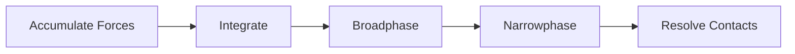

Every physics lesson produces two things: **library code** and a **demo
program**. The library — `common/physics/forge_physics.h` — is the crown
jewel. The lessons teach concepts; the library is what remains when the
learning is done. It must be thorough, correct, performant, tested,
safe, and valid. The demo program visualizes the library in action, rendered
in real time with SDL GPU.

**When to use this skill:**

- You need to teach particle dynamics, rigid body physics, or collision detection
- A learner wants to understand integration, forces, impulses, or constraints
- The concept benefits from a live 3D visualization showing behavior over time
- New functionality needs to be added to `common/physics/forge_physics.h`

**Smart behavior:**

- Before creating a lesson, check if an existing physics lesson already covers it
- **Library first, demo second.** Design, implement, document, and test the
  library code before writing a single line of the demo program. The demo
  exercises the library — it does not replace it.
- Physics lessons are visual — every concept must be observable in the running program
- Focus on *why* the math works, not just the code — connect equations to behavior
- Use simple geometric shapes (cubes, spheres, capsules) — the physics is the star
- All scene geometry comes from `common/shapes/forge_shapes.h` — never write
  inline geometry generation functions
- Cross-reference math lessons (vectors, matrices, quaternions) and GPU lessons
  where relevant

## Arguments

The user (or you) can provide:

- **Number**: two-digit lesson number (e.g. 01, 02)
- **Topic name**: kebab-case (e.g. point-particles, springs-and-constraints)
- **Description**: what this teaches (e.g. "Symplectic Euler integration, gravity, drag")

If any are missing, infer from context or ask.

## Steps

### 1. Analyze what's needed

- **Check existing physics lessons**: Is there already a lesson for this topic?
- **Check `common/physics/`**: Does relevant library code already exist?
- **Check `common/shapes/forge_shapes.h`**: Does the shapes library already
  provide every shape the lesson needs? If a required shape is missing, plan
  to add it to forge_shapes.h (not inline in the lesson).
- **Identify the scope**: What specific physics concepts does this lesson cover?
- **Find cross-references**: Which math/GPU lessons relate?
- **Check PLAN.md**: Where does this lesson fit in the physics track?

### 2. Create the lesson directory

`lessons/physics/NN-topic-name/`

With subdirectories:

```text
lessons/physics/NN-topic-name/
  main.c
  CMakeLists.txt
  README.md
  assets/
```

Baseline rendering shaders (shadow, scene, grid, sky, UI) are provided by
`forge_scene.h` — no per-lesson copies needed. If the lesson introduces a
topic-specific shader (e.g. a debug visualization pass), add a `shaders/`
subdirectory for those files only.

### 3. Design and implement the physics library code

Every physics lesson adds to `common/physics/forge_physics.h`. This is not
optional — it is the primary deliverable. The demo program exists to exercise
and visualize the library; the library is what ships.

For the first physics lesson, create the file. For subsequent lessons, extend
it. Design the API before writing the demo. The demo calls the library — never
the reverse.

#### Library standards

These standards are non-negotiable. The physics library is safety-critical
code — incorrect integration, missed edge cases, or division by zero produce
simulations that explode, tunnel through geometry, or silently drift. Every
function must be defensible.

**Correctness:**

- Every function must implement a named, well-understood algorithm (symplectic
  Euler, Verlet, GJK, sequential impulse). Cite the source in the doc comment
  — a textbook, paper, or established reference.
- Equations in the README must correspond exactly to the code. If the README
  shows $v(t + \Delta t) = v(t) + a \cdot \Delta t$, the code must compute
  that expression in that order. No silent rearrangements.
- Collision detection must handle degenerate cases: zero-length normals,
  coincident positions, zero-radius shapes, zero-mass bodies. Document what
  each function does when given degenerate input.
- Integration must preserve physical invariants where the algorithm guarantees
  it. Symplectic Euler preserves phase-space volume — verify this in tests
  by checking energy over long runs.

**Numerical safety:**

- Never divide without checking the denominator. Guard `1.0f / mass` with an
  `inv_mass` field precomputed at construction, where `mass == 0` means
  infinite mass (static object) and `inv_mass == 0`.
- Normalize vectors only after checking length > epsilon. Use `vec3_length()`
  and compare against `1e-6f` before calling `vec3_normalize()`.
- Clamp values that have physical bounds: restitution to `[0, 1]`, damping
  to `[0, 1]`, penetration depth to `>= 0`. Document the valid range in the
  parameter comment.
- Use `SDL_fabsf()` for float comparisons, not `==`. Two floats are "equal" if
  `SDL_fabsf(a - b) < epsilon`.

**Performance:**

- Precompute values that do not change per-frame: inverse mass, inverse
  inertia tensor, bounding radii.
- Avoid `SDL_sqrtf()` when the squared value suffices — distance comparisons,
  broadphase overlap tests, and radius checks should use squared distances.
- Broadphase before narrowphase: never run O(n) narrowphase tests when a
  spatial partition or sort-and-sweep can reject pairs early.
- Profile-guided decisions only. Do not optimise speculatively — measure
  first. But do not pessimise either: an O(n^2) all-pairs check is
  unacceptable when n > 64.

**Safety and validation:**

- Every public function documents its preconditions. If `dt` must be positive,
  say so. If a pointer must be non-NULL, say so.
- Init functions (`forge_physics_particle_create`, etc.) must produce a valid
  object with all fields initialised — no partially constructed state.
- Functions that mutate state (integration, impulse application) must leave
  the object in a valid state even if called with extreme inputs (very large
  dt, very large forces). Clamp or early-return rather than producing NaN
  or infinity.
- Never read uninitialised memory. Every struct field must have an explicit
  initial value in the init function.

**Header-only implementation:**

- `static inline` for all functions — no separate `.c` compilation unit
- Guard with `#ifndef FORGE_PHYSICS_H` / `#define` / `#endif`
- Include `"math/forge_math.h"`, `"containers/forge_containers.h"`, and `<SDL3/SDL.h>` — never include `<math.h>`, `<string.h>`, or `<stdlib.h>` directly
- Use dynamic arrays (`forge_containers.h`) for variable-size outputs (contacts, SAP pairs)
- Deterministic: identical inputs and fixed timestep produce identical outputs

**Documentation (every function, no exceptions):**

```c
/* Apply gravitational acceleration to a particle.
 *
 * Adds gravity * mass to the particle's force accumulator. Static
 * particles (inv_mass == 0) are unaffected.
 *
 * This uses Newton's second law: F = m * g. The force accumulator
 * stores the total force; integration divides by mass to get
 * acceleration.
 *
 * Parameters:
 *   p       — particle to apply gravity to (must not be NULL)
 *   gravity — gravitational acceleration, typically (0, -9.81, 0)
 *
 * Usage:
 *   forge_physics_apply_gravity(&particle, (vec3){0, -9.81f, 0});
 *
 * See: Physics Lesson 01 — Point Particles
 * Ref: Millington, "Game Physics Engine Development", Ch. 3
 */
static inline void forge_physics_apply_gravity(ForgePhysicsParticle *p,
                                               vec3 gravity)
{
    if (p->inv_mass == 0.0f) return;  /* static — no forces apply */
    /* F = m * g, but we accumulate force and divide by mass later */
    p->force_accum = vec3_add(p->force_accum,
                              vec3_scale(gravity, p->mass));
}
```

Every doc comment must include:

- Summary (one sentence — what it does)
- Algorithm or physical law being implemented
- Parameters with types, valid ranges, and nullability
- Return value (if any) with units
- Usage example
- Cross-reference to the lesson that introduces it
- Reference to the source material (textbook, paper)

**Naming:**

- Functions: `forge_physics_verb_noun()` — e.g. `forge_physics_integrate()`,
  `forge_physics_apply_gravity()`, `forge_physics_collide_sphere_plane()`
- Types: `ForgePhysicsNoun` — e.g. `ForgePhysicsParticle`,
  `ForgePhysicsContact`, `ForgePhysicsRigidBody`
- Constants: `FORGE_PHYSICS_UPPER` — e.g. `FORGE_PHYSICS_MAX_VELOCITY`

**Core types to establish in Lesson 01:**

```c
#ifndef FORGE_PHYSICS_H
#define FORGE_PHYSICS_H

#include <SDL3/SDL.h>
#include "math/forge_math.h"
#include "containers/forge_containers.h"
#include "arena/forge_arena.h"

/* --- Particle ----------------------------------------------------------- */

typedef struct ForgePhysicsParticle {
    vec3  position;
    vec3  velocity;
    vec3  acceleration;    /* accumulated forces / mass this frame         */
    vec3  force_accum;     /* forces accumulated before integration        */
    float mass;            /* kg — zero means infinite mass (immovable)    */
    float inv_mass;        /* 1/mass — precomputed, 0 for static objects   */
    float damping;         /* velocity damping per frame [0..1]            */
    float restitution;     /* coefficient of restitution [0..1]            */
} ForgePhysicsParticle;

/* ... functions grow lesson by lesson ... */

#endif /* FORGE_PHYSICS_H */
```

#### Testing the library (MANDATORY)

The physics library is tested independently of the demo program. Tests
validate correctness, edge cases, numerical stability, and determinism.
Every function added to `forge_physics.h` must have corresponding tests
in `tests/physics/test_physics.c`.

**Test categories (every function must have all applicable categories):**

1. **Basic correctness** — Known inputs produce expected outputs within
   tolerance. Use hand-computed reference values, not "whatever the code
   outputs."

   ```c
   /* Gravity on a 2 kg particle for 1 second should produce v = -9.81 m/s */
   ForgePhysicsParticle p = forge_physics_particle_create(
       (vec3){0, 10, 0},  /* position */
       2.0f,              /* mass */
       0.0f,              /* damping */
       1.0f);             /* restitution */
   forge_physics_apply_gravity(&p, (vec3){0, -9.81f, 0});
   forge_physics_integrate(&p, 1.0f);
   ASSERT_NEAR(p.velocity.y, -9.81f, 1e-4f);
   ```

2. **Edge cases** — Zero mass (static), zero dt, zero-length vectors,
   coincident positions, maximum velocity, very large forces.

   ```c
   /* Static particle (inv_mass == 0) must not move under any force */
   ForgePhysicsParticle p = forge_physics_particle_create(
       (vec3){5, 0, 0},   /* position */
       0.0f,              /* mass (0 → static) */
       0.0f,              /* damping */
       1.0f);             /* restitution */
   forge_physics_apply_gravity(&p, (vec3){0, -9.81f, 0});
   forge_physics_integrate(&p, 1.0f);
   ASSERT_NEAR(p.position.x, 5.0f, 1e-6f);
   ASSERT_NEAR(p.velocity.y, 0.0f, 1e-6f);
   ```

3. **Conservation and stability** — Run a closed system for thousands of
   steps. Total energy (kinetic + potential) should remain bounded for
   symplectic integrators. Explicit check: no NaN, no infinity, no
   position > 1e6.

   ```c
   /* 10000 steps of a bouncing ball — energy must not grow unboundedly */
   for (int i = 0; i < 10000; i++) {
       forge_physics_apply_gravity(&p, gravity);
       forge_physics_integrate(&p, PHYSICS_DT);
       /* ... collision with ground ... */
   }
   float energy = kinetic_energy(&p) + potential_energy(&p, gravity);
   ASSERT(energy < initial_energy * 1.1f); /* bounded growth */
   ASSERT(!isnan(p.position.x) && !isinf(p.position.x));
   ```

4. **Determinism** — Two runs with identical inputs must produce identical
   outputs, bit-for-bit. This is a requirement for replay systems and
   debugging.

   ```c
   /* Two particles with identical setup must produce identical state */
   ForgePhysicsParticle a = make_test_particle();
   ForgePhysicsParticle b = make_test_particle();
   for (int i = 0; i < 1000; i++) {
       step(&a, PHYSICS_DT);
       step(&b, PHYSICS_DT);
   }
   ASSERT(vec3_equal(a.position, b.position));
   ASSERT(vec3_equal(a.velocity, b.velocity));
   ASSERT(a.inv_mass == b.inv_mass);
   ```

5. **Collision-specific** — Normals point from B to A. Penetration depth
   is non-negative. Post-resolution velocity respects restitution. Tangential
   velocity is preserved (or reduced by friction, not reversed).

**Test infrastructure:**

- Test file: `tests/physics/test_physics.c`
- Register in root `CMakeLists.txt` as `test_physics`
- Use the same `ASSERT_NEAR` / test macros as `tests/math/test_math.c`
- Run: `cmake --build build --target test_physics && ctest --test-dir build -R physics`
- Tests must pass before the demo program is written

For the first physics lesson, also create `common/physics/README.md` with
the full API reference, following the format of `common/math/README.md`.

### 4. Create the demo program (`main.c`)

A focused C program that simulates a physics scenario and renders it in
real time using SDL GPU. Physics lessons are **interactive 3D applications**
with full rendering — not console programs.

**MANDATORY: Use `forge_scene.h` for the rendering baseline.** The scene
library provides Blinn-Phong lighting, shadow mapping, grid floor, sky
gradient, FPS camera, and UI in a single `forge_scene_init()` call. This
eliminates hundreds of lines of rendering boilerplate and lets the lesson
focus on physics. See the `forge-scene-renderer` skill for the full API.

**The rendering baseline (provided by `forge_scene.h`):**

1. **Blinn-Phong lighting** — Per-material ambient + diffuse + specular
2. **Procedural grid floor** — Anti-aliased shader grid on XZ plane
3. **Directional shadow map** — Single shadow map with PCF
4. **Sky gradient** — Procedural sky background
5. **First-person camera** — WASD + mouse look with delta time
6. **UI system** — Immediate-mode forge UI for controls
7. **Capture support** — `forge_capture.h` integration (when `FORGE_CAPTURE` defined)

**Physics simulation requirements:**

- **Fixed timestep** — Physics runs at a fixed rate (e.g. 60 Hz) with
  accumulator-based stepping. Rendering interpolates between physics states
  for smooth visuals at any frame rate:

  ```c
  #define PHYSICS_DT (1.0f / 60.0f)

  /* In SDL_AppIterate: */
  state->accumulator += dt;
  while (state->accumulator >= PHYSICS_DT) {
      physics_step(state, PHYSICS_DT);
      state->accumulator -= PHYSICS_DT;
  }
  float alpha = state->accumulator / PHYSICS_DT;
  /* Interpolate positions for rendering: lerp(prev, curr, alpha) */
  ```

- **Force accumulator pattern** — Forces are accumulated each step, then
  cleared after integration:

  ```c
  /* Apply forces */
  forge_physics_apply_gravity(&particle, (vec3){0, -9.81f, 0});
  forge_physics_apply_drag(&particle, drag_coeff);

  /* Integrate (symplectic Euler) */
  forge_physics_integrate(&particle, dt);

  /* Clear forces for next step */
  particle.force_accum = vec3_zero();
  ```

- **Reset key** — Press R to reset the simulation to its initial state. This
  is essential for physics demos where objects settle or leave the scene.

- **Pause key** — Press SPACE (or P) to pause/resume the simulation. Rendering
  and camera controls continue while paused.

- **Slow motion** — Press T to toggle half-speed simulation for observing
  fast phenomena.

**Scene geometry via `forge_shapes.h` (MANDATORY):**

All scene geometry **must** come from `common/shapes/forge_shapes.h`. Never
write inline geometry generation functions — use the shared library so every
lesson benefits from the same tested, documented shapes.

- **Sphere**: `forge_shapes_sphere(32, 16)` or `forge_shapes_icosphere(1)`
- **Box/Cube**: `forge_shapes_cube(1, 1)` — use `forge_shapes_compute_flat_normals()` for face normals
- **Capsule**: `forge_shapes_capsule(32, 8, 8, 1.0f)`
- **Cylinder**: `forge_shapes_cylinder(32, 1)`
- **Torus**: `forge_shapes_torus(32, 16, major, tube)`
- **Ground plane**: Handled by the shader grid (no geometry needed)

If the lesson requires a shape that `forge_shapes.h` does not yet provide,
**add it to the library first** — following the existing API conventions
(unit-scale, centred at origin, CCW winding, struct-of-arrays layout). Update
`common/shapes/README.md` and add tests under `tests/shapes/`.

```c
#include "shapes/forge_shapes.h"

/* Generate shapes at init time, upload to GPU, then free CPU copies.
 * Always check vertex_count — generators return an empty shape
 * (all pointers NULL, counts 0) if allocation fails. */
ForgeShape sphere = forge_shapes_sphere(32, 16);
if (sphere.vertex_count == 0) {
    SDL_Log("Failed to generate sphere");
    return SDL_APP_FAILURE;
}
/* ... upload sphere.positions, sphere.normals, sphere.indices to GPU ... */
forge_shapes_free(&sphere);

ForgeShape box = forge_shapes_cube(1, 1);
if (box.vertex_count == 0) {
    SDL_Log("Failed to generate box");
    return SDL_APP_FAILURE;
}
forge_shapes_compute_flat_normals(&box);  /* face normals for rigid bodies */
/* ... upload ... */
forge_shapes_free(&box);
```

**Template structure:**

```c
/*
 * Physics Lesson NN — Topic Name
 *
 * Demonstrates: [what this shows]
 *
 * Controls:
 *   WASD / Arrow keys — move camera
 *   Mouse             — look around
 *   R                 — reset simulation
 *   P                 — pause / resume
 *   T                 — toggle slow motion
 *   Escape            — release mouse / quit
 *
 * SPDX-License-Identifier: Zlib
 */

#define SDL_MAIN_USE_CALLBACKS 1
#include <SDL3/SDL.h>
#include <SDL3/SDL_main.h>
#include <stddef.h>

#include "math/forge_math.h"
#include "physics/forge_physics.h"
#include "shapes/forge_shapes.h"

#define FORGE_SCENE_IMPLEMENTATION
#include "scene/forge_scene.h"

/* ── Constants ────────────────────────────────────────────────────── */

#define PHYSICS_DT     (1.0f / 60.0f)

/* ── Types ────────────────────────────────────────────────────────── */

typedef struct app_state {
    ForgeScene scene;  /* rendering, camera, shadow map, grid, sky, UI */

    /* GPU resources — app-owned geometry */
    SDL_GPUBuffer *sphere_vb, *sphere_ib;
    SDL_GPUBuffer *box_vb, *box_ib;
    int sphere_index_count, box_index_count;

    /* Timing / simulation control */
    float accumulator;   /* fixed-timestep accumulator (seconds)       */
    float sim_time;      /* total simulated time (seconds)             */
    bool  paused;        /* true = physics frozen, camera still works  */
    bool  slow_motion;   /* true = half-speed simulation               */

    /* Physics state — lesson-specific */
    /* ForgePhysicsParticle particles[N]; */
    /* ... */
} app_state;
```

**Init pattern:**

```c
SDL_AppResult SDL_AppInit(void **appstate, int argc, char **argv)
{
    app_state *state = SDL_calloc(1, sizeof(*state));
    if (!state) return SDL_APP_FAILURE;
    *appstate = state;

    ForgeSceneConfig cfg = forge_scene_default_config("Physics NN — Topic");
    cfg.cam_start_pos = vec3_create(0.0f, 4.0f, 12.0f);
    cfg.font_path = "assets/fonts/liberation_mono/LiberationMono-Regular.ttf";

    if (!forge_scene_init(&state->scene, &cfg, argc, argv))
        return SDL_APP_FAILURE;

    /* Generate and upload shapes (see forge_shapes.h) ... */
    return SDL_APP_CONTINUE;
}
```

**Iterate pattern:**

```c
SDL_AppResult SDL_AppIterate(void *appstate)
{
    app_state *state = appstate;
    ForgeScene *s = &state->scene;

    if (!forge_scene_begin_frame(s)) return SDL_APP_CONTINUE;
    float dt = forge_scene_dt(s);

    /* Fixed-timestep physics */
    if (!state->paused) {
        float step_dt = state->slow_motion ? dt * 0.5f : dt;
        state->accumulator += step_dt;
        while (state->accumulator >= PHYSICS_DT) {
            physics_step(state, PHYSICS_DT);
            state->accumulator -= PHYSICS_DT;
        }
    }

    /* Shadow pass */
    forge_scene_begin_shadow_pass(s);
    /* forge_scene_draw_shadow_mesh(s, vb, ib, count, model); */
    forge_scene_end_shadow_pass(s);

    /* Main pass */
    forge_scene_begin_main_pass(s);
    /* forge_scene_draw_mesh(s, vb, ib, count, model, color); */
    forge_scene_draw_grid(s);
    forge_scene_end_main_pass(s);

    /* UI pass (optional) */
    float mx, my;
    Uint32 buttons = SDL_GetMouseState(&mx, &my);
    forge_scene_begin_ui(s, mx, my, (buttons & SDL_BUTTON_LMASK) != 0);
    /* forge_ui_* calls ... */
    forge_scene_end_ui(s);

    return forge_scene_end_frame(s);
}
```

### 5. Shaders

The baseline shaders (scene, grid, shadow, sky, UI) are compiled into
`forge_scene.h` — no per-lesson copies needed. If the lesson introduces a
topic-specific shader (e.g. a debug visualization or force-vector overlay),
add those files to `shaders/` and compile them:

```bash
python scripts/compile_shaders.py physics/NN-topic-name
```

Most physics lessons need no lesson-specific shaders at all.

### 6. Create `CMakeLists.txt`

```cmake
add_executable(NN-topic-name WIN32 main.c)
target_include_directories(NN-topic-name PRIVATE ${FORGE_COMMON_DIR})
target_link_libraries(NN-topic-name PRIVATE SDL3::SDL3
    $<$<NOT:$<C_COMPILER_ID:MSVC>>:m>)

if(FORGE_CAPTURE)
    target_compile_definitions(NN-topic-name PRIVATE FORGE_CAPTURE)
endif()

# Copy SDL3 DLL and font asset next to executable
if(TARGET SDL3::SDL3-shared)
    add_custom_command(TARGET NN-topic-name POST_BUILD
        COMMAND ${CMAKE_COMMAND} -E copy_if_different
            $<TARGET_FILE:SDL3::SDL3-shared>
            $<TARGET_FILE_DIR:NN-topic-name>
    )
endif()

add_custom_command(TARGET NN-topic-name POST_BUILD
    COMMAND ${CMAKE_COMMAND} -E make_directory
        $<TARGET_FILE_DIR:NN-topic-name>/assets/fonts/liberation_mono
    COMMAND ${CMAKE_COMMAND} -E copy_if_different
        ${CMAKE_SOURCE_DIR}/assets/fonts/liberation_mono/LiberationMono-Regular.ttf
        $<TARGET_FILE_DIR:NN-topic-name>/assets/fonts/liberation_mono/
)
```

### 7. Create `README.md`

Structure:

````markdown
# Physics Lesson NN — Topic Name

[Brief subtitle explaining the physics concept]

## What you'll learn

[Bullet list of physics and rendering concepts covered]

## Result

<!-- TODO: screenshot -->

[Brief description of what the demo shows. For dynamic simulations, include
both a screenshot AND an animated GIF showing the behavior over time.]

| Screenshot | Animation |
|---|---|
|  |  |

**Controls:**

| Key | Action |
|---|---|
| WASD / Arrows | Move camera |
| Mouse | Look around |
| R | Reset simulation |
| Space | Pause / resume |
| T | Toggle slow motion |
| Escape | Release mouse / quit |

## The physics

[Main explanation of the physics concepts, with equations and diagrams.
Use KaTeX for formulas and /dev-create-diagram for visualizations.]

### [Core concept 1]

[Explanation with equations. For example:]

Symplectic Euler integration updates velocity before position, which
preserves energy better than explicit Euler:

$$
v(t + \Delta t) = v(t) + a(t) \cdot \Delta t
$$

$$
x(t + \Delta t) = x(t) + v(t + \Delta t) \cdot \Delta t
$$

### [Core concept 2]

[More physics explanation]

## The code

### Fixed timestep

[Explain the accumulator pattern and why fixed timestep matters for physics]

### Simulation step

[Walk through the physics update function with annotated code]

### Rendering

[Explain how physics state maps to rendered objects. This section can be
brief — point readers to the GPU lessons for rendering details.]

## Key concepts

- **Concept 1** — Brief explanation
- **Concept 2** — Brief explanation

## The physics library

This lesson adds the following to `common/physics/forge_physics.h`:

| Function | Purpose |
|---|---|
| `forge_physics_function_name()` | Brief description |

See: [common/physics/README.md](../../../common/physics/README.md)

## Where it's used

- [GPU Lesson NN](../../gpu/NN-name/) uses this for [purpose]
- [Math Lesson NN](../../math/NN-name/) provides the [math concept] used here

## Building

```bash
cmake -B build
cmake --build build --config Debug

# Windows
build\lessons\physics\NN-topic-name\Debug\NN-topic-name.exe

# Linux / macOS
./build/lessons/physics/NN-topic-name/NN-topic-name
```

## Exercises

1. [Exercise extending the physics concept]
2. [Exercise modifying parameters to observe different behavior]
3. [Exercise adding a new force or constraint]

## Further reading

- [Relevant math lesson for the underlying math]
- [External resource — Game Physics Engine Development, Real-Time Collision
  Detection, etc.]
````

### 8. Update project files

- **`CMakeLists.txt` (root)**: Add `add_subdirectory(lessons/physics/NN-topic-name)`
  under a "Physics Lessons" section (create the section if it doesn't exist
  yet, placed after GPU Lessons)
- **`README.md` (root)**: Add a row to the physics lessons table in a
  "Physics Lessons (lessons/physics/)" section — follow the same format as
  the existing track sections. Create the section if this is the first physics
  lesson.
- **`lessons/physics/README.md`**: Create a track README if this is the first
  lesson, or add a row to the existing lessons table
- **`PLAN.md`**: Check off the physics lesson entry

### 9. Cross-reference other lessons

- **Find related math lessons**: Vectors, matrices, quaternions, integration
- **Find related GPU lessons**: Rendering techniques used (lighting, shadows)
- **Update those lesson READMEs**: Add a note like "See
  [Physics Lesson NN](../../physics/NN-topic/) for this concept in action"
- **Update physics lesson README**: List related lessons in "Where it's used"

### 10. Build and test

```bash
# Compile lesson-specific shaders (skip if lesson has no shaders/ directory)
python scripts/compile_shaders.py physics/NN-topic-name

# Build
cmake -B build
cmake --build build --config Debug

# Run
./build/lessons/physics/NN-topic-name/NN-topic-name
```

Use a Task agent with `model: "haiku"` for build commands per project
conventions.

Verify:

- The program opens a window with the grid floor visible
- Objects are lit with Blinn-Phong shading and cast shadows
- Camera controls work (WASD + mouse)
- Physics simulation runs (objects move, interact)
- R resets the simulation
- P pauses/resumes
- T toggles slow motion

### 11. Capture screenshots and GIF

Physics lessons need **both** a static screenshot and an animated GIF because
the physics behavior is inherently dynamic.

```bash
# Configure with capture support
cmake -B build -DFORGE_CAPTURE=ON
cmake --build build --config Debug --target NN-topic-name

# Static screenshot
python scripts/capture_lesson.py lessons/physics/NN-topic-name

# Animated GIF (captures multiple frames)
python scripts/capture_lesson.py lessons/physics/NN-topic-name \
    --gif --gif-frames 120 --gif-fps 30
```

If the GIF capture script does not yet support `--gif`, capture individual
frames and assemble with Pillow:

```python
from PIL import Image
import glob
frames = [Image.open(f) for f in sorted(glob.glob("frame_*.png"))]
frames[0].save("animation.gif", save_all=True, append_images=frames[1:],
               duration=33, loop=0, optimize=True)
```

Copy output to `lessons/physics/NN-topic-name/assets/`.

### 12. Verify key topics are fully explained

**Before finalizing, launch a verification agent** using the Task tool
(`subagent_type: "general-purpose"`). Give the agent the paths to the lesson's
`README.md` and `main.c` and ask it to audit every key topic for completeness.

**For each key topic / "What you'll learn" bullet, the agent must check:**

1. **Explained in the README** — Is the concept described clearly enough that
   a reader encountering it for the first time could understand it?
2. **Demonstrated in the program** — Does `main.c` actually exercise this
   concept with visible behavior?
3. **All referenced terms are defined** — Read the exact wording of each key
   topic and identify every technical term. For each term, confirm it is
   explained somewhere in the lesson.
4. **Equations match code** — Every formula in the README should have a
   corresponding implementation in the code, and vice versa.

**The lesson is incomplete until every key topic passes all four checks.**

### 13. Run markdown linting

Use the `/dev-markdown-lint` skill to check all markdown files:

```bash
npx markdownlint-cli2 "**/*.md"
```

If errors are found:

1. Try auto-fix: `npx markdownlint-cli2 --fix "**/*.md"`
2. Manually fix remaining errors (especially MD040 - missing language tags)
3. Verify: `npx markdownlint-cli2 "**/*.md"`

## Physics Lesson Conventions

### Scope

Physics lessons cover simulation concepts rendered in real time:

- **Particle dynamics** — Position, velocity, acceleration, integration,
  forces (gravity, drag, springs)
- **Rigid body physics** — Mass, inertia tensor, angular velocity, torque
- **Collision detection** — Sphere-sphere, sphere-plane, AABB, OBB, GJK/EPA
- **Contact resolution** — Impulse-based response, friction, restitution
- **Constraints** — Distance constraints, joints, solver iteration
- **Simulation architecture** — Fixed timestep, interpolation, sleeping,
  broadphase/narrowphase

Physics lessons do **not** cover:

- Advanced rendering techniques in depth (point to GPU lessons instead)
- Mathematical derivations from scratch (point to math lessons instead)
- Game-specific systems (AI, networking, UI)

### Rendering baseline

Every physics lesson includes the same rendering foundation so the focus
stays on the physics. This baseline is **not optional** — it ensures
consistent visual quality across the track.

**Use `forge_scene.h`** — one `forge_scene_init()` call provides all of
the following. See the `forge-scene-renderer` skill for the full API.

| Feature | Provided by `forge_scene.h` | Original skill reference |
|---|---|---|
| Blinn-Phong lighting | Per-material ambient + diffuse + specular | `forge-blinn-phong-materials` |
| Procedural grid floor | Anti-aliased shader grid on XZ plane | `forge-shader-grid` |
| Shadow map | Single directional shadow map with PCF | `forge-cascaded-shadow-maps` |
| Sky gradient | Procedural sky background | `forge-procedural-sky` |
| Camera controls | WASD + mouse look with delta time | `forge-camera-and-input` |
| Depth buffer | Depth testing with appropriate format | `forge-depth-and-3d` |
| sRGB swapchain | SDR_LINEAR for correct gamma | `forge-sdl-gpu-setup` |
| UI system | Immediate-mode forge UI | `forge-ui-rendering` |
| Procedural geometry | All shapes from `forge_shapes.h` | `forge-procedural-geometry` |
| Capture support | Screenshot + GIF via forge_capture.h | `dev-add-screenshot` |

### Simulation controls

Every physics lesson must support these controls:

| Key | Action | Purpose |
|---|---|---|
| R | Reset simulation | Return all objects to initial positions and velocities |
| Space | Pause / resume | Freeze physics while camera still works |
| T | Toggle slow motion | Run at half speed for observing fast phenomena |

### Fixed timestep

Physics must run at a fixed rate, decoupled from rendering. The accumulator
pattern prevents instability from variable frame rates:

```c
state->accumulator += render_dt;
while (state->accumulator >= PHYSICS_DT) {
    /* Store previous state for interpolation */
    store_previous_state(state);
    /* Step physics */
    physics_step(state, PHYSICS_DT);
    state->accumulator -= PHYSICS_DT;
}
/* Interpolation factor for smooth rendering */
float alpha = state->accumulator / PHYSICS_DT;
```

Without fixed timestep, physics behaves differently at different frame rates —
objects fall faster on slow machines and slower on fast ones.

### Simple geometry via `forge_shapes.h`

Physics lessons use procedural geometry from `common/shapes/forge_shapes.h`,
generated at init time. No model loading (no glTF, no OBJ), and **no inline
geometry generation functions** — all shapes come from the shared library.

If a lesson needs a shape that `forge_shapes.h` does not provide, add it to
the library first (following the existing conventions: unit-scale, origin-
centred, CCW winding, struct-of-arrays layout), update
`common/shapes/README.md`, and add tests under `tests/shapes/`. Then use it
from the lesson like any other shape.

| Shape | `forge_shapes.h` call | Use case |
|---|---|---|
| Sphere | `forge_shapes_sphere(32, 16)` | Particles, balls |
| Icosphere | `forge_shapes_icosphere(1)` | Low-poly particles |
| Box/Cube | `forge_shapes_cube(1, 1)` + `forge_shapes_compute_flat_normals()` | Rigid bodies, walls |
| Capsule | `forge_shapes_capsule(32, 8, 8, 1.0f)` | Collision shapes |
| Cylinder | `forge_shapes_cylinder(32, 1)` | Axles, rods |
| Torus | `forge_shapes_torus(32, 16, major, tube)` | Ring shapes |
| Cone | `forge_shapes_cone(32, 1)` | Force direction indicators |

See `common/shapes/README.md` for the full API and
[Asset Lesson 04](../../assets/04-procedural-geometry/) for a walkthrough.

### Visual identity for physics objects

Use the Devernay/OpenGL material tables for consistent object appearance:

- **Dynamic objects** — Bright, saturated materials (red plastic, gold, jade)
  so motion is easy to track
- **Static objects** — Muted, dark materials (gray stone, dark rubber) so they
  recede visually
- **Constraint visualization** — Thin lines or wireframe between connected
  objects (use debug line rendering if available)
- **Force vectors** — Optional overlay arrows showing forces, velocities, or
  contact normals for educational value

### Tone

Physics lessons should be rigorous but accessible. Simulation programming
has deep mathematical roots — treat every concept with respect while making
it approachable.

- **Name the methods** — "Symplectic Euler", "Verlet integration", "GJK
  algorithm" — named techniques carry weight and help readers find resources
- **Show the math, then the code** — Present the equation first, then show
  the C implementation line by line
- **Explain stability** — Why some integrators blow up, why fixed timestep
  matters, why damping is needed
- **Encourage experimentation** — Physics is best learned by changing
  parameters and observing results. Exercises should modify gravity,
  restitution, mass, and other values.

### Code style

Follow the same conventions as all forge-gpu code:

- C99, matching SDL's style
- `ForgePhysics` prefix for public types, `forge_physics_` for functions
- `PascalCase` for typedefs, `lowercase_snake_case` for locals
- `UPPER_SNAKE_CASE` for `#define` constants
- No magic numbers — `#define` or `enum` everything
- Extensive comments explaining *why* and *purpose*

## Diagrams and Formulas

**Find opportunities to create compelling diagrams and visualizations via the
matplotlib scripts** — they increase reader engagement and help learners
understand the topics being taught. Use the `/dev-create-diagram` skill to add
diagrams following the project's visual identity and quality standards.

### KaTeX math

Physics lessons will use formulas extensively. Use inline `$...$` and display
`$$...$$` math notation:

- Inline: `$F = ma$`, `$v(t + \Delta t) = v(t) + a \cdot \Delta t$`
- Display math blocks must be split across three lines (CI enforces this):

```text
$$
F = ma
$$
```

### Matplotlib diagrams

For force diagrams, collision geometry, phase space plots, and integration
comparisons, add diagram functions to
`scripts/forge_diagrams/physics/lesson_NN.py` (create the file if it doesn't
exist):

1. Write a function following the existing pattern
2. Re-export from `scripts/forge_diagrams/physics/__init__.py`
3. Import and register in the `DIAGRAMS` dict in `__main__.py`
4. Run `python scripts/forge_diagrams --lesson physics/NN` to generate the PNG
5. Reference in the README: ``

### Mermaid diagrams

For simulation loop architecture and broadphase/narrowphase pipelines:

````markdown

````

## Example: Point Particles Lesson

**Scenario:** First physics lesson — teach integration and basic forces.

1. **Scope**: Position, velocity, acceleration, symplectic Euler, gravity, drag
2. **Create**: `lessons/physics/01-point-particles/`
3. **Library**: Create `common/physics/forge_physics.h` with `ForgePhysicsParticle`,
   `forge_physics_integrate()`, `forge_physics_apply_gravity()`,
   `forge_physics_apply_drag()`
4. **Program**: Drop 20 spheres from random heights, show them bouncing off a
   ground plane with restitution. Sphere colors map to velocity magnitude.
5. **README**: Explain Euler vs symplectic Euler, show energy drift comparison,
   derive the force accumulator pattern
6. **Exercises**: Change gravity direction, add wind force, compare explicit vs
   symplectic Euler stability

## Example: Springs and Constraints Lesson

**Scenario:** Second lesson — teach spring forces and constraint solving.

1. **Scope**: Hooke's law, damped springs, distance constraints, chain systems
2. **Create**: `lessons/physics/02-springs-and-constraints/`
3. **Library**: Add `forge_physics_spring_force()`,
   `forge_physics_constraint_distance()` to the physics header
4. **Program**: A chain of spheres connected by springs hanging from a fixed
   point, swaying under gravity. A second chain using rigid distance
   constraints for comparison.
5. **README**: Derive Hooke's law, explain damping, show constraint projection
6. **Exercises**: Build a 2D cloth grid, add breakable springs, tune
   damping/stiffness

## When NOT to Create a Physics Lesson

- The topic is covered by an existing physics lesson
- The concept is pure math with no simulation aspect (belongs in a math lesson)
- The concept is purely about rendering (belongs in a GPU lesson)
- The topic is about build systems or debugging (belongs in an engine lesson)
- The topic is too narrow for a full lesson (add to an existing lesson instead)

In these cases, update existing documentation or plan for later.

## Tips

- **Start with the simulation** — Get the physics working with placeholder
  rendering first, then polish the visuals. A correct simulation with basic
  rendering is better than a beautiful scene with broken physics.
- **Fixed timestep first** — Set up the accumulator pattern before writing any
  physics code. Retrofitting fixed timestep is painful.
- **Test with extremes** — Run at very low and very high frame rates. The
  physics should behave identically. If it doesn't, something depends on
  frame rate.
- **Show state** — Consider displaying velocity, force, or energy values
  as text overlay or through color coding. Physics is easier to learn when
  you can see the numbers.
- **Reset is essential** — Physics demos often reach equilibrium quickly or
  objects leave the scene. The R key to reset keeps the demo useful.
- **ASCII-only console output** — Use only ASCII characters in printf output
  for cross-platform compatibility.
