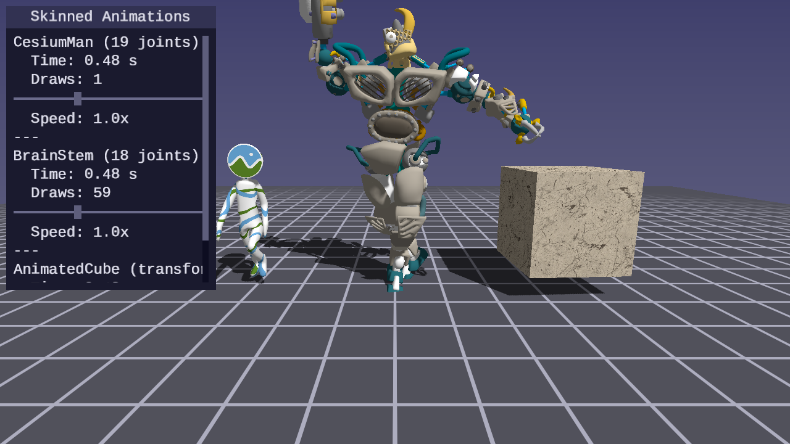

<picture>
  <source media="(prefers-color-scheme: dark)" srcset="assets/forge-gpu-logo-dark.svg">
  <source media="(prefers-color-scheme: light)" srcset="assets/forge-gpu-logo-light.svg">
  
</picture>

forge-gpu aims to be a helpful guide to developing real-time graphics with
SDL3's GPU API and building games. The project is written using C99, and
features standalone lessons, tracks covering rendering, math, engine
fundamentals, UI, physics, and asset pipelines.

The lessons build on shared, header-only C libraries, a Python asset
pipeline, and include reusable AI skills.
SDL3 GPU handles the platform abstraction over Vulkan, D3D12, and Metal.

<table>
<tr>
<td align="center" valign="top">
<a href="lessons/gpu/02-first-triangle/"></a><br />
First Triangle
</td>
<td align="center" valign="top">
<a href="lessons/gpu/23-point-light-shadows/"></a><br />
Point Light Shadows
</td>
<td align="center" valign="top">
<a href="lessons/gpu/30-planar-reflections/"></a><br />
Planar Reflections
</td>
</tr>
<tr>
<td align="center" valign="top">
<a href="lessons/gpu/43-pipeline-skinned-animations/"></a><br />
Pipeline Skinned Animations
</td>
<td align="center" valign="top">
<a href="lessons/gpu/28-ui-rendering/"></a><br />
UI Rendering
</td>
<td align="center" valign="top">
<a href="lessons/gpu/38-indirect-drawing/"></a><br />
Indirect Drawing
</td>
</tr>
</table>

See the [GPU track](lessons/gpu/) for all lessons.

<table>
<tr>
<td align="center" valign="top" width="50%">
<a href="lessons/audio/"><strong>Audio</strong></a><br />

https://github.com/user-attachments/assets/c2b27d64-25e8-4e7f-bd2a-25768bee2fd2

</td>
<td align="center" valign="top" width="50%">
<a href="lessons/physics/"><strong>Physics</strong></a><br />

https://github.com/user-attachments/assets/2202a981-40fc-48e2-924b-25146c86a3cf

</td>
</tr>
</table>

## Topics covered

Following along the GPU track you can build programs covering shadow
mapping, screen-space reflections, bloom, SSAO, skeletal animation, stencil
portals, and deferred decals. Lessons aim to
introduce a new concept, sometimes more, building on the previous ones.

Other tracks fill in the foundations: math topics including transform and
lighting calculations, how CMake and C work, how to build a UI system
from font parsing to interactive controls, and how to process raw assets into
GPU optimized formats.

## What you'll get

Header-only C libraries
([math](common/math/),
[arena](common/arena/),
[OBJ](common/obj/),
[glTF](common/gltf/),
[UI](common/ui/),
[physics](common/physics/),
[procedural shapes](common/shapes/),
[rasterization](common/raster/),
[pipeline loader](common/pipeline/),
[capture](common/capture/),
[audio](common/audio/),
[scene](common/scene/)),
a [Python asset pipeline](pipeline/), and
[Claude Code skills](.claude/skills/) that encode lesson patterns for
AI-assisted building. All tested, documented, and usable in your own projects.

## Getting started

### Prerequisites

- **CMake 3.24+**
- **A C compiler** (MSVC, GCC, or Clang)
- **A GPU** with Vulkan, Direct3D 12, or Metal support
- **Python 3.10+** (for helper scripts and the asset pipeline)
- **[Git LFS](https://git-lfs.com)** — required before cloning. Binary assets
  (3D models, animated GIFs) are stored with Git Large File Storage. Cloning
  without LFS leaves these files as unusable pointer stubs, and the working
  tree may appear corrupted. See the
  [build guide](docs/building.md#installing-git-lfs) for installation steps.

SDL3 is fetched as part of running the build.

### Clone and build

```bash
git lfs install                           # one-time setup (before cloning)
git clone https://github.com/RosyGameStudio/forge-gpu.git
cd forge-gpu
cmake -B build
cmake --build build --config Debug
python scripts/run.py 01                  # by number
python scripts/run.py first-triangle      # by name
python scripts/run.py                     # list all lessons
```

Run `python scripts/setup.py` to verify your environment and diagnose
missing tools. If you run into build problems, see the
[build guide](docs/building.md) — or work through the
[engine track](lessons/engine/), which covers CMake, compilers, and
common errors from the ground up.

## Lesson tracks

Tracks are specialized to specific topics. They cross-reference each other — GPU
lessons link to helpful math lessons, engine lessons explain the build
system and other relevant topics.

- **[GPU](lessons/gpu/)** — Rendering from a triangle to shadow maps, reflections, animation, and stencil effects
- **[Math](lessons/math/)** — Vectors, matrices, quaternions, projections, color spaces, noise, Bézier curves
- **[Engine](lessons/engine/)** — CMake, C fundamentals, debugging, RenderDoc, git
- **[UI](lessons/ui/)** — Immediate-mode UI from TTF parsing to draggable windows and developer tools
- **[Physics](lessons/physics/)** — Particles, rigid bodies, collisions, constraints
- **[Audio](lessons/audio/)** — PCM audio, WAV loading, mixing, SDL audio streams
- **[Asset Pipeline](lessons/assets/)** — Texture compression, mesh optimization, procedural geometry, asset bundles, animation pipeline

## Using Claude Code

The lessons, libraries, and skills are structured so
[Claude Code](https://claude.ai/code) can navigate them.

While learning:

- *"What does SDL_ClaimWindowForGPUDevice actually do?"*
- *"Why do we need a transfer buffer to upload vertex data?"*
- *"Explain the dot product and show me the math lesson"*

While building:

- *"Use the forge-sdl-gpu-setup skill to create an SDL GPU application"*
- *"Add a rotating quad using the math library"*
- *"Help me add textures to my renderer"*

## License

[zlib](LICENSE) — This project uses same license used by SDL.
