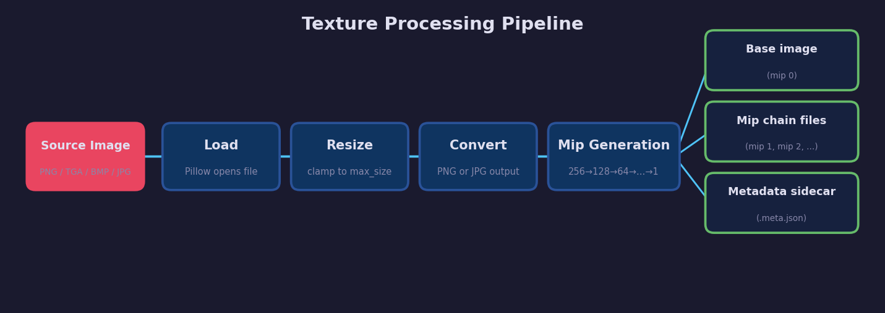
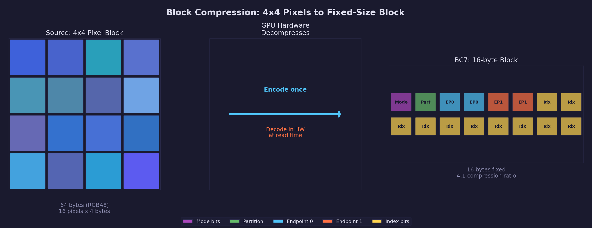
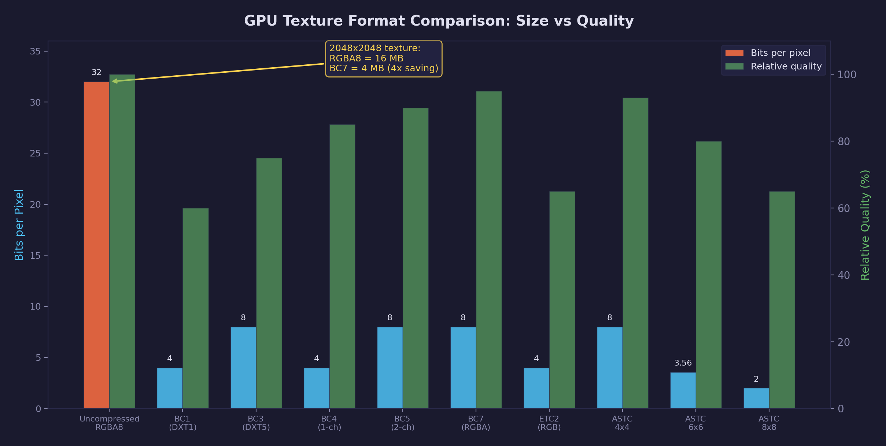

# Lesson 02 — Texture Processing

Turn the scaffold's no-op texture plugin into a real image processor: load
source images with Pillow, resize them to fit GPU texture limits, convert
formats, generate a complete mipmap chain, and write metadata sidecar files
for reproducible builds.

## What you'll learn

- Load and process image files with Pillow (PNG, JPG, TGA, BMP)
- Resize images to fit within a configurable maximum size while preserving
  aspect ratio (Lanczos resampling)
- Convert between image formats (TGA/BMP source to PNG/JPG output)
- Generate mipmap chains — progressively halved images from full size to 1x1
- Compress textures into GPU block formats (BC1/BC3/BC7 via Basis Universal,
  ASTC via astcenc) for smaller VRAM footprint and faster GPU sampling
- Write `.meta.json` sidecar files that record processing settings and output
  dimensions
- Wire a real plugin into the pipeline's processing loop (not just scanning)
- Skip unchanged assets with content-hash fingerprinting from Lesson 01

## Result

```text
$ cd lessons/assets/02-texture-processing
$ forge-pipeline -v

pipeline: Loaded config from pipeline.toml
pipeline: Loaded 2 plugin(s)
pipeline:   mesh          .obj, .gltf, .glb
pipeline:   texture       .png, .jpg, .jpeg, .tga, .bmp
pipeline: Scanned 3 file(s) in assets/raw — 3 new, 0 changed, 0 unchanged

Scanned 3 file(s) in assets/raw:
  3 new
  0 changed
  0 unchanged

  [NEW]      textures/checker.png  (texture)
  [NEW]      textures/gradient.png  (texture)
  [NEW]      textures/solid.tga  (texture)

Processing 3 file(s)...

Done: 3 processed, 0 failed, 0 unchanged.
```

After processing, the output directory contains the base images, mip chains,
and metadata sidecars:

```text
assets/processed/textures/
  checker.png              # base image (mip 0)
  checker_mip1.png         # 128x128
  checker_mip2.png         # 64x64
  ...
  checker_mip8.png         # 1x1
  checker.meta.json        # processing metadata
  gradient.png
  gradient_mip1.png
  ...
  gradient.meta.json
  solid.png                # converted from TGA to PNG
  solid_mip1.png
  ...
  solid.meta.json
```

Running a second time with no file changes:

```text
$ forge-pipeline
All files up to date — nothing to process.
```

## Architecture



The texture plugin receives a source file path, an output directory, and a
settings dictionary from the `[texture]` section of `pipeline.toml`. It
processes each image through up to six stages:

1. **Load** — Open the source file with Pillow and normalize to RGB or RGBA
2. **Resize** — Clamp width and height to `max_size`, preserving aspect ratio
3. **Save base** — Write the processed image in the configured output format
4. **Generate mipmaps** — Create progressively halved copies down to 1x1
5. **Compress** (optional) — Encode into a GPU-native block format via
   Basis Universal or astcenc
6. **Write metadata** — Record source info, output dimensions, mip levels,
   compression info, and settings in a `.meta.json` sidecar

## Configuration

The `[texture]` section in `pipeline.toml` controls processing:

```toml
[texture]
max_size = 2048          # Clamp width and height to this limit
generate_mipmaps = true  # Create mip chain alongside the base image
output_format = "png"    # Output format: png, jpg, or bmp
jpg_quality = 90         # JPEG quality (1-100, only for jpg output)
```

All settings have sensible defaults — you can omit the entire section and
the plugin will process at 2048 max size with PNG output and mipmaps enabled.

## Resizing — preserving aspect ratio

When a source image exceeds `max_size` on either axis, the plugin scales it
down proportionally. The key is computing a single scale factor from the
*more constrained* axis:

```python
scale = min(max_size / width, max_size / height)
new_w = max(1, int(width * scale))
new_h = max(1, int(height * scale))
```

A 4000x2000 image with `max_size = 1024` becomes 1024x512 — the width hits
the limit first, and the height scales proportionally. Images already within
limits pass through unchanged.

The plugin uses Lanczos resampling (`Image.LANCZOS`), which produces the
sharpest downscaled results at the cost of slightly more computation. For
game assets where texture quality matters, this is the right trade-off.

## Mipmaps — why and how

### Why mipmaps matter

When a 1024x1024 texture is displayed on a surface that covers only 16x16
pixels on screen, the GPU must sample from a texture far larger than the
rendered size. Without mipmaps this causes:

- **Aliasing** — shimmering patterns on distant or angled surfaces
- **Cache thrash** — the GPU reads scattered texels from a large texture,
  wasting memory bandwidth
- **Wasted bandwidth** — transferring full-resolution data that will be
  averaged down anyway

Mipmaps solve this by pre-computing smaller versions. The GPU picks the mip
level closest to the rendered size, giving correct filtering with minimal
bandwidth.

### Mip chain structure

Each mip level halves both dimensions until the smallest axis reaches 1:

| Level | Size | Pixels |
|-------|------|--------|
| 0 (base) | 256x256 | 65,536 |
| 1 | 128x128 | 16,384 |
| 2 | 64x64 | 4,096 |
| 3 | 32x32 | 1,024 |
| 4 | 16x16 | 256 |
| 5 | 8x8 | 64 |
| 6 | 4x4 | 16 |
| 7 | 2x2 | 4 |
| 8 | 1x1 | 1 |

The total number of mip levels for a texture is:

```text
levels = 1 + floor(log2(max(width, height)))
```

A 256x256 texture has 9 levels. A 512x256 texture has 10 levels (driven by
the larger axis). The entire mip chain uses only 33% more memory than the
base level alone — a small cost for significant rendering quality improvement.

### How the plugin generates mipmaps

```python
current = img  # start with the base image
for level in range(1, levels):
    mip_w = max(1, width >> level)   # halve via bit shift
    mip_h = max(1, height >> level)
    current = current.resize((mip_w, mip_h), Image.LANCZOS)
    current.save(f"{stem}_mip{level}{ext}")
```

Each level is resized from the *previous* level, not from the original. This
is called a *mip chain* or *image pyramid*. Resizing from the previous level
is faster and avoids aliasing artifacts that can occur when downsampling by
large factors in a single step.

## Metadata sidecar files

Every processed texture gets a `.meta.json` sidecar:

```json
{
  "source": "checker.png",
  "output": "checker.png",
  "original_width": 256,
  "original_height": 256,
  "output_width": 256,
  "output_height": 256,
  "mip_levels": [
    {"level": 0, "width": 256, "height": 256},
    {"level": 1, "width": 128, "height": 128},
    {"level": 2, "width": 64, "height": 64}
  ],
  "settings": {
    "max_size": 512,
    "generate_mipmaps": true,
    "output_format": "png"
  }
}
```

Sidecar files serve three purposes:

1. **Reproducibility** — Record exactly which settings produced each output.
   Change a setting and re-run to see the difference.
2. **Asset loading** — GPU code can read the sidecar to learn the mip count
   and dimensions without parsing the image files.
3. **Debugging** — When a texture looks wrong, check the sidecar to see if
   it was resized, what format was used, and how many mip levels were
   generated.

## Processing loop

Lesson 01 built the scanner but only reported what would be processed. This
lesson adds the processing loop to `__main__.py`:

```python
for f in to_process:
    plugin = registry.get_by_extension(f.extension)
    settings = config.plugin_settings.get(plugin.name, {})
    output_subdir = config.output_dir / f.relative.parent

    result = plugin.process(f.path, output_subdir, settings)
```

The pipeline creates the output directory structure mirroring the source tree,
so `assets/raw/textures/hero.png` produces output in
`assets/processed/textures/hero.png`.

The fingerprint cache is updated *after* successful processing. If processing
fails partway through, the failed files remain marked as NEW/CHANGED and will
be retried on the next run. This prevents a failed build from silently
skipping broken assets.

## Format conversion

The plugin converts any supported input format to the configured output
format. This is useful for standardizing on a single format across the
project:

| Input | Output (`output_format = "png"`) | Notes |
|-------|----------------------------------|-------|
| `.png` | `.png` | Lossless round-trip |
| `.jpg` | `.png` | Decompresses JPEG, saves as lossless PNG |
| `.tga` | `.png` | Converts Targa to PNG (smaller, widely supported) |
| `.bmp` | `.png` | Converts uncompressed BMP to compressed PNG |

When outputting JPEG, RGBA images are automatically converted to RGB (JPEG
does not support alpha channels). The `jpg_quality` setting controls the
compression level.

## GPU texture compression

The uncompressed textures produced above work well for learning and debugging,
but they do not scale. A single 2048x2048 RGBA texture occupies 16 MB of GPU
memory (2048 &times; 2048 &times; 4 bytes). A typical game level with 50 such textures
would consume 800 MB just for color maps — before normal maps, roughness maps,
or environment probes.

GPU texture compression solves this by encoding textures into formats that the
GPU decompresses in hardware during sampling. A 2048x2048 texture compressed
as BC7 occupies approximately 4 MB — a 4:1 reduction — with no runtime
decompression cost in the shader. The hardware handles it transparently.



The key property: compressed textures remain compressed in GPU memory. Unlike
PNG or JPEG, which must be fully decompressed to RGBA before the GPU can use
them, block-compressed formats are the native storage format. The GPU reads
compressed blocks and decompresses individual texels on the fly during texture
sampling.

## Block compression fundamentals

All modern GPU compression formats share the same core approach: divide the
image into small fixed-size blocks (typically 4x4 pixels) and encode each
block independently into a fixed number of bytes.

For BC7, each 4x4 block of 16 pixels (64 bytes uncompressed at 4 bytes per
pixel) is compressed to exactly 16 bytes. The compression ratio is fixed and
predictable — the GPU knows exactly where each block lives in memory without
an index table.

How a 4x4 block is encoded (simplified):

1. The encoder analyzes the 16 pixels and selects two or more *endpoint
   colors* that bracket the range of colors in the block
2. The endpoints are stored explicitly in the compressed block
3. Each pixel stores a short index (2-4 bits) selecting an interpolated
   color between the endpoints
4. At read time, the GPU reconstructs each pixel by interpolating between
   the stored endpoints using the per-pixel index

This approach works because natural textures have high spatial coherence —
neighboring pixels tend to have similar colors. A 4x4 block of grass, skin,
or sky can usually be approximated well with a small palette interpolated
from two endpoints.

The trade-off is quality: block compression is lossy. Fine detail within a
4x4 block can be lost, and hard edges between very different colors (such as
a thin red line on a blue background) may show artifacts. The more advanced
formats (BC7, ASTC) mitigate this with multiple partition modes that split
the block into subsets, each with its own endpoints.

## Desktop formats (BC/DXT family)

The BC (Block Compression) family is the standard on desktop GPUs. All formats
use 4x4 pixel blocks. They are universally supported on Direct3D 11+, Vulkan
desktop, and Metal (macOS).

### BC1 (DXT1) — 4 bpp, RGB + 1-bit alpha

The oldest and smallest block-compressed format. Each 4x4 block is stored in
8 bytes: two 16-bit RGB565 endpoint colors and a 4x4 grid of 2-bit indices
selecting from four interpolated colors. This gives a 6:1 compression ratio
over 24-bit RGB.

BC1 supports a single-bit alpha punch-through mode (fully opaque or fully
transparent), but no graduated transparency. Use it for opaque color textures
where file size matters more than precision — terrain textures, tiling
materials, and backgrounds.

### BC3 (DXT5) — 8 bpp, RGBA

BC3 combines BC1 color compression with a separate alpha block. The alpha
channel gets its own two 8-bit endpoints and a 4x4 grid of 3-bit indices,
giving 8 levels of alpha interpolation. Total block size is 16 bytes — a
4:1 ratio over 32-bit RGBA.

Use BC3 for textures with smooth alpha gradients: foliage, particles, decals,
and UI elements with soft edges.

### BC4 (ATI1) — 4 bpp, single channel

BC4 stores a single channel using the same scheme as BC3's alpha block: two
8-bit endpoints plus 3-bit indices per pixel. The result is a 4:1 ratio
for single-channel data.

Use BC4 for heightmaps, ambient occlusion maps, roughness maps, and any
grayscale texture. Storing these as RGBA wastes three channels.

### BC5 (ATI2) — 8 bpp, two channels

BC5 stores two independent channels, each using the BC4 scheme. The standard
use case is normal maps: store the X and Y components, then reconstruct Z in
the shader:

```hlsl
float2 xy = NormalMap.Sample(sampler, uv).rg * 2.0 - 1.0;
float  z  = sqrt(saturate(1.0 - dot(xy, xy)));
float3 N  = float3(xy, z);
```

This approach gives better precision than BC3 because both channels get the
full 8-bit endpoint range independently, rather than sharing a single color
encoding.

### BC6H — 8 bpp, HDR (half-float RGB)

BC6H compresses HDR image data where pixel values exceed the 0-1 range. Each
block stores half-precision (16-bit float) RGB values at 8 bits per pixel.
BC6H comes in signed and unsigned variants.

Use BC6H for environment maps, lightmaps, and any texture where values above
1.0 carry meaningful information. Clamping HDR data to LDR and using BC1/BC7
destroys the dynamic range.

### BC7 — 8 bpp, high-quality RGBA

BC7 is the highest-quality desktop format. It supports up to 8 different
partition modes per block, each dividing the 4x4 pixels into subsets with
independent color endpoints. The encoder tests multiple modes and selects the
one with the lowest error.

BC7 matches or exceeds BC3 quality for RGBA textures and significantly exceeds
BC1 for RGB textures, all at 8 bits per pixel. The downside is encoding time —
BC7 compression is substantially slower than BC1 because the encoder must
evaluate many mode combinations.

Use BC7 as the default desktop format for color textures and any texture
where quality matters. Reserve BC1 for cases where the 4 bpp size is critical.

## Mobile formats

Mobile GPUs (ARM Mali, Qualcomm Adreno, Apple GPU) use different compression
formats than desktop. Desktop BC formats are generally not supported on mobile
hardware, and vice versa.

### ETC1/ETC2

ETC (Ericsson Texture Compression) is mandatory on all OpenGL ES 3.0+ and
Vulkan mobile devices. ETC1 supports RGB only at 4 bpp. ETC2 extends this
with full RGBA support (8 bpp with alpha), punchthrough alpha (4 bpp), and
single/dual channel modes (EAC).

ETC2 quality is roughly comparable to BC1/BC3 — adequate for most textures
but noticeably lossy on high-frequency detail. ETC2 is the baseline mobile
format: universally supported, reasonable quality, predictable size.

### ASTC

ASTC (Adaptive Scalable Texture Compression) is a more advanced mobile format
with variable block sizes. While BC and ETC use fixed 4x4 blocks, ASTC
supports block sizes from 4x4 (8 bpp) up to 12x12 (0.89 bpp). Larger blocks
give better compression but lower quality.

ASTC is mandatory on Vulkan mobile GPUs and is also supported on Apple Silicon
Macs via Metal. It can compress LDR, HDR, and 3D textures in a single format.
For mobile-targeted projects, ASTC at 4x4 or 6x6 block sizes offers the best
quality-to-size ratio.

| Block size | Bits per pixel | Compression ratio vs. RGBA |
|-----------|---------------|---------------------------|
| 4x4 | 8.00 bpp | 4:1 |
| 5x5 | 5.12 bpp | 6.25:1 |
| 6x6 | 3.56 bpp | 9:1 |
| 8x8 | 2.00 bpp | 16:1 |
| 12x12 | 0.89 bpp | 36:1 |

## Supercompressed and universal formats

A production pipeline must serve desktop (BC), mobile Android (ETC2/ASTC), and
Apple (ASTC) — three different compressed formats from the same source. Building
and shipping three copies of every texture is possible but wasteful. Universal
texture formats solve this.

### Basis Universal

Basis Universal encodes textures into an intermediate representation that can be
*transcoded* to any native GPU format at load time. You encode once during the
asset build, and the runtime transcodes to BC7 on desktop, ASTC on mobile, or
ETC2 on older Android — all from the same file.

Basis provides two codecs:

- **ETC1S** — Encodes to a supercompressed ETC1 representation. Files are very
  small (often smaller than JPEG), but quality is limited to roughly ETC1 level.
  ETC1S is best for textures where small download size matters more than
  maximum quality — mobile games, web applications, and background textures.

- **UASTC** — Encodes to a high-quality intermediate format that transcodes
  nearly losslessly to BC7, ASTC 4x4, and ETC2. UASTC files are larger than
  ETC1S (similar to raw BC7 size) but produce much higher quality output.
  UASTC is the right choice when quality matters — hero textures, UI art,
  and normal maps.

### KTX2 container

KTX2 (Khronos Texture version 2) is the standard container format for GPU
textures. A KTX2 file stores:

- The compressed texture data (Basis, BC7, ASTC, ETC2, or uncompressed)
- The complete mipmap chain
- Metadata (color space, channel mapping, original dimensions)
- Optional Zstandard supercompression on top of the GPU compression

KTX2 with Basis Universal payloads is the recommended distribution format for
cross-platform projects. A single `.ktx2` file contains everything the runtime
needs to create a GPU texture on any platform.

### Why Basis is ideal for distribution

The traditional approach — compress to BC7 for desktop, ASTC for mobile,
ETC2 for older devices — requires three build targets and three copies in the
distribution package. Basis Universal collapses this to one file per texture.
The runtime transcoding step takes microseconds per texture and happens during
asset loading.

```text
Source PNG ──▸ Basis UASTC ──▸ KTX2 file
                                  │
                    ┌──────────────┼──────────────┐
                    ▼              ▼              ▼
                Desktop        Mobile         Legacy
                (BC7)         (ASTC 4x4)     (ETC2)
```

## Normal map compression

Normal maps require special treatment because they encode *directions*, not
*colors*. Two properties matter:

1. **Color space** — Normal maps must be stored in linear space. Applying sRGB
   gamma encoding (which most color textures use) distorts the direction
   vectors, producing incorrect lighting. Always mark normal maps as linear
   and disable sRGB conversion in the texture settings.

2. **Channel usage** — A unit normal vector (X, Y, Z) has a constraint:
   X^2 + Y^2 + Z^2 = 1. This means Z can be reconstructed from X and Y,
   so storing all three channels wastes space. The standard approach is to
   store only X and Y, then reconstruct Z in the shader.

BC5 is the standard desktop format for normal maps — it stores two independent
channels at 8 bpp with high precision. On mobile, ASTC or ETC2 with two-channel
modes serve the same role.

The shader reconstruction is straightforward:

```hlsl
// Sample XY from the BC5 normal map (stored in RG channels)
float2 xy = NormalTex.Sample(samp, uv).rg * 2.0 - 1.0;

// Reconstruct Z from the unit-length constraint
float z = sqrt(saturate(1.0 - dot(xy, xy)));

float3 normal = normalize(float3(xy, z));
```

## Format selection guide



| Use case | Desktop format | Mobile format | Notes |
|----------|---------------|--------------|-------|
| Color textures (opaque) | BC7 | ASTC 4x4 | BC1 acceptable when size is critical |
| Color textures (with alpha) | BC7 | ASTC 4x4 | BC3 as fallback for older toolchains |
| UI / sprites | BC7 | ASTC 4x4 | Sharp edges benefit from BC7's partition modes |
| Normal maps | BC5 | ASTC (2-ch) | Always linear, store XY only, reconstruct Z |
| Heightmaps / AO | BC4 | EAC R11 | Single-channel data — do not waste 4 channels |
| HDR environment maps | BC6H | ASTC HDR | Preserve values above 1.0 |
| Cross-platform distribution | Basis UASTC in KTX2 | Basis UASTC in KTX2 | One file transcodes to any native format |

## How the pipeline compresses

The texture plugin supports GPU compression via [Basis Universal](https://github.com/BinomialLLC/basis_universal).
When enabled, the plugin invokes the `basisu` encoder as a subprocess after
generating mipmaps, producing a KTX2 file with the compressed data.

Enable compression in `pipeline.toml`:

```toml
[texture]
max_size = 2048
generate_mipmaps = true
output_format = "png"
jpg_quality = 90

# GPU compression settings
compression = "basisu"       # "none", "basisu", or "astc"
basisu_format = "uastc"      # "uastc" (high quality) or "etc1s" (small files)
basisu_quality = 128         # 1-255, higher = better quality / slower
# normal_map = false         # true for normal maps (BC5/linear encoding)
```

When `compression = "basisu"`, the processing pipeline uses all six stages
from the Architecture section. Stage 5 (Compress) invokes `basisu` as a
subprocess, which reads the base PNG and produces a `.ktx2` file containing
the compressed data with embedded mipmaps. Stage 6 (Write metadata) records
the compression codec, file sizes, and compression ratio in the sidecar.

The `basisu` subprocess call:

```bash
basisu -ktx2 -q 128 -uastc -mipmap -file input.png -output_path output_dir/
```

The metadata sidecar records compression results:

```json
{
  "source": "checker.png",
  "output": "checker.png",
  "original_width": 2048,
  "original_height": 2048,
  "output_width": 2048,
  "output_height": 2048,
  "compression": {
    "codec": "uastc",
    "container": "ktx2",
    "compressed_file": "checker.ktx2",
    "uncompressed_bytes": 16777216,
    "compressed_bytes": 4260864,
    "ratio": 3.94,
    "normal_map": false
  },
  "mip_levels": [
    {"level": 0, "width": 2048, "height": 2048},
    {"level": 1, "width": 1024, "height": 1024}
  ],
  "settings": {
    "max_size": 2048,
    "generate_mipmaps": true,
    "output_format": "png",
    "compression": "basisu"
  }
}
```

## Building

```bash
# From the forge-gpu repository root
pip install -e ".[dev]"
```

This installs the `forge-pipeline` CLI with Pillow for image processing and
pytest + ruff for development.

## Running

### Try it out

```bash
cd lessons/assets/02-texture-processing
forge-pipeline -v              # process sample textures
forge-pipeline                 # second run — all unchanged
forge-pipeline --dry-run       # scan only, do not process
```

### Inspect the output

```bash
cat assets/processed/textures/checker.meta.json
ls assets/processed/textures/
```

### Run the tests

```bash
# From the repository root
pytest tests/pipeline/ -v
```

48 tests covering dimension clamping, mip count calculation, full processing
(resize, mipmaps, format conversion, metadata), GPU compression (basisu and
astcenc invocation, quality settings, normal maps, tool-not-installed
fallback, subprocess error handling), error handling, and edge cases (RGBA,
TGA input, nested output directories).

## Key concepts

### Plugin lifecycle

In Lesson 01, plugins were scaffolds — they registered their extensions but
did nothing. This lesson shows the full plugin lifecycle:

1. **Register** — Plugin declares `name` and `extensions` (unchanged from L01)
2. **Discover** — Registry finds and imports the plugin (unchanged from L01)
3. **Configure** — Plugin reads its `[texture]` settings from TOML
4. **Process** — Plugin receives a source path and settings, produces outputs
5. **Report** — Plugin returns an `AssetResult` with output path and metadata

### Incremental builds

The fingerprint cache from Lesson 01 drives incremental processing. Only
files classified as NEW or CHANGED are passed to plugins. The cache is
updated only after successful processing, so failed files are retried
automatically.

### Image processing pipeline

The texture plugin demonstrates a common pattern in asset pipelines: a
sequence of transformations applied to each file. Each step (load, resize,
convert, mipmap, metadata) is independent and testable, but they compose
into a complete processing workflow.

## Where it connects

| Track | Connection |
|---|---|
| [GPU Lesson 04 — Textures & Samplers](../../gpu/04-textures-and-samplers/) | Processed textures are ready for `SDL_CreateGPUTexture` — mipmaps map directly to mip levels in the GPU texture |
| [GPU Lesson 05 — Mipmaps](../../gpu/05-mipmaps/) | Explains how the GPU uses the mip chain this plugin generates; sampler mipmap mode selects between levels |
| [Asset Lesson 01 — Pipeline Scaffold](../01-pipeline-scaffold/) | Built the scanner, fingerprinting, and plugin discovery that this lesson extends |
| [Asset Lesson 03 — Mesh Processing](../03-mesh-processing/) | Next lesson: the same plugin pattern applied to 3D models with compiled C tools |

## Exercises

1. **Add WebP output** — Pillow supports WebP. Add `"webp"` to the format
   map and test it. WebP offers better compression than PNG with optional
   lossy mode — compare file sizes.

2. **Power-of-two resize** — Many older GPUs require textures with
   power-of-two dimensions. Add a `power_of_two = true` setting that rounds
   the resized dimensions up to the nearest power of two.

3. **Channel statistics** — Add min/max/mean values per channel (R, G, B, A)
   to the metadata sidecar. This is useful for debugging — a normal map with
   an unexpected min/max likely has encoding issues.

4. **Atlas packing** — Write a new plugin that combines multiple small
   textures into a single atlas texture. Output a JSON file mapping each
   source texture to its UV rectangle in the atlas.

5. **Run with compression enabled** — Enable Basis Universal compression in
   `pipeline.toml` by setting `compression = "basisu"` and
   `basisu_format = "uastc"`. Process the sample textures and compare the
   `.ktx2` output sizes against the uncompressed PNG files. Check the
   `compression` block in each `.meta.json` to verify the reported ratio.
   Try switching to `basisu_format = "etc1s"` and observe how file sizes and
   quality change.

## Further reading

- [Pipeline API reference](../../../pipeline/README.md) — Full API docs and
  usage guide
- [Pillow documentation](https://pillow.readthedocs.io/) — The image
  processing library used by the texture plugin
- [GPU Lesson 05 — Mipmaps](../../gpu/05-mipmaps/) — How the GPU uses mip
  chains for texture filtering
- [Texture filtering (Learn OpenGL)](https://learnopengl.com/Getting-started/Textures) —
  Visual explanation of nearest vs. linear filtering and mipmap selection
- [BC7 texture compression](https://learn.microsoft.com/en-us/windows/win32/direct3d11/bc7-format) —
  The GPU-native compressed format that a production pipeline would target
