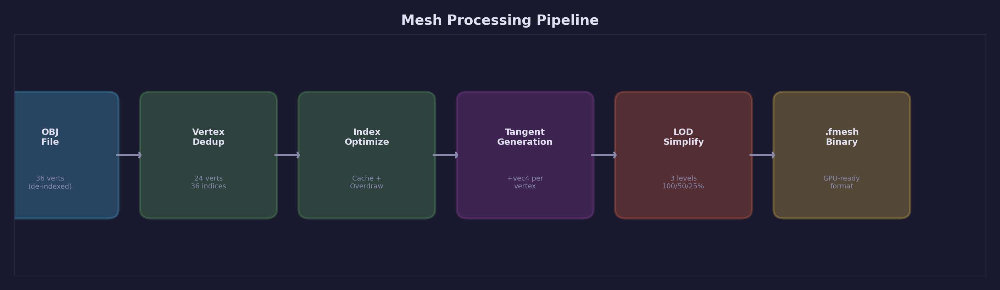
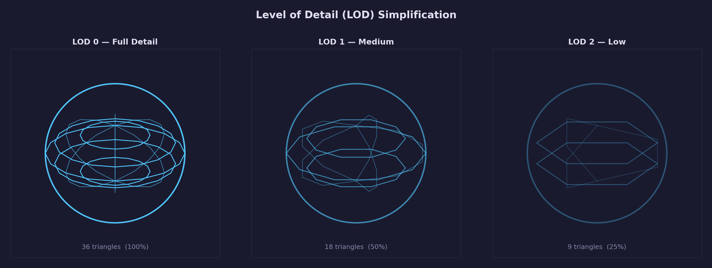

# Lesson 03 — Mesh Processing

Turn raw meshes into optimized, GPU-ready binary files. This lesson builds
a C tool that reads OBJ and glTF/GLB models, deduplicates vertices, optimizes
index buffers for GPU hardware, generates MikkTSpace tangent vectors for normal
mapping, and produces LOD levels via mesh simplification. The Python pipeline
invokes this tool as a subprocess, following the same plugin pattern established
in Lesson 02.

## What you'll learn

- Load OBJ and glTF/GLB models — OBJ vertices are de-indexed, glTF vertices
  are already indexed with optional tangent vectors
- Deduplicate vertices using meshoptimizer's vertex remap
- Optimize index buffers for GPU vertex cache, overdraw, and vertex fetch
  efficiency
- Generate MikkTSpace tangent vectors for correct normal mapping
- Produce LOD levels via mesh simplification with configurable error thresholds
- Write a binary format (`.fmesh`) designed for direct GPU upload via `memcpy`
- Wire a compiled C tool into the Python pipeline as a subprocess plugin

## Result

```text
$ cd lessons/assets/03-mesh-processing
$ forge-pipeline -v

pipeline: Loaded config from pipeline.toml
pipeline: Loaded 2 plugin(s)
pipeline:   mesh          .obj, .gltf, .glb
pipeline:   texture       .png, .jpg, .jpeg, .tga, .bmp
pipeline: Scanned 2 file(s) in assets/raw — 2 new, 0 changed, 0 unchanged

Scanned 2 file(s) in assets/raw:
  2 new
  0 changed
  0 unchanged

  [NEW]      models/cube.obj  (mesh)
  [NEW]      models/suzanne.obj  (mesh)

Processing 2 file(s)...

  mesh: cube.obj — 36 verts → 24 unique (33% reduction)
        indices: 36 → 36 (cache-optimized, overdraw-optimized)
        tangents: generated (48 bytes/vert with tangent)
        LODs: 3 levels [1.0, 0.5, 0.25]
        output: cube.fmesh (2.4 KB)

  mesh: suzanne.obj — 2904 verts → 502 unique (83% reduction)
        indices: 2904 → 2904 (cache-optimized, overdraw-optimized)
        tangents: generated (48 bytes/vert with tangent)
        LODs: 3 levels [1.0, 0.5, 0.25]
        output: suzanne.fmesh (58.7 KB)

Done: 2 processed, 0 failed, 0 unchanged.
```

Running a second time with no changes:

```text
$ forge-pipeline
All files up to date — nothing to process.
```

## Key concepts

### Why mesh optimization matters

GPUs are fast, but they are not infinitely fast. Three bottlenecks constrain
mesh rendering performance:

1. **Vertex cache misses** — Modern GPUs process vertices through a small
   post-transform cache (typically 16-32 entries). When an index buffer
   references vertices in random order, the cache thrashes and the GPU
   re-transforms the same vertex multiple times. Reordering indices to
   maximize cache reuse can reduce vertex shader invocations by 50% or more.

2. **Overdraw** — When triangles are drawn back-to-front, the GPU shades
   pixels that will later be overwritten by closer geometry. Reordering
   triangles to approximate front-to-back rendering reduces wasted fragment
   shader work.

3. **Memory bandwidth** — Every vertex attribute (position, normal, UV,
   tangent) must travel from VRAM through the memory bus to the shader core.
   Tightly packing vertices and reordering them to match access patterns
   reduces cache line waste.

These are not theoretical concerns. On a mesh with 100,000 triangles, the
difference between a naive index buffer and an optimized one can be 2-3x in
vertex shader cost. meshoptimizer addresses all three bottlenecks with
well-studied algorithms.

### The OBJ problem: de-indexed vertices

OBJ files store positions, normals, and texture coordinates in separate arrays
with independent indices. A face line like `f 1/2/3 4/5/6 7/8/9` means
"vertex 1's position with UV 2 and normal 3." This is memory-efficient for
storage but incompatible with how GPUs work.

GPUs use a single index buffer that references unified vertices — each vertex
is a complete bundle of position, normal, UV, and any other attributes. When
an OBJ vertex references position 1 with UV 2 and normal 3, the loader must
create a new unified vertex combining those three values.

The result: a cube with 8 positions, 6 normals, and 4 UVs produces up to 36
unified vertices (one per face corner) even though many of those combinations
are identical. A model with shared smooth normals and UVs duplicates even
more aggressively.

The first step in mesh processing is deduplicating these expanded vertices
back to the minimum unique set.

### Vertex deduplication

meshoptimizer's `meshopt_generateVertexRemap` solves deduplication efficiently.
Given an array of expanded vertices (with duplicate entries), it produces a
remap table mapping each original vertex to a unique output vertex:

```c
/* Input: expanded_vertices has vertex_count entries, many duplicates */
unsigned int *remap = malloc(vertex_count * sizeof(unsigned int));
size_t unique_count = meshopt_generateVertexRemap(
    remap,              /* output: remap[i] = new index for vertex i */
    NULL,               /* indices (NULL = identity) */
    vertex_count,       /* number of input vertices */
    expanded_vertices,  /* vertex data */
    vertex_count,       /* number of vertices to scan */
    vertex_stride       /* bytes per vertex */
);
```

The function compares vertices byte-for-byte at the given stride. Two vertices
with identical position, normal, and UV values (within floating-point
representation) map to the same output index. The return value is the number
of unique vertices — typically much smaller than the input count.

After generating the remap, apply it to both the index buffer and vertex
buffer:

```c
meshopt_remapIndexBuffer(indices, NULL, vertex_count, remap);
meshopt_remapVertexBuffer(vertices, expanded_vertices,
                          vertex_count, vertex_stride, remap);
```

The result is a compact vertex buffer with no duplicates and an index buffer
referencing only unique vertices. For a typical OBJ model, deduplication
reduces vertex count by 50-80%.

### Index buffer optimization

With deduplicated vertices in hand, three optimization passes reorder the
index and vertex buffers for GPU hardware.

#### Vertex cache optimization

`meshopt_optimizeVertexCache` reorders triangles so that consecutive triangles
share vertices that are likely still in the GPU's post-transform cache. The
algorithm (Tom Forsyth's linear-speed vertex cache optimization) assigns a
score to each vertex based on its cache position and selects the next triangle
that maximizes the total score:

```c
meshopt_optimizeVertexCache(
    indices, indices,
    index_count, unique_vertex_count
);
```

This is the single most impactful optimization. On a well-connected mesh, it
can reduce vertex shader invocations by 50% compared to an unoptimized index
buffer. The algorithm runs in O(n) time and modifies the index buffer in
place.

#### Overdraw optimization

`meshopt_optimizeOverdraw` reorders triangles to approximate a front-to-back
rendering order, reducing the number of pixels shaded and then overwritten by
closer geometry:

```c
meshopt_optimizeOverdraw(
    indices, indices,
    index_count,
    &vertices[0].px, /* pointer to first position X */
    unique_vertex_count,
    vertex_stride,
    1.05f            /* threshold: allow up to 5% vertex cache degradation */
);
```

The threshold parameter controls how aggressively the algorithm reorders
triangles at the expense of vertex cache efficiency. A value of 1.05 means
"allow up to 5% more vertex cache misses if it reduces overdraw." In
practice, this gives a good balance.

#### Vertex fetch optimization

`meshopt_optimizeVertexFetch` reorders the vertex buffer so that vertices are
accessed in roughly sequential order by the optimized index buffer. This
maximizes hardware prefetch efficiency and minimizes cache line waste:

```c
meshopt_optimizeVertexFetch(
    vertices, indices,
    index_count,
    vertices,
    unique_vertex_count,
    vertex_stride
);
```

After this pass, the vertex buffer is ordered to match the access pattern of
the index buffer. When the GPU reads index 0, then 1, then 2, the
corresponding vertex data lives in consecutive memory — ideal for the memory
subsystem.

The three optimizations compose: run cache optimization first, then overdraw,
then vertex fetch. Each pass preserves the work of the previous one (overdraw
optimization respects cache order, vertex fetch respects index order).

### Tangent generation with MikkTSpace

Normal maps store per-pixel surface detail as perturbations from the base
surface normal. To apply these perturbations correctly, the shader needs a
coordinate frame at each vertex — a *tangent space* defined by three
orthogonal vectors:

- **Normal (N)** — the surface normal, perpendicular to the surface
- **Tangent (T)** — aligned with the U direction of the texture coordinates
- **Bitangent (B)** — aligned with the V direction, computed as
  `B = cross(N, T) * handedness`

The tangent and bitangent tell the shader which direction "right" and "up"
are in texture space at each vertex. Without them, the normal map
perturbations would be applied in the wrong direction, producing incorrect
lighting.

MikkTSpace (Morten Mikkelsen's Tangent Space) is the industry-standard
algorithm for generating consistent tangent vectors. It is used by Blender,
Unity, Unreal Engine, and most 3D tools. The key property of MikkTSpace is
that it guarantees the same tangent space regardless of which tool generates
it — if both the asset exporter and the runtime use MikkTSpace, normal maps
will render correctly without per-tool adjustments.

The algorithm requires callbacks for accessing mesh data:

```c
SMikkTSpaceInterface iface = {
    .m_getNumFaces        = get_num_faces,
    .m_getNumVerticesOfFace = get_num_verts_of_face,
    .m_getPosition        = get_position,
    .m_getNormal          = get_normal,
    .m_getTexCoord        = get_texcoord,
    .m_setTSpaceBasic     = set_tspace_basic,
};

SMikkTSpaceContext ctx = { .m_pInterface = &iface, .m_pUserData = &mesh };
genTangSpaceDefault(&ctx);
```

The `set_tspace_basic` callback receives a 3-component tangent vector and a
sign value (the handedness). The tangent is stored as a `vec4` where `w` holds
the handedness:

```c
void set_tspace_basic(const SMikkTSpaceContext *ctx,
                      const float tangent[], float sign,
                      int face, int vert) {
    Vertex *v = get_vertex(ctx, face, vert);
    v->tx = tangent[0];
    v->ty = tangent[1];
    v->tz = tangent[2];
    v->tw = sign;  /* handedness: +1 or -1 */
}
```

The `w` component is essential. Mirrored UVs (common on symmetric models like
characters) produce tangent spaces with opposite handedness on each side. The
shader uses `w` to flip the bitangent accordingly:

```hlsl
float3 bitangent = cross(normal, tangent.xyz) * tangent.w;
```

Adding tangents increases the vertex stride from 32 bytes (position + normal +
UV) to 48 bytes (adding a 16-byte vec4 tangent). This is a 50% increase in
vertex data, but it enables correct normal mapping — a fundamental technique
in modern rendering.

### LOD generation

Distant objects do not need the same geometric detail as nearby ones. Level of
Detail (LOD) reduces triangle count for objects at distance, saving vertex
processing and rasterization cost.

meshoptimizer's `meshopt_simplify` reduces triangle count while preserving
visual fidelity. The algorithm uses quadric error metrics to collapse edges
that contribute the least to the mesh's silhouette and surface shape:

```c
float target_ratio = 0.5f;  /* reduce to 50% of original */
size_t target_indices = (size_t)(index_count * target_ratio);
float target_error = 0.01f; /* maximum allowed error */

unsigned int *lod_indices = malloc(index_count * sizeof(unsigned int));
size_t lod_index_count = meshopt_simplify(
    lod_indices,
    indices, index_count,
    &vertices[0].px,
    vertex_count, vertex_stride,
    target_indices,
    target_error,
    0,     /* options */
    NULL   /* result error (optional) */
);
```

The function returns fewer indices than the target when it cannot simplify
further without exceeding the error threshold. This prevents aggressive
simplification from destroying the mesh's shape.

A typical LOD chain uses ratios like `[1.0, 0.5, 0.25]`:

| LOD | Ratio | Triangles (example) | Use case |
|-----|-------|---------------------|----------|
| 0 | 1.0 | 5,000 | Close-up, full detail |
| 1 | 0.5 | 2,500 | Medium distance |
| 2 | 0.25 | 1,250 | Far distance |

The runtime selects the appropriate LOD based on the object's screen-space
size or distance from the camera. Each LOD level shares the same vertex
buffer but uses a different range of the index buffer.

### The binary format (.fmesh)



The `.fmesh` format is designed for one purpose: direct GPU upload. The vertex
and index data are stored in exactly the layout the GPU expects, so loading
is a `memcpy` into a GPU buffer — no parsing, no conversion, no per-vertex
processing at runtime.

#### Header layout

```c
/* 32 bytes total */
typedef struct {
    char     magic[4];         /* "FMSH" */
    uint32_t version;          /* 1 */
    uint32_t vertex_count;     /* number of unique vertices */
    uint32_t vertex_stride;    /* bytes per vertex (32 or 48) */
    uint32_t lod_count;        /* number of LOD levels */
    uint32_t flags;            /* bit 0: has_tangents */
    uint8_t  reserved[8];     /* padding for future use */
} FmeshHeader;
```

After the header, LOD descriptors specify the index range for each level:

```c
/* 12 bytes per LOD level */
typedef struct {
    uint32_t index_count;      /* number of indices in this LOD */
    uint32_t index_offset;     /* byte offset into index data section */
    float    target_error;     /* simplification error metric */
} FmeshLod;
```

The file layout is:

```text
┌──────────────────────────────────┐
│ FmeshHeader (32 bytes)           │
├──────────────────────────────────┤
│ FmeshLod[lod_count] (12 B each)  │
├──────────────────────────────────┤
│ Vertex data                      │
│ (vertex_count * vertex_stride)   │
├──────────────────────────────────┤
│ Index data (uint32 per index)    │
│ (all LODs concatenated)          │
└──────────────────────────────────┘
```

Loading at runtime is straightforward:

```c
/* Read header, then upload vertex/index data directly to GPU buffers */
FmeshHeader header;
fread(&header, sizeof(header), 1, f);

/* Read LOD descriptors for LOD selection at runtime */
FmeshLod *lods = malloc(header.lod_count * sizeof(FmeshLod));
fread(lods, sizeof(FmeshLod), header.lod_count, f);

/* Read vertex data — upload directly to SDL_GPUBuffer */
void *verts = malloc(header.vertex_count * header.vertex_stride);
fread(verts, header.vertex_stride, header.vertex_count, f);

/* Total index count: sum of all LOD index counts */
uint32_t total_indices = 0;
for (uint32_t i = 0; i < header.lod_count; i++)
    total_indices += lods[i].index_count;

/* Read index data — upload directly to SDL_GPUBuffer */
void *idxs = malloc(total_indices * sizeof(uint32_t));
fread(idxs, sizeof(uint32_t), total_indices, f);
```

No parsing loops, no format conversion, no endian swapping (the format assumes
little-endian, matching all modern GPUs). The data goes from disk to GPU
memory with minimal CPU involvement.

### How the pipeline processes meshes



The mesh plugin follows the subprocess pattern: Python orchestrates, C
executes. The compiled C tool (`forge-mesh-tool`) handles the
performance-critical work — vertex deduplication, index optimization, tangent
generation, and simplification all happen in native code.

The Python `MeshPlugin` invokes the tool:

```python
def process(self, source, output_dir, settings):
    output_path = output_dir / f"{source.stem}.fmesh"
    args = [tool_path, str(source), str(output_path)]

    if not settings.get("optimize", True):
        args.append("--no-optimize")
    if not settings.get("generate_tangents", True):
        args.append("--no-tangents")
    if lod_levels != [1.0]:
        args.extend(["--lod-levels", ",".join(str(r) for r in lod_levels)])
    args.append("--verbose")

    result = subprocess.run(args, capture_output=True, text=True, timeout=600)
    if result.returncode != 0:
        raise RuntimeError(f"forge-mesh-tool failed: {result.stderr}")
```

If the C tool is not found (not compiled, wrong platform), the plugin logs a
warning and skips mesh files gracefully. This prevents the entire pipeline
from failing when only texture processing is needed.

The processing pipeline within the C tool:

1. **Load** — Parse the OBJ file into expanded vertex arrays
2. **Deduplicate** — `meshopt_generateVertexRemap` to find unique vertices
3. **Optimize cache** — `meshopt_optimizeVertexCache` for cache efficiency
4. **Optimize overdraw** — `meshopt_optimizeOverdraw` for rendering order
5. **Optimize fetch** — `meshopt_optimizeVertexFetch` for memory access
6. **Generate tangents** — MikkTSpace `genTangSpaceDefault` (if enabled)
7. **Simplify LODs** — `meshopt_simplify` at each configured ratio
8. **Write .fmesh** — Binary output with header, LOD descriptors, and raw data

### Configuration reference

The `[mesh]` section in `pipeline.toml` controls processing:

| Setting | Type | Default | Description |
|---------|------|---------|-------------|
| `deduplicate` | bool | `true` | Remove duplicate vertices |
| `optimize` | bool | `true` | Reorder indices/vertices for cache, overdraw, and fetch efficiency |
| `generate_tangents` | bool | `true` | Generate MikkTSpace tangent vectors |
| `lod_levels` | list | `[1.0]` | Triangle count ratios for each LOD level |
| `tool_path` | string | `""` | Override path to forge-mesh-tool binary |

Example configuration:

```toml
[mesh]
deduplicate = true
optimize = true
generate_tangents = true
lod_levels = [1.0, 0.5, 0.25]
tool_path = "../../build/forge_mesh_tool"  # path to the compiled binary
```

## Building

### Prerequisites

- CMake 3.24+ and a C/C++ compiler
- meshoptimizer (fetched automatically via CMake FetchContent)
- MikkTSpace (fetched automatically via CMake FetchContent)
- Python 3.10+ with the pipeline installed (`pip install -e ".[dev]"`)

### Compile the C tool

```bash
cmake -B build
cmake --build build --target forge_mesh_tool
```

### Install the Python pipeline

```bash
pip install -e ".[dev]"
```

## Running

### Try it out

The Python pipeline must be able to find the `forge_mesh_tool` binary. Either
set `tool_path` in `pipeline.toml` (see the configuration example above) or
add the build directory to your `PATH`:

```bash
export PATH="$PWD/../../build:$PATH"   # from the lesson directory

cd lessons/assets/03-mesh-processing
forge-pipeline -v              # process sample meshes
forge-pipeline                 # second run — all unchanged
forge-pipeline --dry-run       # scan only, do not process
```

### Inspect the output

```bash
ls assets/processed/models/
hexdump -C assets/processed/models/cube.fmesh | head -20
```

### Run the tests

```bash
# Build the C tool (there is no separate test binary — the tool itself is
# exercised by the Python integration tests)
cmake --build build --target forge_mesh_tool

# Python tests
pytest tests/pipeline/test_mesh.py -v
```

## Where it connects

| Track | Connection |
|---|---|
| [GPU Lesson 04 — Textures & Samplers](../../gpu/04-textures-and-samplers/) | The tangent vectors generated here enable correct normal map sampling in the fragment shader |
| [GPU Lesson 17 — Normal Maps](../../gpu/17-normal-maps/) | Uses the tangent-space frame (T, B, N) that MikkTSpace generates to perturb surface normals |
| [GPU Lesson 33 — Vertex Pulling](../../gpu/33-vertex-pulling/) | The `.fmesh` binary format uploads directly to GPU storage buffers for vertex pulling |
| [Asset Lesson 01 — Pipeline Scaffold](../01-pipeline-scaffold/) | Built the scanner, fingerprinting, and plugin discovery that this lesson extends |
| [Asset Lesson 02 — Texture Processing](../02-texture-processing/) | Established the subprocess plugin pattern; mesh processing follows the same architecture |
| [Asset Lesson 04 — Procedural Geometry](../04-procedural-geometry/) | Next lesson: generating meshes from parametric equations instead of importing them |

## Exercises

1. **Add output statistics** — Add a `--output-stats` flag to the C tool that
   writes per-stage vertex and index counts to a CSV file. Track how many
   vertices survive each optimization pass.

2. **Experiment with LOD levels** — Try `lod_levels = [1.0, 0.75, 0.5, 0.25, 0.1]`
   in `pipeline.toml` and compare file sizes. At what ratio does Suzanne become
   visibly degraded? Use the simplification error value from the LOD descriptors
   to quantify the quality loss.

3. **Compare vertex strides** — Disable tangent generation
   (`generate_tangents = false`) and compare the vertex stride: 32 bytes
   (position + normal + UV) vs. 48 bytes (with tangent vec4). How much does
   this affect total file size for Suzanne?

4. **Process a complex mesh** — Download Suzanne from Blender (File > Export >
   Wavefront OBJ), place it in `assets/raw/` as `suzanne.obj`, and observe the
   deduplication ratio. OBJ files from Blender export with many duplicate
   vertex/normal/UV combinations — expect 70-85% reduction.

5. **Multi-primitive glTF** — The tool currently processes only the first
   primitive in a glTF scene. Extend it to iterate over all primitives and
   produce one `.fmesh` per primitive (or a multi-primitive binary format
   with a primitive table in the header).

## Further reading

- [meshoptimizer documentation](https://github.com/zeux/meshoptimizer) —
  Full API reference for vertex cache, overdraw, fetch optimization, and
  simplification
- [MikkTSpace](http://www.mikktspace.com/) — Morten Mikkelsen's tangent space
  algorithm specification
- [Tom Forsyth's vertex cache optimization](https://tomforsyth1000.github.io/papers/fast_vert_cache_opt.html) —
  The algorithm behind `meshopt_optimizeVertexCache`
- [GPU Lesson 17 — Normal Maps](../../gpu/17-normal-maps/) — How tangent
  space is used in the shader to apply normal map perturbations
- [Quadric error metrics (Garland & Heckbert)](https://www.cs.cmu.edu/~./garland/Papers/quadrics.pdf) —
  The mathematical foundation behind mesh simplification
