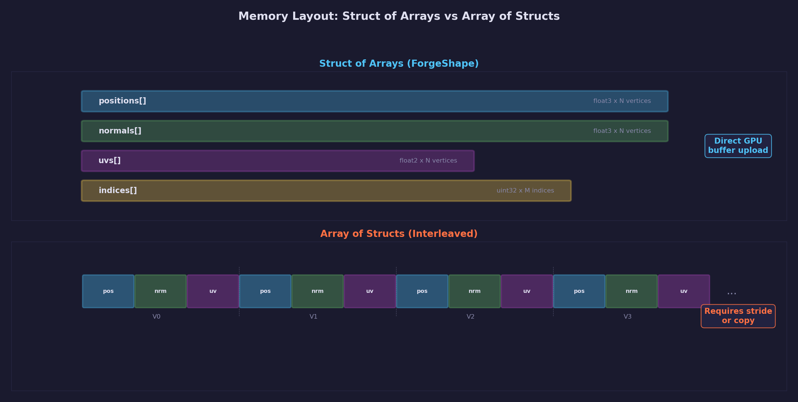
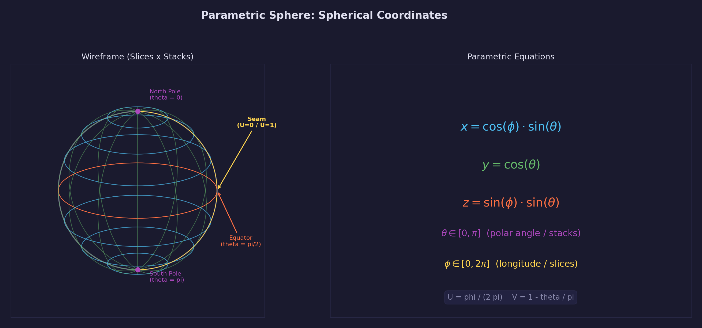
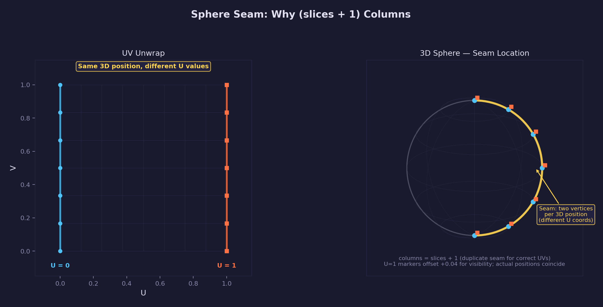
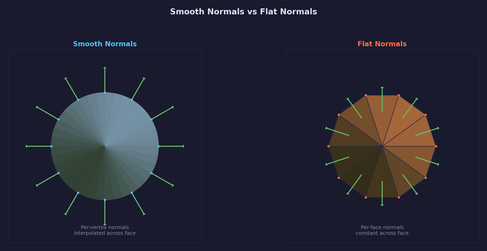

# Lesson 04 — Procedural Geometry

Generate 3D meshes from mathematical descriptions instead of importing them
from modeling tools. This lesson builds a header-only C library
(`common/shapes/forge_shapes.h`) that creates UV spheres, icospheres,
cylinders, cones, tori, planes, cubes, and capsules — ready for direct upload
to GPU buffers. A 47-test suite verifies geometric correctness: unit normals,
consistent winding order, valid UV ranges, exact vertex/index counts, and
safe handling of invalid parameters.

## What you'll learn

- How parametric equations describe 3D surfaces
- Why struct-of-arrays layout maps naturally to GPU buffers
- How to generate UV spheres, icospheres, cylinders, cones, tori, planes,
  cubes, and capsules from mathematical descriptions
- Why texture seams require vertex duplication
- The difference between smooth and flat normals
- How to test geometric properties (unit normals, winding order, UV range)

## Result

After completing this lesson you will have:

1. A header-only C library (`common/shapes/forge_shapes.h`) generating 8 shapes
2. A 47-test suite verifying geometric correctness and safety
3. Understanding of parametric surface generation for real-time graphics

Test output:

```text
=== forge-gpu Shapes Library Tests ===

Sphere tests:
  Testing: sphere_vertex_count
    PASS
  Testing: sphere_index_count
    PASS
  Testing: sphere_unit_normals
    PASS
  Testing: sphere_uv_range
    PASS

Icosphere tests:
  Testing: icosphere_vertex_count
    PASS
  ...

=== Test Summary ===
Total:  47
Passed: 47
Failed: 0

All tests PASSED!
```

## Why procedural geometry matters

Hand-coding vertex arrays does not scale. A cube has 24 vertices — manageable.
A sphere with 32 slices and 16 stacks has over 1,000. A tessellated torus has
even more. Typing those numbers by hand is tedious, error-prone, and impossible
to parameterize.

Beyond the obvious impracticality, procedural geometry serves essential roles
in real-time applications:

- **Debug visualization** — Bounding spheres, collision capsules, and physics
  proxies need to be rendered during development. Generating them at runtime
  avoids shipping debug art assets.
- **Prototyping** — Before final art arrives, placeholder geometry lets
  programmers test lighting, physics, and gameplay systems with correct
  topology and normals.
- **Particle effects** — Billboard quads, trail ribbons, and volumetric shapes
  are generated each frame from simulation data.
- **Terrain patches** — Landscape systems generate grid meshes at varying
  resolutions, displacing vertices on the GPU.
- **Runtime customization** — Character creators, procedural cities, and
  voxel engines build geometry from parameters that only exist at runtime.

A shape library provides these capabilities from a single header file, with no
external dependencies and no file I/O.

## Key concepts

- **Parametric surface** — A 3D surface defined by a function of two
  parameters (e.g. angles *phi* and *theta* for a sphere). Varying these
  parameters traces out the surface, producing positions, normals, and UV
  coordinates at each sample point.
- **Struct-of-arrays (SoA)** — A data layout where each attribute (position,
  normal, UV) occupies its own contiguous array. This maps directly to GPU
  vertex buffer attributes, enabling a single `memcpy` per attribute instead
  of per-vertex interleaving.
- **Seam duplication** — At the UV boundary (U = 0 and U = 1), vertices that
  share the same 3D position are duplicated with different UV coordinates.
  Without this, triangles spanning the seam would interpolate U from ~1.0
  back to ~0.0, compressing the entire texture into a sliver.
- **Smooth vs flat normals** — Smooth normals are shared across adjacent
  triangles, producing a curved appearance. Flat normals give each triangle
  its own normal, revealing the faceted geometry. The library generates smooth
  normals by default; `forge_shapes_compute_flat_normals` converts to flat.
- **CCW winding order** — Triangles are wound counter-clockwise when viewed
  from the front. This is the convention expected by
  `SDL_GPU_FRONTFACE_COUNTER_CLOCKWISE` for back-face culling.

## The ForgeShape struct

Every generator in the library returns a `ForgeShape` — a struct holding
separate arrays for positions, normals, UVs, and indices, plus the counts
needed to upload them to the GPU:

```c
typedef struct {
    vec3     *positions;     /* [vertex_count]  XYZ positions              */
    vec3     *normals;       /* [vertex_count]  unit normals (may be NULL)  */
    vec2     *uvs;           /* [vertex_count]  texture coords (may be NULL)*/
    uint32_t *indices;       /* [index_count]   CCW triangle list           */
    int       vertex_count;
    int       index_count;
} ForgeShape;
```

This is a **struct-of-arrays** (SoA) layout: each attribute lives in its own
contiguous array rather than being interleaved into a single vertex struct.

Why SoA instead of array-of-structs (AoS)? Because GPU vertex buffers are
separate. When you call `SDL_BindGPUVertexBuffers`, you bind one buffer per
attribute — positions in slot 0, normals in slot 1, UVs in slot 2. The SoA
layout means each array can be uploaded to its own GPU buffer with a single
`memcpy`, no packing or unpacking required.



The library allocates all arrays with `SDL_malloc`. When you are done with a shape,
call `forge_shapes_free()` to release the memory:

```c
ForgeShape sphere = forge_shapes_sphere(32, 16);
/* ... upload to GPU ... */
forge_shapes_free(&sphere);
```

## Parametric surfaces

Every shape in this library is a **parametric surface** — a surface where
every point is defined by two parameters, typically called *u* and *v*, each
ranging from 0 to 1. A function maps each (u, v) pair to a 3D point:

```text
P(u, v) = (x(u,v), y(u,v), z(u,v))
```

For a unit sphere, the parametric equations use spherical coordinates:

```text
phi   = u * 2 * pi          (longitude, around Y axis)
theta = v * pi              (latitude, from north pole to south pole)

x = cos(phi) * sin(theta)
y = cos(theta)
z = sin(phi) * sin(theta)
```

To generate a mesh, sample this function on a regular grid. The number of
samples around the equator is called **slices** (longitude lines), and the
number of samples from pole to pole is called **stacks** (latitude lines).
Each grid cell becomes two triangles:

```text
Total triangles = slices * stacks * 2
Total indices   = slices * stacks * 6
```

The grid has `(slices + 1) * (stacks + 1)` vertices — not `slices * stacks`.
The extra column and row exist because of the texture seam, explained in the
next section.



## Seam duplication

Consider a sphere with 4 slices. The first vertex column is at longitude 0
degrees, and the last is at 360 degrees — geometrically the same position. But
their texture coordinates differ: the first column has U = 0, the last has
U = 1.

If you share these vertices, the GPU interpolates U from 0.75 to 0.0 across
the last quad, wrapping the entire texture into a single column. The result is
a visible seam artifact where the texture compresses to a sliver.

The solution is **vertex duplication at the seam**: the first and last columns
occupy the same 3D position but carry different U coordinates. This is why the
vertex grid has `(slices + 1)` columns instead of `slices`. The same principle
applies to any shape that wraps around — cylinders, cones, tori, and capsules
all duplicate their seam vertices.



This is not wasted memory. The duplicated vertices are essential for correct
texture mapping. Without them, every textured shape would have a visible
artifact along the seam line.

## Shape by shape

### UV sphere

The UV sphere uses the spherical parametric equations described above. Vertex
positions and normals are identical for a unit sphere — the normal at any point
on a unit sphere is simply the normalized position vector.

```c
ForgeShape sphere = forge_shapes_sphere(32, 16);
```

**Parameters:**

- `slices` — Longitude divisions (around the Y axis). Minimum: 3.
- `stacks` — Latitude divisions (pole to pole). Minimum: 2.

**Vertex count:** `(slices + 1) * (stacks + 1)`
**Index count:** `slices * 2 * 3 + slices * (stacks - 2) * 6`

The poles use single triangles (not quads) because all vertices at a pole share
the same position. `forge_shapes_sphere()` with 32 slices and 16 stacks produces
561 vertices and 2880 indices — a visually smooth sphere suitable for most
real-time applications. Lower resolutions (8×4, 16×8) are useful for physics
proxies and LOD levels.

The poles are a known limitation of UV spheres: triangles converge to a point,
creating degenerate slivers. For applications requiring uniform triangle
distribution — physics simulation, geodesic domes — use the icosphere instead.

### Icosphere

The icosphere starts from an **icosahedron**: a Platonic solid with 12
vertices, 20 equilateral triangles, and near-uniform face area. Each
subdivision level splits every triangle into 4 smaller triangles by inserting
vertices at edge midpoints, then normalizes the new vertices to the unit
sphere.

```c
ForgeShape ico = forge_shapes_icosphere(3);  /* 3 subdivisions */
```

**Parameters:**

- `subdivisions` — Number of recursive splits. Minimum: 0 (bare icosahedron).

The returned `ForgeShape` includes extra vertices from UV seam duplication
at the anti-meridian (where U wraps from 1 back to 0). The base icosahedron
topology follows the formula `10 * 4^n + 2` vertices, but the actual vertex
count is higher due to these duplicates.

| Subdivisions | Base vertices | Returned vertices | Triangles |
|:---:|:---:|:---:|:---:|
| 0 | 12 | 20 | 20 |
| 1 | 42 | 56 | 80 |
| 2 | 162 | ~200 | 320 |
| 3 | 642 | ~780 | 1280 |

The icosphere's key advantage is triangle uniformity — every face has
approximately the same area, avoiding the polar convergence of UV spheres.
This property makes icospheres preferred for physics collision proxies,
geodesic dome geometry, and any application where uniform sampling of the
sphere surface matters.

UV coordinates are derived from spherical projection of the normalized
position: `u = 0.5 + atan2(z, x) / (2*pi)`, `v = 0.5 + asin(y) / pi`. This
introduces a seam artifact at the anti-meridian (where U wraps from 1 to 0),
which is addressed by duplicating seam vertices during generation.

### Cylinder

A cylinder with radius 1 and height 2, centered at the origin (Y from -1 to
+1). The generator produces the tube surface only — no end caps.

```c
ForgeShape cyl = forge_shapes_cylinder(32, 1);
```

**Parameters:**

- `slices` — Circumferential divisions. Minimum: 3.
- `stacks` — Vertical divisions along the height. Minimum: 1.

The normal at each vertex points radially outward: `(cos(theta), 0, sin(theta))`.
This is independent of the Y position — the cylinder's surface curves only
around its axis, not along it. UV coordinates wrap U around the circumference
and map V linearly from bottom to top.

### Cone

A cone with apex at Y = +1 and base radius 1 at Y = -1. Like the cylinder,
the generator produces the lateral surface only — no base disk.

```c
ForgeShape cone = forge_shapes_cone(32, 1);
```

**Parameters:**

- `slices` — Circumferential divisions. Minimum: 3.
- `stacks` — Vertical divisions along the slant. Minimum: 1.

The normal direction requires the **slant angle**. For a cone with half-angle
*alpha* (where `tan(alpha) = radius / height`), the surface normal tilts
outward from the axis by *alpha*. The normal at angle *theta* is:

```text
n = (cos(theta) * cos(alpha), sin(alpha), sin(theta) * cos(alpha))
```

This formula ensures the normal is perpendicular to the slant surface, not to
the base or the axis.

### Torus

A torus is defined by two radii: the **major radius** (distance from the
center of the torus to the center of the tube) and the **tube radius** (radius
of the tube itself).

```c
ForgeShape torus = forge_shapes_torus(32, 16, 1.0f, 0.3f);
```

**Parameters:**

- `slices` — Divisions around the main ring. Minimum: 3.
- `stacks` — Divisions around the tube cross-section. Minimum: 3.
- `major_radius` — Distance from torus center to tube center.
- `tube_radius` — Radius of the tube.

The parametric equations use two angles: *phi* (around the main ring) and
*theta* (around the tube cross-section):

```text
x = (major_radius + tube_radius * cos(theta)) * cos(phi)
y = tube_radius * sin(theta)
z = (major_radius + tube_radius * cos(theta)) * sin(phi)
```

The normal at each point is the direction from the tube center to the surface
point. The tube center at angle *phi* is
`(major_radius * cos(phi), 0, major_radius * sin(phi))` — subtracting this
from the surface point and normalizing gives the correct normal.

### Plane

A flat quad in the XZ plane spanning [-1, +1] on both axes, at Y = 0. All
normals point up (+Y).

```c
ForgeShape plane = forge_shapes_plane(4, 4);
```

**Parameters:**

- `slices` — Divisions along the X axis. Minimum: 1.
- `stacks` — Divisions along the Z axis. Minimum: 1.

A 1×1 plane produces 4 vertices and 6 indices — two triangles forming a quad.
Higher tessellation (16×16, 64×64) enables GPU-side displacement mapping,
where a vertex shader offsets each vertex based on a heightmap texture.

UV coordinates map directly: U increases with X, V increases with Z, both
ranging from 0 to 1.

### Cube

Six independently tessellated faces with unshared vertices. Even at minimum
resolution (1×1 per face), the cube has 24 vertices — not 8 — because
adjacent faces have different normals and cannot share vertices.

```c
ForgeShape cube = forge_shapes_cube(1, 1);
```

**Parameters:**

- `slices` — Divisions per face edge (horizontal). Minimum: 1.
- `stacks` — Divisions per face edge (vertical). Minimum: 1.

Each face is a plane transformed to the correct position and orientation. The
six face normals are the axis-aligned directions: +X, -X, +Y, -Y, +Z, -Z.
UV coordinates are assigned per face, covering the full [0, 1] range on each
face independently.

### Capsule

A cylinder capped with hemispheres — the standard shape for character
collision proxies. The UV V coordinate runs continuously from the south pole
(V = 0) through the cylinder (mid-range) to the north pole (V = 1), producing
seamless texture mapping across the entire surface.

```c
ForgeShape capsule = forge_shapes_capsule(32, 4, 4, 1.0f);
```

**Parameters:**

- `slices` — Circumferential divisions. Minimum: 3.
- `stacks` — Vertical divisions along the cylinder body. Minimum: 1.
- `cap_stacks` — Latitude divisions per hemisphere cap. Minimum: 1.
- `half_height` — Half the length of the cylindrical section (total height = 2 * half_height + 2).

The capsule combines three sections: a southern hemisphere, a cylindrical
middle, and a northern hemisphere. Normals on the hemisphere caps point
radially outward from the cap center; normals on the cylinder section point
radially outward from the axis — identical to a standalone cylinder.

## Smooth vs flat normals

All generators produce **smooth normals** by default — the normal at each
vertex is derived from the surface equation, producing smooth shading across
triangles. This is correct for curved surfaces like spheres and tori.

For faceted shapes — low-poly art, crystalline structures, hard-surface
models — **flat normals** are needed. Every vertex of a triangle shares the
same normal (the face normal), making each triangle visually distinct.

The library provides a utility function that converts any smooth-shaded shape
to flat shading:

```c
ForgeShape flat_sphere = forge_shapes_sphere(8, 4);
forge_shapes_compute_flat_normals(&flat_sphere);
```

This function **unwelds** the mesh: it duplicates vertices so that no vertex is
shared between triangles, then sets each vertex's normal to the face normal of
its triangle. The vertex count increases to `index_count` (one vertex per index
entry), and the index buffer becomes a trivial identity sequence (0, 1, 2, 3,
4, 5, ...).

The trade-off is memory: an 8×4 sphere has 45 vertices with smooth normals but
192 vertices (64 triangles × 3) with flat normals. For most shapes, the
difference is modest; for high-resolution meshes, it can be substantial.



## Coordinate system conventions

All shapes follow a consistent coordinate system:

- **Y-up, right-handed** — Y points up, X points right, Z points toward the
  viewer. This matches SDL GPU's default and most real-time rendering
  conventions.
- **Counter-clockwise (CCW) winding** — Front faces wind counter-clockwise
  when viewed from the front. This is the standard for back-face culling.
- **UV origin at bottom-left** — U increases to the right, V increases upward.
  This matches OpenGL/Vulkan conventions and the texture orientation used
  throughout the forge-gpu lessons.
- **Unit scale** — All shapes fit within a [-1, +1] bounding box (except the
  torus, which extends to `major_radius + tube_radius`). Use
  `mat4_scale` and `mat4_translate` to position and size
  shapes in your scene.

## Configuration reference

All generator function signatures:

```c
/* Sphere: slices (longitude), stacks (latitude) */
ForgeShape forge_shapes_sphere(int slices, int stacks);

/* Icosphere: subdivision levels */
ForgeShape forge_shapes_icosphere(int subdivisions);

/* Cylinder: tube only, no caps */
ForgeShape forge_shapes_cylinder(int slices, int stacks);

/* Cone: lateral surface only, no base */
ForgeShape forge_shapes_cone(int slices, int stacks);

/* Torus: major ring + tube */
ForgeShape forge_shapes_torus(int slices, int stacks,
                              float major_radius, float tube_radius);

/* Plane: XZ plane at Y=0 */
ForgeShape forge_shapes_plane(int slices, int stacks);

/* Cube: tessellated faces, unshared vertices */
ForgeShape forge_shapes_cube(int slices, int stacks);

/* Capsule: cylinder + hemisphere caps */
ForgeShape forge_shapes_capsule(int slices, int stacks, int cap_stacks,
                                float half_height);

/* Convert smooth normals to flat (per-face) normals */
void forge_shapes_compute_flat_normals(ForgeShape *shape);

/* Free all arrays in a ForgeShape */
void forge_shapes_free(ForgeShape *shape);
```

**Minimum parameter values:**

| Parameter | Minimum | Reason |
|:---|:---:|:---|
| `slices` | 3 | Fewer than 3 sides cannot form a closed surface |
| `stacks` | 1 | At least one vertical division is needed |
| `stacks` (sphere) | 2 | A sphere needs at least a north and south hemisphere |
| `subdivisions` | 0 | Zero subdivisions returns the base icosahedron |
| `cap_stacks` | 1 | At least one ring of latitude per hemisphere cap |

## Building

Build and run the test suite to verify the library:

```bash
cmake --build build --target test_shapes
ctest --test-dir build -R shapes
```

To use the library in your own code, include the header in exactly one `.c`
file with the implementation guard defined:

```c
#define FORGE_SHAPES_IMPLEMENTATION
#include "shapes/forge_shapes.h"
```

All other files that need the API can include the header without the define.

## AI skill

The [forge-procedural-geometry](../../../.claude/skills/forge-procedural-geometry/SKILL.md)
skill teaches Claude Code how to generate and render procedural geometry using
this library — including GPU buffer upload, vertex attribute binding, and
multi-shape scenes.

The [forge-pipeline-library](../../../.claude/skills/forge-pipeline-library/SKILL.md)
skill documents the full pipeline package that processes and bundles the assets
produced by this library.

## What's next

[Asset Lesson 05 — Asset Bundles](../05-asset-bundles/) packs processed assets
into compressed archive files with table-of-contents indexing for fast random
access at runtime.

## Where it connects

| Track | Connection |
|:---|:---|
| [GPU Lesson 06 — Depth & 3D](../../gpu/06-depth-and-3d/) | Uses hard-coded cube vertices; replacing them with `forge_shapes_cube()` eliminates manual vertex data |
| [GPU Lesson 14 — Environment Mapping](../../gpu/14-environment-mapping/) | Skybox and reflection probes use `forge_shapes_sphere()` for the environment geometry |
| [GPU Lesson 33 — Vertex Pulling](../../gpu/33-vertex-pulling/) | SoA layout uploads directly to storage buffers for vertex pulling |
| [Asset Lesson 03 — Mesh Processing](../03-mesh-processing/) | Processes imported meshes; procedural geometry skips import but uses the same GPU upload path |
| [Asset Lesson 05 — Asset Bundles](../05-asset-bundles/) | Packs processed assets into compressed archive files with table-of-contents indexing for fast random access at runtime |
| [Math Lesson — Vectors](../../math/01-vectors/) | Parametric equations rely on vector arithmetic covered in the vectors lesson |

## Exercises

1. **Resolution comparison** — Generate a UV sphere with different slice/stack
   counts (8×4, 16×8, 32×16, 64×32) and compare vertex counts and visual
   smoothness. At what resolution do additional vertices produce diminishing
   visual returns?

2. **Disk generator** — Implement a `forge_shapes_disk()` function that
   generates a flat circle in the XZ plane, suitable for capping cylinders and
   cones. The disk should have a center vertex with surrounding ring vertices,
   producing triangle-fan topology.

3. **Icosphere UV artifact** — Add UV coordinates to the icosphere using
   spherical projection from the normalized position. Render a checkerboard
   texture and observe the artifact at the anti-meridian — what causes it, and
   how does seam vertex duplication address it?

4. **Torus knot** — Modify the torus parameterization so that the tube center
   follows a (p, q)-torus knot path instead of a simple circle. A (2, 3) knot
   wraps twice around the hole while circling the tube three times. Compare the
   resulting geometry with a standard torus.

5. **Shape merging** — Write a merge function that combines all 8 shapes into a
   single `ForgeShape` by concatenating vertex arrays and offsetting indices.
   Render them as one draw call and compare GPU performance with separate draws.

## Further reading

- [Parametric surface (Wikipedia)](https://en.wikipedia.org/wiki/Parametric_surface) —
  Mathematical foundation for generating surfaces from parameter functions
- [Icosahedron subdivision](https://schneide.blog/2016/07/15/generating-an-icosphere-in-c/) —
  Detailed walkthrough of the icosphere generation algorithm
- [Platonic solids](https://en.wikipedia.org/wiki/Platonic_solid) —
  The five regular convex polyhedra, including the icosahedron used as the
  icosphere base
- [GPU Lesson 33 — Vertex Pulling](../../gpu/33-vertex-pulling/) —
  How struct-of-arrays vertex data is consumed by the GPU via storage buffers
