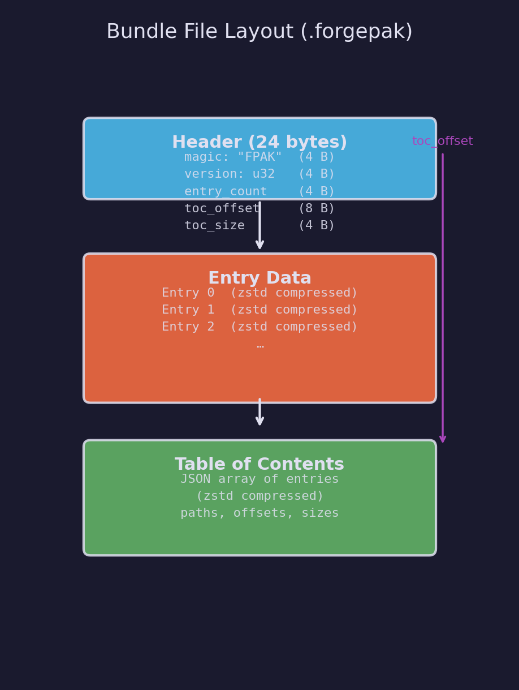
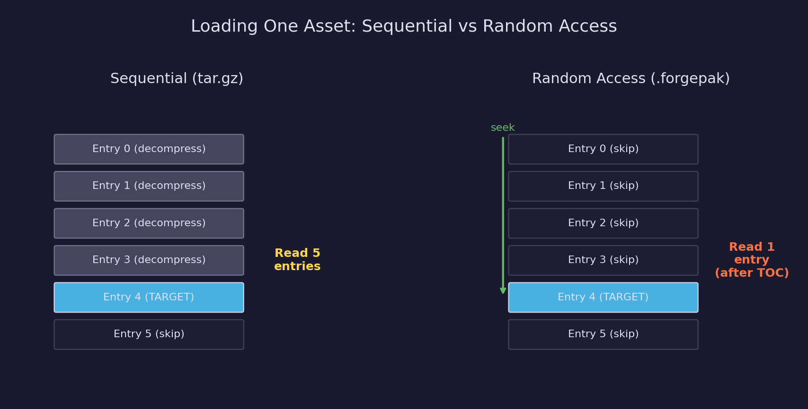
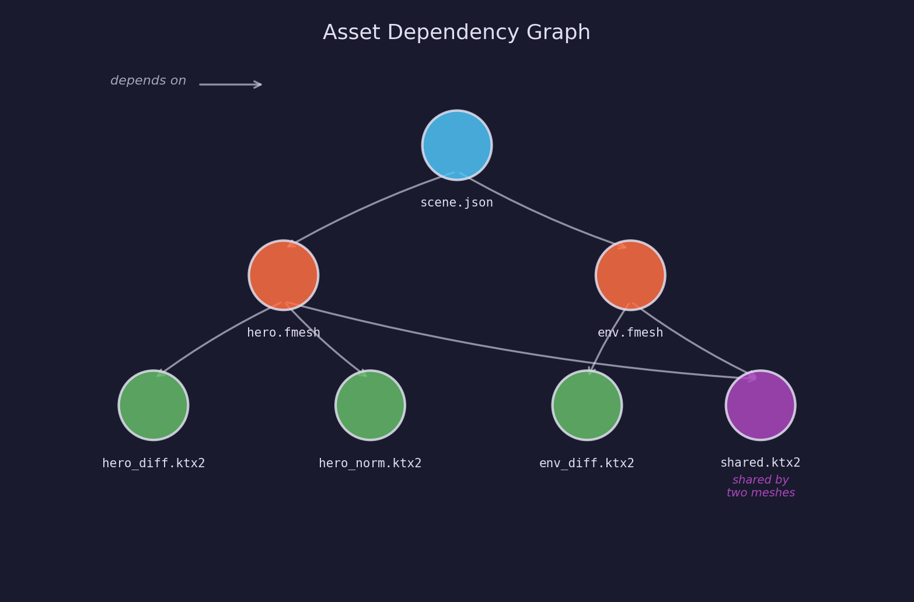

# Asset Lesson 05 — Asset Bundles

Packing processed assets into a single file for fast, random-access loading at
runtime — with per-entry zstd compression and dependency tracking between
assets.

## What you'll learn

- Why game projects bundle assets instead of shipping loose files
- The `.forgepak` binary format: header, entry data, and table of contents
- Per-entry compression with zstd for random access without sequential unpacking
- Building a dependency graph from metadata sidecars
- Topological sorting to determine correct processing order
- CLI integration: `forge-pipeline bundle` and `forge-pipeline info` subcommands

## Result

After processing assets and running the bundle command:

```text
$ forge-pipeline bundle -o assets/bundles/game.forgepak

Bundling assets from assets/processed...

Bundle written: assets/bundles/game.forgepak
  Entries:        12
  Original size:  4,821,504 bytes
  Compressed:     1,247,832 bytes (25.9%)
  Bundle file:    1,248,106 bytes
```

Inspecting the bundle:

```text
$ forge-pipeline info assets/bundles/game.forgepak

Bundle: assets/bundles/game.forgepak
Version: 1
Entries: 12
Total:   4,821,504 bytes -> 1,247,832 bytes (25.9%)

Path                                     Original   Compressed   Ratio
-------------------------------------------------------------------------
textures/brick.png                        262,144      198,432   75.7%
textures/brick_normal.png                 262,144      201,088   76.7%
textures/metal.png                        131,072       42,816   32.7%
meshes/hero.fmesh                         524,288       89,344   17.0%
  -> textures/brick.png
  -> textures/brick_normal.png
meshes/environment.fmesh                1,048,576      187,648   17.9%
  -> textures/metal.png
...
```

Running the tests:

```text
$ pytest tests/pipeline/test_bundler.py -v

tests/pipeline/test_bundler.py::TestBundleEntry::test_to_dict_round_trip PASSED
tests/pipeline/test_bundler.py::TestBundleEntry::test_to_dict_omits_empty_dependencies PASSED
...
tests/pipeline/test_bundler.py::TestCreateBundle::test_compressed_round_trip PASSED

============================== 46 passed ==============================
```

## Why bundle assets?

Shipping hundreds of loose files creates three problems:

1. **Filesystem overhead.** Each file has metadata (inode, directory entry,
   allocation block). Thousands of small files waste disk space and slow
   directory listing.

2. **I/O latency.** Opening a file is expensive — the OS must resolve the
   path, check permissions, and allocate a file descriptor. Loading 200
   textures means 200 open/read/close cycles. A single bundle reduces this
   to one open and N seeks.

3. **Distribution complexity.** Patching, checksumming, and downloading one
   file is simpler than managing a directory tree. Bundle files can be
   verified with a single hash.

Most game engines use some form of asset bundling: Unity has AssetBundles,
Unreal has `.pak` files, Godot has `.pck` files, and id Tech uses `.pk3`
(renamed ZIP). The format varies, but the goals are the same: fewer files,
faster access, optional compression.

## The `.forgepak` format

The bundle format is intentionally simple — three sections, no nested
structures, no encryption:



### Header (24 bytes, fixed)

The header sits at byte 0 and has a fixed size so the reader can parse it
in a single read:

| Field | Type | Bytes | Description |
|---|---|---|---|
| `magic` | bytes | 4 | `b"FPAK"` — identifies the file format |
| `version` | uint32 LE | 4 | Format version (currently 1) |
| `entry_count` | uint32 LE | 4 | Number of entries in the bundle |
| `toc_offset` | uint64 LE | 8 | Byte offset of the TOC from file start |
| `toc_size` | uint32 LE | 4 | Compressed size of the TOC in bytes |

Little-endian encoding matches x86/ARM conventions and avoids byte-swapping
on the platforms where forge-gpu runs.

### Entry data (variable)

Each processed asset is stored as a contiguous block of bytes, compressed
independently with zstd. The blocks follow the header with no padding or
alignment — the TOC records the exact offset and size of each block.

### Table of contents (variable, at end)

The TOC is a JSON array compressed with zstd. Each element describes one
entry:

```json
[
  {
    "path": "textures/brick.png",
    "offset": 24,
    "size": 198432,
    "original_size": 262144,
    "compression": "zstd",
    "fingerprint": "a1b2c3...",
    "dependencies": ["textures/brick_normal.png"]
  }
]
```

The TOC sits at the **end** of the file so the writer can append entries
sequentially without knowing the final TOC size. After all entries are
written, the writer serializes the TOC, appends it, then seeks back to byte
0 to patch the header with the real `toc_offset` and `toc_size`.

## Per-entry compression

The key design decision is compressing each entry independently rather than
compressing the entire file as a single stream.



**Whole-file compression** (like gzipping a tar archive) achieves better
compression ratios because the compressor can find patterns across entries.
But reading one entry requires decompressing everything before it — the
compressor's internal state depends on all preceding bytes.

**Per-entry compression** trades a few percent of compression ratio for O(1)
random access. The reader seeks to the entry's offset, reads its compressed
size, and decompresses that block alone. For a game loading one texture from
a 500 MB bundle, this is the difference between reading 200 KB and reading
500 MB.

The pipeline uses [zstd](https://facebook.github.io/zstd/) (Zstandard)
because it offers:

- **Fast decompression** — 1.5 GB/s on a single core, important for load times
- **Tunable compression** — levels 1-22 trade speed for ratio
- **Small overhead** — minimal per-block metadata
- **Wide adoption** — used by Linux kernel, Chrome, and many game engines

The default compression level is 3, which provides a good balance. Level 1
is fastest, level 19+ is best ratio but slow. The `--level` flag on the
`bundle` subcommand lets you choose.

## Dependency tracking

Assets reference each other: a mesh uses textures, a scene references meshes.
When a texture changes, every mesh that uses it must be re-bundled. Tracking
these relationships requires a **dependency graph**.



### Building the graph

Each processed asset has a `.meta.json` sidecar file (produced by the
texture and mesh plugins in
[Lessons 02](../02-texture-processing/) and
[03](../03-mesh-processing/)). The sidecar may contain a `dependencies`
key listing other assets that the source file references:

```json
{
  "source": "hero.gltf",
  "plugin": "mesh",
  "dependencies": ["textures/hero_diffuse.png", "textures/hero_normal.png"]
}
```

`DependencyGraph.from_meta_files()` scans the output directory for all
`.meta.json` files and builds the graph automatically.

### Querying the graph

The graph supports three query types:

- **Forward:** *what does asset A depend on?* — `dependencies_of("hero.fmesh")`
  returns `{"hero_diffuse.ktx2", "hero_normal.ktx2"}`
- **Reverse:** *what depends on asset B?* — `dependents_of("hero_diffuse.ktx2")`
  returns `{"hero.fmesh"}`
- **Transitive:** *what is invalidated if B changes?* —
  `all_dependents_of("hero_diffuse.ktx2")` follows the chain upward
  through the graph

### Topological sort

When processing assets in dependency order, dependencies must come before
dependents. The `topological_order()` method uses
[Kahn's algorithm](https://en.wikipedia.org/wiki/Topological_sorting#Kahn's_algorithm)
to produce a valid ordering — or raises `BundleError` if the graph contains
a cycle (which would mean two assets each depend on the other, an error in
the asset metadata).

## The bundler API

The bundler lives in
[`pipeline/bundler.py`](../../../pipeline/bundler.py) — part of the shared
pipeline package, not lesson-local code.

### Writing bundles

```python
from pathlib import Path
from pipeline.bundler import BundleWriter

writer = BundleWriter(Path("game.forgepak"))
writer.add("textures/brick.png", brick_bytes)
writer.add_file(Path("processed/hero.fmesh"), "meshes/hero.fmesh",
                dependencies=["textures/brick.png"])
manifest = writer.finalize()

print(f"Wrote {len(manifest.entries)} entries")
```

`BundleWriter` opens the output file, writes a placeholder header, then
appends each entry's compressed data. `finalize()` writes the TOC, patches
the header, and closes the file. After `finalize()`, no more entries can
be added.

### Reading bundles

```python
from pathlib import Path
from pipeline.bundler import BundleReader

with BundleReader(Path("game.forgepak")) as reader:
    # List all entries.
    for path in reader.manifest.paths:
        print(path)

    # Read one entry (seeks + decompresses).
    brick_data = reader.read("textures/brick.png")
```

`BundleReader` reads the header and TOC on construction. Each `read()` call
seeks to the entry's offset and decompresses the data — no other entries are
touched.

### Convenience function

For the common case of bundling an entire output directory:

```python
from pathlib import Path
from pipeline.bundler import create_bundle

manifest = create_bundle(
    output_dir=Path("assets/processed"),
    bundle_path=Path("assets/bundles/game.forgepak"),
    compress=True,
    compression_level=3,
    patterns=["*.png", "*.fmesh"],  # optional filter
)
```

`create_bundle()` scans the directory, reads `.meta.json` files for
dependency information, excludes sidecar files from the bundle, and packs
everything into one file.

## CLI subcommands

Lesson 05 adds two subcommands to the `forge-pipeline` CLI.

### `forge-pipeline bundle`

Pack processed assets into a `.forgepak` file:

```bash
# Bundle all processed assets
forge-pipeline bundle

# Custom output path
forge-pipeline bundle -o game.forgepak

# Disable compression (faster, larger)
forge-pipeline bundle --no-compress

# Higher compression (slower, smaller)
forge-pipeline bundle --level 19

# Only bundle specific file types
forge-pipeline bundle --pattern "*.png" --pattern "*.fmesh"
```

### `forge-pipeline info`

Inspect an existing bundle:

```bash
forge-pipeline info assets/bundles/game.forgepak
```

Shows every entry with its path, original size, compressed size, compression
ratio, and dependencies.

## Key concepts

- **Bundle** — A single file containing multiple assets with a table of
  contents for random access. Reduces filesystem overhead, I/O latency,
  and distribution complexity compared to loose files.

- **Table of contents (TOC)** — An index mapping asset paths to byte offsets
  and sizes within the bundle. The TOC sits at the end of the file so entries
  can be written sequentially; the header stores the TOC offset for the reader.

- **Per-entry compression** — Each asset is compressed independently so any
  single entry can be decompressed without reading the rest of the bundle.
  This enables O(1) random access at the cost of a few percent compression
  ratio versus whole-file compression.

- **Dependency graph** — A directed graph tracking which assets reference
  which other assets. When an asset changes, its dependents are
  invalidated and must be reprocessed. Topological sorting determines
  correct processing order.

- **Zstandard (zstd)** — A fast compression algorithm by Yann Collet at
  Meta. Offers configurable compression levels (1-22) and decompresses
  at ~1.5 GB/s on a single core.

## Configuration

The `[bundle]` section in `pipeline.toml` controls bundling behavior:

```toml
[bundle]
bundle_dir = "assets/bundles"    # where bundle files are written
```

CLI flags override configuration:

| Flag | Default | Description |
|---|---|---|
| `-o` / `--output` | `<bundle_dir>/assets.forgepak` | Output bundle path |
| `--no-compress` | (compress on) | Disable zstd compression |
| `--level` | 3 | Zstd compression level (1-22) |
| `--pattern` | (all files) | Glob filter (repeatable) |

## Connection to other lessons

| Track | Lesson | Connection |
|---|---|---|
| Assets | [01 — Pipeline Scaffold](../01-pipeline-scaffold/) | CLI, config, scanning — the foundation this lesson extends |
| Assets | [02 — Texture Processing](../02-texture-processing/) | Produces `.meta.json` sidecars consumed by the dependency graph |
| Assets | [03 — Mesh Processing](../03-mesh-processing/) | Produces `.fmesh` files and `.meta.json` with dependency lists |
| Engine | [04 — Pointers and Memory](../../engine/04-pointers-and-memory/) | Binary file I/O, struct packing, and seeking |
| GPU | [04 — Textures and Samplers](../../gpu/04-textures-and-samplers/) | Consumes the texture data packed inside bundles |

## Building

### Prerequisites

- Python 3.10+
- The pipeline package installed: `pip install -e ".[dev]"` (from repo root)

The `zstandard` package is listed as a dependency in `pyproject.toml` and
installs automatically with `pip install`.

### Running

```bash
# Process assets first (from a directory with pipeline.toml)
forge-pipeline -v

# Bundle the processed output
forge-pipeline bundle

# Inspect the result
forge-pipeline info assets/bundles/assets.forgepak

# Run the tests
pytest tests/pipeline/test_bundler.py -v
```

## AI skill

The [forge-asset-pipeline](../../../.claude/skills/forge-asset-pipeline/SKILL.md)
skill can scaffold an asset processing pipeline with bundling support. It
includes the `BundleWriter` / `BundleReader` API and CLI bundling commands.

## Exercises

1. **Selective bundling.** Create two bundles — one for textures and one for
   meshes — using `--pattern` filters. Compare their sizes and think about
   when you would split bundles (e.g. per-level loading, DLC packs).

2. **Compression benchmark.** Bundle the same assets at compression levels 1,
   3, 9, and 19. Measure file size and bundling time for each level. Plot the
   results and find the diminishing-returns point where higher levels no
   longer improve the ratio significantly.

3. **Bundle diffing.** Write a Python script that takes two `.forgepak` files,
   reads their manifests, and reports which entries were added, removed, or
   changed (by comparing fingerprints). This is the foundation of patch
   generation for game updates.

4. **Streaming loader.** Write a C function that opens a `.forgepak` file,
   reads the header and TOC, and loads a single texture entry by path. Use
   `SDL_IOFromFile` for portable file I/O and `SDL_malloc` for the
   decompression buffer. This bridges the Python pipeline to the C runtime.
