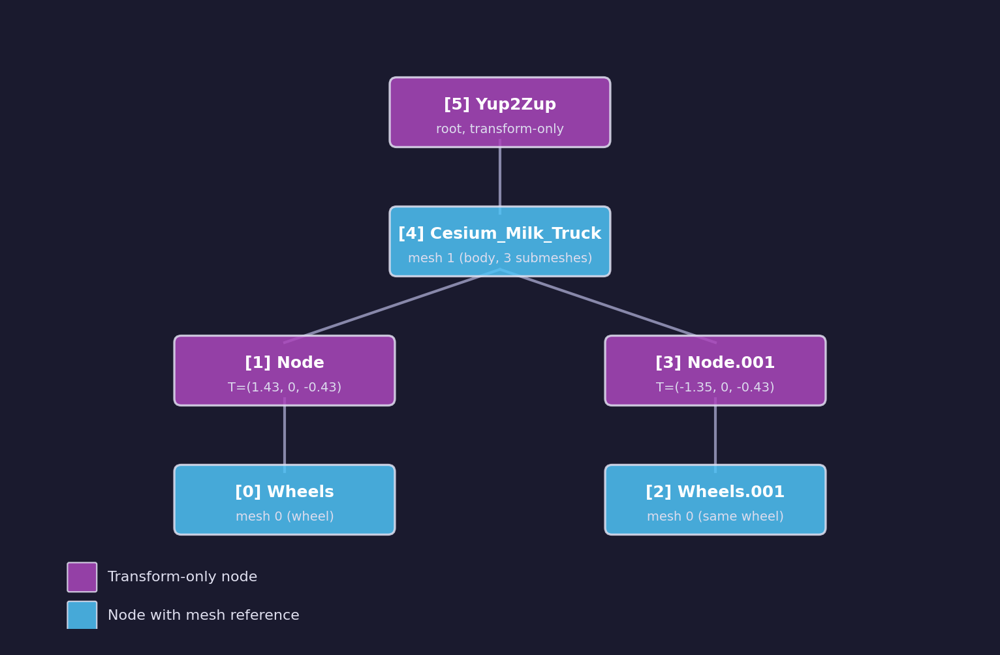

# Asset Lesson 09 — Scene Hierarchy

## What you'll learn

- Why flattening glTF primitives into a single mesh loses node transforms and
  instancing
- How to extract the glTF node tree into a compact binary format (`.fscene`)
- How the runtime loader reconstructs world transforms by walking the hierarchy
- How the mesh table maps glTF mesh indices to `.fmesh` submesh ranges
- How the Python pipeline plugin integrates the C tool as a subprocess

## Result

The scene tool reads a glTF file and produces two output files:

- **`.fscene`** — compact binary with the full node hierarchy, mesh table,
  and per-node transforms
- **`.meta.json`** — human-readable sidecar with node names, mesh mappings,
  and hierarchy statistics

The runtime loader reads the `.fscene` binary, reconstructs world transforms,
and provides the mesh table so the renderer can draw each node's submeshes at
the correct position.

## The problem

The mesh processing tool (Asset Lesson 03) flattens all glTF primitives into a
single `.fmesh` file with one shared vertex/index buffer. This works for
single-node models, but glTF scenes often contain multiple nodes with their own
transforms:



Without the node tree, the renderer has no way to position these parts. Both
wheels and the truck body all render at the origin.

An earlier attempt tried to fix this by baking world transforms into vertex
positions during export. This is wrong for two reasons:

1. **Instancing is destroyed.** Nodes 0 and 2 share mesh 0 (the wheel). Baking
   different transforms into the same mesh creates two separate meshes.
2. **Animation is impossible.** Animation channels target node transforms. If
   the transform is baked into vertices, there is nothing left to animate.

The correct approach is to export the node tree as data and let the renderer
apply per-node transforms at draw time.

## The `.fscene` binary format

The scene tool writes a binary file with four sections:

```text
Header (24 bytes):
  magic          "FSCN"
  version        u32 (1)
  node_count     u32
  mesh_count     u32
  root_count     u32
  reserved       u32

Root indices:    root_count × u32
Mesh table:      mesh_count × 8 bytes (first_submesh u32, submesh_count u32)
Node table:      node_count × 192 bytes (fixed-size entries)
Children array:  total_children × u32
```

Each node entry contains:

| Field | Size | Description |
|-------|------|-------------|
| name | 64 bytes | Null-terminated, zero-padded |
| parent | i32 | Parent node index, -1 = root |
| mesh_index | i32 | glTF mesh index, -1 = no mesh |
| skin_index | i32 | glTF skin index, -1 = no skin |
| first_child | u32 | Index into the children array |
| child_count | u32 | Number of children |
| has_trs | u32 | 1 = TRS decomposition valid |
| translation | float[3] | T component |
| rotation | float[4] | R as quaternion (x, y, z, w) |
| scale | float[3] | S component |
| local_transform | float[16] | Column-major 4×4 matrix |

World transforms are **not** stored in the binary. The runtime loader computes
them by walking the tree: `world = parent_world × local`. This keeps the file
minimal and means the loader always produces correct results regardless of how
the source tool orders nodes.

### Mesh table

The mesh table maps each glTF mesh index to a range of submeshes in the
`.fmesh` file. The mesh tool writes primitives in mesh order, so mesh 0's
primitives come first, then mesh 1's, and so on.

For the CesiumMilkTruck:

| Mesh | Name | first_submesh | submesh_count |
|------|------|---------------|---------------|
| 0 | Wheels | 0 | 1 |
| 1 | Cesium_Milk_Truck | 1 | 3 |

When the renderer encounters a node with `mesh_index = 0`, it looks up the
mesh table to find submeshes 0..0. For `mesh_index = 1`, it draws submeshes
1..3.

## The C tool

The scene tool at `tools/scene/main.c` follows the same pattern as the
animation tool:

1. Parse glTF via `forge_gltf_load()` (arena-allocated)
2. Build the mesh table from `scene.meshes[]`
3. Write the `.fscene` binary
4. Write the `.meta.json` sidecar

```bash
forge-scene-tool <input.gltf> <output.fscene> [--verbose]
```

The `--verbose` flag prints each node with its parent, mesh index, and child
count — useful for verifying the hierarchy matches the source.

## The runtime loader

`forge_pipeline.h` adds three new types and two new functions:

```c
/* A single node in the scene hierarchy */
typedef struct ForgePipelineSceneNode {
    char     name[64];
    int32_t  parent;              /* -1 = root */
    int32_t  mesh_index;          /* -1 = no mesh */
    int32_t  skin_index;          /* -1 = no skin */
    uint32_t first_child;
    uint32_t child_count;
    uint32_t has_trs;
    float    translation[3];
    float    rotation[4];         /* xyzw quaternion */
    float    scale[3];
    float    local_transform[16]; /* column-major 4×4 */
    float    world_transform[16]; /* computed at load time */
} ForgePipelineSceneNode;

/* Maps a glTF mesh index to submesh ranges in the .fmesh */
typedef struct ForgePipelineSceneMesh {
    uint32_t first_submesh;
    uint32_t submesh_count;
} ForgePipelineSceneMesh;

/* The complete scene hierarchy */
typedef struct ForgePipelineScene {
    ForgePipelineSceneNode *nodes;
    uint32_t                node_count;
    ForgePipelineSceneMesh *meshes;
    uint32_t                mesh_count;
    uint32_t               *roots;
    uint32_t                root_count;
    uint32_t               *children;
    uint32_t                child_count;
} ForgePipelineScene;
```

Load and free:

```c
ForgePipelineScene scene;
forge_pipeline_load_scene("model.fscene", &scene);
/* ... use scene ... */
forge_pipeline_free_scene(&scene);
```

The loader reads the binary, populates all arrays, and computes world
transforms by recursively walking from each root node.

## Usage at render time

```c
ForgePipelineScene scene;
ForgePipelineMesh  mesh;

forge_pipeline_load_scene("model.fscene", &scene);
forge_pipeline_load_mesh("model.fmesh", &mesh);

for (uint32_t i = 0; i < scene.node_count; i++) {
    ForgePipelineSceneNode *node = &scene.nodes[i];
    if (node->mesh_index < 0) continue;  /* transform-only node */

    /* Look up which submeshes this mesh uses */
    const ForgePipelineSceneMesh *sm =
        forge_pipeline_scene_get_mesh(&scene, (uint32_t)node->mesh_index);

    /* Draw each submesh with this node's world transform */
    for (uint32_t s = 0; s < sm->submesh_count; s++) {
        uint32_t submesh_idx = sm->first_submesh + s;
        const ForgePipelineSubmesh *sub =
            forge_pipeline_lod_submesh(&mesh, 0, submesh_idx);

        /* Push node->world_transform as the model matrix */
        /* Draw sub->index_count indices at sub->index_offset */
    }
}
```

## The Python plugin

`pipeline/plugins/scene.py` follows the same subprocess pattern as the mesh
and animation plugins. It registers for `.gltf` and `.glb` extensions and
coexists with both — the pipeline registry supports multiple plugins per
extension.

```toml
# pipeline.toml
[scene]
tool_path = ""  # override forge-scene-tool location
```

If the tool is not installed, the plugin logs a warning and returns a no-op
result. This keeps the pipeline functional for users who only need texture
or mesh processing.

## Key concepts

- **Scene hierarchy is data, not baked geometry.** Storing the node tree lets
  the renderer instance meshes, apply per-node transforms, and animate
  node-level properties.
- **Mesh table bridges .fscene and .fmesh.** The glTF mesh index in each node
  maps through the mesh table to a submesh range in the .fmesh file.
- **World transforms are computed, not stored.** The loader walks the tree once
  at load time. This keeps the file format minimal and eliminates a class of
  consistency bugs.
- **Multi-plugin coexistence.** Mesh, animation, and scene plugins all handle
  `.gltf`/`.glb` files. Each produces a different output format — `.fmesh`,
  `.fanim`, `.fscene` — from the same source.

## Where it connects

| Lesson | Connection |
|--------|------------|
| [Asset 03 — Mesh Processing](../03-mesh-processing/) | Produces the `.fmesh` file that `.fscene` mesh table references |
| [Asset 06 — Loading Processed Assets](../06-loading-processed-assets/) | `forge_pipeline.h` — the runtime loader this lesson extends |
| [Asset 07 — Materials](../07-materials/) | `.fmat` material sidecars used alongside `.fscene` for rendering |
| [Asset 08 — Animations](../08-animations/) | `.fanim` animation channels target nodes by index in the `.fscene` tree |
| [GPU 09 — Scene Loading](../../gpu/09-scene-loading/) | Raw glTF loading — `.fscene` is the pipeline-processed equivalent |
| [GPU 32 — Skinning Animations](../../gpu/32-skinning-animations/) | Skin indices in `.fscene` nodes connect to the skinning pipeline |
| [Engine 12 — Memory Arenas](../../engine/12-memory-arenas/) | Arena allocator that unblocked this lesson — `forge_gltf_load()` uses it |

## Building

The scene tool builds as part of the CMake project:

```bash
cmake -B build
cmake --build build --config Debug --target forge_scene_tool
```

Run the tool directly:

```bash
./build/tools/scene/Debug/forge_scene_tool assets/model.gltf output/model.fscene --verbose
```

The Python plugin invokes the tool automatically when processing `.gltf` or
`.glb` files through the pipeline:

```bash
pip install -e ".[dev]"
forge-pipeline -v
```

Run the tests:

```bash
cmake --build build --config Debug --target test_pipeline
ctest --test-dir build -C Debug -R pipeline
pytest tests/pipeline/test_scene.py -v
```

## Exercises

1. **Print the hierarchy tree.** Write a small program that loads a `.fscene`
   file and prints the node tree with indentation showing parent-child
   relationships, similar to the CesiumMilkTruck example at the top of this
   lesson.

2. **Count instanced meshes.** Scan the node table and report which mesh
   indices appear more than once. These are instanced meshes — the same
   geometry drawn at multiple positions.

3. **Validate parent-child consistency.** Write a test that verifies: every
   node listed in the children array has its `parent` field set to the node
   that references it. This catches serialization bugs.

4. **Add world transform export.** Extend the `.fscene` format (bump the
   version to 2) to optionally include precomputed world transforms. Compare
   file sizes and load times with and without precomputed transforms.

## Further reading

- [glTF 2.0 specification — Nodes and Hierarchy](https://registry.khronos.org/glTF/specs/2.0/glTF-2.0.html#nodes-and-hierarchy)
- [glTF 2.0 specification — Skins](https://registry.khronos.org/glTF/specs/2.0/glTF-2.0.html#skins)
- [`forge_gltf.h` — glTF parser](../../../common/gltf/)
- [`forge_pipeline.h` — Runtime loader](../../../common/pipeline/)
