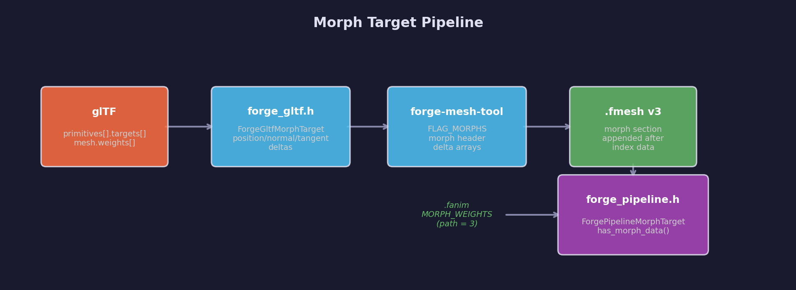
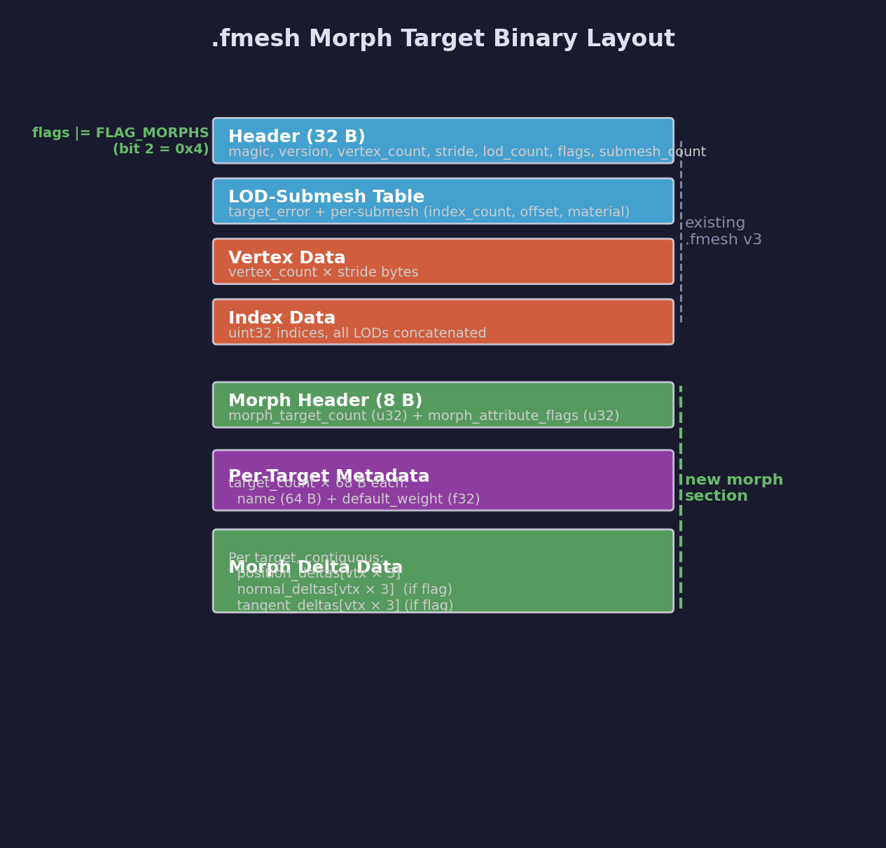

# Asset Lesson 13 — Morph Targets

Adds morph target (blend shape) support across the asset pipeline: glTF
morph target parsing, `.fmesh` morph delta serialization, morph weight
animation channels in `.fanim`, and runtime morph data loading in
`forge_pipeline.h`. After this lesson, the pipeline can export and load
position, normal, and tangent deltas for GPU-side blend shape deformation.

## What you'll learn

- Morph target fundamentals: delta encoding, weight blending, attribute
  flags for position/normal/tangent channels
- glTF morph target parsing: `primitives[].targets[]` with POSITION,
  NORMAL, and TANGENT accessor resolution
- `.fmesh` morph extension: `FLAG_MORPHS` bit, binary layout with
  per-target metadata and contiguous delta arrays appended after indices
- Morph weight animation: `MORPH_WEIGHTS` path (value 3) in `.fanim`
  channels with variable component counts
- Runtime loader updates: `ForgePipelineMorphTarget` struct, morph section
  reading, `forge_pipeline_has_morph_data()` query
- Backward compatibility: existing `.fmesh` v2/v3 files without morphs
  continue to load unchanged

## Pipeline overview



## Result

After completing this lesson:

- `forge_gltf.h` parses `primitives[].targets[]` into
  `ForgeGltfMorphTarget` structs with per-vertex deltas
- `forge-mesh-tool` serializes morph deltas into `.fmesh` with
  `FLAG_MORPHS` and writes morph metadata to `.meta.json`
- `forge_pipeline.h` loads morph data at runtime with full validation
- `.fanim` files support `MORPH_WEIGHTS` channels for weight animation
- Tests cover loading, error cases, flag combinations, and free safety

Load morph data at runtime:

```c
ForgePipelineMesh mesh;
if (forge_pipeline_load_mesh("character.fmesh", &mesh)) {
    if (forge_pipeline_has_morph_data(&mesh)) {
        for (uint32_t i = 0; i < mesh.morph_target_count; i++) {
            ForgePipelineMorphTarget *mt = &mesh.morph_targets[i];
            /* mt->name is the target name (e.g. "smile", "blink") */
            /* mt->default_weight is the bind-pose weight */
            /* mt->position_deltas[vertex * 3 + component] */
            /* mt->normal_deltas and mt->tangent_deltas may be NULL */
        }
    }
    forge_pipeline_free_mesh(&mesh);
}
```

## Key concepts

### Delta encoding

Morph targets store per-vertex displacement deltas rather than absolute
positions. The deformed vertex position is computed as:

```text
final_position = base_position + Σ(weight_i × delta_i)
```

This approach is memory-efficient — deltas are often sparse (mostly zero
for localized deformations like facial expressions) — and allows
additive blending of multiple targets simultaneously.

### Attribute flags

The morph section header includes a bitmask indicating which vertex
attributes have deltas:

| Bit | Attribute | Description |
|-----|-----------|-------------|
| 0   | Position  | Vertex position displacements (most common) |
| 1   | Normal    | Surface normal adjustments for correct lighting |
| 2   | Tangent   | Tangent vector adjustments for normal mapping |

Position deltas are always present. Normal and tangent deltas are
optional — when absent, normals and tangents can be recomputed from the
deformed positions if needed.

### Weight animation

Morph target weights are animated through `.fanim` channels with
`target_path = 3` (MORPH\_WEIGHTS). Unlike TRS channels that always have
3 or 4 components, morph weight samplers have a variable component count
equal to the number of morph targets on the mesh. Each keyframe stores
one weight per target.

## `.fmesh` morph target layout



Morph data is appended after the index data section when `FLAG_MORPHS`
(bit 2, `0x4`) is set in the header flags. The base `.fmesh` format
(header, LOD tables, vertices, indices) is unchanged.

```text
[Morph header — 8 bytes]
  morph_target_count      u32
  morph_attribute_flags   u32    bit 0=position, bit 1=normal, bit 2=tangent

[Per-target metadata — target_count × 68 bytes]
  name                    64B    null-terminated, zero-padded
  default_weight          f32

[Morph delta data — per target, contiguous]
  For each target:
    if (attr_flags & 0x1): position_deltas[vertex_count × 3 floats]
    if (attr_flags & 0x2): normal_deltas[vertex_count × 3 floats]
    if (attr_flags & 0x4): tangent_deltas[vertex_count × 3 floats]
```

Deltas are appended (not interleaved with base vertices). GPU Lesson 44
uploads them to storage buffers for vertex shader blending.

## API reference

### Types

```c
/* Per-target morph data loaded from .fmesh */
typedef struct ForgePipelineMorphTarget {
    char   name[64];           /* target name, null-terminated */
    float  default_weight;     /* bind-pose weight (from mesh.weights) */
    float *position_deltas;    /* vertex_count × 3 floats, NULL if absent */
    float *normal_deltas;      /* vertex_count × 3 floats, NULL if absent */
    float *tangent_deltas;     /* vertex_count × 3 floats, NULL if absent */
} ForgePipelineMorphTarget;
```

### Loader functions

```c
/* Check if a loaded mesh has morph target data */
bool forge_pipeline_has_morph_data(const ForgePipelineMesh *mesh);

/* Access morph data through the mesh struct */
mesh.morph_targets          /* array of ForgePipelineMorphTarget */
mesh.morph_target_count     /* number of targets */
mesh.morph_attribute_flags  /* MORPH_ATTR_POSITION | NORMAL | TANGENT */
```

### Constants

```c
#define FORGE_PIPELINE_FLAG_MORPHS         (1u << 2)  /* .fmesh flag */
#define FORGE_PIPELINE_MORPH_ATTR_POSITION (1u << 0)
#define FORGE_PIPELINE_MORPH_ATTR_NORMAL   (1u << 1)
#define FORGE_PIPELINE_MORPH_ATTR_TANGENT  (1u << 2)
#define FORGE_PIPELINE_ANIM_MORPH_WEIGHTS  3  /* .fanim target_path */
```

## Tool changes

### Mesh tool (`forge-mesh-tool`)

- Detects morph targets on glTF primitives via `morph_target_count > 0`
- Disables vertex deduplication when morphs are present (deltas reference
  original vertex indices)
- Sets `FLAG_MORPHS` in the `.fmesh` header
- Appends morph header, per-target metadata, and delta arrays after indices
- Writes `"has_morphs": true` to the `.meta.json` sidecar

### Anim tool (`forge-anim-tool`)

- `target_path = 3` (weights) channels from the glTF parser now flow
  through to `.fanim` output instead of being skipped
- The header comment documents the new path value

### Pipeline plugin (`pipeline/plugins/mesh.py`)

- Logs morph target detection from the `.meta.json` sidecar

## Tests

Pipeline tests (`tests/pipeline/test_pipeline.c`) cover:

| Test | What it verifies |
|------|------------------|
| `morph_load_position_only` | Load 2-target mesh with position deltas, check values |
| `morph_load_pos_and_normal` | Position + normal attribute flags |
| `morph_load_all_attrs` | All three attribute flags (position + normal + tangent) |
| `morph_with_skin` | Combined `FLAG_SKINNED \| FLAG_MORPHS` |
| `morph_bad_target_count` | Reject target\_count exceeding maximum |
| `morph_bad_target_count_zero` | Reject target\_count of zero with FLAG\_MORPHS set |
| `morph_bad_attr_flags_zero` | Reject morph\_attr\_flags with no attributes |
| `morph_bad_attr_flags_unknown` | Reject morph\_attr\_flags with unknown bits |
| `morph_truncated_data` | Reject file truncated in morph delta section |
| `morph_flag_without_data` | Reject `FLAG_MORPHS` set but no morph data present |
| `morph_free_null` | `free_mesh` handles zero morph data |
| `morph_double_free` | Second `free_mesh` is safe (struct zeroed) |
| `morph_v3_flag_accepted` | Morph flag works on v3 files |
| `morph_anim_path_accepted` | `.fanim` loader accepts `MORPH_WEIGHTS` path |
| `morph_anim_apply_skips_weights` | Morph weight channels skip node TRS |
| `morph_backward_compat_no_flag` | v3 without morph flag loads with zero morph data |

Run all pipeline tests:

```bash
cmake --build build --target test_pipeline
ctest --test-dir build -R pipeline
```

## Building

```bash
# Rebuild mesh tool and pipeline tests
cmake --build build --target forge_mesh_tool
cmake --build build --target test_pipeline

# Run tests
ctest --test-dir build -R pipeline
ctest --test-dir build -R gltf
```

## Exercises

1. Process a glTF model with morph targets (e.g. `AnimatedMorphCube` from
   the glTF sample assets) through `forge-mesh-tool` and inspect the
   `.meta.json` sidecar for morph metadata
2. Write a small program that loads a morphed `.fmesh` and prints each
   target's name, default weight, and delta statistics (min/max/mean)
3. Extend the morph section to support sparse deltas — store only
   non-zero deltas with vertex index lists to reduce file size for
   facial animation targets that affect a small subset of vertices

## Cross-references

- [Asset Lesson 08 — Animations](../08-animations/) — glTF animation
  parsing and keyframe interpolation
- [Asset Lesson 12 — Skinned Animations](../12-skinned-animations/) —
  `.fskin` format and skinned vertices (same extension pattern)
- [GPU Lesson 44 — Pipeline Morph Target Animations](../../gpu/) —
  renders morph targets on the GPU with storage buffers and vertex
  shader blending
