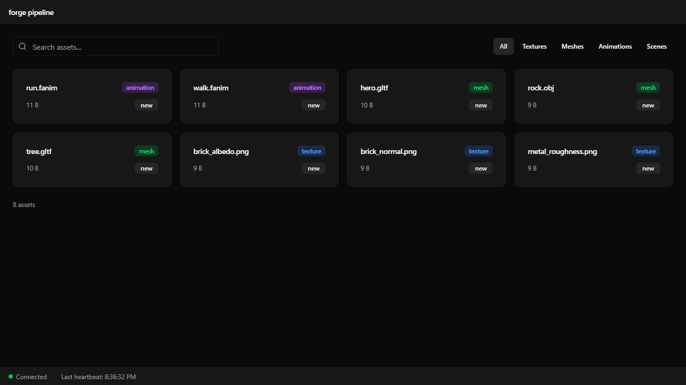
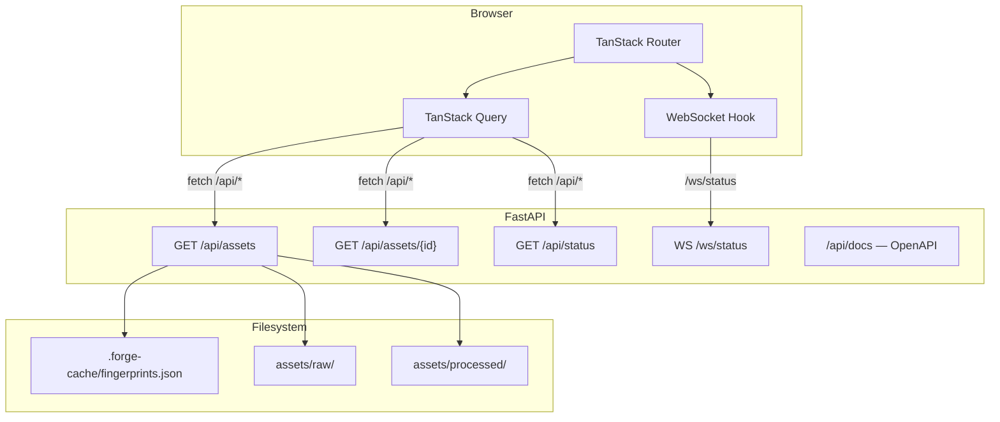

# Asset Lesson 14 — Web UI Scaffold

## What you'll learn

- Add a web-based asset browser to the forge pipeline
- Build a FastAPI backend that serves REST endpoints and a WebSocket
- Scaffold a Vite + React + TypeScript frontend with TanStack Router and Query
- Use shadcn/ui and Tailwind CSS for the UI component layer
- Connect frontend and backend with a dev proxy and WebSocket hook

## Result



Running `python -m pipeline serve` starts a local web server. Open
`http://localhost:8000` to browse all assets the pipeline knows about —
filtered by type, searchable by name, with real-time build status via
WebSocket.

## Architecture



In development, Vite runs on port 5173 and proxies `/api/*` and `/ws/*` to
FastAPI on port 8000. In production, FastAPI serves the built frontend as
static files — single process, single port.

## Backend

### Data model

The server scans the source directory and builds an `AssetInfo` for each file.
Asset type is detected by extension:

| Type | Extensions |
|------|-----------|
| texture | `.png`, `.jpg`, `.jpeg`, `.bmp`, `.tga`, `.hdr`, `.exr` |
| mesh | `.gltf`, `.glb`, `.obj` |
| animation | `.fanim`, `.fanims` |
| scene | `.fscene` |

Each asset gets a URL-safe ID derived from its relative path — `textures/brick_albedo.png`
becomes `textures--brick_albedo`.

Status is determined by comparing the source file's fingerprint against the
cache and checking for a corresponding output file:

| Status | Meaning |
|--------|---------|
| processed | Fingerprint matches cache and output file exists |
| new | Not in the fingerprint cache |
| changed | Fingerprint differs from cached value |
| missing | In cache but no output file found |

### Endpoints

The FastAPI app is created by `create_app(config)` in `pipeline/server.py`.
It uses the existing `PipelineConfig` to locate source, output, and cache
directories.

```python
from pipeline.server import create_app
from pipeline.config import load_config

config = load_config(Path("pipeline.toml"))
app = create_app(config)
```

FastAPI auto-generates an OpenAPI schema at `/api/docs` — this is both
interactive API documentation and the source for TypeScript type generation.

### WebSocket

The `/ws/status` endpoint accepts WebSocket connections and sends heartbeat
messages every 5 seconds. The `ConnectionManager` class tracks active
connections and handles disconnects. Real build events will be added when
the pipeline gains async processing — the infrastructure is in place.

### Running the server

The `serve` subcommand was added to the pipeline CLI:

```bash
python -m pipeline serve                    # default: 127.0.0.1:8000
python -m pipeline serve --port 3000        # custom port
python -m pipeline serve --host 0.0.0.0     # listen on all interfaces
```

## Frontend

### Stack

| Layer | Library | Purpose |
|-------|---------|---------|
| Bundler | Vite 6 | Dev server, build, HMR |
| UI framework | React 19 + TypeScript | Components |
| Routing | TanStack Router | File-based routing with type safety |
| Data fetching | TanStack Query | API calls with caching and refetching |
| Components | shadcn/ui | Pre-built UI primitives (cards, badges, tables) |
| Styling | Tailwind CSS v4 | Utility-first CSS with CSS-first configuration |

### Project structure

```text
pipeline/web/
  package.json
  vite.config.ts
  tsconfig.json
  index.html
  src/
    main.tsx              # entry — React root, QueryClient, RouterProvider
    globals.css           # Tailwind v4 theme (dark, CSS-first)
    lib/
      api.ts              # fetch wrappers for /api/* endpoints
      ws.ts               # useWebSocket hook with reconnection
      utils.ts            # cn() helper, formatBytes
    routes/
      __root.tsx          # layout: nav bar, status bar, <Outlet />
      index.tsx           # asset browser: grid, search, type filter
      assets/
        $assetId.tsx      # asset detail: metadata table, placeholder preview
    components/
      ui/                 # shadcn/ui: button, card, badge, input, table
      status-bar.tsx      # WebSocket connection indicator
      type-filter.tsx     # asset type toggle buttons
```

### TanStack Router

Routes are defined as files in `src/routes/`. The TanStack Router Vite plugin
scans this directory and generates `routeTree.gen.ts` — a type-safe route tree
that the router consumes. Adding a new page is: create a file in `routes/`,
export a `Route` with `createFileRoute`, and the router picks it up.

### TanStack Query

Every API call goes through TanStack Query. The `queryKey` array determines
caching — when the type filter or search term changes, the query key changes,
and TanStack Query refetches. Stale data is shown immediately while the new
data loads.

```typescript
const { data, isLoading, error } = useQuery({
  queryKey: ["assets", typeFilter, search],
  queryFn: () => fetchAssets({ type: typeFilter, search }),
})
```

### WebSocket hook

`useWebSocket` connects to `/ws/status` and reconnects with exponential
backoff on disconnect. The root layout shows a green/red dot based on
connection state and displays the last message in a status bar.

### Development workflow

Run both servers in separate terminals:

```bash
# Terminal 1 — FastAPI backend
python -m pipeline serve

# Terminal 2 — Vite dev server (with HMR)
cd pipeline/web
npm run dev
```

Vite proxies API requests to FastAPI. Edit React code and see changes
instantly. Edit Python code and restart the server.

### Production build

```bash
cd pipeline/web
npm run build
```

This outputs static files to `pipeline/web/dist/`. FastAPI detects this
directory and serves the frontend at `/` — no separate web server needed.

## Exercises

1. **Add asset sorting** — Let the user sort by name, size, type, or status.
   Add a dropdown or clickable column headers.

2. **Thumbnail generation** — For texture assets, generate a small thumbnail
   during pipeline processing. Serve thumbnails via a new `/api/thumbnails/{id}`
   endpoint and display them in the asset cards.

3. **Build trigger** — Add a "Rebuild" button that POST to a new
   `/api/build` endpoint. The endpoint runs the pipeline and pushes progress
   events through the WebSocket.

4. **OpenAPI codegen** — Use `openapi-typescript` to generate TypeScript types
   from `http://localhost:8000/openapi.json`. Replace the hand-written
   interfaces in `api.ts` with the generated types.

## Connection to other lessons

| Lesson | Connection |
|--------|-----------|
| [Asset 01 — Pipeline Scaffold](../01-pipeline-scaffold/) | CLI architecture this extends with a web interface |
| [Asset 02 — Texture Processing](../02-texture-processing/) | Texture assets shown in the browser |
| [Asset 03 — Mesh Processing](../03-mesh-processing/) | Mesh assets shown in the browser |
| [Asset 15 — Asset Preview](../15-asset-preview/) | Next lesson — adds react-three-fiber 3D preview |

## Further reading

- [FastAPI documentation](https://fastapi.tiangolo.com/)
- [Vite documentation](https://vite.dev/)
- [TanStack Router](https://tanstack.com/router/latest)
- [TanStack Query](https://tanstack.com/query/latest)
- [shadcn/ui](https://ui.shadcn.com/)
- [Tailwind CSS v4](https://tailwindcss.com/blog/tailwindcss-v4)
