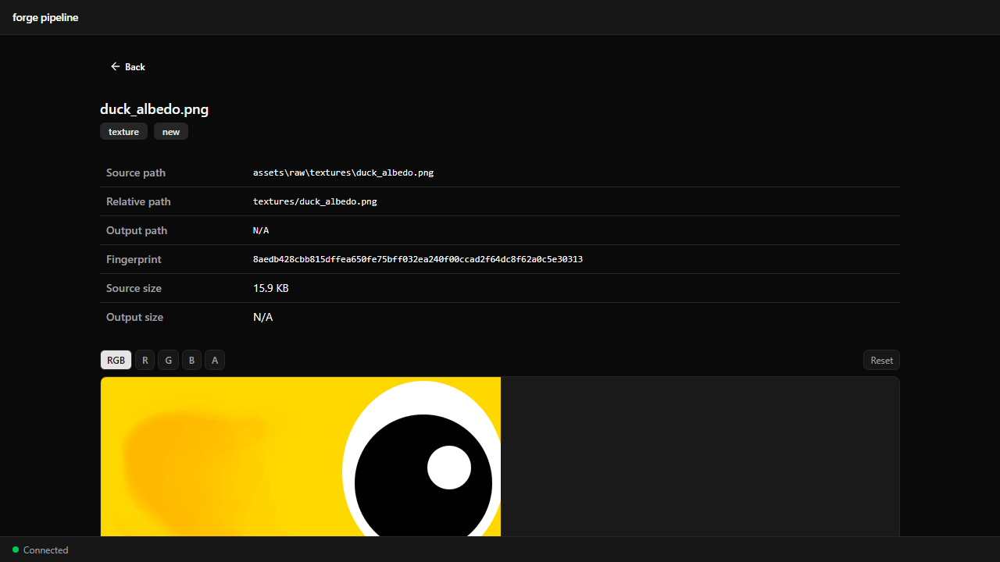
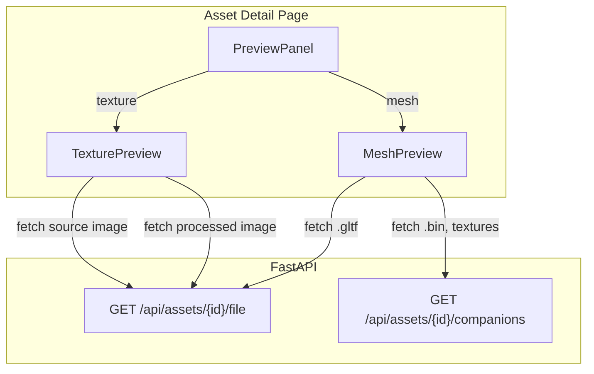

# Asset Lesson 15 — Asset Preview

## What you'll learn

- Add 3D mesh preview to the asset pipeline web UI with react-three-fiber
- Build a texture viewer with zoom, pan, and per-channel isolation
- Serve asset files from FastAPI for browser-based rendering
- Handle side-by-side comparison of source vs. processed assets
- Load glTF models in the browser with three.js

## Result



The asset detail page now shows a live preview instead of a placeholder.
Texture assets display with zoom, pan, and channel isolation controls
(R/G/B/A/RGB). Mesh assets render in an interactive 3D viewport with orbit
controls, lighting, and a wireframe toggle. When a processed version exists,
textures show source and processed side by side.

## Architecture



The `PreviewPanel` component selects the right preview based on asset type.
File endpoints serve raw asset files to the browser — textures as images,
meshes as glTF that three.js loads directly.

## Backend

### File-serving endpoints

Two new endpoints serve asset files to the browser:

**`GET /api/assets/{id}/file`** — serves the source or processed file.

```text
GET /api/assets/textures--brick_albedo/file              → source .png
GET /api/assets/textures--brick_albedo/file?variant=processed  → processed .png
```

The response includes the correct `Content-Type` header (`image/png`,
`model/gltf+json`, etc.) so the browser handles the file appropriately.

**`GET /api/assets/{id}/companions`** — serves companion files from the same
directory.

glTF models reference `.bin` geometry data and texture files by relative path.
When three.js loads a `.gltf`, it requests these companions from the same
base URL. This endpoint resolves a filename relative to the asset's directory:

```text
GET /api/assets/models--hero/companions?path=hero.bin
GET /api/assets/models--hero/companions?path=hero_baseColor.png
```

Path traversal is blocked — the resolved path must remain within the
pipeline's source (or output) directory.

## Frontend

### Texture preview

The `TexturePreview` component renders an image in a `<canvas>` element with:

- **Zoom** — mouse wheel, centered on cursor position (0.1x to 10x)
- **Pan** — click and drag when zoomed in
- **Channel isolation** — toggle buttons (RGB, R, G, B, A) redraw the canvas
  with only the selected channel's data
- **Reset** — button to restore default zoom and pan

Channel isolation works by reading pixel data from the canvas, zeroing out
unwanted channels, and writing the modified data back. The alpha channel is
displayed as grayscale.

When processed output exists, the detail page shows two `TexturePreview`
components side by side — source on the left, processed on the right — for
direct visual comparison.

### Mesh preview

The `MeshPreview` component uses react-three-fiber to render a 3D scene:

- **three.js Canvas** with a dark background
- **OrbitControls** for mouse-based orbit, zoom, and pan
- **glTF loading** via `useGLTF` from `@react-three/drei`
- **Lighting** — directional light + ambient light for Blinn-Phong-style shading
- **Auto-framing** — the camera automatically fits the model's bounding box
- **Wireframe toggle** — overlaid button switches all materials to wireframe

The glTF loader fetches the `.gltf` file from the file endpoint and resolves
companion files (`.bin`, textures) through the companions endpoint.

### Preview routing

`PreviewPanel` inspects `asset.asset_type` and renders:

| Asset type | Preview component |
|---|---|
| `texture` | `TexturePreview` (side-by-side if processed exists) |
| `mesh` | `MeshPreview` |
| `animation` | Placeholder (future lesson) |
| `scene` | Placeholder (future lesson) |

## Key concepts

- **react-three-fiber** — a React renderer for three.js that lets you build
  3D scenes with JSX components instead of imperative API calls
- **OrbitControls** — mouse-based camera control (orbit, zoom, pan) from the
  drei helper library
- **Canvas pixel manipulation** — reading and writing individual pixels via
  `getImageData` / `putImageData` for channel isolation
- **LoadingManager** — three.js hook for intercepting URL resolution, used
  to route companion file requests through the API
- **FileResponse** — FastAPI response type that streams a file from disk
  with the correct Content-Type header
- **Path traversal protection** — validating that resolved file paths stay
  within an allowed directory using `Path.is_relative_to()`

## Building

```bash
# Install Python dependencies (if not already done)
uv sync --extra dev

# Install frontend dependencies and build
cd pipeline/web
npm install
npm run build

# Start the server
cd ../..
uv run python -m pipeline serve
```

## Exercises

1. **Normal map visualization** — For texture assets that end with `_normal`,
   render the normal map as a hemisphere-colored visualization (decode the
   XY components into a 3D vector and map to RGB).

2. **Mesh statistics** — Display vertex count, triangle count, and bounding
   box dimensions below the 3D preview. Extract this data from the loaded
   glTF scene.

3. **Material preview** — When a mesh has PBR materials, show the material's
   texture maps (albedo, normal, metallic-roughness) as a grid of texture
   previews below the 3D viewport.

4. **Comparison slider** — Replace the side-by-side texture comparison with
   a slider that reveals the processed version as you drag across the image
   (before/after wipe).

## Connection to other lessons

| Lesson | Connection |
|--------|-----------|
| [Asset 14 — Web UI Scaffold](../14-web-ui-scaffold/) | Base web UI this extends |
| [Asset 16 — Import Settings Editor](../16-import-settings-editor/) | Next lesson — per-asset configuration |
| [GPU 08 — Textures and Samplers](../../gpu/08-textures-and-samplers/) | How textures are loaded on the GPU |
| [GPU 09 — Scene Loading](../../gpu/09-scene-loading/) | How glTF models are loaded for rendering |

## Further reading

- [react-three-fiber documentation](https://r3f.docs.pmnd.rs/)
- [drei helpers](https://drei.docs.pmnd.rs/)
- [three.js GLTFLoader](https://threejs.org/docs/#examples/en/loaders/GLTFLoader)
- [Canvas API — pixel manipulation](https://developer.mozilla.org/en-US/docs/Web/API/Canvas_API/Tutorial/Pixel_manipulation_with_canvas)
