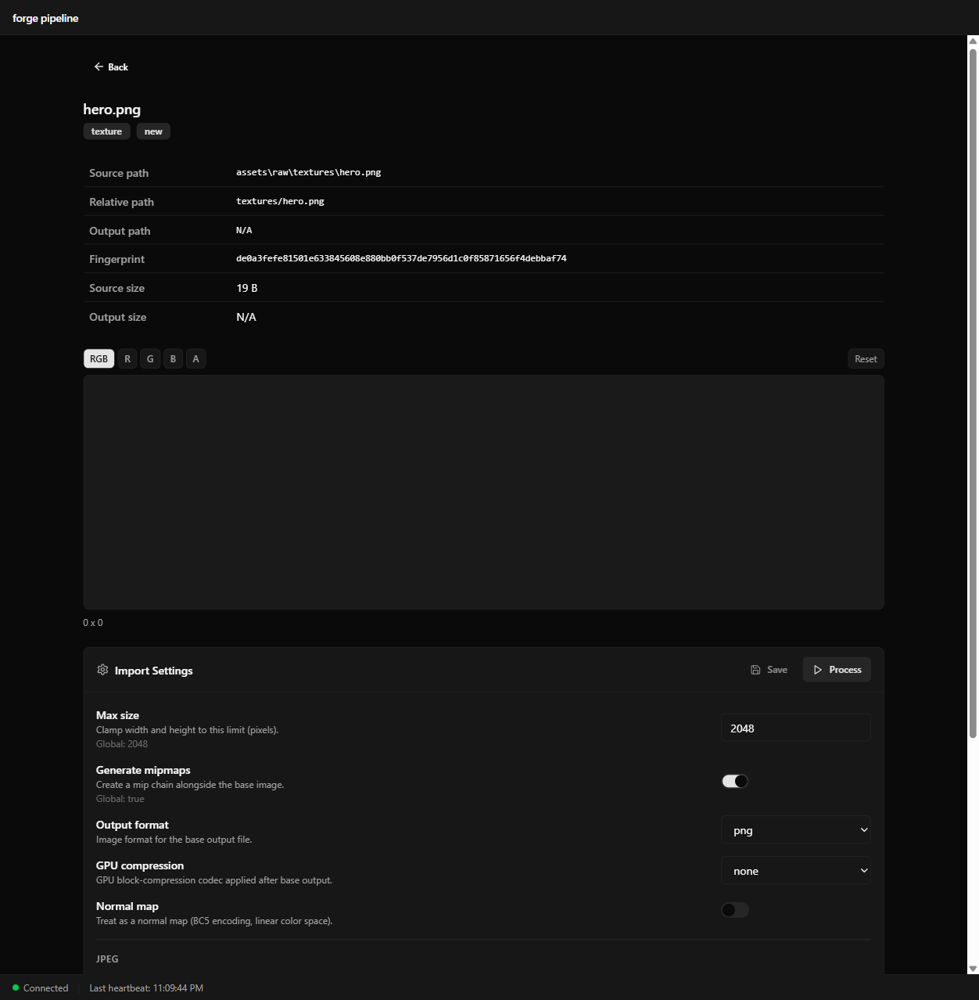
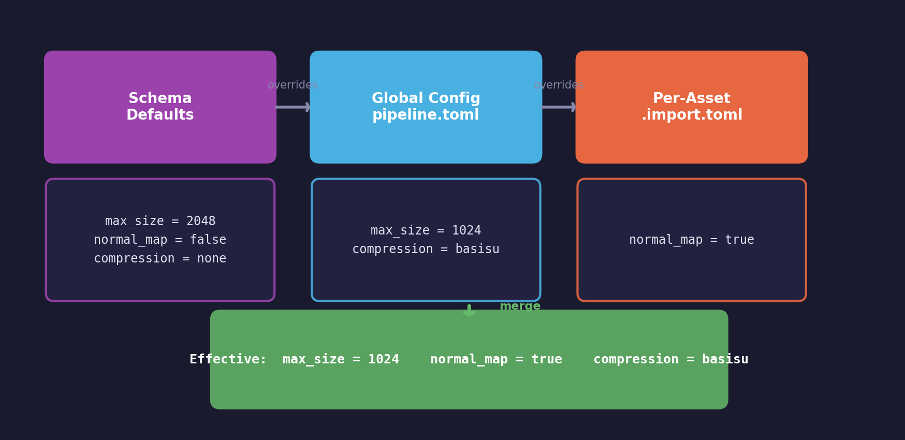
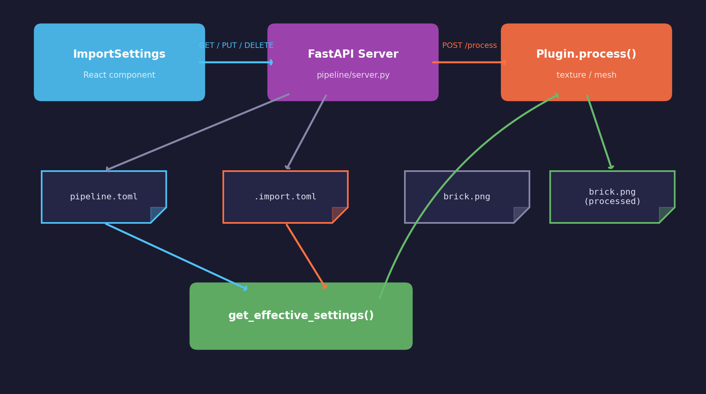

# Asset Lesson 16 — Import Settings Editor

## What you'll learn

- Store per-asset import configuration as TOML sidecar files
- Merge three layers of settings: schema defaults, global config, per-asset overrides
- Build a settings editor form with type-specific controls
- Trigger single-asset re-processing from the web UI
- Invalidate TanStack Query caches after mutations

## Result



The asset detail page now includes an Import Settings panel below the preview.
Each asset type exposes its own set of configurable fields — texture assets
show max size, mipmap generation, compression codec, and normal map flags;
mesh assets show deduplication, optimization, tangent generation, and LOD
level controls. Settings are saved as `.import.toml` sidecar files alongside
the source asset, and a Process button triggers re-processing with the
effective settings.

## Key concepts

- **Three-layer merge** — schema defaults → global `pipeline.toml` → per-asset `.import.toml` sidecar, resolved by `get_effective_settings()`
- **TOML sidecar files** — `.import.toml` files next to source assets store per-asset overrides without modifying global config
- **Schema-driven form** — the settings editor renders controls (bool, int, float, select) from the plugin schema definition, not hardcoded UI
- **Single-asset re-processing** — the Process button triggers the pipeline for one asset with its effective settings

## Architecture

The settings system merges three input layers into one effective
configuration per asset:

1. **Schema defaults** — hardcoded in `import_settings.py`, one per plugin type
2. **Global config** — the `[texture]` / `[mesh]` sections in `pipeline.toml`
3. **Per-asset overrides** — `.import.toml` sidecar files next to source assets

At processing time, `get_effective_settings()` merges all three layers with
later layers taking precedence:



The frontend reads all three layers from a single API call and displays the
effective value for each field, highlighting which fields have per-asset
overrides.



## Backend

### Import settings module

`pipeline/import_settings.py` handles TOML sidecar file I/O and settings
merging.

**Sidecar file convention** — the sidecar filename is the source filename
with `.import.toml` appended:

```text
assets/raw/textures/brick_albedo.png
assets/raw/textures/brick_albedo.png.import.toml
```

Sidecar contents are a flat TOML table. Only the overridden keys need to be
present — everything else falls back to the global config or schema defaults:

```toml
normal_map = true
compression = "basisu"
basisu_quality = 200
```

**Settings schema** — each plugin type has a schema that describes the valid
settings, their types, labels, descriptions, default values, and constraints.
The frontend reads this schema to generate the correct form controls
(switches for booleans, selects for enums, number inputs with min/max):

```python
TEXTURE_SETTINGS_SCHEMA = {
    "max_size": {
        "type": "int",
        "label": "Max size",
        "description": "Clamp width and height to this limit (pixels).",
        "default": 2048,
        "min": 1,
        "max": 8192,
    },
    "normal_map": {
        "type": "bool",
        "label": "Normal map",
        "description": "Treat as a normal map (BC5 encoding, linear color space).",
        "default": False,
    },
    # ... more fields
}
```

**Core functions:**

| Function | Purpose |
|---|---|
| `sidecar_path(source)` | Return the `.import.toml` path for a source file |
| `load_sidecar(source)` | Parse the sidecar TOML, return empty dict if missing |
| `save_sidecar(source, settings)` | Write settings to the sidecar file |
| `delete_sidecar(source)` | Remove the sidecar (revert to global defaults) |
| `merge_settings(global, per_asset)` | Overlay per-asset onto global settings |
| `get_effective_settings(plugin, global, per_asset)` | Three-layer merge with schema defaults |
| `get_schema(plugin_name)` | Return the schema dict for a plugin type |

### API endpoints

Four new endpoints in `pipeline/server.py`:

```text
GET    /api/assets/{id}/settings   — read schema, global, per-asset, effective
PUT    /api/assets/{id}/settings   — save per-asset overrides as .import.toml
DELETE /api/assets/{id}/settings   — remove sidecar (revert to defaults)
POST   /api/assets/{id}/process    — re-process with effective settings
```

**GET response shape:**

```json
{
  "asset_id": "textures--brick_albedo",
  "plugin_name": "texture",
  "schema_fields": {
    "max_size": {
      "type": "int",
      "label": "Max size",
      "description": "Clamp width and height...",
      "default": 2048,
      "min": 1,
      "max": 8192
    }
  },
  "global_settings": { "max_size": 2048 },
  "per_asset": { "normal_map": true },
  "effective": { "max_size": 2048, "normal_map": true },
  "has_overrides": true
}
```

The `schema_fields` dict drives the frontend form — each field knows its
type, label, valid range, and whether it has enum options. The frontend
does not need to know about plugin internals.

**PUT request body** — a flat dict of the per-asset overrides to save:

```json
{ "normal_map": true, "compression": "basisu" }
```

**POST /process** — discovers the matching plugin, merges settings, and runs
`plugin.process()` synchronously. Returns a `ProcessResponse` with a success
flag and message. After processing, the server invalidates its asset cache
so subsequent GET requests reflect the new output files.

### CLI integration

`pipeline/__main__.py` now loads `.import.toml` sidecars during processing.
The `_process_files()` function merges global and per-asset settings before
passing them to each plugin. The fingerprint cache key includes the merged
settings, so changing a sidecar (or deleting it) triggers reprocessing even
if the source file has not changed.

## Frontend

### Import settings component

`src/components/import-settings.tsx` renders the settings editor form.

**Data flow:**

1. `useQuery(["settings", assetId])` fetches the GET endpoint
2. Schema fields are grouped by their `group` property
3. Each field renders the appropriate control based on `field.type`
4. Local edits are tracked in component state (`edits`)
5. Save merges existing per-asset overrides with pending edits
6. `useMutation` handles save/reset/process with loading states
7. On success, `queryClient.invalidateQueries` refreshes stale data

**Control mapping:**

| Schema type | UI control |
|---|---|
| `bool` | Switch toggle |
| `str` with `options` | Select dropdown |
| `int` | Number input with min/max |
| `float` | Number input with step=0.01 |
| `list[float]` | Text input (comma-separated) |

**Visual indicators:**

- Fields with per-asset overrides show "(overridden)" in the label
- A "Customized" badge appears in the header when any overrides exist
- The Reset button only appears when overrides exist
- The Save button is disabled until local edits are made
- Status messages show success/failure after save/process operations

### Cache invalidation

TanStack Query caches are invalidated after mutations:

- **Save settings** — invalidates `["settings", assetId]`
- **Process asset** — invalidates `["asset", assetId]` and `["assets"]`
  (the list query) so the status badge and preview update

### New shadcn/ui components

Four new primitives added in `src/components/ui/`:

| Component | Purpose |
|---|---|
| `Label` | Form field labels with disabled state |
| `Select` | Native select dropdown styled to match the theme |
| `Switch` | Toggle switch for boolean fields |
| `Separator` | Horizontal/vertical divider between field groups |

## TOML formatting

The `save_sidecar()` function writes TOML without a third-party serializer.
TOML is simple enough for flat key-value settings that string formatting
handles all the types the pipeline uses:

- Booleans → `true` / `false`
- Integers → bare numbers
- Floats → numbers with a decimal point
- Strings → double-quoted with backslash escaping
- Lists → inline arrays `[1.0, 0.5, 0.25]`

This avoids adding a `tomli-w` or `tomlkit` dependency for write support.

## Where it connects

| Lesson | Connection |
|---|---|
| [Asset 01 — Pipeline Scaffold](../01-pipeline-scaffold/) | Global TOML config that per-asset settings override |
| [Asset 02 — Texture Processing](../02-texture-processing/) | Texture plugin settings (max_size, compression, mipmaps) |
| [Asset 03 — Mesh Processing](../03-mesh-processing/) | Mesh plugin settings (deduplication, LODs, tangents) |
| [Asset 14 — Web UI Scaffold](../14-web-ui-scaffold/) | FastAPI server, TanStack Query, shadcn/ui components |
| [Asset 15 — Asset Preview](../15-asset-preview/) | Asset detail page that hosts the settings panel |

## Building

### Backend

```bash
# Install the pipeline in development mode (from repo root)
uv sync --extra dev

# Run the pipeline tests
uv run pytest tests/pipeline/ -v

# Start the dev server
uv run python -m pipeline serve
```

### Frontend

```bash
cd pipeline/web

# Install dependencies
npm install

# Start the dev server (proxies API to http://127.0.0.1:8000)
npm run dev

# Run tests
npm test

# Type check
npx tsc -b --noEmit
```

## AI skill

The [`forge-import-settings-editor`](../../../.claude/skills/forge-import-settings-editor/SKILL.md)
skill teaches Claude Code how to add per-asset import settings with TOML
sidecar files, schema-driven form rendering, and single-asset re-processing.

## What's next

The settings editor gives artists control over how individual assets are
processed. Future lessons can build on this with validation, presets, and
batch operations.

## Exercises

1. **Add a "Diff" view** — show which effective settings differ from schema
   defaults, using color coding (green = global override, blue = per-asset).

2. **Batch settings** — add a multi-select in the asset browser that lets
   users apply the same import settings to multiple assets at once. The
   backend already supports individual sidecar writes; the frontend needs a
   bulk selection UI and a loop over PUT calls.

3. **Settings presets** — create named preset TOML files (e.g.
   `normal_map.import.toml`, `hdr_environment.import.toml`) and add a
   dropdown to apply a preset to any asset. Store presets in a
   `pipeline/presets/` directory.

4. **Validation** — add server-side validation in the PUT endpoint that
   checks per-asset values against the schema constraints (min/max, valid
   options). Return 422 with field-level error messages.

## Further reading

- [TOML specification](https://toml.io/) — the format used for sidecar files
- [TanStack Query mutations](https://tanstack.com/query/latest/docs/framework/react/guides/mutations) — cache invalidation patterns
- [Unreal Engine import settings](https://docs.unrealengine.com/5.4/en-US/importing-assets-in-unreal-engine/) — how a production engine handles per-asset configuration
- [Unity asset import settings](https://docs.unity3d.com/Manual/ImportSettings.html) — another approach to per-asset overrides with .meta files
