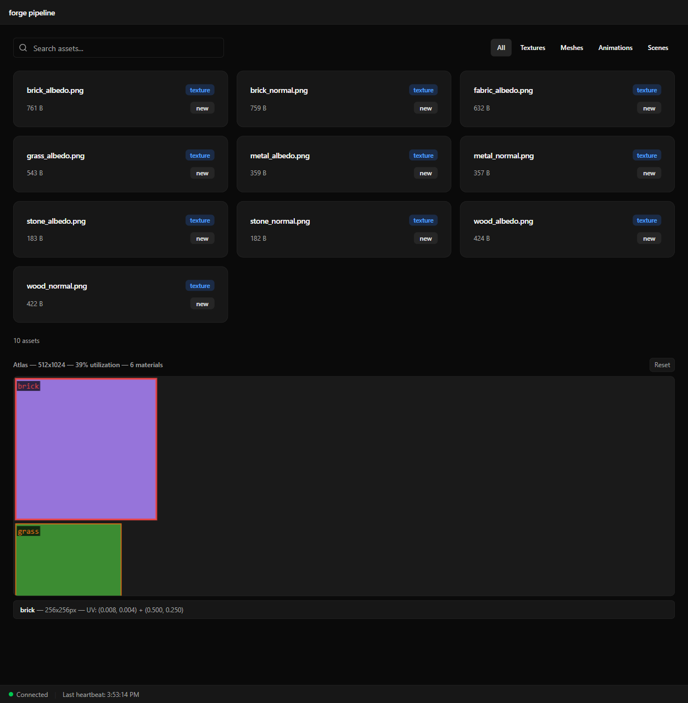
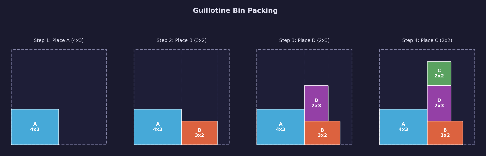
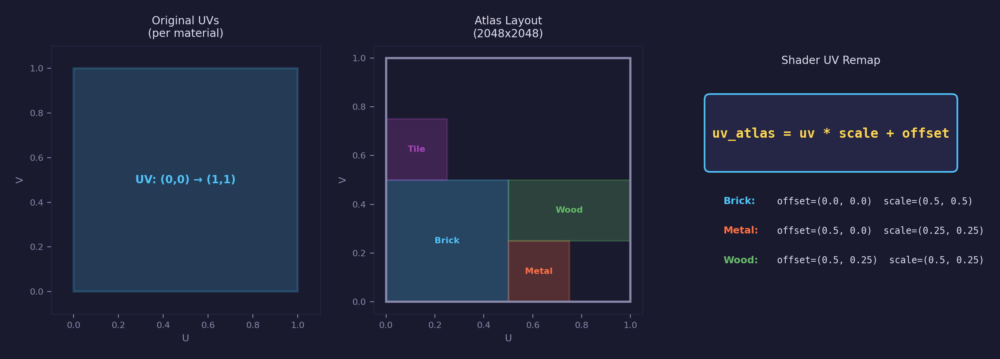
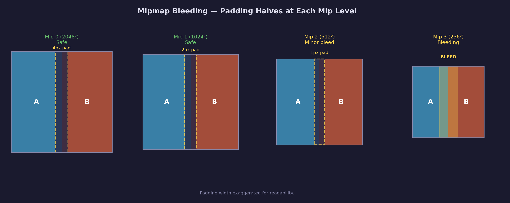

# Asset Lesson 17 — Texture Atlas Packing

## What you'll learn

- Why real-time renderers pack textures into atlases
- Guillotine bin packing for variable-size rectangles
- Material-grouped atlas compositing with per-material UV remap
- Padding and mipmap bleeding tradeoffs
- Atlas metadata format for runtime UV transforms

## Result



The pipeline gains an atlas post-processing step. After individual textures
are processed, the atlas plugin groups them by material name, packs them
into a single power-of-two image using guillotine bin packing, and writes
an `atlas.json` metadata file with UV offset/scale per material. The web
UI displays the atlas with labeled bounding rectangles and hover tooltips.

## Key concepts

- **Guillotine bin packing** — place rectangles largest-first, split remaining free space with a single cut after each placement
- **Material grouping** — all texture slots for one material share a single atlas rect, so UV remapping applies to every texture lookup
- **UV remap** — `uv_atlas = uv_original * scale + offset` transforms per-material UVs into atlas-space coordinates
- **Padding** — empty texels around each rect prevent bilinear filtering from sampling across material boundaries; halves at each mip level

## Why atlas packing

Every material in a 3D scene binds its own set of textures — base color,
normal map, metallic-roughness. Each bind is a GPU state change. In a scene
with 50 materials, that's 50+ texture binds per frame, each one stalling
the pipeline while the GPU switches texture descriptors.

Atlas packing places all material textures into a single large image and
remaps UVs so each material samples from its own rectangular region. One
texture bind serves the entire scene. Games like The Ascent use this
approach for environments where dozens of materials share screen space.

The tradeoff: UV coordinates become atlas-relative, which complicates
texture tiling and mipmap filtering near rect boundaries. This lesson
implements the core technique and discusses the limitations honestly.

## Bin packing algorithms



Three common approaches for packing variable-size rectangles into a
fixed-size atlas:

### Shelf packing

Place rectangles left-to-right on horizontal shelves. Each shelf's height
is determined by its tallest rectangle. Simple to implement but wastes
vertical space when rectangle heights vary — a 32-pixel texture on a
128-pixel shelf wastes 75% of its row.

### Guillotine packing

After placing a rectangle, split the remaining free space with a single
cut (horizontal or vertical), creating two new free rectangles. The name
comes from the guillotine constraint — every cut extends fully across its
free region, like a paper cutter.

This is the approach used in this lesson. It handles varied aspect ratios
well and produces reasonable utilization (70–85% for typical material sets)
without the implementation complexity of maxrects.

### Maxrects packing

Track all maximal free rectangles (overlapping is allowed in the free list).
After placement, split every intersecting free rectangle and merge any that
become contained within another. Produces higher utilization than guillotine
but is more complex to implement and debug.

**Exercise:** Implement maxrects and compare utilization against guillotine
on the same input set.

## Implementation

### Core algorithm: `pipeline/atlas.py`

The `pack_rects()` function implements guillotine bin packing with
best-area-fit placement:

```python
from pipeline.atlas import pack_rects

# Input: list of (name, width, height) tuples
rects = [
    ("brick", 256, 256),
    ("metal", 128, 128),
    ("wood", 256, 128),
    ("concrete", 64, 64),
]

result = pack_rects(rects, max_size=4096, padding=4)

# result.width, result.height — atlas dimensions (power of two)
# result.rects — list of AtlasRect with (name, x, y, width, height)
# result.utilization — ratio of used to total pixels
```

The algorithm:

1. **Pad** each rectangle by `padding` pixels on all sides
2. **Sort** by area (largest first) to reduce fragmentation
3. **Place** each rectangle in the free region with the smallest area
   that fits (best-area-fit)
4. **Split** the remaining free space with a guillotine cut, choosing
   the orientation that maximises the larger remaining piece
5. **Shrink** the atlas to the smallest power-of-two dimensions that
   contain all placed rectangles

### Atlas plugin: `pipeline/plugins/atlas.py`

The `AtlasPlugin` is a post-processing plugin that runs after individual
textures have been processed. It:

1. Scans the output directory for `.meta.json` sidecars
2. Groups textures by material name (strips known suffixes like `_albedo`,
   `_normal`, `_metallic_roughness`)
3. Determines the packing rect for each material (largest texture dimension
   across all slots)
4. Packs material rects with `pack_rects()`
5. Composites all textures into a single RGBA atlas image with Pillow
6. Writes the atlas PNG and `atlas.json` metadata

### Atlas metadata format



The `atlas.json` file provides everything a runtime loader needs to remap
UVs:

```json
{
    "version": 1,
    "width": 2048,
    "height": 2048,
    "padding": 4,
    "utilization": 0.78,
    "entries": {
        "brick": {
            "x": 4, "y": 4,
            "width": 256, "height": 256,
            "u_offset": 0.001953,
            "v_offset": 0.001953,
            "u_scale": 0.125,
            "v_scale": 0.125
        }
    }
}
```

Each entry provides:

- **Pixel position** (`x`, `y`, `width`, `height`) — for atlas visualization
- **UV transform** (`u_offset`, `v_offset`, `u_scale`, `v_scale`) — for
  shader-side UV remapping: `uv_atlas = uv_original * scale + offset`

### Settings schema

The `ATLAS_SETTINGS_SCHEMA` in `pipeline/import_settings.py` exposes three
controls:

| Setting | Type | Default | Description |
|---------|------|---------|-------------|
| `atlas_enabled` | bool | false | Enable atlas packing |
| `atlas_max_size` | int | 4096 | Maximum atlas dimension (256–8192) |
| `atlas_padding` | int | 4 | Texel padding per rectangle (0–32) |

Atlas packing is opt-in (`atlas_enabled = false` by default) because it
changes how textures are consumed at runtime — existing lessons expect
individual texture files.

### Web UI

The atlas preview component (`atlas-preview.tsx`) renders on the asset
browser page when an atlas has been built. It:

- Loads the atlas image as a canvas background
- Overlays labeled bounding rectangles with color-coded borders
- Shows material name, dimensions, and UV rect on hover
- Displays utilization percentage
- Supports pan and zoom for inspection

## Padding and mipmap bleeding



The `padding` parameter adds empty texels around each packed rectangle.
This prevents bilinear filtering from sampling across material boundaries
— without padding, a fragment near the edge of one material's rect would
blend with texels from an adjacent material.

With 4 texels of padding, bilinear filtering is artifact-free at mip
level 0. At mip level 1 (half resolution), the effective padding halves
to 2 texels — still sufficient. At mip level 2, padding is 1 texel, and
at mip level 3, texels from adjacent materials begin bleeding into the
sample.

For a 2048x2048 atlas with 256x256 material rects, this means:

- **Mip 0** (2048x2048): 4-texel padding, no artifacts
- **Mip 1** (1024x1024): 2-texel padding, no artifacts
- **Mip 2** (512x512): 1-texel padding, minor bleeding at rect edges
- **Mip 3+**: visible color bleeding between materials

Real-world mitigations:

- **Increase padding** proportional to the expected mip count (16–32
  texels for 4+ mip levels)
- **Texture arrays** — store each material in an array layer instead of
  a packed 2D atlas; array layers have independent mip chains with no
  bleeding, but require the same resolution per layer
- **Virtual texturing** — tile-based streaming that avoids both problems;
  used in production engines (Unreal, id Tech) but significantly more
  complex

This lesson uses 4-texel padding as a practical default. The bleeding at
mip 3+ is visible on close inspection but acceptable for the distance at
which those mip levels are selected.

## Tests

```bash
uv run pytest tests/pipeline/test_atlas.py -v
```

The test suite covers:

- **Bin packer**: empty input, single rect, many small rects, padding
  effects, overflow error, power-of-two output, no overlap, utilization
  range, bounds checking
- **Material grouping**: suffix stripping, missing sidecars, unknown
  suffixes
- **Atlas building**: image output, metadata format, UV coordinates,
  padding, utilization, single-material skip
- **Plugin**: disabled by default, enabled builds atlas, skip with few
  materials

## Building

### Backend

```bash
# Install the pipeline in development mode (from repo root)
uv sync --extra dev

# Run the atlas tests
uv run pytest tests/pipeline/test_atlas.py -v

# Run all pipeline tests
uv run pytest tests/pipeline/ -v

# Start the dev server
uv run python -m pipeline serve
```

### Frontend

```bash
cd pipeline/web

# Install dependencies
npm install

# Start the dev server (proxies API to http://127.0.0.1:8000)
npm run dev
```

## AI skill

The [`forge-pipeline-library`](../../../.claude/skills/forge-pipeline-library/SKILL.md)
skill teaches Claude Code how to work with the asset pipeline — writing
plugins, processing textures, and extending the pipeline CLI. The atlas
plugin follows the same patterns.

## What's next

[GPU Lesson 47](../../gpu/47-texture-atlas/) loads the atlas metadata and
renders models with UV-remapped materials through `forge_scene.h`, replacing
per-material texture binds with a single atlas texture.

## Exercises

1. **Implement maxrects packing** — Track overlapping free rectangles and
   compare utilization against guillotine for the same input set. Measure
   both packing quality and runtime performance.

2. **Per-slot atlases** — Instead of one combined atlas, generate separate
   atlases for each texture slot (base_color atlas, normal atlas, etc.).
   Each slot atlas uses the same UV layout so materials share coordinates
   across all slots.

3. **Adaptive padding** — Compute padding based on the expected mip count
   for each material's texture resolution. Larger textures with more mip
   levels get more padding; small textures that will never be minified get
   less.

4. **Atlas utilization histogram** — Add a bar chart to the web UI showing
   the size distribution of packed materials and wasted space per row.

## Cross-references

- [GPU Lesson 47 — Texture Atlas Rendering](../../gpu/47-texture-atlas/) —
  loads the atlas and renders with UV-remapped materials
- [Asset Lesson 02 — Texture Processing](../02-texture-processing/) —
  individual texture processing that the atlas plugin builds on
- [Asset Lesson 16 — Import Settings Editor](../16-import-settings-editor/) —
  the settings schema system used for atlas configuration
