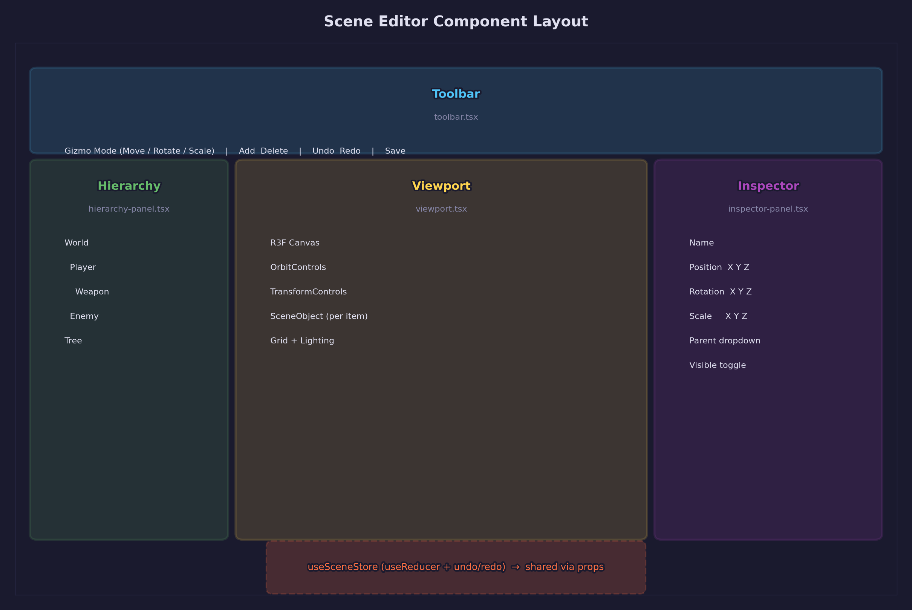
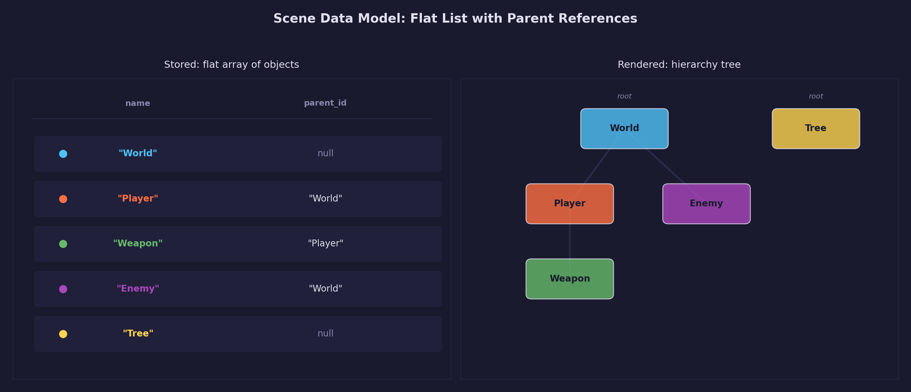
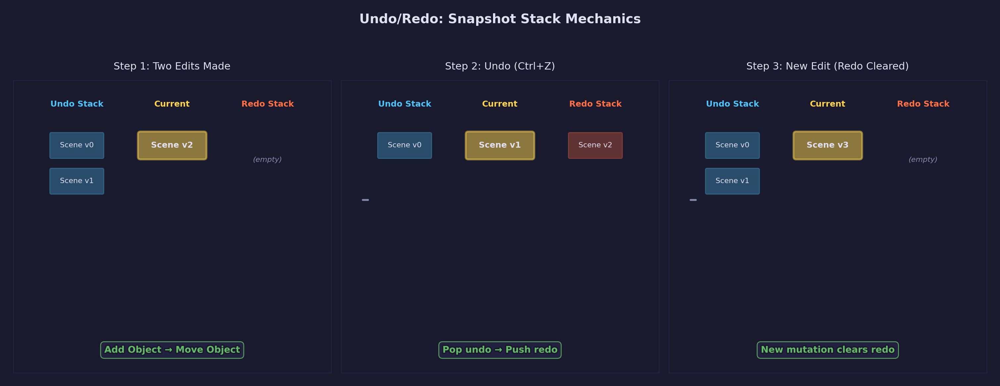

# Asset Lesson 18 — Scene Editor

## What you'll learn

- Visual scene composition with a web-based 3D editor
- Snapshot-based undo/redo using React `useReducer`
- `TransformControls` integration with react-three-fiber
- Flat hierarchy data model with parent references
- REST API design for scene CRUD operations

## Result



A browser-based scene editor with a 3D viewport, transform gizmos, a scene
hierarchy panel, a property inspector, and undo/redo support.

## Key concepts

- **Snapshot-based undo/redo** — each mutation pushes a full scene clone to the undo stack; undo pops and restores
- **Flat hierarchy with parent references** — objects store `parent_id` for O(1) Map-based lookup without tree traversal
- **REST API for scene CRUD** — full scene state sent on save, not incremental patches
- **React `useReducer`** — centralized state machine for all scene mutations, shared via props
- **TransformControls with deferred commits** — transforms apply visually during drag, commit to state on mouse release

## Authored vs. processed scenes

Asset Lesson 09 introduced the binary `.fscene` format for **processed** glTF
scene hierarchies — the output of the scene extraction tool. The node tree,
mesh references, and world transforms are baked into a compact binary that the
C runtime loads directly.

This lesson creates a different kind of scene: an **authored** composition.
Users place objects in a 3D viewport, set transforms, organize a hierarchy,
and save the result as a JSON file. The distinction matters:

| | Authored scene (this lesson) | Processed scene (Lesson 09) |
|---|---|---|
| Format | JSON | Binary `.fscene` |
| Source | Human-created in editor | Extracted from glTF |
| Content | References to pipeline assets | Embedded node/mesh indices |
| Editing | Interactive (undo/redo) | Read-only after export |
| Storage | `{output_dir}/scenes/*.json` | Per-asset output |

An authored scene references pipeline assets by ID. A future exercise connects
the two: exporting an authored scene to the binary `.fscene` format for runtime
loading.

## Scene data model

Scenes are stored as JSON files with a flat object list:

```json
{
  "version": 1,
  "name": "My Scene",
  "created_at": "2026-03-22T10:00:00Z",
  "modified_at": "2026-03-22T10:30:00Z",
  "objects": [
    {
      "id": "abc123",
      "name": "Player Model",
      "asset_id": "models--player.gltf",
      "position": [0, 0, 0],
      "rotation": [0, 0, 0, 1],
      "scale": [1, 1, 1],
      "parent_id": null,
      "visible": true
    }
  ]
}
```



### Why a flat list with parent references?

A nested tree structure (objects containing children arrays) makes undo/redo
complicated — you need deep cloning at arbitrary depths, and finding an object
by ID requires a tree walk. A flat list with `parent_id` references is simpler:

- **O(1) lookup by ID** — the flat array enables building a `Map<id, object>` for constant-time access in rendering and editing
- **Snapshot undo** — `JSON.parse(JSON.stringify(scene))` is cheap and correct
- **Hierarchy** is reconstructed on render by grouping objects by `parent_id`

### Why quaternions for rotation?

Rotations are stored as quaternions `[x, y, z, w]` to match three.js
conventions and avoid gimbal lock. The inspector panel converts to Euler
angles (degrees) for display — users see familiar X/Y/Z rotation values while
the store maintains numerically stable quaternions.

## Backend: scene file management

Scene files live in `{config.output_dir}/scenes/`. The `pipeline/scenes.py`
module provides CRUD operations:

```python
from pipeline.scenes import create_scene, load_scene, save_scene

# Create a new scene
scene = create_scene(config, "My Scene")
# scene["id"] = "a1b2c3d4e5f6"

# Load by ID
data = load_scene(config, scene["id"])

# Save with modifications
data["objects"].append({...})
save_scene(config, scene["id"], data)
```

### Validation

`validate_scene()` checks the full structure before every save:

- Version matches `SCENE_VERSION`
- Required fields present with correct types
- Position is `[x, y, z]`, rotation is `[x, y, z, w]`, scale is `[x, y, z]`
- All `parent_id` references point to existing objects
- No circular parent chains (A → B → A)
- All object IDs are unique

### API endpoints

Five REST endpoints serve the scene editor frontend:

```text
GET    /api/scenes              — List all scenes
POST   /api/scenes              — Create new scene (body: {name})
GET    /api/scenes/{scene_id}   — Get scene data
PUT    /api/scenes/{scene_id}   — Save scene data
DELETE /api/scenes/{scene_id}   — Delete scene
```

The PUT endpoint accepts the full scene object — the client sends the entire
state rather than incremental patches. This matches the undo/redo model where
the client holds the complete scene at all times.

## Frontend: scene store with undo/redo

The scene state manager uses React `useReducer` with snapshot-based undo/redo.

### Action types

```typescript
type SceneAction =
  | { type: "LOAD_SCENE"; scene: SceneData }
  | { type: "ADD_OBJECT"; object: SceneObject }
  | { type: "REMOVE_OBJECT"; objectId: string }
  | { type: "UPDATE_TRANSFORM"; objectId: string; position; rotation; scale }
  | { type: "RENAME_OBJECT"; objectId: string; name: string }
  | { type: "REPARENT_OBJECT"; objectId: string; newParentId: string | null }
  | { type: "SET_VISIBILITY"; objectId: string; visible: boolean }
  | { type: "SELECT"; objectId: string | null }      // not undoable
  | { type: "SET_GIZMO_MODE"; mode: GizmoMode }      // not undoable
  | { type: "UNDO" }
  | { type: "REDO" }
```

### Snapshot undo

Every undoable action (add, remove, transform, rename, reparent, visibility)
follows the same pattern:

1. Deep-clone the current scene → push to `undoStack`
2. Clear `redoStack` (branching from a past state discards the redo future)
3. Apply the mutation to produce the new scene
4. Set `dirty = true`

UNDO pops the last snapshot from `undoStack`, pushes the current scene to
`redoStack`, and restores the popped snapshot. REDO does the reverse.

This is the simplest correct approach. Scene objects are small JSON — even 50
snapshots of 100 objects is well under 1 MB. More complex strategies
(operation-based undo, structural sharing) are unnecessary at this scale.



### Keyboard shortcuts

- **Ctrl+Z** — Undo
- **Ctrl+Shift+Z** — Redo

Registered via `useEffect` in the `useSceneStore` hook.

## Frontend: viewport and TransformControls

The viewport renders scene objects in a react-three-fiber `<Canvas>`. Each
placed object is a `<group>` with position, quaternion, and scale synced from
the store.

### Gizmo integration

drei's `<TransformControls>` attaches to the selected object's group ref.
The key design decision: transforms are committed **on mouse release**, not
on every frame.

During a drag, TransformControls manipulates the Three.js object directly for
smooth visual feedback. When the user releases the gizmo, the `onMouseUp`
handler reads the final position/quaternion/scale from the Three.js object and
dispatches `UPDATE_TRANSFORM` — creating exactly one undo snapshot per drag
operation.

### OrbitControls coordination

OrbitControls (camera rotation) and TransformControls (object manipulation)
both respond to mouse input. To prevent conflicts, the viewport listens to the
`dragging-changed` event on TransformControls and disables OrbitControls while
a gizmo drag is active.

## Frontend: hierarchy and inspector panels

### Hierarchy panel

The hierarchy panel renders a tree from the flat object list. A `childrenMap`
(built with `useMemo`) groups objects by `parent_id`. Root objects
(`parent_id === null`) are rendered at the top level, and a recursive
`TreeNode` component handles expansion, selection, and child rendering.

### Inspector panel

The inspector shows properties of the selected object:

- **Name** — text input, committed on blur
- **Position** — three number inputs (X, Y, Z)
- **Rotation** — three number inputs showing Euler angles in degrees,
  converted to/from quaternions using Three.js `Euler` and `Quaternion`
- **Scale** — three number inputs
- **Parent** — dropdown listing valid parent candidates (excludes self and
  descendants to prevent cycles)
- **Visible** — toggle switch

## Running

Start the backend and frontend dev servers:

```bash
# Terminal 1 — backend (from repo root)
uv run python -m pipeline serve -c pipeline.toml

# Terminal 2 — frontend (from pipeline/web/)
npm run dev
```

Open `http://localhost:5173/scenes` to access the scene editor.

## Building

### Backend

```bash
# Install the pipeline in development mode (from repo root)
uv sync --extra dev

# Start the dev server
uv run python -m pipeline serve
```

### Frontend

```bash
cd pipeline/web

# Install dependencies
npm install

# Start the dev server (proxies API to http://127.0.0.1:8000)
npm run dev
```

## What's next

Asset Lesson 19 adds custom three.js loaders for the forge binary formats
(`.fmesh`, `.fmat`, `.ftex`) so the scene editor renders processed pipeline
output instead of raw glTF source files.

## Exercises

1. **Drag-and-drop reparenting** — Add drag-and-drop to the hierarchy panel
   so users can reparent objects by dragging tree nodes. Handle drop target
   highlighting and circular reference prevention.

2. **Multi-select** — Implement Shift+click multi-selection. Show aggregate
   transforms in the inspector (position shows center of selection). Apply
   gizmo transforms to all selected objects as a group.

3. **Duplicate** — Add a "Duplicate" action (Ctrl+D) that clones the selected
   object with a small position offset. The clone should have a new ID and
   appended " (copy)" name.

4. **Export to .fscene** — Connect the authored scene format to the binary
   `.fscene` format from Lesson 09. Add an "Export" button that writes a
   `.fscene` file from the current scene, resolving asset references to mesh
   indices.

5. **Camera bookmarks** — Add the ability to save and restore named camera
   positions. Store bookmarks in the scene JSON. Display a bookmark bar in the
   viewport with clickable entries that animate the camera to the saved
   position.

## Where it connects

- **Asset Lesson 09** — Scene Hierarchy: the binary `.fscene` format that
  processed scenes use at runtime
- **Asset Lesson 14** — Web UI Scaffold: the FastAPI + Vite + React foundation
  this editor builds on
- **Asset Lesson 15** — Asset Preview: the react-three-fiber viewport pattern
  and glTF loading
- **Asset Lesson 16** — Import Settings Editor: the form-based inspector
  pattern with local state and mutations
- **GPU Lesson 26** — Scene Loading: renders `.fscene` files on the GPU
