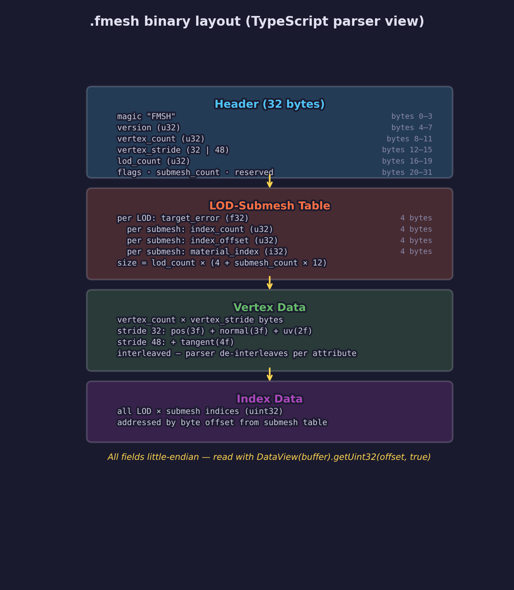
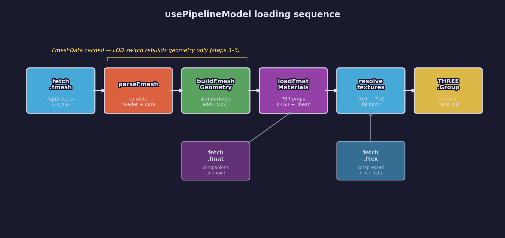
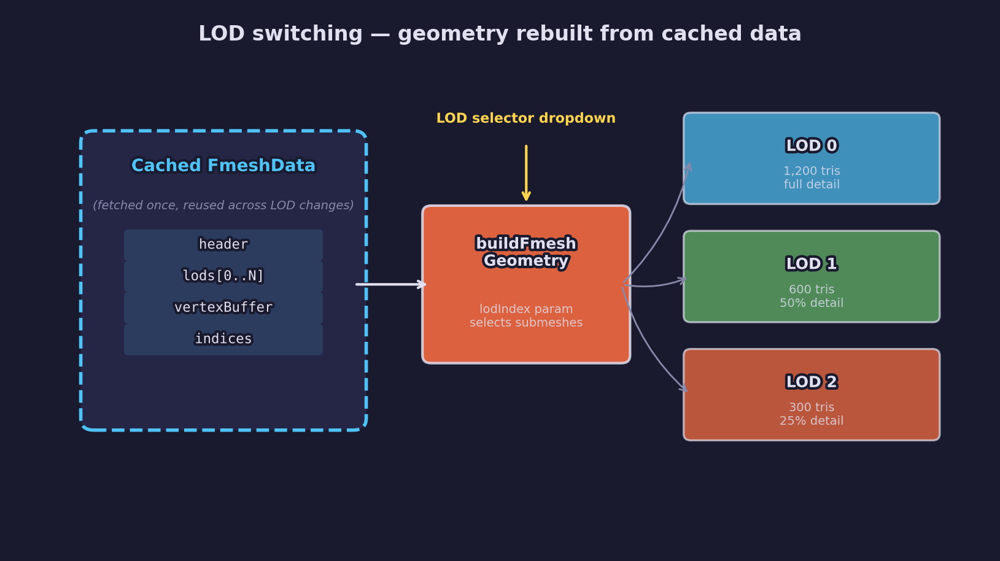

# Asset Lesson 19 — Pipeline Asset Viewer

## What you'll learn

- Parse forge-gpu binary asset formats (.fmesh, .ftex, .fmat) in TypeScript
- Build Three.js BufferGeometry from raw interleaved vertex data
- Load GPU-compressed textures (BC7/BC5) in the browser via WebGL2 extensions
- Validate binary format contracts with golden fixture tests shared between C and TypeScript
- Integrate pipeline-processed models into the web UI alongside source glTF previews

## Result

The asset preview panel now renders processed pipeline output directly. When a
mesh asset has a `.fmesh` output, the detail page shows the processed binary
mesh with a LOD level selector, wireframe toggle, and vertex/triangle
statistics.

The scene editor viewport also uses pipeline models when processed output
exists, so authors see the same geometry and materials the C runtime loads.

## Key concepts

- **Binary parsing with DataView** — little-endian reads with bounds checking at every field
- **Interleaved vertex extraction** — de-interleaving position, normal, UV, and tangent attributes from stride-based buffers
- **Per-submesh material groups** — `BufferGeometry.addGroup()` maps index ranges to materials
- **Compressed texture extensions** — BC7 via `EXT_texture_compression_bptc`, BC5 via `EXT_texture_compression_rgtc`
- **Convention-based companion discovery** — .fmat and .ftex files found by replacing the .fmesh extension, no new server endpoints
- **Format contract testing** — golden fixtures generated by a Python script, parsed by both C and TypeScript test suites

## Architecture

The viewer is built from five layered modules. Each parser is a pure function
with no Three.js dependency — the Three.js integration lives in separate
loader modules.

```text
use-pipeline-model.ts          React hook (orchestration)
  ├── fmesh-parser.ts          Binary → FmeshData (pure)
  ├── fmesh-geometry.ts        FmeshData → THREE.BufferGeometry
  ├── fmat-parser.ts           JSON → FmatData (pure, validated)
  ├── fmat-loader.ts           FmatData → THREE.MeshStandardMaterial[]
  ├── ftex-parser.ts           Binary → FtexData (pure)
  └── ftex-loader.ts           FtexData → THREE.CompressedTexture

pipeline-mesh-preview.tsx      Component (Canvas + controls + stats)
preview-panel.tsx              Side-by-side source/processed routing
scene-editor/viewport.tsx      Uses pipeline model when output exists
```

## Binary format parsers

### .fmesh parsing



The `.fmesh` format stores GPU-ready vertex and index data with LOD levels and
multi-material submeshes. The TypeScript parser mirrors the C loader in
`common/pipeline/forge_pipeline.h` — every constant is annotated with the
corresponding C define name.

The parser validates at every step: magic bytes, version, stride consistency
with flags, bounds checks before every `DataView` read, and maximum-value
guards to prevent out-of-memory on corrupt files.

```typescript
import { parseFmesh, FMESH_HEADER_SIZE } from "./fmesh-parser"

const buffer = await fetch(url).then((r) => r.arrayBuffer())
const data = parseFmesh(buffer)

// data.header — version, vertexCount, vertexStride, lodCount, flags
// data.lods   — per-LOD target_error + submesh array
// data.vertexBuffer — raw interleaved bytes
// data.indices — Uint32Array of all index data
// data.hasTangents — true when stride is 48
```

Header fields are read with explicit little-endian DataView calls:

```typescript
const view = new DataView(buffer)

// Magic (bytes 0-3): four ASCII characters
const magic = String.fromCharCode(
  view.getUint8(0), view.getUint8(1),
  view.getUint8(2), view.getUint8(3),
)
if (magic !== "FMSH") {
  throw new FmeshParseError(`Invalid magic: expected "FMSH", got "${magic}"`)
}

// All multi-byte fields are little-endian (second argument = true)
const version = view.getUint32(4, true)
const vertexCount = view.getUint32(8, true)
const vertexStride = view.getUint32(12, true)
```

### Building BufferGeometry from interleaved data

The `.fmesh` vertex buffer stores attributes interleaved: position (3 floats),
normal (3 floats), UV (2 floats), and optionally tangent (4 floats). Three.js
expects separate typed arrays per attribute, so the geometry builder
de-interleaves by walking the buffer with the vertex stride:

```typescript
const positions = new Float32Array(vertexCount * 3)
const normals = new Float32Array(vertexCount * 3)
const uvs = new Float32Array(vertexCount * 2)
const srcView = new DataView(vertexBuffer)

for (let i = 0; i < vertexCount; i++) {
  const base = vertexBufferOffset + i * vertexStride

  // Position at byte offset 0
  positions[i * 3 + 0] = srcView.getFloat32(base + 0, true)
  positions[i * 3 + 1] = srcView.getFloat32(base + 4, true)
  positions[i * 3 + 2] = srcView.getFloat32(base + 8, true)

  // Normal at byte offset 12
  normals[i * 3 + 0] = srcView.getFloat32(base + 12, true)
  normals[i * 3 + 1] = srcView.getFloat32(base + 16, true)
  normals[i * 3 + 2] = srcView.getFloat32(base + 20, true)

  // UV at byte offset 24
  uvs[i * 2 + 0] = srcView.getFloat32(base + 24, true)
  uvs[i * 2 + 1] = srcView.getFloat32(base + 28, true)
}

geometry.setAttribute("position", new THREE.BufferAttribute(positions, 3))
geometry.setAttribute("normal", new THREE.BufferAttribute(normals, 3))
geometry.setAttribute("uv", new THREE.BufferAttribute(uvs, 2))
```

Each submesh in the selected LOD becomes a group so Three.js can assign
different materials per group:

```typescript
for (const submesh of lod.submeshes) {
  const startIndex = submesh.indexOffset / 4 // byte offset to index offset
  geometry.addGroup(startIndex, submesh.indexCount, submesh.materialIndex)
}
```

### .ftex parsing and compressed texture loading

The `.ftex` format stores GPU-compressed block data (BC7 or BC5) with a mip
chain. The parser reads the 32-byte header and per-mip entries, then slices
the block data for each mip level.

Loading as a Three.js `CompressedTexture` requires probing WebGL2 extensions:

- **BC7** (color/albedo) requires `EXT_texture_compression_bptc`
- **BC5** (normal maps) requires `EXT_texture_compression_rgtc`

When the extension is unavailable — common on mobile and some integrated
GPUs — the loader throws, and the texture resolver falls back to the source
PNG through the existing companions endpoint. No new server endpoints were
added.

### .fmat parsing

The `.fmat` file is JSON with validated PBR metallic-roughness properties
per glTF 2.0 conventions. The parser checks version, required fields, and
value ranges. The loader creates `THREE.MeshStandardMaterial` instances and
resolves texture paths through a callback that tries `.ftex` first, then
falls back to source textures.

## The usePipelineModel hook



The `usePipelineModel` hook orchestrates loading and caches parsed binary data
so LOD switching rebuilds geometry without re-fetching:

```typescript
import { usePipelineModel } from "@/lib/use-pipeline-model"

function PipelineModel({ assetId, lod }: { assetId: string; lod: number }) {
  const { scene, lodCount, loading, error } = usePipelineModel(assetId, lod)

  if (loading) return <LoadingSpinner />
  if (error) return <ErrorMessage error={error} />
  if (!scene) return null

  return <primitive object={scene} />
}
```

The hook follows this sequence:

1. Fetch the `.fmesh` binary from the file endpoint
2. Parse with `parseFmesh()` and cache the `FmeshData`
3. Derive the `.fmat` companion path by replacing the file extension
4. Fetch and parse the material sidecar (if it exists)
5. Create a texture resolver that tries `.ftex` compressed textures first
6. Build `THREE.BufferGeometry` for the requested LOD level
7. Assemble a `THREE.Group` with a single `THREE.Mesh` using `BufferGeometry.addGroup()` for submesh-to-material routing and an array of materials

When the `lod` parameter changes, only step 6-7 re-execute — the binary data
and materials are already cached.

## Companion file discovery

The `.fmat` and `.ftex` files are found by convention: replace the `.fmesh`
extension with `.fmat`, and replace texture file extensions with `.ftex`. This
uses the existing `/api/assets/{id}/companions` endpoint from
[Asset Lesson 15](../15-asset-preview/) — no new server routes were added.

The server needed one change: registering media types for the binary formats
so `FileResponse` sets correct `Content-Type` headers:

```python
MEDIA_TYPES = {
    ".fmesh": "application/octet-stream",
    ".fmat": "application/json",
    ".ftex": "application/octet-stream",
    ".fscene": "application/octet-stream",
    ".fanim": "application/octet-stream",
    ".fskin": "application/octet-stream",
}
```

## sRGB and linear color space

The `.ftex` format distinguishes `BC7_SRGB` (format 1) and `BC7_UNORM`
(format 2). Albedo textures use sRGB encoding; metallic-roughness and AO maps
use linear. The `.fmat` loader sets `THREE.SRGBColorSpace` on textures parsed
from sRGB `.ftex` files and `THREE.LinearSRGBColorSpace` on linear ones. This
matches the C runtime behavior where `forge_pipeline_load_texture()` creates
GPU textures with the appropriate `_SRGB` or `_UNORM` format.

## Format contract testing

Binary format parsers are high-risk code — a single byte-offset error
produces garbled geometry. The test strategy uses golden fixtures shared
between the C and TypeScript parsers.

### Fixture generation

`tests/pipeline/generate_fixtures.py` creates minimal binary files that
exercise every parser path:

- `triangle.fmesh` — 3 vertices, 1 LOD, 1 submesh, with tangents
- `multi_lod.fmesh` — 2 LOD levels, 2 submeshes per LOD
- `simple.fmat` — two materials (Wood and Glass) with base color and metallic-roughness
- `checkerboard.ftex` — 4x4 BC7 texture (one block, one mip)

These fixtures are committed at `tests/pipeline/fixtures/` and verified by
both the Python generator (which checks its own output) and the TypeScript
parser test suites.

### TypeScript test suites

42 tests across three parser modules verify:

- Header field extraction matches expected values
- LOD and submesh table parsing
- Vertex data de-interleaving (position, normal, UV, tangent)
- Index buffer bounds and values
- Error paths: truncated files, wrong magic, unsupported versions
- `.fmat` validation: missing fields, invalid types, out-of-range values
- `.ftex` mip chain parsing and format detection

```bash
# Run TypeScript parser tests
cd pipeline/web
npx vitest run --reporter=verbose
```

### CI integration

The `frontend-build` workflow runs fixture verification then vitest:

1. `python tests/pipeline/generate_fixtures.py --verify` — confirms committed
   fixtures match the generator output (catches drift)
2. `npx vitest run` — runs all TypeScript tests including parser suites

## Preview panel integration



`PreviewPanel` checks whether the asset has a `.fmesh` output path. When it
does, the panel replaces the source glTF preview with the processed mesh
viewer (`PipelineMeshPreview`). The source glTF is not shown side-by-side
because the companion file resolver cannot reliably load `.bin` and texture
files for models in subdirectories.

The processed preview includes controls that the glTF preview does not:

- **LOD selector** — dropdown listing available LOD levels with triangle counts
- **Wireframe toggle** — applies to all materials in the processed mesh
- **Stats display** — vertex count, triangle count, and tangent presence

## Scene editor integration

The scene editor viewport (`scene-editor/viewport.tsx`) checks each object's
asset for a processed `.fmesh` output. When one exists, it renders the object
using `usePipelineModel` instead of the glTF loader. This means the editor
shows the same geometry the C runtime loads — LOD levels, submesh boundaries,
and compressed textures all match the binary output.

## Building

```bash
# Install dependencies
uv sync --extra dev
cd pipeline/web && npm install

# Run parser tests
npx vitest run --reporter=verbose

# Build the frontend
npm run build

# Start the server
cd ../..
uv run python -m pipeline serve
```

## Exercises

1. **Animation preview** — Write an `.fanim` parser in TypeScript and add a
   timeline scrubber component. Load the bone hierarchy from `.fskin` and
   apply keyframe interpolation to a `THREE.SkinnedMesh`.

2. **Bounding box overlay** — Add a toggle that draws a wireframe
   `THREE.Box3Helper` around the processed mesh. Compute the bounding box
   from the parsed vertex positions rather than relying on Three.js
   auto-computation.

3. **LOD auto-selection** — Replace the manual LOD dropdown with automatic
   selection based on camera distance. Use the `targetError` field from each
   LOD entry to determine the screen-space error threshold for switching.

4. **Scene hierarchy preview** — Write an `.fscene` parser and render the
   node hierarchy as a tree view. Add per-node visibility toggles and
   highlight the selected node's bounding box in the 3D viewport.

## Connection to other lessons

| Lesson | Connection |
|--------|-----------|
| [Asset 06 — Loading Processed Assets](../06-loading-processed-assets/) | C runtime loader for the same .fmesh/.ftex formats |
| [Asset 07 — Materials](../07-materials/) | PBR material format (.fmat) and texture conventions |
| [Asset 15 — Asset Preview](../15-asset-preview/) | glTF preview and companion file serving this lesson extends |
| [Asset 18 — Scene Editor](../18-scene-editor/) | Viewport integration for pipeline-processed models |

## Further reading

- [DataView — MDN](https://developer.mozilla.org/en-US/docs/Web/API/DataView) — binary data access in JavaScript
- [EXT_texture_compression_bptc — Khronos](https://registry.khronos.org/webgl/extensions/EXT_texture_compression_bptc/) — BC7 WebGL extension spec
- [Three.js CompressedTexture](https://threejs.org/docs/#api/en/textures/CompressedTexture) — compressed texture API
- [BufferGeometry groups](https://threejs.org/docs/#api/en/core/BufferGeometry.addGroup) — per-submesh material assignment
