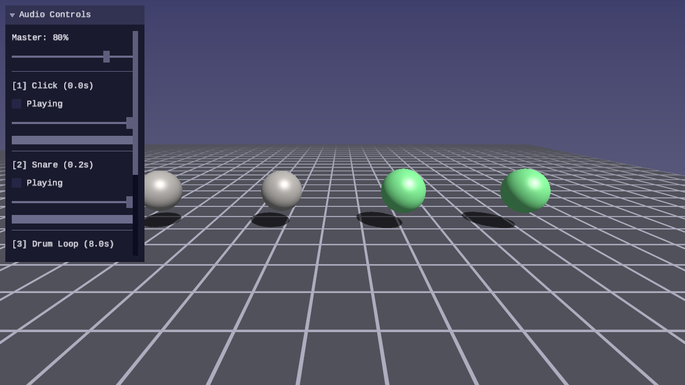

# Audio Lesson 01 — Audio Basics

Load WAV files, convert them to a common format, mix multiple sound sources
with volume and pan controls, and push the result to SDL3 audio streams for
real-time playback.



## What you will learn

- How PCM audio represents sound as a sequence of numbered samples
- What sample rate, bit depth, and channel count mean in practice
- How to load WAV files with `SDL_LoadWAV` and convert to a canonical format
- How to mix multiple audio sources into a single output buffer
- How to push mixed audio to an `SDL_AudioStream` for playback
- How volume and stereo panning work as gain multipliers

## PCM audio fundamentals

Digital audio stores sound as a sequence of **samples** — numbers that
represent the air pressure at a point in time.  Three properties define the
format:

- **Sample rate** — how many samples per second (44100 Hz means 44100 samples
  per second per channel).  Higher rates capture higher frequencies.
- **Bit depth** — how many bits per sample.  16-bit integers give 65536 levels;
  32-bit floats give continuous precision in [-1, 1].
- **Channels** — mono (1) or stereo (2).  Stereo samples are interleaved:
  L₀ R₀ L₁ R₁ L₂ R₂ …

A **frame** is one sample from each channel.  For stereo audio, one frame is
two float values (left, right).

## The canonical format

Working with mixed formats (8-bit, 16-bit, 24-bit, mono, different sample
rates) in every function would be error-prone.  Instead, `forge_audio.h`
converts all audio to a single **canonical format** at load time:

| Property | Value |
|---|---|
| Sample format | 32-bit float (`SDL_AUDIO_F32`) |
| Channels | 2 (stereo) |
| Sample rate | 44100 Hz |

SDL's `SDL_AudioStream` handles the conversion.  The loader creates a stream
from the WAV's native format to the canonical format, pushes the raw data
through, and reads the converted F32 output.

```c
/* Target format: F32, stereo, 44100 Hz */
SDL_AudioSpec target_spec;
target_spec.format   = FORGE_AUDIO_FORMAT;
target_spec.channels = FORGE_AUDIO_CHANNELS;
target_spec.freq     = FORGE_AUDIO_SAMPLE_RATE;

/* Create a conversion stream from WAV format to canonical format */
SDL_AudioStream *stream = SDL_CreateAudioStream(&wav_spec, &target_spec);
SDL_PutAudioStreamData(stream, wav_data, wav_len);
SDL_FlushAudioStream(stream);

/* Read the converted F32 data */
int available = SDL_GetAudioStreamAvailable(stream);
float *converted = SDL_malloc(available);
SDL_GetAudioStreamData(stream, converted, available);
```

This approach handles 16-bit, 24-bit, 32-bit float, mono, and any sample rate
transparently — one code path for all formats.

## Buffers and sources

The audio library separates **data** from **playback state**:

- `ForgeAudioBuffer` holds the decoded sample data.  One buffer per loaded
  WAV file.  Immutable after loading.
- `ForgeAudioSource` references a buffer and tracks playback position (cursor),
  volume, pan, loop state, and whether the source is currently playing.

Multiple sources can reference the same buffer — for example, several explosion
sounds can play from one loaded WAV file at different positions and volumes.

```c
/* Load a WAV into a buffer */
ForgeAudioBuffer buf;
forge_audio_load_wav("assets/audio/click.wav", &buf);

/* Create a source that plays it once at full volume */
ForgeAudioSource src = forge_audio_source_create(&buf, 1.0f, false);
src.playing = true;
```

## Mixing

Each frame, the demo mixes all active sources into a **scratch buffer**, then
pushes the result to an SDL audio stream connected to the output device.

The mixer is additive — each source writes its contribution on top of what
is already in the buffer.  Volume and pan are applied per-source as gain
multipliers:

```text
gain_left  = volume × (1 − pan) / 2
gain_right = volume × (1 + pan) / 2
```

Where pan ∈ [-1, +1]: -1 is full left, 0 is center, +1 is full right.

After all sources are mixed, a master volume is applied to the entire buffer
before pushing to the audio stream.

```c
/* Zero scratch buffer */
memset(mix_scratch, 0, frames * 2 * sizeof(float));

/* Mix all active sources */
for (int i = 0; i < NUM_SOURCES; i++) {
    forge_audio_source_mix(&sources[i], mix_scratch, frames);
}

/* Apply master volume */
for (int i = 0; i < frames * 2; i++) {
    mix_scratch[i] *= master_volume;
}

/* Push to audio device */
SDL_PutAudioStreamData(audio_stream, mix_scratch,
                       frames * 2 * sizeof(float));
```

## SDL audio stream setup

SDL3 audio uses streams connected to devices.  The simplest approach for
playback:

```c
SDL_AudioSpec spec;
spec.format   = SDL_AUDIO_F32;
spec.channels = 2;
spec.freq     = 44100;

SDL_AudioStream *stream = SDL_OpenAudioDeviceStream(
    SDL_AUDIO_DEVICE_DEFAULT_PLAYBACK, &spec, NULL, NULL);
SDL_ResumeAudioStreamDevice(stream);
```

Each frame, push mixed audio data into the stream.  SDL handles buffering
and feeding the hardware at the right rate.

## The demo

Four spheres represent four sound sources:

| Key | Source | Type |
|---|---|---|
| 1 | Click | One-shot (0.05 s) |
| 2 | Snare | One-shot (0.17 s) |
| 3 | Drum Loop | Looping (8 s) |
| 4 | Pad Loop | Looping (17 s) |

Green spheres are playing; gray spheres are stopped.  Playing spheres pulse
slightly in size.  The UI panel provides master volume, per-source play/stop
toggles, volume sliders, and progress bars.

## Audio files

The demo expects WAV files in `assets/audio/`:

| File | Requirements |
|---|---|
| `click.wav` | Short percussive sound |
| `snare.wav` | Snare drum hit |
| `drum_loop.wav` | Drum pattern, several seconds |
| `pad_loop.wav` | Sustained pad/synth, 10+ seconds |

Any WAV format works (8/16/24/32-bit, any sample rate, mono or stereo) — the
loader converts everything to F32 stereo 44100 Hz.  Audio files are gitignored;
place your own WAVs in the directory.

## Controls

| Key | Action |
|---|---|
| WASD / Arrows | Move camera |
| Mouse | Look around (click to capture) |
| Space / Shift | Fly up / down |
| 1–4 | Toggle play/stop for each source |
| R | Reset all sources |
| Escape | Release mouse / quit |

## Building and running

```bash
cmake --build build --target 01-audio-basics
python scripts/run.py audio/01
```

## Library reference

This lesson introduces the following functions in
[`forge_audio.h`](../../../common/audio/README.md):

| Function | Purpose |
|---|---|
| `forge_audio_load_wav(path, buf)` | Load WAV → F32 stereo buffer |
| `forge_audio_buffer_free(buf)` | Free buffer sample data |
| `forge_audio_buffer_frames(buf)` | Frame count (samples / channels) |
| `forge_audio_buffer_duration(buf)` | Duration in seconds |
| `forge_audio_source_create(buf, vol, loop)` | Create a playback source |
| `forge_audio_source_reset(src)` | Rewind cursor to start |
| `forge_audio_source_progress(src)` | Playback fraction [0..1] |
| `forge_audio_source_mix(src, out, frames)` | Additive mix with volume and pan |

## Exercises

1. **Volume envelope** — Add a simple linear fade-in (first 0.1 s ramps volume
   from 0 to target) to avoid clicks when starting playback mid-buffer.

2. **Pan control** — Add a pan slider to the UI for each source.  Verify that
   full-left pan silences the right channel and vice versa.

3. **VU meter** — After mixing, compute the RMS level of the output buffer and
   display it as a progress bar in the UI panel.  The bar should respond to the
   audio in real time.

4. **Pitch shift** — Modify the mixing function to read samples at a different
   rate (e.g., cursor advances by 1.5 samples per frame for a pitch shift up).
   What happens to the duration?
