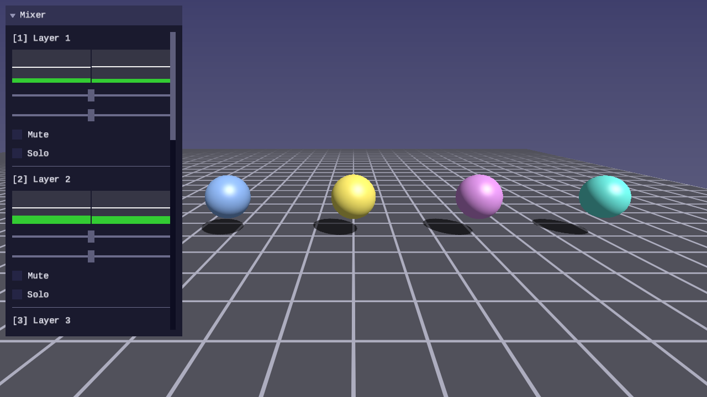
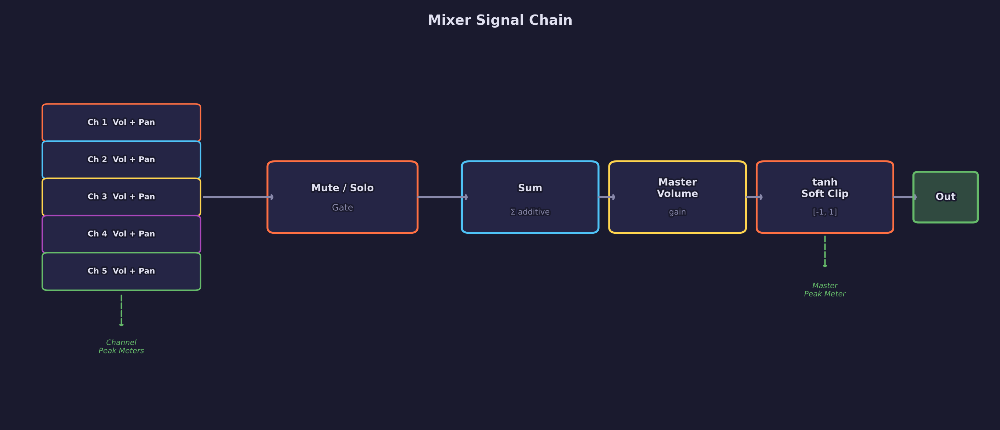
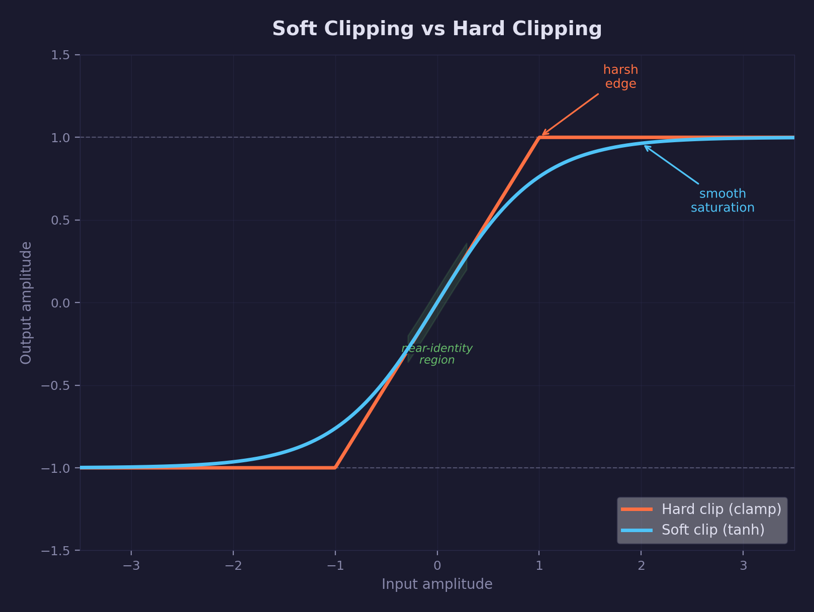
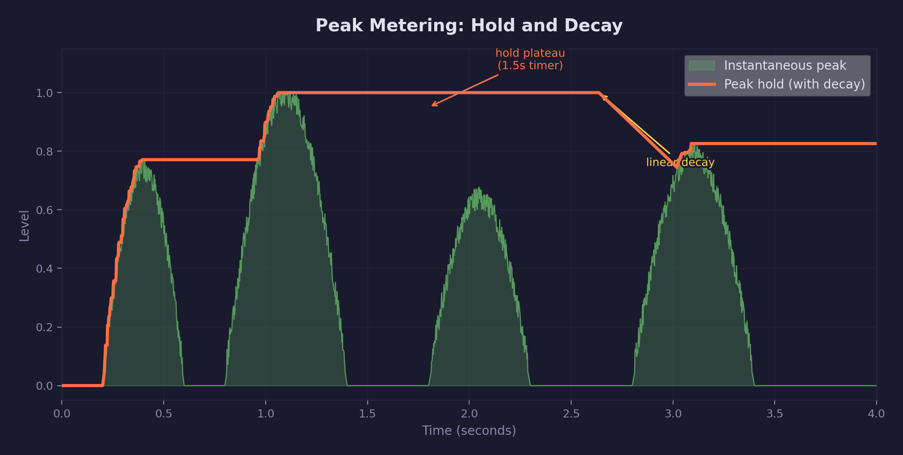

# Audio Lesson 03 — Audio Mixing

A multi-channel mixer with per-channel volume, pan, mute, and solo
controls, soft clipping on the master bus, and peak metering with
hold indicators.

## What you'll learn

- How to build a channel mixer that sums multiple audio sources into a
  single stereo output
- Per-channel volume and pan with the same linear pan law used in
  earlier lessons
- Mute and solo controls with DAW-standard priority (solo overrides mute)
- Soft clipping with tanh saturation to prevent harsh digital clipping
  when channels sum above 1.0
- Peak metering with hold-and-decay indicators for visual level monitoring
- A VU meter UI widget for displaying stereo levels

## Result



Five colored spheres represent five audio stems loaded from WAV files.
Each sphere pulses with its channel's peak audio level and turns gray
when muted. A mixer panel provides DAW-style channel strips with VU
meters, volume/pan sliders, and mute/solo checkboxes.

## Key concepts

### The mixer signal chain



The mixer processes audio in a fixed order each frame:

1. **Zero the output buffer** — unlike `forge_audio_source_mix()` which is
   additive, the mixer owns the output and starts from silence
2. **Scan for solo** — if any channel has `solo = true`, only solo'd
   channels produce output
3. **Per-channel mix** — each active channel's source is mixed with the
   channel's volume and pan applied
4. **Peak tracking** — the maximum absolute sample value per channel
   is recorded for the VU meters
5. **Master volume** — the summed output is scaled by the master gain
6. **Soft clipping** — `tanh(x)` maps the output to [-1, 1] without
   hard clipping
7. **Master peak** — the final output level is measured for the master
   VU meter

### Soft clipping with tanh



When multiple channels sum together, the result can exceed [-1, 1].
Hard clipping (clamping) produces audible distortion. The hyperbolic
tangent function provides a smooth saturation curve:

- For small inputs (below ~0.3), tanh(x) ≈ x — the signal passes
  through nearly unchanged
- As the input grows, the curve compresses gradually toward ±1
- The output never exceeds [-1, 1] regardless of input magnitude

This curve approximates the saturation behavior of analog tape and
tube amplifiers. It preserves the character of quiet signals while
gracefully compressing loud ones.

### Peak metering



Each channel tracks instantaneous peak levels (left and right) and
peak hold values. The hold indicator shows the highest recent peak
and decays after a configurable hold time (1.5 seconds by default).
This matches the behavior of VU meters in digital audio workstations.

For the mathematical foundation of interpolation and signal processing
concepts used here, see [Math Lesson 03 — Bilinear
Interpolation](../../math/03-bilinear-interpolation/) (linear blending)
and the [math library documentation](../../../common/math/README.md).

### Mute and solo

Following DAW conventions:

- **Mute** silences a channel — the source continues to advance
  (stays in sync) but produces no output
- **Solo** isolates channels — when any channel is solo'd, only
  solo'd channels produce output
- **Solo overrides mute** — a channel that is both muted and solo'd
  will be heard (solo takes priority)
- Multiple channels can be solo'd simultaneously

## Controls

| Key | Action |
|---|---|
| WASD / Arrows | Move camera |
| Mouse | Look around (click to capture) |
| Space / Shift | Fly up / down |
| 1–5 | Toggle mute on channels 1–5 |
| P | Pause / resume audio |
| R | Reset mixer (unmute, center pan, unity volume) |
| Escape | Release mouse / quit |

## Audio files

This lesson expects five WAV stems in `assets/audio/`:

```text
assets/audio/stem_1.wav
assets/audio/stem_2.wav
assets/audio/stem_3.wav
assets/audio/stem_4.wav
assets/audio/stem_5.wav
```

Use any set of stems from the same track — they should be the same
length so they stay in sync when looping. The demo works with any
sample rate or bit depth; SDL converts everything to F32 stereo
44100 Hz on load.

## API added (forge_audio.h)

| Function | Purpose |
|---|---|
| `forge_audio_mixer_create()` | Create a zeroed mixer with master volume 1.0 |
| `forge_audio_mixer_add_channel(mixer, source)` | Add a source as a channel, returns index |
| `forge_audio_mixer_mix(mixer, out, frames)` | Mix all channels with soft clipping |
| `forge_audio_mixer_update_peaks(mixer, dt)` | Decay peak hold values over time |
| `forge_audio_channel_peak(mixer, ch, &l, &r)` | Read per-channel peak levels |
| `forge_audio_mixer_master_peak(mixer, &l, &r)` | Read master peak levels |

## UI widget added (forge_ui_ctx.h)

| Function | Purpose |
|---|---|
| `forge_ui_ctx_vu_meter(ctx, l, r, peak_l, peak_r, rect)` | Stereo VU meter with peak hold |
| `forge_ui_ctx_vu_meter_layout(ctx, l, r, peak_l, peak_r, size)` | Layout-aware variant |

## Building

```bash
cmake --build build --target 03-audio-mixing
```

## What's next

[Audio Lesson 04 — Spatial Audio](../04-spatial-audio/) adds 3D positioning
to audio sources. The listener position comes from the camera, and each
source gets distance attenuation and stereo panning based on its position
relative to the listener.

## Exercises

1. **Three-band level colors** — The VU meter uses three color zones
   (green, yellow, red). Try adjusting the zone thresholds to match
   a different metering standard (e.g., EBU R128 uses -18 LUFS as
   the reference level).

2. **Pan law comparison** — The mixer uses a linear pan law. Implement
   a constant-power pan law using `SDL_sqrtf()` and compare how it
   sounds when panning a signal from left to right. Does the center
   image feel louder or quieter?

3. **Channel groups** — Add a "Drums" and "Melody" group bus that sums
   subsets of channels before the master. Each group gets its own
   volume control and VU meter.

4. **dB display** — Convert the linear volume and peak values to
   decibels (dB = 20 * log10(linear)) and display them next to the
   sliders. Add a -inf display for silence.
