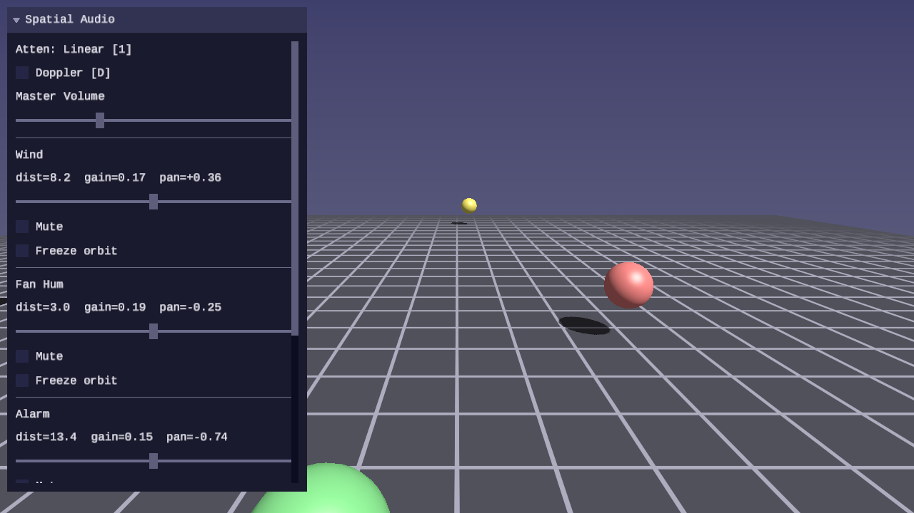
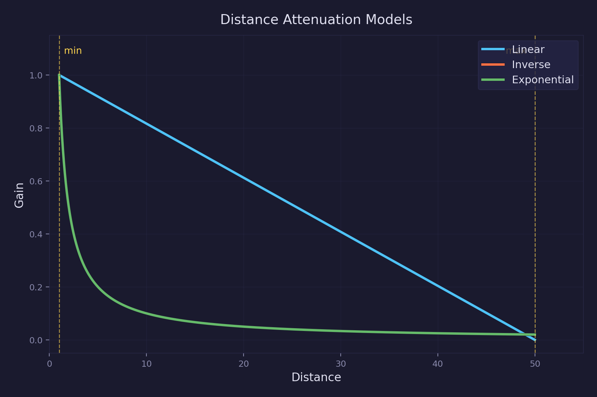
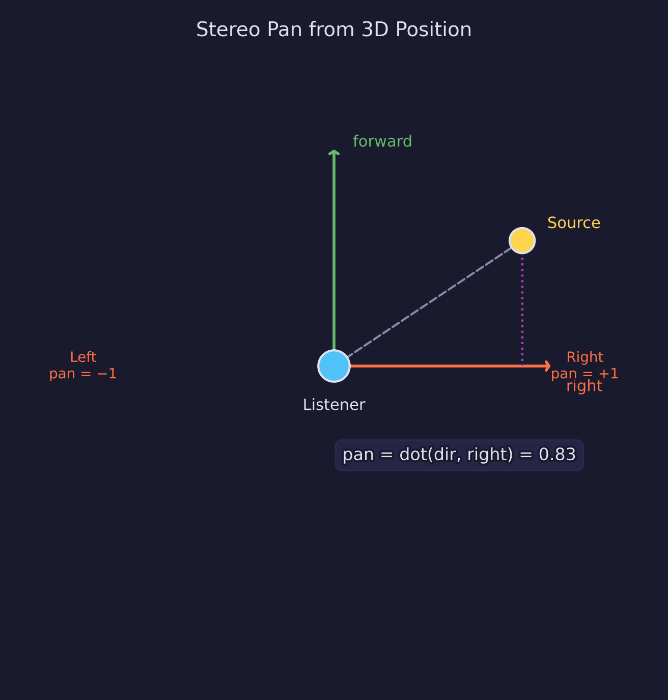
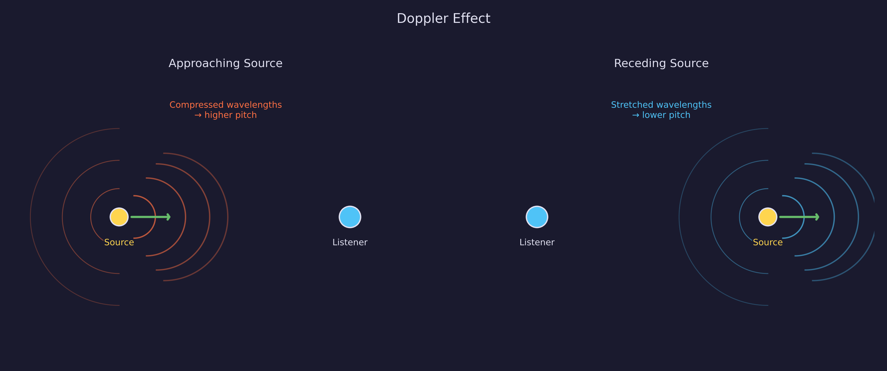
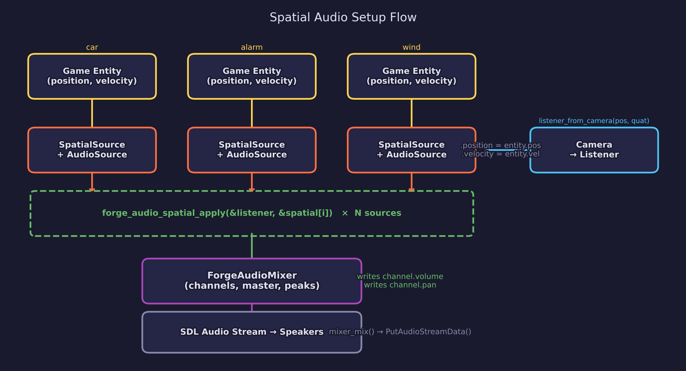

# Audio Lesson 04 — Spatial Audio

3D audio positioning with distance attenuation, stereo panning from
world-space position, and Doppler pitch shifting.

## What you'll learn

- How to position audio sources in 3D space relative to a listener
- Three distance attenuation models: linear, inverse, and exponential
- Stereo panning derived from the dot product of the listener-to-source
  direction with the listener's right axis
- Doppler pitch shifting using fractional-rate sample interpolation
- How the spatial layer wraps existing sources without changing the mixer

## Result



Four colored spheres orbit the camera at different distances and speeds,
each emitting a distinct looping sound. As sources move around the
listener, volume attenuates with distance, audio pans between left and
right speakers, and optional Doppler shifting raises pitch on approach
and lowers it on retreat.

## Key concepts

### Distance attenuation



Every spatial source has a `min_distance` (where attenuation begins) and
a `max_distance` (where the source is silent or nearly silent). The
`rolloff` factor controls how aggressively gain drops between the two.

Three models are available:

**Linear** — gain decreases at a constant rate from min to max:

```text
gain = 1 - rolloff * (distance - min) / (max - min)
```

With rolloff=1, reaches exactly zero at max distance. With rolloff < 1,
gain stays above zero. Simple and predictable, but does not match how
sound behaves in air.

**Inverse distance** — gain follows an inverse-square-like curve:

```text
gain = min / (min + rolloff * (distance - min))
```

Never reaches zero. At twice the min distance with rolloff=1, gain is
0.5. This approximates the physical inverse-square law and is the
default model in OpenAL.

**Exponential** — gain falls off as a power function:

```text
gain = pow(distance / min, -rolloff)
```

Also never reaches zero. The steepness is controlled by the rolloff
exponent. With rolloff=2, gain at twice the min distance is 0.25.

### Stereo pan from 3D position



To convert a 3D source position into a stereo pan value [-1, +1]:

1. Compute the direction from listener to source: `dir = normalize(source - listener)`
2. Dot the direction with the listener's right axis: `pan = dot(dir, listener.right)`

The result is +1 when the source is directly to the right, -1 when
directly to the left, and 0 when ahead or behind. Sources very close to
the listener (< 0.001 units) snap to center pan to avoid instability
from normalizing a near-zero vector.

The listener's right axis comes from the camera orientation quaternion
via `quat_right()` — the same quaternion that drives the FPS camera.
This means audio panning automatically matches the visual perspective.

### Doppler effect



When a source moves relative to the listener, the perceived pitch
changes. The classical Doppler formula:

```text
pitch = (c + v_listener) / (c + v_source)
```

where `c` is the speed of sound (343 m/s), `v_listener` is the
listener's velocity toward the source (positive = toward), and
`v_source` is the source's velocity along the listener-to-source axis
(positive = away from listener).

- **Approaching source**: `v_source < 0` → denominator shrinks → pitch > 1.0
- **Receding source**: `v_source > 0` → denominator grows → pitch < 1.0

The pitch factor is applied as `playback_rate` on the audio source.
The mixing function uses linear interpolation between adjacent samples
to support non-integer cursor advancement. At rate 1.0 with no
fractional accumulation, the mixer takes the integer-step fast path —
identical to the behavior from Lessons 01–03.

Safety guards prevent infinity (source at Mach 1) and clamp the pitch
to [0.5, 2.0] — two octaves in each direction.

### The spatial layer architecture

The spatial system is a layer on top of the existing source/mixer
architecture, not a replacement. A `ForgeAudioSpatialSource` wraps a
`ForgeAudioSource*` and binds to a `ForgeAudioMixer` channel at
creation. It stores position, velocity, and distance parameters.
Each frame, `forge_audio_spatial_apply()` computes three values from
the listener and source positions:

- **attenuation** — writes `channel.volume` (distance-based gain)
- **pan** — writes `channel.pan` (left/right from 3D direction)
- **Doppler** — writes `source->playback_rate` (pitch shift from velocity)

The mixer reads `channel.volume` and `channel.pan` during mixing — the
spatial layer is transparent to the mixing pipeline.

`ForgeAudioSpatialSource` stores a `base_volume` captured at creation
time. Each frame, `forge_audio_spatial_apply()` writes
`channel.volume = base_volume * attenuation_gain`. This preserves
relative volume differences between sources — a loud alarm and a quiet
hum both attenuate correctly without the spatial system permanently
destroying the user-set volume.

The source's `volume`, `pan`, and `playback_rate` fields are also
updated for readback — useful for UI display or non-mixer use cases.

### Using spatial audio in a game



A typical game has entities that emit sound — an engine, a gunshot, an
alarm. Each sound-emitting entity gets a `ForgeAudioSpatialSource` bound
to a mixer channel. Each frame, you update positions and call
`forge_audio_spatial_apply`. The library handles the rest.

**One-time setup** (at init or when spawning an entity):

```c
/* Load the sound */
ForgeAudioBuffer engine_buf;
forge_audio_load_wav("assets/audio/engine.wav", &engine_buf);

/* Create a source (looping, at the volume you want before attenuation) */
ForgeAudioSource engine_src = forge_audio_source_create(&engine_buf, 0.5f, true);
engine_src.playing = true;

/* Add to mixer, then create the spatial wrapper bound to that channel */
int ch = forge_audio_mixer_add_channel(&mixer, &engine_src);
ForgeAudioSpatialSource engine_spatial = forge_audio_spatial_source_create(
    &engine_src, entity_position, &mixer, ch);

/* Optional: tune per-source attenuation */
engine_spatial.min_distance = 2.0f;   /* full volume within 2 units */
engine_spatial.max_distance = 40.0f;  /* silent at 40 units (linear) */
engine_spatial.attenuation  = FORGE_AUDIO_ATTENUATION_INVERSE;
engine_spatial.doppler_enabled = true;
```

**Per frame** (in your update loop):

```c
/* Update listener from camera */
ForgeAudioListener listener = forge_audio_listener_from_camera(
    camera_position, camera_orientation);

/* Update each sound-emitting entity */
engine_spatial.position = entity_position;  /* from your game object */
engine_spatial.velocity = entity_velocity;  /* for Doppler */
forge_audio_spatial_apply(&listener, &engine_spatial);

/* Mix and push to audio device */
forge_audio_mixer_mix(&mixer, mix_buffer, frames);
SDL_PutAudioStreamData(stream, mix_buffer, bytes);
```

That is the complete spatial audio integration. The mixer channel's
volume and pan are set automatically by `forge_audio_spatial_apply` —
you never compute attenuation or panning yourself. The mixer remains
fully accessible for debugging, UI controls (mute, solo, peak meters),
or manual overrides.

## API added

| Function | Purpose |
|---|---|
| `forge_audio_listener_from_camera(pos, quat)` | Build listener from camera position and orientation |
| `forge_audio_spatial_source_create(source, pos, mixer, ch)` | Wrap a source with spatial parameters, bind to mixer channel |
| `forge_audio_spatial_attenuation(model, dist, min, max, rolloff)` | Compute distance gain [0, 1] |
| `forge_audio_spatial_pan(listener, source_pos)` | Compute stereo pan [-1, +1] from 3D position |
| `forge_audio_spatial_doppler(listener, spatial, speed_of_sound)` | Compute Doppler pitch factor |
| `forge_audio_spatial_apply(listener, spatial)` | Apply attenuation, pan, Doppler; writes to bound mixer channel |

## Controls

| Key | Action |
|---|---|
| WASD / Arrows | Move camera (moves listener) |
| Mouse | Look around |
| Space / Shift | Fly up / down |
| P | Pause / resume audio |
| R | Reset orbit angles |
| D | Toggle Doppler on / off |
| 1 | Cycle attenuation model |
| Escape | Release mouse / quit |

## Audio files

This lesson loads four WAV files from `assets/audio/`:

| File | Source library | Description |
|---|---|---|
| `spatial_1.wav` | Essentials-Wind | Looping wind |
| `spatial_2.wav` | Fans-Light-Machines | Server room fan hum |
| `spatial_3.wav` | Scifi-Computer-Sounds | Alarm |
| `spatial_4.wav` | Fans-Light-Machines | Steam engine |

## Building

```bash
cmake -B build
cmake --build build --target 04-spatial-audio

# Run from the repository root (assets loaded relative to CWD)
./build/lessons/audio/04-spatial-audio/04-spatial-audio
```

## AI skill

This lesson's patterns are encoded in the
[`dev-audio-lesson`](../../../.claude/skills/dev-audio-lesson/SKILL.md) skill,
which scaffolds audio lessons with the forge_scene.h baseline, audio library
integration, and UI panel layout.

## Exercises

1. **Custom rolloff**: Try setting `rolloff = 2.0` on the inverse model.
   How does the attenuation curve change? At what distance does gain
   reach 0.25?

2. **Vertical attenuation**: Modify the orbit to move sources up and
   down (vary Y). Does the pan calculation handle vertical offset
   correctly? Why or why not?

3. **Listener velocity**: Set the listener velocity based on camera
   movement delta. Does the Doppler effect apply to the listener's
   motion as well as the source's?

4. **Distance-based low-pass**: In real environments, distant sounds
   lose high-frequency content. Add a simple low-pass filter that
   reduces treble as distance increases (this previews Lesson 06 — DSP
   Effects).

## Further reading

- [Audio Lesson 01](../01-audio-basics/) — WAV loading, source mixing
- [Audio Lesson 02](../02-sound-effects/) — Source pool, fading
- [Audio Lesson 03](../03-audio-mixing/) — Multi-channel mixer
- [Math Lesson 01 — Vectors](../../math/01-vectors/) — `vec3` operations
  (dot product, normalize, length) used for pan and Doppler calculations
- [Math Lesson 08 — Orientation](../../math/08-orientation/) — quaternions
  (`quat_from_euler`, `quat_forward`, `quat_right`) used for listener
  orientation
- [Math library](../../../common/math/README.md) — full API reference
