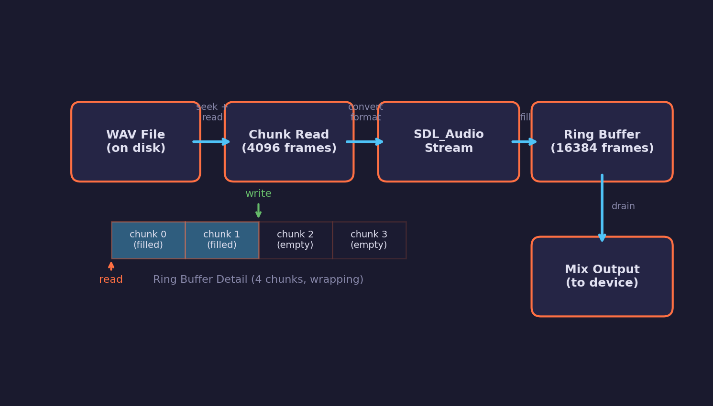
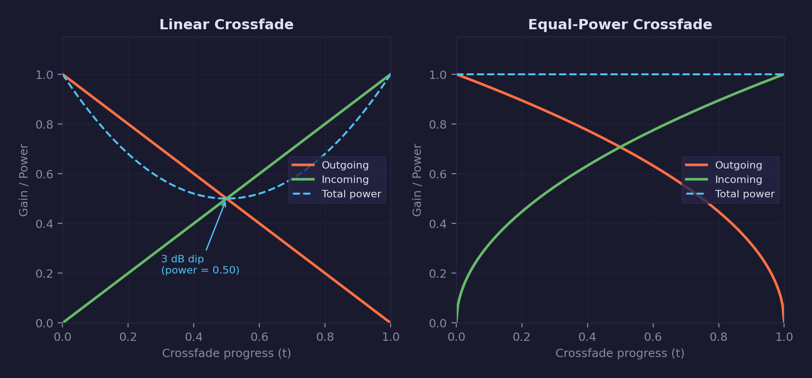
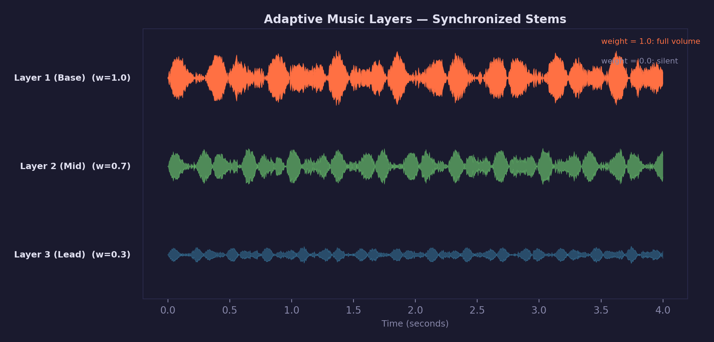

# Audio Lesson 05 — Music and Streaming

Stream music from disk in small chunks, crossfade between tracks, and
mix synchronized layers with per-layer weight control.

## What you will learn

- Why music cannot be loaded entirely into memory the way short sound
  effects can, and how streaming solves the memory problem
- How to parse a WAV header to locate PCM data without reading the whole file
- Ring buffer architecture for constant-memory disk-to-audio streaming
- Format conversion via `SDL_AudioStream` (any WAV format to F32 stereo 44100)
- Equal-power crossfade between two streams
- Loop-with-intro: play an intro section once, then loop the body
- Adaptive music layers: multiple stems streaming in lockstep with
  per-layer weight fading

## Result

A cyberpunk music player with six tracks from all three Cyberpunk Dynamic
Bundle volumes. Each track has 3 layers that can be faded in and out
independently. Crossfading between tracks uses equal-power gain curves
to maintain constant perceived loudness.

The UI panel includes:

- **Track dropdown** — select from six tracks across three albums
- **Transport controls** — play/pause, restart, next track buttons
- **Progress bar** — track-colored with elapsed/total time display
- **Crossfade slider** — adjustable duration with live progress indicator
- **Intensity mode** — a single slider that auto-maps to layer weights,
  simulating adaptive music driven by game state
- **Per-layer strips** — colored labels, weight sliders, mute checkboxes,
  and stereo VU meters with peak hold
- **Master section** — volume slider with stereo VU meter
- **Streaming stats** — ring buffer fill sparkline and memory comparison
  (streaming KB vs full-load MB)

## Key concepts

- **Streaming playback** — read audio from disk in small chunks instead of
  loading entire files into memory
- **Ring buffer** — circular buffer that decouples disk reads from audio
  consumption, providing constant-memory streaming
- **WAV header parsing** — walk RIFF chunk structure to locate `fmt` and
  `data` chunks without reading the entire file
- **Format conversion** — use `SDL_AudioStream` to resample and convert
  from the file's native format to the application's canonical format
- **Equal-power crossfade** — blend two streams using `sqrt(t)` gain
  curves to maintain constant perceived loudness during transitions
- **Loop-with-intro** — play an intro section once, then loop from a
  specified start point instead of the beginning
- **Adaptive music layers** — stream multiple stems simultaneously with
  per-layer weight control driven by game state

## The problem with loading entire files

`forge_audio_load_wav()` from Lesson 01 reads the entire WAV file into a
single `ForgeAudioBuffer`. For a 2-second gunshot at 44100 Hz stereo
float, that is about 700 KB — manageable.

A 40-second music track at 48000 Hz stereo float occupies **15 MB per
layer**. With 3 layers and 2 tracks loaded for crossfade, that is
**90 MB** of decoded audio sitting in memory. Games with dozens of
music tracks would consume gigabytes.

Streaming reads the file in small chunks (4096 frames, about 93 ms of
audio). The ring buffer holds 4 chunks — roughly 0.37 seconds at 44100
Hz. Total memory per stream: **128 KB**, regardless of track length.

## Streaming architecture



The data flows through four stages:

1. **WAV file on disk** — The file stays open for the lifetime of the
   stream. Only the header is parsed upfront to find the `fmt` and
   `data` chunks.

2. **Chunk read** — Each update reads up to 4096 frames of raw PCM data
   from the file at the current cursor position.

3. **SDL_AudioStream** — Converts the raw data from the file's native
   format (e.g. 48 kHz 32-bit float) to the canonical format (44100 Hz
   F32 stereo). SDL handles resampling and channel conversion.

4. **Ring buffer** — Stores the converted audio in a circular buffer
   with read and write cursors. The consumer pulls frames from the read
   cursor; the producer fills at the write cursor. When the file ends
   and looping is enabled, the file cursor wraps back to the loop start.

### WAV header parsing

The internal helper `forge_audio__wav_parse_header()` walks the RIFF
chunk structure to locate two chunks:

- **`fmt`** — Audio format (sample rate, channels, bit depth, encoding)
- **`data`** — Byte offset and size of the raw PCM data

Unknown chunks (`LIST`, `JUNK`, `bext`, etc.) are skipped. This is
necessary because WAV files from different tools order their chunks
differently and may include metadata chunks before the audio data.

### Ring buffer mechanics

The ring buffer is a flat array of `FORGE_AUDIO_STREAM_RING_FRAMES *
2` floats (stereo). Two indices track the state:

- **`ring_write`** — Where the next converted chunk is written
- **`ring_read`** — Where the consumer reads from next

Both indices wrap modulo `RING_FRAMES`. The `ring_available` counter
tracks how many frames are ready to read. When `ring_available` drops
below the threshold, `forge_audio_stream_update()` reads another chunk
from disk.

## Crossfade



When switching tracks, both the outgoing and incoming streams play
simultaneously during the fade. The gain applied to each stream
determines the crossfade character:

**Linear crossfade** (`gain_out = 1 - t`, `gain_in = t`) produces a
3 dB dip at the midpoint because the gains sum to 1.0 but perceived
loudness follows a power law, not a linear one.

**Equal-power crossfade** (`gain_out = sqrt(1 - t)`, `gain_in =
sqrt(t)`) maintains constant perceived loudness because the sum of
squared gains equals 1.0 at every point. This is the method used by
`ForgeAudioCrossfader` and in the demo's group-level crossfade.

## Adaptive music layers



Adaptive music systems play multiple stems (layers) simultaneously —
drums, bass, melody, effects — and adjust their weights based on game
state. When combat starts, the drums layer fades from 0 to 1. When
the player enters a safe zone, the lead melody fades in.

`ForgeAudioLayerGroup` streams all layers from separate WAV files and
keeps them sample-aligned. A leader layer drives the cursor position;
if any non-leader drifts by more than 2 frames, it re-syncs.

Per-layer weights can be faded over a configurable duration using
`forge_audio_layer_group_fade_weight()`. The mix function multiplies
each layer's samples by `weight * group_volume` before summing.

### Loop-with-intro

`forge_audio_stream_set_loop()` accepts an `intro_frames` parameter.
When the stream reaches the end of the file and loops, it wraps back
to `intro_frames` instead of frame 0. This supports the common pattern
of an intro that plays once followed by a looping body.

## Library API

### ForgeAudioStream

| Function | Purpose |
|---|---|
| `forge_audio_stream_open` | Parse WAV header, allocate ring, pre-fill |
| `forge_audio_stream_update` | Refill ring buffer from disk (call per frame) |
| `forge_audio_stream_read` | Pull frames from ring (additive) |
| `forge_audio_stream_seek` | Seek + flush + refill |
| `forge_audio_stream_close` | Free all resources |
| `forge_audio_stream_progress` | Playback fraction [0..1] |
| `forge_audio_stream_set_loop` | Enable looping with optional intro skip |

### ForgeAudioCrossfader

| Function | Purpose |
|---|---|
| `forge_audio_crossfader_init` | Zero state, volume = 1 |
| `forge_audio_crossfader_play` | Open new track, start equal-power crossfade |
| `forge_audio_crossfader_update` | Advance fade, update streams |
| `forge_audio_crossfader_read` | Blend both streams into output |
| `forge_audio_crossfader_close` | Close both streams |

### ForgeAudioLayerGroup

| Function | Purpose |
|---|---|
| `forge_audio_layer_group_init` | Zero state, volume = 1 |
| `forge_audio_layer_group_add` | Open layer WAV, set initial weight |
| `forge_audio_layer_group_fade_weight` | Fade layer weight over duration |
| `forge_audio_layer_group_update` | Update fades, sync cursors, refill |
| `forge_audio_layer_group_read` | Mix weighted layers (additive) |
| `forge_audio_layer_group_seek` | Seek all layers to frame |
| `forge_audio_layer_group_close` | Close all layers |
| `forge_audio_layer_group_progress` | Leader progress [0..1] |

## Controls

| Key | Action |
|---|---|
| P | Pause / resume audio |
| R | Restart current track |
| N | Crossfade to next track |
| 1–3 | Toggle layer on/off |
| WASD | Move camera |
| Mouse | Look around |
| Space / Shift | Fly up / down |
| Escape | Release mouse / quit |

## Audio files

This lesson uses WAV files from the Cyberpunk Dynamic Bundle (48 kHz,
32-bit float, stereo, loop-ready). The files are not included in the
repository due to size and licensing.

Place the following files in `assets/audio/`:

**Cyberpunk Dynamic I** (Perfect Loop versions):

| File | Source |
|---|---|
| `music_notthateasy_layer1-3.wav` | Not That Easy layers 1-3 |
| `music_afterall_layer1-3.wav` | After All layers 1-3 |
| `music_destroy_layer1-3.wav` | Destroy layers 1-3 |

**Cyberpunk Dynamic II** (Loop Version + Layers):

| File | Source |
|---|---|
| `music_unknownclub_layer1-3.wav` | Unknown Club layers 1-3 |
| `music_timedisruptor_layer1-3.wav` | Time Disruptor layers 1-3 |

**Cyberpunk Dynamic III** (Loop Version + Layers):

| File | Source |
|---|---|
| `music_cobra_layer1-3.wav` | Cobra layers 1-3 |

## Building

```bash
cmake -B build
cmake --build build --config Debug --target 05-music-streaming
```

Run from the repository root so asset paths resolve correctly:

```bash
./build/lessons/audio/05-music-streaming/05-music-streaming
```

## AI skill

Use `/dev-audio-lesson` to scaffold new audio lessons. This lesson was
built with that skill and follows the same patterns as Lessons 01–04.

## What's next

[Audio Lesson 06](../06-dsp-effects/) adds real-time DSP effects —
biquad filters, delay lines, and reverb — applied per-source or on the
master bus.

## Exercises

1. **Add more tracks.** The Cyberpunk Dynamic Bundle has 18 tracks across
   three volumes. Add tracks from volumes you have not tried yet and
   observe how the crossfade handles different track lengths.

2. **Implement loop-with-intro.** Call `forge_audio_stream_set_loop()`
   with a non-zero intro length on each layer. The intro plays once,
   then the body loops. Try different intro lengths to find a natural
   transition point.

3. **Intensity presets.** Add buttons (e.g. "Calm", "Tense", "Combat")
   that snap the intensity slider to preset values (0.2, 0.6, 1.0) with
   a smooth fade. This simulates how a game engine would drive adaptive
   music from discrete game states rather than a continuous slider.

4. **Scrubbable progress bar.** Replace the read-only progress bar with a
   clickable one that seeks all layers when the user clicks a position.
   Use `forge_audio_layer_group_seek()` with the computed frame offset.

## Further reading

- [Audio Lesson 01](../01-audio-basics/) — PCM fundamentals, WAV loading
- [Audio Lesson 03](../03-audio-mixing/) — Multi-channel mixer, soft clipping
- [Audio Lesson 04](../04-spatial-audio/) — Spatial audio, distance attenuation
- [Math Lesson 01](../../math/01-vectors/) — Vectors (used in spatial audio)
