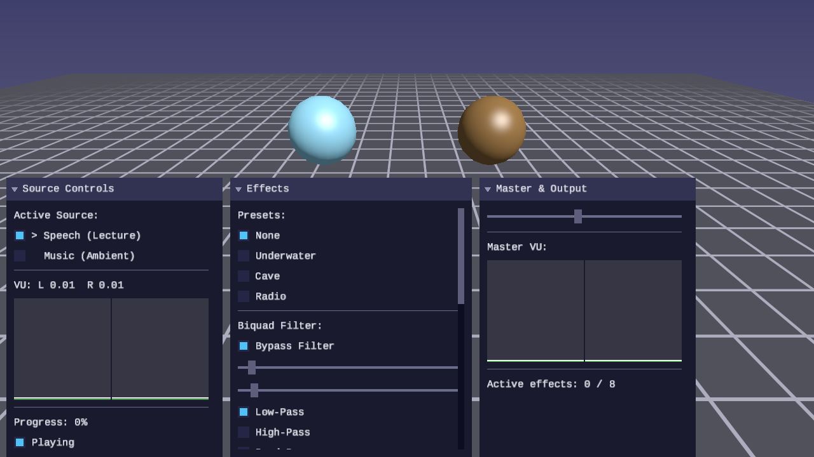
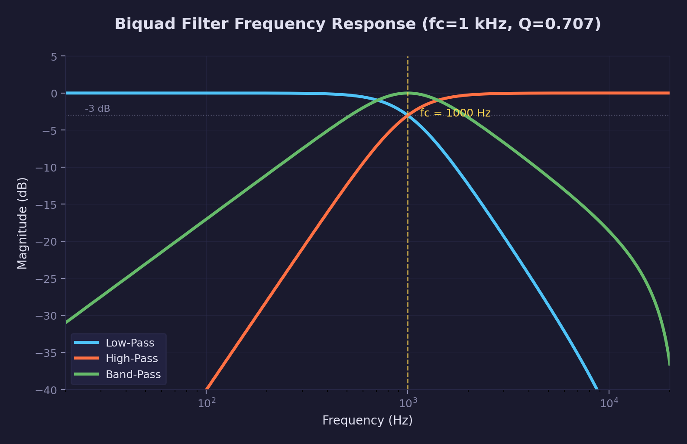
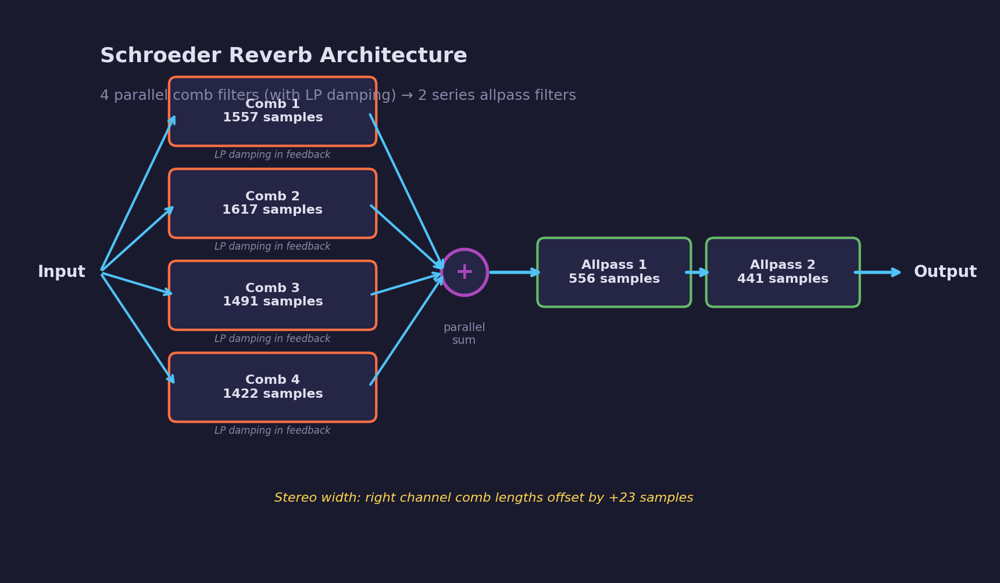
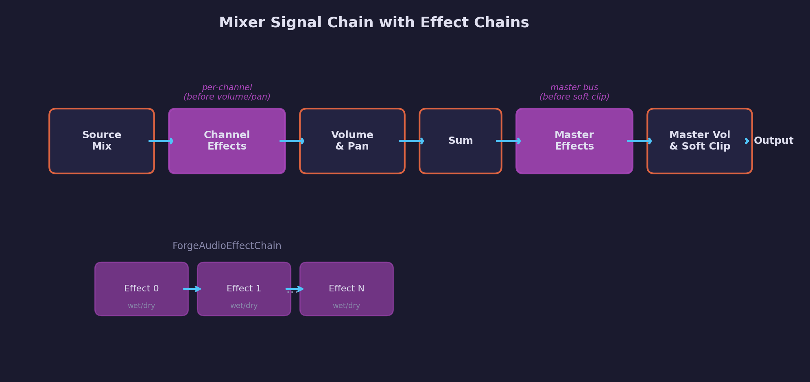

# Audio Lesson 06 — DSP Effects

Callback-based DSP effect system with four built-in effects, per-channel
and master-bus effect chains, and presets that combine effects.

## Result



Interactive demo with two audio sources (speech and music), four DSP effects
with per-parameter sliders, three presets, and master VU metering.

## What you will learn

- How biquad filters work (Robert Bristow-Johnson Audio EQ Cookbook)
- Circular buffer delay lines with feedback
- Schroeder reverb architecture (parallel comb + series allpass filters)
- Chorus via sine LFO modulated delay with linear interpolation
- Inserting effect chains into a mixer signal path
- Wet/dry blending for effects

## Key concepts

### Built-in effects

| Effect | Algorithm | Parameters |
|--------|-----------|------------|
| Biquad filter | Second-order IIR (Direct Form I) | Type (LP/HP/BP), cutoff Hz, Q |
| Delay | Circular buffer echo | Time (seconds), feedback [0..1), wet |
| Reverb | Schroeder: 4 comb + 2 allpass with LP damping | Room size, damping, wet |
| Chorus | Sine LFO modulated delay, linear interpolation | Rate Hz, depth (seconds), wet |

### Biquad filter frequency response

The biquad filter uses coefficients from the Robert Bristow-Johnson Audio EQ
Cookbook.  Low-pass, high-pass, and band-pass types share the same Direct
Form I structure — only the coefficient computation differs.



The cutoff frequency (fc) is where the filter response crosses -3 dB.  Q
controls resonance — higher Q produces a sharper rolloff and a peak near
the cutoff.

### Schroeder reverb architecture

The reverb uses Manfred Schroeder's architecture: four parallel comb filters
whose outputs are summed, then passed through two series allpass filters.
Each comb filter has a one-pole low-pass filter in its feedback path to
simulate high-frequency absorption in real rooms.



Stereo width is achieved by offsetting the right channel's comb delay lengths
by 23 samples relative to the left channel.

## Presets

| Preset | Effects | Sound |
|--------|---------|-------|
| Underwater | LP 500 Hz + reverb (room 0.8) | Muffled, submerged |
| Cave | Reverb (room 0.95) + delay (0.4s) | Long tail with echoes |
| Radio | HP 800 Hz + LP 3000 Hz | Bandpass, tinny speaker |

## Signal chain



Channel effect chains process raw samples before volume and pan are applied.
The master effect chain processes the summed output before master volume and
tanh soft clipping.  Each effect in a chain supports bypass and wet/dry
blending.

## Controls

| Key | Action |
|-----|--------|
| WASD / Arrows | Move camera |
| Mouse | Look around |
| Space / Shift | Fly up / down |
| P | Pause / resume audio |
| R | Restart current source |
| 1-2 | Switch audio source |
| Escape | Release mouse / quit |

## Audio sources

The demo loads two WAV files from `assets/`:

- **Speech (Lecture)** — 3m20s mono lecture recording at 48 kHz, ideal for
  hearing filter and reverb effects on voice
- **Music (Ambient)** — 114s stereo sci-fi ambient track at 44.1 kHz

## Building

```bash
cmake -B build
cmake --build build --target 06-dsp-effects --config Debug
```

Run from the repository root:

```bash
python scripts/run.py audio/06
```

## Library additions

This lesson adds ~700 lines to `common/audio/forge_audio.h`:

- `ForgeAudioEffect`, `ForgeAudioEffectChain` — generic callback-based
  effect interface
- `ForgeAudioBiquad` — second-order IIR filter
- `ForgeAudioDelay` — circular buffer delay line
- `ForgeAudioReverb` — Schroeder algorithmic reverb
- `ForgeAudioChorus` — LFO modulated delay
- Preset functions for common effect combinations
- Mixer integration: `ForgeAudioChannel.effects` and
  `ForgeAudioMixer.master_effects`

See [common/audio/README.md](../../../common/audio/README.md) for the full
API reference.

## What's next

Audio Lesson 07 will use real-space impulse responses for convolution
reverb — replacing the algorithmic Schroeder model with recorded room
acoustics.

## Exercises

1. **Parametric EQ** — Chain three biquad filters (LP, BP, HP) to build a
   three-band parametric equalizer.  Add UI sliders for each band's cutoff
   and gain.

2. **Ping-pong delay** — Modify the delay line to alternate echoes between
   left and right channels, creating a stereo ping-pong effect.

3. **Tremolo effect** — Create a new effect that modulates amplitude with a
   sine LFO (similar to how chorus modulates delay time).  Parameters: rate
   (Hz) and depth (0..1).

4. **Preset interpolation** — Implement smooth transitions between presets
   by interpolating all effect parameters over a configurable duration
   instead of switching instantly.
