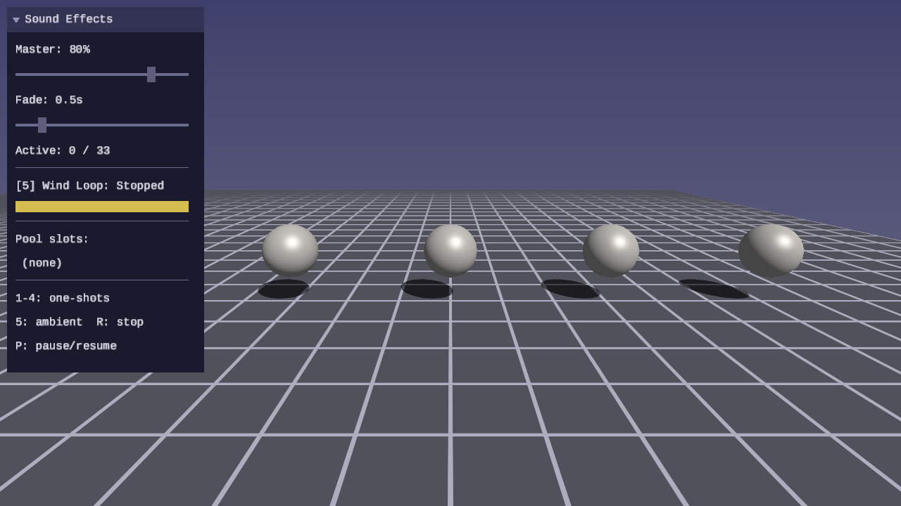
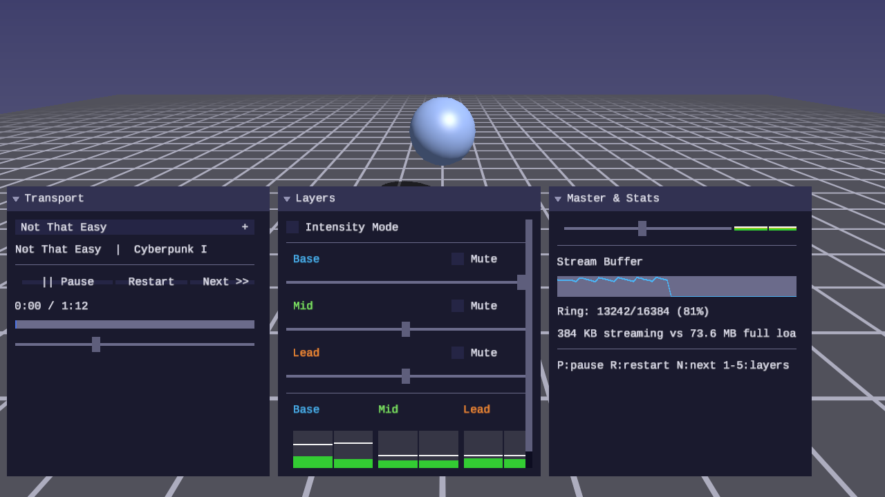

# Audio Lessons

Sound playback, mixing, spatial audio, and music systems — built on SDL3
audio streams.

## Purpose

Audio lessons teach how to generate, process, and spatialize sound in
real time:

- Load and play WAV audio with SDL audio streams
- Mix multiple sound sources with volume and panning control
- Spatialize audio with distance attenuation and stereo panning from 3D position
- Stream large audio files from disk for music playback
- Apply DSP effects (filters, reverb, echo) to audio sources

Every lesson is a standalone interactive program with an SDL GPU rendered
scene and a forge UI panel for audio controls (volume sliders, waveform
displays, source selectors). The audio is the focus — the 3D scene and UI
serve to illustrate and control what the listener hears.

## Philosophy

- **Hear it, then understand it** — Audio concepts are best learned by
  listening. Every lesson produces audible output that demonstrates the
  concept before explaining the code.
- **Real-time processing** — Audio runs on a callback or stream model,
  processing samples in small buffers. Lessons teach the streaming mindset
  from the start.
- **Library-driven** — `forge_audio.h` is the primary deliverable of every
  lesson. The lessons teach; the library is what remains. It must be correct,
  efficient, and tested. Every lesson extends it, and tests must pass before
  the demo program is written.
- **SDL3 audio streams** — All audio goes through SDL's audio stream API.
  No platform-specific backends, no third-party audio libraries.

## Lessons

| | Lesson | About |
|---|--------|-------|
| [](01-audio-basics/) | [**01 — Audio Basics**](01-audio-basics/) | PCM fundamentals, WAV loading, F32 conversion, mixing, SDL audio streams |
| [](02-sound-effects/) | [**02 — Sound Effects**](02-sound-effects/) | Source pool, fire-and-forget playback, volume fading, polyphony |
| [](03-audio-mixing/) | [**03 — Audio Mixing**](03-audio-mixing/) | Multi-channel mixer, per-channel volume/pan/mute/solo, soft clipping, peak metering |
| [](04-spatial-audio/) | [**04 — Spatial Audio**](04-spatial-audio/) | 3D positioning, distance attenuation, stereo pan from position, Doppler pitch shift |
| [](05-music-streaming/) | [**05 — Music & Streaming**](05-music-streaming/) | Chunked WAV streaming, ring buffer, crossfade, loop-with-intro, adaptive music layers |

## Shared library

Audio lessons build on `common/audio/forge_audio.h` — a header-only library
that grows with each lesson. See
[common/audio/README.md](../../common/audio/README.md) for the API reference.

## Controls

Audio lessons use a consistent control scheme. Lessons with 3D scenes use the
standard camera controls; all lessons include audio-specific controls:

| Key | Action |
|---|---|
| WASD / Arrows | Move camera (3D lessons) |
| Mouse | Look around (3D lessons) |
| Space / Shift | Fly up / down (3D lessons) |
| R | Reset / replay sound |
| 1–9 | Toggle sound sources (where applicable) |
| Escape | Release mouse / quit |

## Prerequisites

Audio lessons use the same build system as other tracks:

- CMake 3.24+
- A C compiler (MSVC, GCC, or Clang)
- SDL3 (with audio support — enabled by default)
- A GPU with Vulkan, Direct3D 12, or Metal support (for the visual component)
- Python 3 (for shader compilation and capture scripts)

## Building

```bash
cmake -B build
cmake --build build --config Debug

# Run an audio lesson
python scripts/run.py audio/01
```
