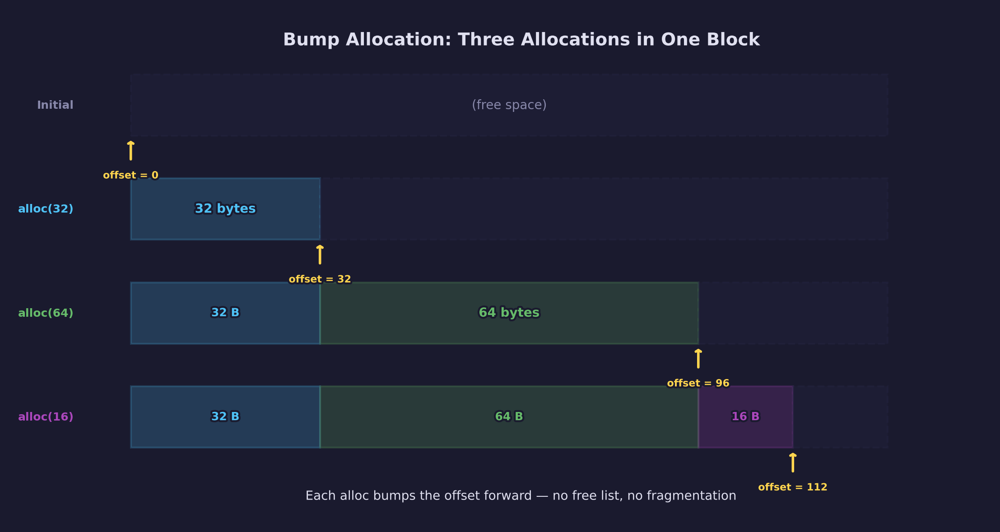
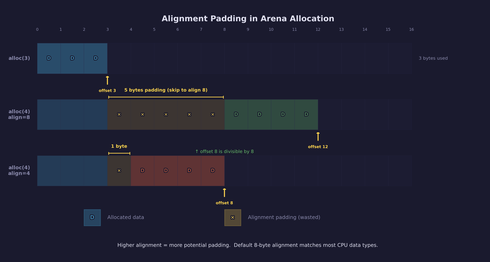
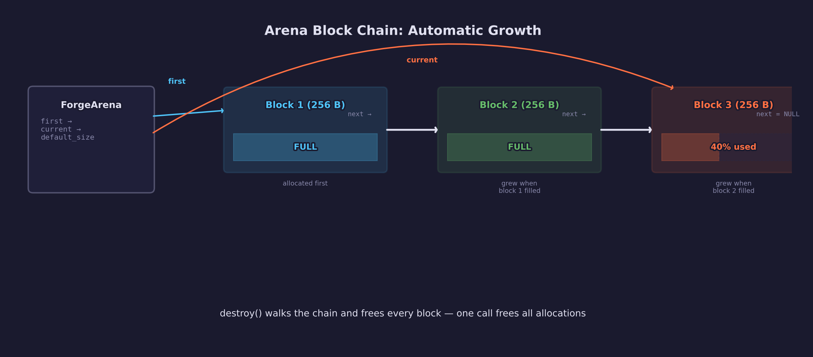

# Engine Lesson 12 — Memory Arenas

How `forge_arena.h` replaces hundreds of `malloc`/`free` calls with a single
allocator that frees everything at once — and why that matters for game code.

## What you'll learn

- What an arena (bump) allocator is and how it works internally
- The three common arena lifetimes in games: app, per-task, and per-frame
- How `forge_arena.h` grows automatically via a linked list of blocks
- Why arena-allocated memory is zero-initialized and aligned
- How we refactored `forge_gltf.h` from fixed-size stack arrays with
  hard-coded limits to arena-backed pointer fields with no baked-in caps

## Why this matters

Game code allocates memory in predictable patterns. A level loader allocates
hundreds of entities, meshes, and textures — then frees all of them when the
level unloads. A renderer allocates scratch buffers every frame — then discards
them before the next frame. An asset parser allocates nodes, materials, and
primitives — then the caller owns all of it until the scene is unloaded.

With `malloc`/`free`, each of these allocations must be tracked and freed
individually. Miss one and you leak memory. Free one too early and you corrupt
the heap. Free one twice and you crash.

An arena allocator eliminates per-allocation bookkeeping bugs. You allocate by
bumping a pointer forward. You free by destroying the arena — one call frees
everything. There are no individual `free` calls to forget or double-free.
Using arena memory after `forge_arena_reset()` or `forge_arena_destroy()` is
still invalid — the arena eliminates per-allocation mistakes, not lifetime
mistakes.

## Result

The demo program shows five patterns that cover how arenas are used in practice:

```text
=== Engine Lesson 12: Memory Arenas ===

--- Demo 1: Application Lifetime Arena ---
  Created arena with 4 KB default block size
  Allocated 8 settings (1920x1080, 60 fps, FOV 90)
  Allocated 4 name pointers
  [app] used: 64 / 4096 bytes (1.6%)
  Destroyed app arena -- all memory freed at once

--- Demo 2: Per-Task Lifetime Arena (Level Load) ---
  Created level arena (default 64 KB block size)
  Loaded 5 entities:
    [0] 'player' at (0, 0)
    [1] 'guard_01' at (10, 5)
    [2] 'guard_02' at (20, 10)
    [3] 'chest' at (30, 15)
    [4] 'door' at (40, 20)
  Loaded 3 spawn points
  [level] used: 252 / 65536 bytes (0.4%)
  Unloaded level -- all level memory freed at once

--- Demo 3: Per-Frame Lifetime Arena (Scratch Memory) ---
  Frame 0: 6 vertices, 6 sort keys
  [frame] used: 168 / 4096 bytes (4.1%)
  Frame 1: 9 vertices, 9 sort keys
  [frame] used: 252 / 4096 bytes (6.2%)
  Frame 2: 12 vertices, 12 sort keys
  [frame] used: 336 / 4096 bytes (8.2%)
  Capacity never grew: 4096 bytes (reused each frame)
  Destroyed frame arena

--- Demo 4: Automatic Growth ---
  Created arena with 256-byte blocks
  [initial] used: 0 / 256 bytes (0.0%)
  After 10 entity allocations:
  [grown] used: 472 / 512 bytes (92.2%)
  Arena grew from 256 bytes to 512 bytes as needed

--- Demo 5: Arena vs malloc/free ---
  [comparison text output]

=== Done ===
```

## Key concepts

- **Arena allocator** — A memory allocator that satisfies requests by advancing
  a pointer ("bumping") through a pre-allocated block. All allocations are freed
  together when the arena is destroyed or reset. Also called a bump allocator
  or linear allocator.
- **Block chain** — When the current block runs out of space, the arena
  allocates a new block and appends it to a singly-linked list. Earlier
  pointers remain valid because existing blocks are never moved or reallocated.
- **Batch lifetime** — A group of allocations that all become invalid at the
  same time. Arenas are a direct match for batch lifetimes: app shutdown,
  level unload, frame end, asset parse completion.
- **Per-frame arena** — An arena that is `reset` (not destroyed) at the start
  of each frame. The backing memory is reused without being freed and
  reallocated, avoiding heap pressure in the frame loop.
- **Zero initialization** — `forge_arena_alloc` returns zeroed memory, matching
  `SDL_calloc` behavior. You never get uninitialized data from an arena.

## The details

### How bump allocation works



A traditional allocator like `malloc` maintains a free list, coalesces
adjacent free blocks, and searches for a block that fits. Each allocation and
free involves bookkeeping.

An arena skips all of that. It maintains a pointer to the next free byte. To
allocate `n` bytes, it advances the pointer by `n` and returns the old pointer.
That is the entire operation — one addition and one comparison:

```c
void *forge_arena_alloc(ForgeArena *arena, size_t size)
{
    return forge_arena_alloc_aligned(arena, size, FORGE_ARENA_DEFAULT_ALIGN);
}
```

The `alloc_aligned` function handles alignment padding and block overflow, but
the core operation is still a pointer bump. This makes arena allocation
significantly faster than `malloc` for workloads that allocate many small
objects.

### The forge_arena.h API

Create an arena with a default block size (0 uses the default of 64 KB):

```c
ForgeArena arena = forge_arena_create(0);           /* 64 KB default */
ForgeArena small = forge_arena_create(4096);         /* 4 KB blocks   */
```

Allocate memory — zero-initialized, 8-byte aligned by default:

```c
int *scores = forge_arena_alloc(&arena, 100 * sizeof(int));
```

Allocate with explicit alignment (must be a power of 2):

```c
float *simd_data = forge_arena_alloc_aligned(&arena, 64, 16);  /* 16-byte aligned */
```



Query usage:

```c
size_t used     = forge_arena_used(&arena);      /* bytes in use */
size_t capacity = forge_arena_capacity(&arena);  /* total backing memory */
```

Reset without freeing (reuse the backing memory):

```c
forge_arena_reset(&arena);  /* all pointers from this arena are now invalid */
```

Destroy and free all backing memory:

```c
forge_arena_destroy(&arena);  /* arena is zeroed, safe to ignore */
```

### Three arena lifetimes

**Application lifetime.** Create the arena at startup, allocate configuration
and global data, destroy at shutdown. Nothing is freed during the program's
life.

```c
ForgeArena app_arena = forge_arena_create(4096);
AppSettings *settings = forge_arena_alloc(&app_arena, sizeof(AppSettings));
settings->width = 1920;
settings->height = 1080;
/* ... use settings throughout the program ... */
forge_arena_destroy(&app_arena);  /* at shutdown */
```

**Per-task lifetime.** Create the arena when a task begins (loading a level,
parsing a file), allocate everything the task needs, destroy when the task
is complete or the result is no longer needed.

```c
ForgeArena level_arena = forge_arena_create(0);  /* 64 KB blocks */
Entity *entities = forge_arena_alloc(&level_arena, count * sizeof(Entity));
/* ... load level data ... */
forge_arena_destroy(&level_arena);  /* unload: everything freed at once */
```

**Per-frame lifetime.** Create the arena once. Each frame, allocate scratch
data (temporary vertex buffers, sort keys, debug strings). At frame end, reset
the arena — the backing memory is reused next frame without any heap calls.

```c
ForgeArena frame_arena = forge_arena_create(4096);

/* each frame: */
forge_arena_reset(&frame_arena);
Vertex *verts = forge_arena_alloc(&frame_arena, num_verts * sizeof(Vertex));
/* ... fill and use verts ... */
/* verts are implicitly discarded on next reset */
```

### How the block chain grows



When an allocation does not fit in the current block, `forge_arena_alloc`
allocates a new block via `SDL_malloc` and appends it to the linked list. The
new block's size is the larger of the default block size and the requested
allocation, so a single large allocation never fails due to block size.

Existing pointers remain valid because the previous blocks are never moved or
freed. The fast path touches only the current block. When the current block is
full, the allocator walks the remaining chain to reuse blocks that were retained
after a `forge_arena_reset()` before allocating a new one.

## Case study: the `forge_gltf.h` refactor

The glTF parser (`common/gltf/forge_gltf.h`) originally used fixed-size
arrays on the stack:

```c
/* Before: large fixed arrays on the stack, hard limits everywhere */
typedef struct ForgeGltfScene {
    ForgeGltfNode nodes[512];           /* 512 max nodes */
    ForgeGltfMesh meshes[256];          /* 256 max meshes */
    ForgeGltfPrimitive primitives[1024]; /* 1024 max primitives */
    /* ... more fixed arrays ... */
} ForgeGltfScene;
```

This had two problems. First, the struct was large enough to overflow the stack
on some platforms. Second, the hard limits meant that models exceeding any
`MAX_*` constant simply could not load.

After the refactor, `ForgeGltfScene` is a handful of pointers:

```c
/* After: pointer fields, no hard limits */
typedef struct ForgeGltfScene {
    ForgeGltfNode      *nodes;
    int                 node_count;
    ForgeGltfMesh      *meshes;
    int                 mesh_count;
    ForgeGltfPrimitive *primitives;
    int                 primitive_count;
    /* ... */
} ForgeGltfScene;
```

The caller provides an arena, and the parser allocates exactly what the model
needs:

```c
/* Old API */
ForgeGltfScene scene;
forge_gltf_load("model.gltf", &scene);
/* ... use scene ... */
forge_gltf_free(&scene);

/* New API */
ForgeArena arena = forge_arena_create(0);
ForgeGltfScene scene;
forge_gltf_load("model.gltf", &scene, &arena);
/* ... use scene.nodes[i], scene.meshes[j] — same access syntax ... */
forge_arena_destroy(&arena);  /* frees everything */
```

The usage pattern is nearly identical. The key difference is that
`forge_arena_destroy` replaces `forge_gltf_free` — and it frees the nodes,
meshes, primitives, materials, and every other allocation the parser made, in
one call. The parser no longer individually frees scene-owned allocations
(those are returned to the caller and freed by `forge_arena_destroy`). It still
frees temporary parse state internally — `SDL_free(json_text)` for the raw JSON
string and `cJSON_Delete(root)` for the parse tree — but those are transient
and invisible to the caller.

## Common errors

### Using arena memory after destroy

```c
ForgeArena arena = forge_arena_create(0);
int *data = forge_arena_alloc(&arena, 100 * sizeof(int));
forge_arena_destroy(&arena);
data[0] = 42;  /* BUG: dangling pointer — arena memory is freed */
```

`forge_arena_destroy` frees all backing blocks. Any pointer obtained from
the arena is invalid after this call. The same applies to `forge_arena_reset`
— all prior pointers from that arena become invalid.

### Forgetting to create the arena

```c
ForgeArena arena;  /* uninitialized — all fields are garbage */
forge_gltf_load("model.gltf", &scene, &arena);  /* crash or corruption */
```

Always initialize with `forge_arena_create`. The create function allocates
the first block and zeroes the bookkeeping fields. An uninitialized arena has
garbage pointers that will cause immediate crashes or silent corruption.

### Using an arena where individual free is needed

Arenas cannot free individual allocations. If your data structure requires
removing items from the middle (a hash table with deletion, a dynamic array
with removal), use `malloc`/`free` or a pool allocator instead.

Arenas are for batch lifetimes: everything allocated together, freed together.
If you find yourself wanting to free a single arena allocation, the arena is
the wrong tool for that use case.

## Where it's used

In forge-gpu:

- [`common/arena/forge_arena.h`](../../../common/arena/forge_arena.h) — The
  arena allocator implementation taught in this lesson
- [`common/gltf/forge_gltf.h`](../../../common/gltf/forge_gltf.h) — The glTF
  parser, refactored to use arena allocation (case study above)
- [GPU Lesson 09 — Scene Loading](../../gpu/09-scene-loading/) and all
  subsequent GPU lessons that load glTF models use arenas through
  `forge_gltf_load`
- [`tools/mesh/`](../../../tools/mesh/) and [`tools/anim/`](../../../tools/anim/)
  — Asset processing tools that use arenas for parse-lifetime memory

## Building

```bash
cmake -B build
cmake --build build --config Debug

# Windows
build\lessons\engine\12-memory-arenas\Debug\12-memory-arenas.exe

# Linux / macOS
./build/lessons/engine/12-memory-arenas/12-memory-arenas
```

## Exercises

1. **Track block count during growth** — Modify Demo 4 to count how many
   blocks the arena allocated as it grew. Walk the block list from
   `arena.first` and count the `next` pointers. Print the count after the
   growth phase.

2. **Level reload with reset** — Create a "level load" scenario that
   allocates entities into an arena, prints them, then calls
   `forge_arena_reset` and loads a different set of entities into the same
   arena. Verify that the arena capacity does not increase on the second load.

3. **Time arena vs malloc** — Measure the time difference between 1000
   `malloc`/`free` pairs and 1000 `forge_arena_alloc` calls followed by one
   `forge_arena_destroy`. Use `SDL_GetPerformanceCounter` for timing.

## Further reading

- [Engine Lesson 04 — Pointers & Memory](../04-pointers-and-memory/) — Stack
  vs heap, `sizeof`, pointer arithmetic — prerequisites for understanding
  arena allocation
- [Engine Lesson 05 — Header-Only Libraries](../05-header-only-libraries/) —
  How `forge_arena.h` is structured as a header-only library with
  `static` functions
- [`common/arena/forge_arena.h`](../../../common/arena/forge_arena.h) — The
  full annotated source code for the arena allocator
- [Ryan Fleury — Memory Management in a Game Engine](https://www.rfleury.com/p/untangling-lifetimes-the-arena-allocation) —
  In-depth article on arena allocation in game engines
