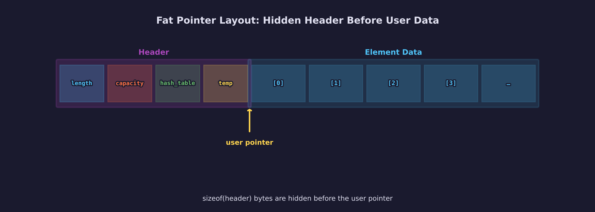
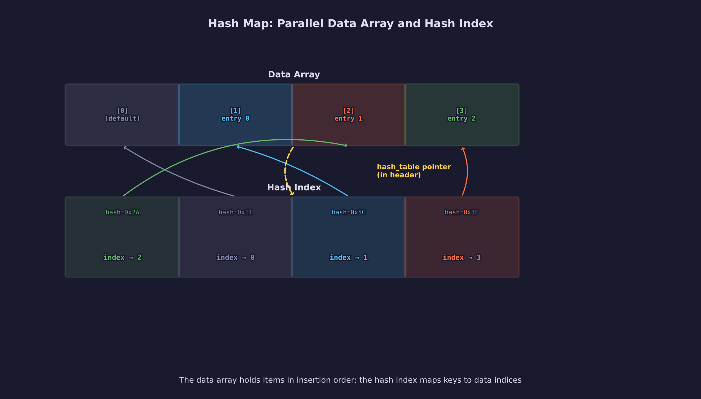
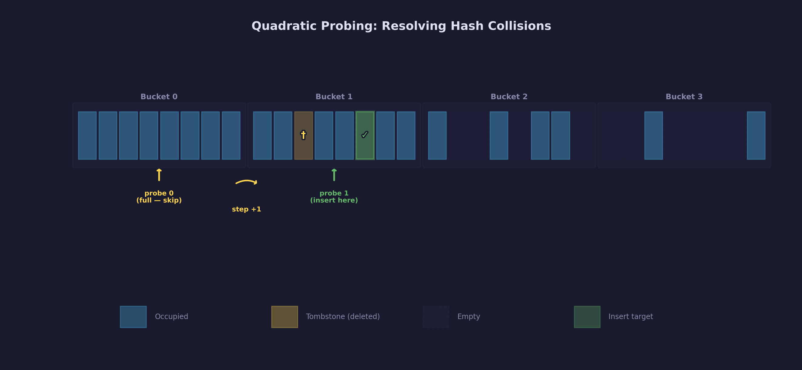
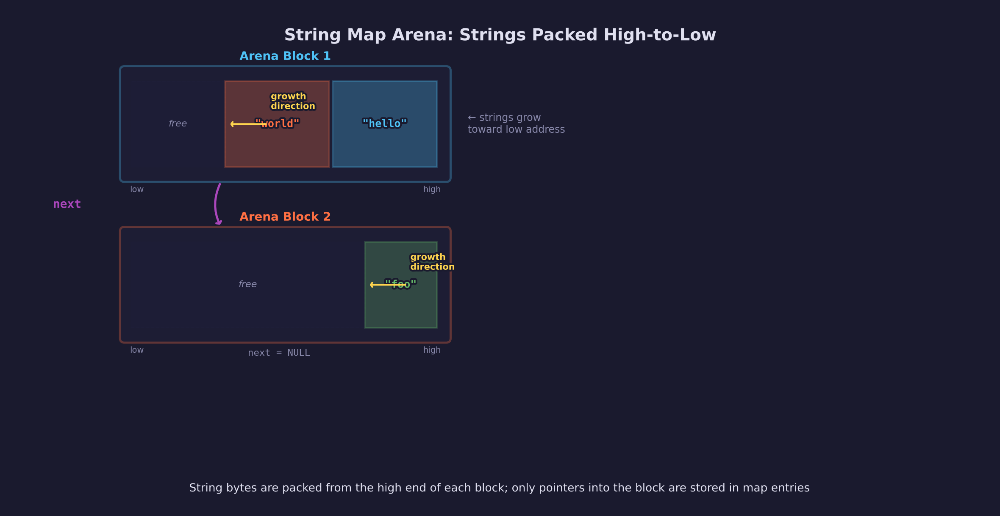

# Engine Lesson 13 — Stretchy Containers

Dynamic arrays and hash maps through fat pointers — the per-element allocation
pattern that complements arenas.

## What you will learn

- The fat-pointer pattern: how a typed pointer can carry hidden metadata
- Dynamic arrays that grow automatically on append
- Hash maps with O(1) keyed lookup using bucketed quadratic probing
- String-keyed maps with three ownership modes
- When to use arrays vs hash maps vs arenas

## Result

The demo program prints six scenarios — dynamic arrays, array operations, hash
map basics, default values, string maps, and a comparison of access patterns
(selected output):

```text
=== Engine Lesson 13: Stretchy Containers ===

--- Demo 1: Dynamic Arrays ---
  Start: nums is NULL, length = 0
  After 5 appends: length = 5, capacity = 8
  Contents: [10, 20, 30, 40, 50]
  Last element: 50
  Popped: 50, length now = 4
  After free: nums is NULL, length = 0

--- Demo 3: Hash Map Basics ---
  Inserted 4 entries, length = 4
  get(1) = 95.5, get(3) = 92.3
  Iterating all entries:
    key=1  value=95.5
    key=2  value=87.0
    key=3  value=92.3
    key=4  value=78.8
  remove(2) returned 1, length = 3

--- Demo 5: String Hash Map ---
  Initialized string map in strdup mode
  Inserted 5 config entries, length = 5
  get("width") = 1920, get("height") = 1080
```

## Prerequisites

- [Lesson 12 — Memory Arenas](../12-memory-arenas/): batch-lifetime allocation
- [Lesson 04 — Pointers & Memory](../04-pointers-and-memory/): stack vs heap,
  `malloc`/`free`, pointer arithmetic
- [Lesson 05 — Header-Only Libraries](../05-header-only-libraries/): how
  single-header libraries work

## The problem

Arenas solve batch-lifetime allocation: allocate many things, free them all at
once. But some data structures need to grow and shrink per element:

- A list of entities that spawns and despawns during gameplay
- A lookup table mapping IDs to objects
- A set of unique strings encountered during parsing

These need **dynamic containers** — arrays that grow on append, maps that
support insert and delete. The C standard library does not provide them. This
lesson builds them from scratch.

## The fat-pointer pattern

Every container in `forge_containers.h` is a **plain typed pointer**. You
declare `int *numbers = NULL` and pass it to macros that manage the backing
storage. Indexing works normally — `numbers[3]` — because the pointer points
directly at element data.

The technique: each allocation carries a small **hidden header** immediately
before the user pointer.



When the library allocates or reallocates, it requests
`sizeof(header) + capacity * sizeof(element)` bytes, then returns a pointer
offset past the header. When it needs the metadata, it subtracts the header
size to reach the hidden prefix.

```c
/* The hidden header — sits before the user pointer */
typedef struct {
    size_t  length;      /* elements currently stored */
    size_t  capacity;    /* allocated element slots */
    void   *hash_table;  /* NULL for plain arrays */
    ptrdiff_t temp;      /* scratch for macro communication */
} header;
```

Key properties:

- The user pointer is a valid pointer to element 0
- Standard C indexing and pointer arithmetic work
- `NULL` is a valid empty container (length 0, capacity 0)
- No `void *` casting — the compiler enforces element types

The `hash_table` and `temp` fields are unused by arrays but present in every
header. Arrays and hash maps share the same header type — a deliberate
simplicity-over-space trade.

## Dynamic arrays

### Usage

```c
#include "containers/forge_containers.h"

int *scores = NULL;                      /* start empty */
forge_arr_append(scores, 95);            /* append elements */
forge_arr_append(scores, 87);
forge_arr_append(scores, 92);

SDL_Log("count: %td", forge_arr_length(scores));  /* 3 */
SDL_Log("first: %d",  scores[0]);                 /* 95 */

int last = forge_arr_pop(scores);        /* remove + return last */
forge_arr_free(scores);                  /* free everything */
```

### Growth policy

When an append would exceed capacity, the library doubles the allocation
(minimum 4 elements on first use):


```text
new_capacity = max(needed, old_capacity * 2)
if new_capacity < 4 then new_capacity = 4
```

The doubling ensures amortized O(1) append. The minimum of 4 avoids
reallocating on every early append.

Because `SDL_realloc` may move the block, **the macro reassigns the user's
pointer variable in place**. This is why the API uses macros rather than
functions — a function cannot update the caller's local variable.

### Operations

| Operation | Macro | Cost |
|-----------|-------|------|
| Append | `forge_arr_append(a, val)` | O(1) amortized |
| Length (signed) | `forge_arr_length(a)` | O(1) |
| Length (unsigned) | `forge_arr_length_unsigned(a)` | O(1) |
| Capacity | `forge_arr_capacity(a)` | O(1) |
| Pop last | `forge_arr_pop(a)` | O(1) |
| Last element | `forge_arr_last(a)` | O(1) |
| Index access | `a[i]` | O(1) |
| Insert at index | `forge_arr_insert_at(a, i, val)` | O(n) |
| Insert n at index | `forge_arr_insert_n_at(a, i, n)` | O(n) |
| Delete at index | `forge_arr_delete_at(a, i)` | O(n) |
| Delete n at index | `forge_arr_delete_n_at(a, i, n)` | O(n) |
| Unordered remove | `forge_arr_swap_remove(a, i)` | O(1) |
| Grow by n (pointer) | `forge_arr_grow_by_ptr(a, n)` | O(1) amortized |
| Grow by n (index) | `forge_arr_grow_by_index(a, n)` | O(1) amortized |
| Reserve capacity | `forge_arr_set_capacity(a, n)` | O(n) worst case |
| Set length | `forge_arr_set_length(a, n)` | O(n) worst case |
| Free | `forge_arr_free(a)` | O(1) |

`forge_arr_swap_remove` is the key operation for game entity lists: it
overwrites the deleted element with the last element and decrements length.
O(1) but does not preserve order.

`forge_arr_grow_by_ptr` appends n uninitialized slots and returns a pointer to
the first new one — useful for batch-filling:

```c
int *batch = forge_arr_grow_by_ptr(arr, 100);
for (int i = 0; i < 100; i++) batch[i] = i;
```

## Hash maps

### Dual-structure architecture

A hash map uses two allocations:

1. **Data array** — the same fat-pointer array as above. Element 0 is reserved
   as the default value. Elements 1 through N hold inserted entries in roughly
   insertion order.
2. **Hash index** — a separate allocation containing metadata and cache-aligned
   bucket storage.



The data array holds all live entries as a dense, contiguous sequence. Iteration
is a simple index loop — no bucket-scanning or tombstone-skipping needed.

### Usage

Declare a pointer to a struct with a `key` field:

```c
struct { int key; float value; } *scores = NULL;

forge_hm_put(scores, 42, 95.5f);       /* insert */
forge_hm_put(scores, 99, 87.0f);
float v = forge_hm_get(scores, 42);     /* lookup: 95.5 */

forge_hm_remove(scores, 42);            /* delete */
forge_hm_free(scores);                  /* free everything */
```

The `key` field name is required — macros reference it by name. The `value`
field is conventional (some macros like `forge_hm_get` require it). The struct
can contain additional fields beyond key and value.

### Struct operations

For structs with more than just `key` and `value`, use the struct variants:

```c
typedef struct { int key; float x, y, z; } Entity;
Entity *entities = NULL;

Entity e = { .key = 42, .x = 1.0f, .y = 2.0f, .z = 3.0f };
forge_hm_put_struct(entities, e);

Entity found = forge_hm_get_struct(entities, 42);
SDL_Log("position: %.1f, %.1f, %.1f", found.x, found.y, found.z);

forge_hm_free(entities);
```

### Iteration

Entries are stored in a dense data array with the default value at element 0.
When iterating, entry `i` is at `map[i + 1]` — the `+1` skips the default:

```c
ptrdiff_t i;
forge_hm_iter(scores, i) {
    SDL_Log("key=%d val=%.1f",
            scores[i + 1].key, scores[i + 1].value);
}
```

The `+1` offset exists because the data array reserves element 0 for the
default value (returned on missed lookups). `forge_hm_iter` produces 0-based
indices into the user-visible entry range, but the underlying array starts one
element earlier. This is a deliberate trade-off: the offset is explicit rather
than hidden, so you always know which element you are accessing.

### Thread-safe lookups

Most operations are not thread-safe. The `_ts` variants accept an external
temporary variable instead of writing to the shared `temp` field in the header,
making them safe to call from multiple reader threads (with no concurrent
writers):

```c
ptrdiff_t tmp;
int v = forge_hm_get_ts(scores, 42, tmp);
```

### Hashing

The library dispatches hash functions by key size:

| Key size | Hash function | Source |
|----------|--------------|--------|
| 4 bytes (int) | Jenkins/Wang bit mix | Specialized fast path |
| 8 bytes (int64) | Thomas Wang 64-bit mix | 64-bit platforms only |
| Other sizes | SipHash-1-1 variant | General purpose |
| Strings | Rotate-and-add + Wang avalanche | String-specific |

Each independently created hash map gets a unique per-table seed derived from a
global seed, defending against hash-flooding attacks.

### Collision resolution

The hash index uses **bucketed quadratic probing**. Each bucket holds 8 slots
(configurable to 4). Within a bucket, the cached hash enables fast rejection —
full key comparison only happens on hash match.



```text
pos  = hash & (slot_count - 1)
step = BUCKET_SIZE

loop:
    search all slots in bucket at pos
    if found or empty slot → done
    pos  = (pos + step) & (slot_count - 1)
    step += BUCKET_SIZE
```

Slot states are encoded in the hash and index arrays:

| State | Hash value | Index value |
|-------|-----------|-------------|
| Empty | 0 | -1 |
| Occupied | >= 2 | >= 0 |
| Deleted (tombstone) | 1 | -2 |

### Deletion

Deletion uses tombstones. When a key is removed:

1. The bucket slot is marked as a tombstone (hash = 1, index = -2)
2. The data array entry is replaced by the last entry (swap-with-last)
3. The hash index is fixed up for the moved entry

When tombstones exceed ~18.75% of slots, the entire index is rebuilt. When
the load drops below 25%, the index shrinks to half size.

### Default values

Lookups on missing keys return a default value stored at a reserved position:

```c
struct { int key; int value; } *lookup = NULL;
forge_hm_set_default(lookup, -1);
forge_hm_put(lookup, 100, 42);

int v = forge_hm_get(lookup, 999);  /* returns -1 (not found) */
```

### Operations

| Operation | Macro | Cost |
|-----------|-------|------|
| Put | `forge_hm_put(m, key, val)` | O(1) amortized |
| Put struct | `forge_hm_put_struct(m, entry)` | O(1) amortized |
| Get value | `forge_hm_get(m, key)` | O(1) |
| Get struct | `forge_hm_get_struct(m, key)` | O(1) |
| Get pointer | `forge_hm_get_ptr(m, key)` | O(1) |
| Get or NULL | `forge_hm_get_ptr_or_null(m, key)` | O(1) |
| Find index | `forge_hm_find_index(m, key)` | O(1) |
| Remove | `forge_hm_remove(m, key)` | O(1) amortized |
| Length | `forge_hm_length(m)` | O(1) |
| Set default | `forge_hm_set_default(m, val)` | O(1) |
| Set default struct | `forge_hm_set_default_struct(m, entry)` | O(1) |
| Iterate | `forge_hm_iter(m, i)` | O(n) |
| Free | `forge_hm_free(m)` | O(1) |
| Thread-safe get | `forge_hm_get_ts(m, key, tmp)` | O(1) |

## String maps

String-keyed maps use a separate set of macros (`forge_shm_*`). The key field
is always `char *`. Three ownership modes control how key strings are stored:

### Mode 1: User-managed (default)

The library stores the pointer as-is. The caller must keep the string alive.

```c
struct { char *key; int value; } *map = NULL;
forge_shm_put(map, "literal", 42);  /* OK — string literals live forever */
```

### Mode 2: Strdup

The library duplicates each key. Copies are freed on removal and destruction.

```c
struct { char *key; int value; } *map = NULL;
forge_shm_init_strdup(map);
char buf[32];
SDL_snprintf(buf, sizeof(buf), "key_%d", i);
forge_shm_put(map, buf, i);  /* safe — library copies the string */
```

### Mode 3: Arena

Keys are allocated from a block arena. No per-key free — memory is reclaimed
only when the map is destroyed.



```c
struct { char *key; int value; } *map = NULL;
forge_shm_init_arena(map);
/* Fast bulk insertion — no per-key malloc overhead */
```

Arena mode is ideal for maps that only grow (symbol tables, config registries).

## Preconditions and gotchas

### Pointer invalidation

Any operation that may grow the container (`forge_arr_append`,
`forge_arr_insert_at`, `forge_hm_put`, etc.) potentially reallocates. After
such an operation, **all prior pointers into the container are invalid**:

```c
int *p = &scores[0];
forge_arr_append(scores, 42);  /* may reallocate */
/* p is now INVALID — do not dereference */
```

### Macro arguments must be lvalues

Every macro that modifies the container requires its first argument to be a
plain pointer variable (an lvalue). Passing a function return value or a cast
will not compile — the macro needs to reassign the pointer.

### Macro arguments are evaluated multiple times

Like all C macro APIs, some arguments may be evaluated more than once. Do not
pass expressions with side effects as macro arguments:

```c
/* BAD — i++ evaluated multiple times */
forge_arr_insert_at(arr, i++, val);

/* GOOD — use a local variable */
int pos = i++;
forge_arr_insert_at(arr, pos, val);
```

### `forge_arr_pop` and `forge_arr_last` require non-empty arrays

These macros do not check bounds. Calling `forge_arr_pop` on an empty or NULL
array is undefined behavior. Always check length first:

```c
if (forge_arr_length(arr) > 0) {
    int val = forge_arr_pop(arr);
}
```

### Struct keys with padding

For non-string keys, the library hashes and compares the raw bytes of the key
field using `sizeof(key)` and byte-wise comparison. **Padding bytes in struct
keys affect both hashing and equality.** Zero-initialize struct keys with
`SDL_memset` before setting fields so that padding bytes are deterministic.

### Floating-point keys

The library compares keys byte-wise, not with IEEE 754 `==` semantics:

- `+0.0f` and `-0.0f` are **different keys** (different bit patterns)
- `NaN` with the same bit pattern **is** findable (memcmp matches)
- `INFINITY` and `-INFINITY` work as expected

### NULL string keys

Passing `NULL` as a string key to any `forge_shm_*` macro is handled safely —
the put is rejected with a log message, and lookups return the default value.

## When to use what

| Pattern | Container | Example |
|---------|-----------|---------|
| Ordered list, indexed access | `forge_arr_*` | Entity list, vertex batch |
| Keyed lookup by integer | `forge_hm_*` | ID → entity, tile → data |
| Keyed lookup by string | `forge_shm_*` | Name → config, path → asset |
| Batch lifetime, no individual free | `forge_arena` | Level data, frame scratch |

Arrays and hash maps grow and shrink per element. Arenas allocate in bulk and
free in bulk. Most game systems use a combination: an arena for the level
lifetime, arrays for entity lists, and hash maps for ID lookups.

## Building and running

```bash
# Build and run the demo
cmake --build build --target 13-stretchy-containers
./build/lessons/engine/13-stretchy-containers/13-stretchy-containers

# Build and run the tests (68 tests)
cmake --build build --target test_containers
ctest --test-dir build -R containers
```

## Exercises

1. **Entity tracker**: Use a hash map to track entities by ID. Insert 100
   entities, remove every other one, verify the remaining are still findable.

2. **Word counter**: Use a string hash map to count word frequencies. Split a
   paragraph into words, put each into the map, incrementing the value on
   duplicates.

3. **Growth measurement**: Append 1000 elements to an array. After each append,
   log the capacity. Verify it follows the doubling pattern: 4, 8, 16, 32, ...

4. **Custom struct**: Create a hash map with a struct containing multiple value
   fields (not just `value`). Use `forge_hm_put_struct` and
   `forge_hm_get_struct` to store and retrieve complete entries.

5. **Batch fill**: Use `forge_arr_grow_by_ptr` to append 100 uninitialized
   slots, then fill them in a loop. Compare to appending 100 elements one at a
   time with `forge_arr_append`.

## Cross-references

- [Engine Lesson 12 — Memory Arenas](../12-memory-arenas/): the batch-lifetime
  allocator that complements per-element containers
- [Engine Lesson 04 — Pointers & Memory](../04-pointers-and-memory/): stack vs
  heap, `malloc`/`free` — the primitives these containers build on
- [Math Lesson 12 — Hash Functions](../../math/12-hash-functions/): the theory
  behind the hash functions used in the hash map implementation
- [docs/stretchy-containers.md](../../../docs/stretchy-containers.md): full
  technical specification of the container implementation
