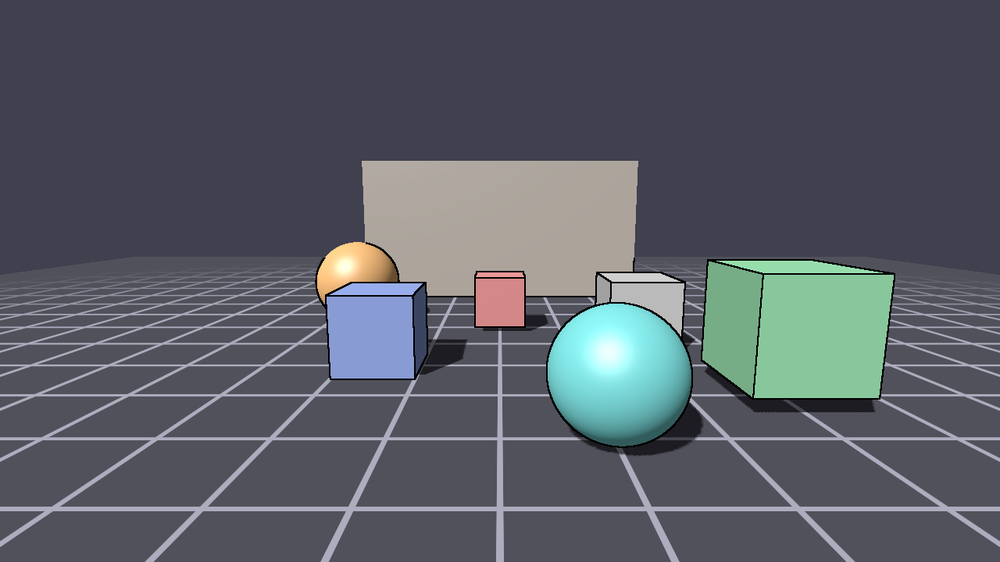
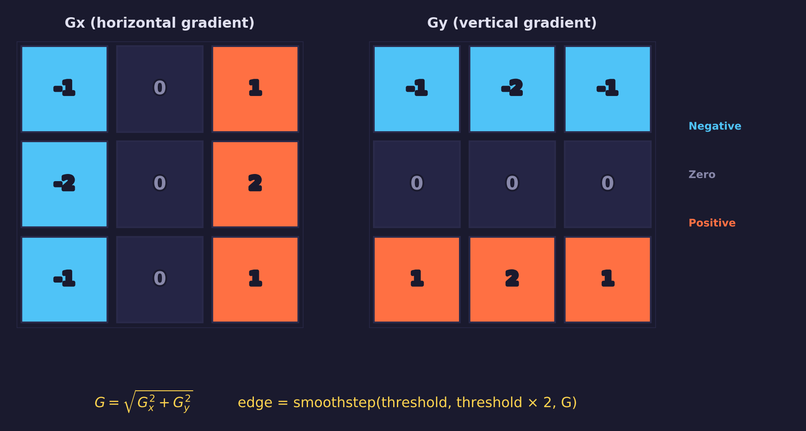
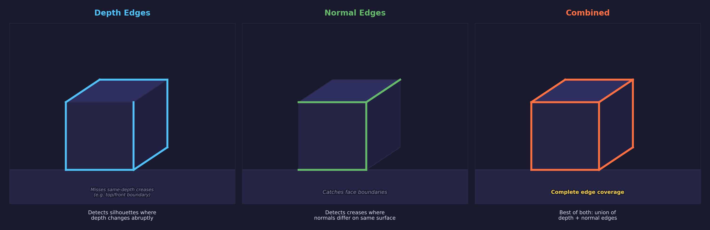
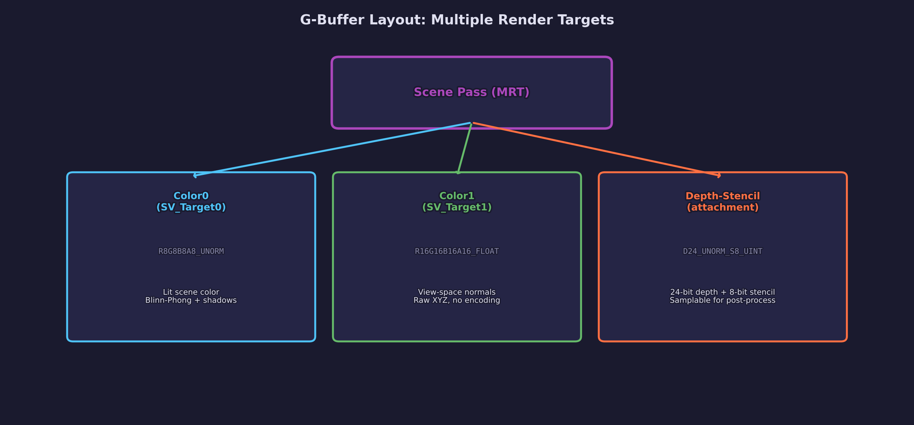
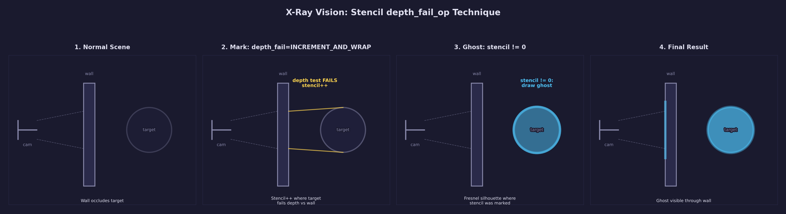
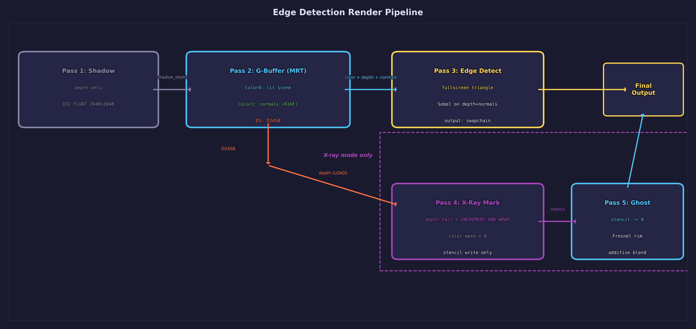
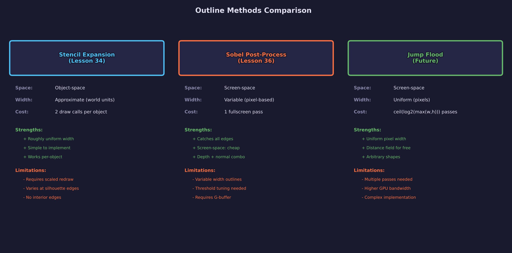

# Lesson 36 — Edge Detection

> **Core concept: post-processing edge detection and stencil X-ray vision.**
> This lesson teaches two outline techniques that read from a G-buffer: Sobel
> edge detection on depth and normal buffers, and stencil-based X-ray vision
> using `depth_fail_op` to reveal objects behind occluders as Fresnel ghost
> silhouettes.

## What you will learn

- G-buffer rendering with Multiple Render Targets (MRT): lit color, view-space
  normals, and depth-stencil in a single pass
- Sobel edge detection using 3×3 convolution kernels on depth and normal buffers
- Fullscreen triangle rendering from `SV_VertexID` (no vertex buffer)
- Stencil-based X-ray vision with `depth_fail_op = INCREMENT_AND_WRAP`
- Fresnel rim lighting for ghost silhouettes with additive blending
- Sky masking to suppress false edges at the far plane
- Five-pass rendering: shadow, G-buffer, edge composite, stencil mark, ghost

## Result



Cubes and spheres sit on a procedural grid floor under directional lighting with
shadow mapping. Black outlines highlight silhouettes and surface discontinuities
detected by the Sobel operator on the G-buffer's depth and normal channels. The
`E` key cycles between depth-only edges, normal-only edges, and a combined mode
that catches both silhouettes and creases. Behind a stone wall, hidden objects
glow with a cyan Fresnel rim effect — visible only through the stencil X-ray
technique that marks pixels where occluded geometry fails the depth test.

## Key concepts

### Sobel edge detection



The Sobel operator detects edges by computing the gradient magnitude of a scalar
or vector field at each pixel. Two 3×3 convolution kernels — Gx (horizontal)
and Gy (vertical) — are applied to a neighborhood of samples. The gradient
magnitude `G = sqrt(Gx² + Gy²)` indicates how rapidly the field changes at that
pixel. High values correspond to edges.

For a depth buffer, the Sobel filter detects silhouette edges where depth values
change sharply — object boundaries against the background, or surfaces at
different distances from the camera. For a normal buffer, it detects surface
orientation changes — creases, hard edges between faces, and curved-to-flat
transitions — even when the depth is continuous.

```hlsl
float sobel_depth(float2 uv)
{
    /* Sample 3x3 neighborhood of raw depth values. */
    float tl = depth_tex.Sample(depth_smp, uv + float2(-texel_size.x,  texel_size.y)).r;
    float tc = depth_tex.Sample(depth_smp, uv + float2( 0.0,           texel_size.y)).r;
    /* ... (6 more samples) ... */

    /* Horizontal and vertical gradients. */
    float gx = -tl - 2.0 * ml - bl + tr + 2.0 * mr + br;
    float gy = -tl - 2.0 * tc - tr + bl + 2.0 * bc + br;

    return sqrt(gx * gx + gy * gy);
}
```

The shader uses **raw hardware depth** values (not linearized). Raw depth varies
smoothly on flat surfaces, which avoids the dark banding artifacts that
linearized depth produces at grazing viewing angles.

### Depth edges vs normal edges



Depth-based and normal-based edge detection each catch different features:

| Source | Catches | Misses |
|--------|---------|--------|
| Depth | Silhouettes, depth discontinuities | Same-depth creases (cube face edges) |
| Normal | Surface angle changes, creases | Smooth depth transitions at silhouettes |
| Combined | Both silhouettes and creases | — |

The combined mode takes the maximum of both edge signals, producing the most
complete outline coverage. The `E` key cycles through all three modes at
runtime.

### Smoothstep thresholding

Raw Sobel magnitude varies continuously. A hard `step()` threshold would
produce thick, blocky edges on curved surfaces where the gradient is gentle.
Instead, a `smoothstep` maps the magnitude to a 0–1 edge intensity with a
smooth falloff:

```hlsl
depth_edge = smoothstep(depth_threshold, depth_threshold * 2.0, depth_edge);
```

The lower bound (`depth_threshold`) defines where the edge starts appearing.
The upper bound (`depth_threshold * 2.0`) defines where it reaches full
intensity. This produces thin, anti-aliased outlines that taper naturally on
curved surfaces.

### Sky masking

The Sobel filter produces false edges wherever geometry borders the sky
(cleared depth = 1.0). To suppress these artifacts, a sky mask checks whether
any sample in the 3×3 neighborhood has a depth value at or near the far plane:

```hlsl
bool is_sky_region(float2 uv)
{
    float sky_threshold = 0.999;
    float center = depth_tex.Sample(depth_smp, uv).r;
    if (center >= sky_threshold) return true;

    /* Check corners — if any neighbor is sky, suppress the edge. */
    float tl = depth_tex.Sample(depth_smp, uv + float2(-texel_size.x,  texel_size.y)).r;
    /* ... */
    return (tl >= sky_threshold || tr >= sky_threshold ||
            bl >= sky_threshold || br >= sky_threshold);
}
```

If any sample is sky, the entire pixel's edge is suppressed. This prevents
outlines from appearing around object silhouettes against the background.

### G-buffer layout



The scene pass writes to three simultaneous outputs using Multiple Render
Targets (MRT):

| Target | Format | Content |
|--------|--------|---------|
| Color 0 | `R8G8B8A8_UNORM` | Lit scene color (Blinn-Phong + shadows) |
| Color 1 | `R16G16B16A16_FLOAT` | View-space normals (float precision, no encoding) |
| Depth-Stencil | `D24_UNORM_S8_UINT` | Hardware depth + 8-bit stencil |

The float16 normal buffer stores view-space normals directly without encoding.
Unlike R8G8B8A8 which requires `normal * 0.5 + 0.5` encoding and loses
precision, the float format preserves full accuracy — important for the Sobel
filter which amplifies small differences.

Both the depth-stencil and normal textures are created with
`SDL_GPU_TEXTUREUSAGE_SAMPLER` so they can be read as shader inputs in the edge
detection and X-ray passes.

### Fullscreen triangle

The edge composite pass uses a fullscreen triangle rendered without a vertex
buffer. The vertex shader generates clip-space positions and UVs from
`SV_VertexID`:

```hlsl
float2 uv = float2((id << 1) & 2, id & 2);
output.clip_pos = float4(uv * 2.0 - 1.0, 0.0, 1.0);
output.uv = float2(uv.x, 1.0 - uv.y);
```

Three vertices (IDs 0, 1, 2) produce an oversized triangle that covers the
entire screen. This avoids the diagonal seam artifact that two-triangle quads
produce at the shared edge, and requires no vertex buffer allocation.

### Stencil X-ray technique



The X-ray technique reveals objects hidden behind occluders using the stencil
buffer in two passes:

**Pass 4 — Mark.** The hidden objects are drawn with depth testing enabled but
depth writing disabled. The stencil operation is configured with
`depth_fail_op = INCREMENT_AND_WRAP`: wherever a fragment of the hidden object
fails the depth test (because the wall is in front), the stencil value at that
pixel is incremented. Color writes are disabled (`color_write_mask = 0`). Cull
mode is `NONE` so both front and back faces contribute to the stencil count.

```c
SDL_GPUStencilOpState mark_stencil = {
    .fail_op       = SDL_GPU_STENCILOP_KEEP,
    .depth_fail_op = SDL_GPU_STENCILOP_INCREMENT_AND_WRAP,
    .pass_op       = SDL_GPU_STENCILOP_KEEP,
    .compare_op    = SDL_GPU_COMPAREOP_ALWAYS,
};
```

**Pass 5 — Ghost.** The same hidden objects are drawn again with a Fresnel rim
shader. The stencil test is `NOT_EQUAL` with reference value 0 — only pixels
where the mark pass incremented the stencil (meaning the object is behind
something) will pass. Depth testing is disabled so the ghost renders regardless
of occlusion. Additive blending (`ONE + ONE`) creates the glowing silhouette.

```c
SDL_GPUStencilOpState ghost_stencil = {
    .fail_op       = SDL_GPU_STENCILOP_KEEP,
    .depth_fail_op = SDL_GPU_STENCILOP_KEEP,
    .pass_op       = SDL_GPU_STENCILOP_KEEP,
    .compare_op    = SDL_GPU_COMPAREOP_NOT_EQUAL,
};
```

This technique works because `depth_fail_op` fires for exactly the pixels
where the object is occluded. The stencil buffer acts as a mask: non-zero
values indicate "something is hidden here," and the ghost pass only renders
where that mask is set.

### Fresnel ghost silhouette

The ghost shader computes a Fresnel rim effect to create glowing edges on the
hidden objects:

```hlsl
float3 N = normalize(input.normal_eye);
float3 V = float3(0.0, 0.0, 1.0); /* view direction in eye space */
float rim = pow(1.0 - abs(dot(N, V)), ghost_power);
float3 color = ghost_color * rim * ghost_brightness;
```

In eye space, the view direction is always (0, 0, 1). The dot product with the
surface normal gives the cosine of the angle between them. Surfaces facing the
camera (`dot ≈ 1`) produce minimal rim effect, while surfaces at grazing angles
(`dot ≈ 0`) produce maximum intensity. The `ghost_power` exponent controls how
quickly the rim falls off — higher values produce thinner, sharper outlines.

## Render pass architecture



The frame renders in up to five GPU passes:

### Pass 1: Shadow (depth-only)

A 2048×2048 `D32_FLOAT` texture captures the scene from the light's view.
All opaque objects are drawn, including X-ray targets (they cast shadows like
any other solid geometry).

- Color target: none
- Depth-stencil: `D32_FLOAT`, CLEAR + STORE
- Cull mode: NONE (with slope-scaled depth bias)

### Pass 2: G-buffer (MRT)

All objects — cubes, spheres, wall, X-ray targets, and grid floor — are drawn
with Blinn-Phong lighting and shadow sampling. Two color targets and a
depth-stencil target are written simultaneously:

- Color target 0: offscreen `R8G8B8A8_UNORM`, CLEAR + STORE (lit scene)
- Color target 1: offscreen `R16G16B16A16_FLOAT`, CLEAR + STORE (view normals)
- Depth-stencil: `D24_UNORM_S8_UINT`, CLEAR + STORE
- Cull mode: BACK (objects), NONE (grid)

### Pass 3: Edge composite

A fullscreen triangle reads the scene color, depth, and normal textures as
samplers. In edge detection mode, the Sobel operator computes edge intensity
and composites black outlines over the scene color. In X-ray mode, the scene
color passes through unmodified. The debug view (`V` key) shows a split-screen
visualization of the raw depth and normal buffers.

- Color target: swapchain, CLEAR + STORE
- Depth-stencil: none
- Fragment samplers: depth (slot 0), normals (slot 1), scene color (slot 2)

### Pass 4: X-ray mark (X-ray mode only)

The X-ray target objects are drawn with depth testing but no depth writing. The
stencil `depth_fail_op` increments wherever the targets are behind the wall.
Color writes are disabled. The existing depth from the G-buffer pass is loaded.

- Color target: swapchain, LOAD + STORE
- Depth-stencil: LOAD depth, CLEAR stencil to 0
- Stencil: ALWAYS, depth_fail_op = INCREMENT_AND_WRAP
- Color write mask: 0

### Pass 5: X-ray ghost (X-ray mode only)

The X-ray targets are drawn again with a Fresnel rim shader. Only pixels where
stencil != 0 pass the test. Additive blending creates the glowing effect.

- Color target: swapchain, LOAD + STORE
- Depth-stencil: LOAD stencil (read-only)
- Stencil: NOT_EQUAL ref=0, write_mask=0x00
- Blend: additive (ONE + ONE)

## Outline method comparison



This project uses two different outline techniques across lessons:

| Property | Stencil Expansion (L34) | Sobel Post-Process (L36) |
|----------|------------------------|--------------------------|
| Space | Object-space | Screen-space |
| Width | Uniform (controllable) | Variable (depends on depth gradient) |
| Coverage | Per-object outlines only | All edges (silhouettes + creases) |
| Cost | Extra draw per outlined object | Single fullscreen pass |
| G-buffer | Not required | Requires depth + normals |

Stencil expansion (Lesson 34) draws each object twice — once at a slightly
larger scale to write stencil, then at normal scale. It produces uniform-width
outlines but only around explicitly drawn objects. Sobel post-processing
(this lesson) runs a single fullscreen pass over the G-buffer and catches
every edge in the scene, including surface creases and depth discontinuities
that stencil expansion misses.

## Pipeline configuration

| Pipeline | Cull | Depth Test | Depth Write | Stencil | Blend | Color Targets |
|----------|------|------------|-------------|---------|-------|---------------|
| shadow | NONE | LESS | yes | off | none | 0 |
| scene | BACK | LESS | yes | off | none | 2 (MRT) |
| grid | NONE | LESS_OR_EQUAL | yes | off | none | 2 (MRT) |
| edge_detect | NONE | off | off | off | none | 1 (swapchain) |
| xray_mark | NONE | LESS | **no** | ALWAYS, dfail=INCR | mask=0 | 1 |
| ghost | NONE | **off** | off | NOT_EQUAL ref=0 | ONE+ONE | 1 (swapchain) |

## Controls

| Key | Action |
|-----|--------|
| 1 | Edge detection mode (Sobel outlines on all geometry) |
| 2 | X-ray mode (stencil ghost vision through the wall) |
| E | Cycle edge source: depth-only → normal-only → combined |
| V | Toggle debug view (raw G-buffer: depth + normals split-screen) |
| W / A / S / D | Move camera forward / left / back / right |
| Mouse | Camera look (click to capture) |
| Space / Left Shift | Move up / down |
| Escape | Release mouse cursor |

## Shaders

| File | Stage | Purpose |
|------|-------|---------|
| `scene.vert.hlsl` | Vertex | MVP transform, world position/normal, light-space coords, view-space normal (MRT) |
| `scene.frag.hlsl` | Fragment | Blinn-Phong + PCF shadow, outputs lit color (Target0) + view normal (Target1) |
| `shadow.vert.hlsl` | Vertex | Light-space MVP for depth-only rendering |
| `shadow.frag.hlsl` | Fragment | Empty (depth-only pass, required by SDL GPU) |
| `grid.vert.hlsl` | Vertex | Grid floor vertex transform with light-space coordinates |
| `grid.frag.hlsl` | Fragment | Procedural grid + shadow, outputs color (Target0) + up normal (Target1) |
| `fullscreen.vert.hlsl` | Vertex | Generates fullscreen triangle from SV_VertexID |
| `edge_detect.frag.hlsl` | Fragment | Sobel on depth/normals, sky mask, edge composite over scene color |
| `xray_mark.vert.hlsl` | Vertex | Minimal MVP (SV_Position only, no interpolants) |
| `xray_mark.frag.hlsl` | Fragment | Empty body (stencil-only pass, color mask = 0) |
| `ghost.vert.hlsl` | Vertex | MVP + model-view for eye-space normals |
| `ghost.frag.hlsl` | Fragment | Fresnel rim lighting for ghost silhouette |

## Building

```bash
cmake -B build
cmake --build build --target 36-edge-detection
./build/lessons/gpu/36-edge-detection/36-edge-detection
```

## Math

This lesson uses the following from `common/math/forge_math.h`:

- **Vectors** — [Math Lesson 01](../../math/01-vectors/) for positions,
  normals, and light directions
- **Matrices** — [Math Lesson 05](../../math/05-matrices/) for model, view,
  projection transforms (`mat4_multiply`, `mat4_translate`, `mat4_scale`,
  `mat4_rotate_y`)
- **Projections** — [Math Lesson 06](../../math/06-projections/) for
  perspective and orthographic projection matrices

## AI skill

This lesson has a matching Claude Code skill at
[`.claude/skills/edge-detection/SKILL.md`](../../../.claude/skills/edge-detection/SKILL.md).
Invoke it with `/edge-detection` or let Claude apply it automatically when edge
detection or stencil X-ray techniques are needed in your project.

## What's next

Lesson 37 introduces **3D picking** — identifying which object is under the
mouse cursor. It renders each object with a unique color ID to an offscreen
target, reads back the pixel under the mouse with `SDL_DownloadFromGPUTexture`,
and highlights the selected object with a stencil outline from Lesson 34.

## Exercises

1. **Edge color tinting** — Replace the black outline color with a
   configurable tint. Add a `float3 edge_color` uniform to the edge detection
   shader and expose a key binding to cycle through colors (black, white, red,
   blue). Observe how different edge colors affect the visual style — dark
   outlines emphasize geometry while bright outlines create a cel-shading look.

2. **Edge thickness control** — Scale the Sobel sample offsets by a
   `float edge_scale` uniform (default 1.0). Larger values sample further
   apart, producing thicker edges. Add key bindings to increase and decrease
   the scale. Note how thick edges on the normal buffer reveal surface
   curvature that thin edges miss.

3. **Depth-adaptive thresholds** — The fixed depth threshold produces
   inconsistent edge widths at different distances. Sample the center depth
   value and scale `depth_threshold` by the depth, so nearby objects get
   thinner edges and distant objects retain visible outlines. Compare the
   result with the fixed-threshold approach.

4. **Multiple X-ray targets** — Add more objects behind the wall at different
   depths. Observe how the stencil increment count varies depending on how
   many front and back faces fail the depth test. Experiment with using the
   stencil value to modulate the ghost brightness — brighter ghosts for objects
   with higher stencil counts indicate objects further behind the occluder.

5. **Animated ghost pulse** — Pass a time uniform to the ghost fragment
   shader and modulate `ghost_brightness` with a sine wave:
   `brightness *= 0.5 + 0.5 * sin(time * 3.0)`. This creates a pulsing glow
   that draws attention to the hidden objects. Combine with the Fresnel rim
   effect for a radar-pulse scanning aesthetic.

## Cross-references

- [GPU Lesson 06 — Depth & 3D](../06-depth-and-3d/): Depth buffer fundamentals
  and depth-stencil texture formats
- [GPU Lesson 12 — Shader Grid](../12-shader-grid/): Procedural grid floor
  pattern with anti-aliasing
- [GPU Lesson 15 — Shadow Maps](../15-cascaded-shadow-maps/): Depth-only
  render pass and PCF shadow sampling
- [GPU Lesson 27 — SSAO](../27-ssao/): Fullscreen triangle technique and
  G-buffer reading patterns
- [GPU Lesson 34 — Stencil Testing](../34-stencil-testing/): Stencil buffer
  operations and stencil expansion outlines
- [GPU Lesson 35 — Decals](../35-decals/): MRT setup, depth format
  negotiation with SAMPLER usage, depth buffer as shader input
