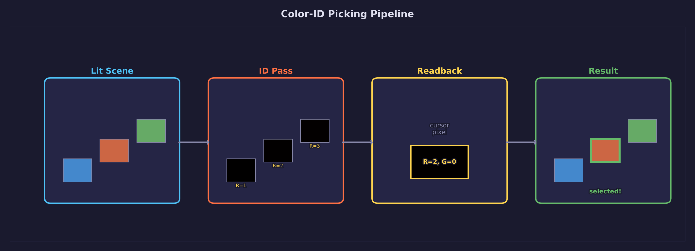
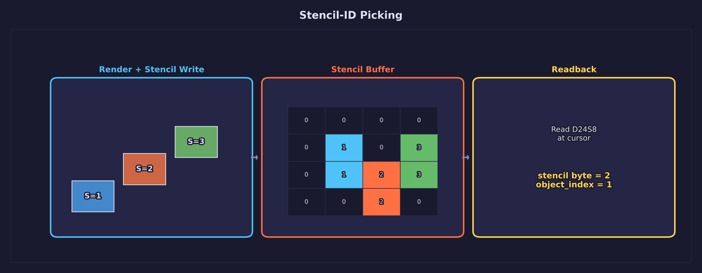
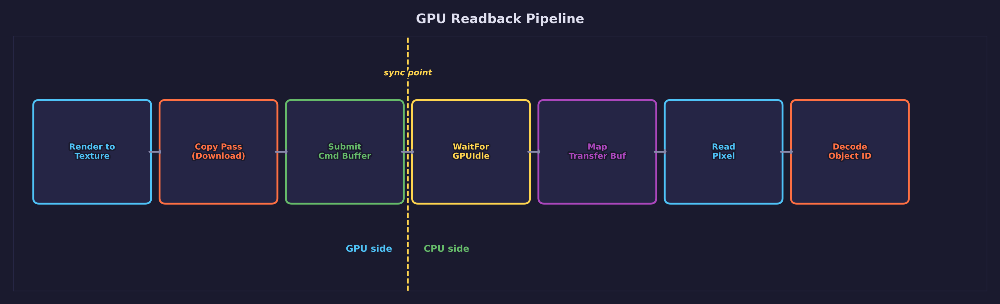
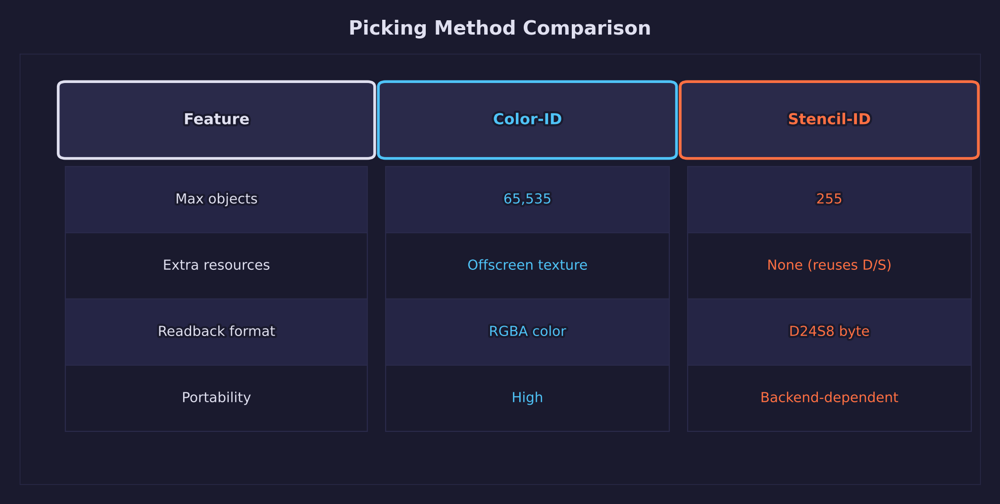
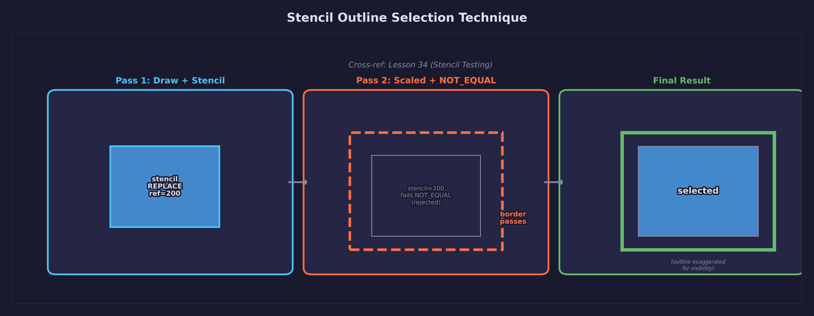
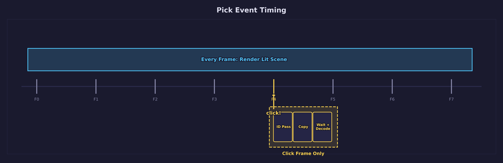

# Lesson 37 — 3D Picking

> **Core concept: GPU-based object selection using color-ID rendering and
> stencil-ID tagging.** This lesson teaches two methods for identifying which
> object the user clicked: rendering each object with a unique flat color to an
> offscreen texture, and stamping per-object stencil reference values during the
> scene pass. Both methods use `SDL_DownloadFromGPUTexture` to transfer a single
> pixel from GPU to CPU for decoding.

## What you will learn

- **Color-ID picking** — render each object with a unique flat color to an
  offscreen texture, read back the pixel under the mouse to identify it
- **Stencil-ID picking** — use per-object stencil reference values as an
  alternative identification method
- **GPU readback** — transfer data from GPU to CPU using
  `SDL_DownloadFromGPUTexture` and transfer buffers
- **Transfer buffer management** — create, map, and read download transfer
  buffers
- **GPU synchronization** — use `SDL_WaitForGPUIdle` to ensure readback data is
  available before reading
- **Selection highlighting** — reuse the stencil outline technique from
  [Lesson 34](../34-stencil-testing/) to highlight picked objects

## Result


A scene with 10 procedural objects (cubes and spheres) on a grid floor with
directional lighting and shadow mapping. Click on any object to select it — the
selected object gets a bright yellow stencil outline. Press Tab to toggle between
color-ID and stencil-ID picking methods. The window title shows the current
method and selected object name.

## Key concepts

- Offscreen color-ID rendering to an `R8G8B8A8_UNORM` texture
- Per-object stencil references for picking during the scene pass
- GPU-to-CPU readback with download transfer buffers
- Synchronization trade-offs when reading back pick results
- Two-pass stencil outlines for selected objects

## Color-ID picking



The most widely used GPU-based picking technique. Instead of computing
ray-geometry intersections on the CPU, render the scene a second time to an
offscreen texture where each object outputs a unique flat color derived from its
index. Reading the pixel at the click position tells you exactly which object is
under the cursor — the GPU's rasterizer handles all the occlusion and
sub-pixel precision for free.

### Assigning unique colors

Each object index maps to a unique RGB color via bit-packing. Index 0 maps to
ID 1 so that background pixels `(0,0,0)` unambiguously mean "no object." The
ID is packed into the R and G channels, supporting up to 65,535 pickable
objects:

```c
/* Convert object index to a unique RGB color for color-ID picking.
 * Index 0 maps to ID 1 (so that background color (0,0,0) means "no object").
 * The ID is packed into R (low 8 bits) and G (high 8 bits), supporting
 * up to 65535 objects. */
static void index_to_color(int index, float *r, float *g, float *b)
{
    int id = index + 1;  /* 1-based so 0 means "nothing" */
    *r = (float)((id >> 0) & 0xFF) / 255.0f;
    *g = (float)((id >> 8) & 0xFF) / 255.0f;
    *b = 0.0f;
}

/* Decode a read-back pixel's RGB values back to an object index.
 * Returns -1 if the pixel is background (no object). */
static int color_to_index(Uint8 r, Uint8 g, Uint8 b)
{
    (void)b;
    int id = (int)r | ((int)g << 8);
    if (id == 0) return -1;
    return id - 1;
}
```

The encoding uses integer bit operations on floating-point values, which
round-trip perfectly through an `R8G8B8A8_UNORM` texture because each 8-bit
channel maps exactly to one of 256 integer values.

### The ID render pass

A separate render pass draws all pickable objects using a simple flat-color
shader. No lighting, no textures, no blending — just a solid per-object color
output. The pass needs its own depth buffer for correct occlusion so that only
the front-most object under the cursor is identified.

The vertex shader transforms positions to clip space with an MVP matrix but
outputs only `SV_Position` — no world-space normals or shadow coordinates are
needed:

```hlsl
cbuffer IdVertUniforms : register(b0, space1)
{
    column_major float4x4 mvp;   /* model-view-projection matrix */
};

struct VSInput
{
    float3 position : TEXCOORD0;   /* vertex attribute location 0 */
    float3 normal   : TEXCOORD1;   /* unused — must match vertex layout */
};

float4 main(VSInput input) : SV_Position
{
    return mul(mvp, float4(input.position, 1.0));
}
```

The fragment shader returns the flat ID color from a uniform buffer:

```hlsl
cbuffer IdFragUniforms : register(b0, space3)
{
    float4 id_color;   /* unique flat color identifying this object */
};

float4 main(float4 pos : SV_Position) : SV_Target
{
    return id_color;
}
```

The offscreen target uses `R8G8B8A8_UNORM` format — not the swapchain format —
because we need a known, portable pixel layout for reliable CPU readback:

```c
/* Color-ID offscreen target — R8G8B8A8 so we can encode object IDs
 * as flat colors and read them back */
SDL_GPUTextureCreateInfo ci;
SDL_zero(ci);
ci.type   = SDL_GPU_TEXTURETYPE_2D;
ci.format = SDL_GPU_TEXTUREFORMAT_R8G8B8A8_UNORM;
ci.width  = WINDOW_WIDTH;
ci.height = WINDOW_HEIGHT;
ci.layer_count_or_depth = 1;
ci.num_levels = 1;
ci.usage  = SDL_GPU_TEXTUREUSAGE_COLOR_TARGET;
state->id_texture = SDL_CreateGPUTexture(device, &ci);
```

The ID pass only runs on click frames, not every frame. This avoids the cost of
an extra scene render during normal gameplay:

```c
if (state->pick_pending && state->picking_method == PICK_COLOR_ID) {
    SDL_GPUColorTargetInfo id_color;
    SDL_zero(id_color);
    id_color.texture  = state->id_texture;
    id_color.load_op  = SDL_GPU_LOADOP_CLEAR;
    id_color.store_op = SDL_GPU_STOREOP_STORE;
    /* Clear to (0,0,0,0) — background pixels decode to "no object" */

    /* ... render each object with its unique ID color ... */

    for (int i = 0; i < OBJECT_COUNT; i++) {
        mat4 model = mat4_multiply(
            mat4_translate(state->objects[i].position),
            mat4_scale_uniform(state->objects[i].scale));
        mat4 mvp = mat4_multiply(cam_vp, model);

        IdVertUniforms id_vert_u;
        id_vert_u.mvp = mvp;
        SDL_PushGPUVertexUniformData(cmd, 0, &id_vert_u, sizeof(id_vert_u));

        /* Encode object index as an RGB color */
        IdFragUniforms id_frag_u;
        float id_r, id_g, id_b;
        index_to_color(i, &id_r, &id_g, &id_b);
        id_frag_u.id_color[0] = id_r;
        id_frag_u.id_color[1] = id_g;
        id_frag_u.id_color[2] = id_b;
        id_frag_u.id_color[3] = 1.0f;
        SDL_PushGPUFragmentUniformData(cmd, 0, &id_frag_u, sizeof(id_frag_u));

        /* Draw the object with its ID color */
        SDL_DrawGPUIndexedPrimitives(pass, idx_count, 1, 0, 0, 0);
    }
}
```

## Stencil-ID picking



An alternative approach that reuses the stencil buffer from the scene pass. Each
object sets a unique stencil reference value (1-based index) using
`SDL_SetGPUStencilReference` before drawing. After the pass, the stencil buffer
contains a per-pixel map of which object covers each pixel. Reading back the
stencil byte under the cursor identifies the object.

This method requires no extra render pass — the stencil values are written
during the normal scene rendering. The trade-off is a maximum of 255 objects
(8-bit stencil) and backend-dependent byte layout when reading back
depth-stencil textures.

### Scene pipeline with stencil writing

The scene stencil pipeline enables stencil testing with `ALWAYS` compare and
`REPLACE` on pass. This writes the reference value to every fragment that
passes depth testing:

```c
pi.depth_stencil_state.enable_stencil_test = true;

/* Stencil: always pass, replace stencil with reference value */
pi.depth_stencil_state.front_stencil_state.fail_op       = SDL_GPU_STENCILOP_KEEP;
pi.depth_stencil_state.front_stencil_state.pass_op       = SDL_GPU_STENCILOP_REPLACE;
pi.depth_stencil_state.front_stencil_state.depth_fail_op = SDL_GPU_STENCILOP_KEEP;
pi.depth_stencil_state.front_stencil_state.compare_op    = SDL_GPU_COMPAREOP_ALWAYS;
pi.depth_stencil_state.back_stencil_state =
    pi.depth_stencil_state.front_stencil_state;
pi.depth_stencil_state.write_mask   = 0xFF;
pi.depth_stencil_state.compare_mask = 0xFF;
```

At draw time, set the reference value per object:

```c
for (int i = 0; i < OBJECT_COUNT; i++) {
    /* Set stencil reference to (i + 1) — 0 is reserved for background */
    SDL_SetGPUStencilReference(pass, (Uint8)(i + 1));

    /* ... push uniforms, bind geometry, draw ... */
}
```

### D24S8 byte extraction

Reading the stencil byte from a `D24_UNORM_S8_UINT` texture is less
straightforward than reading from an RGBA texture. The byte layout within the
4-byte pixel varies by GPU vendor. Most implementations pack 3 bytes of depth
followed by 1 byte of stencil, but some reverse this order. The lesson handles
this with a fallback approach:

```c
/* Extract stencil from D24S8 — byte order varies by vendor */
Uint8 stencil = bytes[3];
int picked = (int)stencil - 1;
if (picked < 0 || picked >= OBJECT_COUNT) {
    /* Fallback: some GPUs pack stencil in byte 0 */
    stencil = bytes[0];
    picked = (int)stencil - 1;
}
state->selected_object =
    (picked >= 0 && picked < OBJECT_COUNT) ? picked : -1;
```

## GPU readback



This is the first time the project transfers data from GPU back to CPU. The
readback pipeline has four stages: download command, submission, wait, and
map/read.

### Transfer buffer creation

A `DOWNLOAD` transfer buffer acts as a CPU-visible staging area for data copied
from GPU textures. For single-pixel picking, we only need 4 bytes (one RGBA
pixel):

```c
SDL_GPUTransferBufferCreateInfo xfer_ci;
SDL_zero(xfer_ci);
xfer_ci.usage = SDL_GPU_TRANSFERBUFFERUSAGE_DOWNLOAD;
xfer_ci.size  = 4;  /* 1 pixel x 4 bytes (RGBA8) */
state->pick_readback = SDL_CreateGPUTransferBuffer(device, &xfer_ci);
```

### The copy pass

`SDL_DownloadFromGPUTexture` copies a region of a GPU texture into the transfer
buffer. It runs inside a copy pass, not a render pass:

```c
SDL_GPUCopyPass *copy = SDL_BeginGPUCopyPass(cmd);

SDL_GPUTextureRegion src_region;
SDL_zero(src_region);
src_region.texture = state->id_texture;  /* or main_depth for stencil-ID */
src_region.x = (Uint32)px;
src_region.y = (Uint32)py;
src_region.w = 1;
src_region.h = 1;
src_region.d = 1;

SDL_GPUTextureTransferInfo dst_info;
SDL_zero(dst_info);
dst_info.transfer_buffer = state->pick_readback;
dst_info.offset = 0;

SDL_DownloadFromGPUTexture(copy, &src_region, &dst_info);
SDL_EndGPUCopyPass(copy);
```

### Wait and read

The download is asynchronous — it executes when the command buffer is submitted.
Before reading the transfer buffer, the CPU must wait for the GPU to finish:

```c
/* Submit the command buffer (includes the copy pass) */
SDL_SubmitGPUCommandBuffer(cmd);

/* Block until all GPU work completes */
SDL_WaitForGPUIdle(state->device);

/* Now safe to map and read the transfer buffer.
 * cycle=false: we are reading back data, not cycling the buffer. */
void *pixel_data = SDL_MapGPUTransferBuffer(
    state->device, state->pick_readback, false);
if (pixel_data) {
    Uint8 *bytes = (Uint8 *)pixel_data;
    int picked = color_to_index(bytes[0], bytes[1], bytes[2]);
    state->selected_object =
        (picked >= 0 && picked < OBJECT_COUNT) ? picked : -1;
    SDL_UnmapGPUTransferBuffer(state->device, state->pick_readback);
}
```

`SDL_WaitForGPUIdle` stalls the CPU until the GPU finishes all submitted work.
This is acceptable for picking because it only happens on click frames — at
most a few times per second. For continuous readback (e.g., hover detection),
you would use double-buffered transfer buffers and fence-based synchronization
to avoid stalling.

## Method comparison



| Feature | Color-ID | Stencil-ID |
|---------|----------|------------|
| Max objects | 65,535 | 255 |
| Extra resources | Offscreen R8G8B8A8 texture + depth | None (reuses scene stencil) |
| Extra render pass | Yes (ID pass on click frames) | No |
| Readback source | Color texture (reliable byte order) | D24S8 (byte order varies by vendor) |
| Portability | High — RGBA8 layout is universal | Backend-dependent stencil byte layout |
| Pixel-perfect accuracy | Yes | Yes |

Color-ID is the recommended approach for most applications. The extra render
pass is cheap because it runs only on click frames, and the RGBA readback is
portable across all GPU backends. Stencil-ID is useful when memory is tight or
you are already using the stencil buffer and can piggyback on the existing pass.

## Selection highlighting



The selected object is highlighted using the two-pass stencil outline technique
from [Lesson 34](../34-stencil-testing/). The outline pass runs in a separate
render pass that loads the existing color and depth but clears the stencil:

**Pass 1 — Outline write:** Redraw the selected object normally using the scene
shader. The pipeline writes `STENCIL_OUTLINE` (200) to the stencil buffer
wherever the object's fragments pass the depth test. This marks the exact
silhouette in the stencil buffer.

**Pass 2 — Outline draw:** Draw the same object scaled up by `OUTLINE_SCALE`
(1.04) using the outline fragment shader (solid yellow). The pipeline uses
`NOT_EQUAL` stencil comparison against `STENCIL_OUTLINE` — only the border ring
between the original and enlarged silhouettes passes, producing the outline:

```c
/* Step 2: scaled-up object with stencil NOT_EQUAL */
mat4 outline_model = mat4_multiply(
    mat4_translate(state->objects[sel].position),
    mat4_scale_uniform(state->objects[sel].scale * OUTLINE_SCALE));
mat4 outline_mvp = mat4_multiply(cam_vp, outline_model);

/* Bright yellow outline color */
OutlineFragUniforms outline_frag_u;
outline_frag_u.outline_color[0] = 1.0f;
outline_frag_u.outline_color[1] = 0.85f;
outline_frag_u.outline_color[2] = 0.0f;
outline_frag_u.outline_color[3] = 1.0f;
```

The stencil reference value of 200 is deliberately high to avoid colliding with
stencil-ID picking values (1-10). If a previous stencil pass used values in the
same range, the outline test would incorrectly reject or pass fragments.

## Pick event timing



The ID pass and readback only run on frames where the user clicked. The sequence
is:

1. **Click event** — `SDL_AppEvent` sets `pick_pending = true` and records the
   mouse coordinates
2. **Shadow pass** — runs every frame (unrelated to picking)
3. **Scene pass** — renders the lit scene; in stencil-ID mode, also writes
   per-object stencil values
4. **ID pass** — runs only if `pick_pending && method == COLOR_ID`; renders flat
   ID colors to the offscreen texture
5. **Copy pass** — downloads the pixel at `(pick_x, pick_y)` from the source
   texture (ID texture or depth-stencil) into the readback transfer buffer
6. **Submit** — submits the command buffer to the GPU
7. **Wait + decode** — `SDL_WaitForGPUIdle` blocks until the copy completes,
   then maps the transfer buffer and decodes the pixel to an object index
8. **Outline pass** — if an object is selected, draws the stencil outline on
   subsequent frames

On non-click frames, phases 4, 5, and 7 are skipped entirely, so picking adds
zero GPU cost when the user is not clicking.

## Controls

| Key | Action |
|-----|--------|
| Left Click | Pick object under cursor / crosshair |
| Tab | Toggle between Color-ID and Stencil-ID picking |
| WASD | Camera movement |
| Mouse | Camera look (when captured) |
| Space / LShift | Move up / down |
| Escape | Release / capture mouse cursor |

## Shaders

| Shader | File | Purpose |
|--------|------|---------|
| `scene.vert.hlsl` | Scene vertex | MVP + world + light-space transforms |
| `scene.frag.hlsl` | Scene fragment | Blinn-Phong lighting with shadow map |
| `shadow.vert.hlsl` | Shadow vertex | Light-space MVP transform |
| `shadow.frag.hlsl` | Shadow fragment | Empty (depth-only pass) |
| `grid.vert.hlsl` | Grid vertex | VP + light VP for floor quad |
| `grid.frag.hlsl` | Grid fragment | Procedural grid with shadow map |
| `id_pass.vert.hlsl` | ID pass vertex | MVP-only transform (no lighting outputs) |
| `id_pass.frag.hlsl` | ID pass fragment | Flat ID color output from uniform |
| `outline.frag.hlsl` | Outline fragment | Solid outline color for selection |
| `crosshair.vert.hlsl` | Crosshair vertex | NDC passthrough for screen overlay |
| `crosshair.frag.hlsl` | Crosshair fragment | Per-vertex color passthrough |

## Building

```bash
cmake --build build --target 37-3d-picking --config Debug
```

## AI skill

This lesson has a matching AI skill at
[`.claude/skills/3d-picking/SKILL.md`](../../../.claude/skills/3d-picking/SKILL.md)
that distills the pattern into a reusable command. Invoke it with
`/forge-3d-picking` in Claude Code to add color-ID picking, stencil-ID picking,
and selection highlighting to any SDL GPU project.

## What's next

[Lesson 38 — Indirect Drawing](../38-indirect-drawing/) moves draw call
decisions to the GPU. Instead of the CPU issuing one draw per object, a compute
shader fills an indirect argument buffer and a single
`SDL_DrawGPUIndexedPrimitivesIndirect` call renders everything — the foundation
for GPU-driven rendering at scale.

## Exercises

1. **Multi-selection** — Hold Shift+Click to toggle objects in and out of a
   selection set. Maintain an array of selected IDs. Draw outlines for all
   selected objects, each in a different color. Shift+Click on an
   already-selected object deselects it.

2. **Hover highlighting** — Run the ID pass every frame (or every N frames) and
   show a subtle hover highlight on whatever object is under the cursor, even
   without clicking. This gives immediate visual feedback before committing to
   a selection. Use a thin, semi-transparent outline or a slight brightness
   boost for the hovered object.

3. **Object info panel** — When an object is selected, display a small UI panel
   showing the object's name, position, scale, and color. Use the UI rendering
   from [Lesson 28](../28-ui-rendering/).

4. **Ray-cast picking comparison** — Implement CPU-side ray-sphere and ray-AABB
   intersection tests as a third picking method. Cast a ray from the camera
   through the mouse pixel using the inverse projection and view matrices, test
   against all object bounding volumes, and find the closest hit. Compare the
   results and performance with GPU-based picking.

5. **Drag to move** — After selecting an object, hold the mouse button and drag
   to move it on the XZ plane. Project the mouse delta into world space using
   the camera's view matrix inverse. The object should follow the cursor
   smoothly along the ground plane.

6. **Pick through transparency** — Add a semi-transparent wall in front of some
   objects. Modify the ID pass to skip transparent objects so you can pick
   objects behind glass. This demonstrates how the ID pass can filter which
   objects are pickable independently of how they appear in the scene pass.
