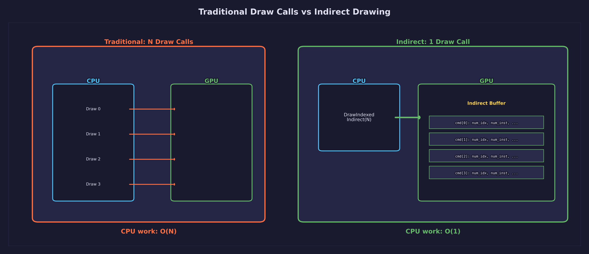
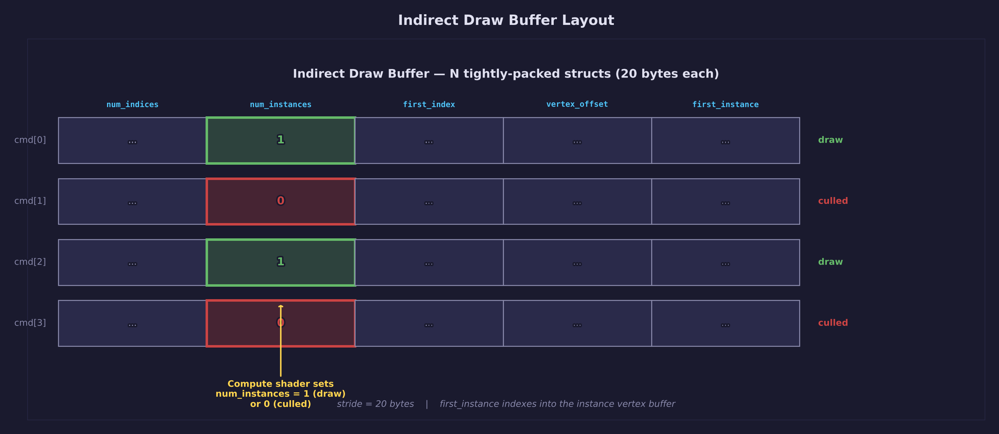
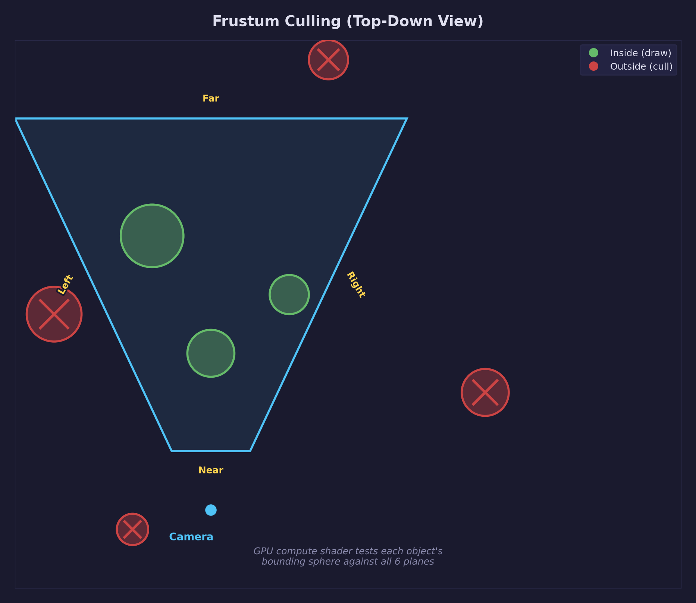
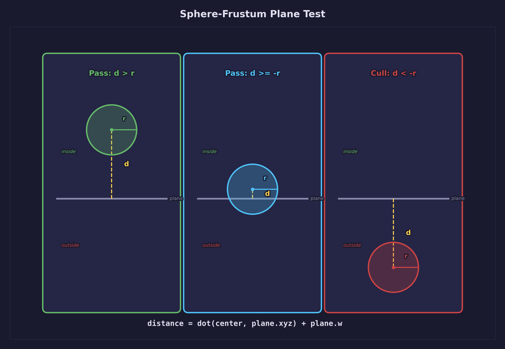
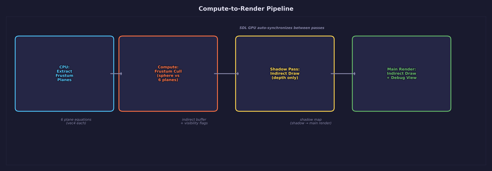
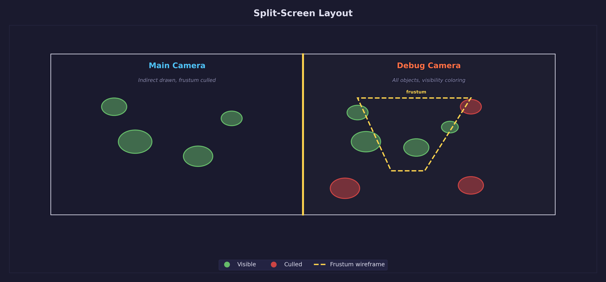

# Lesson 38 — Indirect Drawing

> **Core concept: GPU-driven rendering with
> `SDL_DrawGPUIndexedPrimitivesIndirect`.** A compute shader tests every
> object's bounding sphere against the camera frustum and writes the results
> directly into an indirect draw buffer. The CPU issues a single draw call for
> all 200 objects — the GPU decides which ones are visible.

## What you will learn

- GPU-driven rendering with `SDL_DrawGPUIndexedPrimitivesIndirect`
- Compute shader frustum culling using the Gribb-Hartmann plane extraction method
- Filling indirect draw argument buffers from the GPU
- Per-object storage buffer transforms via the instance vertex buffer pattern
- Sphere-vs-frustum visibility testing
- Dual-camera split-screen debugging with viewport and scissor rectangles
- GPU buffer usage flags for compute/graphics interop

## Result


The left half shows the main camera's view — only visible objects are drawn
via indirect draw calls. The right half shows a fixed overhead camera with all
200 boxes colored green (visible) or red (culled), plus the main camera's
frustum rendered as yellow wireframe lines. A CesiumMilkTruck sits at the
center, drawn with regular draw calls.

## Key concepts

- Indirect drawing lets the GPU read draw commands from a buffer instead of
  receiving them individually from the CPU
- A compute shader writes `num_instances = 0` for culled objects, which the
  hardware skips without producing any fragment work
- The Gribb-Hartmann method extracts six frustum planes from the view-projection
  matrix for sphere-vs-plane culling
- An instance vertex buffer `[0, 1, ..., 199]` provides a portable object ID
  that works across all GPU backends
- SDL GPU handles compute-to-render synchronization automatically — no explicit
  barriers are needed

## The draw-call problem



Traditional rendering requires the CPU to issue one draw call per object.
Each call carries overhead: push uniforms, bind buffers, validate state, and
submit to the driver. For a handful of objects this is negligible. At hundreds
or thousands of objects, the CPU becomes the bottleneck — it cannot feed draw
commands to the GPU fast enough, even when the GPU has capacity to spare.

The root cause is that the CPU decides *what* to draw. Every visibility test,
every uniform push, every draw call happens on the CPU timeline. The GPU sits
idle between calls, waiting for the next command.

Indirect drawing inverts this relationship. The CPU prepares the data — object
transforms, bounding volumes, mesh geometry — and uploads it once. A compute
shader on the GPU performs visibility testing and writes draw commands into a
buffer. The CPU then issues a single `SDL_DrawGPUIndexedPrimitivesIndirect`
call that tells the GPU: "read N draw commands from this buffer and execute
them." The GPU drives its own rendering.

## Indirect drawing



An indirect draw buffer is a GPU buffer containing an array of draw commands.
Each command is a 20-byte struct matching `SDL_GPUIndexedIndirectDrawCommand`:

```c
typedef struct {
    Uint32 num_indices;      /* number of index buffer entries to draw */
    Uint32 num_instances;    /* number of instances (0 = skip this draw) */
    Uint32 first_index;      /* starting index in the index buffer */
    Sint32 vertex_offset;    /* added to each index before fetching vertex data */
    Uint32 first_instance;   /* offset into the instance vertex buffer */
} SDL_GPUIndexedIndirectDrawCommand;  /* 20 bytes */
```

The CPU creates this buffer with the `SDL_GPU_BUFFERUSAGE_INDIRECT` flag (plus
`SDL_GPU_BUFFERUSAGE_COMPUTE_STORAGE_WRITE` so the compute shader can fill it).
At draw time, one call replaces the entire per-object draw loop:

```c
SDL_DrawGPUIndexedPrimitivesIndirect(
    pass,
    state->indirect_buf,     /* buffer of draw commands */
    0,                       /* byte offset into buffer */
    NUM_BOXES                /* number of commands to execute */
);
```

The GPU reads 200 commands from the buffer and executes them in sequence.
Commands with `num_instances = 0` are skipped at the hardware level — they
produce zero work. This is how the compute shader "culls" objects: it writes
`num_instances = 1` for visible objects and `num_instances = 0` for culled ones.

### The instance ID pattern

The indirect draw command includes a `first_instance` field. On some GPU
backends, `SV_InstanceID` (HLSL) or `gl_InstanceIndex` (GLSL) starts counting
from `first_instance`. On others, it always starts from 0. This inconsistency
makes `SV_InstanceID` unusable for indexing into per-object data when
`first_instance` varies across commands.

The portable solution is an **instance vertex buffer**. Create a buffer
containing `[0, 1, 2, ..., 199]` as `uint32` values and bind it as a
per-instance vertex attribute:

```c
/* Create the instance ID buffer: [0, 1, 2, ..., NUM_BOXES-1] */
Uint32 ids[NUM_BOXES];
for (int i = 0; i < NUM_BOXES; i++) ids[i] = (Uint32)i;
/* Upload to a VERTEX buffer... */

/* Pipeline declares slot 1 as per-instance with TEXCOORD3 */
attrs[3].location    = 3;
attrs[3].format      = SDL_GPU_VERTEXELEMENTFORMAT_UINT;
attrs[3].offset      = 0;
attrs[3].buffer_slot = 1;

vb_descs[1].slot       = 1;
vb_descs[1].pitch      = sizeof(Uint32);
vb_descs[1].input_rate = SDL_GPU_VERTEXINPUTRATE_INSTANCE;
```

Each indirect command sets `first_instance = idx`, which offsets into this
buffer. The vertex shader receives `object_id` as a regular attribute
(`TEXCOORD3`) and uses it to index into the per-object storage buffer. This
works identically on Vulkan, D3D12, and Metal.

## Compute shader frustum culling



Before the render pass, a compute shader tests every object against the
camera's view frustum. Objects fully outside the frustum get
`num_instances = 0` in their indirect draw command — the GPU skips them
without producing any fragments.

### Frustum plane extraction (Gribb-Hartmann method)

The Gribb-Hartmann method extracts the six frustum planes directly from the
combined view-projection matrix. Each plane is derived from combinations of
the matrix rows. For a column-major matrix `m` stored as a 16-element array:

```c
/* Left:   row3 + row0 */
planes[0] = { m[3]+m[0], m[7]+m[4], m[11]+m[8], m[15]+m[12] };

/* Right:  row3 - row0 */
planes[1] = { m[3]-m[0], m[7]-m[4], m[11]-m[8], m[15]-m[12] };

/* Bottom: row3 + row1 */
planes[2] = { m[3]+m[1], m[7]+m[5], m[11]+m[9], m[15]+m[13] };

/* Top:    row3 - row1 */
planes[3] = { m[3]-m[1], m[7]-m[5], m[11]-m[9], m[15]-m[13] };

/* Near:   row2 (Vulkan [0,1] depth — NOT row3+row2 as in OpenGL) */
planes[4] = { m[2], m[6], m[10], m[14] };

/* Far:    row3 - row2 */
planes[5] = { m[3]-m[2], m[7]-m[6], m[11]-m[10], m[15]-m[14] };
```

Each plane is normalized by dividing by the length of its `xyz` normal so that
distance calculations produce correct world-space values.

The near plane formula differs between OpenGL and Vulkan conventions.
OpenGL's `[-1, 1]` depth range uses `row3 + row2` for the near plane.
Vulkan's `[0, 1]` depth range (which SDL GPU uses) simplifies to just
`row2`. Using the wrong formula pushes the near plane to the wrong position
and causes incorrect culling.

### Sphere-frustum test



Each object has a bounding sphere defined by a world-space center and radius.
For a unit cube scaled by factor `s`, the bounding sphere radius is
`s * sqrt(3)/2` (half the cube diagonal).

The test evaluates the signed distance from the sphere center to each frustum
plane:

$$
d = \vec{n} \cdot \vec{c} + w
$$

where $\vec{n}$ is the plane normal (xyz components), $\vec{c}$ is the sphere
center in world space, and $w$ is the plane distance (the fourth component).
Three cases arise for each plane:

- **d >= radius** — the sphere is fully on the inside of this plane
- **-radius <= d < radius** — the sphere touches or intersects the plane (conservatively visible)
- **d < -radius** — the sphere is fully outside this plane (cull)

If the sphere is fully outside *any* of the six planes, the object is
invisible. This is a conservative test — it may classify some objects near
frustum corners as visible when they are not, but it never incorrectly culls
a visible object.

```hlsl
bool sphere_vs_frustum(float3 center, float radius) {
    [unroll]
    for (int i = 0; i < 6; i++) {
        float dist = dot(center, frustum_planes[i].xyz) + frustum_planes[i].w;
        if (dist < -radius)
            return false;
    }
    return true;
}
```

### The compute shader

The frustum cull shader runs 64 threads per workgroup, dispatched as
`ceil(200 / 64) = 4` groups. Each thread processes one object:

```hlsl
[numthreads(64, 1, 1)]
void main(uint3 tid : SV_DispatchThreadID) {
    uint idx = tid.x;
    if (idx >= num_objects) return;

    ObjectData obj = objects[idx];
    float3 center = obj.bounding_sphere.xyz;
    float  radius = obj.bounding_sphere.w;

    bool visible = (enable_culling == 0) || sphere_vs_frustum(center, radius);

    IndirectCommand cmd;
    cmd.num_indices    = obj.num_indices;
    cmd.num_instances  = visible ? 1 : 0;
    cmd.first_index    = obj.first_index;
    cmd.vertex_offset  = obj.vertex_offset;
    cmd.first_instance = idx;

    indirect_commands[idx] = cmd;
    visibility[idx]        = visible ? 1 : 0;
}
```

The key line is `cmd.num_instances = visible ? 1 : 0`. A culled object's draw
command remains in the buffer but produces zero instances — the GPU skips it
at the hardware level with no wasted fragment work.

The shader also writes a per-object visibility flag to a separate buffer.
The debug view's fragment shader reads this buffer to color each box green
(visible) or red (culled).

### Register layout

The compute shader uses three storage buffers and one uniform buffer:

| Register | Type | Contents |
|----------|------|----------|
| `t0, space0` | `StructuredBuffer<ObjectData>` | Per-object transforms, bounds, draw args (read-only) |
| `u0, space1` | `RWStructuredBuffer<IndirectCommand>` | Indirect draw commands (read-write) |
| `u1, space1` | `RWStructuredBuffer<uint>` | Visibility flags for debug coloring (read-write) |
| `b0, space2` | `cbuffer CullUniforms` | Frustum planes, object count, culling toggle |

## The compute-to-render pipeline



The per-frame execution follows this sequence:

1. **CPU: Extract frustum planes** — The Gribb-Hartmann method extracts 6
   planes from the main camera's VP matrix on the CPU. These are pushed to
   the compute shader as a uniform buffer.

2. **Compute pass: Frustum cull** — The compute shader reads per-object data
   (transforms, bounding spheres) and the frustum planes. For each object, it
   writes an indirect draw command and a visibility flag. Visible objects get
   `num_instances = 1`; culled objects get `num_instances = 0`.

3. **Shadow pass** — The shadow map render uses the same indirect buffer as
   the main pass. Culled objects are automatically excluded from shadow
   rendering too, avoiding wasted shadow map fragments.

4. **Main render pass** — The left viewport issues
   `SDL_DrawGPUIndexedPrimitivesIndirect` with the compute-filled buffer.
   The right viewport draws all objects with a debug shader that reads the
   visibility buffer for green/red coloring.

SDL GPU automatically synchronizes between the compute and render passes.
The indirect buffer written by the compute shader is guaranteed to be fully
written before the render pass reads it — no explicit barriers are needed.

## Per-object data flow

Each object's transform, color, and bounding sphere are stored in a
`StructuredBuffer` on the GPU. The `ObjectGPUData` struct holds everything
the compute and vertex shaders need:

```c
typedef struct ObjectGPUData {
    float model[16];      /* 4x4 model-to-world matrix (column-major) */
    float color[4];       /* base color multiplier */
    float bsphere[4];     /* xyz = world center, w = radius */
    Uint32 num_indices;   /* index count for this object's mesh */
    Uint32 first_index;   /* starting index in the shared index buffer */
    Sint32 vertex_offset; /* offset added to each index before vertex fetch */
    Uint32 _pad;          /* align to 16 bytes */
} ObjectGPUData;          /* 128 bytes total */
```

The vertex shader needs to know which entry to read for each draw command.
This is where the instance vertex buffer pattern connects everything:

1. The compute shader writes `first_instance = idx` into the indirect command.
2. `first_instance` selects `instance_id_buf[idx]`.
3. The vertex shader receives that value as `object_id` via `TEXCOORD3`.
4. `object_data[object_id]` provides the model matrix and color.

The vertex shader looks up the object's model matrix from the storage buffer
and transforms vertices accordingly:

```hlsl
VSOutput main(VSInput input) {
    ObjectTransform obj = object_data[input.object_id];
    float4x4 model = obj.model;

    float4 world = mul(model, float4(input.position, 1.0));
    output.clip_pos = mul(vp, world);
    output.color    = obj.color;
    /* ... */
}
```

This pattern avoids per-draw uniform pushes entirely. The VP matrix is pushed
once for all 200 objects. Each object's model matrix comes from the storage
buffer, indexed by the instance attribute. The CPU does no per-object work
during the render pass.

## Dual-camera debug view



The debug view provides a bird's-eye perspective of the culling results. It
uses SDL GPU's viewport and scissor rectangle support to render two cameras
side by side in the same render pass.

### Viewport and scissor setup

Each half gets its own viewport and scissor rectangle. The viewport maps NDC
coordinates to a region of the framebuffer. The scissor rectangle clips
fragments outside that region:

```c
/* Left half — main camera */
SDL_GPUViewport left_vp = {
    0, 0,                            /* x, y */
    (float)(sc_w / 2), (float)sc_h,  /* width, height */
    0.0f, 1.0f                       /* min/max depth */
};
SDL_SetGPUViewport(pass, &left_vp);

SDL_Rect left_scissor = { 0, 0, (int)(sc_w / 2), (int)sc_h };
SDL_SetGPUScissor(pass, &left_scissor);

/* Right half — debug camera */
SDL_GPUViewport right_vp = {
    (float)(sc_w / 2), 0,
    (float)(sc_w / 2), (float)sc_h,
    0.0f, 1.0f
};
```

### Frustum wireframe

The debug view draws the main camera's frustum as yellow wireframe lines.
The 8 frustum corners are computed by transforming the NDC cube corners
through the inverse of the main camera's VP matrix:

```c
static void compute_frustum_corners(mat4 inv_vp, vec3 corners[8])
{
    /* NDC corners of the unit cube (Vulkan [0,1] depth) */
    static const vec3 ndc[8] = {
        {-1,-1, 0}, { 1,-1, 0}, { 1, 1, 0}, {-1, 1, 0},  /* near */
        {-1,-1, 1}, { 1,-1, 1}, { 1, 1, 1}, {-1, 1, 1}   /* far  */
    };
    for (int i = 0; i < 8; i++) {
        vec4 clip = { ndc[i].x, ndc[i].y, ndc[i].z, 1.0f };
        vec4 world = mat4_mul_vec4(inv_vp, clip);
        corners[i] = vec3_scale(
            vec3_create(world.x, world.y, world.z),
            1.0f / world.w);
    }
}
```

The 8 corners define 12 edges (4 near, 4 far, 4 connecting), rendered as a
line list with 24 vertices.

### Debug coloring

The debug fragment shader reads the visibility buffer to determine each box's
color:

```hlsl
StructuredBuffer<uint> visibility : register(t0, space0);

float4 main(PSInput input) : SV_Target {
    uint vis = visibility[input.object_id];
    float3 color = vis ? float3(0.2, 0.8, 0.2)    /* green = visible */
                       : float3(0.8, 0.15, 0.15);  /* red   = culled  */
    return float4(color, 1.0);
}
```

## GPU buffer usage flags

Buffers that participate in both compute and graphics passes require
combined usage flags at creation time. These flags determine how SDL GPU
schedules synchronization between passes:

| Buffer | Usage flags | Purpose |
|--------|-------------|---------|
| `object_data_buf` | `COMPUTE_STORAGE_READ` &#124; `GRAPHICS_STORAGE_READ` | Compute reads for culling, vertex shader reads for transforms |
| `indirect_buf` | `INDIRECT` &#124; `COMPUTE_STORAGE_WRITE` | Compute writes draw commands, indirect draw reads them |
| `visibility_buf` | `COMPUTE_STORAGE_WRITE` &#124; `GRAPHICS_STORAGE_READ` | Compute writes flags, debug fragment shader reads them |
| `instance_id_buf` | `VERTEX` | Per-instance object IDs — static, uploaded once |

The `INDIRECT` flag is required for any buffer passed to
`SDL_DrawGPUIndexedPrimitivesIndirect`. Without it, the draw call fails
validation. The `COMPUTE_STORAGE_WRITE` flag on the same buffer tells SDL GPU
that a compute pass writes to it, enabling automatic synchronization before
the render pass reads it.

## Controls

| Key | Action |
|-----|--------|
| WASD / Mouse | Move/look (main camera) |
| Space / LShift | Fly up / down |
| F | Toggle frustum culling on/off |
| V | Toggle debug split-screen view |
| Escape | Release/capture mouse cursor |

## Math

The frustum plane extraction uses the view-projection matrix built from the
math library's quaternion camera functions. The sphere-vs-plane distance
formula is the core of the culling test:

$$
d = \vec{n} \cdot \vec{c} + w
$$

If $d < -r$ for any frustum plane, the sphere of radius $r$ centered at
$\vec{c}$ is fully outside the frustum and can be culled.

Relevant math library functions (`common/math/forge_math.h`):

- `mat4_perspective` — builds the projection matrix
- `mat4_view_from_quat` — builds the view matrix from camera orientation
- `mat4_inverse` — computes the inverse VP for frustum corner extraction
- `mat4_mul_vec4` — transforms NDC corners to world space
- `quat_from_euler` — converts yaw/pitch to camera quaternion

See also:

- [Math Lesson 05 — Matrices](../../math/05-matrices/) — matrix multiplication
  and transforms
- [Math Lesson 06 — Projections](../../math/06-projections/) — perspective
  matrices, clip space, NDC depth ranges

## Building

Compile shaders (required after any HLSL change):

```bash
python scripts/compile_shaders.py 38
```

Build the lesson:

```bash
cmake --build build --target 38-indirect-drawing --config Debug
```

## Shaders

| File | Stage | Purpose |
|------|-------|---------|
| `frustum_cull.comp.hlsl` | Compute | Frustum test per object, fill indirect buffer, write visibility flags |
| `indirect_box.vert.hlsl` | Vertex | MVP transform via storage buffer lookup using instance `object_id` |
| `indirect_box.frag.hlsl` | Fragment | Blinn-Phong lighting with diffuse texture and shadow map |
| `indirect_shadow.vert.hlsl` | Vertex | Light-space transform via storage buffer lookup (shadow pass) |
| `indirect_shadow.frag.hlsl` | Fragment | Empty — depth-only output for shadow map generation |
| `debug_box.vert.hlsl` | Vertex | MVP transform for debug view (all objects, passes `object_id`) |
| `debug_box.frag.hlsl` | Fragment | Reads visibility buffer, outputs green (visible) or red (culled) |
| `frustum_lines.vert.hlsl` | Vertex | MVP transform for frustum wireframe lines |
| `frustum_lines.frag.hlsl` | Fragment | Passthrough per-vertex color (solid yellow) |
| `grid.vert.hlsl` | Vertex | Grid floor — VP and light-space transform |
| `grid.frag.hlsl` | Fragment | Procedural anti-aliased grid with shadow map sampling |
| `truck_scene.vert.hlsl` | Vertex | Standard MVP + world + light-space for truck (non-indirect) |
| `truck_scene.frag.hlsl` | Fragment | Blinn-Phong with diffuse texture and shadow map for truck |

## Cross-references

- [Lesson 11 — Compute Shaders](../11-compute-shaders/) — compute pipeline
  creation, dispatch, `numthreads`, `SV_DispatchThreadID`
- [Lesson 12 — Shader Grid](../12-shader-grid/) — procedural grid
  floor, viewport setup
- [Lesson 13 — Instanced Rendering](../13-instanced-rendering/) — per-instance
  vertex buffers, `SDL_GPU_VERTEXINPUTRATE_INSTANCE`
- [Lesson 15 — Cascaded Shadow Maps](../15-cascaded-shadow-maps/) — depth-only
  shadow pass, shadow map sampling, light-space transforms
- [Lesson 33 — Vertex Pulling](../33-vertex-pulling/) — storage buffers in
  vertex shaders, `StructuredBuffer` register layout
- [Lesson 34 — Stencil Testing](../34-stencil-testing/) — per-object GPU
  state, split render passes
- [Lesson 37 — 3D Picking](../37-3d-picking/) — GPU-to-CPU readback with
  `SDL_DownloadFromGPUBuffer`, transfer buffer management
- [Math Library — `forge_math.h`](../../../common/math/) — `mat4_inverse`,
  `mat4_perspective`, `mat4_view_from_quat`, `quat_from_euler`
- [Math Lesson 06 — Projections](../../math/06-projections/) — perspective
  matrices, clip space, NDC depth ranges

## AI skill

The indirect drawing pattern is available as a reusable skill at
[`.claude/skills/forge-indirect-drawing/SKILL.md`](../../../.claude/skills/forge-indirect-drawing/SKILL.md).
Invoke with `/forge-indirect-drawing` to add GPU-driven indirect rendering
with compute frustum culling to any SDL GPU project.

## Exercises

1. **CPU readback for visible count** — Use `SDL_DownloadFromGPUBuffer` (as
   in [Lesson 37](../37-3d-picking/)) to read back the visibility buffer.
   Sum the flags and display "Visible: 142/200" in the window title via
   `SDL_SetWindowTitle`. Note the one-frame latency from the asynchronous
   readback.

2. **Compacted indirect buffer** — Instead of setting `num_instances = 0` for
   culled objects, add a second compute pass that uses an atomic counter to
   stream-compact the indirect buffer. Write only visible commands
   contiguously to the front of the buffer. Read the counter back to get
   the actual draw count for `SDL_DrawGPUIndexedPrimitivesIndirect`. This
   reduces the number of commands the GPU processes, which matters at high
   object counts.

3. **Animated boxes** — Add a per-frame uniform with time to the compute
   shader and oscillate box positions vertically using
   `sin(time + object_id)`. Update the bounding sphere centers to match. The
   compute shader automatically culls based on updated positions — no changes
   to the culling logic are needed.

4. **Frustum margin (conservative culling)** — Add a padding factor to the
   frustum planes so objects slightly outside the frustum are still drawn.
   This prevents visual popping when objects cross the frustum boundary:
   `if (dist < -(radius + margin)) cull`. Expand the bounding sphere radius
   by 10% or add a fixed margin of 1-2 world units.

5. **Object count stress test** — Increase to 1000, 5000, or 10000 boxes.
   Observe that CPU time remains roughly constant (one indirect draw call)
   while GPU time scales with visible object count. Compare frame times
   with and without frustum culling enabled.

6. **Occlusion culling preview** — As a thought exercise: describe how you
   would extend this system with a hierarchical Z-buffer (HZB) to cull
   objects hidden behind other objects, not just behind the frustum. The HZB
   is built by downsampling the previous frame's depth buffer into a mip
   chain. The compute shader projects each object's bounding sphere to screen
   space, selects the appropriate mip level based on projected size, and
   compares the object's near depth against the HZB value. Objects whose
   nearest point is behind the stored depth are occluded.
