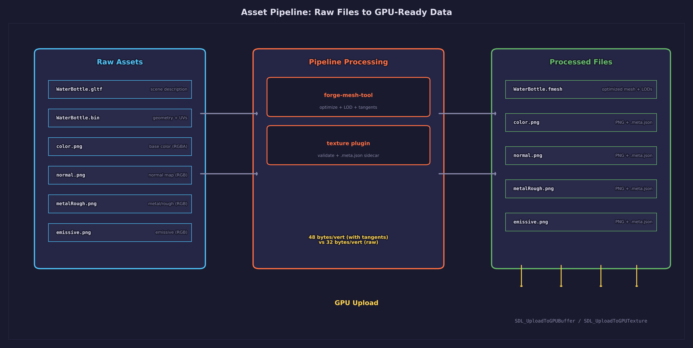
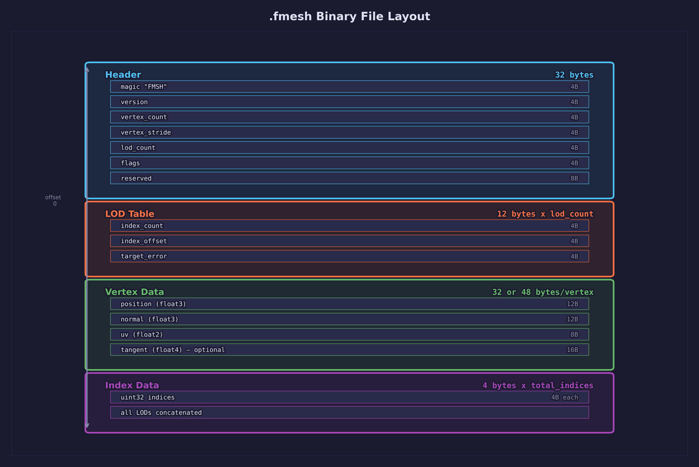
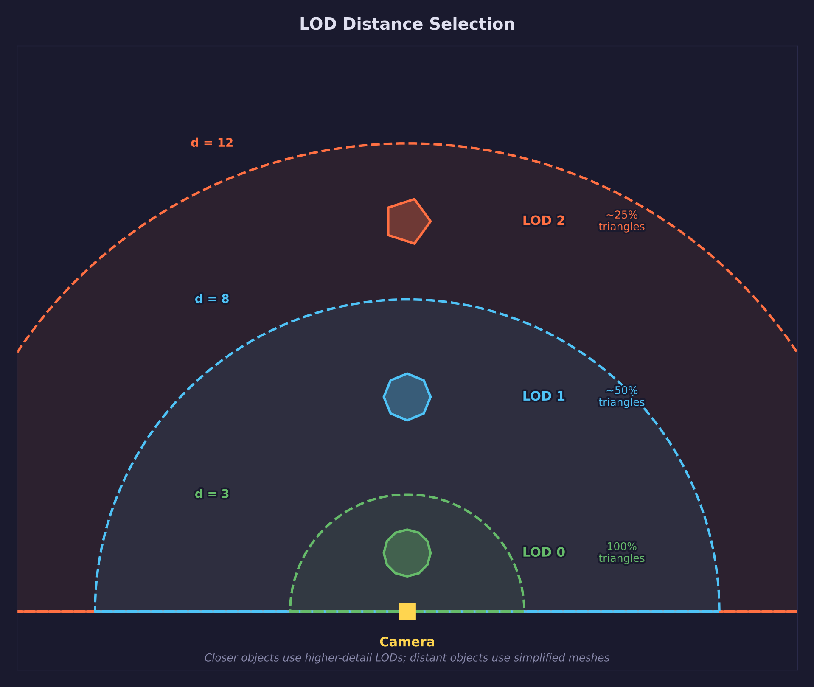
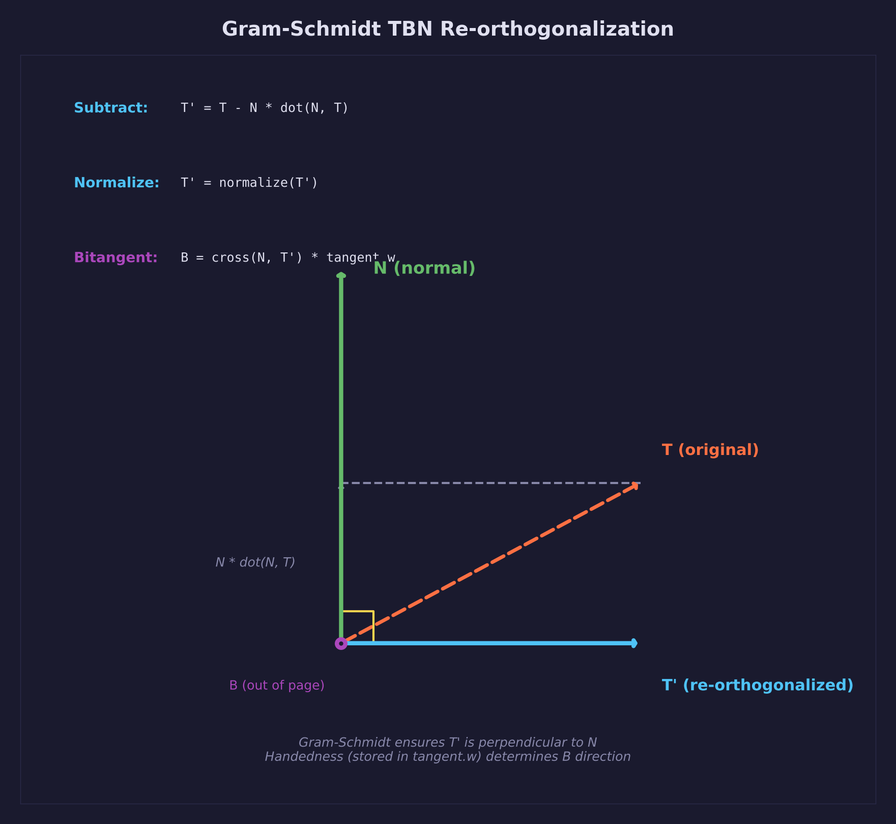
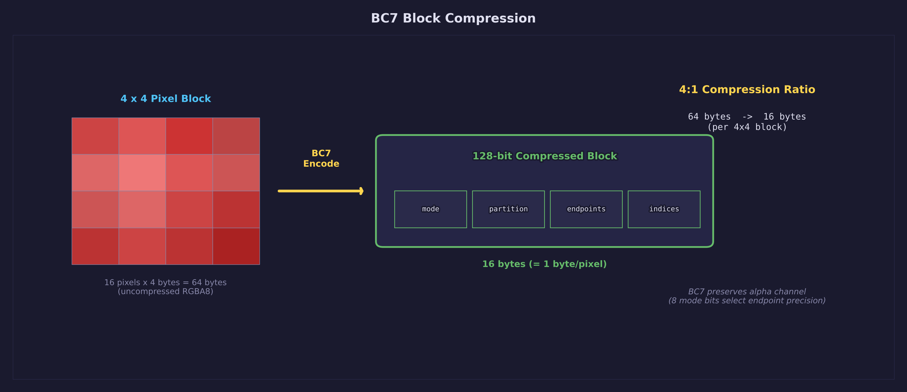
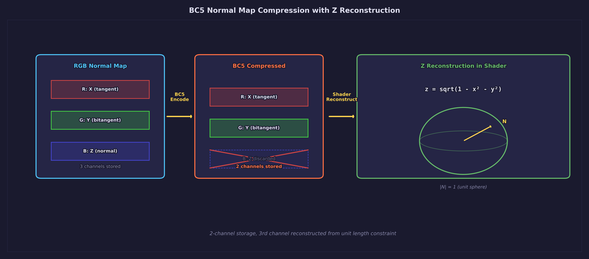

# Lesson 39 — Pipeline-Processed Assets

> **Core concept: loading .fmesh binary meshes and pipeline-processed textures,
> then comparing them against raw glTF+PNG loading in a split-screen view.**
> This is the transition point where forge-gpu starts consuming assets produced
> by its own pipeline instead of loading raw source files at runtime.

## What you will learn

- `.fmesh` binary mesh format with LOD levels
- Pipeline-processed textures via `.meta.json` sidecars
- Dual vertex formats: 48-byte (with tangent) vs 32-byte (without)
- Gram-Schmidt TBN re-orthogonalization for normal mapping
- LOD selection based on camera distance
- Split-screen comparison rendering

## Result


Split-screen mode (the default) renders the WaterBottle and BoxTextured
models through both paths. The left half uses the pipeline path (.fmesh +
processed textures), while the right half uses the raw path (glTF + PNG,
no normal map). WaterBottle shows extra surface detail from its normal map
on the pipeline side, while BoxTextured falls back to a flat normal texture.

## Key concepts

## Pipeline overview



The asset pipeline converts raw source files into optimized runtime formats:

1. **Source assets** — glTF models, PNG textures from content tools
2. **forge-mesh-tool** — reads glTF, generates MikkTSpace tangents, runs
   meshoptimizer for LOD levels, writes `.fmesh` binary
3. **Texture plugin** — validates dimensions, generates `.meta.json` sidecar
   with format and mip-level metadata
4. **Runtime** — `forge_pipeline_load_mesh()` and
   `forge_pipeline_load_texture()` read processed files and upload to the GPU

The raw path bypasses all of this: `forge_gltf_load()` parses `.gltf` JSON
and `.bin` directly, producing 32-byte vertices without tangents.

## .fmesh binary format



The `.fmesh` format is a flat binary file with no internal pointers — it
loads in a single `SDL_LoadFile` call and parses with sequential reads.

| Offset | Size | Field |
|--------|------|-------|
| 0 | 4 | Magic: `FMSH` (ASCII) |
| 4 | 4 | Version (uint32 LE, currently 1) |
| 8 | 4 | vertex_count (uint32 LE) |
| 12 | 4 | vertex_stride (uint32 LE: 32 or 48) |
| 16 | 4 | lod_count (uint32 LE, 1..8) |
| 20 | 4 | flags (uint32 LE, bit 0 = has_tangents) |
| 24 | 8 | reserved (zero padding) |
| 32 | 12 * lod_count | LOD entries |
| ... | vertex_count * vertex_stride | Vertex data |
| ... | sum(lod index counts) * 4 | Index data (uint32 LE) |

Each LOD entry is 12 bytes:

```c
typedef struct ForgePipelineLod {
    uint32_t index_count;  /* number of indices in this LOD level */
    uint32_t index_offset; /* byte offset into the index section */
    float    target_error; /* meshoptimizer simplification error metric */
} ForgePipelineLod;
```

The loaded mesh struct:

```c
typedef struct ForgePipelineMesh {
    void             *vertices;      /* vertex array (cast based on stride) */
    uint32_t         *indices;       /* all LOD indices concatenated */
    uint32_t          vertex_count;
    uint32_t          vertex_stride; /* 32 or 48 */
    ForgePipelineLod *lods;          /* LOD table */
    uint32_t          lod_count;
    uint32_t          flags;         /* FORGE_PIPELINE_FLAG_TANGENTS etc. */
} ForgePipelineMesh;
```

## Vertex formats

The pipeline produces two vertex layouts depending on whether the mesh tool
generated tangent vectors.

**PipelineVertex — 48 bytes** (with tangents, for normal mapping):

```c
typedef struct PipelineVertex {
    float position[3]; /* 12 bytes — model-space position */
    float normal[3];   /* 12 bytes — outward surface normal */
    float uv[2];       /*  8 bytes — texture coordinates */
    float tangent[4];  /* 16 bytes — xyz=tangent, w=bitangent sign (+-1) */
} PipelineVertex;      /* 48 bytes total */
```

**RawVertex — 32 bytes** (no tangents, from raw glTF loading):

```c
typedef struct RawVertex {
    float position[3]; /* 12 bytes */
    float normal[3];   /* 12 bytes */
    float uv[2];       /*  8 bytes */
} RawVertex;           /* 32 bytes total */
```

The 48-byte format carries tangent data produced by MikkTSpace. The tangent
`w` component stores bitangent handedness (+1 or -1), necessary for mirrored
UV layouts. The 32-byte format has no tangent data and cannot do normal
mapping. Each format requires its own graphics pipeline — SDL GPU validates
vertex stride at pipeline creation.

## LOD system



The `.fmesh` file stores multiple LOD levels as separate index arrays sharing
the same vertex buffer. LOD selection uses camera distance with three
thresholds:

- **LOD 0** — full detail, used when the camera is closer than 3 units
- **LOD 1** — medium detail, used between 3 and 8 units
- **LOD 2** — lowest detail, used beyond 8 units

```c
#define LOD_DIST_0  3.0f
#define LOD_DIST_1  8.0f

uint32_t select_lod(const ForgePipelineMesh *mesh, float distance)
{
    if (distance < LOD_DIST_0) return 0;                           /* full detail */
    if (distance < LOD_DIST_1 && mesh->lod_count > 1) return 1;   /* medium */
    if (mesh->lod_count > 2) return 2;                             /* lowest */
    return mesh->lod_count - 1;
}
```

Drawing a specific LOD means binding the shared vertex buffer and calling
`SDL_DrawGPUIndexedPrimitives` with the LOD's index count and first index.
The `.fmesh` LOD struct stores `index_offset` in bytes, so the code converts
to an index offset by dividing: `lod.index_offset / sizeof(uint32_t)`.
No rebinding of vertex data is needed — only the index range changes.

## Normal mapping with Gram-Schmidt TBN



The pipeline vertex shader constructs a tangent-to-world matrix (TBN) for
each vertex. The mesh tool produces per-vertex tangents using the MikkTSpace
algorithm, but after transformation these vectors may lose orthogonality.
Gram-Schmidt re-orthogonalization restores it.

**1. Normal transform via adjugate transpose.** Under non-uniform scale,
transforming a normal by the model matrix breaks perpendicularity. The
adjugate transpose preserves it:

```hlsl
float3x3 m = (float3x3)model;
float3x3 adj_t;
adj_t[0] = cross(m[1], m[2]);
adj_t[1] = cross(m[2], m[0]);
adj_t[2] = cross(m[0], m[1]);
float3 N = normalize(mul(adj_t, input.normal));
```

**2. Tangent transform via model matrix.** Tangent vectors follow geometry
and transform by the model matrix directly:

```hlsl
float3 T = normalize(mul(m, input.tangent.xyz));
```

**3. Gram-Schmidt re-orthogonalization.** N and T are transformed by
different matrices, so they may no longer be perpendicular. Gram-Schmidt
projects out the N component from T to restore orthogonality:

```hlsl
T = normalize(T - N * dot(N, T));
```

**4. Bitangent from cross product with handedness.** `tangent.w` encodes
UV mirroring (+1 or -1). Without this sign, mirrored UVs produce inverted
normal maps:

```hlsl
float3 B = cross(N, T) * input.tangent.w;
```

The fragment shader then uses TBN to transform sampled normal map values from
tangent space to world space for lighting. The raw path has no tangent data
and uses the interpolated vertex normal directly — no normal mapping is
possible. See [Lesson 17 — Normal Maps](../17-normal-maps/) for the full
derivation.

## Block compression

The pipeline code paths support block-compressed textures, though this lesson
ships PNG files as a baseline since block compression tools are not required.



**BC7 for base color textures.** BC7 compresses 4x4 pixel blocks into 16
bytes — a 4:1 ratio over RGBA8. The GPU decompresses in hardware during
texture sampling, often improving overall performance by reducing memory
bandwidth.



**BC5 for normal maps.** Normal maps store unit vectors, so z can be
reconstructed: `z = sqrt(1 - x*x - y*y)`. BC5 stores only the RG channels
at 16 bytes per 4x4 block — a 4:1 reduction over uncompressed RGBA8. The
fragment shader
contains the reconstruction path but uses full RGB for PNG textures in this
lesson. Adding compressed texture support requires basisu or astcenc in the
pipeline — see Exercise 5.

## Code walkthrough

### Pipeline loading path

```c
/* Load .fmesh binary → CPU-side mesh struct */
ForgePipelineMesh mesh;
forge_pipeline_load_mesh("processed/WaterBottle.fmesh", &mesh);

/* Upload vertex data to GPU (48-byte stride with tangents) */
SDL_GPUBuffer *vb = upload_gpu_buffer(device, cmd,
    mesh.vertices, mesh.vertex_count * mesh.vertex_stride,
    SDL_GPU_BUFFERUSAGE_VERTEX);

/* Upload all LOD indices to a single GPU buffer */
SDL_GPUBuffer *ib = upload_gpu_buffer(device, cmd,
    mesh.indices, total_index_bytes,
    SDL_GPU_BUFFERUSAGE_INDEX);

/* Load texture via .meta.json sidecar → decode PNG → upload */
ForgePipelineTexture tex;
forge_pipeline_load_texture("processed/WaterBottle_baseColor.png", &tex);
```

### Raw loading path

```c
/* Load glTF → parse JSON + binary buffer → extract vertices */
ForgeGltfScene scene;
forge_gltf_load("WaterBottle/WaterBottle.gltf", &scene);

/* Upload 32-byte vertices (no tangent data) */
SDL_GPUBuffer *vb = upload_gpu_buffer(device, cmd,
    scene.meshes[0].vertices, vertex_count * sizeof(RawVertex),
    SDL_GPU_BUFFERUSAGE_VERTEX);
```

### Dual pipelines

Both paths share shadow, sky, and grid shaders. The scene shaders differ:
the pipeline path uses 5 vertex attributes (including tangent) and samples a
normal map; the raw path uses 3 attributes and vertex normals only.

### Rendering with mode switching

Keys 1-3 switch between pipeline-only (full viewport, normal mapped),
raw-only (full viewport, vertex normals), and split-screen (scissor rects
divide the viewport, pipeline left, raw right).

## Shaders

| File | Purpose |
|------|---------|
| `scene_pipeline.vert.hlsl` | Pipeline vertex — 48-byte stride, TBN construction, shadow position |
| `scene_pipeline.frag.hlsl` | Pipeline fragment — normal mapping, Blinn-Phong, PCF shadow |
| `scene_raw.vert.hlsl` | Raw vertex — 32-byte stride, world normal output |
| `scene_raw.frag.hlsl` | Raw fragment — Blinn-Phong with vertex normals, PCF shadow |
| `shadow.vert.hlsl` | Shadow depth — light-space transform (depth-only pass) |
| `shadow.frag.hlsl` | Shadow depth — empty (depth-only) |
| `sky.vert.hlsl` | Fullscreen triangle via `SV_VertexID` |
| `sky.frag.hlsl` | Vertical gradient sky |
| `grid.vert.hlsl` | Grid floor quad — passes world position |
| `grid.frag.hlsl` | Procedural anti-aliased grid with shadow and fade |

## Building

Compile shaders first:

```bash
python scripts/compile_shaders.py 39
```

Build the lesson:

```bash
cmake --build build --target 39-pipeline-processed-assets
```

Run:

```bash
./build/lessons/gpu/39-pipeline-processed-assets/39-pipeline-processed-assets
```

## Controls

| Key | Action |
|-----|--------|
| WASD | Move camera |
| Mouse | Look around |
| Space / Shift | Fly up / down |
| 1 | Pipeline-only mode |
| 2 | Raw-only mode |
| 3 | Split-screen comparison |
| L | Cycle LOD level |
| I | Toggle info overlay |
| Escape | Release mouse |

## Cross-references

- [Lesson 08 — Mesh Loading](../08-mesh-loading/) — OBJ mesh loading, vertex
  buffer upload, the raw loading path this lesson compares against
- [Lesson 09 — Scene Loading](../09-scene-loading/) — glTF scene loading with
  `forge_gltf_load()`, the raw path used by the right half of split-screen
- [Lesson 17 — Normal Maps](../17-normal-maps/) — tangent-space normal mapping,
  Gram-Schmidt TBN construction, MikkTSpace tangent generation
- [Lesson 33 — Vertex Pulling](../33-vertex-pulling/) — alternative vertex
  fetch patterns, storage buffers vs vertex attributes
- [Lesson 38 — Indirect Drawing](../38-indirect-drawing/) — split-screen
  viewport/scissor technique reused for the comparison view
- [Asset Lesson 06 — Loading Processed Assets](../../assets/06-loading-processed-assets/)
  — walkthrough of `forge_pipeline.h` and the runtime loading API
- [Math Library — `forge_math.h`](../../../common/math/) — `mat4_perspective`,
  `mat4_view_from_quat`, `quat_from_euler`, quaternion camera pattern

## AI skill

See [`.claude/skills/forge-pipeline-assets/SKILL.md`](../../../.claude/skills/forge-pipeline-assets/SKILL.md)
for the Claude Code skill that automates pipeline asset integration in new
lessons.

## Exercises

1. **Add a third model.** Load the DamagedHelmet glTF through both the
   pipeline and raw paths. Render it alongside the WaterBottle so both models
   are visible in split-screen mode, letting you compare how different
   geometric complexity responds to each loading path.

2. **On-screen LOD statistics.** Display text showing the current LOD level
   and triangle count for the active mesh. Update every frame so the numbers
   change as you cycle through LOD levels with the L key or move the camera.

3. **Wireframe overlay mode.** Add a key toggle that renders the mesh in
   wireframe on top of the shaded surface. This visualizes the triangle
   density at each LOD level — LOD 0 should be noticeably denser than LOD 2.

4. **Smooth LOD blending.** Instead of snapping between LOD levels, render
   both the current and next LOD simultaneously and alpha-blend between them
   over a short distance range. This eliminates the visible pop when crossing
   a LOD boundary.

5. **Compressed textures via Basis Universal.** Integrate basisu into the
   pipeline to encode base color textures as UASTC and normal maps as ETC1S,
   stored in KTX2 containers. Update `forge_pipeline_load_texture()` to detect
   KTX2 format in the `.meta.json` sidecar and transcode to GPU-native BC7
   (base color) or BC5 (normal maps) at upload time.

6. **GPU memory comparison.** Measure and display the GPU memory used by
   pipeline textures vs raw textures. Show the byte counts in the info
   overlay so users can see the concrete difference between compressed and
   uncompressed paths.
