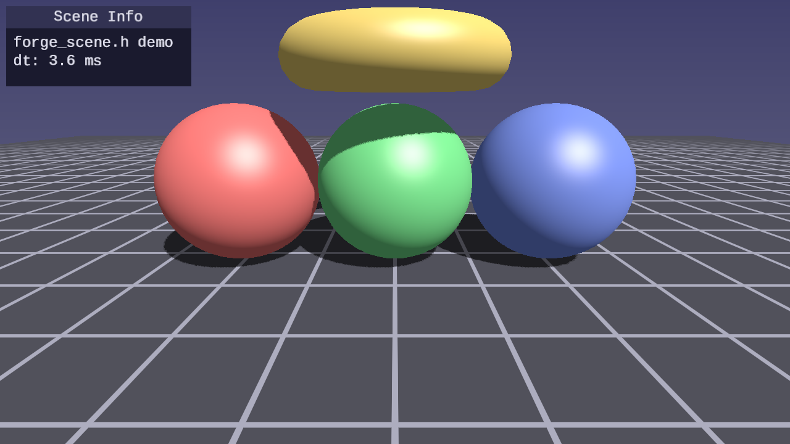
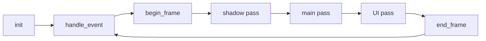

# Lesson 40 — Scene Renderer Library

## What you'll learn

- How to package an entire rendering stack into a reusable header-only library
- The `forge_scene.h` API: init, per-frame lifecycle, shadow/main/UI passes
- How struct-of-arrays geometry (ForgeShape) maps to interleaved GPU vertices
- Using a library to reduce per-lesson boilerplate from ~500 lines to ~10 lines

## Result



Three colored spheres and a rotating golden torus on a grid floor. Directional
shadows, a sky gradient, Blinn-Phong lighting, and a UI info panel — all
rendered with `forge_scene.h` in under 200 lines of application code.

## Key concepts

### Header-only library pattern

`forge_scene.h` follows the same pattern as `forge_shapes.h` and
`forge_pipeline.h`: include the header for declarations, then define
`FORGE_SCENE_IMPLEMENTATION` in exactly one translation unit to pull in the
implementation.

```c
#define FORGE_SCENE_IMPLEMENTATION
#include "scene/forge_scene.h"
```

### Scene lifecycle

The library exposes a frame-oriented API that mirrors SDL's callback
architecture:



Each pass has begin/end functions with draw calls in between:

```c
forge_scene_begin_shadow_pass(s);
    forge_scene_draw_shadow_mesh(s, vb, ib, count, model);
forge_scene_end_shadow_pass(s);

forge_scene_begin_main_pass(s);
    forge_scene_draw_mesh(s, vb, ib, count, model, color);
    forge_scene_draw_grid(s);
forge_scene_end_main_pass(s);
```

### What the library handles

A single `forge_scene_init()` call creates:

- SDL window and GPU device with swapchain
- Depth texture with automatic resize on window change
- Directional shadow map with PCF sampling
- Blinn-Phong scene pipeline (position + normal vertices)
- Procedural anti-aliased grid floor with distance fade
- Fullscreen sky gradient (no vertex buffer needed)
- Quaternion FPS camera with mouse capture and keyboard movement
- Immediate-mode UI with font atlas, alpha blending, and orthographic projection

### Geometry interleaving

`forge_scene.h` uses `ForgeSceneVertex` (position + normal, 24 bytes) for its
built-in pipelines. Since `forge_shapes.h` produces struct-of-arrays data
(separate position and normal arrays), the lesson shows how to interleave them
for GPU upload:

```c
for (int i = 0; i < shape->vertex_count; i++) {
    verts[i].position = shape->positions[i];
    verts[i].normal   = shape->normals[i];
}
```

## Math

This lesson uses:

- **Vectors** — [Math Lesson 01](../../math/01-vectors/) for positions and colors
- **Matrices** — [Math Lesson 05](../../math/05-matrices/) for model transforms
- **Quaternions** — [Math Lesson 08](../../math/08-orientation/) for the FPS camera

## Building

```bash
cmake -B build -DCMAKE_BUILD_TYPE=Debug
cmake --build build --target 40-scene-renderer
python scripts/run.py 40
```

## AI skill

The matching skill at
[`.claude/skills/forge-scene-renderer/SKILL.md`](../../../.claude/skills/forge-scene-renderer/SKILL.md)
teaches Claude Code how to use `forge_scene.h` in new projects. Invoke with:

```text
/forge-scene-renderer
```

## Exercises

1. **Add more shapes** — Use `forge_shapes_cube()` and `forge_shapes_capsule()`
   to populate the scene with additional geometry at different positions.

2. **Animate colors** — Vary each sphere's base color over time using
   `SDL_GetTicks()` and `sinf()` to create a pulsing effect.

3. **Custom pipeline** — Use `forge_scene_create_shader()` to load your own
   shaders alongside the built-in scene pipeline. Draw some objects with the
   default pipeline and others with your custom one.

4. **Multiple light directions** — Modify `ForgeSceneConfig.light_dir` each
   frame to simulate a sun moving across the sky, updating the shadow map
   accordingly.
