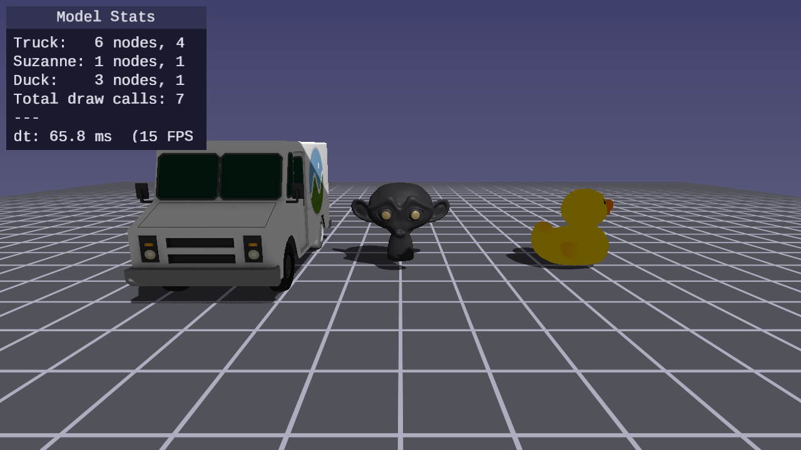

# Lesson 41 — Scene Model Loading

## What you'll learn

- Load pipeline-processed models through `forge_scene.h` (`.fscene` + `.fmesh` + `.fmat`)
- Traverse a scene node hierarchy to render each mesh at its world transform
- Bind per-primitive materials — each submesh uses its own textures and material properties
- Handle mesh instancing — multiple nodes referencing the same mesh (CesiumMilkTruck wheels)
- Select pipeline variants per-submesh based on material properties (opaque, blend, double-sided)
- Use fallback textures for materials missing optional texture slots

## Result



Three models on a grid floor with directional shadows: CesiumMilkTruck (left)
with a textured body, green-tinted glass, dark window trim, and instanced wheels;
Suzanne (center) with baseColor and metallicRoughness textures; Duck (right)
with a single textured material. A UI panel shows per-model stats — node count,
material count, and draw calls.

## Key concepts

### Scene hierarchy traversal

`forge_scene_draw_model` walks every node in the scene graph. Nodes with a
`mesh_index >= 0` contribute draw calls; nodes with `mesh_index == -1` are
transform-only and are skipped. Each node's world transform is pre-composed
with a placement matrix supplied by the caller, so a single call positions
the whole model in the scene.

### Per-primitive material binding

Each submesh carries a `material_index` that selects which textures and
uniform values to bind for that draw call. A single mesh can therefore
reference multiple materials — CesiumMilkTruck's body, glass, and trim are
separate submeshes of the same mesh, each bound to a different material.
The renderer iterates submeshes within a mesh, binding a new material set
before each `SDL_DrawGPUIndexedPrimitives` call.

### Mesh instancing via scene nodes

CesiumMilkTruck contains two wheel nodes that each reference the same
`mesh_index`. The renderer draws that mesh twice with different world
transforms, placing the wheels correctly without duplicating vertex or
index data in GPU memory. This is the standard glTF instancing pattern:
one mesh, many nodes.

### Pipeline variant selection

Not all geometry uses the same graphics pipeline. Materials with
`alpha_mode == BLEND` require a pipeline with alpha blending enabled and
depth writes disabled — drawing them through the opaque pipeline produces
incorrect blending. Double-sided materials disable back-face culling.
`forge_scene_draw_model` inspects each submesh's material and selects the
appropriate variant before issuing the draw call.

### Fallback textures

glTF materials may omit optional texture slots — a material can have a
base color texture but no normal map or emissive map. Missing slots bind
1×1 fallback textures so the shader always has valid sampler bindings:
white (1, 1, 1, 1) for base color, metallic-roughness, and occlusion; a
flat normal (128, 128, 255) for the normal map; black (0, 0, 0, 255) for
emissive (alpha is opaque but the RGB channels contribute nothing). The fallback values are neutral — they do not affect the final
color for materials that legitimately omit those slots.

### ForgeSceneModel API

`forge_scene_load_model` handles the full setup sequence: lazy pipeline
initialization, `.fscene` file loading, GPU buffer upload, and texture
loading with fallback creation. `forge_scene_draw_model` and
`forge_scene_draw_model_shadows` handle the main and shadow passes
respectively. `forge_scene_free_model` releases all GPU resources. The
caller only needs a placement matrix.

```c
ForgeSceneModel truck;
forge_scene_load_model(s, &truck,
                       "assets/CesiumMilkTruck/CesiumMilkTruck.fscene",
                       "assets/CesiumMilkTruck/CesiumMilkTruck.fmesh",
                       "assets/CesiumMilkTruck/CesiumMilkTruck.fmat",
                       "assets/CesiumMilkTruck");

/* Each frame — shadow pass */
forge_scene_begin_shadow_pass(s);
    forge_scene_draw_model_shadows(s, &truck, truck_placement);
forge_scene_end_shadow_pass(s);

/* Each frame — main pass */
forge_scene_begin_main_pass(s);
    forge_scene_draw_model(s, &truck, truck_placement);
    forge_scene_draw_grid(s);
forge_scene_end_main_pass(s);

/* Cleanup */
forge_scene_free_model(s, &truck);
```

## Models used

| Model | Nodes | Materials | Textures | Notes |
|-------|-------|-----------|----------|-------|
| CesiumMilkTruck | 6 | 4 | 1 (shared) | Mesh instancing, solid-color materials |
| Suzanne | 1 | 1 | 2 | baseColor + metallicRoughness |
| Duck | 3 | 1 | 1 | Transform-only root node |

## Building

```bash
cmake --build build --target 41-scene-model-loading
python scripts/run.py 41
```

## Controls

| Key | Action |
|-----|--------|
| WASD | Move camera |
| Mouse | Look around |
| Space / Shift | Fly up / down |
| Escape | Release mouse |

## Cross-references

- [Lesson 09 — Scene Loading](../09-scene-loading/) — glTF scene loading with
  `forge_gltf_load()`, the basis for the `.fscene` format
- [Lesson 39 — Pipeline-Processed Assets](../39-pipeline-processed-assets/) —
  `.fmesh` binary format, `.fmat` material sidecars, vertex layouts, and the
  `forge_pipeline.h` loading API
- [Lesson 40 — Scene Renderer Library](../40-scene-renderer/) — `forge_scene.h`
  init, frame lifecycle, shadow pass, main pass, and UI pass
- [Asset Lesson 07 — Materials](../../assets/07-materials/) — `.fmat` material
  sidecar format and PBR material fields
- [Asset Lesson 09 — Scene Hierarchy](../../assets/09-scene-hierarchy/) —
  forge-scene-tool, `.fscene` node hierarchy extraction from glTF
- [Math Lesson 05 — Matrices](../../math/05-matrices/) — matrix composition
  theory behind `mat4_multiply` and model-view-projection transforms
- [Math Lesson 08 — Orientation](../../math/08-orientation/) — quaternion
  representation and `quat_from_euler` / `quat_forward` / `quat_right`
- [Math Lesson 09 — View Matrix](../../math/09-view-matrix/) — camera
  construction with `mat4_view_from_quat` and view-space transforms
- [Math Library — `forge_math.h`](../../../common/math/) — full math API
  reference

## AI skill

The **`/forge-scene-model-loading`** skill
(`.claude/skills/forge-scene-model-loading/SKILL.md`) encodes this lesson's
patterns — pipeline model loading, per-primitive materials, scene hierarchy
traversal — so Claude Code can apply them to new projects.

## Exercises

1. Add a fourth model to the scene (BoxTextured or another glTF asset from
   `assets/models/`). Process it with forge-mesh-tool and forge-scene-tool,
   copy the outputs into the lesson's `assets/` directory, and load it with
   `forge_scene_load_model`.

2. Animate one of the models — apply a slow rotation to its placement matrix
   in `SDL_AppIterate` using `mat4_rotate_y` with the elapsed time. The shadow
   map will update automatically each frame.

3. Add a second light direction and extend `ForgeSceneModelFragUniforms` with
   a second `light_dir` field. Modify the fragment shader to accumulate
   Blinn-Phong contributions from both directions.

4. Modify the UI panel to also show per-model vertex counts
   (`model.mesh.vertex_count`) and submesh counts (`model.mesh.submesh_count`).
   For total index counts, sum `sub->index_count` across all LOD 0 submeshes.
