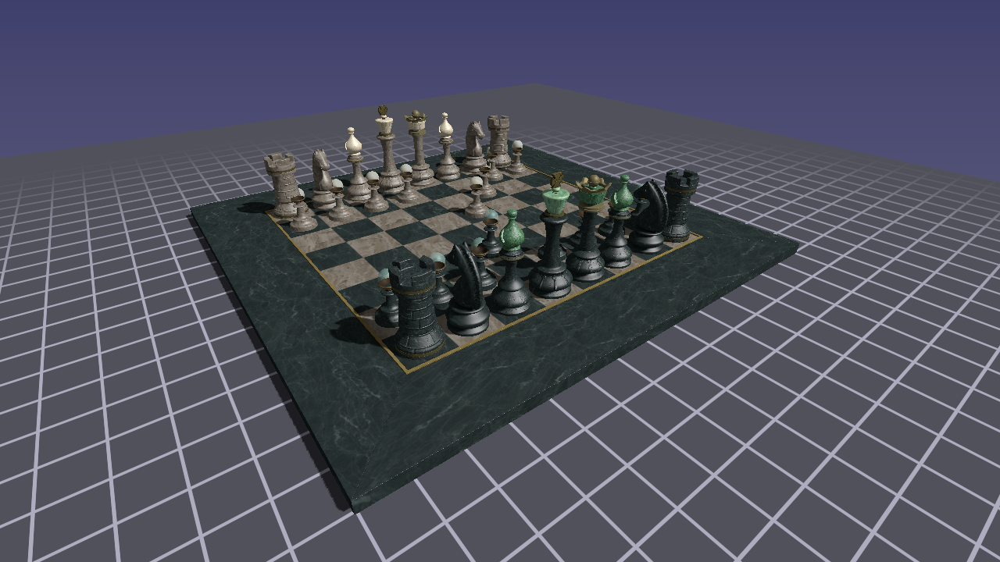

# Lesson 42 — Pipeline Texture Compression

## What you'll learn

- Upload GPU block-compressed textures (BC7, BC5) via the asset pipeline
- Understand the UASTC → BC7/BC5 transcoding pipeline (basisu → KTX2 → .ftex)
- Choose the right compressed format for each texture type (color, normal, linear)
- Handle D3D12 row pitch alignment for compressed texture uploads
- Encode normal maps correctly with the basisu `-normal_map` flag
- Measure VRAM savings — compressed textures use ~4× less memory than RGBA8

## Result



ABeautifulGame — a chess set with 15 PBR materials and 33 textures at
2048×2048. All textures are pre-compressed to BC7 (color, metallic-roughness,
occlusion, emissive) or BC5 (normal maps) at build time. A UI panel shows
VRAM usage, compression ratio, and load timing.

## Key concepts

### Why block compression

An uncompressed RGBA8 texture at 2048×2048 occupies 16 MB (2048 × 2048 × 4
bytes). With a full mip chain (factor of ~4/3), that grows to ~21.3 MB per
texture. Thirty-three textures add up to ~703 MB of VRAM. BC7 and BC5
compress at a fixed 4:1 ratio (1 byte per pixel vs 4), reducing VRAM to
~176 MB — the same visual quality at a quarter of the memory cost.

Block compression is a fixed-ratio format: both BC7 and BC5 compress every
4×4 pixel block to exactly 16 bytes. The GPU hardware decompresses
blocks on the fly during texture sampling — no CPU work at runtime. This is
fundamentally different from PNG/JPEG compression, which is variable-ratio
and requires full CPU decompression before the GPU can use the data.

### The compression pipeline

```text
Build time                               Runtime
──────────                               ───────
texture.jpg                              .meta.json sidecar?
    │                                        │
    ▼                                    yes ▼           no ▼
basisu -uastc -ktx2 -mipmap             load .ftex      SDL_LoadSurface
    │                                    (BC7/BC5        (existing path)
    ▼                                     blocks)
texture.ktx2 (UASTC mips)                   │
    │                                        ▼
    ▼                                    Upload compressed
forge_texture_tool                       blocks to GPU
(UASTC → BC7/BC5)                       via transfer buffer
    │
    ▼
texture.ftex (GPU-ready blocks + mip chain)
texture.meta.json (sidecar with format info)
```

**UASTC** is Basis Universal's high-quality universal intermediate format. It
encodes texture data in a way that can be efficiently transcoded to any GPU
format (BC7, BC5, ASTC, ETC2) without re-reading the source image. The
transcoding step (UASTC → BC7/BC5) runs on the CPU and produces the exact
block layout the GPU expects.

The `.ftex` format is a minimal binary container: a 32-byte header, a 16-byte
entry per mip level (offset, size, width, height), and the raw compressed
blocks concatenated. At runtime, loading an `.ftex` file is a single read
followed by a GPU upload — no parsing, no transcoding, no mip generation.

### Format choices

| Texture type | GPU format | Why |
|---|---|---|
| Base color | `BC7_RGBA_UNORM_SRGB` | 4:1 compression, sRGB color space |
| Emissive | `BC7_RGBA_UNORM_SRGB` | Same as base color |
| Normal map | `BC5_RG_UNORM` | Two-channel (RG), reconstruct Z in shader |
| Metallic-roughness | `BC7_RGBA_UNORM` | Linear data, multi-channel |
| Occlusion | `BC7_RGBA_UNORM` | Linear data |

**BC7** stores all four RGBA channels in 16 bytes per 4×4 block. It has
multiple encoding modes that the compressor selects per-block to minimize
error. sRGB variants (`_SRGB`) tell the GPU to apply gamma decompression
after sampling — use these for color textures that were authored in sRGB
space.

**BC5** stores only two channels (RG) in 16 bytes per 4×4 block, giving
each channel the full encoding budget. Normal maps only need X and Y — the
Z component is reconstructed in the shader:

```hlsl
float2 n_rg = normal_tex.Sample(normal_smp, uv).rg * 2.0 - 1.0;
float3 n = float3(n_rg, sqrt(saturate(1.0 - dot(n_rg, n_rg))));
```

This reconstruction works because normal vectors are unit length:
`x² + y² + z² = 1`, so `z = sqrt(1 - x² - y²)`. The `saturate` clamp
handles minor compression artifacts that could push the value negative.

### Normal map encoding

Normal maps require two basisu flags that are easy to overlook:

```bash
# Color texture — standard sRGB encoding
basisu -uastc -ktx2 -mipmap -file basecolor.jpg

# Normal map — linear encoding with channel rearrangement for BC5
basisu -uastc -ktx2 -mipmap -normal_map -separate_rg_to_color_alpha -file normal.jpg
```

**`-separate_rg_to_color_alpha`** is required for BC5 transcoding. The
Basis Universal BC5 transcoder reads channels 0 (R) and 3 (Alpha) — not
channels 0 (R) and 1 (G). Without this flag, the alpha channel is all 255
(opaque JPEG), so the BC5 texture contains `(correct_X, 1.0)` instead of
`(correct_X, correct_Y)`. The shader reads `.rg` and gets a Y normal
component of 1.0, producing completely wrong lighting — a greenish tint
and broken shadows on curved geometry.

The `-separate_rg_to_color_alpha` flag moves the G channel into alpha
during UASTC encoding, so the BC5 transcoder picks up the correct data.

**`-normal_map`** tells basisu to treat the input as linear data (not
sRGB) and optimize the UASTC encoding for angular error rather than
perceptual color error. Normal map values are direction vectors, not
colors — optimizing for the right error metric produces better quality.

### D3D12 texture upload alignment

D3D12 requires specific alignment for texture upload data:

- **Row pitch** must be aligned to 256 bytes (`D3D12_TEXTURE_DATA_PITCH_ALIGNMENT`)
- **Mip offsets** must be aligned to 512 bytes (`D3D12_TEXTURE_DATA_PLACEMENT_ALIGNMENT`)

For BC7/BC5, each block row is `(width / 4) × 16` bytes. At 2048×2048 (mip 0),
that is `512 × 16 = 8192` bytes — well above 256. But small mip levels fall
below the alignment boundary:

| Mip level | Dimensions | Block rows | Row pitch | Aligned? |
|-----------|-----------|------------|-----------|----------|
| 0 | 2048×2048 | 512 | 8192 | Yes |
| 5 | 64×64 | 16 | 256 | Yes (boundary) |
| 6 | 32×32 | 8 | 128 | **No** |
| 7 | 16×16 | 4 | 64 | **No** |

SDL's D3D12 backend detects unaligned uploads and attempts realignment, but
the fallback path has a bug that causes non-deterministic crashes. The fix
is to pad the data ourselves in the transfer buffer:

```c
/* Align mip offset to 512 bytes */
total_size = (total_size + 511) & ~511;

/* Pad row pitch to 256 bytes */
uint32_t row_pitch = blocks_x * 16;
uint32_t aligned_pitch = (row_pitch + 255) & ~255;
```

Then set `pixels_per_row` on the `SDL_GPUTextureTransferInfo` to match the
padded layout so SDL knows the stride. This is a D3D12-specific requirement —
Vulkan has no such alignment constraint.

### Debugging the D3D12 crash

This lesson's development uncovered a non-deterministic crash that only
occurred on D3D12. The debugging process is instructive:

**Isolating the subsystem.** Commenting out texture loading eliminated the
crash. Loading textures uncompressed (fallback path) also eliminated it.
Loading just one compressed texture still crashed — ruling out resource
exhaustion from 56 rapid uploads.

**Binary search on mip count.** Uploading 6 mip levels never crashed
(mip 5 row pitch = 256, exactly aligned). Uploading 7 mip levels crashed
~50% of the time (mip 6 row pitch = 128, unaligned). This pinpointed the
alignment boundary.

**Cross-backend verification.** The same code never crashed on Vulkan,
confirming the issue was D3D12-specific.

**Reading SDL_Log on Windows.** SDL_Log on Win32 GUI apps goes to
`OutputDebugString`, not stderr. To see log output in the terminal:

```bash
# Redirect stderr to a file
myapp.exe 2>C:\tmp\stderr.txt
```

The D3D12 debug layer's warnings ("Texture upload row pitch not aligned to
256 bytes!") were only visible after this redirect, confirming the root cause.

### Debugging the normal map artifacts

After fixing the crash, the chess pieces showed a greenish tint and broken
shadows — most visible on dark, curved surfaces. The debugging process:

**Isolate by format.** Skipping compressed textures for normal maps only
(force fallback to uncompressed `SDL_LoadSurface`) fixed the lighting
completely. This confirmed the issue was in the normal map compression
pipeline, not the shader or upload code.

**Read the transcoder source.** The Basis Universal BC5 transcoder
hardcodes its two output channels to source channels 0 (R) and 3 (Alpha):

```cpp
// basisu_transcoder.cpp, UASTC BC5 path:
transcode_slice(..., 0, 3, decode_flags);  // chan0=R, chan1=Alpha
```

Without `-separate_rg_to_color_alpha` during encoding, the alpha channel
is all 255 (opaque JPEG). The BC5 texture then stores `(correct_X, 1.0)`
for every texel — the Y normal component is lost entirely.

**Root cause.** The KTX2 files were encoded without
`-separate_rg_to_color_alpha`, so the G channel (Y normal) was never moved
into alpha where the BC5 transcoder expects it. Re-encoding with both
`-normal_map` and `-separate_rg_to_color_alpha` fixed the artifacts.

## Building

```bash
cmake --build build --target 42-pipeline-texture-compression
python scripts/run.py 42
```

## Controls

| Key | Action |
|-----|--------|
| WASD | Move camera |
| Mouse | Look around |
| Space / Shift | Fly up / down |
| Escape | Release mouse |

## Cross-references

- [Lesson 41 — Scene Model Loading](../41-scene-model-loading/) — pipeline
  model loading (`.fscene` + `.fmesh` + `.fmat`), the foundation this lesson
  builds on
- [Lesson 40 — Scene Renderer Library](../40-scene-renderer/) — `forge_scene.h`
  init, frame lifecycle, shadow pass, main pass, and UI pass
- [Asset Lesson 02 — Texture Processing](../../assets/02-texture-processing/) —
  basisu compression, KTX2 format, UASTC vs ETC1S trade-offs
- [Math Lesson 05 — Matrices](../../math/05-matrices/) — matrix transforms
  used in the rendering pipeline
- [Math Library — `forge_math.h`](../../../common/math/) — full math API
  reference

## AI skill

The **`/pipeline-texture-compression`** skill
(`.claude/skills/pipeline-texture-compression/SKILL.md`) encodes this lesson's
patterns — basisu encoding flags, .ftex format, D3D12 alignment, BC5 channel
handling — so Claude Code can apply them to new projects.

## Exercises

1. **Compare VRAM usage.** Modify `forge_scene_load_pipeline_texture` to skip
   .ftex loading (go straight to the fallback path) and compare the UI panel's
   VRAM numbers with the compressed version. The ratio should be close to 4:1.

2. **Visualize normal maps.** Add a debug mode that outputs the normal map
   values as the fragment color (`output.color = float4(n * 0.5 + 0.5, 1.0)`).
   Compare BC5 compressed vs uncompressed to see the compression artifacts.

3. **Try different quality levels.** Re-encode the KTX2 files with basisu
   `-q 64` (lower quality) and `-q 255` (maximum quality). Compare file sizes
   and visual quality. UASTC quality primarily affects the intermediate
   encoding fidelity — after BC7 transcoding, the differences are subtle.

4. **Add ASTC support.** On platforms that support ASTC (mobile GPUs), the same
   UASTC data can be transcoded to ASTC 4×4 instead of BC7. Add a fallback
   path that checks `SDL_GPUTextureSupportsFormat` for ASTC and transcodes
   accordingly.
