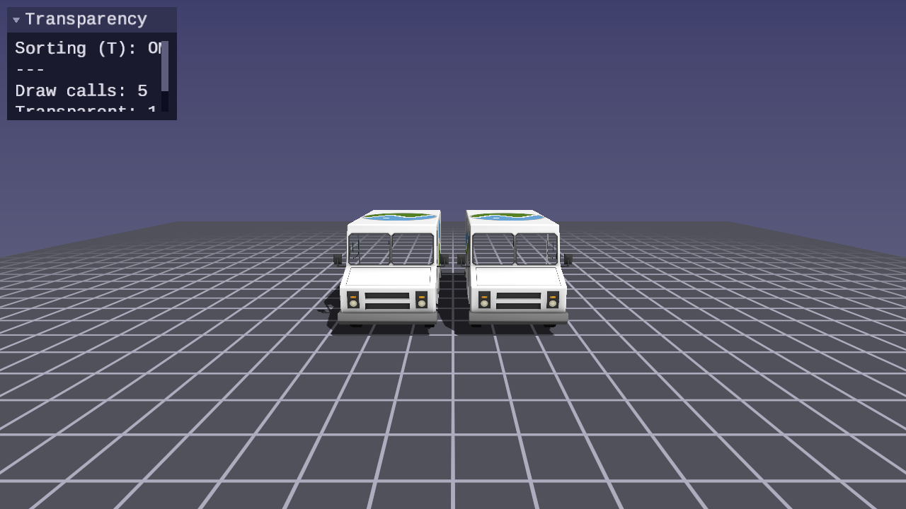

# Lesson 45 — Scene Transparency Sorting

## What you'll learn

- Why transparent objects must be drawn after opaque geometry
- How `forge_scene.h` splits draw calls into opaque and blend passes
- Back-to-front depth sorting using precomputed submesh centroids
- Alpha-masked shadow casting with a separate shadow shader
- How to toggle sorting at runtime to observe order-dependent artifacts

## Result



Two CesiumMilkTruck models with semi-transparent green windshields, rendered
with Blinn-Phong lighting, shadow mapping, and a grid floor. A UI panel shows
draw call counts and a sorting toggle (press **T**).

With sorting **on**, the windshields composite correctly regardless of camera
angle. With sorting **off**, one windshield may render over the other
incorrectly depending on draw order.

## Key concepts

### The transparency problem

Opaque geometry can be drawn in any order — the depth buffer ensures the
closest fragment wins. Transparent geometry breaks this assumption: alpha
blending combines the fragment's color with whatever is already in the
framebuffer, so the result depends on draw order. Drawing a far transparent
surface after a near one produces the wrong color because the near surface's
contribution is already baked into the framebuffer.

### Two-pass draw splitting

`forge_scene_draw_model()` now separates submeshes by alpha mode:

1. **Pass 1 — Opaque and MASK:** Drawn immediately in scene-graph order.
   MASK materials use `alpha_cutoff` to discard fragments below a threshold
   (binary transparency, no blending). These write to the depth buffer
   normally.

2. **Pass 2 — BLEND:** Collected into a `ForgeSceneTransparentDraw` array,
   sorted back-to-front by distance from the camera, then drawn with alpha
   blending enabled and depth writes disabled. Disabling depth writes prevents
   a near transparent surface from occluding a far one.

### Centroid-based depth sorting

Each submesh's object-space centroid is precomputed at model load time by
averaging the positions of all vertices in that submesh. At draw time, the
centroid is transformed to world space and its distance to the camera becomes
the sort key. `SDL_qsort` orders the draws from farthest to nearest.

This is an approximation — it works well for convex submeshes and separated
objects but can fail for large overlapping transparent surfaces. Per-pixel
techniques like order-independent transparency (OIT) solve this at higher cost.

### Alpha-masked shadows

OPAQUE materials cast shadows through the standard depth-only shadow pipeline.
MASK materials need a different approach: the shadow shader must sample the
base color texture and discard fragments below `alpha_cutoff`, or the shadow
will be a solid silhouette instead of matching the cutout shape.

`forge_scene.h` adds a `shadow_mask` pipeline for this: the vertex shader
passes through UVs, the fragment shader samples the base color, multiplies by
`base_color_factor.a`, and calls `discard` if the result is below the cutoff.

BLEND materials do not cast shadows — a semi-transparent surface would need
colored or partial shadows, which is a separate technique.

### The sorting toggle

`ForgeScene` has a `transparency_sorting` field (default `true`). When
disabled, BLEND submeshes are drawn immediately in scene-graph order — the
same behavior as before this lesson. This makes artifacts easy to observe by
pressing **T** at runtime.

## forge_scene.h changes

This lesson extends the scene renderer library:

| Addition | Purpose |
|----------|---------|
| `ForgeSceneTransparentDraw` | Sortable draw command (node, submesh, depth, world matrix) |
| `ForgeSceneShadowMaskFragUniforms` | Fragment uniforms for alpha-masked shadow pass |
| `submesh_centroids[]` on model structs | Precomputed object-space centroids per submesh |
| `transparency_sorting` on `ForgeScene` | Runtime toggle for A/B comparison |
| `model_shadow_mask_pipeline` | Depth + alpha test pipeline for MASK shadows |
| `shadow_mask.vert.hlsl` / `.frag.hlsl` | Shadow shaders that sample base color for alpha test |
| `shadow_mask_skinned.vert.hlsl` | Skinned variant of the mask shadow vertex shader |

Both `ForgeSceneModel` and `ForgeSceneSkinnedModel` draw functions use the
two-pass approach. Both shadow functions support MASK materials.

## Math

This lesson uses:

- **Vectors** — [Math Lesson 01](../../math/01-vectors/) for centroid
  computation and camera distance
- **Matrices** — [Math Lesson 05](../../math/05-matrices/) for world-space
  centroid transformation via `mat4_multiply_vec4`

## Building

```bash
cmake --build build --target 45-scene-transparency-sorting
```

Run from the build output directory so the executable finds its assets:

```bash
# Multi-config generators (Visual Studio, Xcode)
cd build/lessons/gpu/45-scene-transparency-sorting/Debug
./45-scene-transparency-sorting

# Single-config generators (Ninja, Makefiles)
cd build/lessons/gpu/45-scene-transparency-sorting
./45-scene-transparency-sorting
```

## Controls

| Key | Action |
|-----|--------|
| WASD | Move camera |
| Mouse | Look around |
| Space / Shift | Fly up / down |
| Escape | Release mouse cursor |
| T | Toggle transparency sorting on/off |

## Exercises

1. **Add more transparent objects.** Place a third truck rotated 90 degrees so
   its windshield intersects the others. Observe how centroid sorting handles
   (or fails to handle) intersecting transparent geometry.

2. **Visualize sort order.** Tint each transparent submesh a different color
   based on its position in the sorted array. This helps verify that
   back-to-front ordering is correct from the current camera angle.

3. **Cross-model sorting.** The current implementation sorts transparent draws
   within a single `draw_model` call. Collect transparent draws from multiple
   models into a shared array, sort them together, and draw them in one batch.
   This handles cases where transparent submeshes from different models
   interleave in depth.

4. **Weighted blended OIT.** Replace the sorted draw with McGuire and Bavoil's
   weighted blended order-independent transparency. Render all transparent
   geometry in a single pass to an accumulation texture and a revealage
   texture, then composite in a fullscreen pass. Compare the results with
   sorted drawing.
