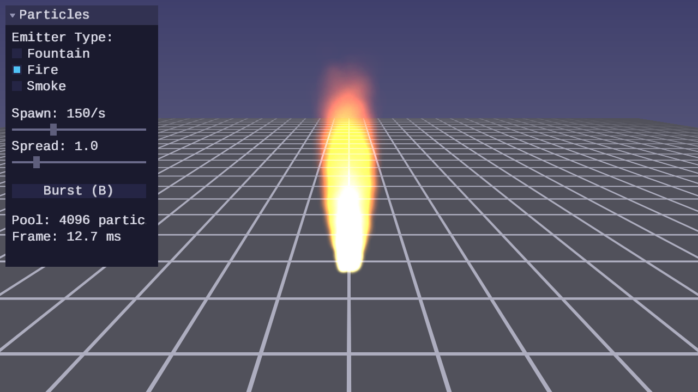
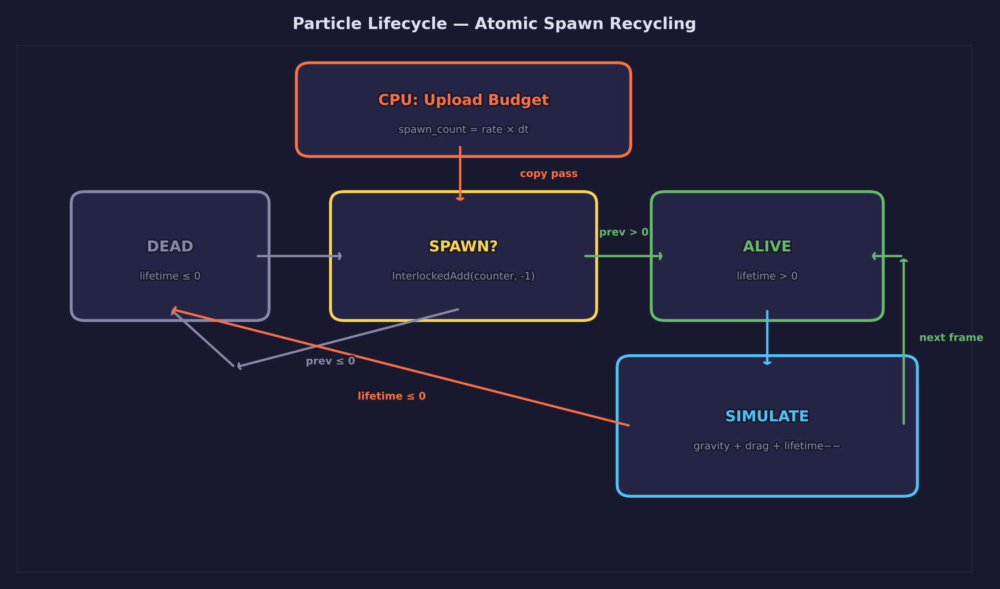
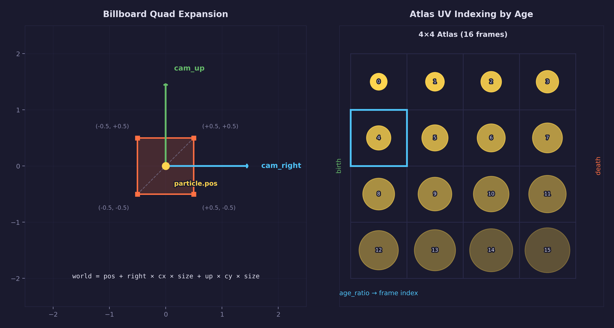
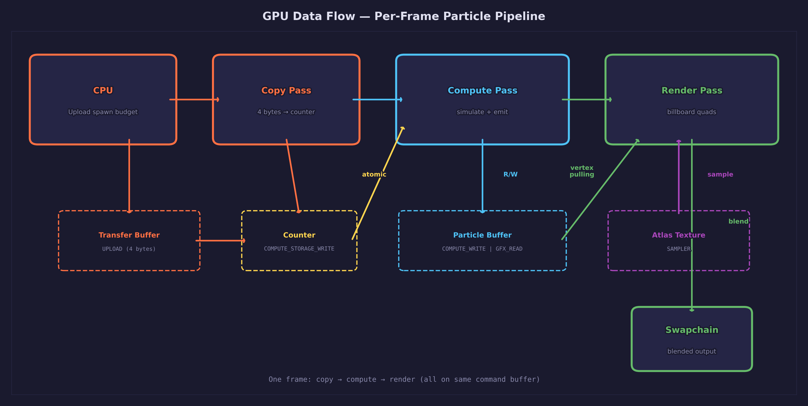

# Lesson 46 — Particle Animations

## What you'll learn

- How to maintain a particle pool entirely on the GPU using a compute shader
- Atomic operations for budget-based particle spawning without CPU readback
- Billboard quad rendering via vertex pulling (no vertex buffers)
- Texture atlas animation indexed by particle age
- Additive blending for fire effects and alpha blending for smoke

## Result




A fire particle effect emits from the grid floor. Particles spawn upward with
turbulence, transition through a yellow-orange-red color ramp, and fade out
over their lifetime. Each particle is a camera-facing billboard quad with
atlas-based animation. A UI panel provides per-emitter controls — gravity and
drag for the fountain, spread for fire, and rise speed, spread, and opacity
for smoke. Switching emitter types instantly re-fills the particle pool.

## Key concepts

### GPU-driven particle system



The entire particle pool lives on the GPU. A compute shader runs once per
frame, processing every particle in parallel. Dead particles attempt to
respawn by atomically decrementing a spawn counter — if budget remains, they
reinitialize with random velocity and position based on the active emitter
type.

This architecture avoids CPU-GPU data transfer for per-particle state. The
CPU only uploads two values per frame: the spawn budget (a single `int32`)
and the simulation uniforms (delta time, gravity, drag, emitter parameters).

### Atomic spawn counter

Each frame, the CPU writes the spawn budget to a 4-byte GPU buffer via a copy
pass. The compute shader's dead-particle threads call `InterlockedAdd` to
atomically decrement this counter. If the previous value was positive, the
thread claims a spawn slot and reinitializes its particle.

```hlsl
int prev;
InterlockedAdd(spawn_counter[0], -1, prev);
if (prev > 0) {
    p = spawn_particle(idx, emitter_type);
}
```

The counter is a **signed** integer. This is critical — using `uint` would
cause the counter to wrap from 0 to 0xFFFFFFFF when threads decrement past
zero, and `prev > 0` would evaluate to `true` for all subsequent threads
(4 billion is greater than zero). With `int`, the counter goes negative and
`prev > 0` correctly rejects further spawns. The CPU resets the counter each
frame.

### Billboard rendering with vertex pulling



Each particle renders as a camera-facing quad (2 triangles, 6 vertices) with
no vertex buffer. The vertex shader reads particle data from a
`StructuredBuffer` using `SV_VertexID`:

```hlsl
uint particle_idx = vid / 6;
uint corner_idx   = vid % 6;

Particle p = particles[particle_idx];
float3 offset = cam_right.xyz * (corner.x * size)
              + cam_up.xyz    * (corner.y * size);
float3 world_pos = center + offset;
```

Dead particles produce degenerate triangles (zero-area) that the GPU's
rasterizer discards at zero cost.

### Texture atlas animation

A procedural 4x4 atlas texture (16 frames) provides the particle shape. Each
frame is a soft Gaussian circle with increasing radius and decreasing
intensity. The vertex shader selects the atlas frame based on the particle's
age ratio:

```hlsl
float age_ratio = 1.0 - (lifetime / max_lifetime);
age_ratio = clamp(age_ratio, 0.0, 0.999);  /* keep frame in [0, 15] */
uint frame = (uint)(age_ratio * 16.0);
uint row = frame / 4;
uint col = frame % 4;
float2 atlas_uv = (float2(col, row) + corner_uv) * 0.25;
```

### Blending modes

Two pipelines with identical shaders but different blend states:

- **Additive** (`src=SRC_ALPHA, dst=ONE`): Colors accumulate, producing
  bright glow effects. Order-independent — no sorting needed. Used for fire
  and fountain particles.
- **Alpha** (`src=SRC_ALPHA, dst=ONE_MINUS_SRC_ALPHA`): Standard
  transparency compositing. Used for smoke. Requires back-to-front sorting
  for correct results, though acceptable visual quality without sorting for
  diffuse volumetric effects.

Both pipelines disable depth writes to prevent transparent particles from
occluding each other, while keeping depth testing enabled so particles behind
opaque geometry are correctly hidden.

### Hash-based pseudo-random numbers

The compute shader uses a Wang hash function seeded by the particle index and
frame counter. This produces decorrelated random values without any persistent
state — each thread computes its own random sequence deterministically.

```hlsl
uint wang_hash(uint seed) {
    seed = (seed ^ 61u) ^ (seed >> 16u);
    seed *= 9u;
    seed = seed ^ (seed >> 4u);
    seed *= 0x27d4eb2du;
    seed = seed ^ (seed >> 15u);
    return seed;
}
```

## Math

This lesson uses concepts from:

- **Vectors** — [Math Lesson 01](../../math/01-vectors/) for positions,
  velocities, and camera direction vectors
- **Matrices** — [Math Lesson 05](../../math/05-matrices/) for the
  view-projection transform

The same physics concepts from
[Physics Lesson 01](../../physics/01-point-particles/) (gravity, drag,
semi-implicit Euler integration) are implemented here on the GPU compute
shader instead of the CPU.

## GPU data flow



## SDL GPU register layout

The lesson uses three shader stages with distinct register conventions:

| Stage | Resource | HLSL Register |
|-------|----------|---------------|
| Compute | RW particle buffer | `u0, space1` |
| Compute | RW spawn counter (int) | `u1, space1` |
| Compute | Uniform buffer | `b0, space2` |
| Vertex | Storage buffer (particles) | `t0, space0` |
| Vertex | Uniform buffer | `b0, space1` |
| Fragment | Atlas texture | `t0, space2` |
| Fragment | Atlas sampler | `s0, space2` |

## Shaders

| File | Stage | Purpose |
|------|-------|---------|
| `particle_sim.comp.hlsl` | Compute | Combined emit + simulate kernel — respawns dead particles via atomic counter, integrates gravity/drag/lifetime |
| `particle.vert.hlsl` | Vertex | Billboard expansion via vertex pulling — reads particles from StructuredBuffer, expands to camera-facing quads |
| `particle.frag.hlsl` | Fragment | Samples atlas texture, multiplies by particle color, outputs for blending |

## Building

```bash
# Compile shaders (HLSL → SPIRV + DXIL + MSL)
python scripts/compile_shaders.py 46

# Build the lesson
cmake --build build --target 46-particle-animations

# Run
./build/lessons/gpu/46-particle-animations/46-particle-animations
```

## Controls

| Key | Action |
|-----|--------|
| WASD / Mouse | Move / look |
| Space / Shift | Fly up / down |
| 1 / 2 / 3 | Fountain / Fire / Smoke emitter |
| B | Burst spawn (1000 particles) |
| Escape | Release mouse cursor |

## AI skill

The [`forge-particle-system`](../../../.claude/skills/forge-particle-system/SKILL.md)
skill (`/forge-particle-system`) distills this lesson into a reusable pattern
for adding GPU-driven particle systems to SDL GPU projects.

## Exercises

1. **Wind force**: Add a wind vector to the compute shader that applies a
   constant horizontal acceleration. Make it adjustable via a UI slider and
   optionally vary it with noise over time.

2. **Ground collision**: Detect when a particle's Y position drops below 0
   (the grid floor) and reflect its velocity with energy loss. This turns
   the fountain into a bouncing ball effect.

3. **Soft particles**: Create a copy of the depth buffer after the opaque
   pass, bind it as a sampler in the particle fragment shader, and fade
   particle alpha based on the distance between the scene depth and the
   particle's depth. This eliminates hard edges where particles intersect
   geometry.

4. **Color curves**: Replace the hardcoded color ramp in `compute_color()`
   with a 1D lookup texture. Sample the texture at the age ratio to get
   the particle color. This lets you create arbitrary color gradients
   without modifying shader code.
