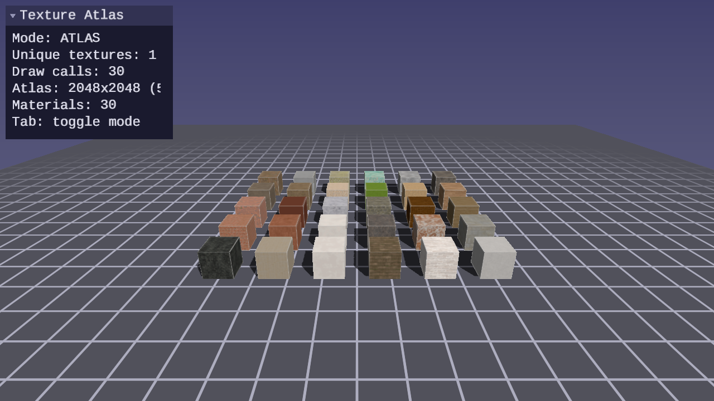
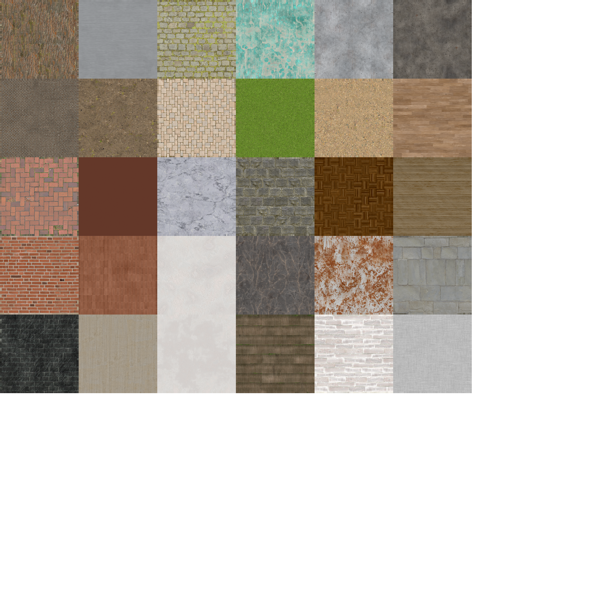
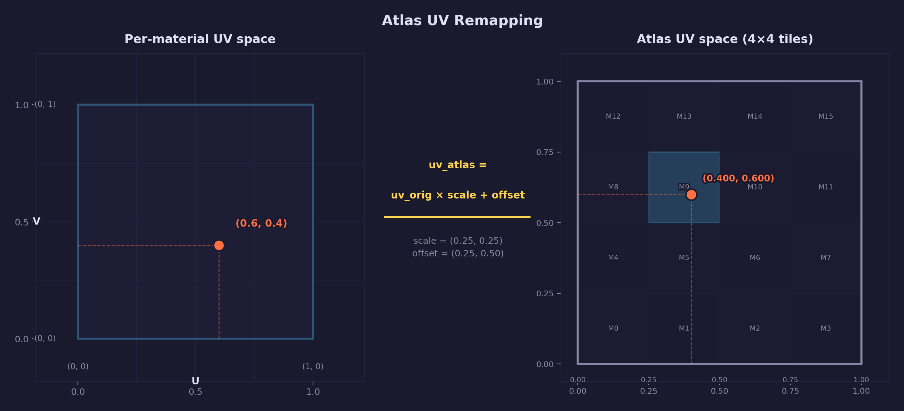

# Lesson 47 — Texture Atlas Rendering

## What you'll learn

- How texture atlases reduce GPU state changes by sharing one texture
- Loading atlas metadata (UV offset/scale per material) with `forge_pipeline.h`
- Batched atlas drawing with `forge_scene_bind_textured_resources()` + `forge_scene_draw_textured_mesh_no_bind()`
- Remapping UVs in the fragment shader with a multiply-add transform
- Comparing atlas rendering vs. individual texture binding

## Result



A 6x5 grid of cubes, each textured with a different material — stone,
wood, metal, brick, concrete, fabric. Press Tab to toggle between atlas
mode (1 unique texture) and individual mode (30 unique textures). The UI
panel displays the difference in real time.

## Key concepts

### Texture atlas

A texture atlas packs multiple smaller textures into a single large
image. Instead of binding a different texture for each material, the
renderer binds the atlas once and remaps each material's UVs to sample
from the correct rectangular region.

[Asset Lesson 17](../../assets/17-texture-atlas/README.md) builds atlases
using guillotine bin packing. This lesson includes a simplified grid-based
generator (`generate_atlas.py`) for its fixed-size material tiles, and
demonstrates consuming the atlas on the GPU side.



### UV remapping

Each material has a rectangular region in the atlas, described by four
values: `u_offset`, `v_offset`, `u_scale`, `v_scale`. The fragment
shader transforms the original per-mesh UVs to atlas-space coordinates:

$$
\text{uv}_{\text{atlas}} = \text{uv}_{\text{original}} \times \text{scale} + \text{offset}
$$



For a material at pixel position (268, 4) in a 2048x2048 atlas with
256x256 texel dimensions:

```text
u_offset = 268 / 2048 = 0.1309
v_offset = 4   / 2048 = 0.0020
u_scale  = 256 / 2048 = 0.1250
v_scale  = 256 / 2048 = 0.1250

original UV (0.5, 0.5) → atlas UV:
  u = 0.5 × 0.1250 + 0.1309 = 0.1934
  v = 0.5 × 0.1250 + 0.0020 = 0.0645
```

### State change reduction

Texture binding is a GPU state change — the driver must update the texture
descriptor before the next draw call can sample from a different texture.
In a scene with N materials:

- **Individual mode**: N different textures bound across the frame
- **Atlas mode**: 1 texture bound for the entire frame — every material
  is a region within that single texture

The atlas converts N texture switches into N uniform pushes (the UV
transform selecting each region). Uniform pushes are cheaper because
they update a small constant buffer rather than swapping a texture
descriptor.

### Atlas metadata format

The pipeline's atlas plugin writes `atlas.json` with per-material
entries:

```json
{
  "version": 1,
  "width": 2048,
  "height": 2048,
  "padding": 4,
  "utilization": 0.499,
  "entries": {
    "bark": {
      "x": 4, "y": 4, "width": 256, "height": 256,
      "u_offset": 0.002, "v_offset": 0.002,
      "u_scale": 0.125, "v_scale": 0.125
    }
  }
}
```

The C loader (`forge_pipeline_load_atlas()` in `forge_pipeline.h`)
parses this into a `ForgePipelineAtlas` struct with an array of
`ForgePipelineAtlasEntry` values.

### Tradeoffs

Atlas packing introduces constraints that individual textures avoid:

- **No tiling**: UVs outside [0,1] wrap to adjacent materials, not the
  same texture. Clamp-to-edge sampling prevents this but disables tiling.
- **Mipmap bleeding**: At lower mip levels, bilinear filtering samples
  across material boundaries. Padding mitigates this but halves at each
  mip level.
- **Resolution uniformity**: All materials share the atlas resolution
  budget. A material that needs 1K detail and one that needs 64px both
  occupy space proportionally.

## forge_scene.h integration

This lesson uses a textured Blinn-Phong pipeline added to `forge_scene.h`.
The scene library handles vertex layout, shader binding, shadow map sampling,
and lighting. Each draw call receives a `uv_transform` parameter to select
the correct atlas region:

- **Atlas mode**: `forge_scene_bind_textured_resources()` binds the atlas
  texture and pipeline once, then `forge_scene_draw_textured_mesh_no_bind()`
  draws each cube with only a UV transform change — 1 bind for 30 cubes
- **Individual mode**: `forge_scene_draw_textured_mesh()` binds each cube's
  own texture; `uv_transform` is identity `(0, 0, 1, 1)`

The textured shaders (`scene_textured.vert.hlsl`, `scene_textured.frag.hlsl`)
live in `common/scene/shaders/` alongside the other scene baseline shaders.

## Building

```bash
cmake --build build --target 47-texture-atlas-rendering
```

To regenerate the atlas from the raw material textures:

```bash
uv run python lessons/gpu/47-texture-atlas-rendering/generate_atlas.py
```

## AI skill

The [`forge-atlas-rendering`](../../../.claude/skills/forge-atlas-rendering/SKILL.md)
skill (`/forge-atlas-rendering`) encapsulates this lesson's patterns for
atlas-based texture rendering. Copy it into your own project to add atlas
rendering support.

## What's next

Texture atlases are one approach to reducing texture bind overhead. Texture
arrays (`SDL_GPU_TEXTURETYPE_2D_ARRAY`) offer another — each material gets
its own layer, avoiding UV remapping at the cost of uniform layer dimensions.
Bindless texturing eliminates bind calls entirely by passing texture handles
through a buffer.

## Exercises

1. **Per-slot atlases**: Instead of one atlas for albedo only, create
   separate atlases for normal maps and metallic-roughness maps. All
   three atlases share the same UV layout, so the same offset/scale
   values work for every texture slot.

2. **Atlas mipmap bleeding visualization**: Add a slider that forces a
   specific mip level (`SampleLevel` in HLSL). At mip 0 the atlas looks
   correct; at mip 3+ you can see color bleeding between adjacent
   materials where the padding has been consumed.

3. **Dynamic atlas updates**: Modify the atlas at runtime by uploading a
   new sub-region with `SDL_UploadToGPUTexture`. Replace one material's
   region with a procedurally generated pattern (checkerboard, gradient)
   without rebuilding the entire atlas.

4. **Texture array comparison**: Instead of a 2D atlas with UV
   remapping, load each material as a layer in a 2D texture array
   (`SDL_GPU_TEXTURETYPE_2D_ARRAY`). Compare the approaches: arrays
   avoid UV remapping but require all layers to share dimensions;
   atlases allow mixed sizes but introduce bleeding.
