# GPU Lessons

Learn modern GPU programming with SDL's GPU API.

## Why GPU Lessons?

These lessons teach you how to use GPUs for real-time rendering — the foundation
of games, simulations, and visual applications. SDL's GPU API gives you direct
access to modern graphics hardware (Vulkan, Direct3D 12, Metal) with a clean,
portable C interface.

## Philosophy

- **One concept at a time** — Each lesson builds on the previous
- **Explain the why** — Not just API calls, but why GPUs work this way
- **Production-ready patterns** — Code you can use in real projects
- **No magic** — Every constant, every pipeline state is explained
- **Math library integration** — Use `common/math/` for all math operations
- **Cross-reference theory** — Links to math lessons explaining concepts

## Lessons

| | Lesson | About |
|---|--------|-------|
|  | [**01 — Hello Window**](01-hello-window/) | GPU device, swapchain, and render pass — get a window on screen |
|  | [**02 — First Triangle**](02-first-triangle/) | Vertex buffers, HLSL shaders, and a graphics pipeline — your first draw call |
|  | [**03 — Uniforms & Motion**](03-uniforms-and-motion/) | Pass per-frame data to shaders with push uniforms and animate geometry |
| 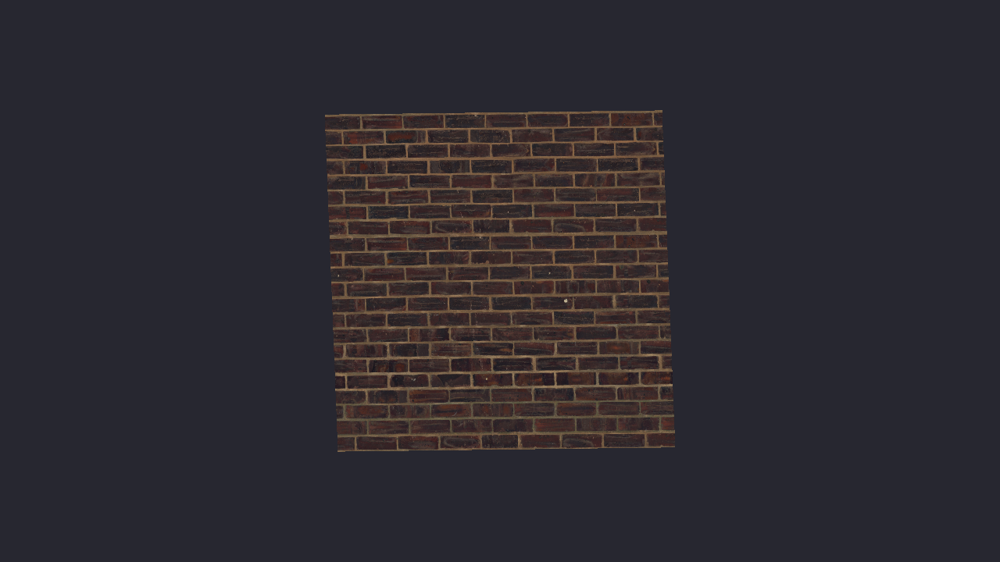 | [**04 — Textures & Samplers**](04-textures-and-samplers/) | Load images, create GPU textures and samplers, draw textured geometry with index buffers |
| 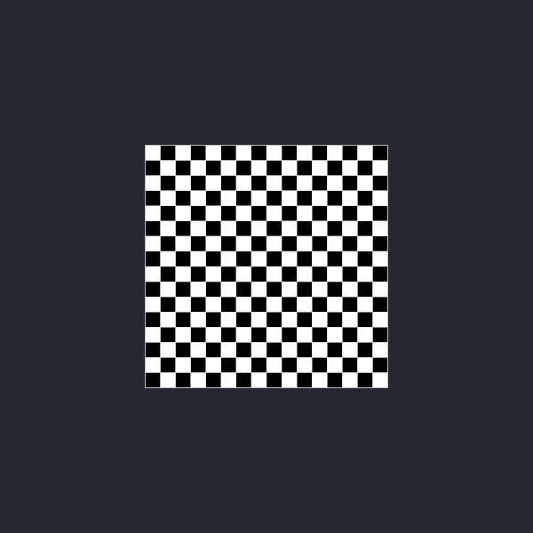 | [**05 — Mipmaps**](05-mipmaps/) | Generate mip chains, configure trilinear filtering, and control LOD |
|  | [**06 — Depth & 3D**](06-depth-and-3d/) | Depth buffer, model-view-projection pipeline, back-face culling, and window resize |
| 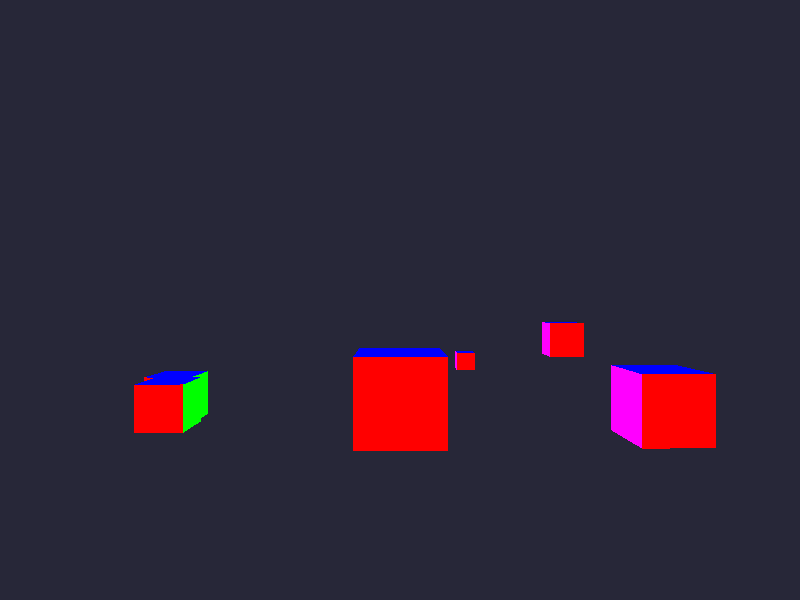 | [**07 — Camera & Input**](07-camera-and-input/) | First-person fly camera with quaternion orientation, keyboard/mouse input, and delta time |
|  | [**08 — Mesh Loading**](08-mesh-loading/) | Load a 3D model from an OBJ file with file-based textures and mipmaps |
|  | [**09 — Scene Loading**](09-scene-loading/) | Load glTF 2.0 scenes with multi-material meshes, scene hierarchy, and indexed drawing |
|  | [**10 — Basic Lighting**](10-basic-lighting/) | Blinn-Phong lighting — ambient, diffuse, and specular with world-space normals |
| 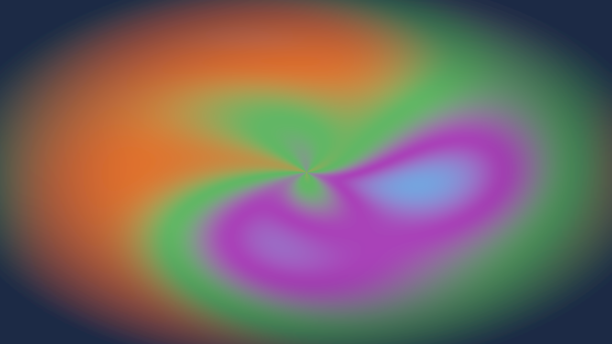 | [**11 — Compute Shaders**](11-compute-shaders/) | Compute pipelines, storage textures, dispatch groups, and the compute-then-render pattern |
|  | [**12 — Shader Grid**](12-shader-grid/) | Procedural anti-aliased grid using screen-space derivatives and multiple pipelines |
| 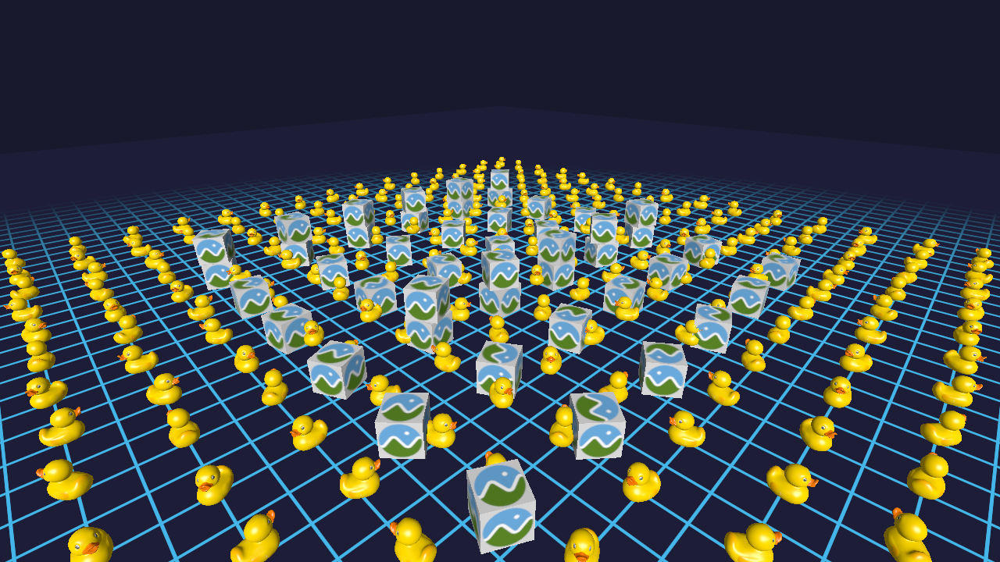 | [**13 — Instanced Rendering**](13-instanced-rendering/) | Draw many copies of a mesh with per-instance vertex buffers |
|  | [**14 — Environment Mapping**](14-environment-mapping/) | Cube map textures, skybox rendering, and reflective surfaces |
| 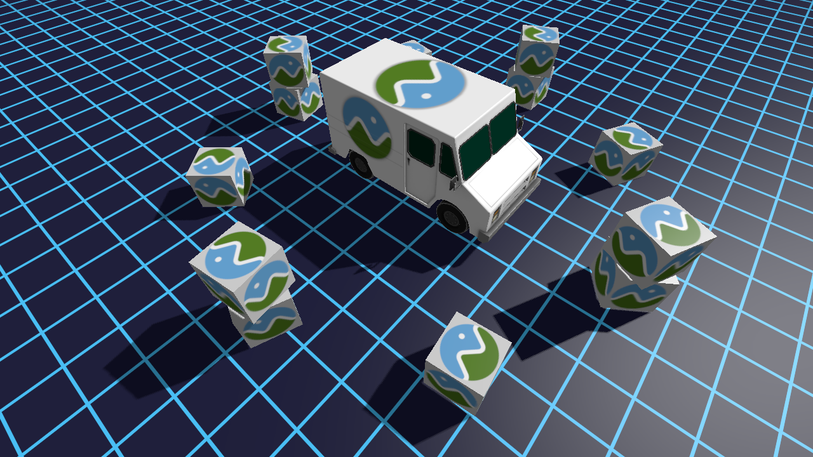 | [**15 — Cascaded Shadow Maps**](15-cascaded-shadow-maps/) | Shadow mapping with frustum cascade splitting and PCF soft shadows |
| 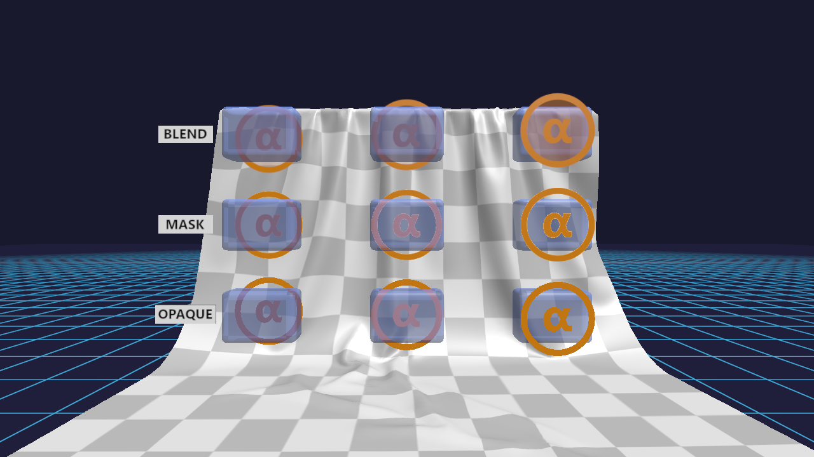 | [**16 — Blending**](16-blending/) | Alpha blending, alpha testing, and additive blending with blend state configuration |
|  | [**17 — Normal Maps**](17-normal-maps/) | Tangent-space normal mapping with TBN matrix construction |
| 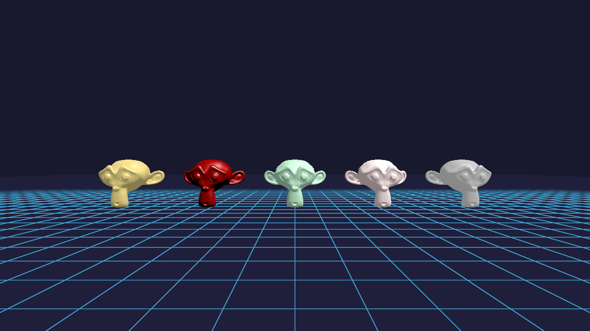 | [**18 — Materials**](18-blinn-phong-materials/) | Per-material Blinn-Phong lighting with ambient, diffuse, specular, and shininess |
|  | [**19 — Debug Lines**](19-debug-lines/) | Immediate-mode debug line drawing — grids, axes, circles, and wireframe boxes |
|  | [**20 — Linear Fog**](20-linear-fog/) | Depth-based distance fog in linear, exponential, and exponential-squared modes |
|  | [**21 — HDR & Tone Mapping**](21-hdr-tone-mapping/) | Render to a floating-point target, then tone map with Reinhard or ACES and exposure control |
|  | [**22 — Bloom**](22-bloom/) | Jimenez dual-filter bloom with 13-tap downsample, Karis averaging, and tent-filter upsample |
| 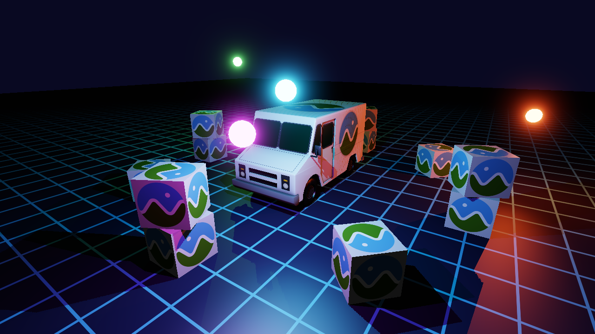 | [**23 — Point Light Shadows**](23-point-light-shadows/) | Omnidirectional shadow mapping with cube map depth textures and linear depth storage |
| 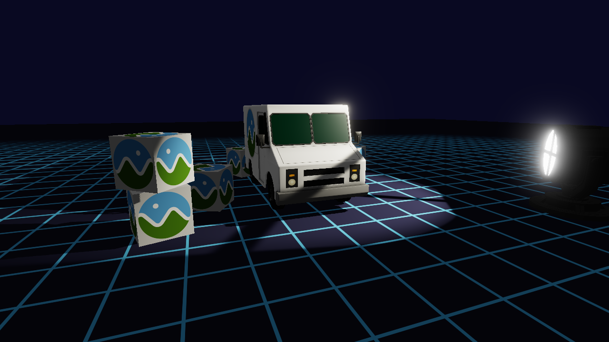 | [**24 — Gobo Spotlight**](24-gobo-spotlight/) | Projected-texture spotlight with cone falloff, shadow map, and pattern projection |
|  | [**25 — Shader Noise**](25-shader-noise/) | GPU noise functions — hash, value, Perlin, fBm, and domain warping |
| 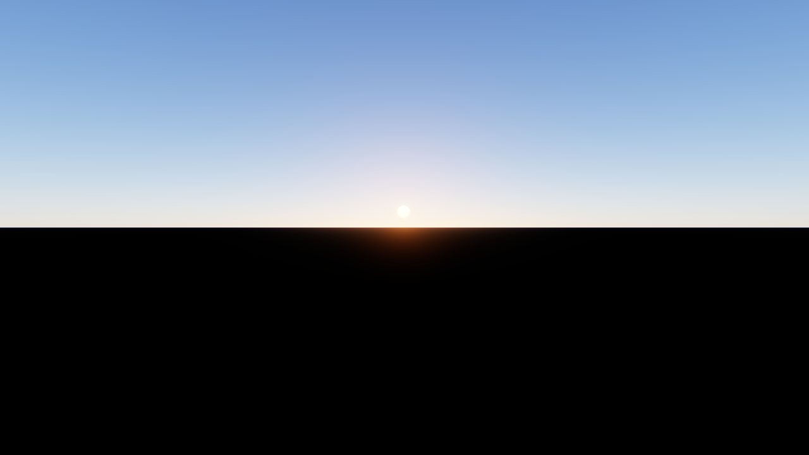 | [**26 — Procedural Sky**](26-procedural-sky/) | Physically-based atmospheric scattering with Rayleigh, Mie, and LUT-accelerated transmittance |
| 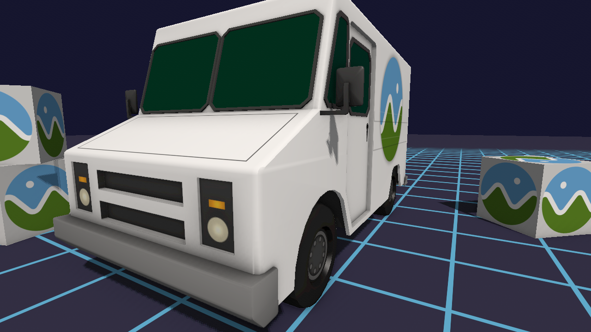 | [**27 — SSAO**](27-ssao/) | Screen-space ambient occlusion with G-buffer, hemisphere kernel sampling, and blur |
|  | [**28 — UI Rendering**](28-ui-rendering/) | Render the immediate-mode UI system on the GPU with a single draw call and font atlas |
| 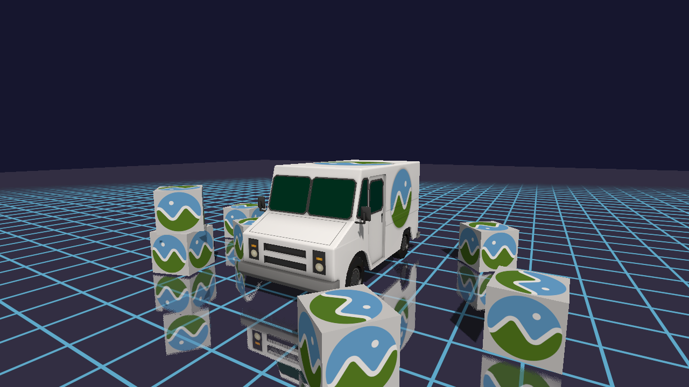 | [**29 — Screen-Space Reflections**](29-screen-space-reflections/) | SSR with ray marching against the depth buffer and deferred shading |
| 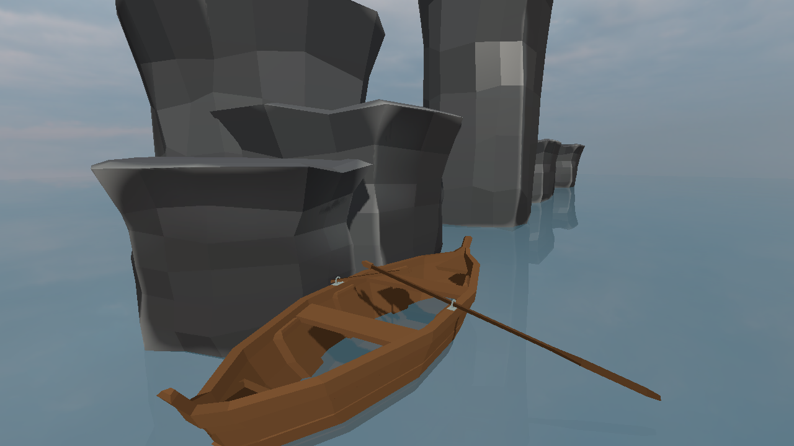 | [**30 — Planar Reflections**](30-planar-reflections/) | Mirror camera, oblique near-plane clipping, and Fresnel-blended water |
| 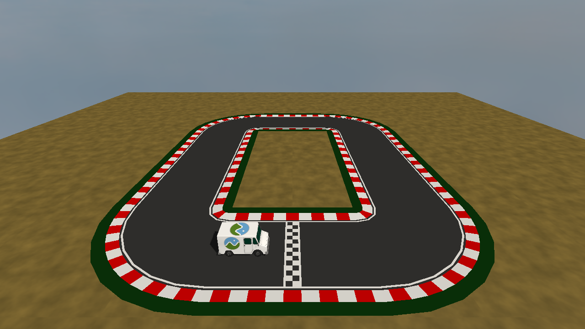 | [**31 — Transform Animations**](31-transform-animations/) | Keyframe animation with glTF loading, quaternion slerp, and path following |
|  | [**32 — Skinning Animations**](32-skinning-animations/) | Skeletal skinning with joint hierarchies, inverse bind matrices, and per-vertex blend weights |
|  | [**33 — Vertex Pulling**](33-vertex-pulling/) | Programmable vertex fetch — replace fixed-function vertex input with storage buffer reads |
| 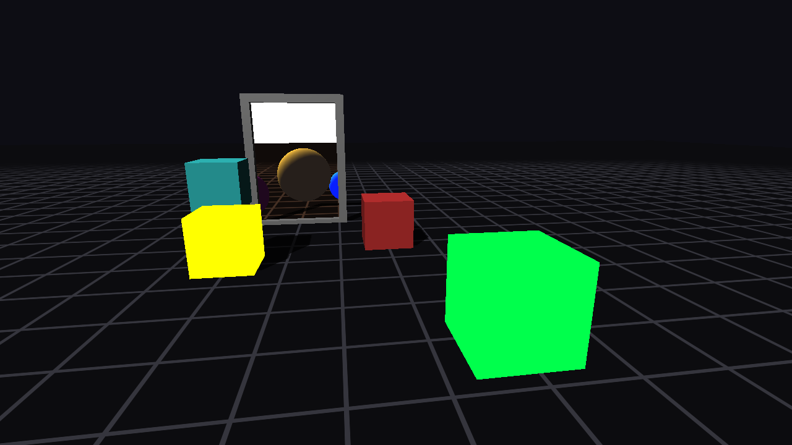 | [**34 — Stencil Testing**](34-stencil-testing/) | Stencil buffer for portals, selection outlines, and per-pixel masking |
| 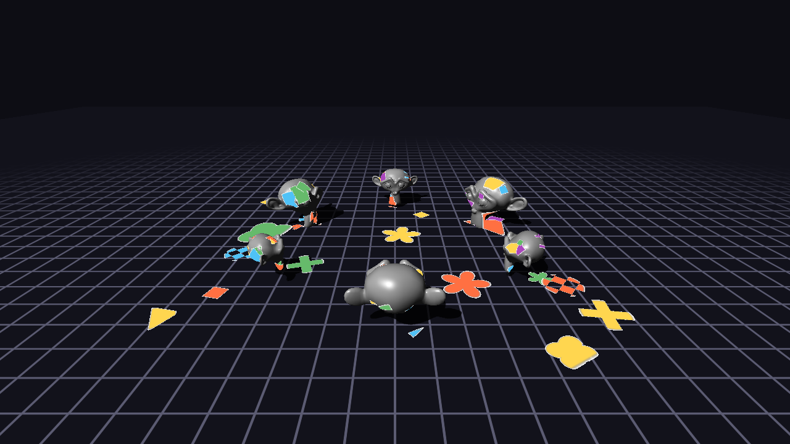 | [**35 — Decals**](35-decals/) | Deferred decal projection onto scene geometry using depth reconstruction |
|  | [**36 — Edge Detection**](36-edge-detection/) | Sobel edge detection on G-buffer data, stencil X-ray vision, and Fresnel ghost silhouettes |
| 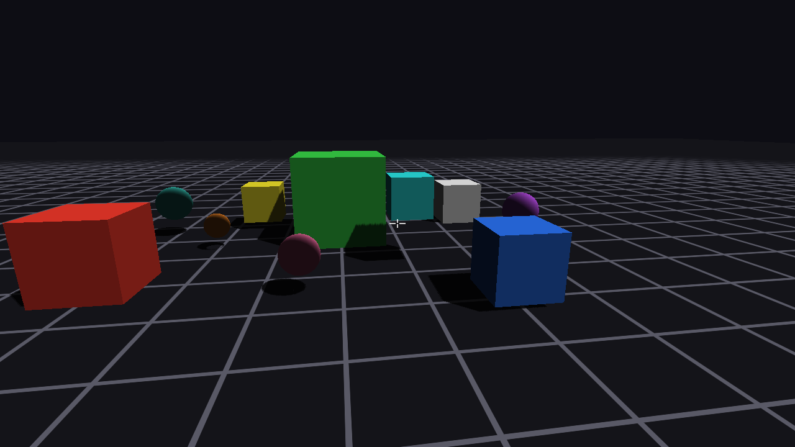 | [**37 — 3D Picking**](37-3d-picking/) | GPU-based object picking with color-ID and stencil-ID methods, plus selection highlighting |
| 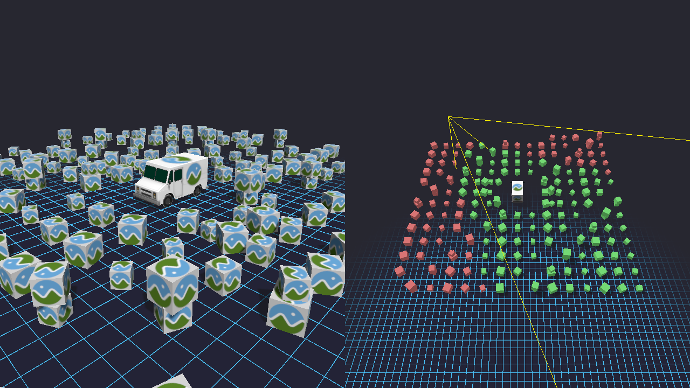 | [**38 — Indirect Drawing**](38-indirect-drawing/) | GPU-driven draw calls with compute frustum culling, indirect argument buffers, and dual-camera debug visualization |
| 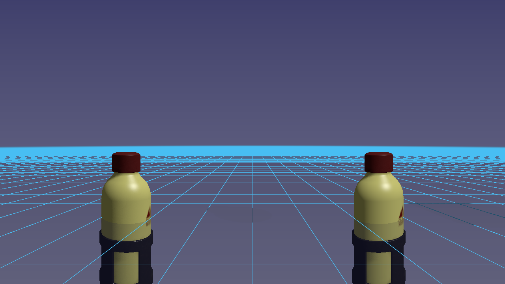 | [**39 — Pipeline-Processed Assets**](39-pipeline-processed-assets/) | Load .fmesh binary meshes and pipeline-processed textures, compare against raw glTF loading in split-screen |

## Prerequisites

### Knowledge

- **C programming** — Comfortable with structs, pointers, and functions
- **Basic 3D math** — Understanding of vectors helps (see [Math Lessons](../math/))
- **Willingness to learn** — GPU programming has a learning curve, but these lessons guide you through it

**No prior graphics experience needed!** These lessons start from the very beginning.

### Tools

- **CMake 3.24+** — Build system
- **C compiler** — MSVC (Windows), GCC, or Clang
- **GPU hardware** — Any GPU supporting Vulkan, Direct3D 12, or Metal

SDL3 is fetched automatically — no manual installation required.

## Learning Path

### For absolute beginners:

1. **Start with Lesson 01** — Get a window on screen and understand the basics
2. **Work through in order** — Each lesson builds on previous concepts
3. **Do the exercises** — Hands-on practice is essential
4. **Read math lessons as needed** — When GPU lessons reference math concepts, dive into the theory
5. **Ask questions** — Use Claude to explain concepts you don't understand

### If you have graphics experience:

- Skim early lessons to learn SDL GPU API patterns
- Focus on SDL-specific concepts (swapchain composition, push uniforms, etc.)
- Jump to specific topics you're interested in
- Use the skills to build quickly

## How GPU Lessons Work

Each lesson includes:

1. **Standalone program** — Builds and runs independently
2. **README** — Explains concepts, shows code, references math lessons
3. **Commented code** — Every line explains *why*, not just *what*
4. **Exercises** — Extend the lesson to reinforce learning
5. **Matching skill** — AI-invokable pattern for building with this technique

### Running a lesson

```bash
cmake -B build
cmake --build build --config Debug

# Easy way — use the run script
python scripts/run.py 02                  # by number
python scripts/run.py first-triangle      # by name

# Or run the executable directly
# Windows
build\lessons\gpu\02-first-triangle\Debug\02-first-triangle.exe

# Linux / macOS
./build/lessons/gpu/02-first-triangle/02-first-triangle
```

## Integration with Math

GPU lessons use the **forge-gpu math library** (`common/math/`) for all math operations.

**You'll see:**

- `vec2` for 2D positions and UV coordinates (HLSL: `float2`)
- `vec3` for 3D positions, colors, normals (HLSL: `float3`)
- `vec4` for homogeneous coordinates (HLSL: `float4`)
- `mat4` for transformations (HLSL: `float4x4`)

**When to read math lessons:**

- **Before GPU Lesson 02**: Read [Vectors](../math/01-vectors/) to understand positions and colors
- **Before GPU Lesson 04**: Read [Bilinear Interpolation](../math/03-bilinear-interpolation/) for texture filtering math
- **Before GPU Lesson 05**: Read [Mipmaps & LOD](../math/04-mipmaps-and-lod/) for mip chain and trilinear math
- **Before GPU Lesson 06**: Read [Matrices](../math/05-matrices/) for MVP transform walkthrough
- **Before GPU Lesson 07**: Read [Orientation](../math/08-orientation/) and [View Matrix](../math/09-view-matrix/) for camera math
- **Before GPU Lesson 08**: Review [Mipmaps & LOD](../math/04-mipmaps-and-lod/) for texture loading
- **Before GPU Lesson 15**: Read [Projections](../math/06-projections/) for shadow map frustums
- **Before GPU Lesson 21**: Read [Color Spaces](../math/11-color-spaces/) for HDR and tone mapping
- **Before GPU Lesson 25**: Read [Hash Functions](../math/12-hash-functions/) and [Gradient Noise](../math/13-gradient-noise/) for shader noise
- **Before GPU Lesson 27**: Read [Blue Noise](../math/14-blue-noise-sequences/) for SSAO sampling
- **When confused**: Math lessons explain the theory behind GPU operations

See [lessons/math/README.md](../math/README.md) for the complete math curriculum.

## SDL GPU API Overview

### What makes SDL GPU different?

**Explicit, low-level control** — Like Vulkan or Direct3D 12, but simpler:

- You manage buffers, pipelines, and render passes explicitly
- No hidden state or "magic" — everything is visible
- Efficient: close to the metal, minimal overhead

**Portable** — One API, multiple backends:

- Vulkan on Windows, Linux, Android
- Direct3D 12 on Windows, Xbox
- Metal on macOS, iOS
- Future: more backends as they're added

**Modern** — Designed for today's GPUs:

- Command buffers for parallel work submission
- Explicit synchronization (no implicit barriers)
- Transfer queues for async uploads
- Compute shaders and GPU-driven rendering

### Core concepts you'll learn:

1. **GPU Device** — Your connection to the graphics hardware
2. **Swapchain** — Double/triple buffering for presenting to the screen
3. **Command Buffers** — Record GPU work, submit in batches
4. **Buffers** — GPU memory for vertex data, uniforms, etc.
5. **Shaders** — Programs that run on the GPU (HLSL in forge-gpu)
6. **Pipelines** — Complete state for how rendering happens
7. **Render Passes** — Define rendering operations and their targets
8. **Transfer Operations** — Upload data from CPU to GPU

## Using Skills

Every GPU lesson has a matching **Claude Code skill** that teaches AI agents
the same pattern. Use these to build projects quickly:

**Available skills:**

- **`/forge-sdl-gpu-setup`** — Scaffold a new SDL3 GPU application
- **`/forge-first-triangle`** — Add vertex rendering with shaders
- **`/forge-uniforms-and-motion`** — Pass per-frame data to shaders
- **`/forge-textures-and-samplers`** — Load images, create textures/samplers, draw textured geometry
- **`/forge-mipmaps`** — Mipmapped textures, trilinear filtering, LOD control
- **`/forge-depth-and-3d`** — Depth buffer, MVP pipeline, 3D rendering
- **`/forge-camera-and-input`** — First-person camera, keyboard/mouse input, delta time
- **`/forge-mesh-loading`** — Load OBJ models, textured mesh rendering
- **`/forge-scene-loading`** — Load glTF scenes with multi-material rendering
- **`/forge-basic-lighting`** — Blinn-Phong ambient + diffuse + specular lighting
- **`/forge-compute-shaders`** — Compute pipelines, storage textures, dispatch groups
- **`/forge-shader-grid`** — Procedural anti-aliased grid with screen-space derivatives
- **`/forge-instanced-rendering`** — Draw repeated geometry with per-instance buffers
- **`/forge-environment-mapping`** — Cube map skybox and reflective surfaces
- **`/forge-cascaded-shadow-maps`** — Cascaded shadow maps with PCF soft shadows
- **`/forge-blending`** — Alpha blending, alpha testing, additive blending
- **`/forge-normal-maps`** — Tangent-space normal mapping with TBN matrix
- **`/forge-blinn-phong-materials`** — Per-material Blinn-Phong lighting
- **`/forge-debug-lines`** — Immediate-mode debug line drawing
- **`/forge-linear-fog`** — Depth-based distance fog (linear, exponential)
- **`/forge-hdr-tone-mapping`** — HDR rendering with Reinhard/ACES tone mapping
- **`/forge-bloom`** — Jimenez dual-filter bloom with Karis averaging
- **`/forge-point-light-shadows`** — Omnidirectional point light shadows
- **`/forge-gobo-spotlight`** — Projected-texture gobo spotlight
- **`/forge-shader-noise`** — GPU noise functions (hash, Perlin, fBm, domain warp)
- **`/forge-procedural-sky`** — Physically-based procedural atmospheric scattering
- **`/forge-ssao`** — Screen-space ambient occlusion
- **`/forge-ui-rendering`** — Immediate-mode UI on GPU with font atlas and dynamic buffers
- **`/forge-screen-space-reflections`** — Screen-space reflections with ray marching
- **`/forge-planar-reflections`** — Planar reflections with oblique near-plane clipping
- **`/forge-transform-animations`** — Keyframe animation from glTF with slerp and path following
- **`/forge-skinning-animations`** — Skeletal skinning with joint hierarchies and blend weights
- **`/forge-vertex-pulling`** — Programmable vertex fetch with storage buffer reads
- **`/forge-stencil-testing`** — Stencil buffer for portals, outlines, and per-pixel masking
- **`/forge-decals`** — Deferred decal projection with depth reconstruction
- **`/edge-detection`** — Sobel edge detection, stencil X-ray vision, Fresnel silhouettes
- **`/3d-picking`** — GPU-based object selection with color-ID and stencil-ID methods
- **`/forge-indirect-drawing`** — GPU-driven indirect draw calls with compute frustum culling
- **`/forge-pipeline-assets`** — Load .fmesh binary meshes and pipeline-processed textures

**How to use:**

1. Copy `.claude/skills/` into your project
2. Type `/skill-name` in Claude Code, or just describe what you want
3. Claude invokes the skill automatically when relevant

Skills know the project conventions and generate correct code.

See the [skills directory](../../.claude/skills/) for all available skills.

## Building Real Projects

These lessons are **not just tutorials** — they're patterns you'll use in production:

- **Vertex buffers** (Lesson 02) — Every game draws geometry this way
- **Uniforms** (Lesson 03) — Every shader needs per-frame data
- **Textures** (Lesson 04) — Essential for realistic rendering
- **Mipmaps** (Lesson 05) — Prevent aliasing at any distance
- **Depth buffers** (Lesson 06) — Required for 3D scenes
- **Lighting** (Lesson 10) — Makes 3D objects look real
- **Shadow maps** (Lessons 15, 23, 24) — Dynamic shadows for directional and point lights
- **Post-processing** (Lessons 21, 22, 27) — HDR, bloom, and ambient occlusion

The code is **production-ready** — clean, efficient, well-documented. Copy it,
adapt it, build on it.

## Common Questions

### Do I need to learn Vulkan/D3D12/Metal first?

**No!** SDL GPU abstracts the complexity while keeping the power. You learn
modern GPU concepts without the boilerplate.

### What if I know OpenGL?

SDL GPU is **explicit** (like Vulkan), not **implicit** (like OpenGL):

- You create command buffers and submit them (no global state)
- Shaders are pre-compiled (no runtime compilation)
- Render passes are explicit (no default framebuffer)

The concepts transfer, but the API style is different.

### Why HLSL shaders?

- **Portable**: DXC compiles HLSL to SPIR-V (Vulkan), DXIL (D3D12), and MSL (Metal)
- **Modern**: Shader Model 6.0+ with advanced features
- **Familiar**: Similar to GLSL but with better tooling
- **Well-documented**: Microsoft's shader language with great resources

### Can I use this for 2D games?

**Absolutely!** Early lessons are 2D-focused. SDL GPU handles:

- Sprite rendering (textured quads)
- Particle systems
- 2D lighting
- UI rendering

3D is just an extension of the same concepts.

## Exercises Philosophy

Every lesson includes exercises. **Do them!** They're designed to:

1. **Reinforce concepts** — Apply what you just learned
2. **Build intuition** — Experiment and see what happens
3. **Prepare for next lesson** — Many exercises preview upcoming concepts
4. **Encourage creativity** — Make something uniquely yours

Don't just read the code — modify it, break it, fix it, extend it.

## Getting Help

**If you're stuck:**

1. **Re-read the lesson** — Concepts often click the second time
2. **Check the math lesson** — Theory might clarify the practice
3. **Ask Claude** — Describe what you're trying to do and what's not working
4. **Read SDL docs** — [wiki.libsdl.org/SDL3](https://wiki.libsdl.org/SDL3/CategoryGPU)
5. **Experiment** — Change values and see what happens

**Remember:** Getting a triangle on screen for the first time is a big deal.
GPU programming has a learning curve, but these lessons make it manageable.

## What's Next?

After completing these lessons, you'll have the skills to build
real-time 3D applications with lighting, shadows, post-processing, UI, and
procedural content. Use the skills to build your own projects, or extend
the lessons with new techniques.

---

**Welcome to GPU programming with SDL!** These lessons will take you from
"What's a vertex buffer?" to building real-time 3D applications. Let's build
something amazing!
