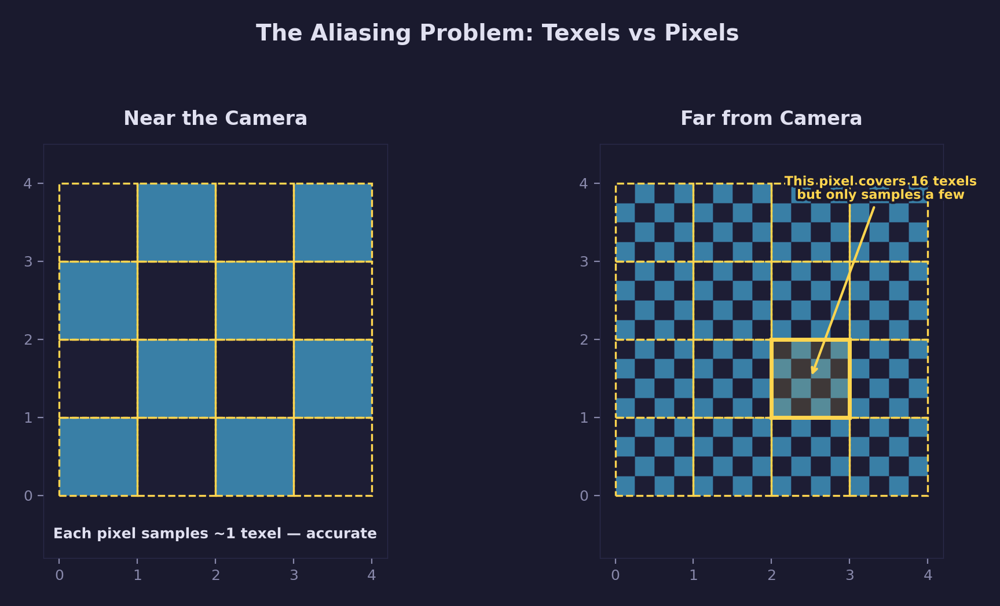
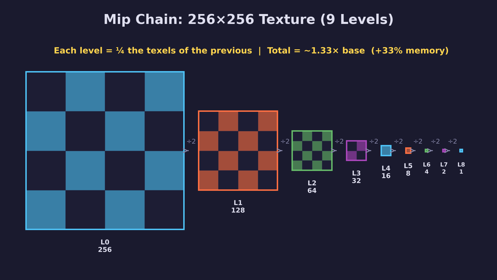
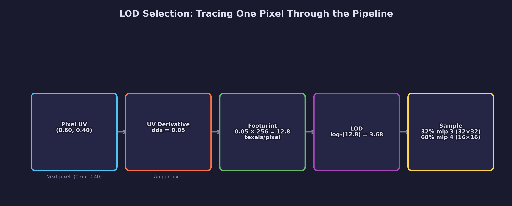
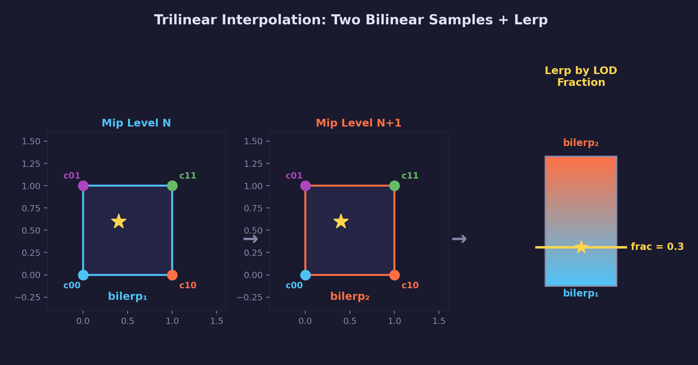
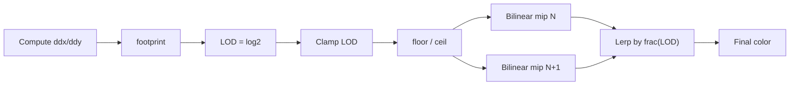

# Math Lesson 04 — Mipmaps & LOD

## What you'll learn

- Why textures alias at a distance, and the mechanism behind the shimmer
- How mip chains work — why halving, why log2, and where the 33% comes from
- How the GPU selects a mip level using screen-space derivatives
- How trilinear interpolation eliminates visible transitions between levels
- How to trace a single pixel through the entire LOD pipeline

## Result

The demo walks through each concept with concrete numbers:

```text
2. MIP CHAIN -- HALVING AND LOG2
--------------------------------------------------------------
  A 256x256 texture has 9 mip levels.

  Level     Size          Texels        Bytes
  -----     --------      --------      ------
  0          256x256      65536         262144
  1          128x128      16384         65536
  2           64x64       4096          16384
  ...
  8            1x1        1             4

  Overhead: 33% extra memory (always ~33%)
```

Four diagrams are generated in `assets/`:

- `aliasing_problem.png` — why many texels per pixel causes shimmer
- `mip_chain.png` — the full 9-level mip chain with memory cost
- `lod_walkthrough.png` — tracing one pixel through the LOD pipeline
- `trilinear_interpolation.png` — two bilinear samples blended by LOD fraction

## Key concepts

- **Mip chain** — a series of progressively-halved textures, from full size
  down to 1×1
- **LOD (Level of Detail)** — a number that tells the GPU which mip level to
  sample, computed as $\log_2(\text{texels per pixel})$
- **Trilinear interpolation** — bilinear sample from two adjacent mip levels,
  then lerp between them by the fractional LOD
- **Screen-space derivatives** — `ddx`/`ddy` measure how fast UVs change across
  neighboring pixels, which determines LOD

## The aliasing problem

Imagine a checkerboard floor stretching into the distance. Near the camera,
each tile of the pattern covers many screen pixels — the GPU can sample the
texture at each pixel and reproduce the pattern accurately.

Now look further down the floor. At some distance, dozens of alternating black
and white tiles land on the same pixel. The GPU samples one point inside that
pixel's footprint and gets either black or white — whichever texel it happens
to hit. Move the camera slightly and it hits a different texel. The pixel
flickers between black and white every frame. Across the whole far section of
the floor, this produces shimmering, false repeating patterns (moiré), and
visual noise.

The fundamental issue: **one pixel covers many texels, but the GPU only samples
a few.** It has no way to know what the other texels contain, so it guesses
wrong.



The fix is to give the GPU a version of the texture that has already been
filtered down to the right resolution. If one pixel covers 16 texels, use a
texture where those 16 texels have been pre-averaged into one. The GPU samples
one texel and gets the correct average color instead of a random sample from
one of the 16.

That pre-filtered set of textures is a **mipmap**.

## The mip chain

**Mip** stands for "multum in parvo" — "much in a small space." A mipmap is a
chain of progressively smaller versions of a texture.



### Why halve?

If one pixel covers 4 texels, you want a texture version where every 2×2 block
has been averaged into a single texel. That is a half-resolution texture.

If one pixel covers 16 texels, you need two halvings — each halving reduces the
covered area by 4×, so two halvings handle 16 texels.

If one pixel covers 64 texels, three halvings.

The pattern: the number of halvings needed is $\log_2$ of the texels-per-pixel
ratio. That is exactly what the mip level number represents, and it is why
the level count formula uses $\log_2$:

$$
\text{num}\_\text{levels} = \lfloor \log_2(\max(\text{width}, \text{height})) \rfloor + 1
$$

```c
int num_levels = (int)forge_log2f((float)max_dimension) + 1;
```

A 256×256 texture: $\lfloor \log_2(256) \rfloor + 1 = 8 + 1 = 9$ levels
(256, 128, 64, 32, 16, 8, 4, 2, 1).

### Memory cost

Each level has half the width and half the height of the previous level, so
it contains one quarter the texels. The total memory for all mip levels is:

$$
\text{base} + \frac{\text{base}}{4} + \frac{\text{base}}{16} + \frac{\text{base}}{64} + \cdots
$$

Factor out the base:

$$
\text{base} \times \left(1 + \frac{1}{4} + \frac{1}{16} + \frac{1}{64} + \cdots\right) = \text{base} \times \frac{4}{3}
$$

The geometric series $\sum_{k=0}^{\infty} (1/4)^k$ converges to $4/3$.
So mipmaps add exactly **33%** extra memory — a fixed overhead regardless of
texture size. For the quality improvement they provide, this is a good trade.

## LOD selection

The GPU needs to answer one question per pixel: **how many texels does this
pixel cover?** The answer determines which mip level to sample from.

### What the GPU measures

When the fragment shader runs, it processes pixels in 2×2 quads. For each
quad, the GPU compares the texture coordinates of adjacent pixels:

- **ddx(uv)**: the difference in UV between the pixel to the right and the
  current pixel. This is the rate of change of UV in the horizontal screen
  direction.
- **ddy(uv)**: the same in the vertical direction.

If a pixel's UV is (0.60, 0.40) and the pixel to its right has UV (0.65, 0.40),
then ddx(u) = 0.05. On a 256×256 texture, that 0.05 in UV space corresponds to
0.05 × 256 = 12.8 texels. One pixel step on screen moves 12.8 texels through
the texture — so this pixel's footprint is about 12.8 texels wide.

### From footprint to LOD

The full computation:

$$
g_x = \sqrt{\left(\frac{\partial U}{\partial x}\right)^2 + \left(\frac{\partial V}{\partial x}\right)^2}, \quad g_y = \sqrt{\left(\frac{\partial U}{\partial y}\right)^2 + \left(\frac{\partial V}{\partial y}\right)^2}
$$

$$
\text{footprint} = \max(g_x, g_y) \times \text{texture}\_\text{size}
$$

$$
\text{LOD} = \log_2(\text{footprint})
$$

The key insight: **doubling the distance doubles the footprint, which adds
exactly 1 to the LOD.** This is why mipmaps use power-of-two sizes — each
doubling in distance maps exactly to one level in the chain.

| Texels per pixel | LOD | Mip level | Mip size (256 base) |
|-----------------|-----|-----------|-------------------|
| 1 | 0.0 | 0 | 256×256 |
| 2 | 1.0 | 1 | 128×128 |
| 4 | 2.0 | 2 | 64×64 |
| 8 | 3.0 | 3 | 32×32 |
| 16 | 4.0 | 4 | 16×16 |

### Tracing one pixel through the pipeline

Here is the complete sequence for a single pixel, with concrete numbers:



1. The pixel's UV is (0.60, 0.40). The pixel to its right has UV (0.65, 0.40).
2. The UV derivative is ddx(u) = 0.05 (how fast the texture coordinate changes
   per screen pixel).
3. The footprint is 0.05 × 256 = 12.8 texels per pixel.
4. LOD = $\log_2(12.8) \approx 3.68$.
5. The GPU splits 3.68 into integer part 3 and fractional part 0.68. It samples
   mip level 3 (32×32) and mip level 4 (16×16), then blends 32% level 3 + 68%
   level 4.

### Why 2×2 quads?

Computing a derivative requires at least two samples. The GPU runs fragment
shaders in 2×2 pixel groups so it can compute the UV difference between
adjacent pixels. These extra shader invocations are called **helper
invocations** — they exist only to provide derivative data and their output
is discarded.

This is also why `discard` can be problematic: discarding a pixel in the quad
can invalidate the derivative computation for its neighbors, causing incorrect
LOD selection.

## Trilinear interpolation

When the LOD is not an integer, the pixel sits between two mip levels. With
nearest-mip selection, the GPU snaps to the closest level. As you move
forward and the LOD crosses an integer boundary, the texture jumps from one
mip level to the next. This visible jump is called a **mip pop**.

Trilinear filtering eliminates pops by crossfading between the two levels:

1. **Bilinear sample** from mip level $\lfloor \text{LOD} \rfloor$ (4 texels)
2. **Bilinear sample** from mip level $\lceil \text{LOD} \rceil$ (4 texels)
3. **Lerp** between the two results using the fractional part of the LOD



$$
\text{result} = \text{lerp}\!\big(\text{bilerp}(\text{mip}_N), \text{bilerp}(\text{mip}_{N+1}), \text{frac}(\text{LOD})\big)
$$

This uses 8 texels total — 4 from each mip level — blended by three
parameters: $t_x$, $t_y$ (fractional UV within each mip level) and $t_z$
(fractional LOD between levels).

### Numerical walkthrough

The demo traces a complete trilinear sample between mip levels 2 and 3:

```text
  Mip level 2 corners:  c00=100  c10=150  c01=120  c11=170
  Mip level 3 corners:  c00=110  c10=140  c01=125  c11=155
  Fractional UV: tx=0.4, ty=0.6
  Fractional LOD: tz=0.3 (30% toward level 3)

  Step 1 -- Bilinear on mip 2:
    bilerp(100, 150, 120, 170, 0.4, 0.6) = 132.0

  Step 2 -- Bilinear on mip 3:
    bilerp(110, 140, 125, 155, 0.4, 0.6) = 131.0

  Step 3 -- Lerp between levels:
    lerp(132.0, 131.0, 0.3) = 131.7
```

Step 1 takes 4 texels from mip 2 and bilinearly interpolates at (0.4, 0.6).
Step 2 does the same on mip 3. Step 3 blends 70% mip 2 + 30% mip 3, because
the LOD fraction is 0.3 (only 30% of the way toward mip 3).

### The forge_math.h implementation

```c
// Scalar trilinear: 8 corner values + 3 blend factors
float result = forge_trilerpf(
    c000, c100, c010, c110,   // front face (mip level N)
    c001, c101, c011, c111,   // back face  (mip level N+1)
    tx, ty, tz);              // tx,ty = UV fraction; tz = LOD fraction

// RGB trilinear: same structure with vec3
vec3 color = vec3_trilerp(
    mip_n_corners...,
    mip_n1_corners...,
    tx, ty, tz);
```

## Sampler mipmap modes

| Mode | Behavior | Use case |
|------|----------|----------|
| `NEAREST` | Picks the single closest mip level | Fast, but visible pops |
| `LINEAR` | Blends between two adjacent levels | Smooth transitions (trilinear) |

Combined with min/mag filter modes:

| Filter combination | Name | Quality |
|--------------------|------|---------|
| NEAREST + NEAREST mip | Point sampling | Lowest (pixelated + pops) |
| LINEAR + NEAREST mip | Bilinear | Medium (smooth within level, pops between) |
| LINEAR + LINEAR mip | Trilinear | High (smooth everywhere) |

## How the GPU samples a mipmapped texture



1. Compute UV derivatives (`ddx`/`ddy`) at each pixel
2. Calculate the footprint in texel space
3. $\text{LOD} = \log_2(\text{footprint})$
4. Clamp LOD to `[min_lod, max_lod]` from the sampler
5. Split LOD into integer + fractional parts
6. Bilinear sample from $\lfloor \text{LOD} \rfloor$ and $\lceil \text{LOD} \rceil$
7. Lerp between them using $\text{frac}(\text{LOD})$

## Functions added to forge_math.h

| Function | Description |
|----------|-------------|
| `forge_log2f(x)` | Base-2 logarithm (mip level count) |
| `forge_clampf(x, lo, hi)` | Clamp scalar to range (LOD clamping) |
| `forge_trilerpf(...)` | Scalar trilinear interpolation |
| `vec3_trilerp(...)` | vec3 trilinear (RGB colors) |
| `vec4_trilerp(...)` | vec4 trilinear (RGBA colors) |

## Building

```bash
python scripts/run.py math/04
```

Requires SDL3 and a C99 compiler (see project root README for full setup).

## Exercises

1. **Mip chain math**: Calculate the total number of texels in a 1024×1024
   mip chain. Verify it is ~33% more than the base level.

2. **Non-square textures**: A 512×256 texture has $\log_2(512) + 1 = 10$ levels.
   At level 1 it is 256×128, at level 9 it is 1×1. Work through the sizes.

3. **LOD bias**: If `mip_lod_bias = 1.0`, the GPU adds 1 to the computed LOD.
   This shifts sampling toward smaller (blurrier) mip levels. When would you
   want this? (Hint: sharpening vs. blurring trade-offs.)

4. **Anisotropic filtering**: Trilinear assumes the pixel footprint is square.
   What happens when the surface is viewed at a steep angle? See
   [Lesson 10 — Anisotropy vs Isotropy](../10-anisotropy/) for the full
   explanation of how anisotropic filtering extends trilinear.

## See also

- [Math Lesson 03 — Bilinear Interpolation](../03-bilinear-interpolation/) — the 2D building block
- [GPU Lesson 05 — Mipmaps](../../gpu/05-mipmaps/) — using `SDL_GenerateMipmapsForGPUTexture`
- [Math library API](../../../common/math/README.md) — full function reference
