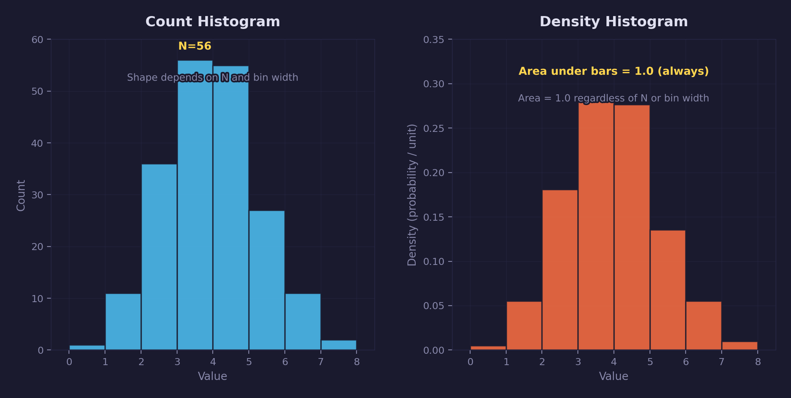
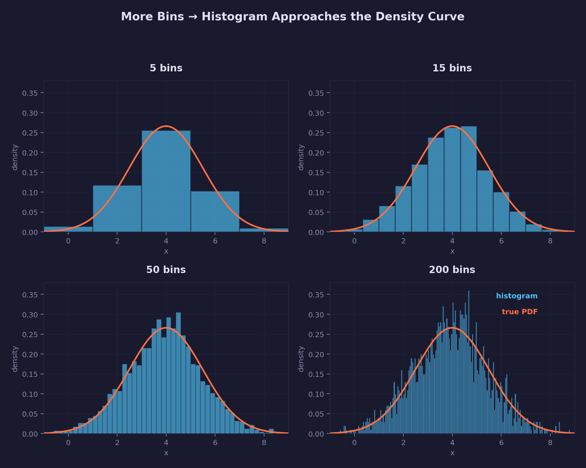
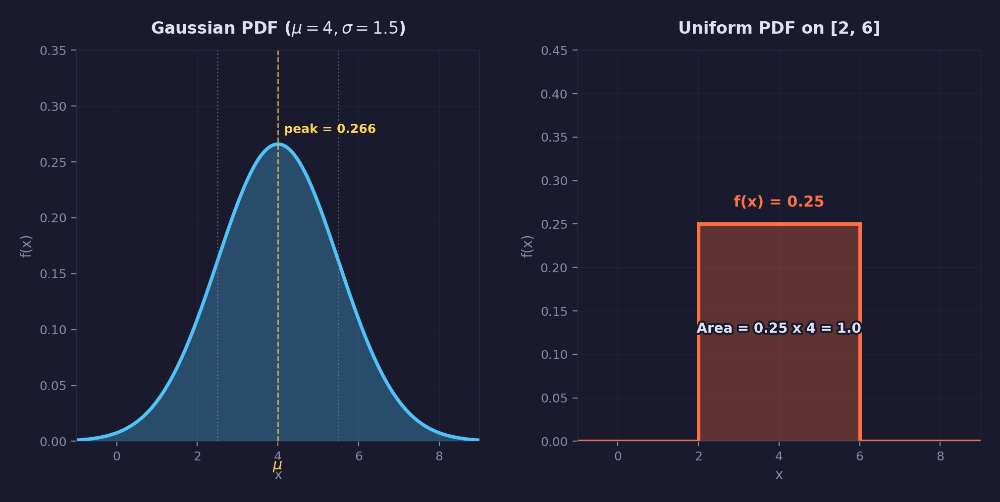
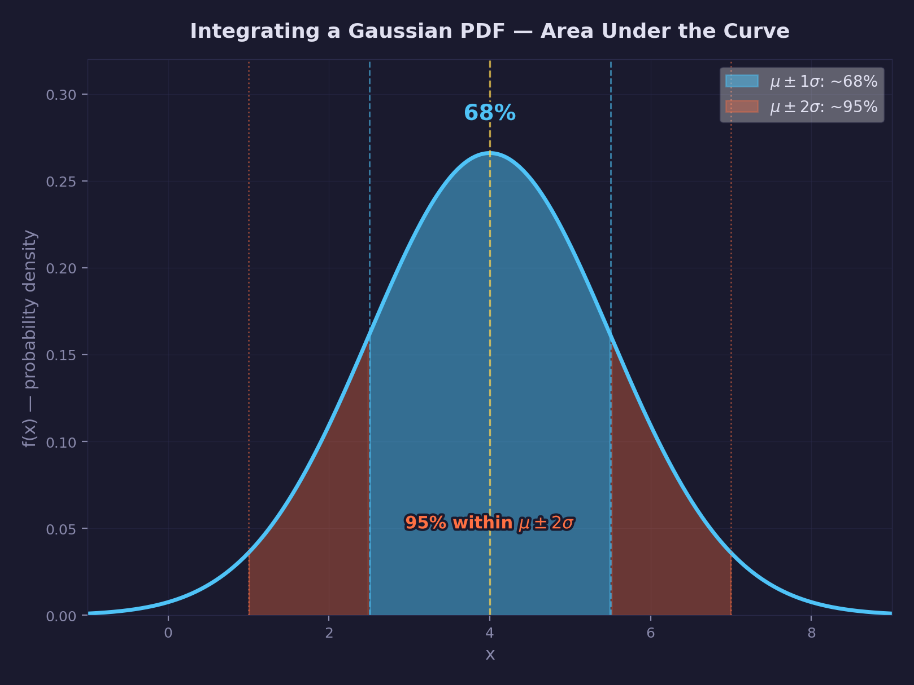

# Math Lesson 16 — Density Functions

How to measure "how much per unit" — the concept behind lighting equations,
texture resolution, Monte Carlo rendering, and game design pacing.

## What you'll learn

- What density means and why it matters more than raw totals
- The difference between extensive and intensive quantities
- How histograms change with bin width, and what density normalization fixes
- What probability density functions (PDFs) are and how to read them
- How integration recovers totals from densities
- Where density functions appear in graphics and game programming

## Result

The demo prints six sections: extensive vs intensive quantities, histogram
comparison, density ratios, PDFs, numerical integration, and graphics
applications. Four diagrams are generated in `assets/`:

- `histogram_comparison.png` — count vs density histogram side-by-side
- `histogram_to_density.png` — increasing bin count converging to the PDF
- `pdf_curves.png` — Gaussian and uniform probability density functions
- `integration_area.png` — shaded sigma regions under a Gaussian curve

## Key concepts

- **Density** — An amount of something per unit of something else. Always a
  ratio: X per unit Y.
- **Extensive quantity** — A measurement that depends on system size: mass,
  energy, population, total light power. Double the system, double the value.
- **Intensive quantity** — A measurement independent of system size: density,
  temperature, pressure. Double the system, the value stays the same.
- **Probability density function (PDF)** — A function f(x) whose value at
  each point gives probability *per unit x*. The area under the curve over
  any interval gives the probability of landing in that interval.
- **Integration** — The operation that converts density back into totals.
  Integrate density over a region to get the extensive quantity in that region.

## The math

### Extensive vs intensive

Every measurement falls into one of two categories:

| Type | Definition | Example | Doubles when you double the system? |
|------|-----------|---------|--------------------------------------|
| Extensive | Depends on size | Mass, energy, population | Yes |
| Intensive | Independent of size | Density, temperature | No |

Density converts between them:

$$
\text{density} = \frac{\text{extensive quantity}}{\text{extent}}
$$

A city with 100,000 people across 50 km² has a population density of
2,000 people/km². Annex another 50 km² with 100,000 people, and the
population doubles (extensive) but density stays the same (intensive).

This is the core property: **density is the quantity that stays meaningful
when you change the size of what you're measuring.**

### Density as a ratio

Every density is a ratio of "how much" to "per what unit":

| Density | Extensive (X) | Extent (Y) | Unit |
|---------|---------------|------------|------|
| Mass density | Mass | Volume | kg/m³ |
| Irradiance | Radiant power | Area | W/m² |
| Texel density | Texels | Surface area | texels/m² |
| Frame rate | Frames | Time | fps |
| Sample density | Samples | Pixels | spp |

The pattern is always the same. When someone says "the texture is 1024×1024,"
that's an extensive statement. When they say "the texture has 262,144
texels/m²," that's a density — and it tells you whether the texture will
look sharp or blurry on a surface of any size.

### Histograms: counts vs density

A count histogram tallies how many data points fall in each bin. The problem:
the shape depends on both the number of samples (N) and the bin width (w).
Double N, and every bar doubles. Widen the bins, and bars grow because each
bin captures more range.

A **density histogram** normalizes each bar:

$$
\text{bar height} = \frac{\text{count in bin}}{N \times w}
$$

This removes the count scaling and converts the y-axis to probability per
unit, so the total area under a density histogram equals 1 regardless of N
or w. The bar heights still shift when you change bin width or alignment —
density normalization does not freeze the shape — but it makes the area
directly comparable across datasets with different N or bin choices.



### From histogram to density curve

A density histogram with a few wide bins gives a rough, blocky approximation
of the underlying distribution. As you increase the number of bins, two things
happen: each bin covers a narrower range, and the bar heights track the local
density more precisely. The outline of the histogram begins to look like a
smooth curve.



With 5 bins the shape is barely recognizable. At 15 bins the bell shape
emerges. By 50 bins the bars follow the curve closely, and at 200 bins the
histogram is nearly indistinguishable from the true probability density
function. In the limit of infinitely many infinitesimally narrow bins (and
infinite data), the histogram converges to the PDF exactly.

This is the motivation for defining a continuous density function: it is the
shape that every histogram is trying to approximate.

### Probability density functions

A PDF generalizes the density histogram to a continuous function f(x). At
every point x, f(x) gives the probability **per unit x** — not the
probability of exactly x (which is always zero for continuous distributions).

To get an actual probability, integrate over an interval:

$$
P(a \le X \le b) = \int_a^b f(x)\, dx
$$

Two properties define a valid PDF:

1. f(x) >= 0 everywhere
2. The total integral over all x equals 1

**f(x) can exceed 1.** A uniform distribution on [0, 0.5] has f(x) = 2
inside the interval. The value is a *density* (probability per unit x), not
a probability. Only the integral — the area — must be at most 1.



### Integrating density functions

Integration is how you convert density back into a total. The integral of a
density function over a region gives the extensive quantity in that region:

$$
\text{total} = \int_{\text{region}} \text{density}(x)\, dx
$$

For a Gaussian PDF with mean μ and standard deviation σ:

- ~68% of probability lies within μ ± 1σ
- ~95% lies within μ ± 2σ
- ~99.7% lies within μ ± 3σ

Doubling the integration region captures more of the total — the density
didn't change, you just measured more of it. This is the same principle as
population density: a larger census area counts more people, not because
people became more common, but because you looked at more land.



Numerically, the trapezoidal rule approximates the integral as a sum of
thin rectangles:

$$
\int_a^b f(x)\, dx \approx \sum_{i=0}^{N-1} \frac{f(x_i) + f(x_{i+1})}{2} \cdot \Delta x
$$

This is how the demo program evaluates integrals.

## Where it's used

### Radiometry and lighting

The entire vocabulary of physically-based rendering is density functions:

| Quantity | What it measures | Type |
|----------|-----------------|------|
| Radiant flux (Φ) | Total power emitted | Extensive (watts) |
| Irradiance (E) | Power per unit area arriving at a surface | Density (W/m²) |
| Radiance (L) | Power per unit area per unit solid angle | Double density (W/m²/sr) |

To compute total light on a surface patch, integrate irradiance over the
patch area. To compute irradiance from all directions, integrate radiance
over the hemisphere of incoming directions. Every lighting equation is
an integration of density functions.

### Monte Carlo rendering and importance sampling

Path tracers estimate integrals by random sampling. The estimator for
the integral of a function g(x) is:

$$
\int g(x)\, dx \approx \frac{1}{N} \sum_{i=1}^{N} \frac{g(x_i)}{p(x_i)}
$$

where p(x) is the PDF used to generate the samples x_i. Dividing by p(x)
removes the sampling bias — samples drawn from high-density regions are
weighted down, and vice versa.

**Importance sampling** chooses p(x) to match the shape of g(x). When
p(x) ∝ g(x), the ratio g/p is nearly constant, and variance drops. This
is why cosine-weighted hemisphere sampling works well for diffuse surfaces:
the PDF matches the cosine falloff of Lambert's law.

### Texel and vertex density

"Is this texture high enough resolution?" is a density question. A 1024×1024
texture on a 1 m² surface has ~1M texels/m². Stretch it across 100 m² and
density drops to ~10K texels/m² — visibly blurry. The texture didn't change;
the density did.

The same applies to mesh tessellation. A mesh with 1000 triangles on a small
prop has high vertex density; the same mesh on terrain has low vertex density
and may look faceted.

### Game design

Density thinking helps with pacing and world design:

- **NPC density** (NPCs/km²) — How populated does the world feel?
- **Loot density** (items/room) — How rewarding is exploration?
- **Event density** (encounters/minute) — How intense is the pacing?
- **Audio density** (sound sources/area) — How alive does the environment sound?

These are all densities. Doubling the map size doubles the total NPC count
needed to maintain the same density — the same feel.

## Building

```bash
cmake -B build
cmake --build build --config Debug

# Easy way
python scripts/run.py math/16

# Or directly
# Windows
build\lessons\math\16-density-functions\Debug\16-density-functions.exe

# Linux / macOS
./build/lessons/math/16-density-functions/16-density-functions
```

The demo prints six sections: extensive vs intensive, histogram comparison,
density ratios, PDFs, numerical integration, and graphics applications.

## Exercises

1. **Temperature density?** Temperature is intensive but not a density — it's
   not "something per unit something." Why does temperature resist the density
   pattern? What makes it intensive without being a ratio?

2. **Irradiance by hand.** A 60 W light bulb radiates uniformly in all
   directions. What is the irradiance at a distance of 2 m? (Hint: the
   surface area of a sphere is 4πr².)

3. **Histogram bin width.** Modify the demo to use bin width 0.5 instead
   of 1.0. Verify that the count histogram shape changes but the density
   histogram shape stays the same (and still sums to 1).

4. **Importance sampling.** The demo compares uniform and cosine-weighted
   sampling with 8 samples. Try 4 and 64 samples. How does the error
   change? Why does cosine-weighted converge faster?

5. **Texel density calculator.** Write a function that takes texture
   dimensions (width × height) and world-space surface area, and returns
   texels/m². At what density does a texture start looking blurry? (Rule
   of thumb: below ~100 texels/m for a surface viewed at arm's length.)

## Further reading

- [Lesson 01 — Vectors](../01-vectors/) — Dot products used in cosine
  falloff calculations
- [Lesson 14 — Blue Noise & Low-Discrepancy Sequences](../14-blue-noise-sequences/) —
  Sample distributions for Monte Carlo integration
- [GPU Lesson 15 — Cascaded Shadow Maps](../../gpu/15-cascaded-shadow-maps/) —
  Shadow map texel density across cascade splits
- [GPU Lesson 27 — SSAO](../../gpu/27-ssao/) — Sample kernel density in
  screen space
- Pharr, Jakob, Humphreys — *Physically Based Rendering* (especially chapters
  on radiometry and Monte Carlo integration)
