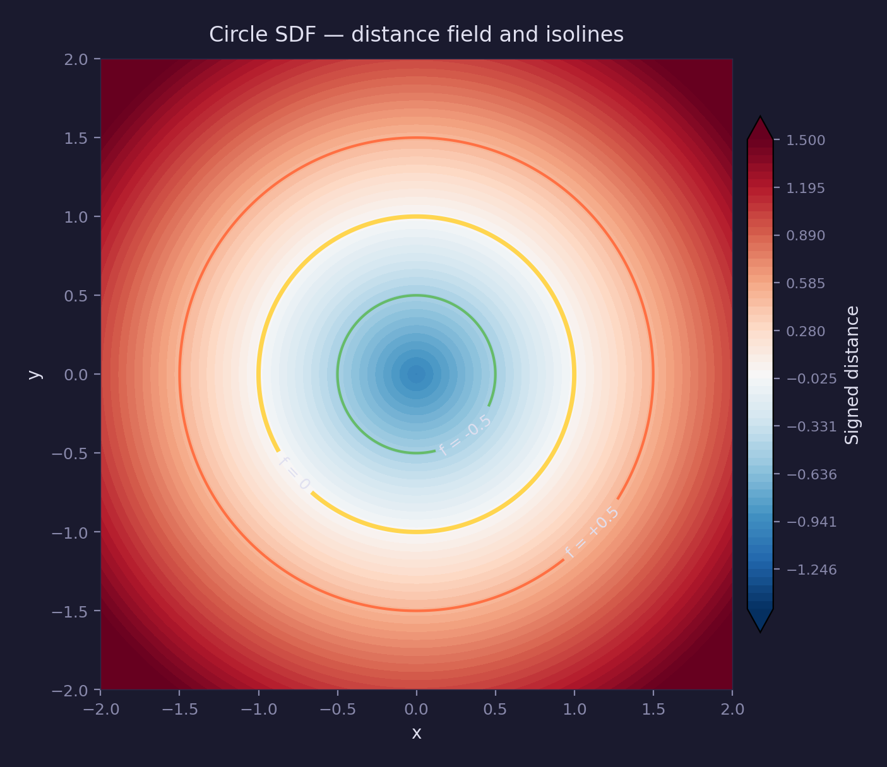
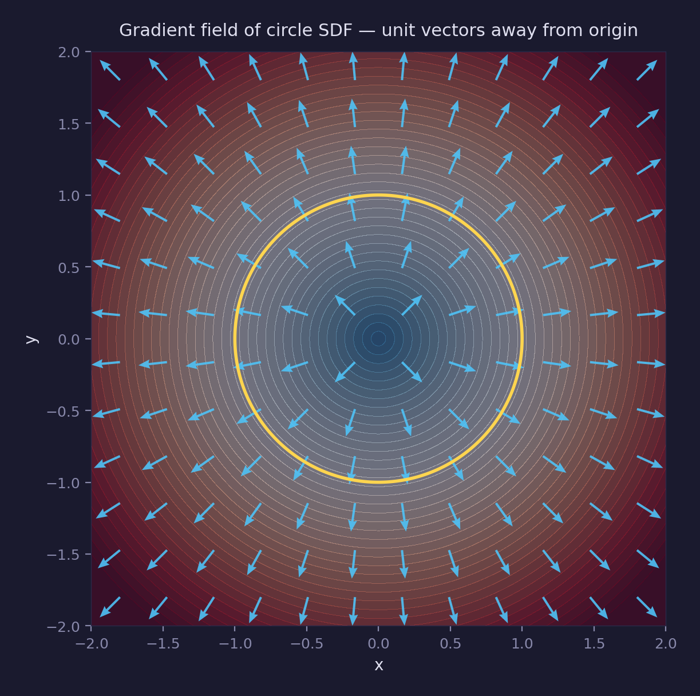
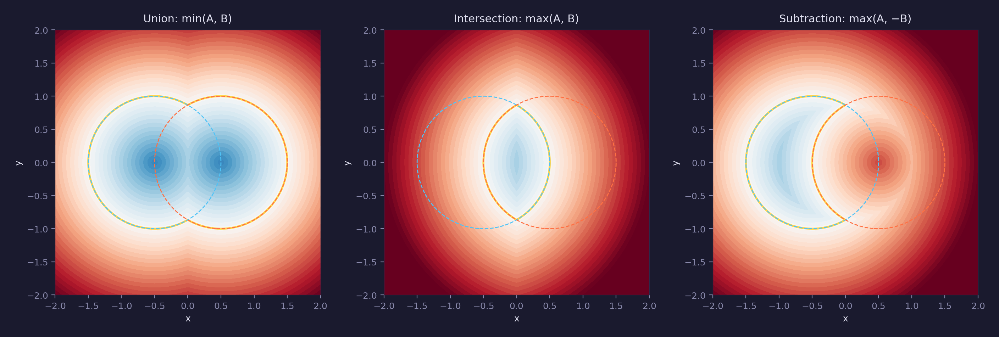
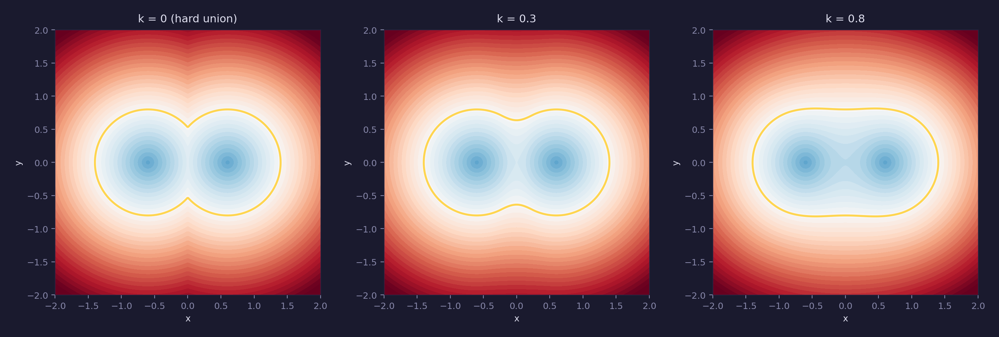
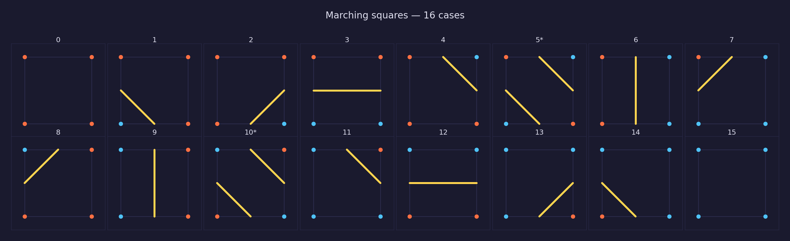

# Math Lesson 17 — Implicit 2D Curves

Circles, boxes, and arbitrary shapes defined by $f(x,y) = 0$ — the math behind
signed distance fields, collision detection, and procedural rendering.

## What you'll learn

- The difference between implicit and parametric curve representations
- What a signed distance function (SDF) is and why the distance property matters
- SDF primitives: circle, box, rounded box, and line segment
- Why the gradient of an SDF gives the surface normal (the Eikonal equation)
- Boolean operations on implicit shapes: union, intersection, subtraction
- Smooth blending (the polynomial smooth-min used for metaballs)
- Marching squares: extracting a boundary polyline from a grid of SDF samples
- Isolines (level sets) and their connection to contour maps

## Key concepts

- **Implicit curve** — A curve defined by $f(x,y) = 0$.  The function
  classifies every point in the plane: $f < 0$ means inside, $f = 0$ means on
  the curve, $f > 0$ means outside.
- **Signed distance function (SDF)** — An implicit function where $|f(p)|$
  equals the Euclidean distance from $p$ to the nearest point on the surface.
  This is the most useful form of implicit representation because the distance
  value has direct geometric meaning.
- **Gradient ($\nabla f$)** — A vector pointing in the direction of steepest
  increase of $f$.  For an SDF, $|\nabla f| = 1$ everywhere (the **Eikonal
  equation**), and at the surface the gradient equals the outward normal.
- **CSG (Constructive Solid Geometry)** — Building complex shapes from simple
  ones using boolean set operations (union, intersection, subtraction).  With
  implicit surfaces these reduce to `min` and `max` on the SDF values.
- **Smooth blending** — Replacing `min`/`max` with a smooth approximation
  (polynomial smooth-min) to create organic, blobby transitions between shapes
  instead of sharp creases.
- **Marching squares** — An algorithm that extracts the $f = 0$ isoline from a
  regular grid of samples.  Each 2×2 cell has $2^4 = 16$ configurations; for
  each case the boundary is approximated by connecting edge midpoints.
- **Isoline (level set)** — The set of points where $f(x,y) = c$ for a constant
  $c$.  The surface itself is the $c = 0$ isoline; other values of $c$ produce
  concentric contours.

## Prerequisites

This lesson builds on concepts from earlier lessons:

- [Lesson 01 — Vectors](../01-vectors/): `vec2` type, dot product,
  normalization, `vec2_length` — used throughout SDF evaluation
- [Lesson 15 — Bézier Curves](../15-bezier-curves/): parametric
  representation $P(t)$ — this lesson covers the implicit alternative

## The math

### Implicit vs parametric

A curve in the plane can be represented two ways:

| Representation | Definition | Strengths |
|---|---|---|
| Parametric | $P(t) = (x(t), y(t))$ | Traces points along the curve; easy to render by sampling $t$ |
| Implicit | $f(x,y) = 0$ | Classifies every point as inside/on/outside; enables boolean ops |

A unit circle is $P(t) = (\cos t, \sin t)$ parametrically, or
$f(x,y) = x^2 + y^2 - 1 = 0$ implicitly.  The parametric form only gives
points **on** the circle.  The implicit form tells you, for any point in the
plane, whether it is inside, outside, or exactly on the boundary.

### Signed distance functions

Not every implicit function is an SDF.  For the circle,
$f(x,y) = x^2 + y^2 - 1$ is implicit but **not** an SDF — the value at
$(2, 0)$ is $3$, but the actual distance to the circle is $1$.

The SDF form is:

$$
f(p) = |p| - r = \sqrt{x^2 + y^2} - r
$$

Now $|f(p)|$ is the true Euclidean distance to the circle for every point $p$.
This distance property is what makes SDFs so useful: you can use the value
directly for anti-aliased rendering, collision response, and ray marching.



### SDF primitives

Four fundamental 2D primitives:

**Circle** — the simplest SDF.  Distance from the origin minus the radius:

$$
\text{sdf2}\_\text{circle}(p, r) = |p| - r
$$

**Axis-aligned box** — works in the positive quadrant (the box is symmetric).
Outside, the distance is Euclidean to the nearest edge or corner.  Inside, it
is the negative distance to the nearest face:

$$
d_x = |p_x| - h_x, \quad d_y = |p_y| - h_y
$$

$$
\text{sdf2}\_\text{box}(p, h) = |\max(d, 0)| + \min(\max(d_x, d_y), 0)
$$

**Rounded box** — shrink the box by the rounding radius, evaluate the box SDF,
then subtract the radius.  This is the **Minkowski sum** of a smaller box and a
disk.

**Line segment** — project the point onto the line through the endpoints, clamp
the parameter to $[0, 1]$, and return the distance to the clamped point.  This
is an unsigned distance (a segment has no interior).

### The gradient and the Eikonal equation

The **gradient** of a scalar field $f$ is the vector of partial derivatives:

$$
\nabla f = \left(\frac{\partial f}{\partial x}, \frac{\partial f}{\partial y}\right)
$$

It points in the direction where $f$ increases fastest.  For a signed distance
function, the gradient has a special property called the **Eikonal equation**:

$$
|\nabla f| = 1 \quad \text{(almost everywhere)}
$$

This means the gradient is a unit vector.  At the surface ($f = 0$), the
gradient equals the **outward surface normal** — the direction pointing away
from the shape.  This is how collision detection systems find the push-out
direction: evaluate the SDF gradient at the contact point.

The gradient is undefined at points equidistant from multiple closest surface
points — the **medial axis** of the shape.  For a circle, the only such point
is the center.  The Eikonal equation holds "almost everywhere" except on this
zero-measure set.

The demo computes the gradient numerically using **central differences**:

$$
\frac{\partial f}{\partial x} \approx \frac{f(x + \varepsilon, y) - f(x - \varepsilon, y)}{2\varepsilon}
$$



### CSG boolean operations

Implicit surfaces support set operations through simple arithmetic on the
distance values:

| Operation | Formula | Meaning |
|---|---|---|
| Union | $\min(f_A, f_B)$ | Combine both shapes |
| Intersection | $\max(f_A, f_B)$ | Keep only the overlap |
| Subtraction | $\max(f_A, -f_B)$ | Cut shape B from shape A |

These work because `min` selects whichever shape the point is closer to (or
deeper inside), while `max` requires the point to satisfy both constraints.
Negating an SDF flips inside and outside, turning shape B into its complement.



### Smooth blending

Hard `min`/`max` create sharp creases where surfaces meet.  The **polynomial
smooth-min** (sometimes called "soft min") replaces the crease with a smooth
transition:

$$
h = \text{clamp}\!\left(\frac{1}{2} + \frac{d_2 - d_1}{2k}, 0, 1\right)
$$

$$
\text{sdf}\_\text{smooth}\_\text{union}(d_1, d_2, k) = \text{lerp}(d_2, d_1, h) - k \cdot h \cdot (1 - h)
$$

The parameter $k$ controls the blend radius.  When $k = 0$ the result is
identical to hard `min`.  Larger $k$ values produce wider, more organic blends.
This is the technique behind **metaballs** — the blobby, organic shapes used in
fluid simulation, procedural modeling, and demoscene effects.



### Marching squares

**Marching squares** extracts the $f = 0$ isoline from a regular grid of
samples.  It is the 2D analog of marching cubes (3D).

The algorithm processes each 2×2 cell of grid points:

1. Classify each of the 4 corners as inside ($f < 0$) or outside ($f \geq 0$)
2. Form a 4-bit index from the corner classifications ($2^4 = 16$ cases)
3. Look up which edges the boundary crosses
4. Connect the edge crossing points with line segments

Cases 0 (all outside) and 15 (all inside) produce no segments.  Cases 5 and 10
are **saddle points** — diagonally opposite corners are inside, creating an
ambiguous topology.  The algorithm resolves the ambiguity by evaluating $f$ at
the cell center: if the center is inside, the segments connect the two inside
regions (connected topology); otherwise they remain separated.  All other
non-trivial cases produce exactly one segment.

The result is a polyline approximation of the isoline.  Increasing the grid
resolution produces a closer approximation to the true curve.



### Isolines (level sets)

The surface $f(x,y) = 0$ is just one member of a family of curves called
**isolines** (or **level sets**):

$$
f(x,y) = c \quad \text{for constant } c
$$

For a circle SDF, the isoline at $c = -0.5$ is a circle of radius $0.5$
(inside), $c = 0$ is the unit circle (the surface), and $c = 0.5$ is a circle
of radius $1.5$ (outside).  The isolines form concentric contours.

This is the same concept behind:

- **Topographic maps** — elevation isolines (contour lines)
- **Weather maps** — pressure isobars
- **The level-set method** — tracking moving interfaces in fluid simulation
- [Lesson 16 — Density Functions](../16-density-functions/) — density isolines
  on a scalar field

## Where it's used

Graphics and game programming uses implicit curves and SDFs for:

- **Anti-aliased shape rendering in shaders** — evaluate the SDF per pixel,
  then use `float aa = fwidth(f)` and `1.0 - smoothstep(-aa, aa, f)` for smooth edges
- **Collision detection** — the SDF sign gives inside/outside, the gradient
  gives the contact normal, and the magnitude gives penetration depth
- **Procedural modeling** — combine primitives with CSG and smooth blend to
  build complex shapes without meshes
- **Font rendering** — multi-channel SDF fonts store distance fields in
  textures for resolution-independent text
- **Ray marching** — sphere tracing steps along a ray by the SDF value at each
  point, guaranteed not to overshoot the surface
- **Boundary extraction** — marching squares/cubes converts implicit surfaces
  to meshes for traditional rendering pipelines

**In forge-gpu lessons:**

- [GPU Lesson 12 — Shader Grid](../../gpu/12-shader-grid/) uses
  `fwidth()`/`smoothstep()` on an implicit grid function — the same
  anti-aliasing technique that works with any SDF

## Building

```bash
cmake -B build
cmake --build build --config Debug

# Windows
build\lessons\math\17-implicit-curves\Debug\17-implicit-curves.exe

# Linux / macOS
./build/lessons/math/17-implicit-curves/17-implicit-curves
```

The demo prints seven sections covering all the concepts above with ASCII
visualizations of distance fields, boolean operations, and isolines.

## Result

The program produces console output with ASCII-art distance field
visualizations.  Each section demonstrates a concept interactively.

**Example output (abridged):**

```text
  Math Lesson 17 -- Implicit 2D Curves
  =====================================

  1. Implicit vs Parametric Representation
  =========================================
  Point          f(x,y)     SDF        Classification
  ( 0.00,  0.00)   -1.000      -1.000   INSIDE
  ( 1.00,  0.00)    0.000       0.000   ON BOUNDARY
  ( 1.50,  0.00)    1.250       0.500   OUTSIDE

  2. Signed Distance Function Primitives
  =======================================
  --- Circle SDF: sdf2_circle(p, radius=1.0) ---


     .....
    ..+++..
    .++#++.
    .+###+.
    .++#++.
    ..+++..
     .....

  3. Gradient of an SDF
  ======================
  ( 1.00,  0.00)  0.000   ( 1.0002,  0.0000)     1.0002
  ( 0.00,  1.00)  0.000   ( 0.0000,  1.0002)     1.0002

  4. CSG Boolean Operations
  ==========================
  --- Union ---       --- Intersection ---     --- Subtraction ---

  5. Smooth Blending (Metaballs)
  ===============================
  k = 0.0 (hard), 0.3, 0.6, 1.0 -- progressively smoother blending

  6. Marching Squares
  ====================
  Total boundary segments: 20

  7. Isolines (Level Sets)
  =========================
      +++
     +   +
    +00 00+
   + 0---0 +
   +  - -  +
   + 0---0 +
    +00 00+
```

## Exercises

1. **Ellipse SDF** — Implement an approximate ellipse SDF.  An exact ellipse
   SDF requires solving a quartic equation; try the common approximation
   `sdf2_circle(vec2_create(p.x/a, p.y/b), 1.0) * min(a, b)` and compare its
   distance accuracy against the true ellipse.

2. **Smooth subtraction** — Implement `sdf_smooth_subtraction(d1, d2, k)` by
   analogy with smooth union.  Visualize how the blend radius affects the
   cutout edge.

3. **Star SDF** — Write an SDF for a 5-pointed star using polar coordinates.
   Hint: convert to polar $(r, \theta)$, fold $\theta$ into one wedge using
   `fmod`, then compute the distance to the wedge boundary.

4. **Interactive 2D editor** — Build a simple SDL program that places circles
   and boxes with mouse clicks, combines them with CSG, and renders the
   resulting distance field as a color-mapped image (blue = inside,
   red = outside, white = boundary).

5. **Marching squares with interpolation** — The demo places boundary crossings
   at edge midpoints.  Improve accuracy by linearly interpolating the SDF
   values at the two corner endpoints to find the exact crossing position along
   each edge.

## Further reading

- [Lesson 01 — Vectors](../01-vectors/) — `vec2` operations used in all SDF
  evaluations
- [Lesson 15 — Bézier Curves](../15-bezier-curves/) — parametric curves, the
  complementary representation
- [Lesson 16 — Density Functions](../16-density-functions/) — isolines and
  level sets on scalar fields
- [GPU Lesson 12 — Shader Grid](../../gpu/12-shader-grid/) — anti-aliased
  implicit rendering with `fwidth`/`smoothstep`
