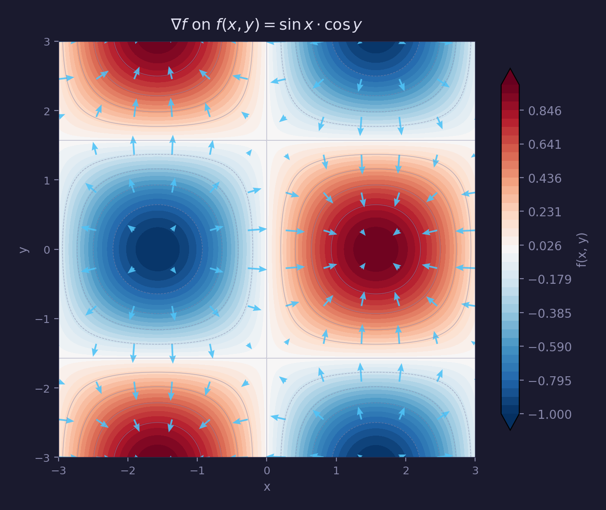
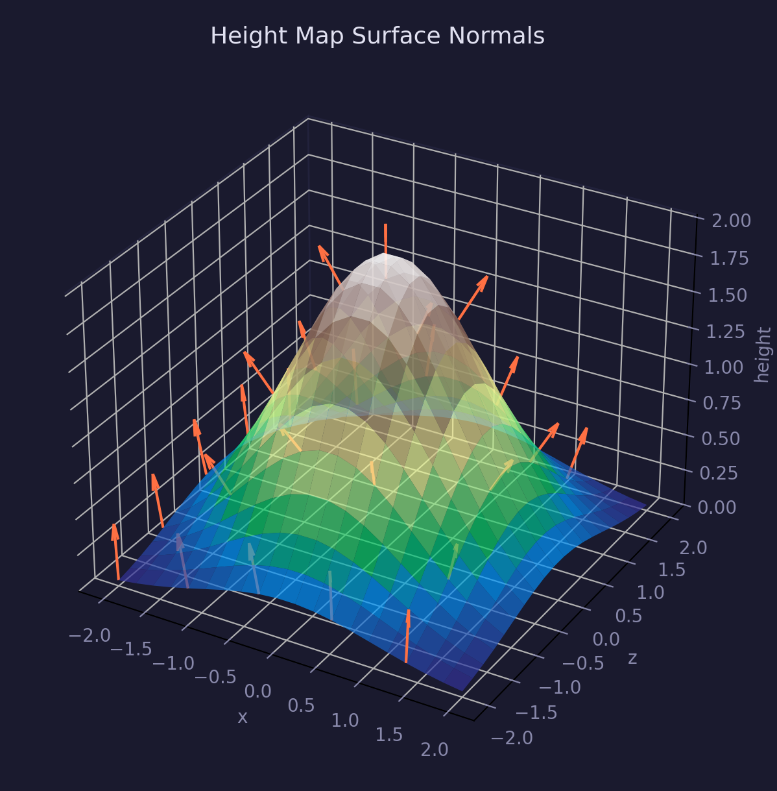
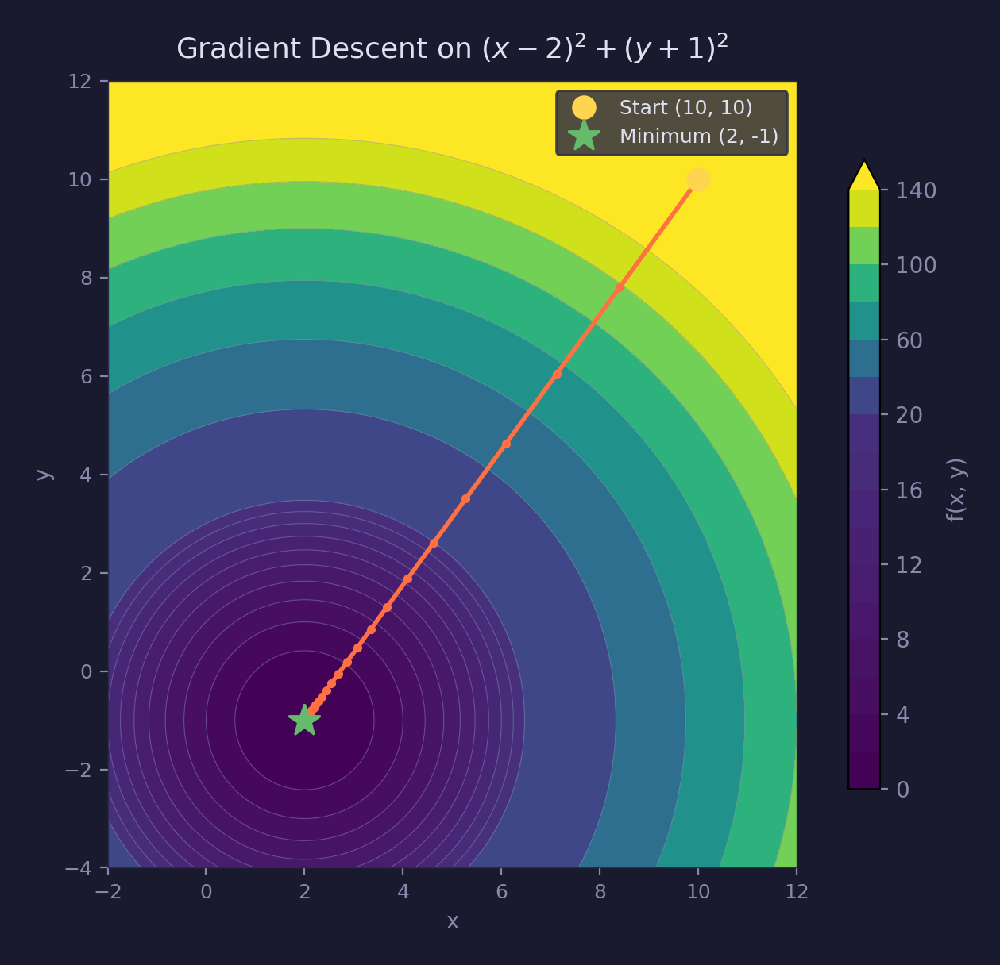
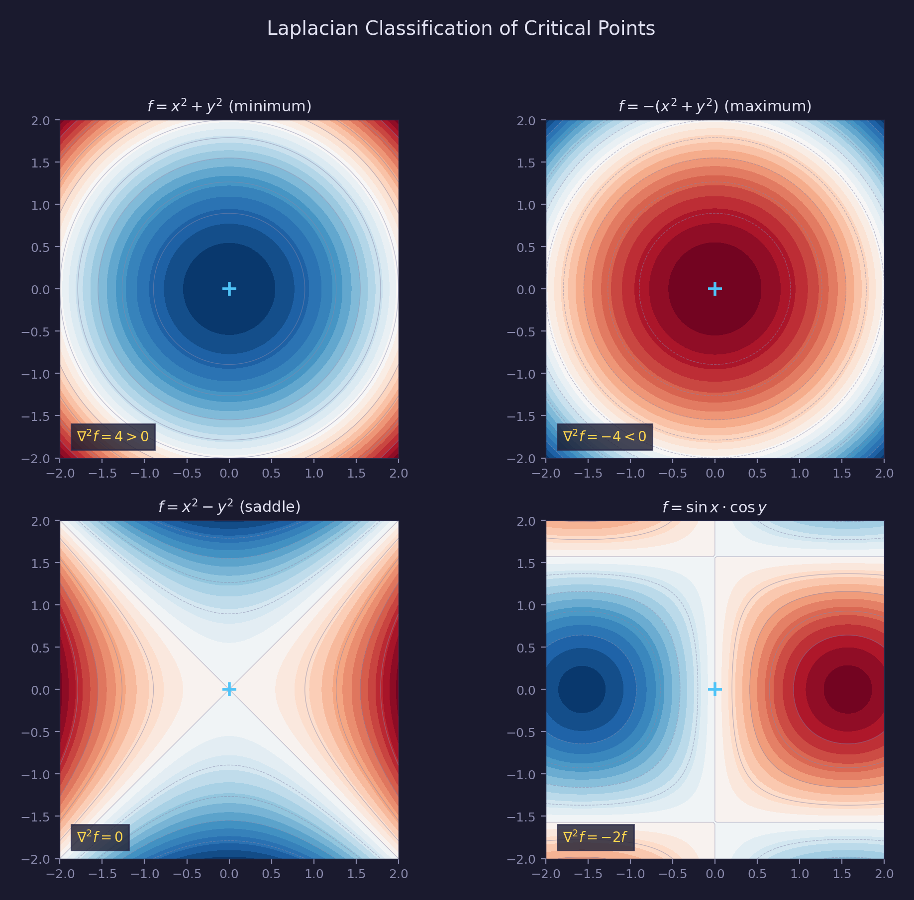

# Math Lesson 18 — Scalar Field Gradients

A scalar field assigns a number to every point in space — temperature on a
weather map, elevation on terrain, pressure in a fluid. The **gradient** is
the vector that tells you the direction and rate of steepest increase at each
point. This lesson generalizes the gradient concept introduced in
[Lesson 17](../17-implicit-curves/) (where it appeared in the narrow context
of SDFs) to arbitrary scalar fields, and adds practical applications: height
map normals, gradient descent, and the Laplacian.

## What you'll learn

- How partial derivatives measure change along individual axes
- Why central differences are more accurate than forward/backward differences
- How the gradient vector assembles partial derivatives into a direction
- Why the gradient is perpendicular to isolines (contour lines)
- How to compute surface normals from height map data
- How gradient descent finds function minima
- What the Laplacian measures and how it classifies critical points

## Key concepts

- **Partial derivative** — the rate of change of a function with respect to
  one variable, holding all others constant
- **Gradient** — the vector of all partial derivatives, pointing in the
  direction of steepest ascent
- **Central differences** — a numerical method for approximating derivatives
  with second-order accuracy
- **Height map normal** — a surface normal computed from the partial derivatives
  of a height field
- **Gradient descent** — an iterative optimization algorithm that minimizes a
  function by stepping opposite to the gradient
- **Laplacian** — the sum of second partial derivatives, measuring how much a
  point differs from its neighborhood average

## Prerequisites

- [Lesson 01 — Vectors](../01-vectors/) (vector operations, dot product)
- [Lesson 17 — Implicit 2D Curves](../17-implicit-curves/) (SDF gradients)

## The math

### Partial derivatives

A function of two variables $f(x, y)$ has two partial derivatives:

$$
\frac{\partial f}{\partial x}
= \lim_{h \to 0} \frac{f(x + h, y) - f(x, y)}{h}
$$

$$
\frac{\partial f}{\partial y}
= \lim_{h \to 0} \frac{f(x, y + h) - f(x, y)}{h}
$$

Each measures how $f$ changes when we move along one axis while holding the
other constant. For $f(x, y) = x^2 + y^2$, the partials are $2x$ and $2y$.

### Numerical computation

We approximate partial derivatives using **finite differences**. Three common
methods, with step size $\varepsilon$:

**Forward difference** — uses $f(x)$ and $f(x + \varepsilon)$:

$$
f'(x) \approx \frac{f(x + \varepsilon) - f(x)}{\varepsilon}
\quad \text{(first-order, } O(\varepsilon) \text{)}
$$

**Backward difference** — uses $f(x - \varepsilon)$ and $f(x)$:

$$
f'(x) \approx \frac{f(x) - f(x - \varepsilon)}{\varepsilon}
\quad \text{(first-order, } O(\varepsilon) \text{)}
$$

**Central difference** — uses $f(x - \varepsilon)$ and $f(x + \varepsilon)$:

$$
f'(x) \approx
\frac{f(x + \varepsilon) - f(x - \varepsilon)}{2\varepsilon}
\quad \text{(second-order, } O(\varepsilon^2) \text{)}
$$

Central differences cancel the first-order error term in the Taylor expansion,
giving an order of magnitude better accuracy for the same step size. The
truncation error is $O(\varepsilon^2)$ while the floating-point rounding error
is $O(\varepsilon_{\text{mach}} / \varepsilon)$. Balancing these two terms gives
an optimal step size of $\varepsilon \approx \varepsilon_{\text{mach}}^{1/3}$.
For single-precision floats ($\varepsilon_{\text{mach}} \approx 1.2 \times 10^{-7}$),
this works out to $\varepsilon \approx 10^{-3}$.

### The gradient vector

The gradient assembles both partial derivatives into a single vector:

$$
\nabla f(x, y) =
\left(
\frac{\partial f}{\partial x},
\frac{\partial f}{\partial y}
\right)
$$

Properties of the gradient:

- **Direction:** points in the direction of steepest ascent
- **Magnitude:** equals the rate of maximum change
- **Perpendicular to isolines:** moving along a contour line keeps $f$
  constant, so the directional derivative along the contour is zero — the
  gradient has no component in that direction



### Height map normals

A height map stores elevation $h(x, z)$ at grid points. The surface normal
at each point comes from the cross product of tangent vectors along the grid
axes:

$$
\mathbf{T}_x = (1, \partial h / \partial x, 0)
$$

$$
\mathbf{T}_z = (0, \partial h / \partial z, 1)
$$

These are the parametric derivatives with respect to grid position (unit
spacing). Their cross product gives:

$$
\mathbf{n} = \text{normalize}(\mathbf{T}_z \times \mathbf{T}_x)
= \text{normalize}\!\left(
-\frac{\partial h}{\partial x}, 1,
-\frac{\partial h}{\partial z}
\right)
$$

The partial derivatives are computed using central differences on the
neighboring grid values. At grid boundaries, the differences fall back to
forward or backward differences.



### Gradient descent

Gradient descent minimizes a function by iteratively stepping in the direction
opposite to the gradient:

$$
\mathbf{x}_{n+1} = \mathbf{x}_n
- \alpha \nabla f(\mathbf{x}_n)
$$

where $\alpha$ is the **step size** (learning rate). The algorithm converges
to a local minimum when the gradient approaches zero. Smaller step sizes
converge more slowly but more reliably; larger step sizes risk overshooting
and diverging.



### The Laplacian

The Laplacian is the sum of second partial derivatives:

$$
\nabla^2 f =
\frac{\partial^2 f}{\partial x^2}
+ \frac{\partial^2 f}{\partial y^2}
$$

It measures how much a point's value differs from the average of its
neighbors. At critical points (where $\nabla f = 0$):

| Laplacian | Curvature indication | Geometric meaning |
|-----------|---------------------|-------------------|
| $> 0$ | Net upward curvature | Value is below neighbor average (bowl) |
| $< 0$ | Net downward curvature | Value is above neighbor average (cap) |
| $= 0$ | Balanced curvature | Value equals neighbor average (e.g. saddle) |

> **Note:** The Laplacian is the trace of the Hessian, so it does not uniquely
> classify all critical points. For example, $f(x,y) = x^2 - 0.5y^2$ has a
> positive Laplacian at the origin but is still a saddle. For full
> classification, inspect the full Hessian matrix.



The second derivative is computed numerically as:

$$
f''(x) \approx
\frac{f(x + \varepsilon) - 2f(x) + f(x - \varepsilon)}{\varepsilon^2}
$$

## Where it's used

- **Terrain rendering** — height map normals for lighting
  (see GPU Lesson 52, planned)
- **Edge detection** — Sobel operators are discrete gradient approximations
  (see [GPU Lesson 36](../../gpu/36-edge-detection/))
- **Physics simulation** — heat diffusion, fluid dynamics (Laplacian)
- **Machine learning** — gradient descent is the core optimization method
- **Level sets** — extending SDF gradient methods from
  [Lesson 17](../17-implicit-curves/) to general fields
- **Image processing** — Laplacian of Gaussian for blob detection

## Building

```bash
cmake -B build
cmake --build build --target 18-scalar-field-gradients
./build/lessons/math/18-scalar-field-gradients/18-scalar-field-gradients
```

## Result

Running the program produces output like:

```text
  =====================================
   Math Lesson 18 -- Scalar Field
   Gradients
  =====================================

  A scalar field assigns a number to every point in space.
  The gradient is a vector that tells you the direction and
  rate of steepest increase at each point.  This lesson
  covers partial derivatives, the gradient vector, height
  map normals, gradient descent, and the Laplacian.

==========================================================
  1. Partial Derivatives
==========================================================

  A partial derivative measures how a function changes when we
  vary ONE variable while holding the others fixed.

  For f(x,y) = x^2 + y^2:
    df/dx = 2x   (hold y constant, differentiate w.r.t. x)
    df/dy = 2y   (hold x constant, differentiate w.r.t. y)

  At point (1.0, 2.0):
    Analytic:  df/dx = 2.0000,  df/dy = 4.0000

  Numerical finite differences (eps = 1e-03):

    Forward:   df/dx = 2.000809,  df/dy = 4.000664
      Error:   |8.09e-04|,  |6.64e-04|

    Backward:  df/dx = 1.998901,  df/dy = 3.999233
      Error:   |1.10e-03|,  |7.67e-04|

    Central:   df/dx = 1.999855,  df/dy = 3.999948
      Error:   |1.45e-04|,  |5.17e-05|

  Central differences cancel the first-order error term, giving
  O(eps^2) accuracy compared to O(eps) for forward/backward.
```

The program continues through all six sections, showing gradient computation,
ASCII contour visualization, height map normals, gradient descent convergence,
and Laplacian classification.

## Exercises

1. **Higher-order differences.** Implement a fourth-order central difference
   formula for the first derivative:
   $f'(x) \approx (-f(x+2h) + 8f(x+h) - 8f(x-h) + f(x-2h)) / 12h$.
   Compare its accuracy to the standard central difference.

2. **3D gradient.** Extend `forge_field2d_gradient` to a 3D version
   `forge_field3d_gradient` that returns a `vec3` for scalar fields $f(x, y, z)$.
   Test it on $f = x^2 + y^2 + z^2$.

3. **Gradient flow lines.** Starting from multiple points, trace curves by
   repeatedly stepping in the gradient direction. Print or plot the paths
   to visualize how they converge toward maxima or diverge from minima.

4. **Adaptive step size.** Modify the gradient descent to use line search:
   at each step, try the current step size, halve it if $f$ increased, and
   double it if $f$ decreased by a large amount. Compare convergence speed
   to fixed step size.

5. **Laplacian smoothing.** Given a 2D grid of values, iteratively replace
   each interior point with the average of its four neighbors. This is an
   explicit time step of the heat equation. Show how an initial spike
   diffuses over iterations.

## Further reading

- [Lesson 01 — Vectors](../01-vectors/) — vector operations foundation
- [Lesson 17 — Implicit 2D Curves](../17-implicit-curves/) — SDF gradients
- [GPU Lesson 36 — Edge Detection](../../gpu/36-edge-detection/) — Sobel
  operators as discrete gradients
- [common/math/README.md](../../../common/math/README.md) — math library API
