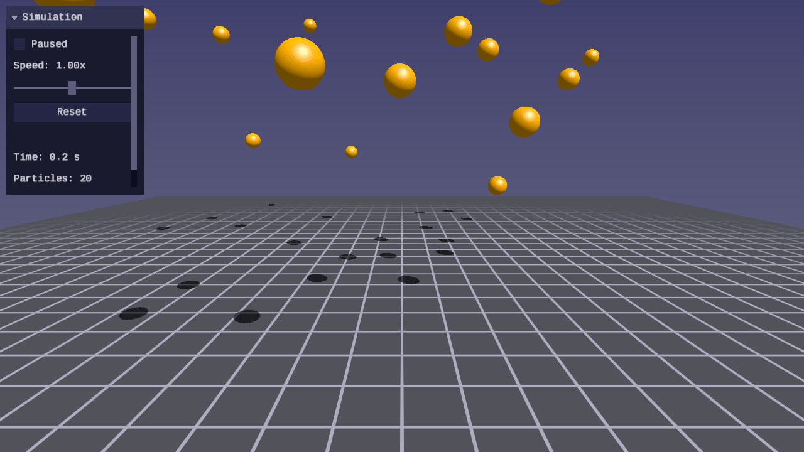
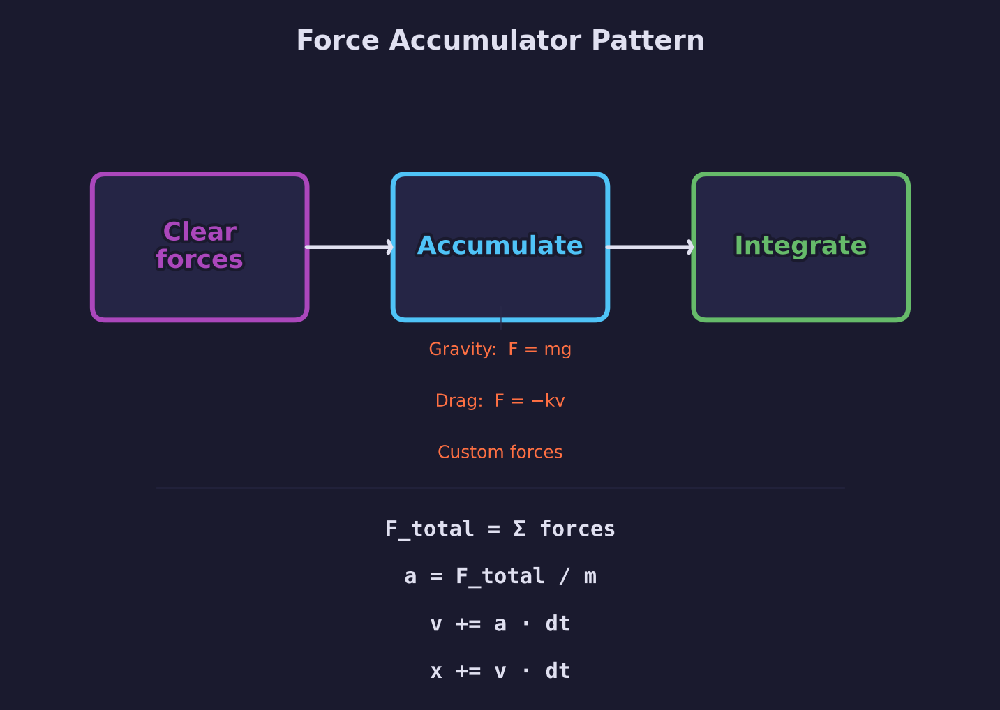
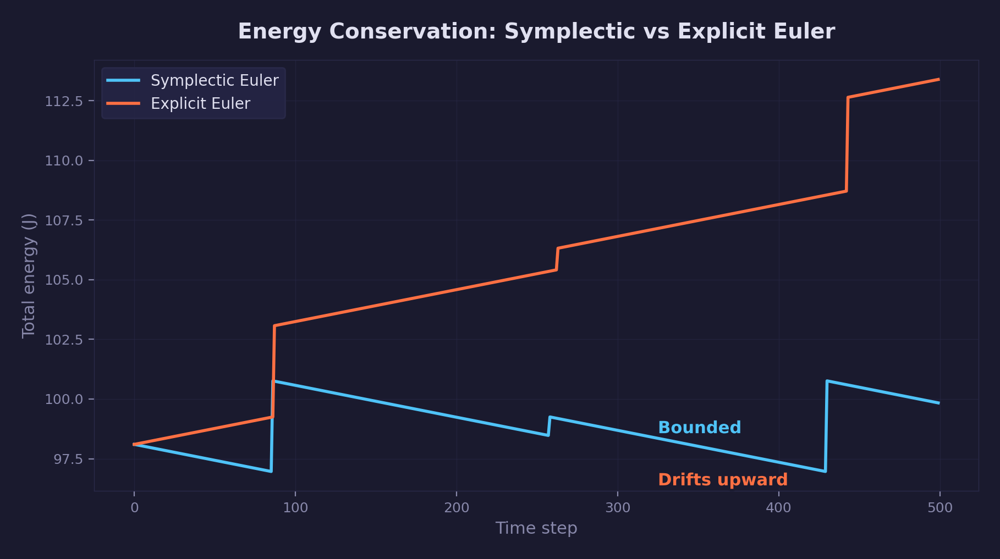
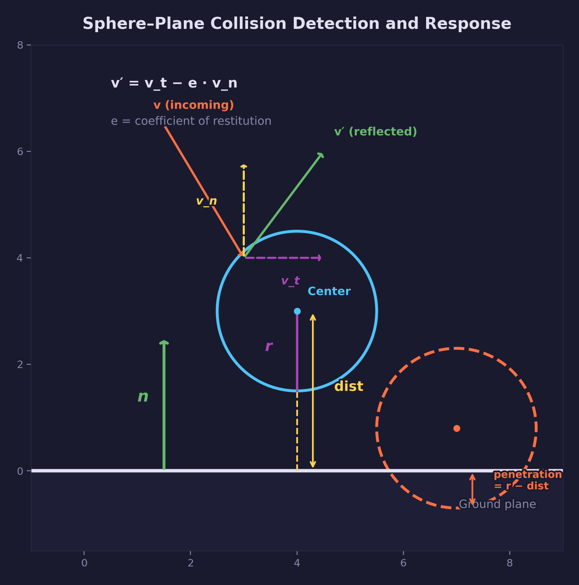

# Physics Lesson 01 -- Point Particles

Symplectic Euler integration, force accumulation, and sphere-plane collision
with restitution -- the foundation of every physics simulation.

## What you'll learn

- How **symplectic Euler integration** advances position and velocity over time
- The **force accumulator pattern** -- applying gravity, drag, and arbitrary
  forces before a single integration step
- Why a **fixed timestep** with accumulator is essential for stable, reproducible
  physics
- **Sphere-plane collision detection** using the signed-distance test
- **Collision response** with velocity reflection and coefficient of restitution
- **Velocity-to-color mapping** as a visual diagnostic for kinetic energy
- The `forge_physics_` API introduced in `common/physics/forge_physics.h`

## Result


Twenty spheres drop from random heights onto a ground plane. Each sphere has a
different coefficient of restitution, so some bounce high while others settle
quickly. Sphere color indicates velocity magnitude: red at rest, yellow at
mid-speed, blue at high speed.

| Screenshot | Animation |
|---|---|
|  |  |

## Controls

| Key | Action |
|---|---|
| WASD / Arrows | Move camera |
| Mouse | Look around |
| Space | Pause / resume simulation |
| R | Reset all particles to initial positions |
| T | Toggle slow motion (half speed) |
| Escape | Release mouse / quit |

## The physics

### Newton's second law and the force accumulator

Every physics engine starts from the same equation:

$$
F = m \cdot a
$$

Rearranged for simulation purposes:

$$
a = \frac{F_{\text{total}}}{m}
$$

Rather than computing acceleration directly, the simulation accumulates all
forces acting on a particle into a single vector (`force_accum`) each timestep.
Gravity, drag, springs, explosions -- every force adds to the accumulator via
the principle of superposition. At integration time, the total force is divided
by mass to produce acceleration.

This is the **force accumulator pattern**: clear, accumulate, integrate.



```c
/* 1. Clear forces from previous step */
forge_physics_clear_forces(&particle);

/* 2. Accumulate forces */
forge_physics_apply_gravity(&particle, gravity);
forge_physics_apply_drag(&particle, drag_coeff);

/* 3. Integrate — divides total force by mass internally */
forge_physics_integrate(&particle, dt);
```

The accumulator approach separates force generation from integration. Each force
generator operates independently, and the integrator does not need to know where
the forces came from.

### Gravity

Gravitational force near a planetary surface is uniform:

$$
F_{\text{gravity}} = m \cdot g
$$

where $g$ is the gravitational acceleration vector, typically
$(0, -9.81, 0)$ m/s^2 for Earth. `forge_physics_apply_gravity` multiplies the
gravity vector by the particle's mass and adds the result to the force
accumulator. When the integrator divides by mass, the acceleration reduces back
to $g$ -- all objects fall at the same rate regardless of mass, as Galileo
demonstrated.

### Drag

Linear drag opposes motion with a force proportional to velocity:

$$
F_{\text{drag}} = -k \cdot v
$$

where $k$ is the drag coefficient. This is a first-order approximation of
aerodynamic resistance, valid for slow-moving objects (Stokes drag). It causes
particles to decelerate smoothly rather than accelerating indefinitely under
gravity. Higher $k$ values produce stronger resistance. The demo uses
$k = 0.02$, which provides a subtle damping effect without visibly slowing the
fall.

### Symplectic Euler integration

Integration advances the simulation by one timestep $\Delta t$. The method
used here is **symplectic Euler** (also called semi-implicit Euler), which
updates velocity *before* position:

$$
v(t + \Delta t) = v(t) + a(t) \cdot \Delta t
$$

$$
x(t + \Delta t) = x(t) + v(t + \Delta t) \cdot \Delta t
$$

The critical detail is in the second equation: position is updated using the
*new* velocity $v(t + \Delta t)$, not the old one. This single change --
compared to explicit (forward) Euler, which uses the old velocity -- makes the
integrator **symplectic**: it preserves the phase-space volume of the system,
which means energy does not drift systematically over time.

Explicit Euler uses the old velocity for the position update:

$$
x_{\text{explicit}}(t + \Delta t) = x(t) + v(t) \cdot \Delta t
$$

This causes energy to grow over time, and the simulation eventually explodes.
Symplectic Euler avoids this failure mode at zero additional cost -- both
methods require the same number of multiplications and additions.



During integration, velocity damping is applied after updating velocity but
before the position update:

$$
v = v \cdot (1 - d)
$$

where $d \in [0, 1]$ is the damping factor. This models energy loss from
unmodeled sources (air resistance beyond linear drag, internal friction). A
damping of 0 preserves all energy; a damping of 1 brings the particle to an
immediate stop.

### Sphere-plane collision

Collision detection determines whether a particle's bounding sphere overlaps
the ground plane. The plane is defined in **Hessian normal form**:

$$
\text{dot}(n, x) = d
$$

where $n$ is the outward unit normal and $d$ is the signed distance from the
origin to the plane along $n$. For a ground plane at $y = 0$ with normal
$(0, 1, 0)$, $d = 0$.



The signed distance from the particle center to the plane surface is:

$$
\text{dist} = \text{dot}(p, n) - d
$$

A collision occurs when $\text{dist} < r$, where $r$ is the sphere radius. The
**penetration depth** is:

$$
\text{penetration} = r - \text{dist}
$$

### Collision response

When a collision is detected, two things happen:

**1. Position correction.** Push the particle out of the plane so its surface
sits exactly on the plane:

$$
p = p + n \cdot \text{penetration}
$$

**2. Velocity reflection.** Decompose velocity into normal and tangential
components, then reflect the normal component scaled by the coefficient of
restitution $e \in [0, 1]$:

$$
v_n = \text{dot}(v, n) \cdot n
$$

$$
v_t = v - v_n
$$

$$
v' = v_t - e \cdot v_n
$$

A restitution of 1.0 is a perfectly elastic bounce -- the particle rebounds
with the same speed it arrived. A restitution of 0.0 is perfectly inelastic --
the normal velocity component is absorbed entirely. The demo assigns each sphere
a restitution between 0.3 and 0.9, so you can observe the full range of
bouncing behavior side by side.

The tangential component $v_t$ is preserved, so particles sliding along the
ground maintain their horizontal motion. (Friction, which would reduce $v_t$,
is introduced in a later lesson.)

### Velocity-to-color mapping

Sphere color encodes velocity magnitude as a visual diagnostic:

| Speed | Color | Meaning |
|---|---|---|
| 0 m/s | Red | At rest |
| 5 m/s | Yellow | Mid-speed |
| 10+ m/s | Blue | High speed |

The mapping interpolates linearly between these stops. This makes it easy to
see which particles are settling (red), which are mid-bounce (yellow), and
which are in free fall (blue).

## The code

### Fixed timestep

Physics must run at a fixed rate, decoupled from the variable rendering frame
rate. The **accumulator pattern** ensures the simulation takes the same number
of fixed-size steps regardless of how fast or slow the display runs:

```c
#define PHYSICS_DT (1.0f / 60.0f)

/* In SDL_AppIterate: */
state->accumulator += render_dt;
while (state->accumulator >= PHYSICS_DT) {
    physics_step(state, PHYSICS_DT);
    state->accumulator -= PHYSICS_DT;
}
float alpha = state->accumulator / PHYSICS_DT;
/* Interpolate: render_pos = lerp(prev_position, position, alpha) */
```

Without a fixed timestep, physics behaves differently at different frame rates
-- objects fall faster on slow machines and slower on fast ones. The
accumulator solves this by consuming time in fixed-size chunks and using the
leftover fraction (`alpha`) to interpolate between the previous and current
physics state for smooth rendering.

The demo also clamps `render_dt` to a maximum of 0.1 seconds to prevent a
large time spike (from alt-tabbing or a debugger pause) from injecting many
physics steps at once, which could cause particles to tunnel through the
ground.

### Simulation step

Each fixed timestep runs three passes over the particle array — forces,
integration, then collision — in that order:

```c
/* Pass 1: accumulate forces */
vec3 gravity = vec3_create(0.0f, GRAVITY_Y, 0.0f);
for (int i = 0; i < NUM_PARTICLES; i++) {
    forge_physics_apply_gravity(&state->particles[i], gravity);
    forge_physics_apply_drag(&state->particles[i], DRAG_COEFF);
}

/* Pass 2: integrate (symplectic Euler) */
for (int i = 0; i < NUM_PARTICLES; i++) {
    forge_physics_integrate(&state->particles[i], PHYSICS_DT);
}

/* Pass 3: collision with ground plane at y = GROUND_Y */
vec3 ground_normal = vec3_create(0.0f, 1.0f, 0.0f);
for (int i = 0; i < NUM_PARTICLES; i++) {
    forge_physics_collide_plane(&state->particles[i],
                                ground_normal, GROUND_Y);
}
```

The pass order matters: forces are accumulated first, then integration converts
them to motion, then collisions correct any penetration. The force accumulator
is cleared automatically by `forge_physics_integrate`.

### Rendering overview

Each particle is drawn as a sphere using geometry from
`common/shapes/forge_shapes.h`. The sphere's model matrix is constructed from
the interpolated position (for smooth motion between physics ticks) and the
particle's radius. Blinn-Phong lighting provides ambient, diffuse, and specular
shading. A directional shadow map adds ground shadows. The grid floor provides
spatial reference. Sphere color is set per-draw based on the velocity-to-color
mapping described above.

For rendering implementation details, see the
[GPU lessons](../../gpu/) -- this lesson focuses on the physics.

## Key concepts

- **Symplectic Euler** -- Updates velocity before position. Same cost as
  explicit Euler but preserves energy over long simulations. The standard
  choice for real-time physics.
- **Force accumulator** -- Decouples force generation from integration.
  Multiple forces add to a single vector; one integration step resolves them
  all.
- **Fixed timestep** -- Physics runs at a constant rate (60 Hz here) regardless
  of frame rate. An accumulator consumes render time in fixed chunks.
  Interpolation smooths the visual result.
- **Coefficient of restitution** -- Controls how much kinetic energy is
  preserved in a bounce. 1.0 = perfectly elastic, 0.0 = perfectly inelastic.
- **Inverse mass** -- Precomputed as `1.0 / mass` at particle creation. A mass
  of zero yields `inv_mass = 0`, making the particle static (unaffected by
  forces). This avoids division-by-zero checks in every force and integration
  function.
- **Velocity damping** -- A per-particle factor $d \in [0, 1]$ that scales
  velocity by $(1 - d)$ each step, modeling unmodeled energy losses.
- **Hessian normal form** -- A plane representation using a unit normal and a
  signed distance from the origin. Compact, efficient for distance queries, and
  the standard representation in collision detection.

## The physics library

This lesson creates `common/physics/forge_physics.h` with the following API:

| Type / Function | Purpose |
|---|---|
| `ForgePhysicsParticle` | Struct: position, prev_position, velocity, force_accum, mass, inv_mass, damping, restitution, radius |
| `forge_physics_particle_create()` | Create a particle with validated initial state (clamps damping, restitution, radius; computes inv_mass) |
| `forge_physics_apply_gravity()` | Add gravitational force ($F = mg$) to the force accumulator |
| `forge_physics_apply_drag()` | Add linear drag force ($F = -kv$) to the force accumulator |
| `forge_physics_apply_force()` | Add an arbitrary force vector to the force accumulator |
| `forge_physics_integrate()` | Advance one timestep via symplectic Euler; clears force accumulator afterward |
| `forge_physics_collide_plane()` | Detect and resolve sphere-plane collision with restitution |
| `forge_physics_clear_forces()` | Zero the force accumulator (for manual use outside the integration cycle) |

The library is header-only and depends on `common/math/forge_math.h` and
`common/containers/forge_containers.h`. All functions are `static inline`.
Static particles (`mass = 0`, `inv_mass = 0`) are skipped by all force and
integration functions.

See: [common/physics/README.md](../../../common/physics/README.md) for the full
API reference.

## Where it's used

- [Math Lesson 01 -- Vectors](../../math/01-vectors/) provides the `vec3`
  type, `vec3_add`, `vec3_scale`, `vec3_dot`, and `vec3_normalize` used
  throughout the physics library
- The rendering baseline (Blinn-Phong lighting, shadow mapping, procedural
  grid) follows patterns from the [GPU lessons](../../gpu/)
- Later physics lessons build on the particle type and integration introduced
  here

## Building

From the repository root:

```bash
cmake -B build
cmake --build build --config Debug
```

Run:

```bash
python scripts/run.py physics/01

# Or directly:
# Windows
build\lessons\physics\01-point-particles\Debug\01-point-particles.exe
# Linux / macOS
./build/lessons/physics/01-point-particles/01-point-particles
```

## Exercises

1. **Change gravity direction.** Set gravity to $(5, -9.81, 0)$ to add a
   sideways component. Observe how particles drift horizontally while falling.
   Try pointing gravity upward -- what happens?

2. **Add a wind force.** Apply a constant horizontal force to all particles
   using `forge_physics_apply_force`. Experiment with different magnitudes and
   directions. How does wind interact with drag?

3. **Compare explicit vs. symplectic Euler.** Modify `forge_physics_integrate`
   to update position using the *old* velocity (before the acceleration update)
   instead of the new velocity. Run the simulation for several minutes and
   observe what happens to the total energy. Switch back and compare.

4. **Tune restitution and damping.** Set all particles to restitution 1.0 and
   damping 0.0 (zero energy loss). Do the particles bounce forever? Now set
   restitution to 0.0 -- how quickly do they settle? Find values that produce
   realistic rubber-ball behavior.

## Further reading

- [Math Lesson 01 -- Vectors](../../math/01-vectors/) -- the vector operations
  underlying every calculation in this lesson
- Millington, *Game Physics Engine Development*, Ch. 3 -- particle physics,
  force accumulators, and integration methods
- Ericson, *Real-Time Collision Detection*, Ch. 5 -- sphere-plane intersection
  and signed distance tests
- Hairer, Lubich, Wanner, *Geometric Numerical Integration* -- the theoretical
  basis for why symplectic integrators conserve energy
