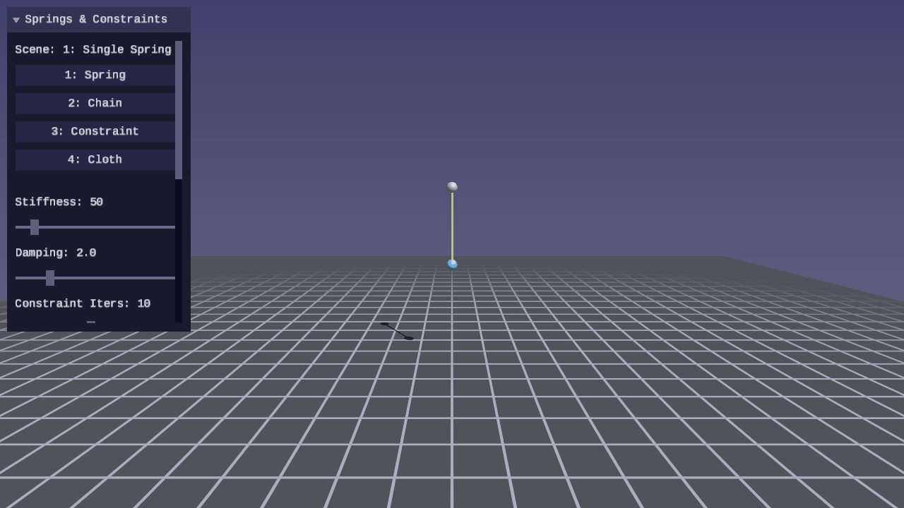
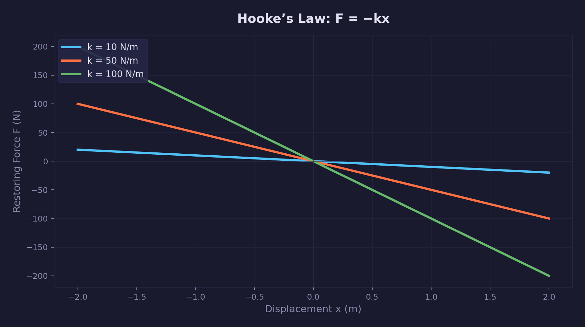
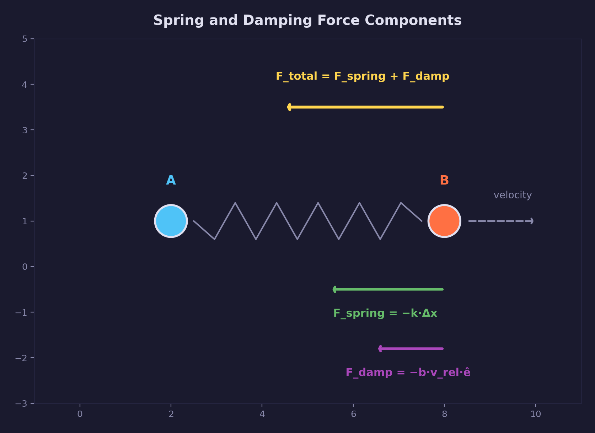
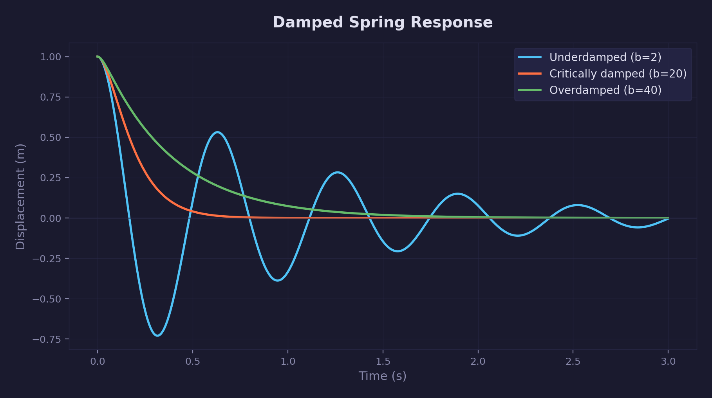
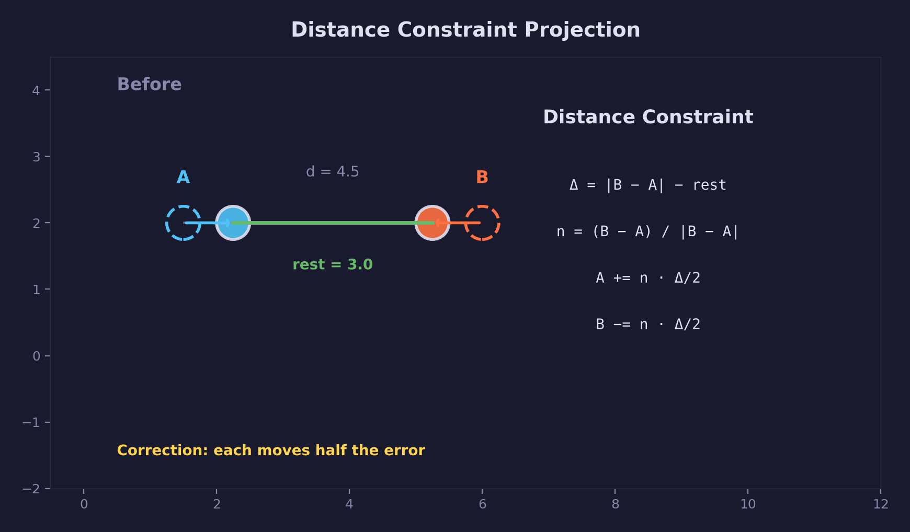
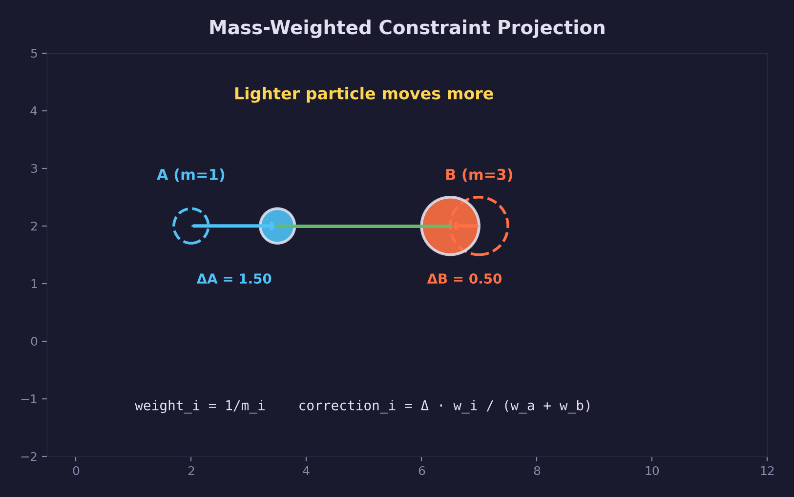
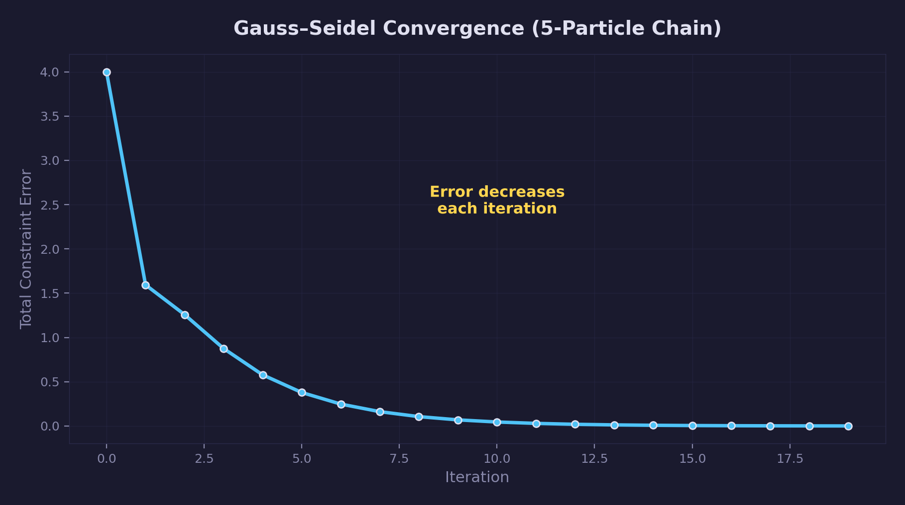
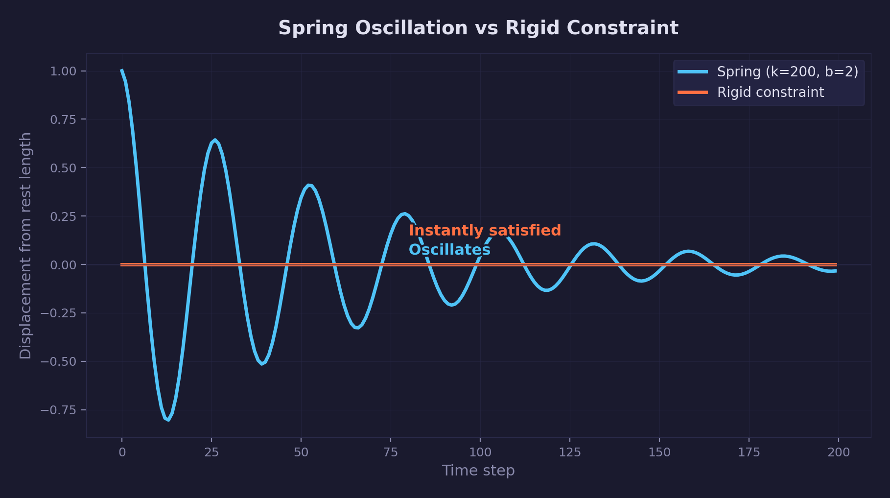
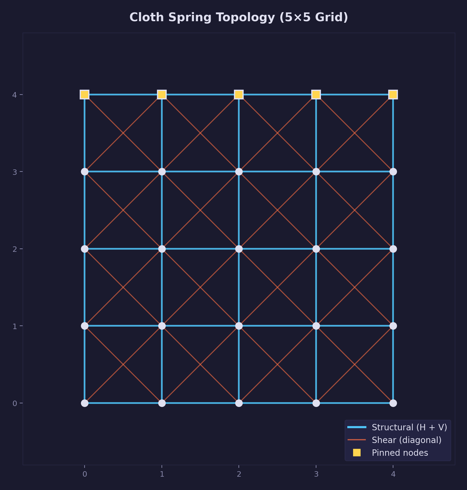

# Physics Lesson 02 -- Springs and Constraints

Hooke's law springs, velocity damping, and position-based distance
constraints -- the building blocks for chains, cloth, ropes, and ragdolls.

## What you'll learn

- How **Hooke's law** produces a restoring force proportional to displacement
- Why **velocity damping along the spring axis** prevents perpetual oscillation
- The difference between **force-based springs** and **position-based
  constraints** -- and when to use each
- How **distance constraints** project particles to a target distance using
  position-based dynamics (PBD)
- Why **mass-weighted correction** ensures lighter particles move more than
  heavier ones
- How the **Gauss-Seidel solver** converges toward the exact solution over
  multiple iterations
- Building a **cloth grid** with structural and shear springs

## Result

| Screenshot | Animation |
|---|---|
|  |  |

Four selectable scenes demonstrate the concepts:

1. **Single spring** -- a fixed anchor and one dynamic particle connected by a
   spring, oscillating under gravity
2. **Spring chain** -- eight particles hanging from a fixed point, connected by
   springs, swaying and settling
3. **Constraint chain** -- same layout using distance constraints instead of
   springs, producing rigid behavior with no oscillation
4. **Cloth grid** -- a 10x10 particle grid with structural (horizontal +
   vertical) and shear (diagonal) springs, forming a simple cloth simulation

## Controls

| Key | Action |
|---|---|
| WASD / Arrows | Move camera |
| Mouse | Look around |
| 1-4 | Select scene |
| P | Pause / resume simulation |
| R | Reset simulation |
| T | Toggle slow motion (1x / 0.25x) |
| Escape | Release mouse / quit |

The UI panel provides real-time sliders for stiffness, damping, constraint
solver iterations, and gravity strength. Particle count, spring count,
constraint count, and kinetic/potential energy are displayed.

## The physics

### Hooke's law

A spring connecting two particles resists changes in distance from its natural
(rest) length. The restoring force is proportional to displacement:

$$
F_{\text{spring}} = k \cdot (|d| - L_0) \cdot \hat{n}
$$

where $k$ is the spring constant (stiffness in N/m), $|d|$ is the current
distance between the particles, $L_0$ is the rest length, and
$\hat{n} = d / |d|$ is the unit direction from particle A to particle B.

- When the spring is **stretched** ($|d| > L_0$), the force pulls the
  particles together
- When the spring is **compressed** ($|d| < L_0$), the force pushes them apart
- At rest length ($|d| = L_0$), the force is zero

Higher stiffness values produce stronger restoring forces and faster
oscillation. The relationship between force and displacement is linear --
doubling the displacement doubles the force.



### Velocity damping along the spring axis

Without damping, a spring oscillates indefinitely. To dissipate energy, a
damping force opposes relative motion along the spring axis:

$$
F_{\text{damp}} = b \cdot \text{dot}(v_{\text{rel}}, \hat{n}) \cdot \hat{n}
$$

where $b$ is the damping coefficient (in Ns/m) and
$v_{\text{rel}} = v_B - v_A$ is the relative velocity of the two particles.
The damping force is projected onto the spring direction $\hat{n}$ so it only
opposes stretching/compression motion, not lateral movement.

The total spring force applied to each particle is:

$$
F_{\text{total}} = F_{\text{spring}} + F_{\text{damp}}
$$

By Newton's third law, particle A receives $+F_{\text{total}}$ and particle B
receives $-F_{\text{total}}$ (equal and opposite).



### Damping regimes

The interplay of stiffness $k$, damping $b$, and mass $m$ determines how a
spring-mass system behaves:

- **Underdamped** ($b < 2\sqrt{km}$) -- oscillates with decreasing amplitude
- **Critically damped** ($b = 2\sqrt{km}$) -- returns to rest in minimum time
  without oscillating
- **Overdamped** ($b > 2\sqrt{km}$) -- returns to rest slowly without
  oscillating

The critical damping value $b_c = 2\sqrt{km}$ is the boundary. In the demo,
you can observe these regimes by adjusting the stiffness and damping sliders.



### Distance constraints (position-based dynamics)

Springs are force-based: they add forces to the accumulator, which are
integrated into velocity and then position. This produces natural oscillation
but can be unstable at high stiffness values.

**Distance constraints** take a different approach: they directly move
particles to satisfy the target distance. This is **position-based dynamics**
(PBD), introduced by Müller et al. (2006). The algorithm:

1. Compute the current distance $|d|$ between the two particles
2. Compute the error: $\Delta = |d| - L_{\text{target}}$
3. Scale by constraint stiffness: $c = s \cdot \Delta \cdot \hat{n}$
4. Distribute the correction between particles proportionally to their inverse
   masses

$$
p_A = p_A + \frac{w_A}{w_A + w_B} \cdot c
$$

$$
p_B = p_B - \frac{w_B}{w_A + w_B} \cdot c
$$

where $w = 1/m$ is the inverse mass. A static particle ($w = 0$) does not
move; the other particle absorbs the full correction.



### Mass-weighted correction

The correction is distributed inversely proportional to mass. A lighter
particle moves more because it has a larger inverse mass:

- **Equal masses** ($m_A = m_B$): each particle moves half the error
- **Unequal masses**: the lighter particle moves a larger fraction

This preserves the center of mass of the system and produces physically
plausible behavior -- a heavy anchor barely moves while a light particle snaps
into place.



### Gauss-Seidel solver

When multiple constraints share particles (as in a chain or cloth), satisfying
one constraint may violate another. The **Gauss-Seidel** approach solves this
by iterating: each pass applies all constraints sequentially, using the
updated positions from previous corrections within the same pass.

More iterations produce results closer to the exact solution. In practice,
4-10 iterations are sufficient for most real-time applications. The error
decreases monotonically with each iteration.



```c
/* Solve all constraints with 10 iterations */
forge_physics_constraints_solve(constraints, num_constraints,
                                particles, num_particles, 10);
```

The Gauss-Seidel method converges faster than **Jacobi iteration** (which
applies all corrections simultaneously using only the old positions) because
each constraint immediately benefits from corrections made earlier in the same
pass.

### Springs vs. constraints

| Property | Spring (force-based) | Constraint (position-based) |
|---|---|---|
| Behavior | Oscillates around rest length | Snaps to target distance |
| Stiffness | Continuous (N/m) | Binary: soft (0) to rigid (1) |
| Stability | Can explode at high stiffness | Always stable |
| Use case | Elastic connections (bungee, trampoline) | Rigid connections (rope, chain, cloth) |



### Cloth topology

The cloth scene uses a 10x10 particle grid with two types of spring
connections:

- **Structural springs** (horizontal + vertical) maintain the grid shape
- **Shear springs** (diagonal) prevent the cloth from collapsing into a
  diagonal line

Shear springs use half the stiffness and damping of structural springs, since
they represent a weaker resistance to deformation.



The top row of particles is fixed (mass = 0), acting as pins. Gravity pulls the
cloth downward, and the springs resist, producing a natural draping behavior.

## The code

### Spring application

The spring force computation follows Hooke's law with velocity damping:

```c
/* Direction from A to B */
vec3 d = vec3_sub(pb->position, pa->position);
float dist = vec3_length(d);
vec3 n = vec3_scale(d, 1.0f / dist);

/* Hooke's law: F = k * (distance - rest_length) */
float f_spring = spring->stiffness * (dist - spring->rest_length);

/* Velocity damping along the spring axis */
vec3 v_rel = vec3_sub(pb->velocity, pa->velocity);
float f_damp = spring->damping * vec3_dot(v_rel, n);

/* Total force, applied equally and oppositely */
vec3 force = vec3_scale(n, f_spring + f_damp);
pa->force_accum = vec3_add(pa->force_accum, force);   /* toward B */
pb->force_accum = vec3_sub(pb->force_accum, force);   /* toward A */
```

Static particles (inv_mass == 0) do not accumulate forces but still
participate in distance and direction calculations, letting you anchor a spring
to a fixed point.

### Constraint solving

Distance constraint projection moves particles directly:

```c
vec3 d = vec3_sub(pb->position, pa->position);
float dist = vec3_length(d);
vec3 n = vec3_scale(d, 1.0f / dist);

float error = dist - constraint->distance;
vec3 correction = vec3_scale(n, constraint->stiffness * error);

float w_total = pa->inv_mass + pb->inv_mass;
float w_a = pa->inv_mass / w_total;
float w_b = pb->inv_mass / w_total;

pa->position = vec3_add(pa->position, vec3_scale(correction, w_a));
pb->position = vec3_sub(pb->position, vec3_scale(correction, w_b));
```

### Fixed timestep with spring/constraint interleaving

The simulation loop runs forces, integration, constraint solving, and
collision in sequence within each fixed timestep:

```c
while (accumulator >= PHYSICS_DT) {
    /* 1. Accumulate forces (gravity, drag, springs) */
    /* 2. Integrate (symplectic Euler) */
    /* 3. Solve distance constraints (Gauss-Seidel) */
    /* 4. Ground plane collision */
    accumulator -= PHYSICS_DT;
}
```

Constraints are solved *after* integration so they correct the positions
produced by force-based motion. This ordering ensures constraints have the
final say on particle positions each step.

## Key concepts

- **Hooke's law** -- $F = k \cdot \Delta x$. The restoring force is
  proportional to displacement from rest length. Named after Robert Hooke
  (1678).
- **Velocity damping** -- A force opposing relative motion along the spring
  axis. Dissipates energy and prevents perpetual oscillation.
- **Position-based dynamics** -- Directly projecting positions to satisfy
  constraints, rather than applying forces. Introduced by Müller et al. (2006).
- **Mass-weighted correction** -- Distributing constraint corrections inversely
  proportional to mass so lighter objects move more.
- **Gauss-Seidel iteration** -- Solving constraints sequentially, using updated
  positions from earlier constraints within the same pass. Converges faster
  than Jacobi iteration.
- **Structural vs. shear springs** -- Horizontal/vertical springs maintain grid
  shape; diagonal springs prevent shearing collapse.

## The physics library

This lesson extends `common/physics/forge_physics.h` with the following API:

| Type / Function | Purpose |
|---|---|
| `ForgePhysicsSpring` | Struct: particle indices (a, b), rest_length, stiffness (k), damping (b) |
| `ForgePhysicsDistanceConstraint` | Struct: particle indices (a, b), target distance, stiffness [0..1] |
| `forge_physics_spring_create()` | Create a spring with clamped non-negative parameters |
| `forge_physics_spring_apply()` | Apply Hooke's law + velocity damping to two particles |
| `forge_physics_constraint_distance_create()` | Create a distance constraint with stiffness clamped to [0, 1] |
| `forge_physics_constraint_solve_distance()` | Project two particles toward a target distance (mass-weighted) |
| `forge_physics_constraints_solve()` | Gauss-Seidel multi-pass solver for multiple distance constraints |

The library remains header-only and handles degenerate cases (coincident
particles, out-of-bounds indices, both-static pairs) safely.

See: [common/physics/README.md](../../../common/physics/README.md) for the full
API reference.

## Where it's used

- [Physics Lesson 01 -- Point Particles](../01-point-particles/) introduces the
  particle type, integration, and collision that this lesson builds on
- [Math Lesson 01 -- Vectors](../../math/01-vectors/) provides the `vec3`
  operations used throughout (add, sub, scale, dot, normalize, length)
- The rendering baseline uses [forge_scene.h](../../../common/scene/) for
  Blinn-Phong lighting, shadow mapping, and procedural grid
- Later physics lessons use springs and constraints for ragdolls, soft bodies,
  and rope simulation

## Building

From the repository root:

```bash
cmake -B build
cmake --build build --config Debug
```

Run:

```bash
python scripts/run.py physics/02

# Or directly:
# Windows
build\lessons\physics\02-springs-and-constraints\Debug\02-springs-and-constraints.exe
# Linux / macOS
./build/lessons/physics/02-springs-and-constraints/02-springs-and-constraints
```

## What's next

Physics Lesson 03 -- Particle Collisions adds sphere-sphere collision
detection and impulse-based response, building toward rigid body dynamics.

## Exercises

1. **Add a second anchor to the cloth.** Pin the bottom-right corner of the
   cloth grid (in addition to the top row) and observe how the draping behavior
   changes. Try pinning just the two top corners instead of the entire top row.

2. **Mix springs and constraints.** Create a chain where the first half uses
   springs and the second half uses distance constraints. Observe the boundary
   between the springy and rigid sections.

3. **Tune the Gauss-Seidel solver.** Set constraint iterations to 1 and observe
   how the chain stretches under gravity. Increase to 5, 10, and 20. At what
   iteration count does the chain appear rigid? What is the visual cost of
   extra iterations?

4. **Add bend resistance.** Connect every other particle in the chain with a
   weaker spring (skip one particle). This resists bending and makes the chain
   behave more like a stiff rope. Experiment with the bend spring stiffness
   relative to the structural springs.

## Further reading

- [Physics Lesson 01 -- Point Particles](../01-point-particles/) -- integration,
  forces, and collision foundations
- Millington, *Game Physics Engine Development*, Ch. 6 -- springs, anchored
  springs, and spring-like force generators
- Müller et al., "Position Based Dynamics" (2006) -- the PBD framework for
  constraint projection
- Jakobsen, "Advanced Character Physics" (GDC 2001) -- Verlet integration with
  distance constraints, the foundation of Hitman's ragdoll system
