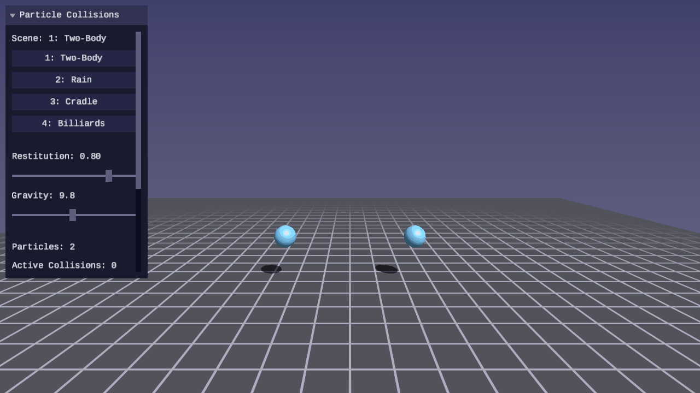
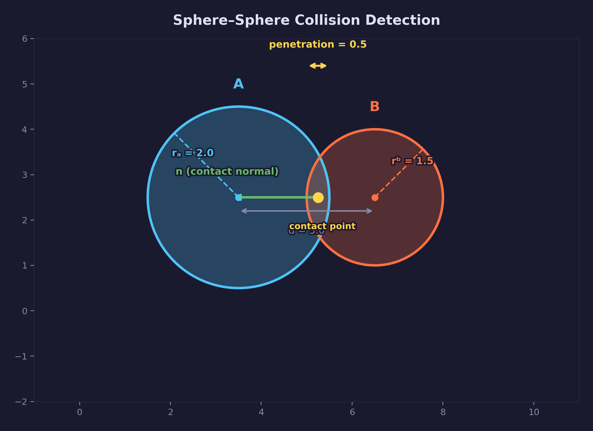
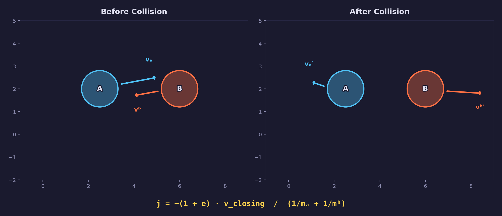
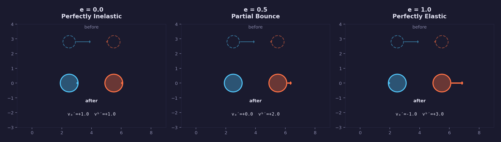
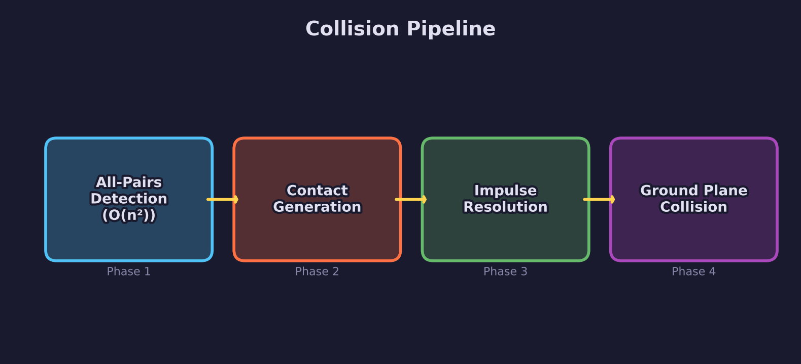
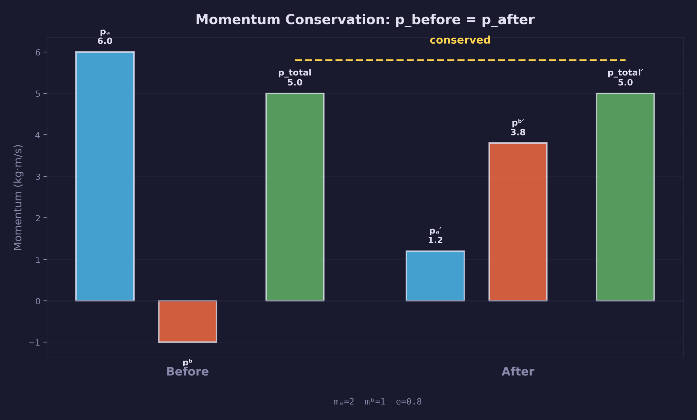

# Physics Lesson 03 -- Particle Collisions

Sphere-sphere collision detection and impulse-based response -- the first
inter-particle collision lesson in the physics track.

## What you'll learn

- How to **detect sphere-sphere overlap** using a distance check against the
  sum of radii
- How **impulse-based collision response** works -- deriving the impulse
  magnitude from Newton's restitution law and conservation of momentum
- What the **coefficient of restitution** controls and how it interpolates
  between perfectly elastic and perfectly inelastic collisions
- How **momentum is conserved** in every collision and how **kinetic energy**
  is either preserved (elastic) or lost to deformation (inelastic)
- How to structure an **O(n²) collision pipeline** with detection, impulse
  resolution, and positional correction phases

## Result

| Screenshot | Animation |
|---|---|
|  |  |

Four selectable scenes demonstrate the concepts:

1. **Two-Body** -- head-on elastic collision between two equal-mass particles,
   showing velocity exchange and momentum conservation
2. **Particle Rain** -- 30 particles falling under gravity, colliding with each
   other and the ground plane
3. **Newton's Cradle** -- 5 pendulums connected by distance constraints,
   demonstrating momentum transfer through a chain of elastic collisions
4. **Billiard Break** -- a triangle formation of 15 balls hit by a cue ball,
   with low gravity and high drag for a billiard-table feel

## Controls

| Key | Action |
|---|---|
| WASD / Arrows | Move camera |
| Mouse | Look around |
| 1-4 | Select scene |
| P | Pause / resume simulation |
| R | Reset simulation |
| T | Toggle slow motion (1x / 0.25x) |
| Escape | Release mouse / quit |

The UI panel provides real-time sliders for restitution and gravity strength.
Particle count, active collisions, kinetic energy, and total momentum magnitude
are displayed.

## The physics

### Sphere-sphere detection

Two spheres overlap when the distance between their centers is less than the
sum of their radii. Given particles A and B with positions $p_A$, $p_B$ and
radii $r_A$, $r_B$:

$$
d = p_A - p_B
$$

$$
\text{overlap} \iff |d| < r_A + r_B
$$

When overlap is detected, the collision produces three values:

- **Normal**: $\hat{n} = d / |d|$, the unit direction from B toward A
- **Penetration depth**: $\delta = (r_A + r_B) - |d|$, how far the spheres
  overlap
- **Contact point**: the midpoint of the overlap region along the normal



The distance check uses squared distances first ($|d|^2 < (r_A + r_B)^2$) to
avoid the square root when spheres are clearly separated. The square root is
only computed for actual collisions.

Edge cases handled by the library:

- **Coincident centers** ($|d| < \epsilon$): an arbitrary upward normal
  $(0, 1, 0)$ is used to resolve the degenerate case deterministically
- **Zero-radius particles**: no collision possible, returns immediately
- **Both static** (inv_mass == 0 for both): skipped, since neither can move

### Impulse-based response

When two particles collide, an impulse is applied along the contact normal to
change their velocities so they separate. The derivation follows from two
physical laws: **conservation of momentum** and **Newton's restitution law**.

The relative velocity of A with respect to B:

$$
v_{rel} = v_A - v_B
$$

The closing velocity is the component of relative velocity along the contact
normal:

$$
v_{closing} = v_{rel} \cdot \hat{n}
$$

A negative closing velocity means the particles are approaching; a positive
value means they are already separating (no impulse needed).

Newton's restitution law states that the post-collision closing velocity is:

$$
v'_{closing} = -e \cdot v_{closing}
$$

where $e$ is the coefficient of restitution. Combining this with conservation
of momentum gives the impulse magnitude:

$$
j = \frac{-(1 + e) \cdot v_{closing}}{m_A^{-1} + m_B^{-1}}
$$

The velocity updates are then:

$$
v_A' = v_A + j \cdot m_A^{-1} \cdot \hat{n}
$$

$$
v_B' = v_B - j \cdot m_B^{-1} \cdot \hat{n}
$$

The impulse is distributed proportionally to inverse mass -- a lighter particle
receives a larger velocity change, while a heavier particle barely moves.



After velocity resolution, a **positional correction** pushes the particles
apart to eliminate the overlap. The correction is also distributed by inverse
mass ratio:

$$
p_A' = p_A + \frac{m_A^{-1}}{m_A^{-1} + m_B^{-1}} \cdot \delta \cdot \hat{n}
$$

$$
p_B' = p_B - \frac{m_B^{-1}}{m_A^{-1} + m_B^{-1}} \cdot \delta \cdot \hat{n}
$$

This ensures particles never remain overlapping at the end of a physics step.

### Coefficient of restitution

The coefficient of restitution $e$ controls how much kinetic energy is
preserved in a collision:

- **$e = 1$** (perfectly elastic): all kinetic energy is preserved. The
  particles bounce off with the same total speed they approached with. A
  billiard ball collision is close to $e = 1$.
- **$e = 0$** (perfectly inelastic): maximum kinetic energy is lost. The
  particles do not bounce -- they separate with zero relative closing velocity
  along the normal. A lump of clay hitting a wall is close to $e = 0$.
- **$0 < e < 1$** (partially inelastic): some energy is lost to deformation,
  heat, or sound. Most real-world collisions fall in this range.



When two particles have different restitution values, the library uses the
minimum of the two. This ensures that a perfectly inelastic object ($e = 0$)
dominates -- if you drop a rubber ball onto wet clay, the clay wins.

**Resting threshold**: when the closing velocity is below 0.5 m/s, restitution
is set to zero regardless of the particle's $e$ value. This prevents
micro-bouncing (jitter) when particles settle under gravity. Without this
threshold, a ball resting on the ground would bounce imperceptibly forever.

### Collision pipeline

Each physics step runs the collision system in distinct phases:

1. **All-pairs detection** -- iterate over every unique pair $(i, j)$ where
   $j > i$, testing sphere-sphere overlap. This is $O(n^2)$ in the number
   of particles.
2. **Contact generation** -- for each overlapping pair, compute the contact
   normal, penetration depth, and contact point. Store the result in a
   contact buffer.
3. **Impulse resolution** -- iterate over all contacts, computing and applying
   the impulse to both particles in each pair. Positional correction is applied
   in the same pass.
4. **Ground plane collision** -- each particle is tested against the ground
   plane independently.



In the library, `forge_physics_collide_sphere_sphere()` combines detection and
contact generation into a single function -- when overlap is found, it fills
the contact immediately. The diagram separates them conceptually because they
are distinct steps in the algorithm, even though the implementation fuses them
for efficiency.

The all-pairs approach is simple and correct for small particle counts (up to
~50). For larger scenes, a spatial partitioning structure (uniform grid, octree)
reduces detection to approximately $O(n)$ by only testing nearby pairs -- this
is covered in a later lesson.

The contact buffer has a fixed capacity (`FORGE_PHYSICS_MAX_CONTACTS = 256`).
For $n$ particles, the theoretical maximum number of simultaneous contacts is
$n(n-1)/2$. If the buffer fills, additional contacts are silently dropped.

### Momentum conservation

In every collision, total momentum is conserved:

$$
p_{before} = m_A \cdot v_A + m_B \cdot v_B = m_A \cdot v_A' + m_B \cdot v_B' = p_{after}
$$

This is a direct consequence of Newton's third law -- the impulse applied to A
is equal and opposite to the impulse applied to B. The UI panel displays the
total momentum magnitude of the system so you can verify conservation in real
time.



**Energy** behaves differently depending on $e$:

- **Elastic** ($e = 1$): total kinetic energy is preserved.
  $KE_{before} = KE_{after}$.
- **Inelastic** ($e < 1$): kinetic energy is lost. The lost energy goes into
  deformation, heat, or sound -- not modeled explicitly, but the velocity
  reduction accounts for it.

In Scene 1 (Two-Body), two equal-mass particles exchange velocities in a
head-on elastic collision. This is a well-known result: with equal masses and
$e = 1$, particle A stops and particle B moves away with A's original velocity.

In Scene 3 (Newton's Cradle), momentum transfers through a chain of elastic
collisions. The leftmost ball strikes the row, stops, and the rightmost ball
swings out -- conserving both momentum and kinetic energy through the chain.

## The code

### Scene setup

Four scene initializers populate the particle array with different
configurations:

- `init_scene_1()` -- two particles at $(\pm 3, 2, 0)$ with opposing
  velocities
- `init_scene_2()` -- 30 particles at random positions using a seeded LCG
  random number generator for deterministic placement
- `init_scene_3()` -- 5 anchor-ball pairs connected by distance constraints,
  with the leftmost ball offset and given initial velocity
- `init_scene_4()` -- a triangle formation of 15 balls plus a cue ball,
  using equilateral row spacing ($\cos 30° \approx 0.866$)

Each initializer stores a copy of the initial state for reset support.

### Physics step

The main loop drains the accumulator by calling `physics_step()` once per
fixed-timestep tick. Each call runs one iteration:

```c
/* In SDL_AppIterate: */
while (accumulator >= PHYSICS_DT) {
    physics_step(state);     /* one fixed-timestep iteration */
    accumulator -= PHYSICS_DT;
}

/* physics_step() executes these phases in order: */
/* 1. Apply gravity and drag to all dynamic particles */
/* 2. Integrate (symplectic Euler) */
/* 3. Solve distance constraints (Newton's cradle ropes) */
/* 4. Detect and resolve all sphere-sphere collisions */
/* 5. Ground plane collision */
```

Integration uses symplectic Euler, introduced in
[Physics Lesson 01](../01-point-particles/).

Collision detection and resolution are combined in a single call to
`forge_physics_collide_particles_step()`, which runs the all-pairs detection
followed by impulse resolution. The number of active contacts is returned
and displayed in the UI.

Scene 4 (Billiard Break) uses reduced gravity ($1.0\ \text{m/s}^2$) and
increased drag ($0.3$) to keep particles on the ground plane, simulating a
flat table surface.

### UI panel

The UI panel provides:

- Scene selection buttons (1-4)
- Restitution slider (0.0 to 1.0, default 0.8)
- Gravity slider (0.0 to 20.0, default 9.81)
- Live readouts: particle count, active collisions, kinetic energy, total
  momentum magnitude, and FPS
- Pause, slow motion, and reset controls

Newton's Cradle (Scene 3) overrides the restitution slider to $e = 1.0$ to
ensure perfectly elastic collisions, which are required for correct momentum
transfer through the chain.

## Key concepts

- **Sphere-sphere detection** -- two spheres overlap when the distance between
  their centers is less than the sum of their radii. The contact normal points
  from B toward A.
- **Impulse** -- an instantaneous change in momentum applied along the contact
  normal. The magnitude depends on the closing velocity, restitution, and
  inverse masses.
- **Coefficient of restitution** -- $e \in [0, 1]$ controls the ratio of
  post-collision to pre-collision closing velocity. $e = 1$ is elastic,
  $e = 0$ is inelastic.
- **Positional correction** -- after velocity resolution, overlapping particles
  are pushed apart proportionally to inverse mass to prevent persistent overlap.
- **Resting threshold** -- closing velocities below 0.5 m/s are treated as
  inelastic to prevent micro-bouncing jitter.
- **Conservation of momentum** -- total momentum is preserved in every
  collision because the impulse applied to A is equal and opposite to the
  impulse applied to B.

## The physics library

This lesson extends `common/physics/forge_physics.h` with the following API:

| Type / Function | Purpose |
|---|---|
| `ForgePhysicsContact` | Struct: normal, contact point, penetration depth, particle indices (a, b) |
| `FORGE_PHYSICS_MAX_CONTACTS` | Maximum contact buffer capacity (256) |
| `FORGE_PHYSICS_RESTING_THRESHOLD` | Closing velocity below which restitution is zeroed (0.5 m/s) |
| `forge_physics_collide_sphere_sphere()` | Test two particles for sphere-sphere overlap; fill contact on hit |
| `forge_physics_resolve_contact()` | Apply impulse response and positional correction for one contact |
| `forge_physics_resolve_contacts()` | Resolve an array of contacts in a single pass |
| `forge_physics_collide_particles_all()` | O(n²) all-pairs detection; returns contact count |
| `forge_physics_collide_particles_step()` | Detection + resolution in one call; returns contact count |

The library remains header-only, allocates no heap memory, and handles
degenerate cases (coincident centers, zero-radius particles, both-static pairs)
safely.

See: [common/physics/README.md](../../../common/physics/README.md) for the full
API reference.

## Where it's used

- [Physics Lesson 01 -- Point Particles](../01-point-particles/) introduces the
  particle type, integration, and ground-plane collision that this lesson builds on
- [Physics Lesson 02 -- Springs and Constraints](../02-springs-and-constraints/)
  provides the distance constraints used for Newton's Cradle pendulums
- [Math Lesson 01 -- Vectors](../../math/01-vectors/) provides the `vec3`
  operations used throughout (add, sub, scale, dot, normalize, length)
- The rendering baseline uses [forge_scene.h](../../../common/scene/) for
  Blinn-Phong lighting, shadow mapping, and procedural grid
- Later physics lessons use impulse-based collision as the foundation for
  rigid body dynamics and stacking

## Building

From the repository root:

```bash
cmake -B build
cmake --build build --config Debug
```

Run:

```bash
python scripts/run.py physics/03

# Or directly:
# Windows
build\lessons\physics\03-particle-collisions\Debug\03-particle-collisions.exe
# Linux / macOS
./build/lessons/physics/03-particle-collisions/03-particle-collisions
```

## What's next

Physics Lesson 04 adds rigid body rotation -- angular velocity, torque, and
moment of inertia -- extending particles from points to oriented shapes.

## Exercises

1. **Add friction.** During collision resolution, compute the tangential
   component of relative velocity (perpendicular to the contact normal) and
   apply a damping impulse that reduces it. Start with a friction coefficient
   of 0.3 and observe how particles slow down after glancing collisions.

2. **Implement a spatial grid for broad-phase.** Divide the world into a
   uniform grid of cells. Each frame, assign particles to cells based on
   position, then only test pairs within the same cell (and neighboring cells).
   Compare the number of pair tests against the brute-force $O(n^2)$ approach.

3. **Add particle trails.** Store the last 20 positions for each particle in a
   circular buffer. Render the trail as a line strip or series of small
   spheres with decreasing opacity. This makes collision trajectories visible.

4. **Create a pool table scene.** Add four wall planes (left, right, front,
   back) using `forge_physics_collide_plane()` and arrange balls in a diamond
   formation. Give the cue ball an angled initial velocity and observe how
   walls contain the action.

5. **Experiment with mass ratios.** In Scene 1, change one particle's mass to
   10x the other. Observe how the impulse distribution changes -- the heavy
   particle barely deflects while the light particle flies away. Verify that
   momentum is still conserved by checking the UI readout.

## Further reading

- [Physics Lesson 01 -- Point Particles](../01-point-particles/) -- integration,
  forces, and ground-plane collision foundations
- [Physics Lesson 02 -- Springs and Constraints](../02-springs-and-constraints/) --
  Hooke's law, distance constraints, and the Gauss-Seidel solver
- Millington, *Game Physics Engine Development*, Ch. 7 -- generating contacts
  and impulse-based resolution for particle collisions
- Ericson, *Real-Time Collision Detection*, Ch. 4 -- sphere-sphere intersection
  tests and bounding volume overlap
- Baraff & Witkin, "Physically Based Modeling" (SIGGRAPH 1997 course notes) --
  impulse derivation for frictionless and frictional collisions
