# Physics Lesson 04 -- Rigid Body State and Orientation

The step from particles to rigid bodies: adding orientation, angular velocity,
torque, and moment of inertia to the physics state so that objects can tumble,
spin, and precess under applied forces.

## What you'll learn

- How to extend the particle state with **orientation** (quaternion),
  **angular velocity**, and **torque accumulators**
- What the **moment of inertia tensor** is and why it differs from mass --
  resistance to angular acceleration depends on how mass is distributed
- How to compute inertia tensors analytically for boxes, spheres, and
  cylinders, and why the tensor is diagonal for axis-aligned primitives
- Why **quaternions** are the correct representation for 3D orientation --
  no gimbal lock, compact storage, and a clean derivative formula
- How to integrate angular velocity by updating the quaternion each step
  using the quaternion derivative $\dot{q} = \frac{1}{2} \omega_q \cdot q$
- How **torque** arises from a force applied at an offset from the center of
  mass: $\tau = r \times F$
- How the inertia tensor transforms from body space to world space:
  $I_{world} = R \, I_{local} \, R^T$
- What **gyroscopic precession** is and why a spinning disc under gravity
  rotates around the vertical axis instead of falling

## Result

| Screenshot | Animation |
|---|---|
|  | 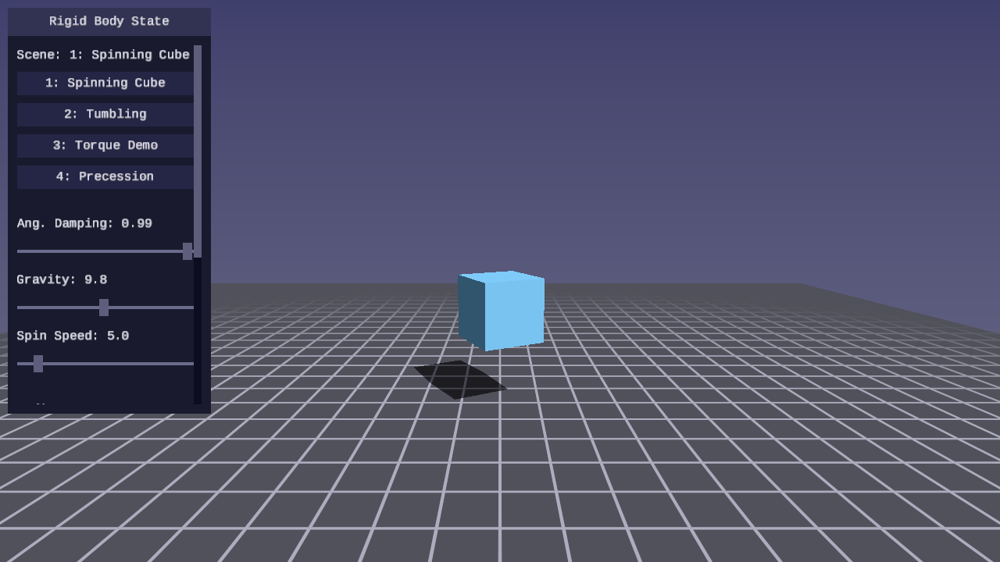 |

Four selectable scenes demonstrate the concepts:

1. **Spinning Cube** -- a cube hovering with initial angular velocity and no
   gravity, demonstrating pure quaternion integration and orientation drift
2. **Tumbling Shapes** -- a box, sphere, and cylinder of equal mass, launched
   upward with different initial angular velocities, tumbling under gravity
   with different inertia tensors producing visibly different rotation rates
3. **Torque Demo** -- a non-uniform box with arrow-key controls that apply
   torque along the world axes, letting you feel how the inertia tensor shape
   affects angular response
4. **Gyroscopic Precession** -- a spinning disc tilted slightly off vertical,
   showing the precession that arises from the coupling between angular
   momentum and applied torque

## Controls

| Key | Action |
|---|---|
| WASD / Mouse | Camera movement / look |
| 1-4 | Select scene |
| Arrow keys | Apply torque (Scene 3) |
| P | Pause / resume simulation |
| R | Reset simulation |
| T | Toggle slow motion (1x / 0.25x) |
| Escape | Release mouse / quit |

The UI panel displays angular velocity magnitude, total kinetic energy
(linear and rotational), applied torque, and FPS.

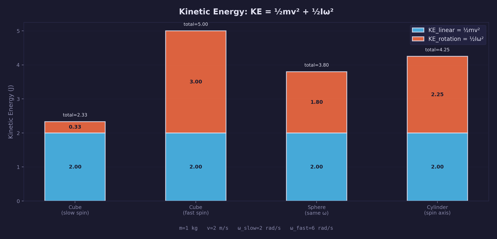

## The physics

### From particles to rigid bodies

A particle has three degrees of freedom: position $(x, y, z)$. A rigid body
has six: three for translation and three for rotation. The additional state
required is:

- **Orientation** -- where the body is pointing, represented as a quaternion $q$
- **Angular velocity** -- the axis and rate of spin, a vector $\omega$ in world
  space (rad/s)
- **Torque accumulator** -- the sum of all rotational forces applied this step,
  analogous to the force accumulator for linear motion

Everything else -- mass, velocity, force accumulator, position -- carries over
unchanged from the particle system in
[Physics Lesson 01](../01-point-particles/).

### Rigid body state

The complete state of a rigid body at any instant:

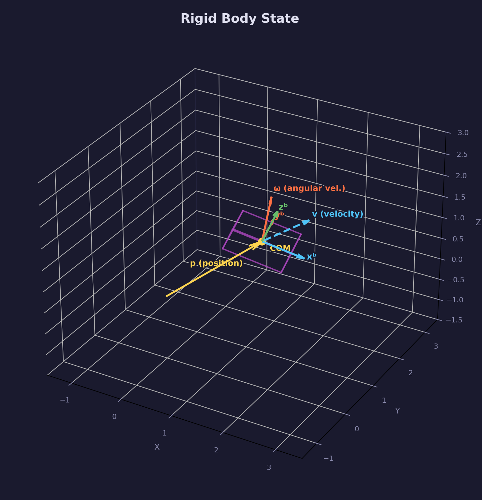

| Variable | Symbol | Type | Description |
|---|---|---|---|
| Position | $p$ | `vec3` | World-space center of mass |
| Velocity | $v$ | `vec3` | Linear velocity (m/s) |
| Orientation | $q$ | `quat` | Body-to-world rotation, unit quaternion |
| Angular velocity | $\omega$ | `vec3` | World-space rotation axis × rate (rad/s) |
| Force accumulator | $F$ | `vec3` | Sum of forces applied this step |
| Torque accumulator | $\tau$ | `vec3` | Sum of torques applied this step |
| Mass | $m$ | `float` | Scalar (kg); 0 means static/infinite mass |
| Inertia tensor (body) | $I_{local}$ | `mat3` | Diagonal in body space |

The force and torque accumulators are zeroed at the end of each physics step.
External systems (gravity, springs, user input) write into them during the
step.

### Inertia tensor

Mass measures resistance to linear acceleration: $F = ma$. The inertia tensor
$I$ measures resistance to angular acceleration:

$$
\tau = I \, \alpha
$$

where $\alpha$ is angular acceleration (rad/s²). Unlike mass, the inertia
tensor is a $3 \times 3$ matrix because resistance to rotation depends on both
the axis of rotation and the distribution of mass around that axis.

For axis-aligned primitives, the off-diagonal elements are zero -- the tensor
is diagonal. The diagonal entries are the **principal moments of inertia**
along each body axis.

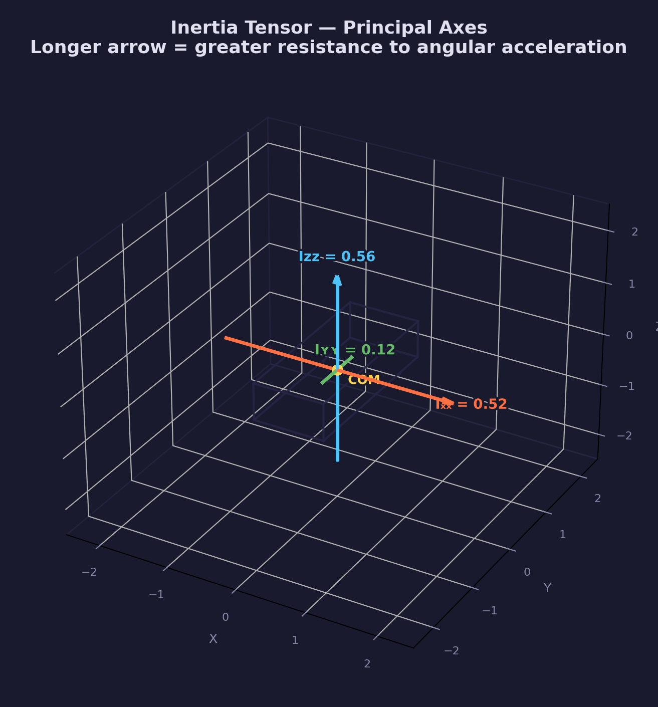

**Box** (half-extents $a, b, c$, mass $m$):

$$
I_{box} = \frac{m}{3}
\begin{pmatrix}
b^2 + c^2 & 0 & 0 \\
0 & a^2 + c^2 & 0 \\
0 & 0 & a^2 + b^2
\end{pmatrix}
$$

**Solid sphere** (radius $r$, mass $m$):

$$
I_{sphere} = \frac{2}{5} m r^2
\begin{pmatrix}
1 & 0 & 0 \\
0 & 1 & 0 \\
0 & 0 & 1
\end{pmatrix}
$$

**Solid cylinder** (radius $r$, half-height $h$, mass $m$, spin axis Y):

$$
I_{cylinder} =
\begin{pmatrix}
\frac{1}{12} m (3r^2 + 4h^2) & 0 & 0 \\
0 & \frac{1}{2} m r^2 & 0 \\
0 & 0 & \frac{1}{12} m (3r^2 + 4h^2)
\end{pmatrix}
$$

Scene 2 uses these three shapes at equal mass with different initial angular
velocities to show the effect directly: each shape's inertia tensor produces
visibly different tumbling behavior. The sphere's isotropic inertia gives
uniform spin, while the cylinder resists rotation around its tipping axes
more than around its spin axis.

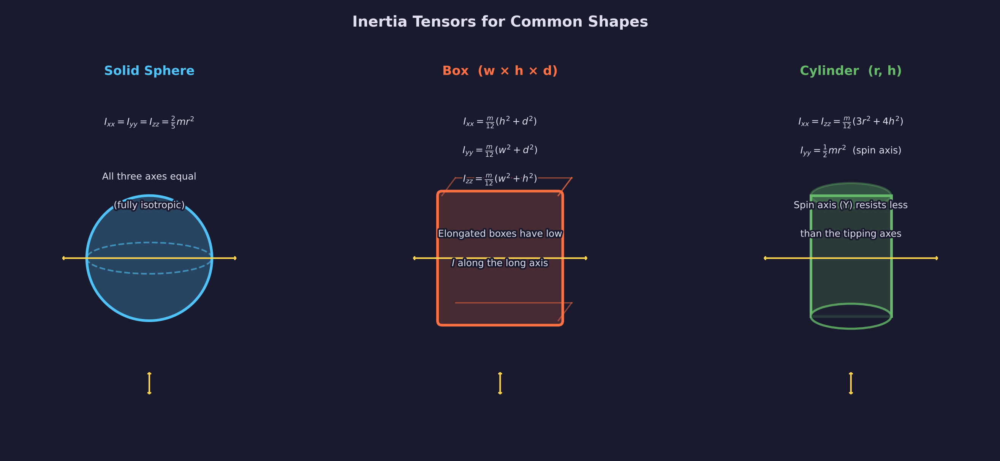

### Quaternion orientation

A quaternion $q = (w, x, y, z)$ encodes a rotation as a scalar part $w$ and
a vector part $(x, y, z)$ related to the rotation axis and half-angle. Three
properties make quaternions the right tool for orientation:

- **No gimbal lock** -- Euler angles lose a degree of freedom when two axes
  align. Quaternions have no such singularity.
- **Compact** -- four floats vs. nine for a rotation matrix.
- **Smooth interpolation** -- SLERP gives a geodesic path between orientations,
  used for rendering interpolation between physics steps.

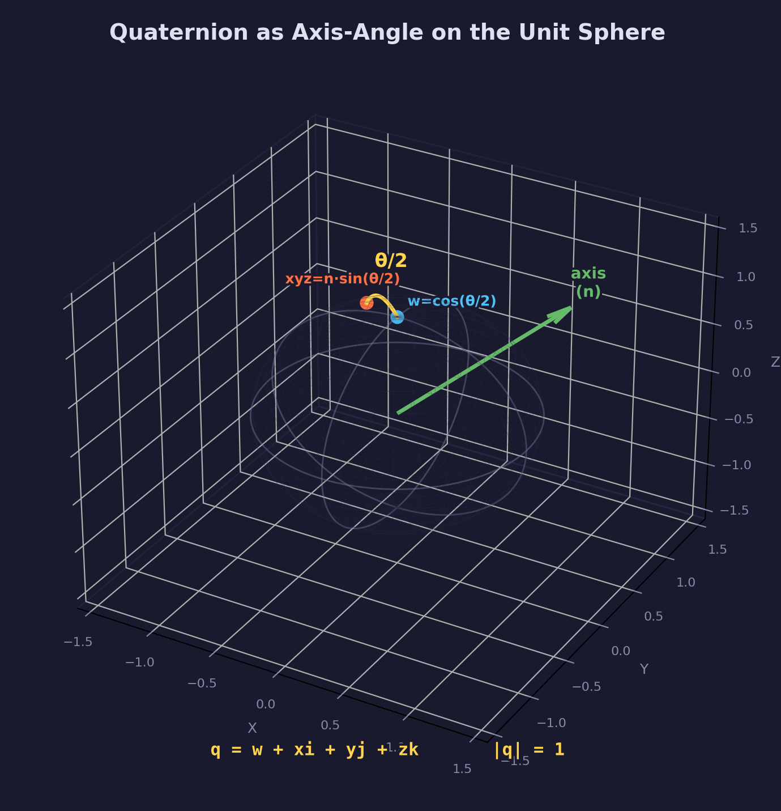

The orientation quaternion is kept normalized at all times. A unit quaternion
satisfies $|q| = 1$. After many integration steps, floating-point error
accumulates -- the quaternion is renormalized after every integration step to
prevent drift.

The rotation matrix $R$ extracted from $q$ via `quat_to_mat3()` is used to
transform between body space and world space.

### Angular velocity and torque

Torque is the rotational analogue of force. When a force $F$ is applied at a
position $r$ offset from the center of mass, it produces torque:

$$
\tau = r \times F
$$

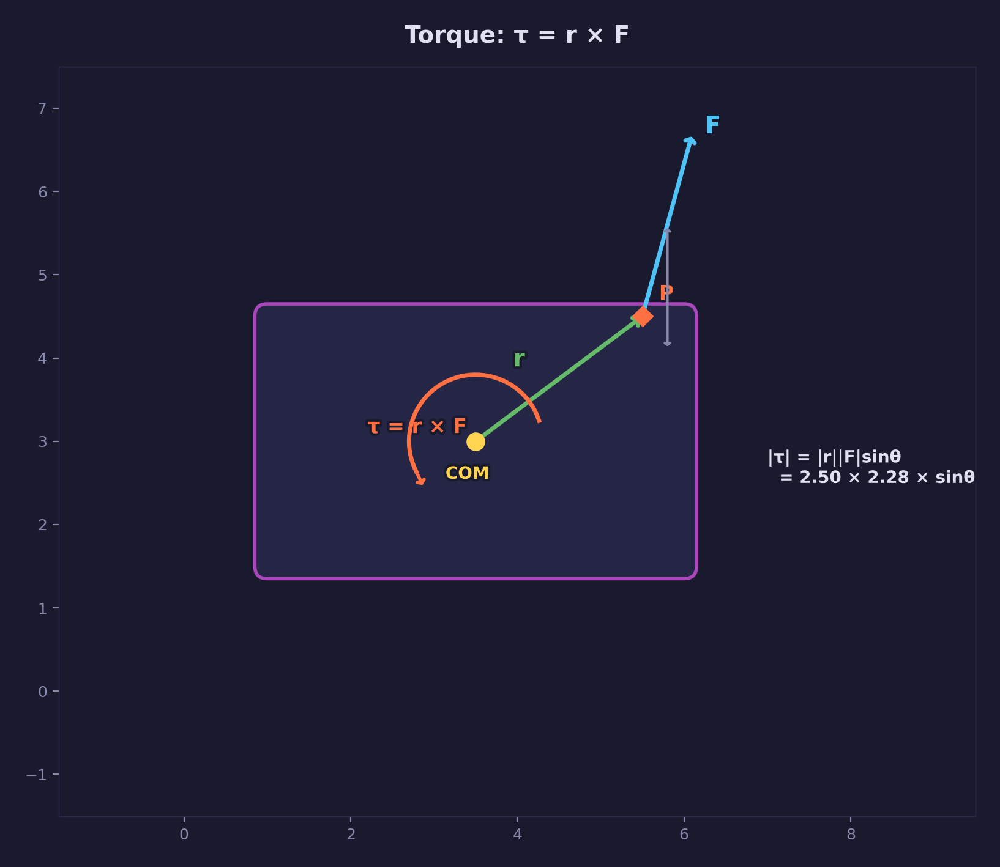

The cross product captures both the magnitude and axis of the resulting
rotation tendency. A force applied directly through the center of mass
produces zero torque (no rotation, only translation).

Angular acceleration follows from Euler's rotation equation:

$$
\alpha = I^{-1} (\tau - \omega \times (I \omega))
$$

The $\omega \times (I\omega)$ term is the **gyroscopic correction** — it
accounts for the coupling between angular velocity and the non-spherical
inertia tensor. Without it, spinning objects with asymmetric inertia would
tumble and precess incorrectly. For a sphere (where $I$ is a scalar multiple
of the identity), this term vanishes and the equation reduces to
$\alpha = I^{-1}\tau$.

The library stores $I^{-1}$ in body space and transforms it to world space
each step. The non-inverted $I_{world}$ is also maintained for the gyroscopic
term.

The angular velocity update follows symplectic Euler:

$$
\omega' = \omega + \alpha \cdot \Delta t
$$

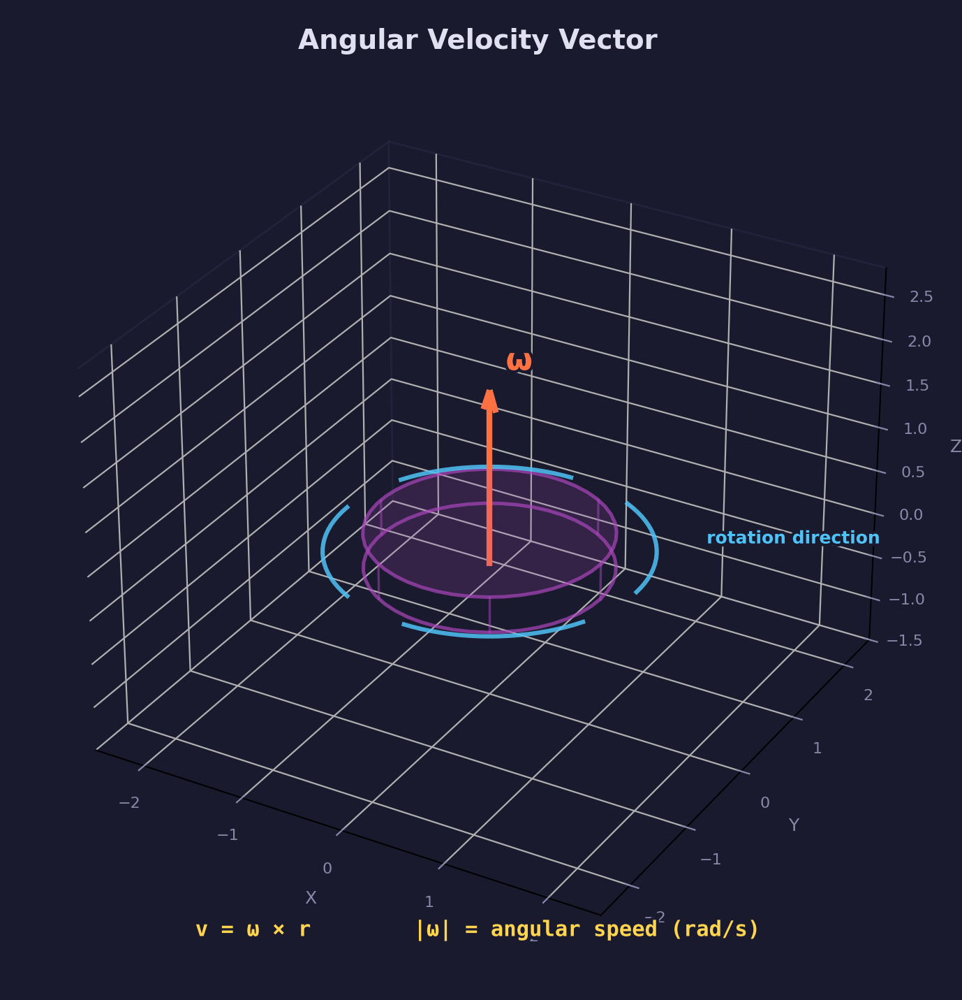

### World-space inertia

The inertia tensor $I_{local}$ is defined in body space. As the body rotates,
the tensor must be transformed to world space before computing the angular
acceleration response to a world-space torque. The transformation uses the
body's rotation matrix $R$:

$$
I_{world} = R \, I_{local} \, R^T
$$

This is the standard similarity transform for tensors under rotation. Because
$R$ is orthonormal ($R^T = R^{-1}$), the inverse world-space tensor is:

$$
I_{world}^{-1} = R \, I_{local}^{-1} \, R^T
$$

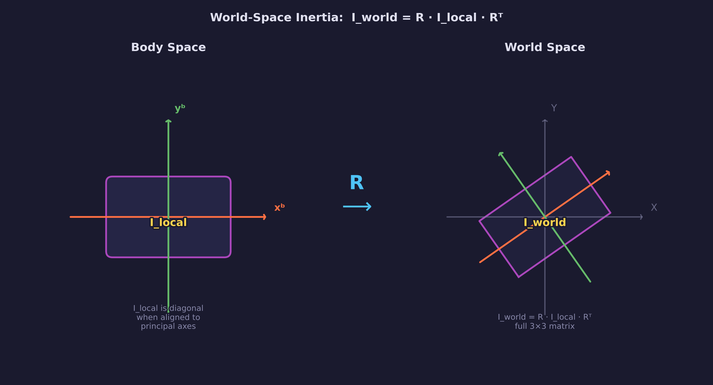

The library re-derives $I_{world}^{-1}$ each physics step from the current
orientation and the stored $I_{local}^{-1}$. This is three matrix-vector
multiplications per body per step -- inexpensive compared to collision
detection.

### Integration

The full rigid body integration loop runs as follows each fixed timestep:

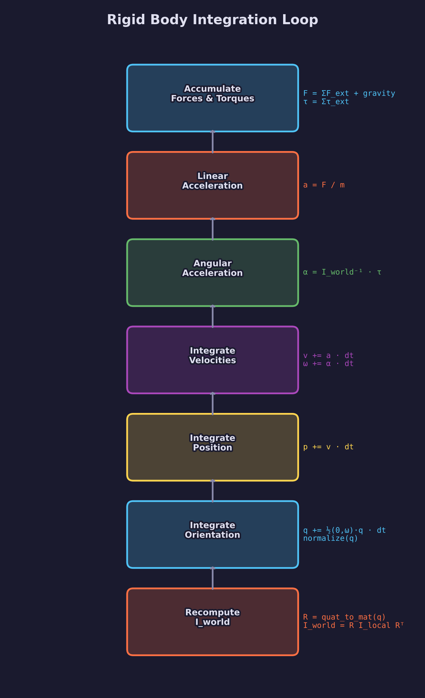

**Linear integration** (identical to the particle system):

$$
v' = v + (F \cdot m^{-1}) \cdot \Delta t
$$

$$
p' = p + v' \cdot \Delta t
$$

**Angular integration**:

$$
\alpha = I_{world}^{-1} \bigl(\tau - \omega \times (I_{world}\,\omega)\bigr)
$$

$$
\omega' = \omega + \alpha \cdot \Delta t
$$

**Quaternion update** -- the angular velocity is converted to a pure quaternion
$\omega_q = (0, \omega_x, \omega_y, \omega_z)$ and the derivative is applied:

$$
\dot{q} = \frac{1}{2} \, \omega_q \cdot q
$$

$$
q' = q + \dot{q} \cdot \Delta t
$$

$$
q' = \frac{q'}{|q'|}
$$

The factor of $\frac{1}{2}$ arises from the quaternion rotation algebra. The
final normalization step corrects floating-point drift.

**Exponential damping** applies drag to both linear and angular velocity:

$$
v \mathrel{*}= d^{\Delta t}, \qquad \omega \mathrel{*}= d_\omega^{\Delta t}
$$

where $d$ and $d_\omega$ are the linear and angular damping coefficients. This
form is frame-rate-independent -- the result is the same whether the
fixed timestep is 1/60 or 1/120 second.

After integration, the force and torque accumulators are zeroed.

### Gyroscopic precession

When a spinning body (nonzero $\omega$) experiences an applied torque, the
response is not a simple spin-up in the torque direction. Instead, the angular
momentum vector $L = I \omega$ rotates perpendicular to the applied torque.
This is precession.

For Scene 4, a disc spins around its symmetry axis with high $\omega$ and
gravity applies a torque at the support point. Instead of tipping over, the
disc's spin axis slowly rotates around the vertical -- classic gyroscopic
precession.

$$
\dot{L} = \tau, \qquad \Omega_{prec} = \frac{|\tau|}{|L|}
$$

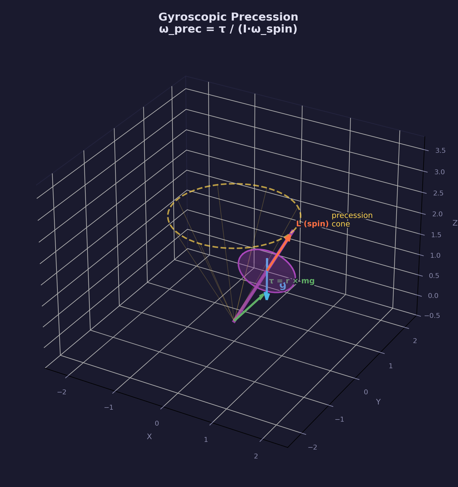

Precession emerges naturally from the integration loop without special-casing
-- it is a consequence of Euler's equation $\alpha = I^{-1}(\tau - \omega \times (I\omega))$ applied each step.

## The code

### Scene initialization

Each scene creates rigid bodies using `forge_physics_rigid_body_create()`,
which initializes position, mass, damping, and orientation, then sets the
inertia tensor from the shape dimensions:

```c
ForgePhysicsRigidBody box = forge_physics_rigid_body_create(
    vec3_create(0.0f, 3.0f, 0.0f),    /* position               */
    2.0f, 0.99f, 0.99f, 0.5f);        /* mass, damp, ang, rest  */
forge_physics_rigid_body_set_inertia_box(&box,
    vec3_create(0.5f, 0.5f, 0.5f));    /* half-extents           */

box.velocity         = vec3_create(1.5f, 2.0f, 0.0f);
box.angular_velocity = vec3_create(0.5f, 1.2f, 0.3f);
```

`forge_physics_rigid_body_set_inertia_box()` computes the analytical inertia
tensor and stores its inverse -- the form used directly in angular
acceleration.

### Physics step

Each fixed-timestep call to `physics_step()` runs this sequence:

```c
/* physics_step() in order: */
/* 1. Apply gravity (force on center of mass -- no torque) */
for (int i = 0; i < state->num_bodies; i++) {
    if (state->bodies[i].inv_mass == 0.0f) continue;
    vec3 gravity = vec3_create(0.0f,
        -ui_gravity * state->bodies[i].mass, 0.0f);
    forge_physics_rigid_body_apply_force(&state->bodies[i], gravity);
}

/* 2. Apply user torque (Scene 3 arrow keys) */
forge_physics_rigid_body_apply_torque(&state->bodies[0], torque);

/* 3. Integrate -- linear and angular (clears accumulators) */
for (int i = 0; i < state->num_bodies; i++)
    forge_physics_rigid_body_integrate(&state->bodies[i], PHYSICS_DT);

/* 4. Ground collision (Scene 2 only -- bounce, per body) */
for (int i = 0; i < state->num_bodies; i++)
    rigid_body_ground_collision(&state->bodies[i], &state->body_info[i]);
```

### Inertia setup

The three primitives in Scene 2 use their analytical formulas:

```c
/* Box: half-extents (0.6, 0.6, 0.6) */
forge_physics_rigid_body_set_inertia_box(&box,
    vec3_create(0.6f, 0.6f, 0.6f));

/* Sphere: radius 0.5 */
forge_physics_rigid_body_set_inertia_sphere(&sphere, 0.5f);

/* Cylinder: radius 0.4, half-height 0.6 */
forge_physics_rigid_body_set_inertia_cylinder(&cylinder, 0.4f, 0.6f);
```

All three start with different initial angular velocities and the same mass.
The difference in tumbling behavior comes entirely from their inertia tensors.

### Quaternion integration

The quaternion derivative step inside `forge_physics_rigid_body_integrate()`:

```c
/* Build pure quaternion from angular velocity */
quat omega_quat = quat_create(0.0f,
    rb->angular_velocity.x,
    rb->angular_velocity.y,
    rb->angular_velocity.z);

/* omega * q  (the 0.5 factor is applied via half_dt below) */
quat omega_q = quat_multiply(omega_quat, rb->orientation);

/* Apply quaternion derivative: q' = q + 0.5 * dt * (omega * q) */
float half_dt = 0.5f * dt;
rb->orientation.w += half_dt * omega_q.w;
rb->orientation.x += half_dt * omega_q.x;
rb->orientation.y += half_dt * omega_q.y;
rb->orientation.z += half_dt * omega_q.z;

/* Renormalize if drift exceeds threshold */
float q_len_sq = quat_length_sq(rb->orientation);
if (fabsf(q_len_sq - 1.0f) > FORGE_PHYSICS_QUAT_RENORM_THRESHOLD) {
    rb->orientation = quat_normalize(rb->orientation);
}
```

### Rendering with interpolation

Physics runs at a fixed timestep; rendering runs at the display refresh rate.
Between physics steps, the renderer interpolates the orientation to avoid
visible stuttering:

```c
float alpha = accumulator / PHYSICS_DT;

vec3 pos    = vec3_lerp(rb->prev_position,    rb->position,    alpha);
quat orient = quat_slerp(rb->prev_orientation, rb->orientation, alpha);

mat4 translation = mat4_translate(pos);
mat4 rotation    = quat_to_mat4(orient);
mat4 scale       = mat4_scale(info->render_scale);
mat4 model       = mat4_multiply(translation, mat4_multiply(rotation, scale));
```

`prev_position` and `prev_orientation` are saved at the start of each physics
step before integration overwrites them.

## Key concepts

- **Six degrees of freedom** -- a rigid body adds orientation and angular
  velocity to the three translational degrees of the particle system.
- **Inertia tensor** -- a $3 \times 3$ matrix encoding resistance to angular
  acceleration per axis. Diagonal for axis-aligned primitives.
- **Quaternion orientation** -- a unit quaternion avoids gimbal lock and
  drifts only due to floating-point error, corrected by renormalization.
- **Quaternion derivative** -- $\dot{q} = \frac{1}{2} \omega_q \cdot q$ converts
  angular velocity to a rate of change of orientation.
- **World-space inertia** -- $I_{world} = R \, I_{local} \, R^T$ transforms
  the inertia tensor to world space using the current rotation matrix.
- **Torque** -- $\tau = r \times F$ is the rotational effect of a force applied
  at an offset from the center of mass.
- **Exponential damping** -- $v \mathrel{*}= d^{\Delta t}$ is frame-rate-independent
  drag, correctly scaling the damping effect with the timestep size.
- **Gyroscopic precession** -- the natural response of a spinning body to an
  applied torque; emerges from correct rigid body integration without special
  handling.

## The physics library

This lesson extends `common/physics/forge_physics.h` with the following API:

| Type / Function | Purpose |
|---|---|
| `ForgePhysicsRigidBody` | Struct: position, velocity, orientation (quat), angular velocity, force/torque accumulators, mass, inertia |
| `forge_physics_rigid_body_create()` | Constructor: identity orientation, zero velocities, identity inertia |
| `forge_physics_rigid_body_set_inertia_box()` | Compute inverse inertia tensor for an axis-aligned box |
| `forge_physics_rigid_body_set_inertia_sphere()` | Compute inverse inertia tensor for a solid sphere |
| `forge_physics_rigid_body_set_inertia_cylinder()` | Compute inverse inertia tensor for a solid cylinder (Y axis) |
| `forge_physics_rigid_body_apply_force()` | Accumulate force at center of mass |
| `forge_physics_rigid_body_apply_force_at_point()` | Force + torque from $\tau = r \times F$ |
| `forge_physics_rigid_body_apply_torque()` | Accumulate torque directly |
| `forge_physics_rigid_body_update_derived()` | Normalize orientation, recompute world-space inertia: $R \, I^{-1}_{local} \, R^T$ |
| `forge_physics_rigid_body_integrate()` | Symplectic Euler step for linear and angular state; renormalizes quaternion |
| `forge_physics_rigid_body_clear_forces()` | Zero force and torque accumulators |
| `forge_physics_rigid_body_get_transform()` | Returns model matrix from position and orientation |

The library remains header-only, allocates no heap memory, and stores inverse
quantities (inverse mass, inverse inertia) directly to avoid divisions in the
inner loop.

See: [common/physics/README.md](../../../common/physics/README.md) for the full
API reference.

## Where it's used

- [Physics Lesson 01 -- Point Particles](../01-point-particles/) introduces the
  particle state, integration, and force accumulators that this lesson extends
- [Physics Lesson 02 -- Springs and Constraints](../02-springs-and-constraints/)
  adds springs and distance constraints; the torque accumulator pattern follows
  the same design as the force accumulator there
- [Physics Lesson 03 -- Particle Collisions](../03-particle-collisions/) covers
  impulse-based response; rigid body collision extends that impulse to include
  rotational effects
- [Math Lesson 08 -- Orientation](../../math/08-orientation/) explains the
  quaternion algebra underlying orientation representation and the derivative
  formula
- [Math Lesson 05 -- Matrices](../../math/05-matrices/) covers the rotation
  matrix similarity transform used for world-space inertia
- The rendering baseline uses [forge_scene.h](../../../common/scene/) for
  Blinn-Phong lighting, shadow mapping, and procedural grid

## Building

From the repository root:

```bash
cmake -B build
cmake --build build --config Debug
```

Run:

```bash
python scripts/run.py physics/04

# Or directly:
# Windows
build\lessons\physics\04-rigid-body-state\Debug\04-rigid-body-state.exe
# Linux / macOS
./build/lessons/physics/04-rigid-body-state/04-rigid-body-state
```

## What's next

Physics Lesson 05 adds rigid body collision response -- the angular impulse
that arises when two oriented bodies collide at a point away from their
centers of mass, producing both linear and angular velocity changes.

## Exercises

1. **Add a sphere with different mass.** In Scene 2, duplicate the sphere with
   10x the mass and apply the same initial angular velocity. Observe how the
   heavier sphere decelerates faster under angular damping, but would need more
   torque to reach the same spin rate. Verify by computing
   $KE_{rot} = \frac{1}{2} \omega^T I \omega$ for both.

2. **Implement an angular spring.** Add a torsional spring that applies a
   torque proportional to the angular displacement from the identity
   orientation: extract the rotation angle from $q$ using
   $\theta = 2 \arccos(q.w)$, then apply $\tau = -k \theta \hat{n}$ where
   $\hat{n}$ is the rotation axis. The body should oscillate back toward
   its rest orientation.

3. **Shape-dependent angular damping.** Replace the uniform angular damping
   coefficient with one derived from the inertia tensor: flat shapes (high
   $I_{xx}$, $I_{zz}$) should damp faster around their X and Z axes than
   around their spin axis. Apply per-axis damping by transforming $\omega$
   to body space, scaling each component, then transforming back.

4. **Simultaneous three-axis spin.** Set a box's initial angular velocity to
   $(3.0, 1.0, 2.0)$ rad/s with no gravity and no damping. Observe the
   instability that emerges when spinning around the intermediate axis --
   this is the Dzhanibekov effect (the intermediate-axis theorem), a
   consequence of the eigenvalue structure of the inertia tensor.

## Further reading

- [Physics Lesson 01 -- Point Particles](../01-point-particles/) -- integration
  and force accumulator foundations
- [Physics Lesson 05 -- Rigid Body Collisions](../05-rigid-body-collisions/) --
  angular impulse at a contact point, extending this lesson's state
- [Math Lesson 06 -- Quaternions](../../math/06-quaternions/) -- quaternion
  algebra, the derivative formula, and SLERP
- Baraff & Witkin, "Physically Based Modeling" (SIGGRAPH 1997 course notes),
  Part II -- the canonical derivation of rigid body equations of motion
- Catto, "Iterative Dynamics with Temporal Coherence" (GDC 2005) -- practical
  integration and inertia tensor handling for game physics
- Goldstein, *Classical Mechanics*, Ch. 5 -- Euler's equations for rigid body
  motion and the derivation of precession
- Eberly, *Game Physics*, Ch. 2 -- quaternion integration, inertia tensors for
  common shapes, and numerical stability considerations
