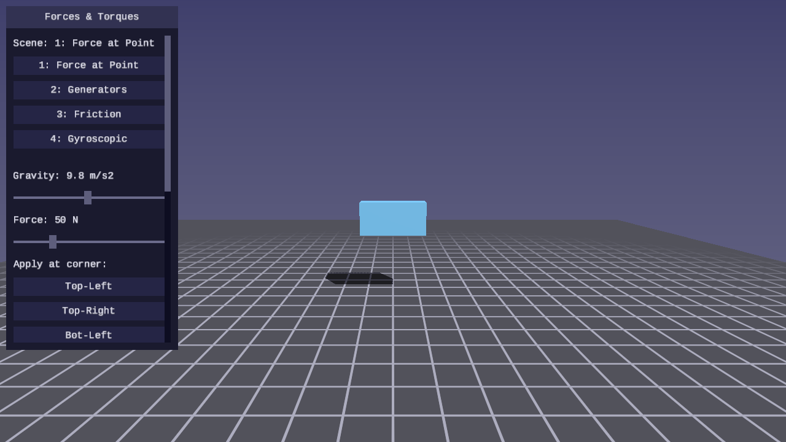
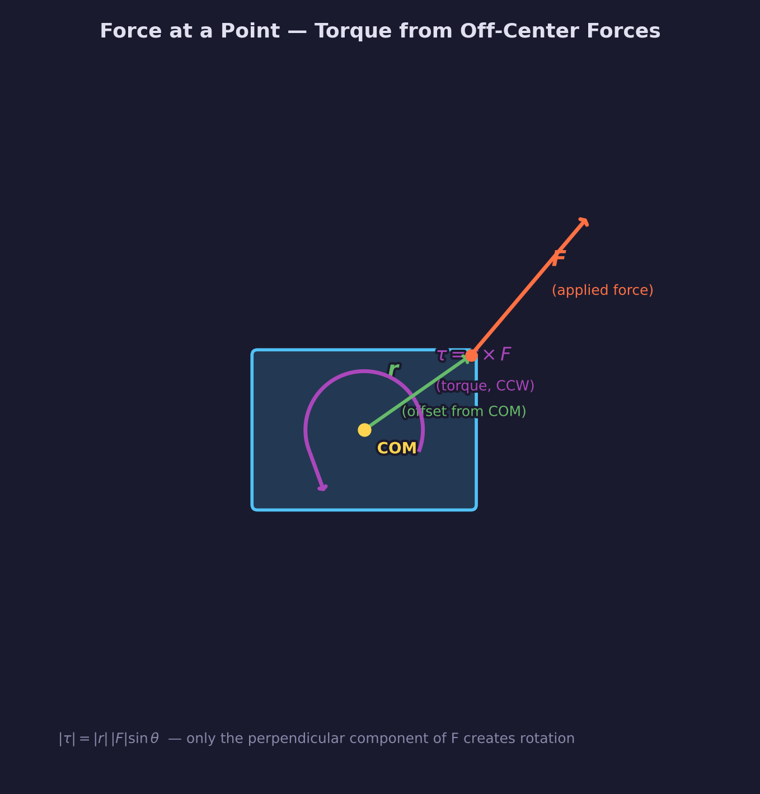
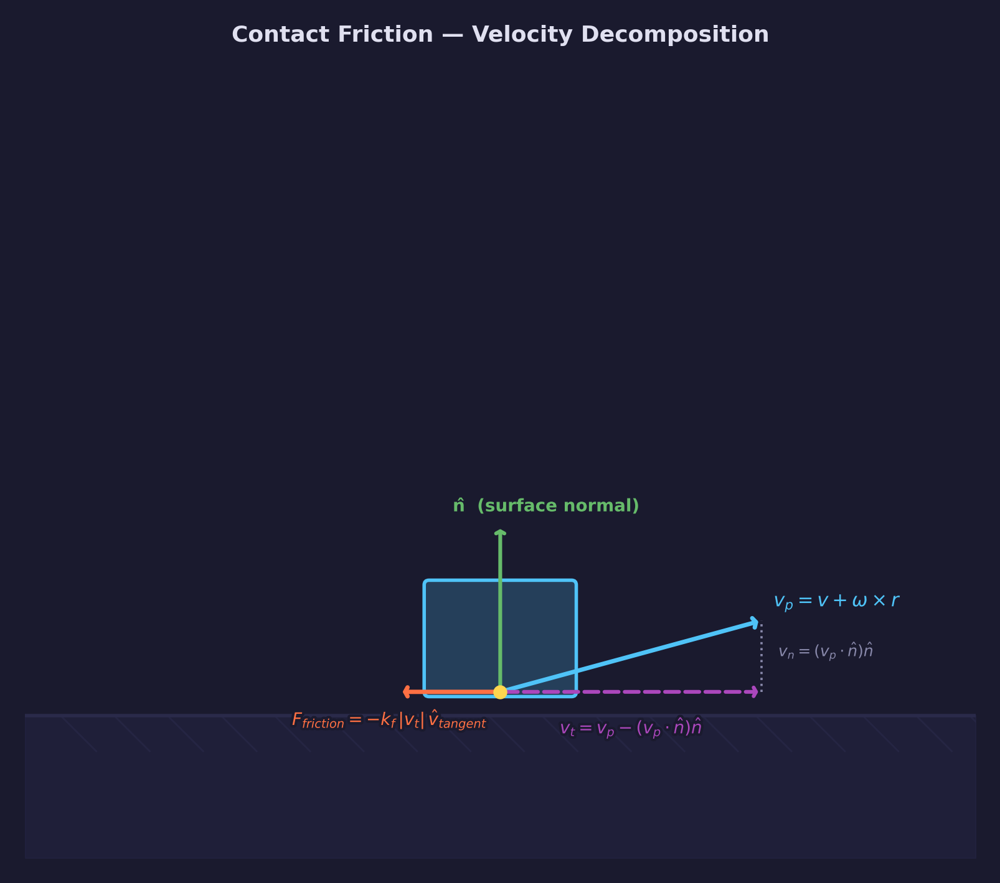
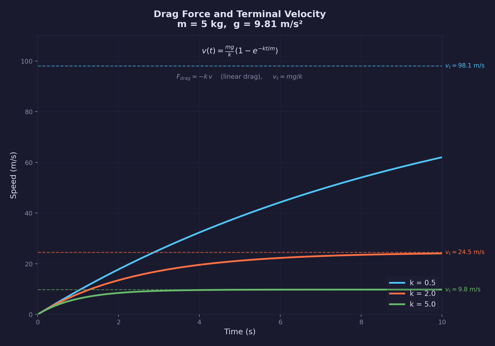
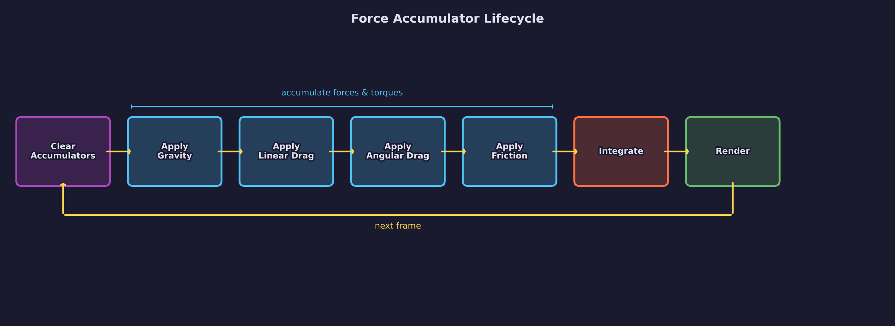
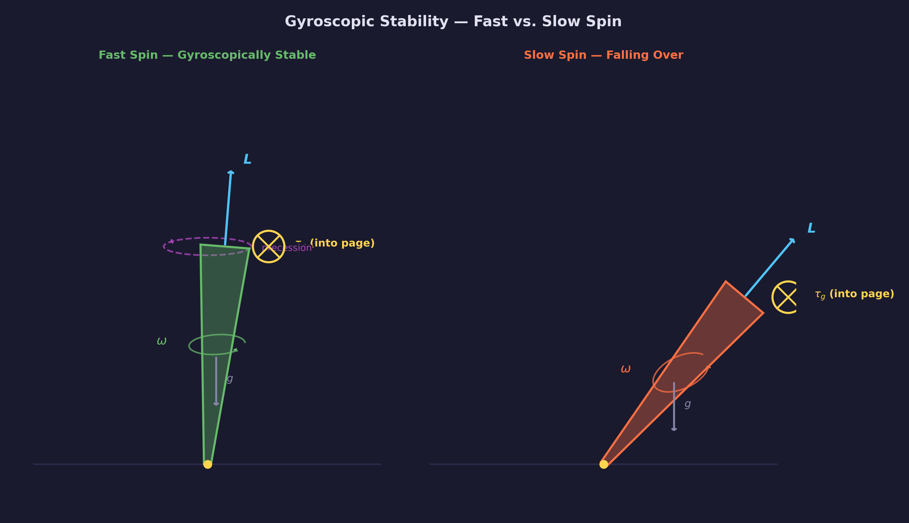

# Physics Lesson 05 -- Forces and Torques

Extending the rigid body with a structured force pipeline: gravity, linear
drag, angular drag, and friction applied through a force accumulator, with
the cross product connecting off-center forces to torque.

## What you'll learn

- How a force applied at an arbitrary point on a rigid body produces both
  linear acceleration and torque: $\tau = r \times F$
- Why the same force applied at the center of mass produces no torque while
  the same force at a corner produces both linear and angular acceleration
- How to implement a **force accumulator pattern** — a clean pipeline where
  force generators compose independently before integration
- Four canonical force generators: gravity, linear drag, angular drag, and
  contact friction
- How linear drag and gravity together produce **terminal velocity**, and the
  closed-form expression for it
- How contact friction is decomposed into normal and tangential components and
  applied as an opposing force along the contact plane
- Why a rapidly spinning body resists tipping under gravity — gyroscopic
  stability as a consequence of the coupling between angular momentum and
  applied torque

## Result

| Screenshot | Animation |
|---|---|
|  |  |

Four selectable scenes demonstrate the concepts:

1. **Off-center Force** -- a hovering box with arrow keys to set force
   direction and UI buttons to select the application corner. Applying force
   at a corner produces both translation and spin ($\tau = r \times F$).
2. **Terminal Velocity** -- three spheres with different drag coefficients
   (low, medium, high) fall under gravity. Each reaches a different terminal
   velocity, converging asymptotically as drag balances gravity.
3. **Sliding Friction** -- a box and a sphere launched across a flat surface
   decelerate under velocity-proportional contact friction. The friction force
   opposes the contact-point slip direction along the surface.
4. **Gyroscopic Stability** -- two discs side by side, one spinning fast and
   one spinning slowly, both tilted off vertical. The fast disc precesses
   steadily; the slow disc tips and falls.

## Controls

| Key | Action |
|---|---|
| WASD / Mouse | Camera movement / look |
| Space / Shift | Fly up / down |
| 1-4 | Select scene |
| Arrow keys | Set force direction (Scene 1) |
| P | Pause / resume simulation |
| R | Reset simulation |
| T | Toggle slow motion (1x / 0.25x) |
| Escape | Release mouse / quit |

The UI panel shows interactive sliders for scene parameters (gravity, force
magnitude, drag, friction, spin speed, tilt angle) and per-body readouts:
velocity, angular velocity, tilt angle (Scene 4), angular momentum (Scene 4),
kinetic energy (linear, rotational, total), and FPS.

## The physics

### Forces at arbitrary points

When a force $F$ is applied at a position $P$ on a rigid body whose center of
mass is at $C$, the offset vector is:

$$
r = P - C
$$

The force produces two effects simultaneously. The linear effect is identical
to applying the force directly at the center of mass -- the entire body
accelerates according to $a = F / m$. The rotational effect is a
torque:

$$
\tau = r \times F
$$



The cross product encodes both the axis and magnitude of the rotational
tendency. When $r = 0$ (force at the center of mass), the cross product is
zero -- no torque. When $r$ is perpendicular to $F$, the torque magnitude is
$|r| \cdot |F|$, the maximum. When $r$ is parallel to $F$, the torque is again
zero -- pushing directly toward or away from the center of mass produces no
rotation.

This is the bridge between the translational and rotational sides of rigid
body dynamics: a single force call at an offset point accumulates into both
the force accumulator and the torque accumulator.

### Force generators

A force generator is any computation that writes into the force or torque
accumulators before integration. Four generators appear in this lesson:

**Gravity** acts at the center of mass. The torque is zero because $r = 0$:

$$
F_{gravity} = m \, g
$$

where $g = (0, -9.81, 0)$ m/s². Gravity scales with mass, so all bodies
fall at the same rate under free fall regardless of mass.

**Linear drag** opposes the linear velocity:

$$
F_{drag} = -k_d \, v
$$

where $k_d$ is the drag coefficient (kg/s). This is linear (Stokes) drag.
It is the appropriate model for slow motion through a viscous medium and for
game physics where predictable, stable behavior matters more than aerodynamic
accuracy. Quadratic drag ($F = -k |v| v$) is more realistic for fast objects
moving through air but introduces a nonlinearity that Exercise 2 explores.

**Angular drag** opposes the angular velocity:

$$
\tau_{drag} = -k_\omega \, \omega
$$

where $k_\omega$ is the angular drag coefficient (kg·m²/s). Without angular
drag, objects set spinning would rotate indefinitely. Angular drag provides
the rotational energy dissipation that internal friction and air resistance
produce in physical objects.

**Contact friction** opposes motion along a contact surface. The relevant
velocity is the **contact-point velocity**, which includes the rotational
contribution:

$$
v_p = v + \omega \times r
$$

where $r$ is the offset from the center of mass to the contact point. Given a
contact normal $\hat{n}$, the tangential component is:

$$
v_t = v_p - (v_p \cdot \hat{n}) \, \hat{n}
$$



The friction force opposes this tangential velocity, proportional to sliding
speed:

$$
F_{friction} = -k_f \, |v_t| \, \hat{v}_t
$$

where $k_f$ is the friction coefficient (N·s/m) and $\hat{v}_t$ is the unit
tangential velocity. This is a simplified velocity-proportional model — a full
Coulomb model would use $\mu_k |F_n|$ instead of $k_f |v_t|$, but the
velocity-proportional form is practical for a force-generator approach where
the normal force is not yet computed. If $|v_t|$ is below a threshold, friction
is not applied (the body is considered stationary).

### Terminal velocity

Under linear drag and gravity, the net vertical force on a falling body is:

$$
F_{net} = m \, g - k_d \, v
$$

At terminal velocity $v_t$, the net force is zero:

$$
k_d \, v_t = m \, g \implies v_t = \frac{m \, g}{k_d}
$$

A higher drag coefficient produces a lower terminal velocity; a heavier body
produces a higher one. Scene 2 shows three spheres with the same mass but
different drag coefficients (low, medium, high) converging to different
terminal velocities.



The convergence is exponential -- the velocity approaches $v_t$ but never
exceeds it. The time constant is $\tau = m / k_d$: after time $\tau$, the body
has covered $1 - 1/e \approx 63\%$ of the velocity gap to terminal.

### The force accumulator pattern

The force accumulator decouples force generation from integration. Each
physics step follows a fixed lifecycle:



1. **Clear** -- zero the force and torque accumulators on all bodies
2. **Apply generators** -- each generator reads body state and writes into the
   accumulators; generators have no knowledge of each other
3. **Integrate** -- the integrator reads the accumulated force and torque,
   computes accelerations, and advances the state
4. **Render** -- the current state is drawn

Generators compose correctly because accumulation is additive. Gravity adds
to the force accumulator; drag adds (a negative) amount to the same
accumulator; friction adds its contribution. The integrator sees only the
total and does not need to be modified when generators are added or removed.

The order of generator application within step 2 does not matter for
correctness -- only the total accumulated force before integration is used.

### Gyroscopic stability

A spinning body has angular momentum:

$$
L = I_{world} \, \omega
$$

When a torque $\tau$ acts on this body, the angular momentum changes:

$$
\dot{L} = \tau
$$

If the torque is perpendicular to $L$ (as gravity's torque on a tilted spin
axis is), the magnitude of $L$ is unchanged but its direction rotates. The
spin axis precesses around the direction of the applied torque at rate:

$$
\Omega_{prec} = \frac{|\tau|}{|L|}
$$



A large $|L|$ (fast spin) means a small angular change per unit of applied
torque impulse -- the body resists tipping. As spin slows (due to angular drag
or energy dissipation), $|L|$ decreases and $\Omega_{prec}$ increases. When
$|L|$ is small enough, the precession becomes unstable and the body eventually
falls.

This behavior is not special-cased. It emerges from Euler's rotation equation
applied each step:

$$
\alpha = I_{world}^{-1} \bigl(\tau - \omega \times (I_{world} \, \omega)\bigr)
$$

The $\omega \times (I_{world} \, \omega)$ term is the gyroscopic correction
from [Physics Lesson 04](../04-rigid-body-state/). With a fast spin, this term
dominates over the applied torque in the angular acceleration and redirects the
change perpendicular to the current angular velocity.

## The code

### Physics step with force generators

Each call to `physics_step()` applies generators in order, then integrates:

```c
static void physics_step(app_state *state)
{
    /* Scene 1: user-applied force at a corner */
    if (state->scene_index == 0 && state->num_bodies > 0) {
        ForgePhysicsRigidBody *rb = &state->bodies[0];
        forge_physics_rigid_body_apply_linear_drag(rb, 1.0f);
        forge_physics_rigid_body_apply_angular_drag(rb, 0.5f);
        /* Transform selected corner to world space, apply force there */
        if (vec3_length(state->force_input) > 0.001f) {
            /* ... compute world_point from corner offset ... */
            forge_physics_rigid_body_apply_force_at_point(rb, force,
                                                         world_point);
        }
    }

    /* Scene 2: gravity + variable drag → terminal velocity */
    if (state->scene_index == 1) {
        float drag_values[3] = { 0.5f, state->ui_drag_coeff, 5.0f };
        for (int i = 0; i < state->num_bodies; i++) {
            forge_physics_rigid_body_apply_gravity(&state->bodies[i],
                vec3_create(0, -state->ui_gravity, 0));
            forge_physics_rigid_body_apply_linear_drag(&state->bodies[i],
                drag_values[i]);
        }
    }

    /* Scene 3: friction — gravity + angular drag + contact friction */
    if (state->scene_index == 2) {
        vec3 ground_normal = vec3_create(0, 1, 0);
        for (int i = 0; i < state->num_bodies; i++) {
            ForgePhysicsRigidBody *rb = &state->bodies[i];
            forge_physics_rigid_body_apply_gravity(rb,
                vec3_create(0, -state->ui_gravity, 0));
            forge_physics_rigid_body_apply_angular_drag(rb,
                state->ui_angular_drag);
            float ground_threshold = GROUND_Y + /* half_height */ 0.5f;
            if (rb->position.y <= ground_threshold) {
                vec3 contact_pt = rb->position;
                contact_pt.y = GROUND_Y;
                forge_physics_rigid_body_apply_friction(rb, ground_normal,
                    contact_pt, state->ui_friction);
            }
        }
    }

    /* Scene 4: gyroscopic precession torque */
    if (state->scene_index == 3) {
        vec3 gravity_vec = vec3_create(0, -state->ui_gravity, 0);
        for (int i = 0; i < state->num_bodies; i++) {
            ForgePhysicsRigidBody *rb = &state->bodies[i];
            vec3 offset = vec3_scale(quat_up(rb->orientation),
                /* half_height */ S4_DISC_HALF_H);
            vec3 gravity_force = vec3_scale(gravity_vec, rb->mass);
            vec3 precession_torque = vec3_cross(offset, gravity_force);
            forge_physics_rigid_body_apply_torque(rb, precession_torque);
            forge_physics_rigid_body_apply_angular_drag(rb, 0.1f);
        }
    }

    /* Integrate all bodies */
    for (int i = 0; i < state->num_bodies; i++)
        forge_physics_rigid_body_integrate(&state->bodies[i], PHYSICS_DT);

    /* Ground collision for scenes 2 and 3 */
    if (state->scene_index == 1 || state->scene_index == 2) {
        for (int i = 0; i < state->num_bodies; i++)
            rigid_body_ground_collision(&state->bodies[i],
                                       &state->body_info[i]);
    }
}
```

Each generator is a single function call. Adding or removing a generator means
adding or removing one line -- the integrator is unchanged.

### Off-center force application

`forge_physics_rigid_body_apply_force_at_point()` computes the torque from the
offset and accumulates both:

```c
void forge_physics_rigid_body_apply_force_at_point(
    ForgePhysicsRigidBody *rb,
    vec3 force,
    vec3 world_pt)
{
    /* Linear contribution: same as force at COM */
    rb->force_accum = vec3_add(rb->force_accum, force);

    /* Rotational contribution: tau = r x F */
    vec3 offset = vec3_sub(world_pt, rb->position);
    rb->torque_accum = vec3_add(rb->torque_accum,
                                vec3_cross(offset, force));
}
```

When `world_pt` equals `rb->position` (force at center of mass), `offset` is
zero and the cross product is zero -- no torque is added. The force
contribution is identical either way.

### Gravity, drag, and friction generators

```c
void forge_physics_rigid_body_apply_gravity(
    ForgePhysicsRigidBody *rb, vec3 gravity)
{
    if (rb->inv_mass == 0.0f) return;  /* static body */
    /* F = m * g — scale by mass to get force in N */
    rb->force_accum = vec3_add(rb->force_accum,
                               vec3_scale(gravity, rb->mass));
}

void forge_physics_rigid_body_apply_linear_drag(
    ForgePhysicsRigidBody *rb, float coeff)
{
    /* Stokes drag: F = -k * v */
    vec3 drag = vec3_scale(rb->velocity, -coeff);
    rb->force_accum = vec3_add(rb->force_accum, drag);
}

void forge_physics_rigid_body_apply_angular_drag(
    ForgePhysicsRigidBody *rb, float coeff)
{
    /* Angular drag: tau = -k * omega */
    vec3 drag = vec3_scale(rb->angular_velocity, -coeff);
    rb->torque_accum = vec3_add(rb->torque_accum, drag);
}

void forge_physics_rigid_body_apply_friction(
    ForgePhysicsRigidBody *rb, vec3 normal, vec3 contact_point,
    float coeff)
{
    /* Contact-point velocity includes rotational contribution */
    vec3 r = vec3_sub(contact_point, rb->position);
    vec3 v_contact = vec3_add(rb->velocity,
                              vec3_cross(rb->angular_velocity, r));

    /* Decompose into normal and tangential components */
    float v_n   = vec3_dot(v_contact, normal);
    vec3  v_tan = vec3_sub(v_contact,
                           vec3_scale(normal, v_n));

    float tang_speed = vec3_length(v_tan);
    if (tang_speed < FORGE_PHYSICS_EPSILON) return;

    /* Kinetic friction opposes tangential motion, proportional to speed */
    vec3 friction_dir = vec3_scale(v_tan, -1.0f / tang_speed);
    vec3 friction_force = vec3_scale(friction_dir, coeff * tang_speed);

    /* Apply at the contact point — generates friction torque */
    forge_physics_rigid_body_apply_force_at_point(rb, friction_force,
                                                  contact_point);
}
```

### Scene initialization

Scene 2 initializes three spheres with identical mass (5 kg) but different drag
coefficients to demonstrate terminal velocity:

```c
/* Scene 2: three spheres, same mass, different drag */
float drag_values[3] = { S2_DRAG_LOW, S2_DRAG_MED, S2_DRAG_HIGH };
/*                        0.5            2.0           5.0        */

for (int i = 0; i < S2_NUM_BODIES; i++) {
    float x = ((float)i - 1.0f) * S2_SPACING;
    state->bodies[i] = forge_physics_rigid_body_create(
        vec3_create(x, S2_START_Y, 0.0f),
        S2_MASS,  /* 5.0 kg */
        DEFAULT_DAMPING, DEFAULT_ANG_DAMPING, DEFAULT_RESTIT);
    forge_physics_rigid_body_set_inertia_sphere(&state->bodies[i],
        S2_SPHERE_RADIUS);
}
```

With mass $m = 5.0$ kg, $g = 9.81$ m/s², the terminal velocities are:

$$
v_{t,low} = \frac{5.0 \times 9.81}{0.5} = 98.1 \text{ m/s}
\quad
v_{t,med} = \frac{5.0 \times 9.81}{2.0} = 24.5 \text{ m/s}
\quad
v_{t,high} = \frac{5.0 \times 9.81}{5.0} = 9.8 \text{ m/s}
$$

Scene 4 initializes two discs — one fast, one slow — both tilted off vertical:

```c
/* Scene 4: two discs, fast vs slow spin, tilted off vertical */
float spin_speeds[2] = { state->ui_fast_spin, state->ui_slow_spin };
/*                        30.0 rad/s           2.0 rad/s            */

for (int i = 0; i < S4_NUM_BODIES; i++) {
    float x = ((float)i - 0.5f) * S4_SPACING;
    state->bodies[i] = forge_physics_rigid_body_create(
        vec3_create(x, S4_START_Y, 0.0f),
        S4_MASS,  /* 5.0 kg */
        DEFAULT_DAMPING, DEFAULT_ANG_DAMPING, DEFAULT_RESTIT);
    forge_physics_rigid_body_set_inertia_cylinder(&state->bodies[i],
        S4_DISC_RADIUS, S4_DISC_HALF_H);

    /* Tilt off vertical (default 0.3 rad ≈ 17 degrees) */
    state->bodies[i].orientation = quat_from_axis_angle(
        vec3_create(0, 0, 1), state->ui_tilt_angle);

    /* Spin around local Y axis (the disc's symmetry axis) */
    vec3 up_body = quat_up(state->bodies[i].orientation);
    state->bodies[i].angular_velocity =
        vec3_scale(up_body, spin_speeds[i]);

    /* Recompute world-space inertia for the new orientation */
    forge_physics_rigid_body_update_derived(&state->bodies[i]);

    /* Sync prev_* so interpolation starts from the tilted pose */
    state->bodies[i].prev_orientation = state->bodies[i].orientation;
    state->bodies[i].prev_position    = state->bodies[i].position;
}
```

### Rendering with forge_scene.h

Rendering follows the same pattern as Lesson 04 -- the scene library handles
Blinn-Phong lighting, shadow maps, and the grid floor. Each body is drawn
with interpolated position and orientation (using `vec3_lerp` and
`quat_slerp` between the previous and current physics state) for smooth
visuals at any frame rate.

## Key concepts

- **Torque from offset force** -- $\tau = r \times F$ where $r = P - C$ is the
  offset from center of mass to application point. A force at the center of
  mass contributes zero torque.
- **Force accumulator pattern** -- generators clear, then independently
  accumulate into force and torque before a single integration step. Adding or
  removing generators requires no changes to the integrator.
- **Linear drag** -- $F = -k_d \, v$ opposes velocity and produces terminal
  velocity $v_t = mg / k_d$ when drag balances gravity.
- **Angular drag** -- $\tau = -k_\omega \, \omega$ opposes angular velocity;
  without it, objects spin indefinitely.
- **Contact friction** -- decomposes velocity into normal and tangential
  components, then applies a force proportional to the tangential sliding
  speed, opposing the tangential component.
- **Gyroscopic stability** -- a rapidly spinning body has large $|L| = |I\omega|$,
  so an applied torque produces a small angular change per step. The change is
  perpendicular to $L$, producing precession rather than tipping.

## The physics library

This lesson extends `common/physics/forge_physics.h` with the following API:

| Function | Purpose |
|---|---|
| `forge_physics_rigid_body_apply_gravity()` | Accumulate gravitational force $F = mg$ at center of mass |
| `forge_physics_rigid_body_apply_linear_drag()` | Accumulate Stokes drag $F = -k_d v$ |
| `forge_physics_rigid_body_apply_angular_drag()` | Accumulate rotational drag $\tau = -k_\omega \omega$ |
| `forge_physics_rigid_body_apply_friction()` | Accumulate kinetic friction opposing tangential contact velocity |

The lesson also uses these functions from Lesson 04:

| Function | Purpose |
|---|---|
| `forge_physics_rigid_body_apply_force_at_point()` | Accumulate force at world point (generates torque via $\tau = r \times F$) |
| `forge_physics_rigid_body_apply_torque()` | Accumulate torque directly (used for gyroscopic precession in Scene 4) |

All functions write into the accumulators and return immediately. None reads
from or modifies the integration state. The integrator in
`forge_physics_rigid_body_integrate()` (introduced in Lesson 04) is unchanged.

See: [common/physics/README.md](../../../common/physics/README.md) for the full
API reference.

## Where it's used

- [Physics Lesson 04 -- Rigid Body State](../04-rigid-body-state/) introduces
  the rigid body struct, the force and torque accumulators, and the integration
  loop that this lesson's generators feed into
- [Physics Lesson 06 -- Resting Contacts and Friction](../06-resting-contacts-and-friction/)
  replaces this lesson's simplified friction with Coulomb friction (static and
  dynamic) and adds iterative contact solving for stacking
- [Physics Lesson 01 -- Point Particles](../01-point-particles/) establishes the
  force accumulator pattern for the simpler particle case
- [Math Lesson 01 -- Vectors](../../math/01-vectors/) covers the cross product
  $\tau = r \times F$ and the dot product used in friction decomposition
- [Math Lesson 08 -- Orientation](../../math/08-orientation/) explains the
  quaternion algebra and the angular momentum coupling underlying gyroscopic
  precession
- The rendering baseline uses [forge_scene.h](../../../common/scene/) for
  Blinn-Phong lighting, shadow mapping, and the procedural grid

## Building

From the repository root:

```bash
cmake -B build
cmake --build build --config Debug
```

Run:

```bash
python scripts/run.py physics/05

# Or directly:
# Windows
build\lessons\physics\05-forces-and-torques\Debug\05-forces-and-torques.exe
# Linux / macOS
./build/lessons/physics/05-forces-and-torques/05-forces-and-torques
```

## What's next

Physics Lesson 06 adds resting contacts and Coulomb friction -- detecting
when rigid bodies rest on planes, resolving persistent contacts so objects
stack stably, and applying true Coulomb friction ($F \le \mu F_n$) at
contact points.

## Exercises

1. **Wind force.** Add a constant horizontal force $(F_x, 0, 0)$ to Scene 2
   and observe how it interacts with drag. Derive the new terminal velocity
   vector (speed in both X and Y at equilibrium) as a function of $F_x$, $m$,
   $g$, and $k_d$. Verify your derivation by reading the body's velocity at
   steady state from the UI panel.

2. **Quadratic drag.** Replace linear drag in Scene 2 with quadratic drag:
   $F = -k_q |v| v$. The terminal velocity becomes $v_t = \sqrt{mg / k_q}$.
   Compare the convergence behavior: quadratic drag approaches terminal velocity
   faster from high speeds and more slowly from low speeds than linear drag.

3. **Multiple application points.** In Scene 1, add a second force application
   point and apply equal-and-opposite forces at the two points simultaneously.
   This is a **force couple** -- it produces pure torque with no net linear
   force. Verify that the center of mass does not translate.

4. **Inertia tensor and gyroscopic stability.** In Scene 4, modify the disc to
   a cube (change `set_inertia_cylinder` to `set_inertia_box`). A cube has
   equal principal moments of inertia, so the gyroscopic correction term
   $\omega \times (I\omega)$ is zero. Observe how the cube's behavior changes:
   with no gyroscopic coupling, the spin axis drifts differently than the disc.

## Further reading

- [Physics Lesson 04 -- Rigid Body State](../04-rigid-body-state/) -- the
  integration loop, inertia tensor, and accumulator design this lesson builds on
- [Math Lesson 01 -- Vectors](../../math/01-vectors/) -- cross product, dot
  product, and the geometric interpretation of $\tau = r \times F$
- Millington, *Game Physics Engine Development*, Ch. 10-11 -- force generators,
  drag models, and the accumulator architecture
- Baraff & Witkin, "Physically Based Modeling" (SIGGRAPH 1997 course notes),
  Part II -- the governing equations for rigid body forces and torques
- Goldstein, *Classical Mechanics*, Ch. 5 -- Euler's equations, angular
  momentum, and the derivation of gyroscopic precession
