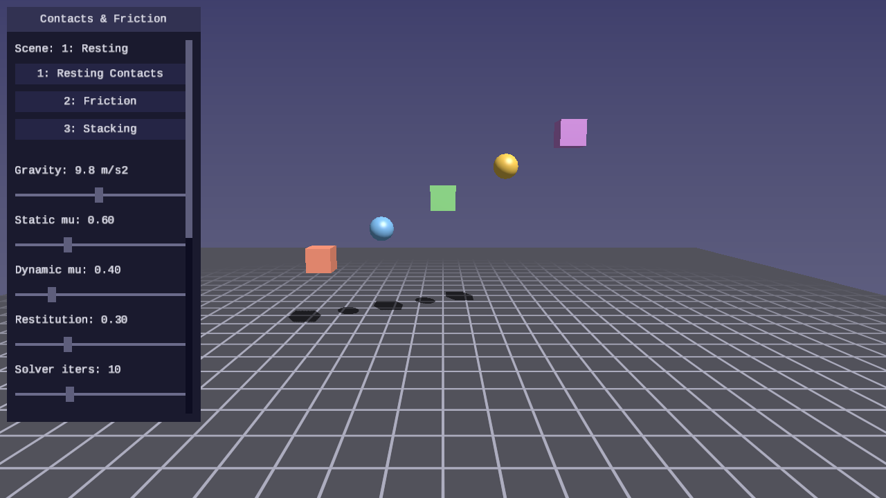
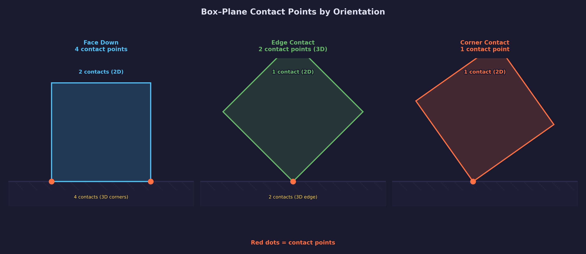
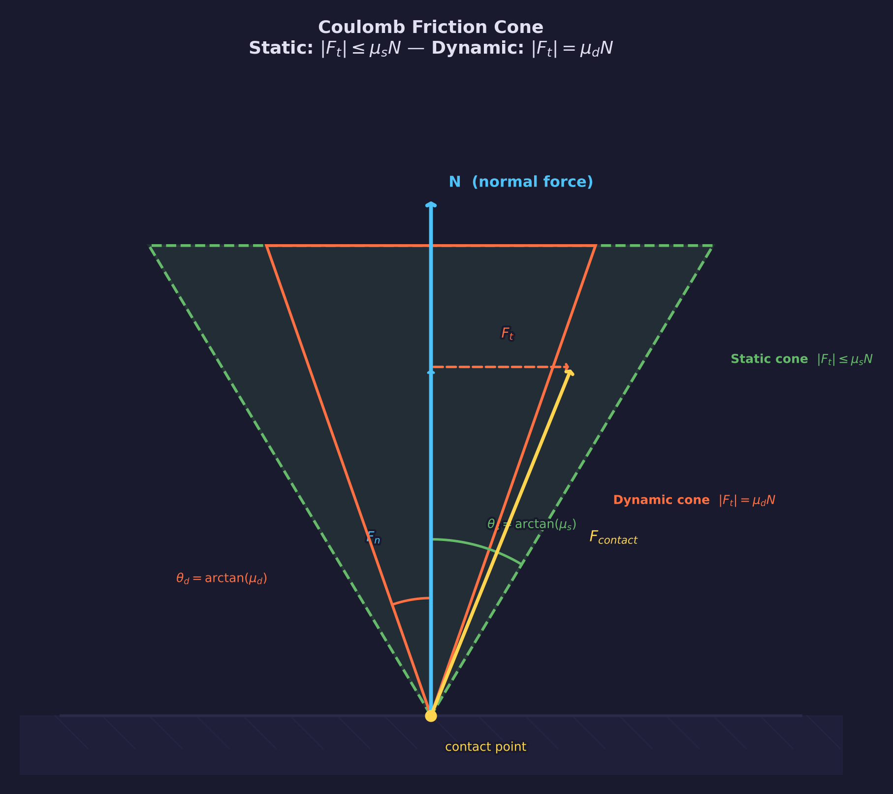
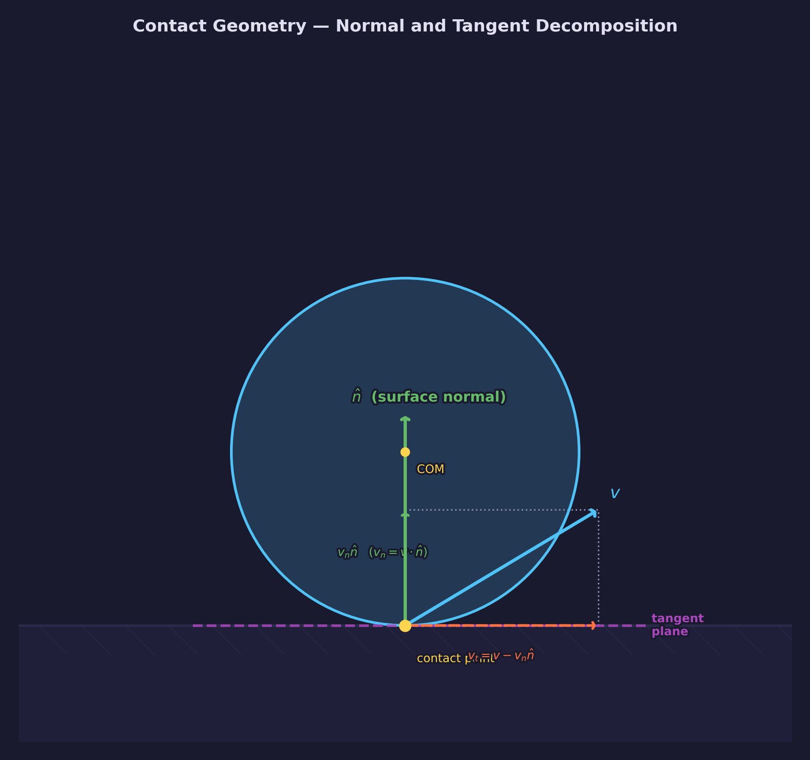
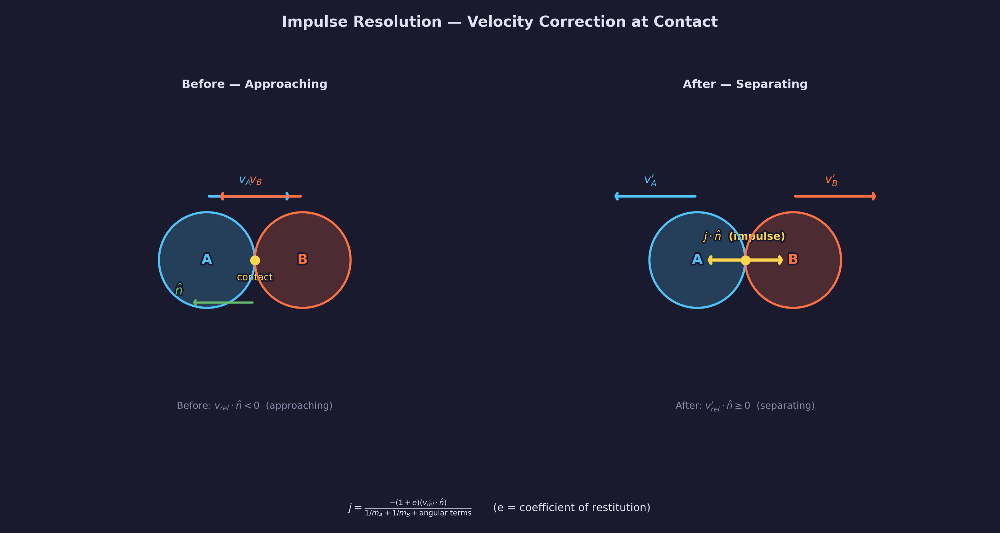
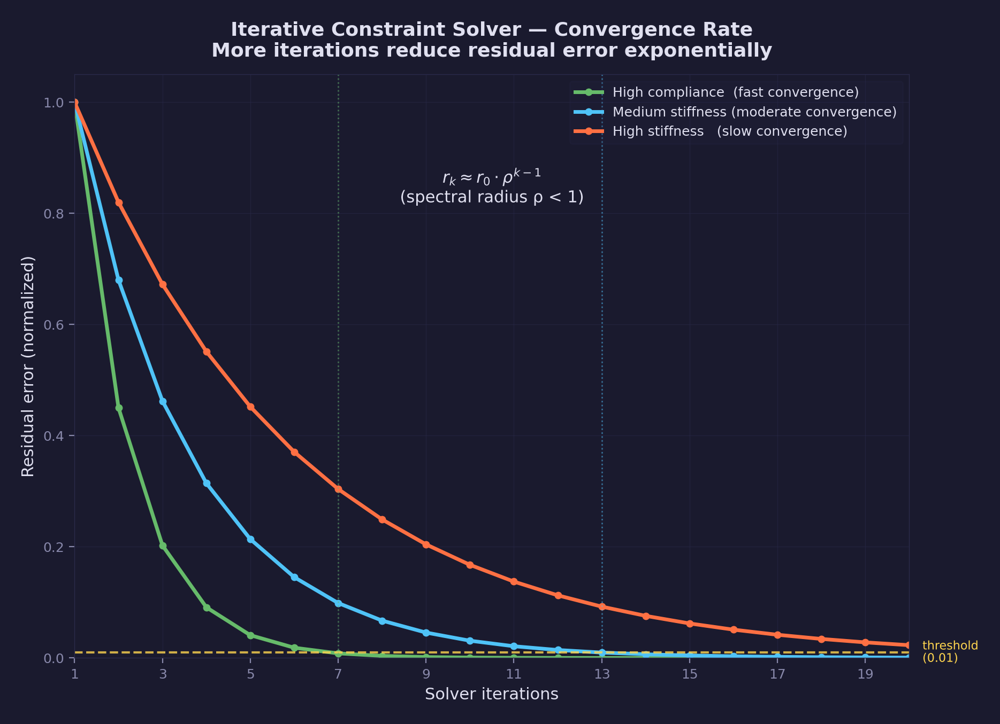

# Physics Lesson 06 — Resting Contacts and Friction

Plane contact detection, Coulomb friction, and iterative contact solving
for rigid bodies.

## What you'll learn

- How to detect contacts between rigid body shapes (spheres, boxes) and
  planes
- The Coulomb friction model — static vs dynamic friction and the friction
  cone
- Impulse-based contact resolution that handles both normal bounce and
  tangential friction
- Baumgarte stabilization for correcting accumulated penetration
- Iterative contact solving — why multiple passes improve stacking stability
- Resting contact detection — zeroing restitution at low velocities to
  prevent micro-bouncing
- How friction coefficients affect whether objects slide, roll, or stick

## Result

| Screenshot | Animation |
|---|---|
|  |  |

Three interactive scenes demonstrate contact resolution and friction:

1. **Resting Contacts** — Spheres and boxes drop from varying heights and
   settle on the ground plane
2. **Friction Comparison** — Objects slide across the ground with adjustable
   friction, showing how boxes (flat contact) and spheres (point contact)
   behave differently
3. **Stacking** — A tower of spheres held up by friction, body-body
   sphere-sphere collisions, and iterative solving

**Controls:**

| Key | Action |
|---|---|
| WASD / Arrows | Move camera |
| Mouse | Look around |
| 1-3 | Select scene |
| R | Reset simulation |
| P | Pause / resume |
| T | Toggle slow motion |
| Escape | Release mouse / quit |

**UI Panel:**

| Control | Effect |
|---|---|
| Gravity | Gravitational acceleration (m/s²) |
| Static mu | Static friction coefficient — force needed to start sliding |
| Dynamic mu | Dynamic friction coefficient — resistance while sliding |
| Restitution | Bounciness (0 = no bounce, 1 = perfectly elastic) |
| Solver iters | Contact solver passes (more = better stacking) |
| Init Vel | Initial sliding velocity (Scene 2) |

## The physics

### Contact detection

Before resolving forces, we need to know *where* two objects touch and
*how deep* they overlap. This lesson implements two contact generators:

**Sphere-plane:** The simplest case. The signed distance from the sphere
center to the plane tells us everything:

$$
d = (\mathbf{p} - \mathbf{p}_\text{plane}) \cdot \mathbf{n}
$$

$$
\text{penetration} = r - d
$$

If penetration is positive, the sphere intersects the plane. The contact
point lies on the plane surface directly below the sphere center.

**Box-plane (OBB-plane):** We test all 8 corners of the oriented box against
the plane. Each corner that lies below the plane surface generates a contact
point. A face-down box produces 4 contacts, an edge produces 2, and a
corner produces 1.

For each corner in local space
$(\pm h_x, \pm h_y, \pm h_z)$,
transform to world space:

$$
\mathbf{c}_\text{world} = \mathbf{p}_\text{body} + R \cdot \mathbf{c}_\text{local}
$$

Then compute the signed distance to the plane. If negative, that corner is
below the surface and generates a contact.



### Coulomb friction

Friction opposes sliding. The Coulomb model defines two regimes:

- **Static friction** ($\mu_s$): The force needed to *start* sliding.
  While stationary, friction can match any applied tangential force up to
  $\mu_s \cdot |N|$, where $N$ is the normal force.

- **Dynamic friction** ($\mu_d$): The resistance *while sliding*. Always
  $\mu_d \leq \mu_s$ — it takes more force to start moving than to keep
  moving.

The friction force is constrained to the **friction cone**:

$$
|F_\text{friction}| \leq \mu \cdot |F_\text{normal}|
$$



In impulse-based resolution, this translates to clamping the tangential
impulse:

$$
|j_t| \leq \mu_s \cdot j_n \quad \text{(static — full stop)}
$$

$$
|j_t| = \mu_d \cdot j_n \quad \text{(dynamic — if static limit exceeded)}
$$

### Contact normal and tangent decomposition

At a contact point, the relative velocity between two bodies is decomposed
into normal and tangential components:

$$
v_n = \mathbf{v}_\text{rel} \cdot \mathbf{n}
$$

$$
\mathbf{v}_t = \mathbf{v}_\text{rel} - v_n \cdot \mathbf{n}
$$

The normal component determines whether the bodies are approaching
(collision) or separating (no response needed). The tangential component
is the sliding velocity that friction opposes.



### Impulse-based contact resolution

Each contact is resolved by computing an impulse — an instantaneous change
in momentum — along the contact normal. The impulse magnitude accounts
for both bodies' masses and their rotational inertia:

$$
j_n = \frac{-(1 + e) \cdot v_n}{m_\text{eff}^{-1}}
$$

where the effective inverse mass includes rotational terms:

$$
m_\text{eff}^{-1} = m_a^{-1} + m_b^{-1} + \mathbf{n} \cdot \left[ (I_a^{-1}(\mathbf{r}_a \times \mathbf{n})) \times \mathbf{r}_a \right] + \mathbf{n} \cdot \left[ (I_b^{-1}(\mathbf{r}_b \times \mathbf{n})) \times \mathbf{r}_b \right]
$$

The rotational terms mean that contacts far from the center of mass (large
$\mathbf{r}$) produce more rotation and less linear velocity change — the
body pivots around the contact point rather than bouncing straight back.



### Baumgarte stabilization

Impulse-based solving works on velocities, but numerical integration
causes objects to drift into each other over time. Baumgarte stabilization
adds a velocity bias that gently pushes penetrating objects apart:

$$
v_\text{bias} = \frac{\beta}{\Delta t} \cdot \max(\text{penetration} - \text{slop}, 0)
$$

The **slop** parameter (0.01 m in our implementation) allows a small amount
of overlap without correction, preventing jitter from over-correction. The
**beta** factor (0.2) controls correction speed — too high causes jitter,
too low allows visible interpenetration.

### Resting contacts

When the closing velocity at a contact drops below a threshold (0.5 m/s),
restitution is set to zero. This prevents the infinite micro-bouncing that
would otherwise occur as objects try to settle:

```c
if (fabsf(v_n) < FORGE_PHYSICS_RB_RESTING_THRESHOLD) {
    e = 0.0f;  /* no bounce — absorb remaining energy */
}
```

Without this threshold, a box dropped from 2 meters would bounce forever
at imperceptibly small heights, consuming solver time without visible
effect.

### Iterative solving

A single pass through all contacts resolves each one independently, but
the resolution of one contact changes the velocities that affect
neighboring contacts. For stacked objects, this creates a propagation
problem: the bottom contact doesn't know about the weight of the objects
above it.

The iterative solver runs multiple passes:

```text
for iter in [0, iterations):
    for each contact:
        resolve(contact)
```

Each pass propagates information from resolved contacts to their
neighbors. With enough iterations, the solution converges to a state where
all contacts are simultaneously satisfied.



In practice, 8-15 iterations produce stable stacking for 3-6 bodies. The
UI slider lets you observe how fewer iterations cause instability (bodies
jitter or fall through each other) while more iterations produce clean
resting behavior.

## The code

### Fixed timestep

The simulation runs at 60 Hz with an accumulator pattern, identical to
previous physics lessons:

```c
state->accumulator += sim_dt;
while (state->accumulator >= PHYSICS_DT) {
    physics_step(state);
    state->accumulator -= PHYSICS_DT;
}
```

### Physics step

Each step follows the sequence: apply forces, integrate, detect contacts,
resolve contacts.

```c
/* 1. Apply gravity */
for (int i = 0; i < state->num_bodies; i++)
    forge_physics_rigid_body_apply_gravity(&bodies[i], gravity);

/* 2. Integrate positions and orientations */
for (int i = 0; i < state->num_bodies; i++)
    forge_physics_rigid_body_integrate(&bodies[i], PHYSICS_DT);

/* 3. Detect contacts with ground plane */
for (int i = 0; i < state->num_bodies; i++) {
    if (info[i].shape_type == SHAPE_SPHERE)
        forge_physics_rb_collide_sphere_plane(...);
    else
        forge_physics_rb_collide_box_plane(...);
}

/* 4. Resolve with iterative solver */
forge_physics_rb_resolve_contacts(contacts, num_contacts,
    bodies, num_bodies, solver_iterations, PHYSICS_DT);
```

### Rendering

Physics state maps to rendered objects through interpolation. Each body's
position and orientation are interpolated between the previous and current
physics state for smooth visuals at any frame rate:

```c
vec3 pos = vec3_lerp(rb->prev_position, rb->position, alpha);
quat orient = quat_slerp(rb->prev_orientation, rb->orientation, alpha);
```

The scene renderer (`forge_scene.h`) handles Blinn-Phong lighting, shadow
mapping, the grid floor, and UI — this lesson adds no custom shaders.

## Key concepts

- **Contact detection** — Finding where two shapes intersect and
  generating contact geometry (point, normal, depth)
- **Coulomb friction** — The force model that distinguishes static
  (sticking) from dynamic (sliding) friction
- **Friction cone** — The geometric constraint
  $|F_t| \leq \mu \cdot |F_n|$ that limits tangential force
- **Effective mass** — The combined linear and rotational resistance to
  impulse at a contact point
- **Baumgarte stabilization** — Velocity bias that corrects positional
  drift from numerical integration
- **Resting threshold** — Zeroing restitution at low velocities to
  prevent micro-bouncing
- **Iterative solving** — Multiple passes over contacts for convergence
  in stacked configurations

## The physics library

This lesson adds the following to `common/physics/forge_physics.h`:

| Function | Purpose |
|---|---|
| `forge_physics_rb_collide_sphere_plane()` | Sphere-plane contact detection |
| `forge_physics_rb_collide_sphere_sphere()` | Sphere-sphere rigid body collision detection |
| `forge_physics_rb_collide_box_plane()` | OBB-plane contact detection (up to 8 contacts) |
| `forge_physics_rb_resolve_contact()` | Single contact resolution with friction |
| `forge_physics_rb_resolve_contacts()` | Iterative solver for multiple contacts |

| Type | Purpose |
|---|---|
| `ForgePhysicsRBContact` | Rigid body contact data (point, normal, penetration, friction) |

See: [common/physics/README.md](../../../common/physics/README.md)

## Where it's used

- [Physics Lesson 04](../04-rigid-body-state/) — Rigid body state and
  orientation (the bodies this lesson detects contacts for)
- [Physics Lesson 05](../05-forces-and-torques/) — Force generators
  including the simplified friction model this lesson replaces with
  Coulomb friction
- [Math Lesson 05](../../math/05-matrices/) — Matrix math used for
  inertia tensor transforms

## Building

```bash
cmake -B build
cmake --build build --config Debug

# Windows
build\lessons\physics\06-resting-contacts-and-friction\Debug\06-resting-contacts-and-friction.exe

# Linux / macOS
./build/lessons/physics/06-resting-contacts-and-friction/06-resting-contacts-and-friction
```

## Exercises

1. **Adjust friction coefficients**: Set static friction to 0 and observe
   how easily objects slide. Set it to 2.0 and observe how quickly they
   stop. Why does the solver clamp $\mu_d \leq \mu_s$ automatically?
   What would break physically if dynamic friction exceeded static?

2. **Stacking height**: In Scene 3, increase the number of stacked bodies
   and observe when the tower becomes unstable. How does increasing solver
   iterations help? What is the minimum iteration count for a 6-body stack?

3. **Mixed materials**: Modify the code to give each body its own friction
   coefficient. Make the bottom box rubber (high friction) and the top box
   ice (low friction). How does the stack behave?

4. **Tilted plane**: Change the ground plane to be tilted at 15 degrees.
   At what friction coefficient do objects start sliding? Compare with the
   theoretical prediction: $\mu_s = \tan(\theta)$.

## Further reading

- [Physics Lesson 04](../04-rigid-body-state/) — Rigid body state,
  inertia tensors, and integration
- [Physics Lesson 05](../05-forces-and-torques/) — Force generators and
  the force accumulator pattern
- Catto, "Iterative Dynamics with Temporal Coherence" (GDC 2005) — The
  standard reference for impulse-based iterative solvers
- Ericson, "Real-Time Collision Detection" — Contact generation
  algorithms for primitive shapes
- Millington, "Game Physics Engine Development", Ch. 14-15 — Contact
  resolution and friction
