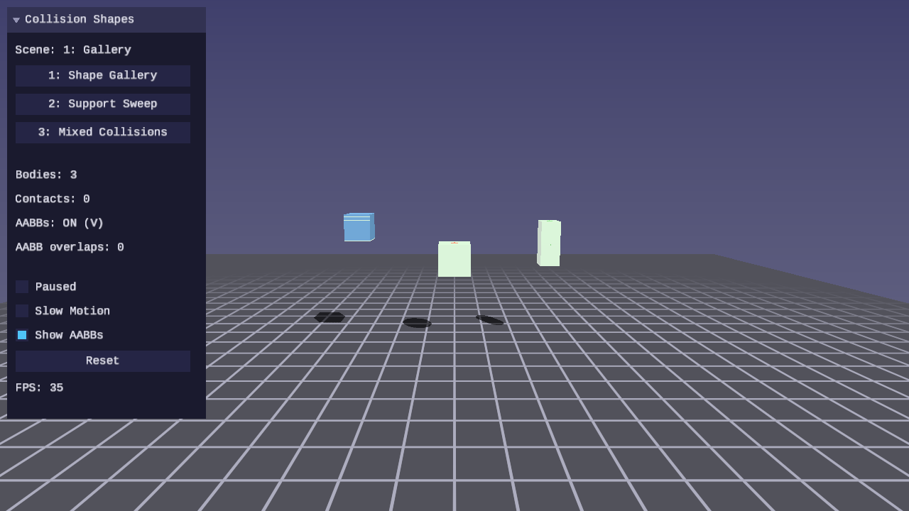
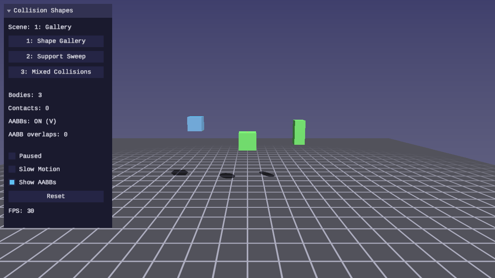

# Physics Lesson 07 — Collision Shapes and Support Functions

Collision shape abstraction, support functions (the geometric core of GJK),
and axis-aligned bounding box computation.

## What you'll learn

- How to represent collision geometry with a tagged union
  (`ForgePhysicsCollisionShape`) instead of ad-hoc per-body metadata
- The support function — what it computes, why it matters, and how it
  differs for spheres, boxes, and capsules
- AABB computation from oriented shapes — the foundation of broadphase
  collision detection
- How to dispatch collision detection based on shape type
- Capsule inertia tensors via the composite body theorem (cylinder +
  two hemispheres with the parallel axis theorem)

## Result

| Screenshot | Animation |
|---|---|
|  |  |

Three interactive scenes demonstrate collision shapes and support functions:

1. **Shape Gallery** — A sphere, box, and capsule drop onto the ground.
   AABB wireframes update per frame, showing how the bounding box encloses
   each shape at its current orientation.
2. **Support Point Sweep** — A single shape (switchable with 4/5/6 keys)
   with a direction arrow sweeping around it. The support point traces the
   shape's silhouette, visualizing what the function returns geometrically.
3. **Mixed Collisions** — Nine shapes (spheres, boxes, capsules) drop and
   collide. Collision dispatch reads `ForgePhysicsCollisionShape.type`
   instead of ad-hoc fields.

**Controls:**

| Key | Action |
|---|---|
| WASD / Arrows | Move camera |
| Mouse | Look around |
| 1-3 | Select scene |
| 4/5/6 | Scene 2: select sphere/box/capsule |
| V | Toggle AABB visualization |
| R | Reset simulation |
| P | Pause / resume |
| T | Toggle slow motion |
| Escape | Release mouse / quit |

## Key concepts

### Collision shape abstraction

Previous lessons stored shape parameters in ad-hoc structs — `BodyRenderInfo`
carried `shape_type`, `sphere_radius`, `half_extents`, and `half_h` as
separate fields. This works for two shapes but does not scale.

`ForgePhysicsCollisionShape` is a tagged union: a type enum plus a union of
per-type parameter structs.

```c
typedef struct ForgePhysicsCollisionShape {
    ForgePhysicsShapeType type;
    union {
        struct { float radius; }                     sphere;
        struct { vec3 half_extents; }                box;
        struct { float radius; float half_height; }  capsule;
    } data;
} ForgePhysicsCollisionShape;
```

Each shape type stores only what it needs. A sphere needs one float. A box
needs three. A capsule needs two. The `type` field enables dispatch:

```c
switch (shape->type) {
case FORGE_PHYSICS_SHAPE_SPHERE:
    /* use shape->data.sphere.radius */
    break;
case FORGE_PHYSICS_SHAPE_BOX:
    /* use shape->data.box.half_extents */
    break;
case FORGE_PHYSICS_SHAPE_CAPSULE:
    /* use shape->data.capsule.radius, shape->data.capsule.half_height */
    break;
}
```

Shapes are separate from rigid bodies. The demo keeps `shapes[]` parallel to
`bodies[]`, matching the parallel-array pattern from
[Lesson 06](../06-resting-contacts-and-friction/).

### Support functions

The support function of a convex shape returns the point on the shape's
surface that is farthest in a given direction:

```text
support(shape, direction) = argmax_{p in shape} dot(p, direction)
```

This is the geometric core of the GJK algorithm (covered in Lesson 09).
For now, the support function lets us visualize the shape's geometry and
verify that our shape representations are correct.

**Sphere support:**

The farthest point on a sphere is always along the query direction:

```text
support = center + normalize(direction) * radius
```

The support function traces a perfect circle — the sphere looks the same
from every direction.

**Box support:**

For each local axis, pick the sign that aligns with the direction, giving
one of the 8 corners. Transform that corner to world space:

```c
vec3 local_dir = quat_rotate_vec3(inverse_orient, direction);
corner.x = (local_dir.x >= 0) ? +half_x : -half_x;
corner.y = (local_dir.y >= 0) ? +half_y : -half_y;
corner.z = (local_dir.z >= 0) ? +half_z : -half_z;
support = pos + quat_rotate_vec3(orient, corner);
```

The support function traces a rectangle (in 2D) — the silhouette has flat
edges where all points along a face project equally far.

**Capsule support:**

Project the direction onto the capsule's local Y axis to determine which
hemisphere cap is farthest. Then compute the support of that hemisphere
(a sphere centered at the cap):

```text
dot_y = dot(direction, local_Y)
cap_center = pos + sign(dot_y) * half_height * local_Y
support = cap_center + normalize(direction) * radius
```

The support function traces a stadium shape — two semicircles connected by
straight segments.

### AABB computation

An axis-aligned bounding box (AABB) is the tightest rectangle aligned with
the world axes that fully encloses the shape. AABBs are the standard
broadphase primitive: cheap to compute, cheap to test for overlap.

**Sphere AABB:** `center +/- radius` on each axis. Orientation-independent.

**Box AABB:** Rotate each local half-extent axis to world space, take absolute
values, sum the per-axis contributions:

```text
world_half.x = |R[0][0]|*hx + |R[0][1]|*hy + |R[0][2]|*hz
```

This gives the tightest AABB without testing all 8 corners.

**Capsule AABB:** Compute the two cap centers in world space, take
component-wise min/max, expand by radius.

Two AABBs overlap if and only if their projections overlap on all three axes
(the separating axis theorem for axis-aligned boxes). This O(1) test is the
entire broadphase check — if AABBs do not overlap, the shapes cannot be
colliding, and no expensive narrowphase is needed.

### Capsule inertia

A capsule's inertia tensor is computed using the composite body theorem:
split the capsule into a cylinder and two hemispheres, compute each
component's inertia about its own center, then shift to the capsule's center
using the parallel axis theorem.

The cylinder contribution uses the standard cylinder formulas. Each
hemisphere's centroid is at 3/8 of the radius from the flat face, so the
parallel axis shift is `half_height + (3/8) * radius`.

### Capsule-plane collision (temporary)

This lesson uses a two-sphere approximation for capsule-plane contact:
test two spheres centered at the hemisphere caps. This is exact for upright
capsules and reasonable for moderate tilts. GJK-based capsule collision will
replace this in Lesson 09.

## Library additions

This lesson adds to `common/physics/forge_physics.h`:

| Function | Purpose |
|---|---|
| `forge_physics_shape_sphere(radius)` | Create sphere shape |
| `forge_physics_shape_box(half_extents)` | Create box shape |
| `forge_physics_shape_capsule(radius, half_height)` | Create capsule shape |
| `forge_physics_shape_is_valid(shape)` | Validate type and dimensions |
| `forge_physics_rigid_body_set_inertia_capsule(rb, r, h)` | Capsule inertia tensor |
| `forge_physics_rigid_body_set_inertia_from_shape(rb, shape)` | Dispatch to correct inertia setter |
| `forge_physics_shape_support(shape, pos, orient, dir)` | Farthest point in direction |
| `forge_physics_shape_compute_aabb(shape, pos, orient)` | World-space AABB |
| `forge_physics_aabb_overlap(a, b)` | Boolean overlap test |
| `forge_physics_aabb_expand(aabb, margin)` | Grow AABB by margin |
| `forge_physics_aabb_center(aabb)` | Center point |
| `forge_physics_aabb_extents(aabb)` | Half-extents |

New types: `ForgePhysicsShapeType`, `ForgePhysicsCollisionShape`,
`ForgePhysicsAABB`.

## Building

```bash
cmake -B build
cmake --build build --target 07-collision-shapes
```

## Exercises

1. Add a fourth shape type — cylinder. Implement its support function and
   AABB computation.
2. Visualize the Minkowski difference of two shapes by computing support
   points in many directions and connecting them.
3. Implement AABB-vs-AABB broad phase: before testing narrowphase for each
   pair, check `forge_physics_aabb_overlap` first and skip pairs that do not
   overlap.
4. Add a "fat AABB" mode using `forge_physics_aabb_expand` with a small
   margin. Observe how this reduces the number of AABB recomputations needed
   when objects move slowly.

## Further reading

- Gilbert, Johnson, Keerthi, "A Fast Procedure for Computing the Distance
  Between Complex Objects in Three-Dimensional Space" (1988) — the original
  GJK paper that motivates support functions
- Ericson, "Real-Time Collision Detection", Ch. 4 — AABB trees, broadphase
- Millington, "Game Physics Engine Development", Ch. 12 — primitive shapes,
  collision geometry
