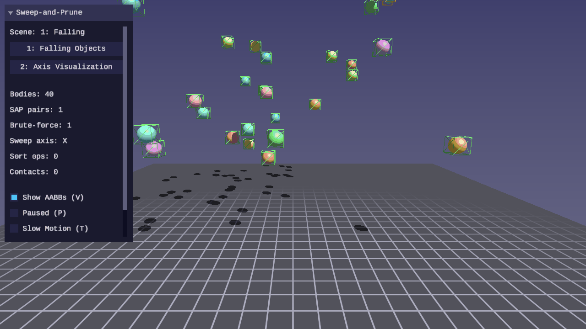
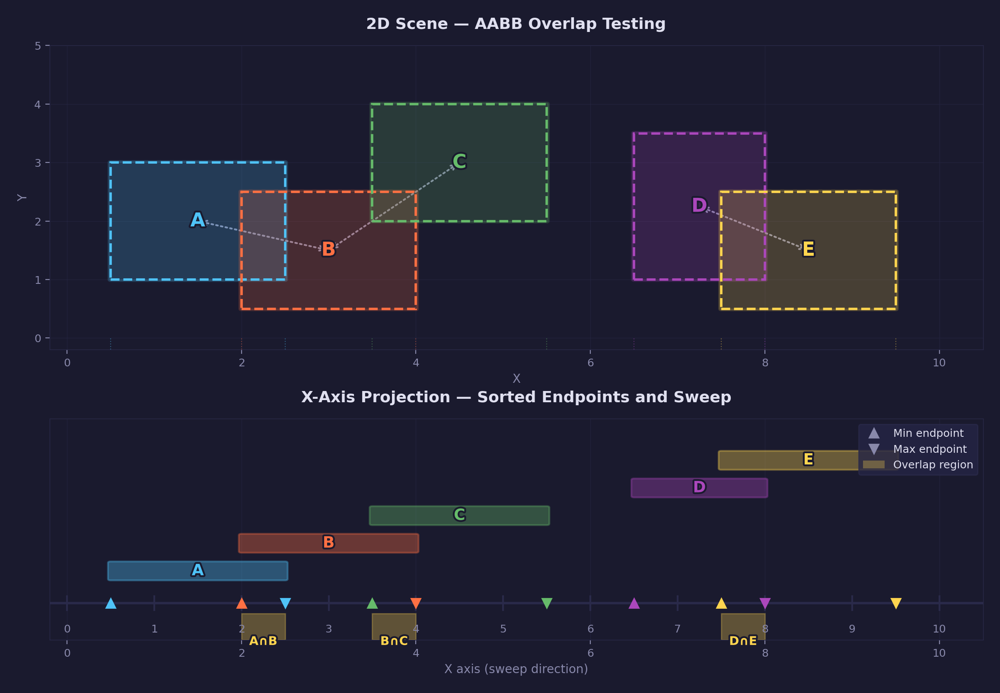
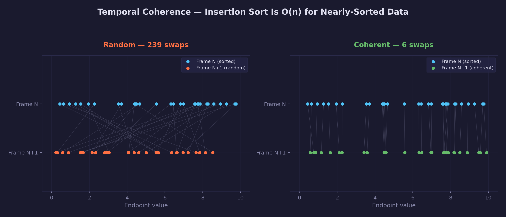
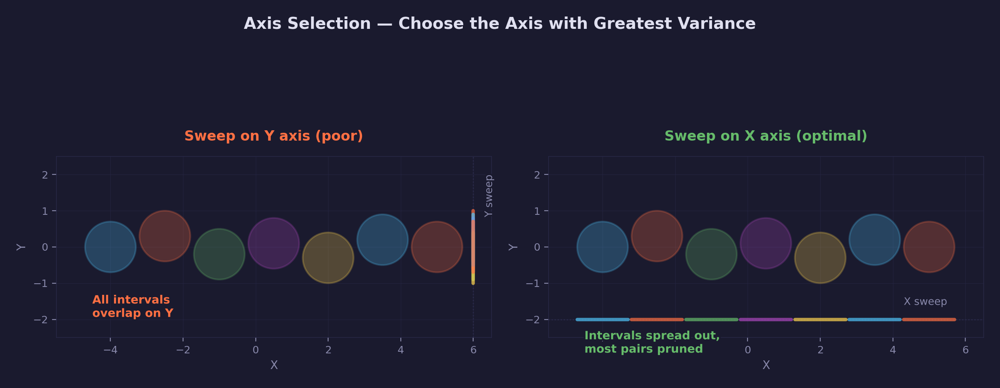

# Physics Lesson 08 — Sweep-and-Prune Broadphase

Sort-and-sweep broadphase collision detection. Projects AABBs onto a single
axis, insertion-sorts the endpoints, and sweeps to find overlapping pairs
in near-linear time for spatially coherent scenes.

## What you will learn

- Why broadphase matters: reducing O(n^2) pair testing
- The sweep-and-prune (SAP) algorithm: endpoints, sorting, sweeping
- Axis selection by variance for optimal pruning
- Insertion sort and temporal coherence
- Comparing broadphase output against brute-force for validation

## Result




Two interactive scenes demonstrating the SAP broadphase:

1. **Falling Objects** — 40 spheres fall with gravity and bounce off the
   ground. The SAP broadphase runs each physics step. AABB wireframes are
   shown in green by default, switching to orange for bodies that appear in
   at least one overlapping pair. The UI panel displays the SAP pair count
   alongside the brute-force pair count to confirm correctness.

2. **Axis Visualization** — 12 static bodies at scripted positions. The UI
   shows which sweep axis was selected and how many sort operations the
   insertion sort needed.

## Key concepts

### Broadphase collision detection

Testing every pair of bodies for collision is O(n^2). For 40 bodies that is
780 pairs per frame. A broadphase quickly eliminates pairs that cannot
possibly collide, leaving only a small set for expensive narrowphase tests.

### Sweep-and-prune algorithm



1. **Project** — compute the min and max of each AABB on a chosen axis
2. **Sort** — insertion-sort the 2N endpoints by value
3. **Sweep** — scan left to right; when a min endpoint opens, test the new
   body against all currently active bodies using full 3-axis AABB overlap;
   when a max endpoint closes, remove the body from the active set

### Temporal coherence



Insertion sort is O(n) for nearly-sorted data. Between consecutive frames,
body positions change slightly, so the endpoint order barely changes. This
makes SAP near-linear per frame after the first sort.

### Axis selection



Choose the axis where AABB centers have the greatest variance. Bodies spread
along that axis produce the most separated endpoints, maximizing the number
of pairs that the sweep can prune.

## Library additions

This lesson adds the following to `common/physics/forge_physics.h`:

| Function | Purpose |
|----------|---------|
| `forge_physics_sap_init` | Zero-initialize a SAP world (sets pointers to NULL) |
| `forge_physics_sap_destroy` | Free dynamic endpoint and pair arrays |
| `forge_physics_sap_select_axis` | Pick the axis with greatest center variance |
| `forge_physics_sap_update` | Populate endpoints, insertion-sort, sweep, output pairs |
| `forge_physics_sap_pair_count` | Number of overlapping pairs |
| `forge_physics_sap_get_pairs` | Pointer to the pair array |
| `forge_physics_vec3_axis` | Extract a vec3 component by index |

Types: `ForgePhysicsSAPEndpoint`, `ForgePhysicsSAPPair`,
`ForgePhysicsSAPWorld` (dynamic arrays via `forge_containers.h`)

## Controls

| Key | Action |
|-----|--------|
| WASD | Move camera |
| Mouse | Look around |
| 1-2 | Switch scenes |
| V | Toggle AABB wireframes |
| R | Reset simulation |
| P | Pause / resume |
| T | Toggle slow motion |
| Escape | Release mouse / quit |

## Building

```bash
cmake -B build
cmake --build build --target 08-sweep-and-prune
./build/lessons/physics/08-sweep-and-prune/08-sweep-and-prune
```

## Exercises

1. **Axis toggle** — Add a key (X) to manually cycle the sweep axis through
   X, Y, Z instead of using automatic variance selection. Observe how pair
   count changes with suboptimal axis choices.

2. **Fat AABBs** — Use `forge_physics_aabb_expand()` to add a small margin
   to each AABB before feeding them to SAP. Measure how the pair count
   increases and whether it reduces narrowphase cache misses.

3. **Multi-axis SAP** — Run SAP independently on all three axes and intersect
   the pair sets. Compare the final pair count against single-axis SAP.

4. **Performance graph** — Plot SAP sort operations over time as bodies settle.
   Verify that sort ops decrease as the scene stabilizes (temporal coherence).

## References

- David Baraff, "Dynamic Simulation of Non-Penetrating Rigid Bodies",
  PhD thesis, 1992 — original sort-and-sweep description
- Erin Catto, Box2D broadphase documentation
- Ian Millington, "Game Physics Engine Development", Ch. 12 — broadphase
  collision detection

## See also

- [Physics Lesson 07 — Collision Shapes](../07-collision-shapes/) — AABB
  computation and overlap testing used by this lesson's broadphase
- [common/physics/ API reference](../../../common/physics/README.md)
- [Math 01 — Vectors](../../math/01-vectors/) — vec3 operations used for
  positions, velocities, and AABB center/extent calculations
- [Math 08 — Orientation](../../math/08-orientation/) — quaternions used
  for rigid body orientation and camera control
- [Physics 01 — Point Particles](../01-point-particles/) — symplectic Euler
  integration used for velocity/position updates each timestep
