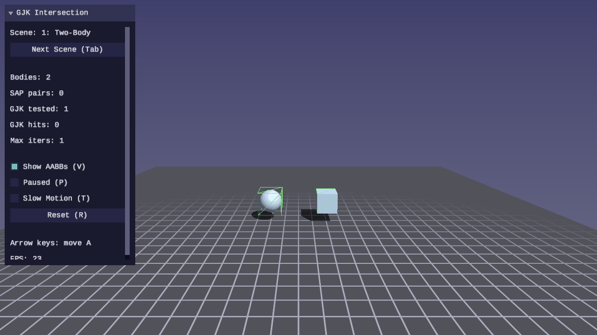

# Physics Lesson 09 — GJK Intersection Testing

Narrowphase collision detection using the Gilbert-Johnson-Keerthi (GJK)
algorithm. GJK determines whether two convex shapes intersect by iteratively
building a simplex in the Minkowski difference of the shapes. If the simplex
encloses the origin, the shapes overlap.

## Result

| | |
|---|---|
|  |  |

## What you will learn

- The Minkowski difference and why it reduces intersection testing to an
  origin containment problem
- How the support function maps a direction to the farthest point on a
  convex shape — and how Minkowski support combines two shapes
- Simplex evolution: how GJK iteratively builds a point, line, triangle, and
  tetrahedron that converges toward the origin
- Voronoi region classification in the line, triangle, and tetrahedron
  sub-algorithms
- How SAP broadphase (Lesson 08) feeds candidate pairs into GJK narrowphase
- Why the final simplex is preserved for EPA (Lesson 10)

## Key concepts

### Minkowski difference

The Minkowski difference of shapes A and B is the set of all vectors
`a − b` where `a ∈ A` and `b ∈ B`. This set contains the origin if and only
if A and B overlap. GJK searches for the origin inside this set without
ever constructing it explicitly.

### Support function

The support function returns the farthest point on a shape in a given
direction. For the Minkowski difference, the support in direction `d` is
`support_A(d) − support_B(−d)`. This is the only operation GJK needs from
the shapes, which is why it works for any convex geometry with a support
function — spheres, boxes, capsules, and arbitrary convex hulls.

### Simplex evolution

GJK maintains a simplex (1–4 vertices) that it grows toward the origin:

1. Start with one support point; search toward the origin
2. Add a second point → line case: find the closest feature to the origin,
   update the search direction
3. Add a third point → triangle case: classify which Voronoi region the
   origin lies in, reduce or keep the triangle
4. Add a fourth point → tetrahedron case: test each face. If the origin is
   inside all faces, intersection is confirmed. Otherwise, reduce to the
   relevant triangle and continue.

If a new support point does not pass the origin along the search direction,
the shapes are separated — the Minkowski difference cannot contain the origin.

### Preserving the simplex for EPA

When GJK reports intersection, the simplex is inflated to a full tetrahedron
(`count == 4`) via additional support queries before returning. This includes
early-exit cases (direction collapse, collinear/coplanar hits) where the
simplex would otherwise be sub-dimensional. EPA (Lesson 10) can therefore use
the returned simplex directly as its starting polytope without needing to
handle 1–3 vertex degenerate cases.

## Scenes

### Scene 1 — Two-Body Test

Two shapes on screen. Move shape A with the arrow keys. Both shapes turn red
when GJK reports intersection. The UI panel shows the GJK result and iteration
count for the current pair.

### Scene 2 — SAP + GJK Pipeline

25 mixed bodies (spheres, boxes, capsules) falling under gravity. SAP finds
broadphase pairs, GJK confirms which pairs actually intersect. Orange AABB
wireframes indicate SAP pairs; red-tinted bodies indicate GJK-confirmed
intersections. The UI shows SAP pair count vs GJK hit count.

### Scene 3 — Shape Gallery

A 3×3 grid showing all nine shape-pair combinations (sphere, box, capsule vs
sphere, box, capsule). Press keys 1–9 to toggle each pair between separated
and overlapping. Demonstrates that one algorithm handles every convex pair.

## Controls

| Key | Action |
|---|---|
| WASD | Move camera |
| Mouse | Look around (click to capture, Escape to release) |
| Space / Shift | Fly up / down |
| Arrow keys | Move shape A (Scene 1) |
| Tab | Cycle scenes |
| 1–9 | Toggle pair overlap (Scene 3) |
| P | Pause / resume |
| R | Reset simulation |
| T | Toggle slow motion |
| V | Toggle AABB wireframes |
| Escape | Release mouse / quit |

## Building

```bash
cmake -B build
cmake --build build --target 09-gjk-intersection
./build/lessons/physics/09-gjk-intersection/09-gjk-intersection
```

## Library additions

This lesson adds to `common/physics/forge_physics.h`:

| Function | Purpose |
|---|---|
| `forge_physics_gjk_support()` | Minkowski difference support point |
| `forge_physics_gjk_intersect()` | GJK boolean intersection test |
| `forge_physics_gjk_test_bodies()` | Convenience wrapper for rigid body pairs |

Types: `ForgePhysicsGJKVertex`, `ForgePhysicsGJKSimplex`,
`ForgePhysicsGJKResult`.

## Prerequisites

- [Lesson 07 — Collision Shapes](../07-collision-shapes/) — support functions
  and shape types that GJK calls
- [Lesson 08 — Sweep-and-Prune](../08-sweep-and-prune/) — broadphase that
  feeds candidate pairs to GJK
- [Math Lesson 08 — Orientation](../../math/08-orientation/) — quaternions
  used for shape orientation

## AI skill

[`/dev-physics-lesson`](../../../.claude/skills/dev-physics-lesson/SKILL.md)
scaffolds new physics lessons with the forge_scene.h baseline, fixed timestep,
and interactive controls.

## What comes next

[Lesson 10 — EPA Penetration Depth](../10-epa-penetration-depth/) uses the
GJK simplex as a starting polytope for the Expanding Polytope Algorithm, which
computes the penetration depth and contact normal needed for physics response.

## Exercises

1. **Visualize the simplex** — Draw the GJK simplex vertices and edges as
   debug lines in Scene 1. Show how the simplex evolves each iteration by
   coloring earlier vertices dimmer. This makes the algorithm's convergence
   visible.

2. **Add a rotation control** — Let the user rotate shape B in Scene 1 with
   Q/E keys. Verify that GJK handles oriented boxes and capsules correctly
   at arbitrary rotations, not just axis-aligned configurations.

3. **Iteration count heatmap** — In Scene 2, color each body by how many GJK
   iterations its most expensive pair required (green = 1–2, yellow = 3–5,
   red = 6+). This reveals which shape combinations are cheapest and most
   expensive for the algorithm.

4. **Add convex hull support** — Implement a support function for an arbitrary
   convex hull (array of vertices). Add a hull shape to the gallery and verify
   GJK handles it against all other shape types.
