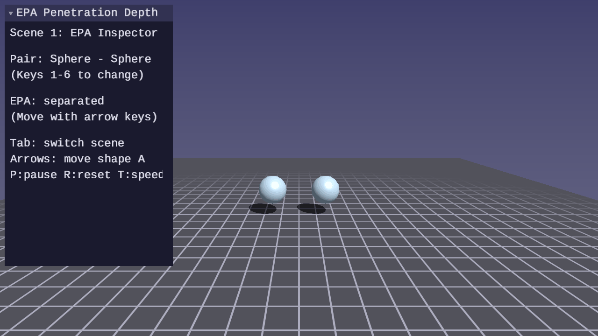

# Physics Lesson 10 — EPA Penetration Depth

From boolean intersection to contact information. The Expanding Polytope
Algorithm takes GJK's final simplex and computes the penetration depth,
contact normal, and contact points — the data needed for physics response.

## What you will learn

- Why GJK's boolean answer is insufficient for collision response
- How EPA expands the GJK simplex into a polytope approximating the
  Minkowski difference boundary
- The relationship between the closest polytope face and the minimum
  translation vector (MTV)
- Silhouette edge detection during polytope expansion
- Barycentric interpolation for contact point reconstruction
- The full SAP → GJK → EPA → solver pipeline working end to end

## Result




**Scene 1 — EPA Inspector:** Move shape A with arrow keys. When shapes
overlap, EPA computes the penetration depth and contact normal. A green
arrow shows the MTV direction, colored spheres mark the contact points
on each shape's surface. The UI panel displays depth, normal, iteration
count, and contact point coordinates.

**Scene 2 — Full Physics Pipeline:** 15 rigid bodies fall under gravity.
SAP broadphase finds AABB-overlapping pairs, GJK confirms intersections,
EPA computes penetration depth and contact normals, and the impulse solver
resolves contacts. Bodies stack, bounce, and settle.

**Controls:**

| Key | Action |
|---|---|
| WASD / Arrows | Move camera / move shape A (Scene 1) |
| Mouse | Look around |
| 1–6 | Select shape pair (Scene 1) |
| Tab | Switch scene |
| V | Toggle AABB wireframes (Scene 2) |
| R | Reset simulation |
| P | Pause / resume |
| T | Toggle slow motion |
| Escape | Release mouse / quit |

## The physics

### From intersection to contact

GJK (Lesson 09) answers a binary question: do two convex shapes overlap?
For collision response, we need three additional pieces of information:

- **Penetration depth** — how far the shapes overlap (meters)
- **Contact normal** — the direction to separate them (unit vector)
- **Contact points** — where on each shape's surface the contact occurs

The Expanding Polytope Algorithm computes all three from the GJK simplex.

### The Minkowski difference and the origin

Recall from Lesson 09 that GJK operates on the Minkowski difference
$A \ominus B = \{a - b : a \in A, b \in B\}$. When shapes A and B overlap,
the origin lies inside the Minkowski difference.

The closest point on the boundary of the Minkowski difference to the origin
defines the **minimum translation vector** (MTV): the shortest displacement
that moves the origin to the boundary, which corresponds to the smallest
translation that separates the shapes.

### The expanding polytope

EPA starts with the GJK tetrahedron — a simplex that encloses the origin
inside the Minkowski difference. This tetrahedron is a coarse inner
approximation of the Minkowski difference boundary. EPA refines it:

1. **Find the closest face** to the origin. This face's normal and distance
   are the current best estimate of the MTV.

2. **Query a new support point** in the direction of the closest face's
   normal. This probes the actual Minkowski difference boundary in the
   direction where the current estimate might be farthest from the truth.

3. **Check convergence.** If the new support point is not significantly
   farther from the origin than the closest face, the face is already on
   (or very near) the true boundary. The algorithm terminates.

4. **Expand the polytope.** Remove all faces visible from the new support
   point, find the silhouette edges between visible and non-visible faces,
   and create new triangular faces connecting each silhouette edge to the
   new vertex.

5. **Repeat** from step 1.

The closest-face distance increases monotonically with each iteration,
guaranteeing convergence.

### Silhouette edges

When a new support point is added, some existing faces of the polytope
become "visible" from that point — the new point is on the positive side
of their plane. These faces must be removed and replaced.

The boundary between visible and non-visible faces forms the
**silhouette**. Each edge shared between a visible and a non-visible face
is a silhouette edge. Edges shared between two visible faces cancel out
(both faces are removed, so the edge disappears).

New triangular faces connect each silhouette edge to the new vertex,
maintaining the polytope's closed, convex surface.

### Contact point reconstruction

Each vertex in the polytope stores the original support points from shapes
A and B (not just the Minkowski difference point). When EPA converges, the
closest face has three vertices with support point data.

The origin's projection onto the closest face yields barycentric
coordinates $(u, v, w)$. Interpolating the support points with these
coordinates reconstructs the contact point on each shape's surface:

$$
p_A = u \cdot \text{sup}_{A,0} + v \cdot \text{sup}_{A,1} + w \cdot \text{sup}_{A,2}
$$

$$
p_B = u \cdot \text{sup}_{B,0} + v \cdot \text{sup}_{B,1} + w \cdot \text{sup}_{B,2}
$$

### Convergence

EPA converges because each iteration strictly increases the distance from
the origin to the closest face. The polytope grows toward the Minkowski
difference boundary from inside, and support queries always return points
on or beyond the boundary. For polyhedral shapes (boxes), EPA converges
in very few iterations. For curved shapes (spheres, capsules), more
iterations are needed to approximate the curved boundary.

## The code

### EPA types

```c
/* A face of the expanding polytope */
typedef struct ForgePhysicsEPAFace {
    int   a, b, c;  /* vertex indices (CCW winding from outside) */
    vec3  normal;    /* unit outward normal */
    float dist;      /* distance from origin to face plane */
} ForgePhysicsEPAFace;

/* EPA result — penetration depth and contact information */
typedef struct ForgePhysicsEPAResult {
    bool  valid;     /* true if EPA converged */
    vec3  normal;    /* penetration normal (from B toward A) */
    float depth;     /* penetration depth (meters) */
    vec3  point_a;   /* contact point on shape A */
    vec3  point_b;   /* contact point on shape B */
    vec3  point;     /* midpoint contact */
    int   iterations;
} ForgePhysicsEPAResult;
```

### Core EPA function

`forge_physics_epa()` takes a GJK result (must be intersecting with
`simplex.count == 4`) and the two shapes. It returns an `EPAResult` with
the penetration depth, contact normal, and contact points.

### Combined pipeline

`forge_physics_gjk_epa_contact()` runs GJK and EPA in sequence, producing
a `ForgePhysicsRBContact` ready for the impulse solver:

```c
ForgePhysicsRBContact contact;
if (forge_physics_gjk_epa_contact(
        &bodies[i], &shapes[i],
        &bodies[j], &shapes[j],
        i, j, 0.6f, 0.4f, &contact))
{
    /* Contact is ready for the solver */
}
```

## The physics library

This lesson adds the following to `common/physics/forge_physics.h`:

| Function | Purpose |
|---|---|
| `forge_physics_epa()` | Core EPA — penetration depth from GJK simplex |
| `forge_physics_epa_bodies()` | Convenience wrapper for rigid body pairs |
| `forge_physics_gjk_epa_contact()` | Combined GJK+EPA → RBContact pipeline |

See: [common/physics/README.md](../../../common/physics/README.md)

## Where it is used

- [Physics Lesson 09](../09-gjk-intersection/) provides the GJK simplex
  that EPA extends
- [Physics Lesson 06](../06-resting-contacts-and-friction/) provides the
  impulse solver that consumes EPA contacts

## Building

```bash
cmake -B build
cmake --build build --config Debug

# Windows
build\lessons\physics\10-epa-penetration-depth\Debug\10-epa-penetration-depth.exe

# Linux / macOS
./build/lessons/physics/10-epa-penetration-depth/10-epa-penetration-depth
```

## Exercises

1. Add a third scene that visualizes the MTV: when EPA reports a contact,
   translate shape A by `normal * depth` and verify the shapes become
   just-touching (depth near zero).

2. Compare EPA depth accuracy against the analytical sphere-sphere depth
   `(r1 + r2) - distance` for various overlap amounts. Plot the error as
   a function of overlap fraction.

3. Modify the EPA convergence tolerance (`FORGE_PHYSICS_EPA_EPSILON`) and
   observe how it affects depth accuracy versus iteration count.

4. Implement EPA for a 2D scenario: start with a GJK triangle instead of
   a tetrahedron, expand polygon edges instead of triangular faces.

## Further reading

- van den Bergen, "Proximity Queries and Penetration Depth Computation
  on 3D Game Objects" (GDC 2001)
- Catto, "Computing Distance" (GDC 2010)
- Ericson, *Real-Time Collision Detection*, Chapter 9 — Convex Hull
  Algorithms
- [Physics Lesson 09 — GJK Intersection Testing](../09-gjk-intersection/)
- [Math Lesson 01 — Vectors](../../math/01-vectors/) — dot product,
  cross product, normalization (used throughout EPA)
- [Math Lesson 08 — Orientation](../../math/08-orientation/) — quaternions
  for oriented shape support functions
