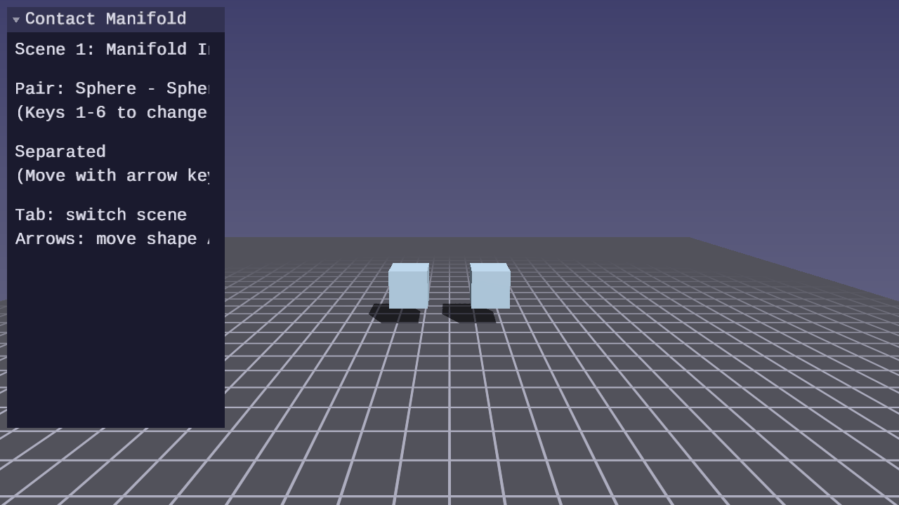
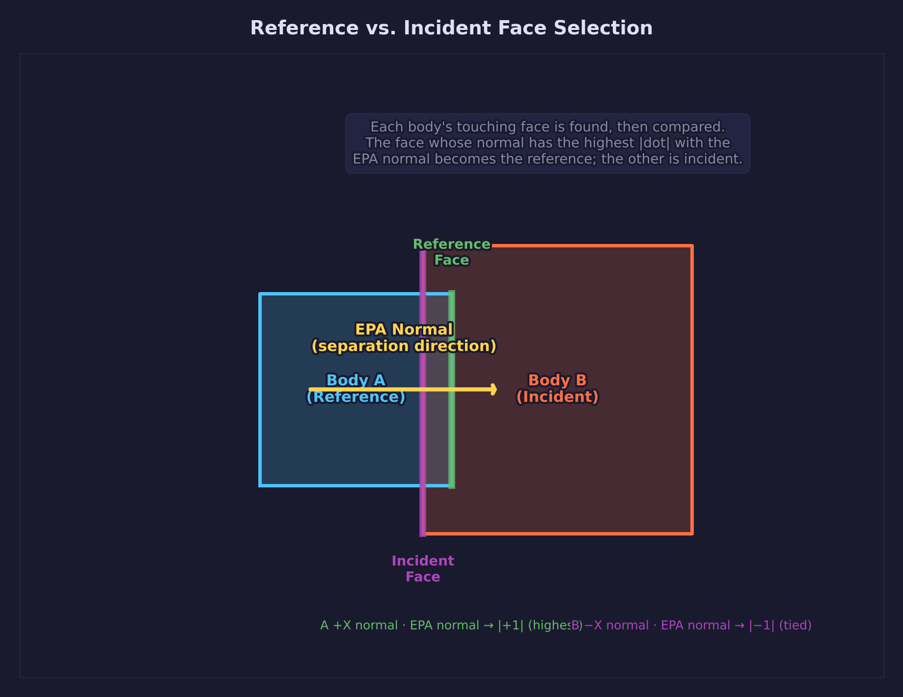
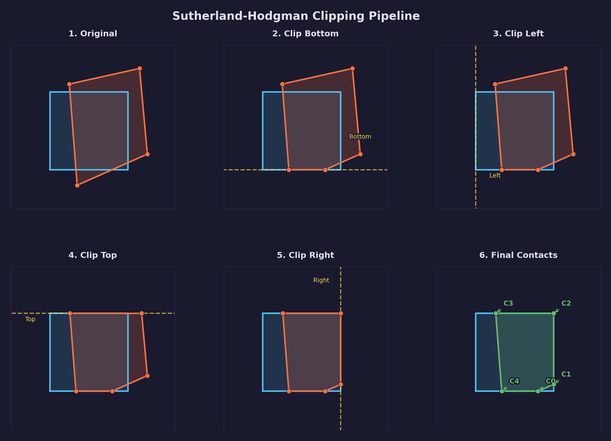
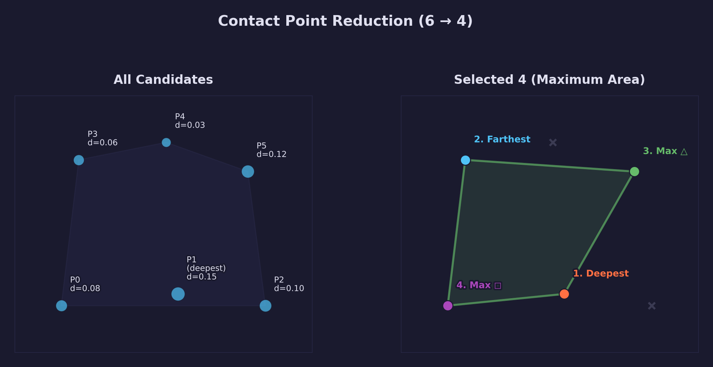
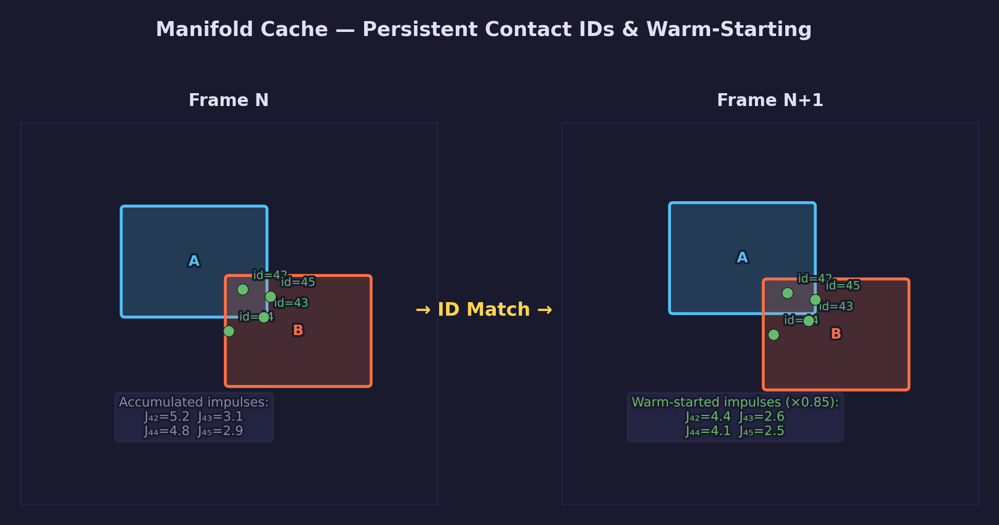

# Physics Lesson 11 — Contact Manifold

From one contact point to a stable contact patch. The contact manifold
pipeline clips two colliding faces against each other, reduces the result
to four representative points, and caches those points across frames so
the solver can warm-start with accumulated impulses.

## What you will learn

- Why a single contact point causes rocking and how multiple contacts
  prevent it
- Reference and incident face selection using the EPA contact normal
- Sutherland-Hodgman polygon clipping: the half-plane test, vertex
  classification, and intersection computation
- Contact point reduction: deepest, farthest, maximum triangle area,
  maximum quadrilateral area
- Persistent contact IDs: encoding geometric features into a stable
  per-contact identifier
- Warm-starting: transferring accumulated impulses from the previous
  frame to accelerate solver convergence

## Result




**Scene 1 — Manifold Inspector:** Place two boxes in contact and observe
the full manifold. Colored spheres show each contact point. The UI panel
displays the contact count, each point's penetration depth, and whether
its impulse was warm-started from the previous frame.

**Scene 2 — Full Physics Pipeline:** 15 rigid bodies fall and stack
under gravity. SAP broadphase, GJK intersection, EPA penetration depth,
Sutherland-Hodgman clipping, manifold cache with warm-starting, and the
sequential impulse solver all work together. Flat-on-flat contacts are
visibly more stable than in Lesson 10.

**Controls:**

| Key | Action |
|---|---|
| WASD / Mouse | Camera fly |
| Arrow keys | Move shape A (Scene 1) |
| 1–6 | Select shape pair (Scene 1) |
| Tab | Switch scene |
| V | Toggle AABB wireframes (Scene 2) |
| M | Toggle manifold cache (Scene 2) |
| R | Reset simulation |
| P | Pause / resume |
| T | Toggle slow motion |
| Escape | Release mouse / quit |

## The physics

### Why one contact point is not enough

EPA (Lesson 10) returns a single contact point: the origin's projection
onto the closest face of the Minkowski difference polytope. For a sphere
resting on a plane, that one point is sufficient — the sphere has no flat
face, so there is genuinely one contact location.

For a box resting on a plane the situation is different. The box has an
entire face in contact with the ground. Giving the solver only one contact
point means it can only push back against the box at one location. The box
rotates about that point until it tips enough to bring another point into
contact, then rotates the other way — an artifact called **rocking**.

Four contact points at the corners of the box face give the solver four
levers to balance the box. The solver applies independent normal impulses
at each point, which together resist any rotation that would lift a corner.

Three non-collinear contact points define a support polygon that resists
tipping. Four contacts represent the full face of a box, distributing
normal forces across all corners. Friction at those contact points
resists in-plane sliding and spinning. The pipeline always reduces to
at most four.

### Reference and incident face selection

The starting material for clipping is two faces: one from each colliding
box. The **reference face** provides the clipping planes. The
**incident face** is clipped against them.



The EPA normal $\hat{n}$ points from body B toward body A (the separation
direction). The reference face is the face whose outward normal is most
aligned with $\hat{n}$:

$$
\text{ref face} = \arg\max_{f \in \text{faces}(A)}
    \hat{n}_f \cdot \hat{n}
$$

The incident face is the face on the other body most *anti-aligned* with
the reference face normal $\hat{n}_\text{ref}$:

$$
\text{inc face} = \arg\min_{f \in \text{faces}(B)}
    \hat{n}_f \cdot \hat{n}_\text{ref}
$$

For a box, both searches reduce to finding the axis-aligned face whose
local-space direction has the largest absolute component along the query
vector. The body with the larger dot product between its candidate face
normal and the EPA normal becomes the reference shape:

```c
float dot_a = SDL_fabsf(vec3_dot(face_a_normal, epa->normal));
float dot_b = SDL_fabsf(vec3_dot(face_b_normal, epa->normal));

if (dot_a >= dot_b) {
    /* A is the reference shape, B is the incident shape */
} else {
    /* B is the reference shape, A is the incident shape */
}
```

Choosing the face most aligned with the normal — rather than an arbitrary
face — minimizes numerical error during clipping because the side planes
are nearly perpendicular to the incident face.

### Sutherland-Hodgman polygon clipping

Sutherland-Hodgman clipping (Sutherland & Hodgman, 1974) clips a convex
polygon against a sequence of half-planes. Each half-plane corresponds to
one edge of the reference face.



A half-plane is defined by a normal $\hat{n}_p$ and a distance $d_p$:

$$
\hat{n}_p \cdot \mathbf{v} \leq d_p
$$

Points satisfying this inequality are "inside" the half-plane and are
kept. Points outside are discarded. When an edge of the polygon crosses
the plane, the intersection is computed and inserted into the output.

For each consecutive vertex pair $(\mathbf{v}_i, \mathbf{v}_{i+1})$:

1. Compute signed distances to the plane:

$$
d_i = \hat{n}_p \cdot \mathbf{v}_i - d_p, \qquad
d_{i+1} = \hat{n}_p \cdot \mathbf{v}_{i+1} - d_p
$$

1. If $d_i \leq 0$, vertex $\mathbf{v}_i$ is inside — emit it.

1. If $d_i$ and $d_{i+1}$ have opposite signs, the edge crosses the
   plane. The intersection is at parameter:

$$
t = \frac{d_i}{d_i - d_{i+1}}
$$

$$
\mathbf{v}_\text{intersect} = \mathbf{v}_i + t(\mathbf{v}_{i+1} - \mathbf{v}_i)
$$

Emit $\mathbf{v}_\text{intersect}$.

The algorithm runs once per edge of the reference face (four passes for a
box). Each pass takes the output of the previous pass as input, so the
clipped polygon grows no larger than the theoretical maximum of
$4 + 4 = 8$ vertices (four incident vertices plus one new vertex per
clipping plane).

After all four passes, the surviving vertices are **projected** onto the
reference face plane. Only vertices with negative signed distance to that
plane — meaning they are on the penetrating side — become contact points.
Their penetration depth is the magnitude of that signed distance.

The implementation in `forge_physics_clip_polygon()`:

```c
for (int i = 0; i < in_count; i++) {
    int next = (i + 1) % in_count;
    float d_i    = vec3_dot(in[i],    plane_n) - plane_d;
    float d_next = vec3_dot(in[next], plane_n) - plane_d;

    if (d_i <= 0.0f) {
        out[out_count++] = in[i];           /* inside — keep */
    }

    if ((d_i > 0.0f) != (d_next > 0.0f)) {
        float t = d_i / (d_i - d_next);
        out[out_count++] = vec3_lerp(in[i], in[next], t); /* intersection */
    }
}
```

### Contact point reduction

Clipping can produce up to eight candidate points. The manifold stores
at most four. The reduction algorithm (Ericson, *Real-Time Collision
Detection*, Section 5.3) selects the four points that maximize the area
of the contact patch:



1. **Deepest.** Keep the point with the largest penetration depth. This
   point contributes most to positional correction and must not be
   discarded.

2. **Farthest.** Keep the point farthest from the deepest. This maximizes
   the span of the contact patch along its longest axis.

3. **Maximum triangle area.** Among the remaining candidates, keep the
   point that maximizes the area of the triangle formed with the first two
   selected points. Maximizing triangle area is equivalent to finding the
   point that creates the tallest perpendicular from the base line.

4. **Maximum quadrilateral area.** Among the remaining candidates, keep
   the point that maximizes the total area added to the existing triangle.
   This is approximated as the sum of squared cross-product magnitudes
   from the new point to each edge of the existing triangle.

The result is a contact patch that spans as much of the overlapping face
area as possible, giving the solver the best geometric leverage.

```c
/* Step 3: maximize triangle area with i0, i1 */
vec3 edge01 = vec3_sub(points[i1], points[i0]);
for (int i = 0; i < count; i++) {
    if (i == i0 || i == i1) continue;
    vec3 edge0i = vec3_sub(points[i], points[i0]);
    vec3 cross   = vec3_cross(edge01, edge0i);
    float area   = vec3_length_squared(cross); /* proportional to area² */
    if (area > max_area) { max_area = area; i2 = i; }
}
```

Comparing squared lengths avoids a square root while preserving the
ordering — a larger squared magnitude corresponds to a larger area.

### Persistent contact IDs and warm-starting

The sequential impulse solver (Lesson 06) works iteratively: it applies
impulses, checks constraint violations, and repeats. Each iteration
reduces the error. Starting with impulses close to the converged solution
— rather than zero — dramatically reduces the number of iterations needed.

This is **warm-starting** (Catto, "Iterative Dynamics with Temporal
Coherence", GDC 2005). The contact manifold carries accumulated impulses
from the previous frame:

$$
\lambda^{(0)} = \alpha \, \lambda^{\text{prev}}
$$

where $\lambda^{(0)}$ is the initial guess for the current frame,
$\lambda^\text{prev}$ is the converged impulse from the last frame, and
$\alpha = 0.85$ (`FORGE_PHYSICS_MANIFOLD_WARM_SCALE`) is a damping
factor that discounts stale impulses when bodies have moved.

The impulse is applied at the start of the solver step:

$$
\mathbf{v}_A \mathrel{+}= m_A^{-1} \lambda^{(0)} \hat{n}, \qquad
\boldsymbol{\omega}_A \mathrel{+}= I_A^{-1} (\mathbf{r}_A \times \lambda^{(0)} \hat{n})
$$

and similarly for body B with opposite sign.

For warm-starting to work, the same contact point must be recognizable
across frames. Position-based matching is unreliable — bodies move between
frames, so the world-space position shifts. Instead, each contact point
carries a **persistent ID** encoding the geometric features that produced
it:

```c
uint32_t id = forge_physics_manifold_contact_id(
    ref_face_idx,    /* which face on the reference shape  */
    inc_face_idx,    /* which face on the incident shape   */
    clip_edge_idx);  /* which clipping edge added this point */
```

As long as the same pair of faces remains in contact, the same ID
appears in both the old and new manifold. The cache update function
matches by ID and copies the impulses:

```c
for (int i = 0; i < entry.manifold.count; i++) {
    for (int j = 0; j < old->count; j++) {
        if (old->contacts[j].id == nc->id) {
            nc->normal_impulse    = old->contacts[j].normal_impulse
                                    * FORGE_PHYSICS_MANIFOLD_WARM_SCALE;
            nc->tangent_impulse_1 = old->contacts[j].tangent_impulse_1
                                    * FORGE_PHYSICS_MANIFOLD_WARM_SCALE;
            nc->tangent_impulse_2 = old->contacts[j].tangent_impulse_2
                                    * FORGE_PHYSICS_MANIFOLD_WARM_SCALE;
            break;
        }
    }
}
```



The manifold cache is a hash map from body-pair key to manifold. The
pair key is order-independent:

```c
uint64_t key = forge_physics_manifold_pair_key(idx_a, idx_b);
/* key == (min(a,b) << 32) | max(a,b) */
```

After each physics step, stale entries — pairs that no longer produced a
manifold this frame — are pruned with
`forge_physics_manifold_cache_prune()`.

Contact points are also stored in each body's local space (`local_a`,
`local_b`). The current implementation prunes stale entries by pair
key only: if a pair no longer produces a manifold, its cache entry is
removed by `forge_physics_manifold_cache_prune()`.

## The code

### Full narrowphase call

`forge_physics_gjk_epa_manifold()` runs GJK, EPA, and manifold
generation in sequence:

```c
ForgePhysicsManifold manifold;
if (forge_physics_gjk_epa_manifold(
        &bodies[i], &shapes[i],
        &bodies[j], &shapes[j],
        i, j, 0.6f, 0.4f, &manifold))
{
    forge_physics_manifold_cache_update(&cache, &manifold);
}
```

### Integrating the manifold cache into the simulation loop

```c
/* Broadphase */
const ForgePhysicsSAPPair *pairs = forge_physics_sap_get_pairs(&sap);
int pair_count = forge_physics_sap_pair_count(&sap);

/* Track active pair keys for pruning */
uint64_t *active_keys = NULL;

/* Narrowphase */
for (int p = 0; p < pair_count; p++) {
    int a = pairs[p].a, b = pairs[p].b;
    ForgePhysicsManifold manifold;
    if (forge_physics_gjk_epa_manifold(
            &bodies[a], &shapes[a],
            &bodies[b], &shapes[b],
            a, b, 0.6f, 0.4f, &manifold)) {
        forge_physics_manifold_cache_update(&cache, &manifold);
        forge_arr_append(active_keys,
            forge_physics_manifold_pair_key(a, b));
    }
}

/* Prune stale manifolds */
forge_physics_manifold_cache_prune(
    &cache, active_keys, (int)forge_arr_length(active_keys));
forge_arr_free(active_keys);

/* Solve contacts from cache */
ptrdiff_t idx;
forge_hm_iter(cache, idx) {
    ForgePhysicsManifold *m = &cache[idx + 1].manifold;
    ForgePhysicsRBContact contacts[FORGE_PHYSICS_MANIFOLD_MAX_CONTACTS];
    int n = forge_physics_manifold_to_rb_contacts(
        m, contacts, FORGE_PHYSICS_MANIFOLD_MAX_CONTACTS);
    forge_physics_rb_resolve_contacts(
        contacts, n, bodies, num_bodies, 10, PHYSICS_DT);
}
```

### Coordinate space for local contact storage

Contact points are stored in two coordinate frames:

- `world_point` — the contact location in world space for the current
  frame. Used for rendering and solver offset computation.
- `local_a` / `local_b` — the contact location in each body's local
  space. Computed via conjugate-quaternion rotation:

```c
vec3 forge_physics_manifold_world_to_local(
    vec3 world_pt, vec3 pos, quat orient)
{
    vec3 rel = vec3_sub(world_pt, pos);
    quat inv = quat_conjugate(orient);
    return quat_rotate_vec3(inv, rel);
}
```

The local-space positions remain approximately constant as the body
moves and rotates (for small displacements), making them suitable for
frame-to-frame contact validity checks.

## Key concepts

- **Contact manifold** — a set of up to four contact points sharing a
  common contact normal, representing the contact patch between two
  convex bodies.
- **Reference face** — the face whose side planes clip the incident face;
  chosen as the face most aligned with the EPA contact normal.
- **Incident face** — the face being clipped; the face on the other body
  most anti-aligned with the reference face normal.
- **Sutherland-Hodgman clipping** — a sequential polygon clipping
  algorithm that clips a convex polygon against each half-plane of a
  convex region.
- **Contact point reduction** — selecting at most four points from a
  larger candidate set by maximizing the area of the resulting contact
  patch.
- **Persistent contact ID** — a compact integer encoding which geometric
  features (reference face, incident face, clip edge) produced a contact
  point, enabling reliable frame-to-frame matching.
- **Warm-starting** — initializing solver impulses for the current frame
  from the converged impulses of the previous frame, scaled by a damping
  factor to account for body motion.

## The physics library

This lesson adds the following to `common/physics/forge_physics.h`:

| Function / Type | Purpose |
|---|---|
| `ForgePhysicsManifoldContact` | Single contact point with local/world positions, penetration, accumulated impulses, and persistent ID |
| `ForgePhysicsManifold` | Up to 4 contacts sharing a normal; the unit of persistence |
| `ForgePhysicsManifoldCacheEntry` | Hash map entry wrapping a manifold with its pair key |
| `forge_physics_manifold_pair_key()` | Encode an order-independent body pair into a `uint64_t` cache key |
| `forge_physics_manifold_contact_id()` | Encode reference face, incident feature, and clip edge into a 32-bit persistent ID |
| `forge_physics_manifold_world_to_local()` | Transform a world-space point into a body's local space |
| `forge_physics_manifold_local_to_world()` | Transform a local-space point into world space |
| `forge_physics_clip_polygon()` | Sutherland-Hodgman: clip a convex polygon against one half-plane |
| `forge_physics_manifold_box_face()` | Get the 4 world-space vertices and outward normal of a box face |
| `forge_physics_manifold_ref_face_box()` | Find the box face most aligned with a direction (reference face) |
| `forge_physics_manifold_incident_face_box()` | Find the box face most anti-aligned with a direction (incident face) |
| `forge_physics_manifold_reduce()` | Reduce candidate contacts to 4, maximizing contact patch area |
| `forge_physics_manifold_generate()` | Full manifold generation: face selection, clipping, projection, reduction |
| `forge_physics_manifold_cache_update()` | Merge a new manifold into the cache with warm-start impulse transfer |
| `forge_physics_manifold_cache_prune()` | Remove stale cache entries not present in this frame's active manifold set |
| `forge_physics_manifold_cache_free()` | Free all cache memory |
| `forge_physics_manifold_to_rb_contacts()` | Convert a manifold to `ForgePhysicsRBContact` array for the impulse solver |
| `forge_physics_gjk_epa_manifold()` | Combined GJK + EPA + manifold generation in one call |

See: [common/physics/README.md](../../../common/physics/README.md)

## Where it is used

- [Physics Lesson 09 — GJK Intersection Testing](../09-gjk-intersection/)
  provides the simplex that EPA extends; GJK is the first step in
  `forge_physics_gjk_epa_manifold()`
- [Physics Lesson 10 — EPA Penetration Depth](../10-epa-penetration-depth/)
  provides the contact normal and depth that drive face selection and
  clipping
- [Physics Lesson 06 — Resting Contacts and Friction](../06-resting-contacts-and-friction/)
  provides the impulse solver that consumes the contacts extracted from
  the manifold via `forge_physics_manifold_to_rb_contacts()`

## Building

```bash
cmake -B build
cmake --build build --config Debug

# Windows
build\lessons\physics\11-contact-manifold\Debug\11-contact-manifold.exe

# Linux / macOS
./build/lessons/physics/11-contact-manifold/11-contact-manifold
```

## Exercises

1. Visualize the clipping pipeline step by step: after each of the four
   Sutherland-Hodgman passes, render the current polygon in a different
   color. Observe how vertices outside each half-plane are replaced by
   intersection points.

2. Compare simulation stability for a tall stack of boxes with one
   contact point (EPA only) versus four contact points (full manifold).
   Measure how many frames the stack takes to settle in each case.

3. Modify the warm-start scale (`FORGE_PHYSICS_MANIFOLD_WARM_SCALE`)
   from 0.0 (no warm-starting) to 1.0 (full transfer) and observe the
   trade-off between convergence speed and stability when bodies
   separate rapidly.

4. Extend `forge_physics_manifold_generate()` to handle capsule-box
   contacts with two contact points: the two endpoints of the capsule
   segment that are inside the box face region.

5. Implement a manifold-aware solver that operates on the full manifold
   struct rather than converting to individual `ForgePhysicsRBContact`
   entries. Share accumulated impulses between the clamp step and the
   warm-start step to implement Catto's accumulated impulse method fully.

## Further reading

- Catto, "Iterative Dynamics with Temporal Coherence" (GDC 2005) —
  the definitive reference for warm-starting and persistent contacts
- Gregorius, "The Separating Axis Test" (GDC 2013) — reference and
  incident face selection, the Sutherland-Hodgman integration into
  narrowphase
- Sutherland & Hodgman, "Reentrant Polygon Clipping",
  *Communications of the ACM*, 1974 — the original clipping algorithm
- Ericson, *Real-Time Collision Detection*, Chapter 8 — contact
  generation, persistent manifolds, and contact reduction
- [Physics Lesson 09 — GJK Intersection Testing](../09-gjk-intersection/)
- [Physics Lesson 10 — EPA Penetration Depth](../10-epa-penetration-depth/)
- [Math Lesson 01 — Vectors](../../math/01-vectors/) — dot product and
  cross product underpin both face selection and area maximization
- [Math Lesson 08 — Orientation](../../math/08-orientation/) —
  quaternion-based local/world space transforms used throughout the
  manifold pipeline
