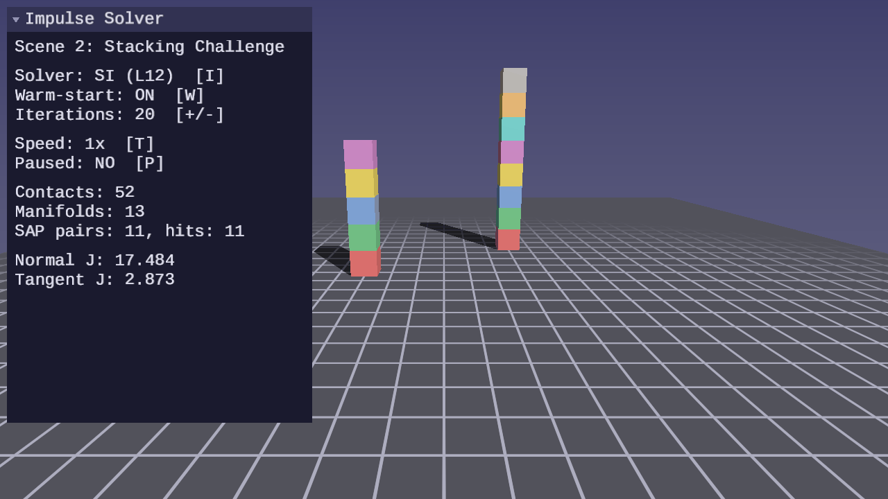
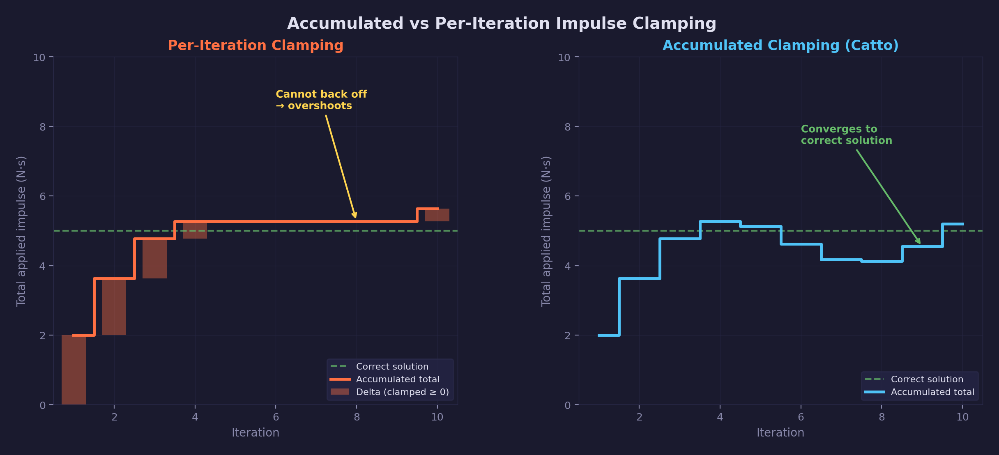
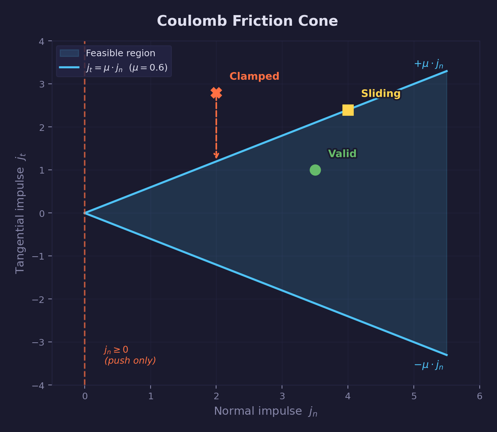
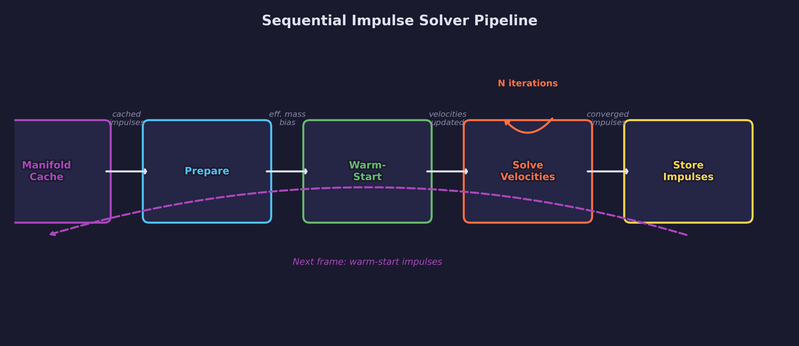

# Physics Lesson 12 — Impulse-Based Resolution

Catto's sequential impulse solver operating directly on contact manifolds.
Accumulated impulse clamping, warm-starting, and two-tangent friction
produce stable stacking without the drift that plagues per-iteration clamping.

## What you will learn

- Why per-iteration impulse clamping in Lesson 06 allows drift and how
  accumulated impulse clamping eliminates it
- Tangent basis construction: choosing two contact-frame tangent directions
  from the contact normal
- Effective mass precomputation: assembling the constraint matrix once per
  manifold and reusing it across all solver iterations
- Warm-starting: applying cached impulses from the previous frame before
  iterating, so the solver starts near the converged solution
- Baumgarte stabilization: a velocity bias term that corrects positional
  drift without position-level projection
- Two-tangent Coulomb friction: clamping each tangent impulse independently
  against the accumulated normal impulse (per-axis box approximation)
- The complete solver pipeline: prepare → warm-start → iterate → store

## Result




**Scene 1 — Impulse Inspector:** A single rigid body drops onto the ground
plane. The UI panel shows per-contact accumulated normal and tangent impulses,
the effective mass, the Baumgarte bias, and whether warm-starting is active.

**Scene 2 — Stacking Challenge:** Two stacks side by side — a 5-box stack
on the left and an 8-box stack on the right. The 5-box stack remains stable
with 20 solver iterations, demonstrating that the impulse solver produces
correct, converged results. The 8-box stack exceeds the solver's stability
limit and collapses, showing where additional techniques (Lesson 14) are
needed. Press I to switch between the SI solver and the Lesson 06 solver.

**Controls:**

| Key | Action |
|---|---|
| WASD / Mouse | Camera fly |
| P | Pause / resume |
| R | Reset simulation |
| T | Toggle slow motion |
| Tab | Cycle scenes |
| I | Toggle SI solver vs Lesson 06 solver |
| W | Toggle warm-starting (release mouse first) |
| + / - | Increase / decrease solver iterations |
| Escape | Release mouse / quit |

## The physics

### The gap between Lesson 11 and Lesson 06

Lesson 11 builds a contact manifold pipeline that stores accumulated impulses
per contact point across frames. Lesson 06 provides an iterative solver that
resolves contacts one at a time. The two are not yet connected: Lesson 06
clamps each impulse independently on each iteration, discarding the running
total between passes.

The distinction matters for friction. Coulomb's law constrains the total
friction impulse over the step, not the per-iteration increment. When the
solver clamps per-iteration, it can over-apply friction in early iterations
and under-apply in later ones. The accumulated error causes objects to drift
sideways on surfaces that should hold them still.

Catto's sequential impulse method ("Iterative Dynamics with Temporal
Coherence", GDC 2005) fixes this by clamping the *accumulated* impulse.
Each iteration computes a delta impulse, adds it to the running total, clamps
the total, and applies only the difference.

### Accumulated impulse clamping



For a single contact constraint, let $\lambda$ be the accumulated normal
impulse and $\Delta\lambda$ be the impulse computed this iteration:

$$
\lambda' = \max(\lambda + \Delta\lambda,\ 0)
$$

$$
\Delta\lambda_\text{applied} = \lambda' - \lambda
$$

$$
\lambda \leftarrow \lambda'
$$

The clamp $\lambda \geq 0$ enforces the non-penetration condition: contacts
can only push, never pull. Applying only the delta means the accumulated
impulse can never decrease below zero regardless of iteration order.

For friction along tangent direction $\hat{t}$, with accumulated tangent
impulse $\lambda_t$ and accumulated normal impulse $\lambda_n$:

$$
\lambda_t' = \text{clamp}(\lambda_t + \Delta\lambda_t,\
    -\mu\,\lambda_n, \mu\,\lambda_n)
$$

$$
\Delta\lambda_{t,\text{applied}} = \lambda_t' - \lambda_t
$$

$$
\lambda_t \leftarrow \lambda_t'
$$

This is Coulomb's friction law in impulse form: each tangent impulse
magnitude cannot exceed $\mu$ times the normal impulse magnitude. The
implementation clamps each tangent axis independently (a box region in
tangent space), which is a standard approximation used by most sequential
impulse solvers including Box2D. The exact Coulomb cone would clamp the
combined tangent vector $\sqrt{\lambda_{t1}^2 + \lambda_{t2}^2} \leq
\mu\,\lambda_n$, but the per-axis version is cheaper and produces
visually equivalent results. Because $\lambda_n$ has already been
clamped, the friction bound is always non-negative.



### Tangent basis construction

The contact normal $\hat{n}$ defines the constraint axis. Two tangent
directions $\hat{t}_1$ and $\hat{t}_2$ span the plane perpendicular to
$\hat{n}$. Any vector not parallel to $\hat{n}$ can seed the first tangent
via the least-aligned-axis cross-product method:

$$
\hat{t}_1 = \frac{\hat{n} \times \hat{u}}
                  {\|\hat{n} \times \hat{u}\|}
$$

$$
\hat{t}_2 = \hat{n} \times \hat{t}_1
$$

The seed vector $\hat{u}$ must not be parallel to $\hat{n}$.
`forge_physics_si_tangent_basis()` selects the world axis (X, Y, or Z)
whose component in $\hat{n}$ is smallest — the least-aligned axis — then
crosses $\hat{n}$ with that axis to produce $\hat{t}_1$, and stores both
tangents in the constraint struct.

### Effective mass precomputation

Each constraint involves two bodies (A and B) and one contact point. Define
the offset vectors from each body's center of mass to the contact point:

$$
\mathbf{r}_A = \mathbf{p}_c - \mathbf{x}_A, \qquad
\mathbf{r}_B = \mathbf{p}_c - \mathbf{x}_B
$$

The effective inverse mass along direction $\hat{d}$ is:

$$
m_\text{eff}^{-1} = m_A^{-1} + m_B^{-1} +
    \hat{d} \cdot \bigl[(I_A^{-1}(\mathbf{r}_A \times \hat{d})) \times \mathbf{r}_A\bigr] +
    \hat{d} \cdot \bigl[(I_B^{-1}(\mathbf{r}_B \times \hat{d})) \times \mathbf{r}_B\bigr]
$$

This quantity is constant for a given contact point and direction as long
as bodies do not move significantly within the step. Computing it once in
`forge_physics_si_prepare()` and storing it in `ForgePhysicsSIConstraint`
avoids repeating the cross-product chain on every iteration.

Each contact produces three constraints (one normal, two tangential), each
with its own precomputed effective mass.

### Warm-starting

The manifold cache from Lesson 11 stores the accumulated impulses after each
frame. At the start of the next frame, those impulses are a good initial guess:
bodies in sustained contact change slowly, so last frame's converged solution
is close to this frame's answer.

`forge_physics_si_warm_start()` applies the cached impulses before the first
iteration:

$$
\mathbf{v}_A \mathrel{+}= m_A^{-1}\,\lambda_n^{\text{prev}}\hat{n} +
    m_A^{-1}\,\lambda_{t1}^{\text{prev}}\hat{t}_1 +
    m_A^{-1}\,\lambda_{t2}^{\text{prev}}\hat{t}_2
$$

and the symmetric update for body B with opposite sign. The impulses are
loaded from `ForgePhysicsManifoldContact.normal_impulse`,
`tangent_impulse_1`, and `tangent_impulse_2`, which the manifold pipeline
populated via the persistent contact ID match in Lesson 11.

Without warm-starting, the solver starts from zero and must converge within
the allocated iteration budget. With warm-starting, early iterations refine
rather than rebuild, and the solver often converges in two to four passes.

### Baumgarte stabilization

The impulse solver corrects velocities, not positions. Integration error
accumulates over time: bodies drift together by a small amount each step.
Without correction this drift grows until visible interpenetration appears.

Baumgarte stabilization adds a velocity bias to the normal constraint that
pushes penetrating bodies apart:

$$
v_\text{bias} = \frac{\beta}{\Delta t}\,\max(\phi - \phi_\text{slop}, 0)
$$

where $\phi$ is the penetration depth (positive means overlap), $\phi_\text{slop}$
is a small allowed overlap (0.01 m by default) that prevents jitter from
overcorrection, and $\beta \in [0.1, 0.3]$ is the correction rate.

The bias is added to the target relative velocity at the contact:

$$
v_\text{target} = -e\,v_n + v_\text{bias}
$$

$$
\Delta\lambda = m_\text{eff}\,(v_\text{target} - v_n)
$$

where $e$ is the coefficient of restitution (zeroed at resting contact,
per the threshold from Lesson 06).

`forge_physics_si_prepare()` computes $v_\text{bias}$ and stores it
alongside the effective mass so each iteration applies the correct target.

### The complete solver pipeline



```text
/* Convert ground contacts to manifold format (before solver) */
forge_physics_si_rb_contacts_to_manifold(ground_contacts, ...)

/* The SI solver operates on the full manifold array at once */
forge_physics_si_prepare(manifolds, count, bodies, n, dt, warm, workspace)
forge_physics_si_warm_start(workspace, count, bodies, n)

for iter in [0, iterations):
    forge_physics_si_solve_velocities(workspace, count, bodies, n)

forge_physics_si_store_impulses(workspace, count, manifolds)
```

`forge_physics_si_solve()` wraps this entire pipeline — prepare, warm-start,
N iterations, and store — in a single call over the full manifold array.

## The code

### ForgePhysicsSIConstraint

Each constraint stores precomputed data for one contact point — the lever
arms, tangent basis, effective masses for all three directions, biases,
and accumulated impulses:

```c
typedef struct ForgePhysicsSIConstraint {
    vec3  r_a;              /* world offset: contact point - body_a COM   */
    vec3  r_b;              /* world offset: contact point - body_b COM   */
    vec3  t1;               /* tangent basis vector 1 (unit length)       */
    vec3  t2;               /* tangent basis vector 2 (unit length)       */
    float eff_mass_n;       /* 1 / K_n — effective mass along normal      */
    float eff_mass_t1;      /* 1 / K_t1 — effective mass along tangent 1  */
    float eff_mass_t2;      /* 1 / K_t2 — effective mass along tangent 2  */
    float velocity_bias;    /* Baumgarte penetration correction (m/s)     */
    float restitution_bias; /* bounce velocity from restitution (m/s)     */
    float j_n;              /* accumulated normal impulse (N·s)           */
    float j_t1;             /* accumulated friction impulse, tangent 1    */
    float j_t2;             /* accumulated friction impulse, tangent 2    */
} ForgePhysicsSIConstraint;
```

### ForgePhysicsSIManifold

One SI manifold corresponds to one `ForgePhysicsManifold` from the cache.
All contacts share the same normal, friction coefficients, and body pair:

```c
typedef struct ForgePhysicsSIManifold {
    int   body_a;           /* index of body A in the body array          */
    int   body_b;           /* index of body B, or -1 for ground          */
    vec3  normal;           /* shared contact normal (B toward A)         */
    float static_friction;  /* stored, not used by per-axis friction model */
    float dynamic_friction; /* per-axis friction limit coefficient, >= 0  */
    int   count;            /* active constraints, 0..4                   */
    ForgePhysicsSIConstraint constraints[FORGE_PHYSICS_MANIFOLD_MAX_CONTACTS];
} ForgePhysicsSIManifold;
```

### Using the solver

The high-level entry point wraps the entire pipeline:

```c
ForgePhysicsSIManifold workspace[MAX_MANIFOLDS];
forge_physics_si_solve(manifolds, manifold_count,
                       bodies, num_bodies,
                       10, PHYSICS_DT, true, workspace);
```

Internally this calls prepare, warm-start, N iterations of velocity
solving, and store — in that order. The workspace array is caller-allocated
to avoid heap allocation in the solver.

### Velocity solve (per-constraint)

For each contact, the solver resolves normal then friction:

```c
/* Normal: accumulated clamp ensures j_n >= 0 */
float delta_jn = eff_mass_n * (-(v_n - velocity_bias - restitution_bias));
float old_jn = sc->j_n;
sc->j_n = forge_fmaxf(sc->j_n + delta_jn, 0.0f);
float applied_jn = sc->j_n - old_jn;

/* Friction: per-axis Coulomb clamp using dynamic_friction * j_n */
float friction_limit = si->dynamic_friction * sc->j_n;
float delta_jt1 = eff_mass_t1 * (-v_t1);
float old_jt1 = sc->j_t1;
sc->j_t1 = forge_clampf(sc->j_t1 + delta_jt1, -friction_limit, friction_limit);
float applied_jt1 = sc->j_t1 - old_jt1;
```

The friction limit is recomputed after the normal impulse changes, so the
bound always reflects the current accumulated normal value.

### Ground contacts

`forge_physics_si_rb_contacts_to_manifold()` wraps `ForgePhysicsRBContact`
arrays (from `rb_collide_sphere_plane` / `rb_collide_box_plane`) into
`ForgePhysicsManifold` structs with `body_b = -1`, so the SI solver
processes ground and body-body contacts uniformly.

## Key concepts

- **Sequential impulse** — Resolving constraints one at a time in sequence,
  iterating until convergence. Each constraint resolution changes the system
  state immediately, so later constraints in the same pass see updated
  velocities.
- **Accumulated impulse clamping** — Clamping the total impulse applied over
  the step rather than the per-iteration delta, ensuring physical limits are
  respected across all iterations.
- **Effective mass** — The scalar resistance of a constrained body pair to
  impulse along a given direction, combining linear and rotational inertia.
- **Warm-starting** — Initializing accumulated impulses from the previous
  frame's converged values to reduce the iterations needed for convergence.
- **Baumgarte stabilization** — A velocity-level correction that bleeds
  positional error back into the velocity constraint, preventing slow drift
  without position-level projection.
- **Coulomb friction (per-axis)** — Each tangent impulse magnitude cannot
  exceed $\mu$ times the normal impulse magnitude; enforced via accumulated
  clamping on each tangent axis independently (box approximation of the
  exact Coulomb cone).
- **Tangent basis** — Two orthogonal vectors spanning the contact plane,
  constructed via the least-aligned-axis cross-product method from the contact normal.

## The physics library

This lesson adds the following to `common/physics/forge_physics.h`:

| Function / Type | Purpose |
|---|---|
| `ForgePhysicsSIConstraint` | Per-contact data: lever arms, tangent basis, effective masses, biases, accumulated impulses |
| `ForgePhysicsSIManifold` | Per-manifold SI state: body indices, normal, friction coefficients, constraint array |
| `forge_physics_si_tangent_basis()` | Construct two orthogonal tangent vectors from a contact normal |
| `forge_physics_si_prepare()` | Precompute effective mass, Baumgarte bias, and offset vectors for all constraints |
| `forge_physics_si_warm_start()` | Apply cached impulses from the manifold to body velocities |
| `forge_physics_si_solve_velocities()` | One iteration over all constraints with accumulated clamping |
| `forge_physics_si_store_impulses()` | Write converged impulses back into the manifold cache |
| `forge_physics_si_solve()` | Full pipeline: prepare, warm-start, iterate, store |
| `forge_physics_si_correct_positions()` | Push penetrating bodies apart along contact normal (position correction) |
| `forge_physics_si_rb_contacts_to_manifold()` | Wrap `ForgePhysicsRBContact` array into `ForgePhysicsManifold` for SI solver input |
| `forge_physics_rigid_body_integrate_velocities()` | Velocity-only integration step (for split-step solvers) |
| `forge_physics_rigid_body_integrate_positions()` | Position-only integration step (for split-step solvers) |

See: [common/physics/README.md](../../../common/physics/README.md)

## Where it is used

- [Physics Lesson 06 — Resting Contacts and Friction](../06-resting-contacts-and-friction/)
  provides the original per-contact solver that this lesson replaces; the
  `ForgePhysicsRBContact` type and `forge_physics_rb_resolve_contacts()`
  remain available and are used by the comparison toggle (I key)
- [Physics Lesson 11 — Contact Manifold](../11-contact-manifold/)
  provides `ForgePhysicsManifold`, the manifold cache, and the
  `normal_impulse` / `tangent_impulse_1` / `tangent_impulse_2` fields that
  warm-starting reads and the store step writes
- [Math Lesson 01 — Vectors](../../math/01-vectors/) — dot product and
  cross product are used throughout effective mass computation and tangent
  basis construction
- [Math Lesson 08 — Orientation](../../math/08-orientation/) — quaternion
  transforms convert body-local inertia tensors to world space

## Building

```bash
cmake -B build
cmake --build build --config Debug

# Windows
build\lessons\physics\12-impulse-based-resolution\Debug\12-impulse-based-resolution.exe

# Linux / macOS
./build/lessons/physics/12-impulse-based-resolution/12-impulse-based-resolution
```

## Exercises

1. Set restitution to 1.0 and drop a single sphere. The solver should
   return it to its original height on each bounce. Measure energy
   conservation: record the peak height each bounce and verify it stays
   constant. If it drifts, examine the Baumgarte bias — it adds energy to
   correct penetration.

2. Disable warm-starting (W key) and observe the 5-box stack. Increase
   the iteration count until it matches the warm-started stability.
   Record how many iterations are needed. This quantifies the convergence
   benefit of warm-starting.

3. Try to stabilize the 8-box stack by increasing solver iterations
   (= / - keys). Find the minimum iteration count that keeps it standing.
   Physics Lesson 14 covers the additional techniques (solver tuning,
   bias factors, visual contact debugging) needed for deep stacking.

4. Replace Baumgarte stabilization with split impulse position correction:
   separate the position correction impulse from the velocity correction
   impulse and apply the position correction directly to body positions
   rather than biasing velocities. Observe the effect on high-restitution
   objects.

## Further reading

- Catto, "Iterative Dynamics with Temporal Coherence" (GDC 2005) — the
  source of the sequential impulse method and accumulated clamping; the
  primary reference for this lesson
- Catto, "Modeling and Solving Constraints" (GDC 2009) — extends the method
  with position-level correction via pseudo-velocities
- Erin Catto, Box2D source code — canonical implementation of the sequential
  impulse solver; the `b2ContactSolver` is the direct C counterpart
- Gregorius, "Physics for Game Programmers: Understanding Constraints" (GDC
  2014) — derivation of effective mass and constraint Jacobians
- [Physics Lesson 06 — Resting Contacts and Friction](../06-resting-contacts-and-friction/)
- [Physics Lesson 11 — Contact Manifold](../11-contact-manifold/)
- [Math Lesson 01 — Vectors](../../math/01-vectors/)
- [Math Lesson 08 — Orientation](../../math/08-orientation/)
