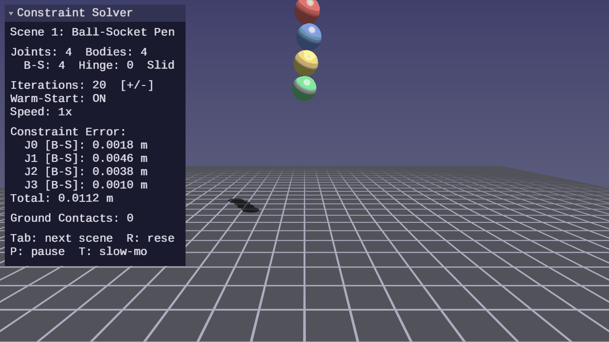
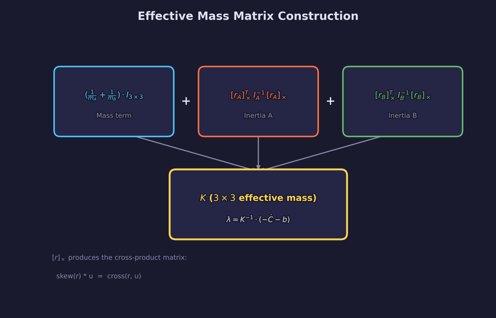
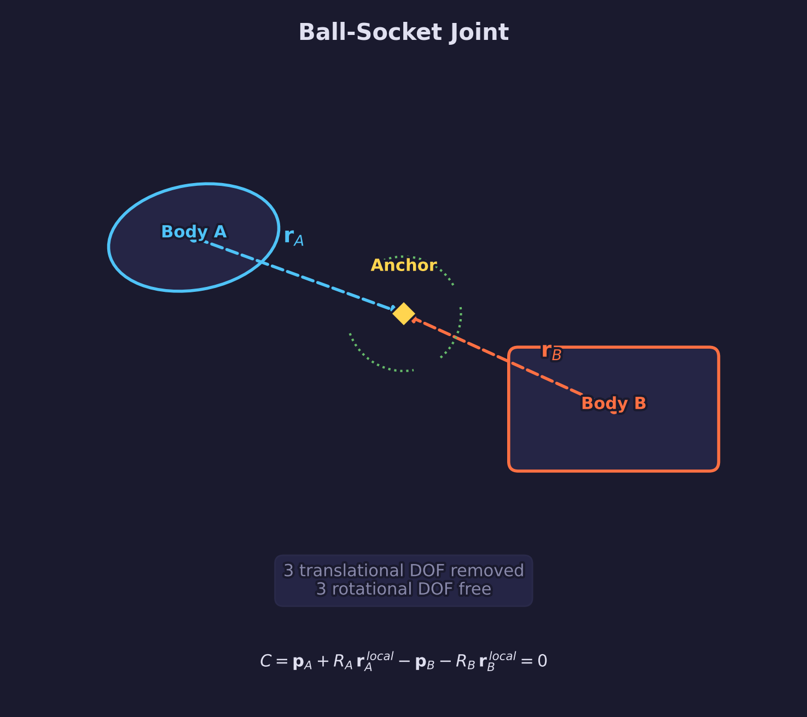
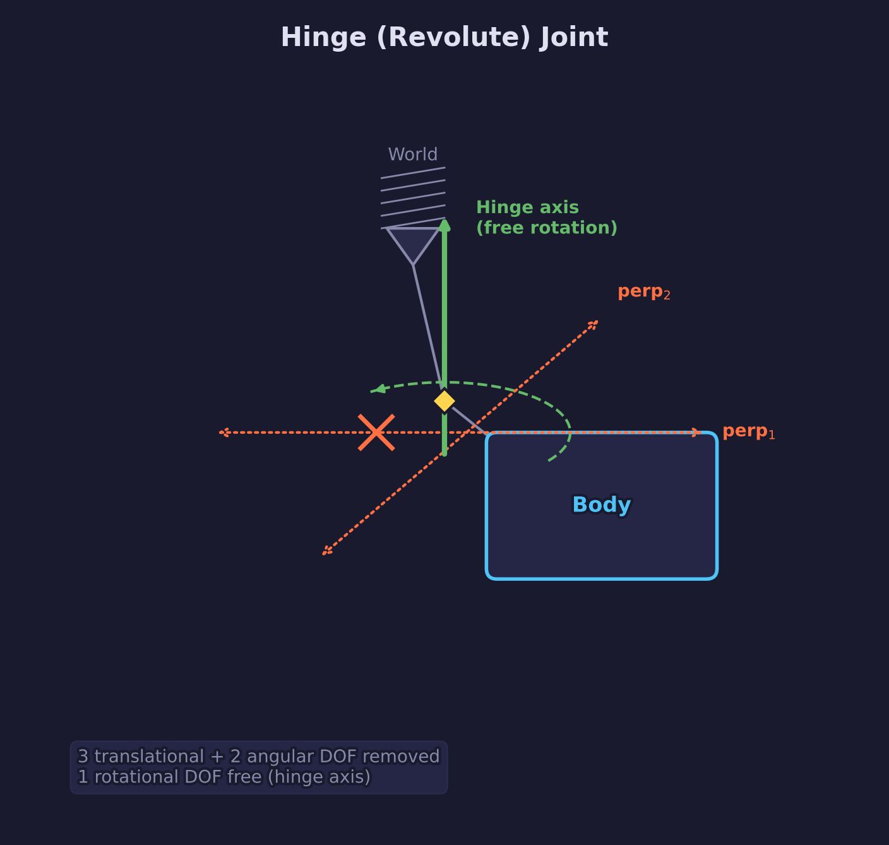
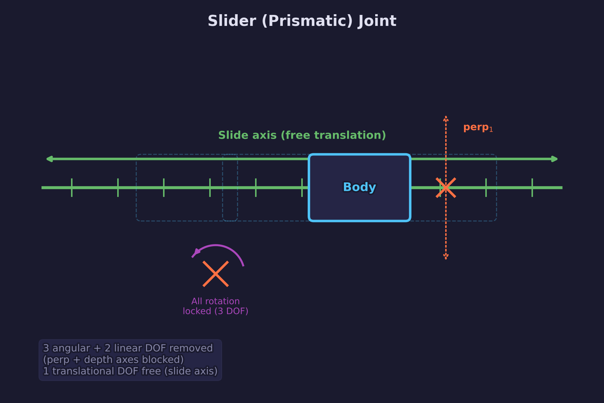
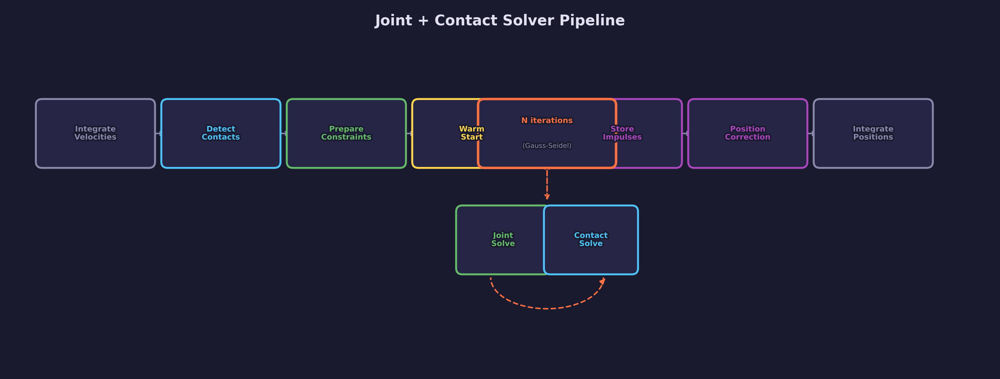

# Physics Lesson 13 — Constraint Solver

Generalized velocity-level joint constraints solved with sequential impulses.

## What you'll learn

- **Generalized constraints** — how velocity-level constraints remove degrees of freedom
- **The Jacobian and effective mass** — translating constraint equations into impulses
- **Ball-socket joints** — point constraint removing 3 translational DOF
- **Hinge joints** — point + angular constraints removing 5 DOF total
- **Slider joints** — angular lock + linear constraints removing 5 DOF total
- **Gauss-Seidel iteration** — solving joints and contacts in the same loop
- **Warm-starting joints** — using cached impulses for faster convergence
- **Baumgarte stabilization** — correcting positional drift at the velocity level

## Result




Four interactive scenes demonstrate each joint type. Bodies are connected
by constraints that restrict their relative motion — a pendulum chain
swings freely at ball-socket joints, a door rotates on a hinge axis, and
a piston slides along a single direction.

**Controls:**

| Key | Action |
|---|---|
| WASD / Arrows | Move camera |
| Mouse | Look around |
| Tab | Cycle scenes |
| R | Reset simulation |
| P | Pause / resume |
| T | Toggle slow motion |
| = / - | Adjust solver iterations |
| Escape | Release mouse / quit |

## The physics

### Velocity-level constraints

A constraint removes degrees of freedom from a pair of bodies by
requiring their relative velocity to satisfy an equation. For a
constraint function $C$ that should remain zero, the velocity
constraint is:

$$
\dot{C} = J \cdot v = 0
$$

where $J$ is the **Jacobian** (a row vector of partial derivatives)
and $v$ is the generalized velocity vector
$(v_a, \omega_a, v_b, \omega_b)$.

The solver computes an impulse $\lambda$ that, when applied to both
bodies, drives $\dot{C}$ toward zero:

$$
\lambda = -\frac{\dot{C} + b}{J \, M^{-1} \, J^T}
$$

where $b$ is the Baumgarte bias (position error correction) and
$J \, M^{-1} \, J^T$ is the **effective mass** — the resistance of
the system to the constraint impulse.

### The effective mass matrix

For a point constraint (ball-socket), the velocity at an anchor is:

$$
v_{anchor} = v + \omega \times r
$$

where $r$ is the lever arm from the body's center of mass to the
anchor. The relative velocity between the two anchors is:

$$
\dot{C} = (v_b + \omega_b \times r_b) - (v_a + \omega_a \times r_a)
$$

This is a 3D vector constraint (three scalar equations), so the
effective mass is a 3x3 matrix:

$$
K = \left(\frac{1}{m_a} + \frac{1}{m_b}\right) I_{3 \times 3} +
  [r_a]_{\times} \, I_a^{-1} \, [r_a]_{\times}^T +
  [r_b]_{\times} \, I_b^{-1} \, [r_b]_{\times}^T
$$

where $[r]_{\times}$ is the skew-symmetric (cross-product) matrix of
$r$. The impulse per iteration is:

$$
\lambda = K^{-1} \cdot (-\dot{C} - b)
$$

Unlike contact constraints (which clamp $\lambda_n \geq 0$ to prevent
pulling), equality joint constraints have **no clamping** — the
impulse can be positive or negative.



## Ball-socket joint



A ball-socket joint constrains two anchor points to coincide in world
space. The two bodies can rotate freely relative to each other, but
they cannot translate apart. This removes 3 translational DOF.

The constraint equation is:

$$
C = p_b + R_b \, a_b^{local} - p_a - R_a \, a_a^{local} = 0
$$

where $p$ is the body position, $R$ is the rotation matrix from the
body's orientation quaternion, and $a^{local}$ is the anchor in local
space.

The solver:

1. Transforms local anchors to world space
2. Computes lever arms $r_a$, $r_b$ from each body's COM
3. Builds the 3x3 effective mass matrix $K$ and inverts it
4. Computes the Baumgarte bias from the position error
5. Each iteration: computes relative velocity, multiplies by $K^{-1}$,
   applies the resulting impulse to both bodies

## Hinge joint



A hinge joint constrains two anchor points to coincide (like a
ball-socket) AND restricts relative rotation to a single axis. This
removes 5 DOF total: 3 translational + 2 rotational.

The angular constraint ensures that two axes perpendicular to the
hinge axis have zero relative angular velocity:

$$
\dot{C}_{ang,k} = \text{perp}_k \cdot (\omega_b - \omega_a) = 0
\quad (k = 1, 2)
$$

Each angular row has a scalar effective mass:

$$
m_{eff,k} = \frac{1}{\text{perp}_k \cdot I_a^{-1} \, \text{perp}_k
  + \text{perp}_k \cdot I_b^{-1} \, \text{perp}_k}
$$

The perpendicular axes are recomputed each frame from the hinge axis
direction using the least-aligned-axis method for numerical stability.

## Slider joint



A slider joint locks all relative rotation (3 DOF) and constrains
translation to a single axis (removes 2 more DOF). The body can only
slide back and forth along the specified direction.

**Angular constraint (3 DOF lock):** The relative orientation error
is extracted from the quaternion difference:

$$
q_{err} = q_b \cdot q_a^*
$$

The imaginary part of $q_{err}$ gives the angular error. The bias
drives this toward zero. The angular effective mass is:

$$
K_{ang} = I_a^{-1} + I_b^{-1}
$$

**Linear constraint (2 axes):** Translation perpendicular to the
slide axis is removed. For each perpendicular axis $p$:

$$
\dot{C}_{slide,k} = p_k \cdot \left(
  (v_b + \omega_b \times r_b) - (v_a + \omega_a \times r_a)
\right) = 0
$$

## Warm-starting joints

Joint constraints are persistent — they exist for the lifetime of the
connected bodies. This makes warm-starting simpler than for contacts
(which require spatial hashing and manifold matching).

The accumulated impulses from the previous frame are stored directly
on the joint struct. At the start of each frame, these impulses are
applied to the bodies before iteration begins. This gives the solver
a head start close to the converged solution.

Without warm-starting, the solver starts from zero impulses each frame
and must re-discover the solution. With 20 iterations, a pendulum
chain might show visible jitter. With warm-starting, the same chain
is stable with just 5-10 iterations.

## The combined pipeline



Joints and contacts are solved in the same iteration loop. Each
iteration applies one pass of joint velocity solving followed by one
pass of contact velocity solving. This interleaving is critical when
jointed bodies also rest on the ground — the joint and contact
constraints both act on the same body and must converge together.

```text
integrate_velocities
    |
detect_ground_contacts
    |
joint_prepare + si_prepare
    |
joint_warm_start + si_warm_start
    |
N iterations:
    joint_solve_velocities
    si_solve_velocities
    |
store_impulses
    |
position_correction
    |
integrate_positions
```

## Key concepts

- **Equality vs inequality constraints** — joints use unclamped impulses
  (can push or pull), contacts clamp normal impulse to non-negative
- **Effective mass** — measures how much the system resists the constraint
  impulse; depends on mass, inertia, and lever arm geometry
- **Baumgarte stabilization** — adds a bias velocity proportional to
  position error, correcting drift without explicit position projection
- **Gauss-Seidel** — constraints are solved sequentially; each constraint
  sees the impulses from all previously solved constraints in that
  iteration, which improves convergence over Jacobi (parallel) solving

## The physics library

This lesson adds the following to `common/physics/forge_physics.h`:

| Function | Purpose |
|---|---|
| `forge_physics_joint_ball_socket()` | Create a ball-socket (point) joint |
| `forge_physics_joint_hinge()` | Create a hinge (revolute) joint |
| `forge_physics_joint_slider()` | Create a slider (prismatic) joint |
| `forge_physics_joint_prepare()` | Precompute K matrices and bias |
| `forge_physics_joint_warm_start()` | Apply cached impulses |
| `forge_physics_joint_solve_velocities()` | One Gauss-Seidel iteration |
| `forge_physics_joint_store_impulses()` | Write back accumulated impulses |
| `forge_physics_joint_correct_positions()` | Baumgarte position correction |
| `forge_physics_joint_solve()` | All-in-one convenience wrapper |

New types: `ForgePhysicsJoint`, `ForgePhysicsJointType`,
`ForgePhysicsJointSolverData`

See: [common/physics/README.md](../../../common/physics/README.md)

## Where it's used

- [Physics Lesson 12](../12-impulse-based-resolution/) provides the
  sequential impulse contact solver that joints integrate with
- [Math Lesson 05](../../math/05-matrices/) covers matrices including
  the skew-symmetric matrix used for K matrix construction

## Building

```bash
cmake -B build
cmake --build build --config Debug

# Windows
build\lessons\physics\13-constraint-solver\Debug\13-constraint-solver.exe

# Linux / macOS
./build/lessons/physics/13-constraint-solver/13-constraint-solver
```

## Exercises

1. **Rope bridge** — Create a chain of ball-socket joints between two
   world anchors. Add enough bodies (8-12) to see it sag under gravity.
   Experiment with mass distribution.

2. **Joint limits** — Add angular limits to the hinge joint. Clamp the
   accumulated angular impulse when the angle exceeds the limit. This
   converts the equality constraint into an inequality constraint
   (one-sided clamping).

3. **Ragdoll** — Build a simple ragdoll with ball-socket joints at the
   shoulders and hips, hinge joints at the elbows and knees. Drop it
   from a height and observe the joint chain stabilization. Note: the
   current hinge joint stores the axis only in body A's local frame
   (`local_axis_a`). This works when both bodies share the same local
   axis direction at creation time. For asymmetric setups (bones at
   different rest orientations), add a `local_axis_b` field so each
   body tracks its own local-space axis independently.

4. **Convergence comparison** — Plot constraint error vs. iteration
   count with and without warm-starting. Use the UI panel's error
   display to collect data at different iteration counts.

## Further reading

- [Physics Lesson 12 — Impulse-Based Resolution](../12-impulse-based-resolution/)
  for the sequential impulse contact solver
- [Math Lesson 05 — Matrices](../../math/05-matrices/) for matrix
  operations including inverse and transpose
- [Math library reference](../../../common/math/) for `mat3`, inverse,
  transpose, and skew-matrix helpers in `forge_math.h`
- Erin Catto, "Iterative Dynamics with Temporal Coherence", GDC 2005
- Erin Catto, "Modeling and Solving Constraints", GDC 2009
- Baraff, "Physically Based Modeling", SIGGRAPH Course Notes
